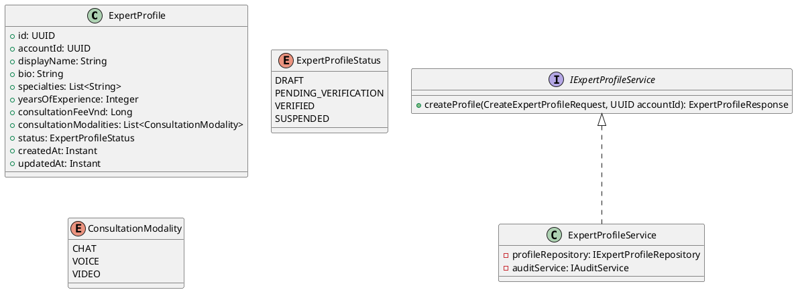
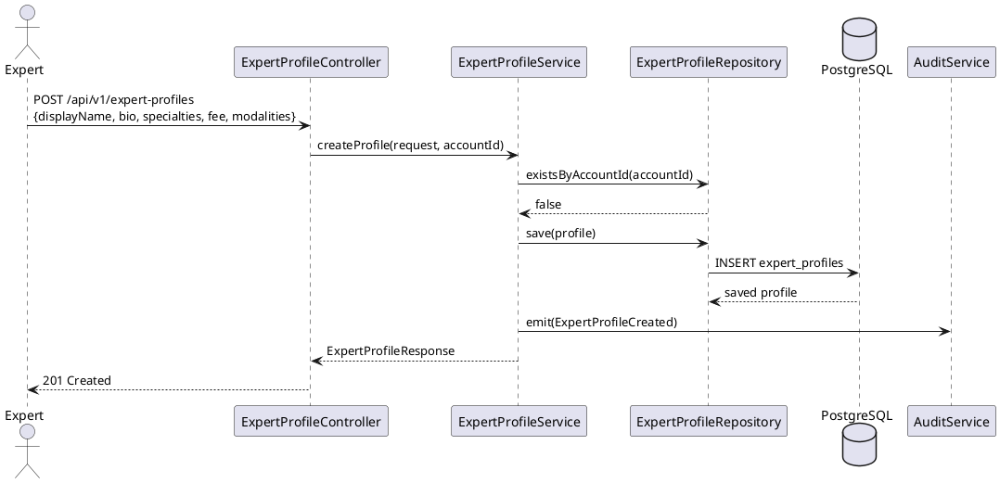
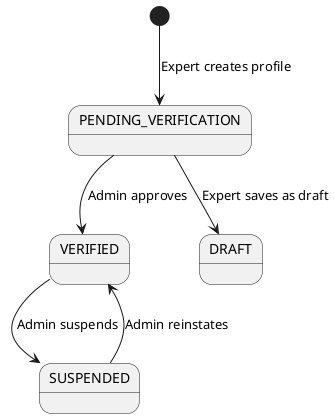

# ENGINEERING DOCUMENTATION STANDARD (EDS) v2.0
# UC-87 Create Expert Profile

| Field | Value |
|-------|-------|
| **Document ID** | `CB-EXP-IMP-001` |
| **Version** | `1.0` |
| **Date** | `2026-06-26` |
| **Status** | `Draft` |
| **Author** | `AI Agent` |
| **Based on EDS** | `v2.0` |

---

## CHANGELOG

| Ngày | Người thực hiện | Nội dung thay đổi |
|------|-----------------|-------------------|
| 2026-06-26 | AI Agent | Khởi tạo TDS cho UC-87 |

---

## MỤC LỤC

1. [Tổng quan Module](#1-tổng-quan-module)
2. [Ma trận Truy vết](#2-ma-trận-truy-vết-traceability-matrix)
3. [Architecture Decision Records (ADR)](#3-architecture-decision-records-adr)
4. [Non-Functional Requirements & SLA](#4-non-functional-requirements--sla)
5. [Static Modeling](#5-static-modeling)
6. [Dynamic Modeling](#6-dynamic-modeling)
7. [Domain Event Catalog](#7-domain-event-catalog)
8. [Interface Specification](#8-interface-specification)
9. [API Specification](#9-api-specification)
10. [Bảng mã lỗi](#10-bảng-mã-lỗi)
11. [Quy trình Triển khai](#11-quy-trình-triển-khai-step-by-step)
12. [Rollback & Incident Runbook](#12-rollback--incident-runbook)
13. [Kịch bản Kiểm thử Chi tiết](#13-kịch-bản-kiểm-thử-chi-tiết)
14. [Phương pháp Xác minh](#14-phương-pháp-xác-minh)
15. [Mẫu thử thực tế](#15-mẫu-thử-thực-tế-api-verification-samples)
16. [Bảng phân quyền](#16-bảng-phân-quyền)
17. [AI Prompt Constraints](#17-ai-prompt-constraints-case-20)

---

## 1. Tổng quan Module

| Field | Value |
|-------|-------|
| **Module Name** | `CreateExpertProfile` |
| **Bounded Context** | `expert` |
| **Data Classification** | `PII` |
| **Compliance Scope** | `PDPA` |
| **Upstream Dependencies** | `auth (AccountId from JWT)` |
| **Downstream Consumers** | `expert-directory, consultation, search` |

**Mô tả:** Expert tạo hồ sơ chuyên gia bao gồm chuyên môn, kinh nghiệm, phạm vi hỗ trợ. Hồ sơ bắt đầu ở trạng thái `PENDING_VERIFICATION` cho đến khi Admin duyệt.

---

## 2. Ma trận Truy vết

| Requirement ID | Loại | Mô tả | Thành phần Code | ADR liên quan |
|----------------|------|-------|-----------------|---------------|
| UC-87 | User Story | Create Expert Profile | `ExpertProfileController.POST /api/v1/expert-profiles` | ADR-EXP-001 |
| BR-RBAC | Business Rule | ROLE_EXPERT only | `ExpertProfileService.createProfile()` | ADR-EXP-001 |
| BR-CON | Business Rule | Auditable lifecycle | `AuditService.emit(ExpertProfileCreated)` | ADR-EXP-002 |
| ADR-EXP-001 | Decision | 1 active profile per account | `ExpertProfileRepository` | — |

---

## 3. Architecture Decision Records (ADR)

### ADR-EXP-001 — One active expert profile per account

| Field | Value |
|-------|-------|
| **Status** | `Accepted` |
| **Date** | `2026-06-26` |

#### Bối cảnh
Mỗi tài khoản Expert chỉ nên có 1 hồ sơ chuyên gia đang hoạt động để tránh thông tin mâu thuẫn.

#### Quyết định
Unique constraint `(account_id)` trên `expert_profiles` với `status IN (DRAFT, PENDING_VERIFICATION, VERIFIED)`. Tạo profile khi đã có 1 profile active → 409.

#### Hệ quả
- Tích cực: Tính nhất quán dữ liệu, tránh duplicate.
- Tiêu cực: Expert cần xóa profile cũ trước khi tạo mới.

### ADR-EXP-002 — Expert profile lifecycle

| Field | Value |
|-------|-------|
| **Status** | `Accepted` |
| **Date** | `2026-06-26` |

#### Quyết định
State machine: `DRAFT → PENDING_VERIFICATION → VERIFIED → SUSPENDED`. Expert tạo → `PENDING_VERIFICATION`. Admin duyệt → `VERIFIED`. Vi phạm → `SUSPENDED`. Mọi transition emit domain event.

---

## 4. Non-Functional Requirements & SLA

| Category | Requirement | Target SLA |
|----------|-------------|------------|
| Latency | POST /expert-profiles (p99) | `< 300ms` |
| Audit | Profile creation logged | 100% |

---

## 5. Static Modeling

### 5.1. Class Diagram



### 5.2. Flyway SQL Migration

```sql
-- V28__create_expert_profiles.sql

CREATE TYPE expert_profile_status AS ENUM (
  'DRAFT', 'PENDING_VERIFICATION', 'VERIFIED', 'SUSPENDED'
);
CREATE TYPE consultation_modality AS ENUM ('CHAT', 'VOICE', 'VIDEO');

CREATE TABLE expert_profiles (
  id                      UUID          PRIMARY KEY DEFAULT gen_random_uuid(),
  account_id              UUID          NOT NULL UNIQUE,
  display_name            VARCHAR(200)  NOT NULL,
  bio                     TEXT,
  specialties             TEXT[]        NOT NULL DEFAULT '{}',
  years_of_experience     INTEGER       NOT NULL CHECK (years_of_experience >= 0),
  consultation_fee_vnd    BIGINT        NOT NULL CHECK (consultation_fee_vnd >= 0),
  consultation_modalities consultation_modality[] NOT NULL DEFAULT '{}',
  status                  expert_profile_status NOT NULL DEFAULT 'PENDING_VERIFICATION',
  created_at              TIMESTAMPTZ   NOT NULL DEFAULT NOW(),
  updated_at              TIMESTAMPTZ   NOT NULL DEFAULT NOW()
);

CREATE INDEX idx_expert_profiles_account ON expert_profiles(account_id);
CREATE INDEX idx_expert_profiles_status ON expert_profiles(status);
```

---

## 6. Dynamic Modeling

### 6.1. Sequence Diagram — Happy Path



### 6.3. State Machine



---

## 7. Domain Event Catalog

### 7.1. Events Published

| Event Name | Trigger | Publisher | Subscriber(s) |
|------------|---------|-----------|---------------|
| `ExpertProfileCreated` | Profile saved | `ExpertProfileService` | `AuditService, NotificationService` |

---

## 8. Interface Specification

```java
// CreateExpertProfileRequest.java
public class CreateExpertProfileRequest {
    @NotBlank @Size(max = 200)
    private String displayName;
    @Size(max = 2000)
    private String bio;
    @NotEmpty
    private List<String> specialties;
    @Min(0) @Max(50)
    private Integer yearsOfExperience;
    @Min(0)
    private Long consultationFeeVnd;
    @NotEmpty
    private List<ConsultationModality> consultationModalities;
}

// IExpertProfileService.java
public interface IExpertProfileService {
    ExpertProfileResponse createProfile(CreateExpertProfileRequest request, UUID accountId);
}
```

---

## 9. API Specification

### 9.1. Endpoints

| Method | Path | Auth | Required Roles | Idempotent? |
|--------|------|------|----------------|-------------|
| `POST` | `/api/v1/expert-profiles` | JWT Bearer | `ROLE_EXPERT` | No |

### 9.2. Request / Response

**POST /api/v1/expert-profiles — 201 Created:**
```json
{
  "id": "uuid",
  "displayName": "Dr. Nguyen Van A",
  "specialties": ["obstetrics", "prenatal care"],
  "status": "PENDING_VERIFICATION",
  "createdAt": "2026-06-26T00:00:00Z"
}
```

---

## 10. Bảng mã lỗi

| Code | HTTP | Message | Trigger |
|------|------|---------|---------|
| `EXP-001` | 400 | Validation failed | Missing required fields |
| `EXP-002` | 409 | Expert profile already exists | accountId has active profile |
| `EXP-003` | 403 | Access denied | Non-EXPERT role |
| `EXP-004` | 500 | Internal error | Unexpected failure |

---

## 11. Quy trình Triển khai (Step-by-Step)

### 11.1. Prerequisites

- [ ] ADR-EXP-001 và ADR-EXP-002 đã được Accepted (xem §3)
- [ ] Account có ROLE_EXPERT đã tồn tại trong hệ thống
- [ ] Môi trường staging đã sẵn sàng

### 11.2. Pre-Migration Checklist

- [ ] Backup DB production: `pg_dump -h [host] -U [user] [db] > backup_YYYYMMDD.sql`
- [ ] Migration V28 đã chạy thành công trên staging ≥ 24 giờ
- [ ] Rollback script đã được test (xem §12)

### 11.3. Implementation Steps

#### Chặng 1 — Tạo Flyway migration V28

Tạo file: `src/main/resources/db/migration/V28__create_expert_profiles.sql`

```bash
./mvnw flyway:migrate
```

> ⚠️ **Chú ý:** `account_id UNIQUE` constraint sẽ reject duplicate nếu insert 2 profiles cùng account — đây là last line of defense sau application-level check (ADR-EXP-001).

#### Chặng 2 — Implement Entity và Repository

```java
// ExpertProfile.java — JPA Entity
@Entity
@Table(name = "expert_profiles")
public class ExpertProfile {
    @Id @GeneratedValue private UUID id;
    @Column(nullable = false, unique = true) private UUID accountId;
    @Column(nullable = false) private String displayName;
    @Enumerated(EnumType.STRING)
    private ExpertProfileStatus status; // default PENDING_VERIFICATION
    // ... other fields
}

// IExpertProfileRepository.java
public interface IExpertProfileRepository extends JpaRepository<ExpertProfile, UUID> {
    boolean existsByAccountId(UUID accountId);
}
```

#### Chặng 3 — Implement Service

```java
@Override
public ExpertProfileResponse createProfile(CreateExpertProfileRequest request, UUID accountId) {
    if (profileRepository.existsByAccountId(accountId)) {
        throw new ConflictException("EXP-002");
    }
    ExpertProfile profile = mapper.toEntity(request);
    profile.setAccountId(accountId);
    profile.setStatus(ExpertProfileStatus.PENDING_VERIFICATION);
    ExpertProfile saved = profileRepository.save(profile);
    auditService.emit(new ExpertProfileCreated(saved.getId(), accountId));
    return mapper.toResponse(saved);
}
```

#### Chặng 4 — Implement Controller

```java
@PostMapping("/api/v1/expert-profiles")
@PreAuthorize("hasRole('EXPERT')")
public ResponseEntity<ExpertProfileResponse> createProfile(
    @Valid @RequestBody CreateExpertProfileRequest request,
    @AuthenticationPrincipal JwtUser jwtUser
) {
    return ResponseEntity.status(201)
        .body(expertProfileService.createProfile(request, jwtUser.getAccountId()));
}
```

#### Chặng 5 — Verification sau deploy

```bash
curl -X GET https://[host]/api/v1/health
# Expected: {"status": "ok"}
```

### 11.4. Deployment Checklist

- [ ] Migration V28 chạy thành công
- [ ] Health check endpoint trả về 200
- [ ] Error rate < 1% trong 10 phút đầu
- [ ] Audit log sinh ra event `ExpertProfileCreated` đúng format
- [ ] Test tạo profile với ROLE_EXPERT → 201 PENDING_VERIFICATION
- [ ] Test tạo duplicate profile → 409 EXP-002

---

## 12. Rollback & Incident Runbook

### 12.1. Điều kiện kích hoạt Rollback

| Điều kiện | Ngưỡng | Người quyết định |
|-----------|--------|------------------|
| Error rate tăng đột biến | > 5% trong 5 phút | On-call Engineer |
| Latency p99 vượt ngưỡng | > 2x baseline | On-call Engineer |
| Expert profile status sai (VERIFIED thay vì PENDING_VERIFICATION) | Bất kỳ case nào | Tech Lead |
| Audit log ngừng hoạt động | > 1 phút | On-call Engineer |

### 12.2. Rollback Procedure

```bash
# Bước 1: Revert migration V28
psql -h $DB_HOST -U $DB_USER -d $DB_NAME \
  -c "DROP TABLE IF EXISTS expert_profiles CASCADE;"
psql -h $DB_HOST -U $DB_USER -d $DB_NAME \
  -c "DROP TYPE IF EXISTS expert_profile_status CASCADE;"
psql -h $DB_HOST -U $DB_USER -d $DB_NAME \
  -c "DROP TYPE IF EXISTS consultation_modality CASCADE;"
psql -h $DB_HOST -U $DB_USER -d $DB_NAME \
  -c "DELETE FROM flyway_schema_history WHERE version = '28';"

# Bước 2: Re-deploy phiên bản cũ
kubectl rollout undo deployment/carebridge-api

# Bước 3: Verify rollback thành công
kubectl rollout status deployment/carebridge-api
curl -X GET https://[host]/api/v1/health
```

### 12.3. Notification Protocol

| Thời điểm | Người nhận | Kênh | Template |
|-----------|------------|------|----------|
| Ngay khi phát hiện | On-call team | Slack `#incident` | "🚨 UC-87 expert profile incident: [mô tả]" |
| Trong 30 phút nếu PII bị ảnh hưởng | DPO | Email | Bắt buộc — PDPA |

### 12.4. Post-Incident Review (PIR)

> Bắt buộc hoàn thành PIR trong vòng 48 giờ sau khi resolve.

- **Root Cause:** 5 Whys analysis
- **Impact:** Số expert accounts ảnh hưởng
- **Prevention:** Thêm integration test cho status invariant

---

## 13. Kịch bản Kiểm thử Chi tiết

> **Policy (EDS v2.0):** Mọi test scenario dùng dữ liệu `SYNTHETIC`.

### 13.1. Unit Tests

#### TC-UNIT-001 — ROLE_EXPERT tạo profile thành công

```gherkin
Feature: Create Expert Profile
  Background:
    Given test data classification: SYNTHETIC
    And ACC-EXPERT-001 có ROLE_EXPERT, chưa có profile

  Scenario: Happy path → 201 PENDING_VERIFICATION
    When createProfile(validRequest, ACC-EXPERT-001) được gọi
    Then trả về ExpertProfileResponse với status=PENDING_VERIFICATION
    And profileRepository.save() được gọi 1 lần
    And auditService.emit(ExpertProfileCreated) được gọi 1 lần
```

#### TC-UNIT-002 — Duplicate profile → 409

```gherkin
  Scenario: Account đã có profile → 409
    Given ACC-EXPERT-001 đã có profile PENDING_VERIFICATION
    When createProfile(validRequest, ACC-EXPERT-001) được gọi
    Then throws ConflictException với code EXP-002
    And profileRepository.save() KHÔNG được gọi
```

#### TC-UNIT-003 — Initial status = PENDING_VERIFICATION

```gherkin
  Scenario: Status phải là PENDING_VERIFICATION sau khi tạo
    When createProfile(validRequest, ACC-EXPERT-001) được gọi
    Then profile.status == PENDING_VERIFICATION
    And profile.status != VERIFIED
    And profile.status != DRAFT
```

### 13.2. Integration Tests

#### TC-INT-001 — Profile persisted đúng trong DB

```gherkin
  Scenario: Profile persisted với đúng accountId và status
    Given test data classification: SYNTHETIC
    And ACC-EXPERT-001 chưa có profile trong DB
    When createProfile() được gọi
    Then expert_profiles table có 1 row với:
      | account_id | [ACC-EXPERT-001] |
      | status     | PENDING_VERIFICATION |
```

### 13.3. E2E / Security Tests

```gherkin
  Scenario: POST với ROLE_EXPERT → 201
    Given ACC-EXPERT-001 có JWT hợp lệ với ROLE_EXPERT
    When POST /api/v1/expert-profiles được gọi với valid body
    Then response status là 201
    And response.status == "PENDING_VERIFICATION"

  Scenario: POST với ROLE_MOTHER → 403
    Given ACC-MOTHER có JWT với ROLE_MOTHER
    When POST /api/v1/expert-profiles được gọi
    Then response status là 403
    And response.error.code == "EXP-003"
```

---

## 14. Phương pháp Xác minh

### 14.1. Database Inspection

```sql
-- Verify profile tồn tại sau khi tạo
SELECT id, account_id, display_name, status, created_at
FROM expert_profiles
WHERE account_id = '<uuid>';
-- Expected: 1 row với status='PENDING_VERIFICATION'

-- Verify không có VERIFIED profile được tạo trực tiếp
SELECT COUNT(*) FROM expert_profiles WHERE status = 'VERIFIED';
-- Expected: 0 (chỉ Admin mới có thể VERIFY)

-- Verify unique constraint
SELECT account_id, COUNT(*) FROM expert_profiles GROUP BY account_id HAVING COUNT(*) > 1;
-- Expected: 0 rows
```

### 14.2. Log / Audit Verification

```bash
# Verify ExpertProfileCreated event được emit
kubectl logs -l app=carebridge-api | grep '"eventType":"ExpertProfileCreated"' | head -5

# Verify event có đủ fields
kubectl logs -l app=carebridge-api | jq 'select(.eventType == "ExpertProfileCreated") | {eventId, occurredAt, payload}'
```

---

## 15. Mẫu thử thực tế (API Verification Samples)

### 15.1. Happy Path

```bash
# POST tạo expert profile
curl -X POST https://[host]/api/v1/expert-profiles \
  -H "Authorization: Bearer <EXPERT_JWT>" \
  -H "Content-Type: application/json" \
  -H "X-Correlation-Id: $(uuidgen)" \
  -d '{
    "displayName": "BS. Nguyen Thi A",
    "bio": "10 năm kinh nghiệm sản phụ khoa",
    "specialties": ["obstetrics", "prenatal_care"],
    "yearsOfExperience": 10,
    "consultationFeeVnd": 200000,
    "consultationModalities": ["VIDEO"]
  }'
```

**Expected Response (201):**
```json
{
  "id": "550e8400-e29b-41d4-a716-446655440000",
  "displayName": "BS. Nguyen Thi A",
  "specialties": ["obstetrics", "prenatal_care"],
  "status": "PENDING_VERIFICATION",
  "createdAt": "2026-06-26T00:00:00.000Z"
}
```

### 15.2. Error Paths

```bash
# Duplicate profile → 409
curl -X POST https://[host]/api/v1/expert-profiles \
  -H "Authorization: Bearer <EXPERT_JWT_ALREADY_HAS_PROFILE>" \
  -H "Content-Type: application/json" \
  -d '{"displayName": "BS. Nguyen", "specialties": ["obs"], "yearsOfExperience": 5, "consultationFeeVnd": 100000, "consultationModalities": ["CHAT"]}'
```

**Expected Response (409):**
```json
{
  "error": {
    "code": "EXP-002",
    "message": "Expert profile already exists"
  }
}
```

```bash
# ROLE_MOTHER → 403
curl -X POST https://[host]/api/v1/expert-profiles \
  -H "Authorization: Bearer <MOTHER_JWT>"
```

**Expected Response (403):**
```json
{
  "error": {
    "code": "EXP-003",
    "message": "Access denied"
  }
}
```

---

## 16. Bảng phân quyền

| Endpoint | `GUEST` | `ROLE_MOTHER` | `ROLE_EXPERT` | `ROLE_ADMIN` |
|----------|---------|---------------|---------------|--------------|
| `POST /api/v1/expert-profiles` | ❌ | ❌ | ✅ Own | ✅ |

---

## 17. AI Prompt Constraints (CASE 2.0)

### 17.1 Constraint Summary

| # | Constraint | Source |
|---|-----------|--------|
| C1 | accountId MUST be extracted from JWT SecurityContext, NEVER from request body | ADR-EXP-001 |
| C2 | ROLE_EXPERT check before any write operation | BR-RBAC |
| C3 | Check duplicate profile (existsByAccountId) before save; throw EXP-002 if exists | ADR-EXP-001 |
| C4 | New profile status MUST be PENDING_VERIFICATION, not VERIFIED | ADR-EXP-002 |
| C5 | AuditService.emit(ExpertProfileCreated) after successful save | BR-CON |

### 17.2 Constraint Injection Block (Copy-Paste vào AI Prompt)

```
[CONSTRAINT BLOCK — Module: CreateExpertProfile (CB-EXP-IMP-001)]
Theo TDS CB-EXP-IMP-001 và các ADR liên quan:

1. (C1 — ADR-EXP-001) accountId PHẢI extract từ JWT SecurityContext — KHÔNG nhận từ request body.
2. (C2 — BR-RBAC) ROLE_EXPERT required; ROLE_MOTHER và unauthenticated → 403 EXP-003.
3. (C3 — ADR-EXP-001) existsByAccountId(accountId) PHẢI được gọi trước save() → throw EXP-002 nếu đã tồn tại.
4. (C4 — ADR-EXP-002) Initial status = PENDING_VERIFICATION — KHÔNG bao giờ là VERIFIED hay DRAFT ngay khi tạo.
5. (C5 — BR-CON) Emit ExpertProfileCreated event qua AuditService SAU KHI save() thành công.

[CONTEXT BLOCK]
- Bounded Context: expert
- Data Classification: PII
- Compliance: PDPA
- Existing interfaces: §8 Service Interface
- Error codes: EXP-001 to EXP-004 (§10)
- Auth matrix: §16

[TASK BLOCK]
Implement ExpertProfileService.createProfile() thỏa mãn constraints trên.
Output phải tuân thủ §8 Interface Specification.
Tests phải cover §13 Test Scenarios.
```

### 17.3 Constraint Quality Checklist

- [x] Mỗi constraint traceable về ADR hoặc BR cụ thể
- [x] Không có constraint generic
- [x] Constraint block có ≥ 5 constraints cụ thể
- [x] Reference §8 Interface
- [x] Reference §16 Auth Matrix

### 17.4 Anti-Pattern Detection

| AP-ID | Anti-Pattern | Dấu hiệu | Hành động |
|-------|-------------|-----------|----------|
| AP-AI-001 | Unconstrained Gen | Code không check existsByAccountId trước save | Reject — C3 violation |
| AP-AI-003 | Implicit Decision | Code set status=VERIFIED thay vì PENDING_VERIFICATION | Reject — ADR-EXP-002 violation |
| AP-AI-005 | Hallucinated Contract | Code import IExpertProfileService method không có trong §8 | Reject — verify contract |

---

## PHỤ LỤC

### A. Glossary (Thuật ngữ)

| Thuật ngữ | Định nghĩa |
|-----------|------------|
| Expert Profile | Hồ sơ chuyên gia: thông tin chuyên môn, kinh nghiệm, phí tư vấn |
| PENDING_VERIFICATION | Trạng thái hồ sơ: chờ Admin duyệt trước khi được hiển thị public |
| Consultation Modality | Hình thức tư vấn: CHAT, VOICE, VIDEO |
| ADR-EXP-001 | Architecture Decision: 1 active profile per account |
| ADR-EXP-002 | Architecture Decision: lifecycle DRAFT → PENDING_VERIFICATION → VERIFIED → SUSPENDED |
| Append-only | Không DELETE profile — chỉ thay đổi status |

### B. Tài liệu tham chiếu

| Document | Link / Path |
|----------|-------------|
| PDPA Vietnam | [Link] |
| EDS v2.0 Template | `08_References/Template/PHASE-3_TDS.md` |
| CASE 2.0 Methodology | `08_References/` |
| ExpertProfileRepository | `05_Development/CareBridgeAPI/src/main/java/com/carebridge/expert/` |

---

*EDS v2.1 — Tích hợp CASE 2.0 AI Prompt Constraints (§17).*
