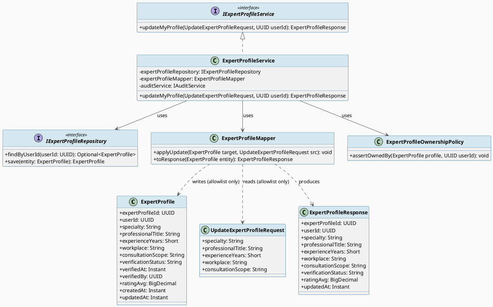
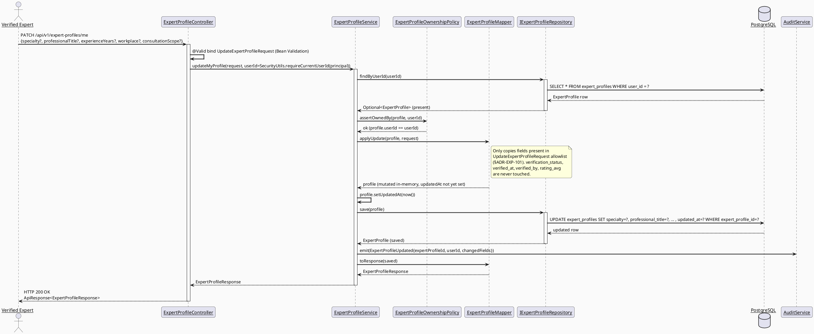
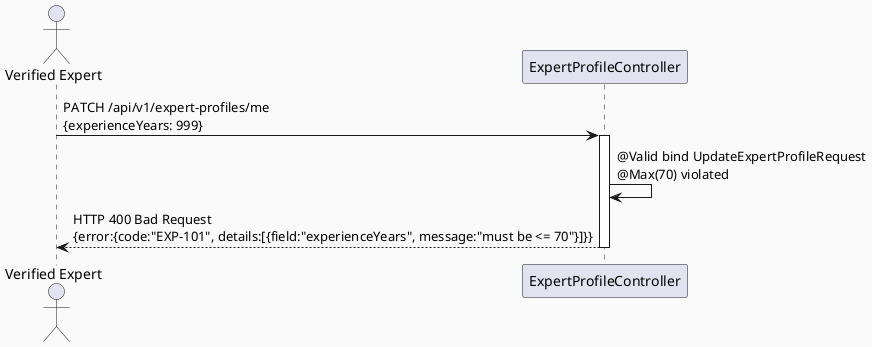
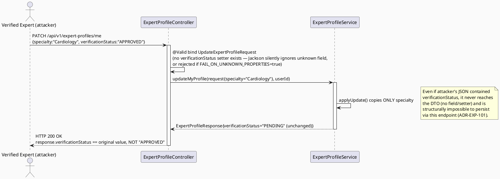
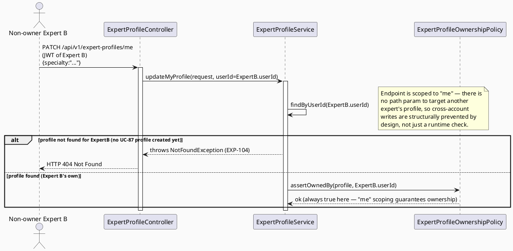

# ENGINEERING DOCUMENTATION STANDARD (EDS) v2.0
# UC-88 Update Expert Profile

| Field | Value |
|-------|-------|
| **Document ID** | `CB-EXP-IMP-002` |
| **Version** | `1.0` |
| **Date** | `2026-07-02` |
| **Status** | `Draft` |
| **Document Owner** | `TV4 - Lâm` |
| **Author** | `AI Agent` |
| **Reviewed by** | `[ ] Pending` |
| **DPO Sign-off** | `[ ] Pending` *(module carries PII — public professional profile)* |
| **Approved by** | `[ ] Pending` |
| **Last Review** | `2026-07-02` |
| **Based on EDS** | `v2.0` |

---

## CHANGELOG

| Ngày | Người thực hiện | Nội dung thay đổi |
|------|-----------------|-------------------|
| 2026-07-02 | AI Agent | Khởi tạo TDS cho UC-88, đồng bộ với schema thật `V1__init_schema.sql` (khác với TDS UC-87 hiện có, xem §Open Items) |

---

## MỤC LỤC

1. [Tổng quan Module](#1-tổng-quan-module)
2. [Ma trận Truy vết (Traceability Matrix)](#2-ma-trận-truy-vết-traceability-matrix)
3. [Architecture Decision Records (ADR)](#3-architecture-decision-records-adr)
4. [Non-Functional Requirements & SLA](#4-non-functional-requirements--sla)
5. [Static Modeling](#5-static-modeling-mô-hình-tĩnh)
6. [Dynamic Modeling](#6-dynamic-modeling-mô-hình-động)
7. [Domain Event Catalog](#7-domain-event-catalog)
8. [Interface Specification](#8-interface-specification-đặc-tả-giao-diện)
9. [API Specification](#9-api-specification)
10. [Bảng mã lỗi (Error Codes)](#10-bảng-mã-lỗi-error-codes)
11. [Quy trình Triển khai (Step-by-Step)](#11-quy-trình-triển-khai-step-by-step)
12. [Rollback & Incident Runbook](#12-rollback--incident-runbook)
13. [Kịch bản Kiểm thử Chi tiết](#13-kịch-bản-kiểm-thử-chi-tiết)
14. [Phương pháp Xác minh](#14-phương-pháp-xác-minh)
15. [Mẫu thử thực tế (API Verification Samples)](#15-mẫu-thử-thực-tế-api-verification-samples)
16. [Bảng tổng hợp phân quyền (Authorization Matrix)](#16-bảng-tổng-hợp-phân-quyền-authorization-matrix)
17. [AI Prompt Constraints (CASE 2.0)](#17-ai-prompt-constraints-case-20)
18. [Open Items / Research Gate](#18-open-items--research-gate)

---

## 1. Tổng quan Module

| Field | Value |
|-------|-------|
| **Module Name** | `UpdateExpertProfile` |
| **Bounded Context** | `expert` (backend package `com.carebridge.backend.expert`) |
| **Data Classification** | `PII` (professional identity + public display data) |
| **Compliance Scope** | `PDPA` |
| **Upstream Dependencies** | `auth` (JWT → `userId`), UC-87 Create Expert Profile (profile must already exist) |
| **Downstream Consumers** | UC-81 View Expert Profile, UC-80 View Expert Directory, UC-164 Search Expert, UC-90 Configure Availability, UC-75 Book Private Consultation |

**Mô tả:** Cho phép một Verified Expert (chủ sở hữu) cập nhật các trường thông tin công khai/nghề nghiệp trên hồ sơ chuyên gia của chính họ (`expert_profiles`), ví dụ: chuyên khoa, chức danh, số năm kinh nghiệm, nơi làm việc, phạm vi tư vấn. Endpoint này **không được phép** thay đổi các trường xác thực (`verification_status`, `verified_at`, `verified_by`) — các trường này chỉ do quy trình Admin duyệt (UC-89 Upload Verification Documents + Admin review flow, ngoài phạm vi) ghi.

**Vị trí trong vòng đời hồ sơ:** UC-87 (Create) tạo `expert_profiles` row với `verification_status='PENDING'`. UC-88 (Update, tài liệu này) cho phép expert chỉnh sửa nội dung hồ sơ bất kể đang `PENDING` hay đã `APPROVED`/verified — việc sửa profile field không tự động reset trạng thái xác thực (xem ADR-EXP-101). UC-89 (Upload Verification Documents) là kênh riêng để nộp `expert_credentials`.

---

## 2. Ma trận Truy vết (Traceability Matrix)

| Requirement ID | Loại (BR/ADR/US) | Mô tả yêu cầu | Thành phần Code | Compliance Target | ADR liên quan |
|----------------|------------------|---------------|-----------------|-------------------|---------------|
| UC-88 (SRS §3.2.1.2, dòng 775-794) | User Story | Verified Expert updates own profile/public display info | `ExpertProfileController.PATCH /api/v1/expert-profiles/me` | — | ADR-EXP-101 |
| BR-RBAC | Business Rule | Users may access only functions allowed by role/permission scope | `@PreAuthorize("hasRole('EXPERT')")` + ownership check in `ExpertProfileService.updateMyProfile()` | — | ADR-EXP-101 |
| BR-CONSULTATION | Business Rule | Consultation-adjacent records keep auditable lifecycle state | `AuditService.emit(ExpertProfileUpdated)`; `verification_status` immutable via this endpoint | — | ADR-EXP-102 |
| PRE-3 (SRS common preconditions) | Precondition | Actor authenticated with required role | Spring Security filter chain + `SecurityUtils.requireCurrentUserId()` | — | — |
| POST-3 (SRS common postconditions) | Postcondition | Sensitive actions recorded for audit | `ExpertProfileUpdated` domain event | PDPA | ADR-EXP-102 |
| E1 (SRS Exceptions) | Exception | Access denied when unauthenticated/unauthorized/out-of-scope | 401/403 responses, EXP-1xx codes | — | ADR-EXP-101 |
| E2 (SRS Exceptions) | Exception | Invalid/missing/conflicting data rejected with field-level message | Bean Validation on `UpdateExpertProfileRequest`; EXP-101 | — | ADR-EXP-103 |
| ADR-EXP-101 | Decision | Editable-field allowlist; ownership-only write | `UpdateExpertProfileRequest`, `ExpertProfileMapper.applyUpdate()` | — | — |
| ADR-EXP-102 | Decision | `verification_status`/`verified_at`/`verified_by` locked from this endpoint | `ExpertProfileMapper.applyUpdate()` (whitelist copy, never touches locked columns) | — | — |
| ADR-EXP-103 | Decision | Field-level validation rules for public display data | `UpdateExpertProfileRequest` Bean Validation annotations | — | — |

---

## 3. Architecture Decision Records (ADR)

### ADR-EXP-101 — Editable-field allowlist and ownership-only write

| Field | Value |
|-------|-------|
| **Status** | `Accepted` |
| **Deciders** | `AI Agent (Technical Architect role)` |
| **Date** | `2026-07-02` |

#### Bối cảnh (Context)
`expert_profiles` (per `V1__init_schema.sql` lines 786-800) mixes expert-editable public/professional fields with admin-controlled verification fields in a single table. If the update endpoint blindly binds the full entity from the request body, an expert could set `verification_status = 'APPROVED'` on themselves — a critical self-escalation vulnerability. There is no separate "public profile" vs "verification" table split in the current schema, so the boundary must be enforced at the DTO/mapper layer, not the schema layer.

#### Các phương án đã xem xét (Options Considered)

| Phương án | Mô tả | Ưu điểm | Nhược điểm |
|-----------|-------|----------|------------|
| A | Bind full `ExpertProfile` entity from request body (naive PATCH) | Simple to implement | Critical security flaw — self-approval of verification status |
| B | DTO with explicit allowlist of editable fields only; mapper copies only those fields onto the loaded entity | Blocks self-escalation at the type level; verification fields never appear in the request DTO | Requires a dedicated admin-only endpoint later for verification actions (out of scope, flagged Open) |
| C | Full entity bind + server-side field-diff rejection (compare and 400 if locked field changed) | Allows client to "see" the attempt and get a specific error | More complex; still requires the same allowlist logic, only adds error nuance |

#### Quyết định (Decision)
Chọn **Phương án B**: `UpdateExpertProfileRequest` DTO chỉ chứa các trường editable liệt kê dưới đây. Bất kỳ trường nào không có trong DTO (kể cả nếu client gửi thêm JSON key) sẽ bị Jackson bỏ qua (không có setter tương ứng) và **không bao giờ** được service/mapper ghi vào entity.

**Editable-field allowlist (ghi bởi UC-88):**

| Column (`expert_profiles`) | Type (schema) | Request field | Editable? |
|---|---|---|---|
| `specialty` | `varchar(100)` | `specialty` | ✅ Editable |
| `professional_title` | `varchar(150)` | `professionalTitle` | ✅ Editable |
| `experience_years` | `smallint` | `experienceYears` | ✅ Editable |
| `workplace` | `varchar(200)` | `workplace` | ✅ Editable |
| `consultation_scope` | `text` | `consultationScope` | ✅ Editable |

**Immutable / admin-only columns (locked — this endpoint MUST NOT write these):**

| Column (`expert_profiles`) | Owner / write path |
|---|---|
| `expert_profile_id` | System-generated, immutable |
| `user_id` | System-generated at UC-87 create time, immutable (ownership key) |
| `verification_status` | Admin verification workflow only (out of scope of UC-88) |
| `verified_at` | Admin verification workflow only |
| `verified_by` | Admin verification workflow only |
| `rating_avg` | Derived/computed from `expert_reviews`, never client-writable |
| `created_at` | System-generated, immutable |
| `updated_at` | System-managed (set to `now()` by service on every successful update) |

Ownership: `user_id` on the loaded `ExpertProfile` row MUST equal the JWT-authenticated `userId`. No admin-override path exists in this endpoint (see §18 Open Items — admin override is explicitly out of scope and flagged Open).

#### Hệ quả (Consequences)

**Tích cực:**
- Self-escalation of `verification_status` is structurally impossible — the field does not exist in the write DTO.
- Clear single source of truth for "what can an expert edit" that downstream engineers and reviewers can check in one table.

**Tiêu cực / Trade-offs:**
- Any future field added to `expert_profiles` requires an explicit TDS/ADR update to become editable — intentional friction to prevent silent scope creep.

**Compliance Impact:**
- PDPA: expert retains control over their own public professional data (right to rectification) while sensitive verification/audit fields remain admin-controlled and auditable.

---

### ADR-EXP-102 — Update does not require re-verification; audit trail via domain event

| Field | Value |
|-------|-------|
| **Status** | `Accepted` |
| **Date** | `2026-07-02` |

#### Bối cảnh (Context)
SRS BR-CONSULTATION requires consultation-adjacent records (which include the expert profile that underpins consultation bookings) to keep an auditable lifecycle state. The question: does editing `specialty`/`bio`-like fields force `verification_status` back to `PENDING`?

#### Quyết định (Decision)
No automatic status reset. `verification_status` stays untouched by UC-88. Every successful update emits `ExpertProfileUpdated` (§7) with a diff of changed fields for audit purposes. This keeps the verification lifecycle (owned by Admin) decoupled from routine profile edits (owned by Expert), matching the principle in ADR-EXP-101 that these are two separate write authorities on the same table.

> **Marked Open for Product/Admin-flow decision:** should material changes to `specialty`/`professional_title` re-trigger admin review? Not specified in SRS UC-88/UC-89. See §18 Open Items OI-3.

#### Hệ quả (Consequences)

**Tích cực:** Experts can fix typos/update bio without re-verification friction; audit event still captures the change for Admin/Moderator review if needed.

**Tiêu cực / Trade-offs:** An expert verified for "Obstetrics" could edit `specialty` to "Pediatrics" without new verification — flagged as Open Item OI-3, recommend downstream Admin dashboard surfaces recently-edited verified profiles for spot-check (not built in this UC).

---

### ADR-EXP-103 — Field-level validation rules

| Field | Value |
|-------|-------|
| **Status** | `Accepted` |
| **Date** | `2026-07-02` |

#### Bối cảnh (Context)
`expert_profiles` schema constrains types (`varchar(100)`, `varchar(150)`, `smallint`, `varchar(200)`, `text`) but not business-level bounds (e.g., realistic experience years, non-empty display fields). SRS E2 requires "invalid, missing, expired, or conflicting data is rejected with a field-level message."

#### Quyết định (Decision)
Apply Bean Validation at the DTO layer, sized to match column limits plus sane business bounds:

| Field | Validation |
|---|---|
| `specialty` | `@Size(max = 100)`, optional (nullable — partial update allowed) |
| `professionalTitle` | `@Size(max = 150)`, optional |
| `experienceYears` | `@Min(0) @Max(70)`, optional |
| `workplace` | `@Size(max = 200)`, optional |
| `consultationScope` | `@Size(max = 5000)` (business bound; column is `text`/unbounded), optional |

All fields optional/nullable at the DTO level to support **partial update (PATCH semantics)** — only non-null fields in the request are applied; omitted fields keep their current DB value. At least one field must be present, or the request is rejected as EXP-101 (empty update).

**Specialty taxonomy source:** SRS and schema do not define a canonical enum/reference table for `specialty` (`varchar(100)` free text in schema — no FK to a taxonomy table in `V1__init_schema.sql`). Marked **Open** — see §18 Open Items OI-1. This TDS implements `specialty` as free-text within `@Size(max=100)` for schema fidelity; no migration is introduced to add a taxonomy table since that would exceed this UC's minimal scope.

#### Hệ quả (Consequences)
**Tích cực:** Guarantees no DB-level truncation errors reach the client as raw 500s; consistent partial-update semantics with other CareBridge update endpoints (e.g., UC-09 UpdateAccountProfile).
**Tiêu cực / Trade-offs:** Free-text `specialty` allows inconsistent taxonomy across experts (typos, synonyms) until a taxonomy reference table is introduced in a future UC.

---

## 4. Non-Functional Requirements & SLA

### 4.1. Performance & Availability

| Category | Requirement | Target SLA | Measurement Method | Compliance Basis |
|----------|-------------|------------|---------------------|------------------|
| Latency | `PATCH /api/v1/expert-profiles/me` (p99) | `< 300ms` | Manual timing / future k6 | — |
| Availability | Uptime (monthly) | `99.9%` | Uptime monitor | — |

### 4.2. Data Integrity & Retention

| Category | Requirement | Target | Verification Method | Compliance Basis |
|----------|-------------|--------|---------------------|------------------|
| Durability | Zero record loss on update | RPO = 0 | Transaction-scoped JPA save | GDPR/PDPA data integrity |
| Consistency | `updated_at` always reflects last write | 100% | `@PreUpdate` / service-set timestamp | — |
| Immutability | `verification_status`/`verified_at`/`verified_by` never mutated by this endpoint | 100% | Unit test EXP-TC-006/007; DB inspection §14.1 | ADR-EXP-101 |

### 4.3. Security

| Category | Requirement | Target | Verification Method | Compliance Basis |
|----------|-------------|--------|---------------------|------------------|
| Access control | Owner-only write (own `user_id` match) | 100% enforced | Unit + E2E ownership tests | BR-RBAC |
| Access control | Role-based | `EXPERT` role required | `@PreAuthorize("hasRole('EXPERT')")` | BR-RBAC |
| Input validation | Reject oversized/invalid fields | 100% | Bean Validation tests | ADR-EXP-103 |
| Mass-assignment protection | Locked fields never bindable from request | 100% | EXP-TC-006 tampering test | ADR-EXP-101 |

### 4.4. Scalability & Capacity Planning
Expected load: low-to-moderate (bounded by number of Verified Experts on the platform, expected < 10k in near term). No special scaling strategy needed beyond standard connection pooling already configured for the modular monolith.

---

## 5. Static Modeling (Mô hình Tĩnh)

### 5.1. Class Diagram (PlantUML)



### 5.2. Data Structure (Flyway SQL Migration)

**No schema migration required.** `expert_profiles` already exists in `V1__init_schema.sql` (lines 786-800) with all columns needed by this UC's allowlist (§ADR-EXP-101). This UC is a pure application-layer feature (JPA entity mapping + service/controller/DTO/mapper + React UI) against the existing table.

> If a future decision requires a `specialty` taxonomy reference table (see §18 OI-1), that would be introduced under a **separate** migration version reserved outside this UC's assigned range (`V20260703093000`–`V20260703093050`, unused by this UC since no migration is needed here).

Reference (existing, unchanged):
```sql
-- From V1__init_schema.sql, lines 786-800 (source of truth — read-only reference)
CREATE TABLE public.expert_profiles (
    expert_profile_id   uuid         NOT NULL DEFAULT gen_random_uuid(),
    user_id             uuid         NOT NULL,
    specialty           varchar(100),
    professional_title  varchar(150),
    experience_years    smallint,
    workplace           varchar(200),
    consultation_scope  text,
    verification_status varchar(30)  NOT NULL DEFAULT 'PENDING',
    verified_at         timestamptz,
    verified_by         uuid,
    rating_avg          numeric,
    created_at          timestamptz  NOT NULL DEFAULT now(),
    updated_at          timestamptz  NOT NULL DEFAULT now()
);
-- PK: expert_profile_id (line 1404-1405)
-- UNIQUE: user_id (line 1523-1524) — one profile per user, enforced at DB level
-- INDEX: idx_expert_profiles_verification_status (line 1631)
```

---

## 6. Dynamic Modeling (Mô hình Động)

### 6.1. Sequence Diagram — Happy Path (PlantUML)



### 6.2. Sequence Diagram — Validation Error Path (PlantUML)



### 6.3. Sequence Diagram — Unauthorized / Locked-Field Tampering Attempt (PlantUML)



### 6.4. Sequence Diagram — Ownership / Cross-Account Attempt (PlantUML)



> **Design note:** Because the endpoint is `/api/v1/expert-profiles/me` (not `/api/v1/expert-profiles/{id}`), cross-account tampering is prevented structurally — there is no `{id}` path parameter for an attacker to substitute. `ExpertProfileOwnershipPolicy.assertOwnedBy()` is retained as defense-in-depth in case a future admin-override or `{id}`-based endpoint is added (see §18 OI-2), so the invariant is enforced at the service layer independent of routing.

---

## 7. Domain Event Catalog

### 7.1. Events Published (Phát ra)

| Event Name | Trigger | Publisher | Subscriber(s) | Payload Schema | Async? |
|------------|---------|-----------|---------------|----------------|--------|
| `ExpertProfileUpdated` | Successful `updateMyProfile()` save | `ExpertProfileService` | `AuditService` (log), future `SearchIndexService` (out of scope) | `ExpertProfileUpdated.java` | No (synchronous emit within request; consumers may process async) |

### 7.2. Events Consumed (Tiêu thụ)

None — this UC does not consume domain events from other modules.

### 7.3. Payload Schema

```java
// ExpertProfileUpdated.java
public record ExpertProfileUpdated(
    UUID    eventId,          // UUID.randomUUID()
    String  eventType,        // "ExpertProfileUpdated"
    Instant occurredAt,       // Instant.now()
    String  version,          // "1.0"
    Payload payload,
    Metadata metadata
) implements ApplicationEvent {

    public record Payload(
        UUID expertProfileId,
        UUID userId,
        List<String> changedFields   // e.g. ["specialty", "workplace"] — field names only, no before/after PII in log-safe form
    ) {}

    public record Metadata(
        UUID   correlationId,
        String causedBy       // userId of the actor (== payload.userId here, since owner-only write)
    ) {}
}
```

---

## 8. Interface Specification (Đặc tả Giao diện)

### 8.1. Service Interface

```java
// UpdateExpertProfileRequest.java — Input DTO
// @version 1.0
public class UpdateExpertProfileRequest {
    @Size(max = 100)
    private String specialty;              // optional — partial update

    @Size(max = 150)
    private String professionalTitle;      // optional — partial update

    @Min(0) @Max(70)
    private Short experienceYears;         // optional — partial update

    @Size(max = 200)
    private String workplace;              // optional — partial update

    @Size(max = 5000)
    private String consultationScope;      // optional — partial update

    // NOTE: NO verificationStatus / verifiedAt / verifiedBy / ratingAvg / userId /
    // expertProfileId field exists on this DTO. This is intentional (ADR-EXP-101).
    // getters / setters / @Valid annotations
}

// ExpertProfileResponse.java — Output DTO
public class ExpertProfileResponse {
    private UUID expertProfileId;
    private UUID userId;
    private String specialty;
    private String professionalTitle;
    private Short experienceYears;
    private String workplace;
    private String consultationScope;
    private String verificationStatus;  // read-only, informational
    private BigDecimal ratingAvg;
    private Instant updatedAt;
    // getters / setters
}

// IExpertProfileService.java — Service Contract
// @version 1.0
public interface IExpertProfileService {
    /**
     * Updates the caller's own expert profile with the allowlisted fields present
     * in the request. Fields omitted (null) in the request are left unchanged.
     * @throws NotFoundException (EXP-104) if the caller has no expert_profiles row (UC-87 not yet done)
     * @throws ValidationException (EXP-101) if the request has no fields set (empty update) or fails Bean Validation
     * @throws ForbiddenException (EXP-103) if caller lacks ROLE_EXPERT (defense-in-depth; primary gate is @PreAuthorize)
     */
    ExpertProfileResponse updateMyProfile(UpdateExpertProfileRequest request, UUID userId);
}
```

### 8.2. Repository Interface

```java
// IExpertProfileRepository.java
// @version 1.0
public interface IExpertProfileRepository extends JpaRepository<ExpertProfile, UUID> {

    Optional<ExpertProfile> findByUserId(UUID userId);

    // No delete() exposed — expert_profiles rows are never deleted by this module.
}
```

### 8.3. Mapper / Policy

```java
// ExpertProfileMapper.java
// @version 1.0
@Component
public class ExpertProfileMapper {

    /** Copies ONLY allowlisted fields (§ADR-EXP-101) from src onto target. Null fields in src are skipped (partial update). */
    public List<String> applyUpdate(ExpertProfile target, UpdateExpertProfileRequest src) {
        List<String> changed = new ArrayList<>();
        if (src.getSpecialty() != null) { target.setSpecialty(src.getSpecialty()); changed.add("specialty"); }
        if (src.getProfessionalTitle() != null) { target.setProfessionalTitle(src.getProfessionalTitle()); changed.add("professionalTitle"); }
        if (src.getExperienceYears() != null) { target.setExperienceYears(src.getExperienceYears()); changed.add("experienceYears"); }
        if (src.getWorkplace() != null) { target.setWorkplace(src.getWorkplace()); changed.add("workplace"); }
        if (src.getConsultationScope() != null) { target.setConsultationScope(src.getConsultationScope()); changed.add("consultationScope"); }
        return changed;
    }

    public ExpertProfileResponse toResponse(ExpertProfile entity) { /* maps all fields, entity never returned raw */ }
}

// ExpertProfileOwnershipPolicy.java
// @version 1.0
@Component
public class ExpertProfileOwnershipPolicy {
    public void assertOwnedBy(ExpertProfile profile, UUID userId) {
        if (!profile.getUserId().equals(userId)) {
            throw new ForbiddenException("EXP-103");
        }
    }
}
```

---

## 9. API Specification

### 9.1. Endpoints Table

| Method | Path | Auth Level | Required Roles | Rate Limit | Idempotent? |
|--------|------|------------|----------------|------------|-------------|
| `PATCH` | `/api/v1/expert-profiles/me` | JWT Bearer | `EXPERT` | 60/min | Yes (same payload → same end state) |
| `GET` | `/api/v1/expert-profiles/me` | JWT Bearer | `EXPERT` | 300/min | Yes *(supporting read for the edit form; reuses UC-81's read model if present — see §18 OI-4)* |

### 9.2. Request / Response Schemas

#### `PATCH /api/v1/expert-profiles/me` — Update own profile

**Request Body (all fields optional; at least one required):**
```json
{
  "specialty": "Obstetrics",
  "professionalTitle": "BS. CKI Sản phụ khoa",
  "experienceYears": 8,
  "workplace": "Bệnh viện Từ Dũ",
  "consultationScope": "Tư vấn thai kỳ, hậu sản, dinh dưỡng mẹ bầu"
}
```

**Response — 200 OK (Happy Path):**
```json
{
  "success": true,
  "data": {
    "expertProfileId": "550e8400-e29b-41d4-a716-446655440000",
    "userId": "9c858901-8a57-4791-81fe-4c455b099bc9",
    "specialty": "Obstetrics",
    "professionalTitle": "BS. CKI Sản phụ khoa",
    "experienceYears": 8,
    "workplace": "Bệnh viện Từ Dũ",
    "consultationScope": "Tư vấn thai kỳ, hậu sản, dinh dưỡng mẹ bầu",
    "verificationStatus": "PENDING",
    "ratingAvg": null,
    "updatedAt": "2026-07-02T10:15:00.000Z"
  },
  "message": "Expert profile updated",
  "timestamp": "2026-07-02T10:15:00.000Z"
}
```

**Response — 400 Bad Request (Validation Error):**
```json
{
  "success": false,
  "error": {
    "code": "EXP-101",
    "message": "Validation failed",
    "details": [
      { "field": "experienceYears", "message": "must be less than or equal to 70" }
    ]
  }
}
```

**Response — 404 Not Found (no profile yet):**
```json
{
  "success": false,
  "error": {
    "code": "EXP-104",
    "message": "Expert profile not found. Create your profile first."
  }
}
```

---

## 10. Bảng mã lỗi (Error Codes)

| Code | HTTP Status | Message (EN) | Message (VI) | Trigger Condition |
|------|-------------|--------------|--------------|-------------------|
| `EXP-101` | 400 | Validation failed / empty update | Dữ liệu không hợp lệ hoặc không có trường nào để cập nhật | Bean Validation violation, or request body has all fields null |
| `EXP-102` | 401 | Authentication required | Yêu cầu đăng nhập | No/invalid JWT |
| `EXP-103` | 403 | Access denied | Không đủ quyền | Caller lacks `EXPERT` role, or (defense-in-depth) ownership mismatch |
| `EXP-104` | 404 | Expert profile not found | Không tìm thấy hồ sơ chuyên gia | Caller has no `expert_profiles` row (UC-87 not completed) |
| `EXP-105` | 500 | Internal error | Lỗi hệ thống | Unexpected failure (DB, mapping) |

> **Note:** Codes continue the `EXP-0xx` series but start at `101` to avoid collision with UC-87's `EXP-001..EXP-004` (already in use per the existing UC87 TDS). If UC-87's implementation is later reconciled with the real schema (see §18 OI-5), error code ranges across UC-87/88/89 should be unified in a follow-up.

---

## 11. Quy trình Triển khai (Step-by-Step)

### 11.1. Prerequisites

- [ ] ADR-EXP-101, -102, -103 reviewed and Accepted (§3)
- [ ] UC-87 Create Expert Profile implemented so `expert_profiles` rows exist to update (if UC-87 not yet coded, this UC's integration tests seed rows directly)
- [ ] `com.carebridge.backend.expert` package skeleton exists (confirmed — `.gitkeep` placeholders present in `controller/dto/entity/mapper/policy/repository/service`)
- [ ] Web feature folder `src/features/expert/` exists (confirmed — `pages/ExpertDashboardPage.tsx` stub present)

### 11.2. Pre-Migration Checklist

**N/A — no migration required for this UC** (§5.2). Skip straight to implementation steps.

### 11.3. Implementation Steps

#### Chặng 1 — Map JPA Entity onto existing `expert_profiles` table

File: `05_Development/CareBridgeAPI/src/main/java/com/carebridge/backend/expert/entity/ExpertProfile.java`

```java
@Entity
@Table(name = "expert_profiles")
public class ExpertProfile {
    @Id
    @Column(name = "expert_profile_id")
    private UUID expertProfileId;

    @Column(name = "user_id", nullable = false, unique = true)
    private UUID userId;

    @Column(name = "specialty", length = 100)
    private String specialty;

    @Column(name = "professional_title", length = 150)
    private String professionalTitle;

    @Column(name = "experience_years")
    private Short experienceYears;

    @Column(name = "workplace", length = 200)
    private String workplace;

    @Column(name = "consultation_scope")
    private String consultationScope;

    @Column(name = "verification_status", nullable = false, length = 30)
    private String verificationStatus;   // no setter exposed to update flow — only mapper reads this for response

    @Column(name = "verified_at")
    private Instant verifiedAt;

    @Column(name = "verified_by")
    private UUID verifiedBy;

    @Column(name = "rating_avg")
    private BigDecimal ratingAvg;

    @Column(name = "created_at", nullable = false, updatable = false)
    private Instant createdAt;

    @Column(name = "updated_at", nullable = false)
    private Instant updatedAt;
}
```

#### Chặng 2 — Repository, Mapper, Policy

Files: `expert/repository/IExpertProfileRepository.java`, `expert/mapper/ExpertProfileMapper.java`, `expert/policy/ExpertProfileOwnershipPolicy.java` — per §8.2/§8.3.

#### Chặng 3 — Service

File: `expert/service/impl/ExpertProfileServiceImpl.java`

```java
@Override
@Transactional
public ExpertProfileResponse updateMyProfile(UpdateExpertProfileRequest request, UUID userId) {
    if (request.isEmpty()) {
        throw new ValidationException("EXP-101", "At least one field must be provided");
    }
    ExpertProfile profile = expertProfileRepository.findByUserId(userId)
        .orElseThrow(() -> new NotFoundException("EXP-104"));
    ownershipPolicy.assertOwnedBy(profile, userId); // defense-in-depth; "me" scoping already guarantees this

    List<String> changedFields = expertProfileMapper.applyUpdate(profile, request);
    profile.setUpdatedAt(Instant.now());
    ExpertProfile saved = expertProfileRepository.save(profile);

    auditService.emit(new ExpertProfileUpdated(saved.getExpertProfileId(), userId, changedFields));
    return expertProfileMapper.toResponse(saved);
}
```

> ⚠️ `request.isEmpty()` PHẢI kiểm tra tất cả 5 field allowlist là null trước khi cho phép proceed — tránh no-op update vẫn emit event.

#### Chặng 4 — Controller

File: `expert/controller/ExpertProfileController.java`

```java
@RestController
@RequestMapping("/api/v1/expert-profiles")
@RequiredArgsConstructor
public class ExpertProfileController {

    private final IExpertProfileService expertProfileService;

    @PatchMapping("/me")
    @PreAuthorize("hasRole('EXPERT')")
    public ResponseEntity<ApiResponse<ExpertProfileResponse>> updateMyProfile(
            Principal principal,
            @Valid @RequestBody UpdateExpertProfileRequest request) {
        UUID userId = SecurityUtils.requireCurrentUserId(principal);
        ExpertProfileResponse response = expertProfileService.updateMyProfile(request, userId);
        return ResponseEntity.ok(ApiResponse.success(response, "Expert profile updated"));
    }

    @GetMapping("/me")
    @PreAuthorize("hasRole('EXPERT')")
    public ResponseEntity<ApiResponse<ExpertProfileResponse>> getMyProfile(Principal principal) {
        UUID userId = SecurityUtils.requireCurrentUserId(principal);
        return ResponseEntity.ok(ApiResponse.success(expertProfileService.getMyProfile(userId)));
    }
}
```

#### Chặng 5 — Web feature (React + TypeScript)

Files under `05_Development/CareBridgeWebApp/src/features/expert/`:
- `models/expertProfile.ts` — `UpdateExpertProfileRequest`, `ExpertProfileResponse` TS types + Zod schema mirroring §8.1 validation bounds.
- `services/expertProfileApi.ts` — `getMyExpertProfile()`, `updateMyExpertProfile(data)` via `apiClient` (pattern matches `partnerApi.ts`).
- `pages/ExpertProfileEditPage.tsx` — form page (react-hook-form + Zod resolver + TanStack Query `useMutation`), replacing/extending the `ExpertDashboardPage.tsx` stub area — routed separately, e.g. `/expert/profile/edit`.

```ts
// models/expertProfile.ts (excerpt)
import { z } from 'zod';

export const updateExpertProfileSchema = z.object({
  specialty: z.string().max(100).optional(),
  professionalTitle: z.string().max(150).optional(),
  experienceYears: z.number().int().min(0).max(70).optional(),
  workplace: z.string().max(200).optional(),
  consultationScope: z.string().max(5000).optional(),
}).refine(
  (data) => Object.values(data).some((v) => v !== undefined),
  { message: 'At least one field must be provided' }
);

export type UpdateExpertProfileRequest = z.infer<typeof updateExpertProfileSchema>;

export interface ExpertProfileResponse {
  expertProfileId: string;
  userId: string;
  specialty: string | null;
  professionalTitle: string | null;
  experienceYears: number | null;
  workplace: string | null;
  consultationScope: string | null;
  verificationStatus: 'PENDING' | 'APPROVED' | 'REJECTED' | string; // read-only, never sent in update request
  ratingAvg: number | null;
  updatedAt: string;
}
```

```ts
// services/expertProfileApi.ts (excerpt)
import apiClient from '../../../shared/api/apiClient';
import type { ApiResponse } from '../../auth/models/user';
import type { ExpertProfileResponse, UpdateExpertProfileRequest } from '../models/expertProfile';

export async function getMyExpertProfile(): Promise<ExpertProfileResponse> {
  const res = await apiClient.get<ApiResponse<ExpertProfileResponse>>('/api/v1/expert-profiles/me');
  return res.data.data;
}

export async function updateMyExpertProfile(data: UpdateExpertProfileRequest): Promise<ExpertProfileResponse> {
  const res = await apiClient.patch<ApiResponse<ExpertProfileResponse>>('/api/v1/expert-profiles/me', data);
  return res.data.data;
}
```

> The client-side form component MUST NOT render or submit a `verificationStatus` input field — read-only display only (badge/label), sourced from the GET response, never round-tripped into the PATCH payload.

#### Chặng 6 — Verification sau deploy

```bash
curl -X GET https://[host]/api/v1/health
# Expected: {"status": "ok"}
```

### 11.4. Deployment Checklist

- [ ] `./mvnw clean package` succeeds
- [ ] `./mvnw test` green
- [ ] `npm run build` (web) succeeds
- [ ] `npm run test:run` (web, Vitest) green
- [ ] Manual smoke: EXPERT logs in, GET `/me` returns existing UC-87 profile, PATCH one field, re-GET confirms change and `verificationStatus` unchanged
- [ ] Audit log shows `ExpertProfileUpdated` event with correct `changedFields`

---

## 12. Rollback & Incident Runbook

### 12.1. Điều kiện kích hoạt Rollback (Trigger Conditions)

| Điều kiện | Ngưỡng | Người quyết định |
|-----------|--------|------------------|
| Error rate tăng đột biến | > 5% trong 5 phút | On-call Engineer |
| `verification_status` bị thay đổi qua endpoint này (canary alert) | Bất kỳ case nào | Tech Lead + DPO — **P0 security incident** |
| Cross-account write detected in audit log | Bất kỳ case nào | Tech Lead + DPO — **P0 security incident** |

### 12.2. Rollback Procedure

```bash
# No migration to revert (application-layer only feature). Revert code:
git checkout -- 05_Development/CareBridgeAPI/src/main/java/com/carebridge/backend/expert/
git checkout -- 05_Development/CareBridgeWebApp/src/features/expert/
kubectl rollout undo deployment/carebridge-api
kubectl rollout status deployment/carebridge-api
curl -X GET https://[host]/api/v1/health
```

### 12.3. Notification Protocol

| Thời điểm | Người nhận | Kênh | Template |
|-----------|------------|------|----------|
| Ngay khi phát hiện self-escalation bug | On-call + DPO | Slack `#incident` + Email | "🚨 UC-88 verification_status tampering detected — P0" |
| Trong 30 phút | DPO | Email | Bắt buộc — PDPA |

### 12.4. Post-Incident Review (PIR)
Bắt buộc trong 48 giờ. Root cause phải trace lại §ADR-EXP-101 allowlist violation nếu liên quan đến locked-field escalation.

---

## 13. Kịch bản Kiểm thử Chi tiết

> Chi tiết đầy đủ nằm ở `UC88_UpdateExpertProfile_Test-Spec.md`. Section này tóm tắt các nhóm scenario bắt buộc.

### 13.1. Unit Tests
- Happy path: partial update applies only provided fields.
- Empty update (all fields null) → EXP-101.
- Field validation boundaries (experienceYears 0/70/71, specialty 100/101 chars).
- **Locked-field tampering**: request cannot carry `verificationStatus`; even if JSON contains it, response confirms unchanged.
- Not-found: caller has no `expert_profiles` row → EXP-104.

### 13.2. Integration Tests
- DB row updated with correct values; `updated_at` bumped; `verification_status`/`verified_at`/`verified_by`/`rating_avg`/`created_at` unchanged.
- `ExpertProfileUpdated` event emitted with correct `changedFields`.

### 13.3. E2E / Security Tests
- `EXPERT` role → 200; `MOTHER`/`FAMILY`/unauthenticated → 403/401.
- Attempt to PATCH another expert's profile via any means → structurally impossible (`/me` scoping) — verified by asserting response always reflects caller's own `userId`.

---

## 14. Phương pháp Xác minh

### 14.1. Database Inspection

```sql
-- Verify update applied correctly and locked fields untouched
SELECT expert_profile_id, user_id, specialty, professional_title, experience_years,
       workplace, consultation_scope, verification_status, verified_at, verified_by,
       rating_avg, created_at, updated_at
FROM expert_profiles
WHERE user_id = '<uuid>';
-- Expected: editable fields reflect new values; verification_status/verified_at/verified_by/rating_avg/created_at IDENTICAL to pre-update snapshot.

-- Verify no row ever has verification_status changed by a non-admin write path (spot check via audit log correlation)
SELECT expert_profile_id, verification_status, updated_at
FROM expert_profiles
WHERE verification_status = 'APPROVED' AND verified_by IS NULL;
-- Expected: 0 rows (APPROVED must always have verified_by set by Admin flow)
```

### 14.2. Log / Audit Verification

```bash
kubectl logs -l app=carebridge-api | grep '"eventType":"ExpertProfileUpdated"' | head -5
kubectl logs -l app=carebridge-api | jq 'select(.eventType == "ExpertProfileUpdated") | {eventId, occurredAt, payload}'
```

### 14.3. Tool-based Verification

```bash
echo "[JWT_TOKEN]" | cut -d'.' -f2 | base64 -d | jq .
```

---

## 15. Mẫu thử thực tế (API Verification Samples)

### 15.1. Happy Path

```bash
curl -X PATCH https://[host]/api/v1/expert-profiles/me \
  -H "Authorization: Bearer <EXPERT_JWT>" \
  -H "Content-Type: application/json" \
  -d '{"specialty": "Obstetrics", "experienceYears": 8}'
```

**Expected Response (200):**
```json
{
  "success": true,
  "data": { "specialty": "Obstetrics", "experienceYears": 8, "verificationStatus": "PENDING", "...": "..." },
  "message": "Expert profile updated"
}
```

### 15.2. Error Paths

```bash
# Locked-field tampering attempt → field silently ignored, still 200, verificationStatus unchanged
curl -X PATCH https://[host]/api/v1/expert-profiles/me \
  -H "Authorization: Bearer <EXPERT_JWT>" \
  -H "Content-Type: application/json" \
  -d '{"specialty": "Cardiology", "verificationStatus": "APPROVED"}'
```
**Expected Response (200):** `data.verificationStatus` still equals the pre-update value (e.g., `"PENDING"`), never `"APPROVED"`.

```bash
# MOTHER role → 403
curl -X PATCH https://[host]/api/v1/expert-profiles/me -H "Authorization: Bearer <MOTHER_JWT>" -d '{"specialty":"x"}'
```
**Expected Response (403):** `{"success": false, "error": {"code": "EXP-103", "message": "Access denied"}}`

```bash
# No JWT → 401
curl -X PATCH https://[host]/api/v1/expert-profiles/me -d '{"specialty":"x"}'
```
**Expected Response (401):** `{"success": false, "error": {"code": "EXP-102", "message": "Authentication required"}}`

---

## 16. Bảng tổng hợp phân quyền (Authorization Matrix)

| Endpoint | `GUEST` | `MOTHER`/`FAMILY` | `EXPERT` (not owner*) | `EXPERT` (owner) | `SYSTEM_ADMIN`/`MODERATOR` |
|----------|---------|--------|---------|-------|----------|
| `PATCH /api/v1/expert-profiles/me` | ❌ 401 | ❌ 403 | N/A** | ✅ | ❌ *(no admin-override endpoint in this UC — see §18 OI-2)* |
| `GET /api/v1/expert-profiles/me` | ❌ 401 | ❌ 403 | N/A** | ✅ | ❌ |

\* *"not owner" is not a reachable state for `/me`-scoped endpoints — included only to document that the design intentionally has no `{id}` variant reachable by another Expert.*
\** *N/A — the `/me` endpoint always resolves to the caller's own profile; there is no code path where an authenticated EXPERT reaches another expert's row through this endpoint.*

**Chú thích:**
- ✅ = Được phép | ❌ = Bị từ chối
- Admin/Moderator override of expert profile fields (if ever needed for content moderation) is explicitly **out of scope** of UC-88 — flagged as Open Item OI-2.

---

## 17. AI Prompt Constraints (CASE 2.0)

### 17.1 Constraint Summary Table

| # | Constraint | Source (ADR/BR) | Last Verified |
|---|-----------|-----------------|---------------|
| C1 | `userId` MUST be extracted from JWT `Principal` via `SecurityUtils.requireCurrentUserId()`, NEVER from request body or path param | ADR-EXP-101 | 2026-07-02 |
| C2 | `hasRole('EXPERT')` required via `@PreAuthorize` before any write; ownership additionally re-checked in service layer as defense-in-depth | BR-RBAC, ADR-EXP-101 | 2026-07-02 |
| C3 | `UpdateExpertProfileRequest` MUST NOT declare a field/setter for `verificationStatus`, `verifiedAt`, `verifiedBy`, `ratingAvg`, `userId`, or `expertProfileId` — these columns are NEVER written by this endpoint under any circumstance | ADR-EXP-101, ADR-EXP-102 | 2026-07-02 |
| C4 | `ExpertProfileMapper.applyUpdate()` MUST copy fields individually (explicit allowlist), NEVER use a generic/reflective full-object copy utility (e.g. BeanUtils.copyProperties) | ADR-EXP-101 | 2026-07-02 |
| C5 | Empty update (all 5 allowlisted fields null) MUST be rejected with `EXP-101` before touching the repository | ADR-EXP-103 | 2026-07-02 |
| C6 | `AuditService.emit(ExpertProfileUpdated)` MUST fire after successful save, carrying only field *names* changed (no raw PII values) in the log-safe payload | BR-CONSULTATION, ADR-EXP-102 | 2026-07-02 |
| C7 | No Flyway migration is created for this UC — `expert_profiles` schema is final as-is per `V1__init_schema.sql` | §5.2 | 2026-07-02 |

### 17.2 Constraint Injection Block (Copy-Paste vào AI Prompt)

```
[CONSTRAINT BLOCK — Module: UpdateExpertProfile (CB-EXP-IMP-002)]
Theo TDS CB-EXP-IMP-002 và các ADR liên quan:

1. (C1 — ADR-EXP-101) userId PHẢI extract từ JWT Principal qua SecurityUtils.requireCurrentUserId() — KHÔNG nhận từ request body/path.
2. (C2 — BR-RBAC/ADR-EXP-101) @PreAuthorize("hasRole('EXPERT')") bắt buộc; service layer re-check ownership.
3. (C3 — ADR-EXP-101/102) UpdateExpertProfileRequest KHÔNG được có field verificationStatus/verifiedAt/verifiedBy/ratingAvg/userId/expertProfileId — TUYỆT ĐỐI không cho phép ghi các cột này qua endpoint này.
4. (C4 — ADR-EXP-101) Mapper PHẢI copy field từng cái một (explicit allowlist) — KHÔNG dùng BeanUtils.copyProperties hay reflection-based full copy.
5. (C5 — ADR-EXP-103) Empty update (tất cả 5 field null) → reject EXP-101 trước khi gọi repository.
6. (C6 — BR-CONSULTATION) AuditService.emit(ExpertProfileUpdated) SAU KHI save() thành công, chỉ log field names đã đổi.
7. (C7) KHÔNG tạo Flyway migration mới cho UC này — expert_profiles đã đủ cột.

[CONTEXT BLOCK]
- Bounded Context: expert
- Data Classification: PII
- Compliance: PDPA
- Existing interfaces: §8 Service Interface + §8.2/§8.3 Repository/Mapper/Policy
- Error codes: EXP-101 to EXP-105 (§10)
- Auth matrix: §16

[TASK BLOCK]
Implement ExpertProfileService.updateMyProfile() thỏa mãn constraints trên.
Output phải tuân thủ §8 Interface Specification.
Tests phải cover §13 Test Scenarios (đầy đủ tại Test-Spec).
```

### 17.3 Constraint Quality Checklist

- [x] Mỗi constraint traceable về ADR hoặc BR cụ thể
- [x] Không có constraint generic
- [x] Constraint block có ≥ 5 constraints cụ thể (7 constraints)
- [x] Reference §8 Interface
- [x] Reference §16 Auth Matrix

### 17.4 Anti-Pattern Detection (cho AI-Generated Code từ Block này)

| AP-ID | Anti-Pattern | Dấu hiệu | Hành động |
|-------|-------------|-----------|----------|
| AP-AI-001 | Unconstrained Gen | Code không reference allowlist nào (C3/C4) | Reject — inject lại constraints |
| AP-AI-003 | Implicit Decision | Code cho phép update `verification_status` qua endpoint `/me` | Reject — CRITICAL, ADR-EXP-101 violation |
| AP-AI-005 | Hallucinated Contract | Code dùng field name không có trong §8 (vd: `bio`, `displayName` từ UC-87's mismatched TDS thay vì `professionalTitle`/`specialty` thật) | Reject — verify against `V1__init_schema.sql`, không phải UC-87 TDS |
| AP-AI-006 *(custom)* | Mass Assignment | Code dùng `BeanUtils.copyProperties(request, entity)` hoặc tương đương generic bind | Reject — C4 violation, must be explicit field-by-field |

---

## 18. Open Items / Research Gate

> Các mục dưới đây KHÔNG được tự ý quyết định — cần Product Owner / Tech Lead xác nhận trước khi implement nếu ảnh hưởng.

| ID | Open Item | Impact if unresolved | Recommendation (non-binding) |
|----|-----------|----------------------|-------------------------------|
| OI-1 | No canonical `specialty` taxonomy/reference table exists in schema. SRS does not define one. | Free-text `specialty` risks inconsistent values across experts (typos/synonyms), weakening search/filter (UC-164, UC-80). | Ship as free-text `@Size(max=100)` now (matches schema); propose a future taxonomy table + migration as a separate UC/ADR if search quality becomes an issue. |
| OI-2 | No Admin/Moderator override endpoint for expert profile fields is defined anywhere in SRS UC-87/88/89. | If an Admin needs to correct an expert's profile content (e.g., moderation of inappropriate `consultationScope` text), no path exists yet. | Out of scope for UC-88; flag for a future `UC-XX Admin Override Expert Profile` if the need arises. Do not build in this UC. |
| OI-3 | Should editing verified fields (e.g., `specialty`) reset `verification_status` to `PENDING` for re-review? SRS silent (see ADR-EXP-102). | Verified expert could silently drift from what was originally verified. | Recommend Product decision; current TDS default is NO auto-reset (audit event provides traceability instead). |
| OI-4 | UC-81 "View Expert Profile" TDS not read in this research pass (out of scope per task instructions) — possible overlap on `GET /api/v1/expert-profiles/me` vs a general `GET /api/v1/expert-profiles/{id}` used by UC-81. | Risk of two divergent read DTOs/endpoints for the same entity. | When UC-81 is implemented/reconciled, confirm `ExpertProfileResponse` shape is shared or intentionally distinct (self-view may include more fields than public view). |
| OI-5 | **Source conflict**: the existing `UC87_CreateExpertProfile_TDS.md` (Status: Draft) specifies a schema (`expert_profiles.id`, `account_id`, `display_name`, `bio`, `specialties TEXT[]`, `status` enum `DRAFT/PENDING_VERIFICATION/VERIFIED/SUSPENDED`) that **does not match** `V1__init_schema.sql`'s actual `expert_profiles` table (`expert_profile_id`, `user_id`, `specialty`, `professional_title`, `experience_years`, `workplace`, `consultation_scope`, `verification_status varchar(30) DEFAULT 'PENDING'`). Per CLAUDE.md, "current code and migrations override historical design notes." | If UC-87 is implemented per its own (stale) TDS, it will diverge from this UC-88 TDS and from the actual DB table, causing integration failure. | This TDS (UC-88) is built strictly against the REAL schema (`V1__init_schema.sql`). Recommend UC-87's TDS be corrected/re-drafted to match the real schema before either UC is implemented. Not resolved by this document — flagged for Tech Lead/TV4-Lâm decision. |
| OI-6 | Rate limit values (60/min, 300/min) in §9.1 are proposed defaults consistent with sibling TDS documents' style; no explicit SRS/NFR source specifies these numbers for UC-88. | Rate limit may need tuning after real usage data. | Treat as a starting default, not a hard requirement; revisit if abuse patterns observed. |

---

## PHỤ LỤC

### A. Glossary (Thuật ngữ)

| Thuật ngữ | Định nghĩa |
|-----------|------------|
| Expert Profile | Hồ sơ chuyên gia: `specialty`, `professional_title`, `experience_years`, `workplace`, `consultation_scope`, cộng với các trường xác thực do Admin quản lý |
| Verification Status | Trạng thái xác thực hồ sơ (`PENDING`/`APPROVED`/`REJECTED` theo `varchar(30)`); chỉ Admin flow ghi |
| Editable-field allowlist | Danh sách cột được phép ghi qua UC-88, xem ADR-EXP-101 |
| Locked field | Cột chỉ được ghi bởi luồng khác (Admin verification), KHÔNG thể ghi qua UC-88 |
| Ownership check | Xác nhận `expert_profiles.user_id` khớp với JWT `userId` của caller |
| PDPA | Nghị định bảo vệ dữ liệu cá nhân Việt Nam |

### B. Tài liệu tham chiếu

| Document | Link / Path |
|----------|-------------|
| SRS UC-88 | `02_Requirements/SRS/3_Functional_Specification.md` §3.2.1.2 (dòng 775-794) |
| SRS UC-87 (context) | `02_Requirements/SRS/3_Functional_Specification.md` §3.2.1.1 (dòng 754-773) |
| SRS UC-89 (context) | `02_Requirements/SRS/3_Functional_Specification.md` §3.2.1.3 (dòng 796-815) |
| Real DB schema | `05_Development/CareBridgeAPI/src/main/resources/db/migration/V1__init_schema.sql` (lines 786-800, 802-815, 1404-1405, 1523-1524, 1631) |
| Task allocation | `04_Implement/implement_artifacts/function-spec-task-allocation.md` (TV4-Lâm, line 265) |
| UC87 TDS (schema mismatch reference) | `04_Implement/UC87_CreateExpertProfile/UC87_CreateExpertProfile_TDS.md` |
| SecurityUtils pattern | `05_Development/CareBridgeAPI/src/main/java/com/carebridge/backend/common/util/SecurityUtils.java` |
| ApiResponse wrapper | `05_Development/CareBridgeAPI/src/main/java/com/carebridge/backend/common/response/ApiResponse.java` |
| Web feature convention example | `05_Development/CareBridgeWebApp/src/features/partnerGovernance/` |
| EDS v2.0 Template | `08_References/Template/PHASE-3_TDS.md` |

---

*EDS v2.1 — Tích hợp CASE 2.0 AI Prompt Constraints (§17).*
*Status: Draft — pending Tech Lead / TV4-Lâm review, especially §18 Open Items (OI-1 through OI-6).*
