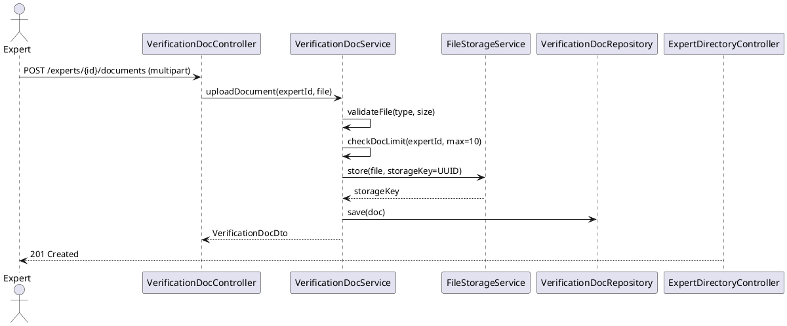

# ENGINEERING DOCUMENTATION STANDARD (EDS) v2.0
# UC-89 Upload Verification Documents

| Field | Value |
|-------|-------|
| **Document ID** | `CB-EXP-IMP-002` |
| **Version** | `1.0` |
| **Date** | `2026-06-26` |
| **Status** | `Draft` |
| **Author** | `AI Agent` |
| **Based on EDS** | `v2.0` |

---

## CHANGELOG

| Ngày | Người thực hiện | Nội dung thay đổi |
|------|-----------------|-------------------|
| 2026-06-26 | AI Agent | Khởi tạo TDS cho UC-89 |

---

## MỤC LỤC

1. [Tổng quan Module](#1-tổng-quan-module)
2. [Ma trận Truy vết](#2-ma-trận-truy-vết-traceability-matrix)
3. [Architecture Decision Records (ADR)](#3-architecture-decision-records-adr)
4. [Non-Functional Requirements & SLA](#4-non-functional-requirements--sla)
5. [Static Modeling](#5-static-modeling)
6. [Dynamic Modeling](#6-dynamic-modeling)
7. [Domain Event Catalog](#7-domain-event-catalog)
8. [Interface Specification](#8-interface-specification)
9. [API Specification](#9-api-specification)
10. [Bảng mã lỗi](#10-bảng-mã-lỗi)
11. [Quy trình Triển khai](#11-quy-trình-triển-khai-step-by-step)
12. [Rollback & Incident Runbook](#12-rollback--incident-runbook)
13. [Kịch bản Kiểm thử Chi tiết](#13-kịch-bản-kiểm-thử-chi-tiết)
14. [Phương pháp Xác minh](#14-phương-pháp-xác-minh)
15. [Mẫu thử thực tế](#15-mẫu-thử-thực-tế-api-verification-samples)
16. [Bảng tổng hợp phân quyền](#16-bảng-tổng-hợp-phân-quyền-authorization-matrix)
17. [AI Prompt Constraints](#17-ai-prompt-constraints-case-20)

---

## 1. Tổng quan Module

| Field | Value |
|-------|-------|
| **Module Name** | `UploadVerificationDocuments` |
| **Bounded Context** | `expert` |
| **Data Classification** | `Confidential` |
| **Compliance Scope** | `PDPA` |
| **Upstream Dependencies** | `expert_profiles, file (IStorageService)` |
| **Downstream Consumers** | `admin-verification workflow` |

**Mô tả:** Expert upload bằng cấp, chứng chỉ, hoặc tài liệu liên quan cho Admin xác minh. Tái sử dụng `IStorageService` từ `file` domain. Tài liệu gắn với `expert_profile_id`.

---

## 2. Ma trận Truy vết

| Requirement ID | Loại | Mô tả | Thành phần Code | ADR liên quan |
|----------------|------|-------|-----------------|---------------|
| UC-89 | User Story | Upload verification docs | `ExpertDocumentController` | ADR-EXP-003 |
| BR-RBAC | Business Rule | ROLE_EXPERT only | `ExpertDocumentService` | — |
| ADR-FILE-001 | Decision | MIME types: PDF/JPEG/PNG/HEIC | `DocumentMimeValidator` | ADR-FILE-001 |
| ADR-FILE-004 | Decision | Presigned URL 15min TTL | `IStorageService` | ADR-FILE-004 |
| ADR-EXP-003 | Decision | Max 10 docs per profile | `ExpertDocumentService` | — |

---

## 3. Architecture Decision Records (ADR)

### ADR-EXP-003 — Verification document storage and limits

| Field | Value |
|-------|-------|
| **Status** | `Accepted` |
| **Date** | `2026-06-26` |

#### Bối cảnh
Expert cần upload nhiều loại tài liệu (bằng cấp, chứng chỉ) để Admin xác minh. Tài liệu cần được lưu trữ an toàn và gắn với profile.

#### Quyết định
- Max **10 documents** per expert profile.
- Allowed MIME: `application/pdf`, `image/jpeg`, `image/png`, `image/heic`.
- Max size: **20MB** per document (re-use ADR-FILE-001).
- storageKey = UUID (re-use ADR-FILE-003).
- Verification documents stored in `expert_verification_documents` table.
- Expert chỉ được upload khi profile ở status `PENDING_VERIFICATION` hoặc `DRAFT`.

#### Hệ quả
- Tích cực: Tài liệu có audit trail rõ ràng.
- Tiêu cực: Expert cần upload lại nếu Admin reject.

---

## 4. Non-Functional Requirements & SLA

### 4.1. Performance & Availability

| Category | Requirement | Target SLA |
|----------|-------------|------------|
| Latency | File upload (p99) | < 2000ms |
| Availability | Uptime (monthly) | 99.9% |
| File limit | Max documents per expert | 10 |
| File size | Max per file | 5MB |

### 4.2. Security

| Category | Requirement | Target |
|----------|-------------|--------|
| Access control | Expert owner only | Least privilege (§16) |
| File validation | Type + size check before storage | BR-SECURITY |
| Storage key | UUID-based, non-guessable | BR-PRIVACY |

---

## 5. Static Modeling

### 5.2. Flyway SQL Migration

```sql
-- V29__create_expert_verification_documents.sql

CREATE TYPE verification_doc_type AS ENUM (
  'DEGREE', 'CERTIFICATE', 'LICENSE', 'IDENTITY', 'OTHER'
);
CREATE TYPE verification_doc_status AS ENUM (
  'PENDING_REVIEW', 'APPROVED', 'REJECTED'
);

CREATE TABLE expert_verification_documents (
  id              UUID          PRIMARY KEY DEFAULT gen_random_uuid(),
  expert_id       UUID          NOT NULL REFERENCES expert_profiles(id) ON DELETE CASCADE,
  doc_type        verification_doc_type NOT NULL,
  storage_key     VARCHAR(500)  NOT NULL,           -- UUID-based key from IStorageService
  original_name   VARCHAR(255)  NOT NULL,
  mime_type       VARCHAR(100)  NOT NULL,
  size_bytes      BIGINT        NOT NULL,
  status          verification_doc_status NOT NULL DEFAULT 'PENDING_REVIEW',
  reject_reason   TEXT,
  uploaded_at     TIMESTAMPTZ   NOT NULL DEFAULT NOW(),
  reviewed_at     TIMESTAMPTZ,
  reviewed_by     UUID          REFERENCES accounts(id)
);

CREATE INDEX idx_expert_docs_expert ON expert_verification_documents(expert_id);
```

---

## 6. Dynamic Modeling

### 6.1. Upload Document Sequence



---

## 7. Domain Event Catalog

### 7.1. Events Published

| Event Name | Trigger | Publisher | Async? |
|------------|---------|-----------|--------|
| DocumentUploaded | New verification document uploaded | VerificationDocService | No |

### 7.2. Events Consumed

| Event Name | Source | Handler | Action |
|------------|--------|---------|--------|
| — | — | — | — |

---

## 8. Interface Specification

```java
// UploadVerificationDocRequest (multipart)
// Part: file (MultipartFile), docType (VerificationDocType)

public interface IExpertDocumentService {
    /**
     * @throws BusinessException (EXP-005) when doc quota exceeded
     * @throws BusinessException (EXP-006) when MIME type not allowed
     * @throws BusinessException (EXP-007) when file too large
     */
    ExpertDocumentResponse uploadDocument(UUID expertId, UUID accountId,
                                          MultipartFile file, VerificationDocType docType);
}
```

---

## 9. API Specification

| Method | Path | Auth | Required Roles |
|--------|------|------|----------------|
| `POST` | `/api/v1/expert-profiles/{expertId}/documents` | JWT Bearer | `ROLE_EXPERT` |
| `GET` | `/api/v1/expert-profiles/{expertId}/documents` | JWT Bearer | `ROLE_EXPERT` (own), `ROLE_ADMIN` |

**POST — 201 Created:**
```json
{
  "id": "uuid",
  "expertId": "uuid",
  "docType": "DEGREE",
  "status": "PENDING_REVIEW",
  "uploadedAt": "2026-06-26T00:00:00Z"
}
```

---

## 10. Bảng mã lỗi

| Code | HTTP | Trigger |
|------|------|---------|
| `EXP-005` | 409 | Max 10 documents per profile exceeded |
| `EXP-006` | 400 | MIME type not allowed (non-PDF/JPEG/PNG/HEIC) |
| `EXP-007` | 400 | File size > 20MB |
| `EXP-008` | 403 | Not owner of expert profile |
| `EXP-009` | 404 | Expert profile not found |

---

## 11. Quy trình Triển khai (Step-by-Step)

### 11.1. Prerequisites

- [ ] ADR-EXP-003 đã Accepted; expert_profiles table đã tồn tại (V28)
- [ ] IStorageService đã configured với cloud storage
- [ ] Flyway V29 chưa được apply

### 11.2. Pre-Migration Checklist

- [ ] Backup DB production trước V29
- [ ] Migration V29 đã test thành công trên staging ≥ 24 giờ
- [ ] Rollback script đã test (xem §12)

### 11.3. Implementation Steps

#### Chặng 1 — Tạo Flyway migration V29

```bash
./mvnw flyway:migrate
# V29__create_expert_verification_documents.sql
```

#### Chặng 2 — Implement FileValidationService

```java
// Validate MIME type (ADR-FILE-001)
private void validateFile(MultipartFile file) {
    Set<String> allowed = Set.of("application/pdf", "image/jpeg", "image/png", "image/heic");
    if (!allowed.contains(file.getContentType())) throw new ValidationException("EXP-006");
    if (file.getSize() > 20 * 1024 * 1024) throw new ValidationException("EXP-007");
}
```

#### Chặng 3 — Implement Service

```java
@Override
public ExpertDocumentResponse uploadDocument(UUID expertId, UUID accountId, MultipartFile file, VerificationDocType docType) {
    ExpertProfile profile = profileRepo.findById(expertId)
        .orElseThrow(() -> new NotFoundException("EXP-009"));
    if (!profile.getAccountId().equals(accountId)) throw new ForbiddenException("EXP-008");
    if (docRepo.countByExpertProfileId(expertId) >= 10) throw new ConflictException("EXP-005");
    validateFile(file);
    String storageKey = UUID.randomUUID().toString(); // NOT filename
    storageService.upload(storageKey, file);
    ExpertVerificationDocument doc = new ExpertVerificationDocument(expertId, docType, storageKey, "PENDING_REVIEW");
    return mapper.toResponse(docRepo.save(doc));
}
```

### 11.4. Deployment Checklist

- [ ] V29 migration thành công
- [ ] Test upload PDF → 201 PENDING_REVIEW
- [ ] Test upload .exe → 400 EXP-006
- [ ] Test 11th document → 409 EXP-005
- [ ] Verify storageKey is UUID format (not filename)

---

## 12. Rollback & Incident Runbook

### 12.1. Điều kiện kích hoạt Rollback

| Điều kiện | Ngưỡng | Người quyết định |
|-----------|--------|------------------|
| Error rate > 5% | 5 phút | On-call Engineer |
| Files không validate đúng MIME | Bất kỳ case | Tech Lead |

### 12.2. Rollback Procedure

```bash
psql -h $DB_HOST -U $DB_USER -d $DB_NAME \
  -c "DROP TABLE IF EXISTS expert_verification_documents CASCADE;"
psql -h $DB_HOST -U $DB_USER -d $DB_NAME \
  -c "DROP TYPE IF EXISTS verification_doc_type CASCADE;"
psql -h $DB_HOST -U $DB_USER -d $DB_NAME \
  -c "DROP TYPE IF EXISTS verification_doc_status CASCADE;"
psql -h $DB_HOST -U $DB_USER -d $DB_NAME \
  -c "DELETE FROM flyway_schema_history WHERE version = '29';"
kubectl rollout undo deployment/carebridge-api
```

---

## 13. Kịch bản Kiểm thử Chi tiết

> **Policy (EDS v2.0):** Mọi test scenario dùng dữ liệu `SYNTHETIC`.

### 13.1. Unit Tests

```gherkin
Feature: Upload Verification Documents
  Background:
    Given test data classification: SYNTHETIC
    And EXPERT-001 có expert profile với accountId matching

  Scenario: PDF upload → 201 PENDING_REVIEW
    When uploadDocument(expertId, accountId, pdf_file, DEGREE) được gọi
    Then response status = PENDING_REVIEW
    And storageKey là UUID format (không chứa filename)

  Scenario: .exe file → 400 EXP-006
    When uploadDocument với MIME=application/octet-stream
    Then throws ValidationException với code EXP-006

  Scenario: File > 20MB → 400 EXP-007
    When uploadDocument với file size 21MB
    Then throws ValidationException với code EXP-007

  Scenario: 11th document → 409 EXP-005
    Given expert profile có 10 existing documents
    When uploadDocument (11th)
    Then throws ConflictException với code EXP-005

  Scenario: Non-owner → 403 EXP-008
    Given ACC-OTHER không phải owner của expert profile
    When uploadDocument(expertId, ACC-OTHER, ...)
    Then throws ForbiddenException với code EXP-008
```

### 13.2. Integration Tests

```gherkin
  Scenario: Document persisted với PENDING_REVIEW
    Given test data classification: SYNTHETIC
    When uploadDocument() thành công
    Then expert_verification_documents có 1 row với status='PENDING_REVIEW'
    And storageKey matches UUID pattern
```

---

## 14. Phương pháp Xác minh

### 14.1. Database Inspection

```sql
-- Verify document count per expert
SELECT expert_profile_id, COUNT(*) FROM expert_verification_documents
GROUP BY expert_profile_id;

-- Verify storageKey là UUID format
SELECT storage_key FROM expert_verification_documents
WHERE storage_key !~ '^[0-9a-f]{8}-[0-9a-f]{4}-[0-9a-f]{4}-[0-9a-f]{4}-[0-9a-f]{12}$';
-- Expected: 0 rows
```

---

## 15. Mẫu thử thực tế (API Verification Samples)

### 15.1. Happy Path

```bash
curl -X POST https://[host]/api/v1/expert-profiles/EXPERT-UUID/documents \
  -H "Authorization: Bearer <EXPERT_JWT>" \
  -F "file=@degree.pdf;type=application/pdf" \
  -F "docType=DEGREE"
```

**Expected Response (201):**
```json
{
  "id": "doc-uuid",
  "expertId": "EXPERT-UUID",
  "docType": "DEGREE",
  "status": "PENDING_REVIEW",
  "uploadedAt": "2026-06-26T00:00:00Z"
}
```

---

## 16. Bảng tổng hợp phân quyền (Authorization Matrix)

| Endpoint | `ROLE_MOTHER` | `ROLE_EXPERT` | `ROLE_ADMIN` |
|----------|---------------|---------------|--------------|
| `POST /expert-profiles/{id}/documents` | ❌ | ✅ Own only | ✅ |
| `GET /expert-profiles/{id}/documents` | ❌ | ✅ Own only | ✅ All |

---

## 17. AI Prompt Constraints (CASE 2.0)

### 17.1 Constraint Summary Table

| # | Constraint | Source |
|---|-----------|--------|
| C1 | Verify expert profile ownership (accountId from JWT matches profile.accountId) | ADR-EXP-003 |
| C2 | Max 10 docs: count existing before save | ADR-EXP-003 |
| C3 | MIME validation: only PDF/JPEG/PNG/HEIC | ADR-FILE-001 |
| C4 | storageKey = UUID.randomUUID().toString() (not originalFilename) | ADR-FILE-003 |
| C5 | Initial doc status = PENDING_REVIEW | ADR-EXP-003 |

### 17.2 Constraint Injection Block

```
[CONSTRAINT BLOCK — Module: UploadVerificationDocuments (CB-EXP-IMP-002)]
1. (C1 — ADR-EXP-003) ownership: profile.accountId == JWT accountId; 403 EXP-008 nếu không khớp.
2. (C2 — ADR-EXP-003) docRepo.countByExpertProfileId() >= 10 → 409 EXP-005 TRƯỚC khi upload.
3. (C3 — ADR-FILE-001) MIME phải thuộc {pdf, jpeg, png, heic} → 400 EXP-006 nếu không.
4. (C4 — ADR-FILE-003) storageKey = UUID.randomUUID().toString() — KHÔNG dùng originalFilename.
5. (C5 — ADR-EXP-003) doc.status = PENDING_REVIEW — KHÔNG phải APPROVED khi upload.
```

### 17.3 Constraint Quality Checklist

- [x] Mỗi constraint traceable về ADR cụ thể
- [x] Không có constraint generic
- [x] Constraint block có ≥ 5 constraints cụ thể

### 17.4 Anti-Pattern Detection

| AP-ID | Anti-Pattern | Hành động |
|-------|-------------|----------|
| AP-AI-001 | storageKey = originalFilename | Reject — C4 violation |
| AP-AI-003 | Status = APPROVED ngay khi upload | Reject — C5 violation |
| AP-AI-005 | Không check quota trước khi upload | Reject — C2 violation |

---

## PHỤ LỤC

### A. Glossary

| Thuật ngữ | Định nghĩa |
|-----------|------------|
| storageKey | UUID-based key trong cloud storage — không reveal original filename |
| PENDING_REVIEW | Status mặc định của document khi vừa upload — chờ Admin xác minh |
| MIME validation | Kiểm tra content type theo ADR-FILE-001 |

### B. Tài liệu tham chiếu

| Document | Path |
|----------|------|
| EDS v2.0 Template | `08_References/Template/PHASE-3_TDS.md` |

---

*EDS v2.1 — Tích hợp CASE 2.0 AI Prompt Constraints (§17).*
