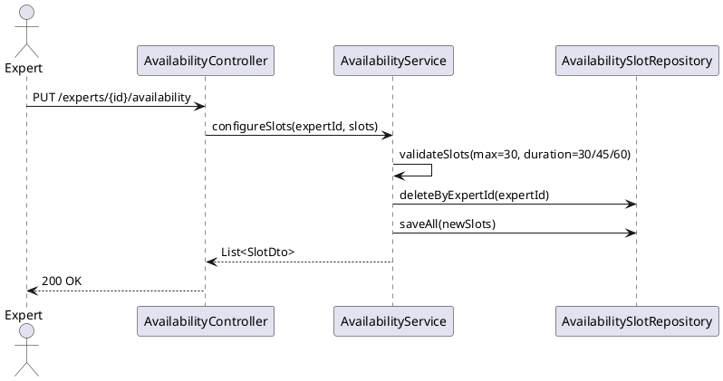

# ENGINEERING DOCUMENTATION STANDARD (EDS) v2.0
# UC-90 Configure Availability

| Field | Value |
|-------|-------|
| **Document ID** | `CB-EXP-IMP-003` |
| **Version** | `1.0` |
| **Date** | `2026-06-26` |
| **Status** | `Draft` |
| **Author** | `AI Agent` |
| **Based on EDS** | `v2.0` |

---

## CHANGELOG

| Ngày | Người thực hiện | Nội dung thay đổi |
|------|-----------------|-------------------|
| 2026-06-26 | AI Agent | Khởi tạo TDS cho UC-90 |

---

## MỤC LỤC

1. [Tổng quan Module](#1-tổng-quan-module)
2. [Ma trận Truy vết](#2-ma-trận-truy-vết-traceability-matrix)
3. [Architecture Decision Records (ADR)](#3-architecture-decision-records-adr)
4. [Non-Functional Requirements & SLA](#4-non-functional-requirements--sla)
5. [Static Modeling](#5-static-modeling)
6. [Dynamic Modeling](#6-dynamic-modeling)
7. [Domain Event Catalog](#7-domain-event-catalog)
8. [Interface Specification](#8-interface-specification)
9. [API Specification](#9-api-specification)
10. [Bảng mã lỗi](#10-bảng-mã-lỗi)
11. [Quy trình Triển khai](#11-quy-trình-triển-khai-step-by-step)
12. [Rollback & Incident Runbook](#12-rollback--incident-runbook)
13. [Kịch bản Kiểm thử Chi tiết](#13-kịch-bản-kiểm-thử-chi-tiết)
14. [Phương pháp Xác minh](#14-phương-pháp-xác-minh)
15. [Mẫu thử thực tế](#15-mẫu-thử-thực-tế-api-verification-samples)
16. [Bảng tổng hợp phân quyền](#16-bảng-tổng-hợp-phân-quyền-authorization-matrix)
17. [AI Prompt Constraints](#17-ai-prompt-constraints-case-20)

---

## 1. Tổng quan Module

| Field | Value |
|-------|-------|
| **Module Name** | `ConfigureAvailability` |
| **Bounded Context** | `expert` |
| **Data Classification** | `Internal` |
| **Upstream Dependencies** | `expert_profiles` |
| **Downstream Consumers** | `consultation (booking slot check)` |

**Mô tả:** Expert cấu hình slot khả dụng (ngày trong tuần, giờ, thời lượng), trạng thái online, và loại tư vấn được hỗ trợ (chat/voice/video). Slot được dùng khi Mother book consultation.

---

## 2. Ma trận Truy vết (Traceability Matrix)

| Requirement ID | Loại | Mô tả | Thành phần Code | Compliance Target | ADR liên quan |
|----------------|------|-------|-----------------|-------------------|---------------|
| UC-90 | Use Case | Expert cấu hình lịch khả dụng | `AvailabilityController`, `AvailabilityService` | BR-RBAC | — |
| BR-REPLACE | Business Rule | Replace strategy — xóa cũ, tạo mới | `AvailabilityService` | BR-CONSISTENCY | — |
| BR-MAX-SLOTS | Business Rule | Tối đa 30 slots per request | `AvailabilityService` | BR-VALIDATION | — |
| BR-DURATION | Business Rule | Duration chỉ 30/45/60 phút | `AvailabilityService` | BR-VALIDATION | — |

---

## 3. Architecture Decision Records (ADR)

### ADR-EXP-004 — Availability slot model

| Field | Value |
|-------|-------|
| **Status** | `Accepted` |
| **Date** | `2026-06-26` |

#### Quyết định
- Slot model: `day_of_week (MON–SUN)`, `start_time (TIME)`, `end_time (TIME)`, `duration_minutes`.
- Max **30 slots per expert profile**.
- Không cho phép overlapping slots trong cùng một ngày: check `(expert_id, day_of_week, start_time, end_time)` overlap.
- Slot status: `AVAILABLE` / `BOOKED` / `BLOCKED`.
- Khi Expert save availability → tất cả slot cũ bị replace (upsert strategy: delete-and-insert).

### ADR-EXP-005 — Online status

| Field | Value |
|-------|-------|
| **Status** | `Accepted` |
| **Date** | `2026-06-26` |

#### Quyết định
`is_online` field trong `expert_profiles`. Khi Expert set online → cập nhật `is_online=true`, `last_online_at=NOW()`. Booking chỉ khả dụng khi Expert có ít nhất 1 slot `AVAILABLE`.

---

## 4. Non-Functional Requirements & SLA

### 4.1. Performance & Availability

| Category | Requirement | Target SLA |
|----------|-------------|------------|
| Latency | API response — configure slots (p99) | < 500ms |
| Availability | Uptime (monthly) | 99.9% |
| Batch limit | Max slots per request | 30 |
| Duration | Allowed durations | 30, 45, 60 min |

### 4.2. Security

| Category | Requirement | Target |
|----------|-------------|--------|
| Access control | Expert owner only | Least privilege (§16) |
| Ownership | Expert can only modify own slots | BR-RBAC |

---

## 5. Static Modeling

### 5.2. Flyway SQL Migration

```sql
-- V30__create_expert_availability.sql

CREATE TYPE day_of_week_enum AS ENUM (
  'MON', 'TUE', 'WED', 'THU', 'FRI', 'SAT', 'SUN'
);
CREATE TYPE slot_status_enum AS ENUM ('AVAILABLE', 'BOOKED', 'BLOCKED');

CREATE TABLE expert_availability_slots (
  id               UUID          PRIMARY KEY DEFAULT gen_random_uuid(),
  expert_id        UUID          NOT NULL REFERENCES expert_profiles(id) ON DELETE CASCADE,
  day_of_week      day_of_week_enum NOT NULL,
  start_time       TIME          NOT NULL,
  end_time         TIME          NOT NULL,
  duration_minutes INTEGER       NOT NULL CHECK (duration_minutes IN (30, 45, 60)),
  status           slot_status_enum NOT NULL DEFAULT 'AVAILABLE',
  created_at       TIMESTAMPTZ   NOT NULL DEFAULT NOW(),
  updated_at       TIMESTAMPTZ   NOT NULL DEFAULT NOW(),

  CONSTRAINT chk_slot_time CHECK (end_time > start_time)
);

CREATE INDEX idx_avail_expert ON expert_availability_slots(expert_id);
CREATE INDEX idx_avail_day ON expert_availability_slots(expert_id, day_of_week, status);

-- Also add is_online to expert_profiles
ALTER TABLE expert_profiles
  ADD COLUMN IF NOT EXISTS is_online    BOOLEAN     NOT NULL DEFAULT FALSE,
  ADD COLUMN IF NOT EXISTS last_online_at TIMESTAMPTZ;
```

---

## 6. Dynamic Modeling

### 6.1. Configure Availability Sequence



---

## 7. Domain Event Catalog

### 7.1. Events Published

| Event Name | Trigger | Publisher | Async? |
|------------|---------|-----------|--------|
| AvailabilityUpdated | Expert reconfigures availability slots | AvailabilityService | No |

### 7.2. Events Consumed

| Event Name | Source | Handler | Action |
|------------|--------|---------|--------|
| — | — | — | — |

---

## 8. Interface Specification

```java
public class AvailabilitySlotRequest {
    @NotNull
    private DayOfWeekEnum dayOfWeek;
    @NotNull
    private LocalTime startTime;
    @NotNull
    private LocalTime endTime;
    @NotNull
    private Integer durationMinutes; // must be 30, 45, or 60
}

public class ConfigureAvailabilityRequest {
    @NotNull
    private List<AvailabilitySlotRequest> slots; // max 30
    private Boolean isOnline;
}

public interface IAvailabilityService {
    AvailabilityResponse configureAvailability(UUID expertId, UUID accountId,
                                               ConfigureAvailabilityRequest request);
}
```

---

## 9. API Specification

| Method | Path | Auth | Required Roles |
|--------|------|------|----------------|
| `PUT` | `/api/v1/expert-profiles/{expertId}/availability` | JWT Bearer | `ROLE_EXPERT` |
| `GET` | `/api/v1/expert-profiles/{expertId}/availability` | JWT Bearer | Any authenticated |

**PUT — 200 OK:**
```json
{
  "expertId": "uuid",
  "slots": [
    { "dayOfWeek": "MON", "startTime": "09:00", "endTime": "12:00", "durationMinutes": 60 }
  ],
  "isOnline": true,
  "totalSlots": 1
}
```

---

## 10. Bảng mã lỗi

| Code | HTTP | Trigger |
|------|------|---------|
| `AVAIL-001` | 400 | Slot count > 30 |
| `AVAIL-002` | 400 | Overlapping slots on same day |
| `AVAIL-003` | 400 | Invalid duration (not 30/45/60 min) |
| `AVAIL-004` | 403 | Not owner of expert profile |
| `AVAIL-005` | 400 | end_time ≤ start_time |

---

## 11. Quy trình Triển khai (Step-by-Step)

### 11.1. Prerequisites

- [ ] expert_profiles table tồn tại (V28)
- [ ] ADR-EXP-004 đã Accepted (max 30 slots, duration 30/45/60, replace strategy)

### 11.2. Pre-Migration Checklist

- [ ] Backup DB production trước V30
- [ ] V30 đã test thành công trên staging ≥ 24 giờ

### 11.3. Implementation Steps

#### Chặng 1 — Migration V30

```bash
./mvnw flyway:migrate
# V30__create_expert_availability_slots.sql
```

#### Chặng 2 — Replace strategy (delete-insert trong @Transactional)

```java
@Transactional
public AvailabilityResponse configureAvailability(UUID expertId, UUID accountId, List<SlotRequest> slots) {
    ExpertProfile profile = profileRepo.findById(expertId)
        .orElseThrow(() -> new NotFoundException("AVAIL-005"));
    if (!profile.getAccountId().equals(accountId)) throw new ForbiddenException("AVAIL-004");
    if (slots.size() > 30) throw new ValidationException("AVAIL-001");
    validateNoOverlap(slots);  // AVAIL-002
    validateDurations(slots);  // AVAIL-003: must be 30, 45, or 60
    slotRepo.deleteByExpertProfileId(expertId);  // replace all
    List<ExpertAvailabilitySlot> saved = slotRepo.saveAll(
        slots.stream().map(s -> mapper.toEntity(s, expertId)).collect(Collectors.toList()));
    return new AvailabilityResponse(expertId, saved.size());
}
```

### 11.4. Deployment Checklist

- [ ] V30 migration thành công
- [ ] Test 3 valid non-overlapping slots → 200
- [ ] Test replace: configure 2 then 1 → DB có 1 slot
- [ ] Test overlapping → 400 AVAIL-002
- [ ] Test >30 → 400 AVAIL-001

---

## 12. Rollback & Incident Runbook

### 12.1. Điều kiện kích hoạt Rollback

| Điều kiện | Ngưỡng | Người quyết định |
|-----------|--------|------------------|
| Error rate > 5% | 5 phút | On-call Engineer |
| Overlap validation không hoạt động | Bất kỳ case | Tech Lead |

### 12.2. Rollback Procedure

```bash
psql -h $DB_HOST -U $DB_USER -d $DB_NAME \
  -c "DROP TABLE IF EXISTS expert_availability_slots CASCADE;"
psql -h $DB_HOST -U $DB_USER -d $DB_NAME \
  -c "DELETE FROM flyway_schema_history WHERE version = '30';"
kubectl rollout undo deployment/carebridge-api
```

---

## 13. Kịch bản Kiểm thử Chi tiết

```gherkin
Feature: Configure Availability
  Background:
    Given test data classification: SYNTHETIC
    And EXPERT-001 có expert profile

  Scenario: Valid slots → 200
    When configureAvailability(3 non-overlapping slots)
    Then response.totalSlots == 3

  Scenario: Replace strategy
    Given expert đã có 2 slots
    When configureAvailability với 1 slot
    Then DB có đúng 1 slot

  Scenario: Overlapping → 400 AVAIL-002
    When slots: MON 09:00-12:00 và MON 11:00-14:00
    Then throws ValidationException AVAIL-002

  Scenario: > 30 slots → 400 AVAIL-001
    When configureAvailability với 31 slots
    Then throws ValidationException AVAIL-001

  Scenario: Duration = 35 → 400 AVAIL-003
    When slot với durationMinutes=35
    Then throws ValidationException AVAIL-003

  Scenario: Non-owner → 403 AVAIL-004
    When configureAvailability với wrong accountId
    Then throws ForbiddenException AVAIL-004
```

---

## 14. Phương pháp Xác minh

```sql
-- Verify slot count per expert
SELECT expert_profile_id, COUNT(*) FROM expert_availability_slots GROUP BY expert_profile_id;

-- Verify no overlap (overlap check)
SELECT a.id, b.id FROM expert_availability_slots a
JOIN expert_availability_slots b ON a.expert_profile_id = b.expert_profile_id
  AND a.day_of_week = b.day_of_week AND a.id != b.id
  AND a.start_time < b.end_time AND b.start_time < a.end_time;
-- Expected: 0 rows
```

---

## 15. Mẫu thử thực tế (API Verification Samples)

```bash
curl -X PUT https://[host]/api/v1/expert-profiles/EXP-UUID/availability \
  -H "Authorization: Bearer <EXPERT_JWT>" \
  -H "Content-Type: application/json" \
  -d '[{"dayOfWeek":"MON","startTime":"09:00","endTime":"12:00","durationMinutes":60}]'
```
**Expected (200):** `{"expertId":"EXP-UUID","totalSlots":1}`

---

## 16. Bảng tổng hợp phân quyền (Authorization Matrix)

| Endpoint | `ROLE_MOTHER` | `ROLE_EXPERT` | `ROLE_ADMIN` |
|----------|---------------|---------------|--------------|
| `PUT /expert-profiles/{id}/availability` | ❌ | ✅ Own only | ✅ |
| `GET /expert-profiles/{id}/availability` | ✅ Read | ✅ Own | ✅ |

---

## 17. AI Prompt Constraints (CASE 2.0)

### 17.1 Constraint Summary Table

| # | Constraint | Source |
|---|-----------|--------|
| C1 | Verify ownership (accountId from JWT = profile.accountId) | ADR-EXP-004 |
| C2 | Replace strategy: delete all existing slots for expert, then insert new | ADR-EXP-004 |
| C3 | Validate max 30 slots total | ADR-EXP-004 |
| C4 | Validate no overlapping slots per day_of_week | ADR-EXP-004 |
| C5 | Duration PHẢI là 30, 45, hoặc 60 phút — không có giá trị khác | ADR-EXP-004 |

### 17.2 Constraint Injection Block

```
[CONSTRAINT BLOCK — Module: ConfigureAvailability (CB-EXP-IMP-003)]
1. (C1) ownership check: profile.accountId == JWT accountId; 403 AVAIL-004 nếu không.
2. (C2) Replace strategy trong @Transactional: deleteByExpertProfileId() trước saveAll().
3. (C3) slots.size() > 30 → 400 AVAIL-001.
4. (C4) Overlap check per day_of_week: start_time < other.end_time && other.start_time < end_time → 400 AVAIL-002.
5. (C5) durationMinutes PHẢI thuộc {30, 45, 60} → 400 AVAIL-003.
```

### 17.3 Constraint Quality Checklist

- [x] Mỗi constraint traceable về ADR-EXP-004
- [x] Constraint block có ≥ 5 constraints cụ thể

### 17.4 Anti-Pattern Detection

| AP-ID | Anti-Pattern | Hành động |
|-------|-------------|----------|
| AP-AI-001 | Append-only thay vì replace (add slots không delete cũ) | Reject — C2 violation |
| AP-AI-003 | Accept duration=45 minutes nhưng không validate | Reject — C5 |

---

## PHỤ LỤC

### A. Glossary

| Thuật ngữ | Định nghĩa |
|-----------|------------|
| Replace Strategy | Xóa tất cả slots cũ rồi insert mới trong cùng transaction |
| Availability Slot | Khung giờ tư vấn: day_of_week + start_time + end_time + durationMinutes |
| Overlap | Hai slots trùng nhau trong cùng ngày khi start_time < other.end_time |

### B. Tài liệu tham chiếu

| Document | Path |
|----------|------|
| EDS v2.0 Template | `08_References/Template/PHASE-3_TDS.md` |

---

*EDS v2.1 — Tích hợp CASE 2.0 AI Prompt Constraints (§17).*
| C5 | Duration must be 30, 45, or 60 minutes only | ADR-EXP-004 |
