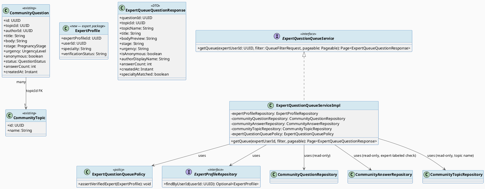
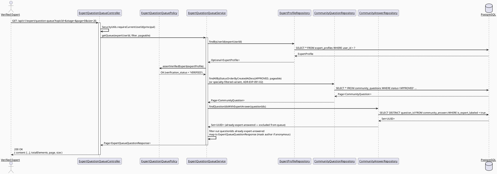
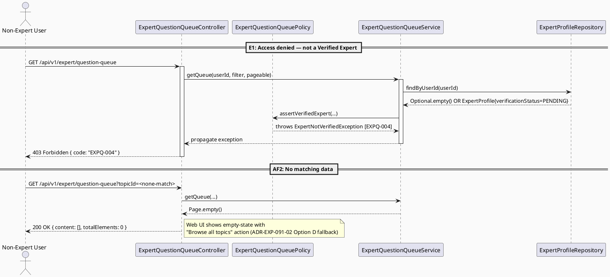

# ENGINEERING DOCUMENTATION STANDARD (EDS) v2.0
# UC-91 View Expert Question Queue

| Field | Value |
|-------|-------|
| **Document ID** | `CB-EXP-IMP-091` |
| **Version** | `1.0` |
| **Date** | `2026-07-02` |
| **Status** | `Draft` |
| **Document Owner** | `TV4 - Lâm` |
| **Author** | `AI Agent` |
| **Reviewed by** | `[ ] Pending` |
| **DPO Sign-off** | `N/A — no new PII field; reuses existing community_questions/expert_profiles data` |
| **Approved by** | `[ ] Pending` |
| **Last Review** | `2026-07-02` |
| **Based on EDS** | `v2.0` |

---

## CHANGELOG

| Ngày | Người thực hiện | Nội dung thay đổi |
|------|-----------------|-------------------|
| 2026-07-02 | AI Agent | Khởi tạo TDS cho UC-91 (Draft) |

---

## MỤC LỤC

1. [Tổng quan Module](#1-tổng-quan-module)
2. [Ma trận Truy vết](#2-ma-trận-truy-vết-traceability-matrix)
3. [Architecture Decision Records (ADR)](#3-architecture-decision-records-adr)
4. [Non-Functional Requirements & SLA](#4-non-functional-requirements--sla)
5. [Static Modeling](#5-static-modeling)
6. [Dynamic Modeling](#6-dynamic-modeling)
7. [Domain Event Catalog](#7-domain-event-catalog)
8. [Interface Specification](#8-interface-specification)
9. [API Specification](#9-api-specification)
10. [Bảng mã lỗi](#10-bảng-mã-lỗi)
11. [Quy trình Triển khai](#11-quy-trình-triển-khai-step-by-step)
12. [Rollback & Incident Runbook](#12-rollback--incident-runbook)
13. [Kịch bản Kiểm thử Chi tiết](#13-kịch-bản-kiểm-thử-chi-tiết)
14. [Phương pháp Xác minh](#14-phương-pháp-xác-minh)
15. [Mẫu thử thực tế](#15-mẫu-thử-thực-tế-api-verification-samples)
16. [Bảng tổng hợp phân quyền](#16-bảng-tổng-hợp-phân-quyền-authorization-matrix)
17. [AI Prompt Constraints (CASE 2.0)](#17-ai-prompt-constraints-case-20)
18. [Open Items / Research Gate](#18-open-items--research-gate)

---

## 1. Tổng quan Module

| Field | Value |
|-------|-------|
| **Module Name** | `ViewExpertQuestionQueue` |
| **Bounded Context** | `expert` (reads `community` aggregate as a downstream consumer) |
| **Platform** | Web — Expert Portal (React + TypeScript + Vite) |
| **Data Classification** | `Internal` (question bodies may contain user-submitted health context; no direct PII field beyond `author_id`, masked when `is_anonymous = true`) |
| **Compliance Scope** | `BR-RBAC`, `BR-CONSULTATION` |
| **Upstream Dependencies** | `community_questions`, `community_topics`, `community_answers`, `expert_profiles` (all read-only from this module) |
| **Downstream Consumers** | UC-92 Post Expert Answer (expert selects a question from this queue and posts an answer), UC-93 Suggest Private Consultation |

**Mô tả:** Displays a specialty-matched queue of `APPROVED` community questions that do not yet have an expert-labeled answer, so a Verified Expert can pick items relevant to their `expert_profiles.specialty` and answer them (UC-92). This is a **read-only extension** on top of the existing `community` package — no new question/answer tables are introduced. `SRS §3.2.1.5` (lines 838-857).

**Primary Actor:** Verified Expert (`Role.EXPERT` + `expert_profiles.verification_status = 'VERIFIED'`).
**Secondary Actors:** None.
**Priority:** High. **Frequency:** Frequent.

---

## 2. Ma trận Truy vết (Traceability Matrix)

| Requirement ID | Loại (BR/ADR/US) | Mô tả yêu cầu | Thành phần Code | Compliance Target | ADR liên quan |
|----------------|------------------|---------------|-----------------|-------------------|---------------|
| SRS-UC-91 | Use Case | Verified Expert views specialty-matched question queue | `ExpertQuestionQueueController.getQueue()` | BR-RBAC | ADR-EXP-091-01 |
| BR-RBAC | Business Rule | Only authenticated users with `ROLE_EXPERT` and `VERIFIED` status may access the queue | `ExpertQuestionQueuePolicy.assertVerifiedExpert()` | BR-RBAC | ADR-EXP-091-02 |
| BR-CONSULTATION | Business Rule | Queue access is a read action; no lifecycle-state mutation occurs here — kept out of scope for booking/payment audit trail | `ExpertQuestionQueueService` | BR-CONSULTATION | — |
| POST-3 (SRS) | Postcondition | Sensitive actions recorded for audit where required — queue *view* is low-sensitivity (read-only, no PII disclosure beyond existing community visibility) so audit logging is optional/aggregate-only (see §7) | `AuditService` | BR-AUDIT | ADR-EXP-091-03 |
| AF2 (SRS) | Alternative Flow | No matching data → empty state with next allowed action (broaden filter) | `ExpertQuestionQueueController` (200 + empty page) | — | — |
| E1 (SRS) | Exception | Access denied when unauthenticated/unauthorized/outside permitted scope | `ExpertQuestionQueuePolicy` → 403 `EXPQ-004` | BR-RBAC | ADR-EXP-091-02 |

---

## 3. Architecture Decision Records (ADR)

### ADR-EXP-091-01 — Reuse existing `community_questions`/`community_topics` read path instead of a parallel expert-queue table

| Field | Value |
|-------|-------|
| **Status** | `Accepted` |
| **Deciders** | `AI Agent (Technical Architect role)` |
| **Date** | `2026-07-02` |

#### Bối cảnh (Context)
The `community` package already has `CommunityQuestion`, `CommunityQuestionRepository`, `AnswerStatus`/`QuestionStatus` enums, and `CommunityAnswerRepository.findQuestionIdsWithExpertAnswer(...)` (used by UC-198). UC-91 needs the same underlying question data, filtered to items still awaiting an expert reply. Building a separate `expert_question_queue` table would duplicate `community_questions` and require a sync mechanism — a known anti-pattern in a modular monolith.

#### Các phương án đã xem xét (Options Considered)

| Phương án | Mô tả | Ưu điểm | Nhược điểm |
|-----------|-------|----------|------------|
| A | New `expert_question_queue` materialized table, synced via trigger/event | Fast reads | Duplicated state, sync bugs, violates "no new infra" rule in CLAUDE.md |
| B | Query `community_questions` directly from a new `expert` package repository (cross-package repository call) via a dedicated read query | No duplication, single source of truth | expert package now depends on community entities |
| C | Expose a `CommunityQuestionQueryService` port in `community` package that `expert` package calls (hexagonal boundary) | Clean bounded-context separation | Slightly more ceremony for MVP |

#### Quyết định (Decision)
Chọn **Phương án B** — `expert` package adds `ExpertQuestionQueueService` that depends directly on `community.repository.CommunityQuestionRepository` and `community.repository.CommunityAnswerRepository` (both already `@Repository` Spring beans, importable across packages in this modular monolith). This matches the existing precedent where `UC-198`/`UC-199` cross-reference `CommunityAnswerRepository.findQuestionIdsWithExpertAnswer`. A stricter port-based boundary (Option C) is deferred — noted as future refactor, not required for MVP scope per CLAUDE.md "smallest scoped change" rule.

#### Hệ quả (Consequences)

**Tích cực:**
- No new question/answer schema; extends existing infra exactly as CLAUDE.md instructs ("extend, don't duplicate").
- Reuses proven query patterns (`findAllByStatusAndTopicIdOrderByCreatedAtDesc`, `findQuestionIdsWithExpertAnswer`).

**Tiêu cực / Trade-offs:**
- `expert` package now has a compile-time dependency on `community` entities/repositories — acceptable in a modular monolith; must not introduce a cyclic dependency back from `community` → `expert`.

**Compliance Impact:** None — no new PII surface introduced.

---

### ADR-EXP-091-02 — Specialty matching algorithm (Open, exact-string default)

| Field | Value |
|-------|-------|
| **Status** | `Accepted` (MVP default) — **flagged Open for algorithm richness, see §18 RG-6** |
| **Deciders** | `AI Agent (Technical Architect role)` |
| **Date** | `2026-07-02` |

#### Bối cảnh (Context)
SRS describes the queue as "specialty-matched questions." The schema has `expert_profiles.specialty varchar(100)` (free text, no FK to a taxonomy table) and `community_questions.topic_id → community_topics.name varchar(100)` (also free text, no specialty/category column). There is **no explicit foreign key or shared enum** linking an expert's specialty to a community topic or question. `community_questions.stage` (`PRE_PREGNANCY`/`PREGNANCY`/`POSTPARTUM`/`BABY_CARE`) is the closest structured signal.

#### Các phương án đã xem xét (Options Considered)

| Phương án | Mô tả | Ưu điểm | Nhược điểm |
|-----------|-------|----------|------------|
| A | Exact case-insensitive string match: `LOWER(topic.name) = LOWER(expert.specialty)` | Simple, deterministic, no new schema | Brittle — "Sản khoa" vs "Sản-Phụ khoa" won't match; likely under-matches |
| B | `ILIKE` partial match both directions (`topic.name ILIKE '%specialty%' OR specialty ILIKE '%topic.name%'`) | More forgiving than exact match, still no schema change | Still fragile for synonyms; false positives possible |
| C | New `specialty_topic_mapping` taxonomy table (specialty enum ↔ topic_id many-to-many) | Correct long-term design | New migration + no time/approval to design full taxonomy this sprint; overkill for MVP |
| D | No specialty filter — show ALL approved, unanswered questions to any Verified Expert, sorted by urgency/recency | Guarantees no expert misses relevant questions | Doesn't fulfill "specialty-matched" description literally |

#### Quyết định (Decision)
Chọn **Phương án B** (ILIKE partial match, both directions) as MVP default, **with a documented fallback to Option D**: if partial match yields zero results, the queue additionally shows an "All Topics" tab (unfiltered, same pagination) so no expert is ever blocked from browsing all open questions. This keeps behavior correct even when specialty strings don't line up, without requiring a new migration.

**⚠️ This ADR is marked Open in §18 — the exact matching semantics (single term vs. tokenized) and whether Option C (taxonomy table) is adopted in a later sprint requires Principal Architect / Product decision.** Do not treat Option B as a permanent design; it is a documented stopgap consistent with CLAUDE.md's "smallest scoped change."

#### Hệ quả (Consequences)

**Tích cực:** No schema change required to ship UC-91 this sprint; experts are never fully blocked (Option D fallback).

**Tiêu cực / Trade-offs:** Match quality is approximate; may show false positives/negatives. Must be revisited if false-negative rate causes expert complaints (tracked as a product metric, out of scope here).

**Compliance Impact:** None.

---

### ADR-EXP-091-03 — Audit logging scope for queue views

| Field | Value |
|-------|-------|
| **Status** | `Accepted` |
| **Date** | `2026-07-02` |

#### Quyết định (Decision)
Queue **listing** (`GET /api/v1/expert/question-queue`) is NOT individually audit-logged (high-frequency, read-only, no new information disclosed beyond what the public community feed already shows for `APPROVED` questions). This matches the pattern for `CommunityFeedController` (no audit call) rather than `CommunityQuestionSearchService` (also no per-search audit). Only the **downstream actions** (UC-92 answer post, UC-93 consultation suggestion) are audit-logged, consistent with existing `AuditAction.COMMUNITY_ANSWER_POSTED` precedent. This satisfies POST-3 ("sensitive actions recorded") because viewing an already-public, moderator-approved question is not sensitive; posting as an expert is.

**Compliance Impact:** None — matches existing `MODERATION_QUEUE_VIEWED` precedent (that one IS logged because Moderator queues expose PENDING/unapproved content; expert queue only ever shows already-APPROVED public content, so it is a strictly lower sensitivity read).

---

## 4. Non-Functional Requirements & SLA

### 4.1. Performance & Availability

| Category | Requirement | Target SLA | Measurement Method | Compliance Basis |
|----------|-------------|------------|---------------------|------------------|
| Latency | Queue API response (p99) | < 400ms | k6 load test | — |
| Availability | Uptime (monthly) | 99.9% | Uptime monitor | — |
| Pagination | Default page size | 20, max 50 | API contract test | — |

### 4.2. Data Integrity & Retention

| Category | Requirement | Target | Verification Method | Compliance Basis |
|----------|-------------|--------|---------------------|------------------|
| Consistency | Queue reflects live `community_questions.status` (no caching staleness > 30s) | Best-effort, no hard cache | Manual/integration test | — |
| Read-only | No mutation of `community_questions`/`community_answers` from this module | 100% | Code review — no `save()` calls in `ExpertQuestionQueueService` | — |

### 4.3. Security

| Category | Requirement | Target | Verification Method | Compliance Basis |
|----------|-------------|--------|---------------------|------------------|
| Access control | `ROLE_EXPERT` + `verification_status = VERIFIED` only | Least privilege | Auth Matrix (§16) | BR-RBAC |
| Anonymity | `is_anonymous = true` questions must not expose `author_id`/author name in response DTO | 100% masked | Unit test on mapper | BR-PRIVACY |

### 4.4. Scalability & Capacity Planning

Expected load: low (dozens of Verified Experts, hundreds of pending questions). No special scaling needed beyond existing `idx_community_questions_status`, `idx_community_questions_topic_id`, `idx_community_questions_stage` indexes already present in `V1__init_schema.sql`.

---

## 5. Static Modeling

### 5.1. Class Diagram (PlantUML)



### 5.2. Data Structure (Flyway SQL Migration)

**No schema change required for UC-91.** This UC is read-only against existing tables (`community_questions`, `community_topics`, `community_answers`, `expert_profiles`). The only new artifact is a Java `@Entity` mapping for the already-existing `expert_profiles` table (currently unmapped — package is placeholder-only), which requires **no migration**, only a new `ExpertProfile.java` entity file mapped to the pre-existing table.

> **Reference migration for the `expert` bounded context (shared across UC-91/92/93):** see `V20260703100000__create_expert_answer_moderation_columns.sql` in `04_Implement/UC92_PostExpertAnswer/UC92_PostExpertAnswer_TDS.md` §5.2 — UC-91 does not itself require it but reads the `expert_scope_flagged` column added there for filtering, IF that flag exists (see UC-92 §5.2 for exact DDL). If UC-92 is not yet deployed, UC-91 queue simply omits scope-flag filtering (backward compatible).

```sql
-- UC-91: NO NEW TABLE / NO NEW MIGRATION.
-- ExpertProfile.java entity maps to existing public.expert_profiles (V1__init_schema.sql lines 786-800):
--   expert_profile_id uuid PK, user_id uuid FK users(user_id), specialty varchar(100),
--   professional_title varchar(150), experience_years smallint, workplace varchar(200),
--   consultation_scope text, verification_status varchar(30) DEFAULT 'PENDING',
--   verified_at timestamptz, verified_by uuid, rating_avg numeric,
--   created_at timestamptz, updated_at timestamptz.
```

---

## 6. Dynamic Modeling

### 6.1. Sequence Diagram — Happy Path (PlantUML)



### 6.2. Sequence Diagram — Alt/Error Path (PlantUML)



### 6.3. State Machine

Not applicable — UC-91 is a stateless read; it does not transition any entity's state. (`community_questions.status` state machine is owned by the moderation UCs, not this one.)

---

## 7. Domain Event Catalog

### 7.1. Events Published (Phát ra)

| Event Name | Trigger | Publisher | Subscriber(s) | Payload Schema | Async? |
|------------|---------|-----------|---------------|----------------|--------|
| — | UC-91 is read-only; no domain event is published | — | — | — | — |

### 7.2. Events Consumed (Tiêu thụ)

| Event Name | Source | Handler | Action thực hiện |
|------------|--------|---------|------------------|
| — | None | — | — |

---

## 8. Interface Specification

### 8.1. Service Interface

```java
// QueueFilterRequest.java — Input DTO
// @version 1.0
public class QueueFilterRequest {
    private UUID topicId;          // optional — filter by specific topic
    private PregnancyStage stage;  // optional — PRE_PREGNANCY/PREGNANCY/POSTPARTUM/BABY_CARE
    private Boolean specialtyOnly; // optional, default true — if false, show ALL approved unanswered questions
    // getters / setters; no @Valid constraints — all optional
}

// ExpertQueueQuestionResponse.java — Output DTO
public class ExpertQueueQuestionResponse {
    private UUID questionId;
    private UUID topicId;
    private String topicName;
    private String title;
    private String bodyPreview;       // body truncated to 240 chars for list view
    private String stage;
    private String urgency;
    private boolean isAnonymous;
    private String authorDisplayName; // "Ẩn danh" if isAnonymous=true, else users.full_name
    private int answerCount;
    private Instant createdAt;
    private boolean specialtyMatched; // true if ADR-EXP-091-02 match succeeded
    // getters / setters
}

// IExpertQuestionQueueService.java — Service Contract
// @version 1.0
public interface IExpertQuestionQueueService {
    /**
     * Returns a paginated, specialty-matched queue of APPROVED community questions
     * that do not yet have an expert-labeled answer.
     * @throws ExpertNotVerifiedException (EXPQ-004) when caller is not a VERIFIED expert
     */
    Page<ExpertQueueQuestionResponse> getQueue(UUID expertUserId, QueueFilterRequest filter, Pageable pageable);
}
```

### 8.2. Repository Interface

```java
// ExpertProfileRepository.java — NEW, expert package
// @version 1.0
public interface ExpertProfileRepository extends JpaRepository<ExpertProfile, UUID> {

    Optional<ExpertProfile> findByUserId(UUID userId);

    // Verified-only lookup, used by policy checks across UC-91/92/93
    Optional<ExpertProfile> findByUserIdAndVerificationStatus(UUID userId, String verificationStatus);
}

// CommunityQuestionRepository.java — EXISTING, community package (no change; reused as-is)
// Relevant existing methods used by UC-91:
//   Page<CommunityQuestion> findAllByStatusOrderByCreatedAtDesc(QuestionStatus status, Pageable pageable);
//   Page<CommunityQuestion> findAllByStatusAndTopicIdOrderByCreatedAtDesc(QuestionStatus status, UUID topicId, Pageable pageable);

// CommunityAnswerRepository.java — EXISTING, community package (no change; reused as-is)
//   Set<UUID> findQuestionIdsWithExpertAnswer(Collection<UUID> questionIds);
```

---

## 9. API Specification

### 9.1. Endpoints Table

| Method | Path | Auth Level | Required Roles | Rate Limit | Idempotent? |
|--------|------|------------|----------------|------------|-------------|
| `GET` | `/api/v1/expert/question-queue` | JWT Bearer | `EXPERT` (verified) | 120/min | Yes |

### 9.2. Request / Response Schemas

#### `GET /api/v1/expert/question-queue?topicId=&stage=&specialtyOnly=&page=0&size=20`

**Response — 200 OK (Happy Path):**
```json
{
  "success": true,
  "data": {
    "content": [
      {
        "questionId": "b3f1c2a0-...-...",
        "topicId": "a1b2c3d4-...-...",
        "topicName": "Dinh dưỡng thai kỳ",
        "title": "Bổ sung sắt tuần 20 có cần thiết không?",
        "bodyPreview": "Em đang mang thai tuần 20, bác sĩ có kê...",
        "stage": "PREGNANCY",
        "urgency": "NORMAL",
        "isAnonymous": false,
        "authorDisplayName": "Nguyễn Thị A",
        "answerCount": 0,
        "createdAt": "2026-07-01T09:00:00.000Z",
        "specialtyMatched": true
      }
    ],
    "totalElements": 1,
    "page": 0,
    "size": 20
  },
  "message": "Queue retrieved",
  "timestamp": "2026-07-02T10:00:00.000Z"
}
```

**Response — 403 Forbidden (Not a Verified Expert):**
```json
{
  "error": { "code": "EXPQ-004", "message": "Only verified experts may access the question queue" }
}
```

---

## 10. Bảng mã lỗi (Error Codes)

| Code | HTTP Status | Message (EN) | Message (VI) | Trigger Condition |
|------|-------------|--------------|--------------|-------------------|
| `EXPQ-001` | 400 | Invalid filter parameter | Tham số lọc không hợp lệ | `stage` value not in enum, or `page`/`size` negative |
| `EXPQ-002` | 404 | Topic not found | Không tìm thấy chủ đề | `topicId` filter does not exist in `community_topics` |
| `EXPQ-003` | 401 | Authentication required | Yêu cầu đăng nhập | No/invalid JWT |
| `EXPQ-004` | 403 | Verified expert required | Chỉ chuyên gia đã xác minh mới được truy cập | Caller has no `expert_profiles` row or `verification_status != 'VERIFIED'` |
| `EXPQ-005` | 500 | Internal error | Lỗi hệ thống | Unexpected failure |

---

## 11. Quy trình Triển khai (Step-by-Step)

### 11.1. Prerequisites
- [ ] ADR-EXP-091-01/02/03 reviewed (§3)
- [ ] No DPO sign-off required (no new PII)
- [ ] TDS approved by Principal Architect / user

### 11.2. Pre-Migration Checklist
- [ ] N/A — no migration in this UC (see §5.2)

### 11.3. Implementation Steps

#### Chặng 1 — Add `ExpertProfile` entity + repository (expert package, maps existing table)
```java
// src/main/java/com/carebridge/backend/expert/entity/ExpertProfile.java
// src/main/java/com/carebridge/backend/expert/repository/ExpertProfileRepository.java
```

#### Chặng 2 — Add `ExpertQuestionQueuePolicy`, `ExpertQuestionQueueService`/Impl, DTOs, mapper

#### Chặng 3 — Add `ExpertQuestionQueueController`

#### Chặng 4 — Verification sau deploy
```bash
curl -X GET https://[host]/api/v1/expert/question-queue \
  -H "Authorization: Bearer [EXPERT_JWT]"
# Expected: 200 with content array
```

### 11.4. Deployment Checklist
- [ ] Health check 200
- [ ] Error rate < 1% in first 10 minutes
- [ ] No new migration to verify (read-only feature)

---

## 12. Rollback & Incident Runbook

### 12.1. Trigger Conditions

| Điều kiện | Ngưỡng | Người quyết định |
|-----------|--------|------------------|
| Error rate tăng đột biến | > 5% trong 5 phút | On-call Engineer |
| Latency p99 vượt ngưỡng | > 2x baseline (800ms) | On-call Engineer |

### 12.2. Rollback Procedure
```bash
# No migration to revert. Revert code only:
git checkout -- src/main/java/com/carebridge/backend/expert/
git checkout -- src/main/java/com/carebridge/backend/community/repository/CommunityQuestionRepository.java  # if extended
kubectl rollout undo deployment/carebridge-api
```

### 12.3. Notification Protocol

| Thời điểm | Người nhận | Kênh |
|-----------|------------|------|
| Ngay khi phát hiện | On-call team | Slack `#incident` |

---

## 13. Kịch bản Kiểm thử Chi tiết

See companion file `UC91_ViewExpertQuestionQueue_Test-Spec.md` for full test case specification (backend unit/integration/security + web Vitest component tests).

---

## 14. Phương pháp Xác minh

### 14.1. Database Inspection
```sql
-- Verify only APPROVED, non-expert-answered questions surface
SELECT q.id, q.status, q.answer_count
FROM community_questions q
WHERE q.status = 'APPROVED'
  AND q.id NOT IN (
    SELECT question_id FROM community_answers WHERE is_expert_labeled = true
  );
```

### 14.2. Log / Audit Verification
Not applicable per ADR-EXP-091-03 (queue view is not individually audit-logged).

---

## 15. Mẫu thử thực tế (API Verification Samples)

### 15.1. Happy Path
```bash
curl -X GET "https://[host]/api/v1/expert/question-queue?page=0&size=20" \
  -H "Authorization: Bearer [EXPERT_JWT]"
```

### 15.2. Error Paths
```bash
# Non-expert JWT → 403
curl -X GET "https://[host]/api/v1/expert/question-queue" \
  -H "Authorization: Bearer [MOTHER_JWT]"
```
**Expected Response (403):**
```json
{ "error": { "code": "EXPQ-004", "message": "Only verified experts may access the question queue" } }
```

---

## 16. Bảng tổng hợp phân quyền (Authorization Matrix)

| Endpoint | `MOTHER/FAMILY` | `EXPERT (unverified)` | `EXPERT (VERIFIED)` | `MODERATOR` | `SYSTEM_ADMIN` |
|----------|---------|--------|---------|-------|----------|
| `GET /api/v1/expert/question-queue` | ❌ | ❌ (403 EXPQ-004) | ✅ Specialty-matched view | ❌ (use moderation queue instead) | ✅ (ops/debug only) |

**Chú thích:** ✅ = Allowed. ❌ = Denied (403). No `Own` scoping applies — the queue is a shared read view of public, moderator-approved content, not per-user data.

---

## 17. AI Prompt Constraints (CASE 2.0)

### 17.1 Constraint Summary Table

| # | Constraint | Source (ADR/BR) | Last Verified |
|---|-----------|-----------------|---------------|
| C1 | MUST reuse `CommunityQuestionRepository`/`CommunityAnswerRepository`/`CommunityTopicRepository` as-is; do NOT create a duplicate question/answer table | ADR-EXP-091-01 | 2026-07-02 |
| C2 | MUST reject non-verified experts with `EXPQ-004` (403) before querying questions — policy check happens BEFORE the repository call, not after | BR-RBAC / ADR-EXP-091-02 | 2026-07-02 |
| C3 | MUST mask `authorDisplayName` to a generic label when `CommunityQuestion.anonymous == true` — never leak `author_id`-derived name for anonymous questions | BR-PRIVACY | 2026-07-02 |
| C4 | Identity comes from `SecurityUtils.requireCurrentUserId(principal)` exactly as `CommunityAnswerController` does — do not invent a new auth extraction method | ADR pattern (existing code) | 2026-07-02 |
| C5 | Controller layer does ONLY request/response mapping; ALL specialty-matching and verification logic lives in `ExpertQuestionQueueService`/`ExpertQuestionQueuePolicy` | CLAUDE.md Architecture rules | 2026-07-02 |

### 17.2 Constraint Injection Block

```
[CONSTRAINT BLOCK — Module: ViewExpertQuestionQueue]
Theo TDS CB-EXP-IMP-091 và các ADR liên quan:

1. Reuse CommunityQuestionRepository/CommunityAnswerRepository/CommunityTopicRepository — no new question/answer table.
2. Reject non-VERIFIED experts with EXPQ-004 (403) via ExpertQuestionQueuePolicy BEFORE any question query executes.
3. Mask author identity for anonymous questions — never expose real author name/id when isAnonymous=true.
4. Use SecurityUtils.requireCurrentUserId(principal) for identity extraction.
5. Controller = validation/mapping only; all business logic in ExpertQuestionQueueService.

[CONTEXT BLOCK]
- Bounded Context: expert (read-dependency on community)
- Data Classification: Internal
- Compliance: BR-RBAC, BR-CONSULTATION
- Existing interfaces: §8 Service Interface + §8.2 Repository Interface
- Error codes: §10
- Auth matrix: §16

[TASK BLOCK]
Implement ViewExpertQuestionQueue satisfying constraints above.
Output must conform to §8 Interface Specification and §9 API Specification.
Tests must cover §13 (see Test-Spec companion file).
```

### 17.3 Constraint Quality Checklist
- [x] Mỗi constraint traceable về ADR hoặc BR cụ thể
- [x] Không có constraint generic
- [x] Constraint block reference §8 Interface
- [x] Constraint block reference §16 Auth Matrix

### 17.4 Anti-Pattern Detection

| AP-ID | Anti-Pattern | Dấu hiệu | Hành động |
|-------|-------------|-----------|----------|
| AP-AI-001 | Unconstrained Gen | New parallel question table instead of reuse | Reject — re-inject C1 |
| AP-AI-003 | Implicit Decision | Specialty match logic invented without citing ADR-EXP-091-02 | Reject — cite ADR or mark Open |
| AP-AI-005 | Hallucinated Contract | Import of non-existent `ExpertProfile` before it's created in Chặng 1 | Reject — verify contract existence |

---

## 18. Open Items / Research Gate

| ID | Item | Status | Notes |
|----|------|--------|-------|
| RG-6 | Specialty-matching algorithm — exact taxonomy vs. free-text ILIKE | **Open** | ADR-EXP-091-02 documents an ILIKE-based MVP stopgap with an "All Topics" fallback. A proper `specialty_topic_mapping` taxonomy table (Option C) needs Product/Architect decision before Sprint 5. |
| RG-4 | Whether queue view should be audit-logged at all (currently: no, per ADR-EXP-091-03) | Resolved (Accepted, revisit if compliance requires stricter logging) | — |
| — | `expert_profiles.verification_status` is a free-text `varchar(30)` in schema, not a DB enum/CHECK constraint (unlike `community_questions.status`) — code MUST treat `'VERIFIED'` as a string constant with no DB-level enum guarantee | **Open — schema note** | Recommend adding a CHECK constraint in a future migration; out of scope for this UC (no migration authorized to touch `expert_profiles` in this batch). |

---

*Status: Draft — pending review and explicit "Approved" confirmation before implementation begins (per `.claude/rules/implement-flow.md`).*
