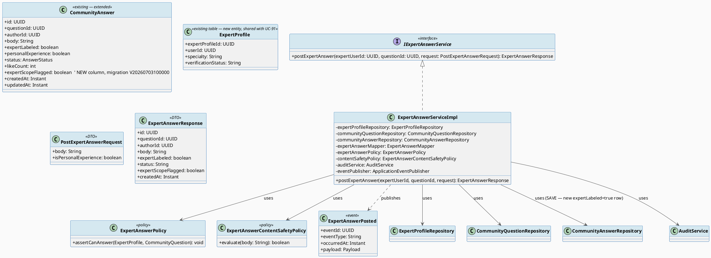
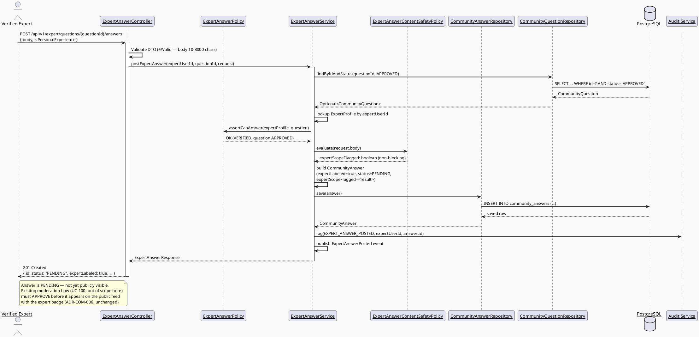
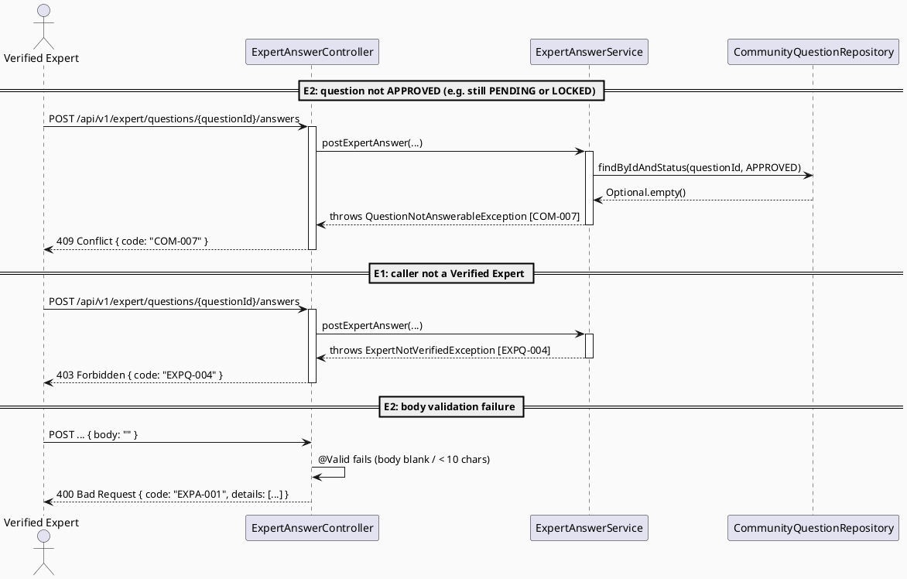
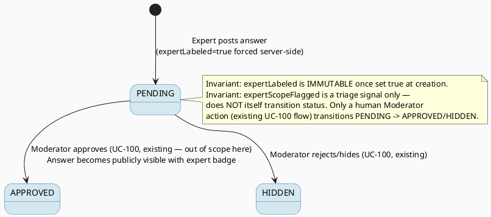

# ENGINEERING DOCUMENTATION STANDARD (EDS) v2.0
# UC-92 Post Expert Answer

| Field | Value |
|-------|-------|
| **Document ID** | `CB-EXP-IMP-092` |
| **Version** | `1.0` |
| **Date** | `2026-07-02` |
| **Status** | `Draft` |
| **Document Owner** | `TV4 - Lâm` |
| **Author** | `AI Agent` |
| **Reviewed by** | `[ ] Pending` |
| **DPO Sign-off** | `[ ] Pending — expert answer body may reference user health context; retention follows existing community_answers policy, no new PII field added` |
| **Approved by** | `[ ] Pending` |
| **Last Review** | `2026-07-02` |
| **Based on EDS** | `v2.0` |

---

## CHANGELOG

| Ngày | Người thực hiện | Nội dung thay đổi |
|------|-----------------|-------------------|
| 2026-07-02 | AI Agent | Khởi tạo TDS cho UC-92 (Draft) |

---

## MỤC LỤC

1. [Tổng quan Module](#1-tổng-quan-module)
2. [Ma trận Truy vết](#2-ma-trận-truy-vết-traceability-matrix)
3. [Architecture Decision Records (ADR)](#3-architecture-decision-records-adr)
4. [Non-Functional Requirements & SLA](#4-non-functional-requirements--sla)
5. [Static Modeling](#5-static-modeling)
6. [Dynamic Modeling](#6-dynamic-modeling)
7. [Domain Event Catalog](#7-domain-event-catalog)
8. [Interface Specification](#8-interface-specification)
9. [API Specification](#9-api-specification)
10. [Bảng mã lỗi](#10-bảng-mã-lỗi)
11. [Quy trình Triển khai](#11-quy-trình-triển-khai-step-by-step)
12. [Rollback & Incident Runbook](#12-rollback--incident-runbook)
13. [Kịch bản Kiểm thử Chi tiết](#13-kịch-bản-kiểm-thử-chi-tiết)
14. [Phương pháp Xác minh](#14-phương-pháp-xác-minh)
15. [Mẫu thử thực tế](#15-mẫu-thử-thực-tế-api-verification-samples)
16. [Bảng tổng hợp phân quyền](#16-bảng-tổng-hợp-phân-quyền-authorization-matrix)
17. [AI Prompt Constraints (CASE 2.0)](#17-ai-prompt-constraints-case-20)
18. [Open Items / Research Gate](#18-open-items--research-gate)

---

## 1. Tổng quan Module

| Field | Value |
|-------|-------|
| **Module Name** | `PostExpertAnswer` |
| **Bounded Context** | `expert` (writes into existing `community` aggregate — extends `community_answers`) |
| **Platform** | Web — Expert Portal |
| **Data Classification** | `Internal` (answer body is free text; may reference the asker's shared health context — no direct PII field) |
| **Compliance Scope** | `BR-RBAC`, `BR-CONSULTATION`, `BR-SAFETY` (CLAUDE.md: "AI provides guidance only; never diagnose, prescribe, or delay emergency routing" — analogously, an EXPERT's own answer must also stay within safe advisory scope; this UC enforces a human-authored scope-boundary policy, not an AI content generator) |
| **Upstream Dependencies** | `community_answers`, `community_questions`, `expert_profiles` |
| **Downstream Consumers** | UC-91 queue (marks question as expert-answered), UC-93 (expert may chain a consultation suggestion after posting), community feed (`is_expert_labeled` badge display), moderation queue (`PENDING` answers are reviewed) |

**Mô tả:** A Verified Expert posts a public answer to an `APPROVED` community question, selected from the UC-91 queue. The answer is stored via the **existing** `community_answers` table/entity, with `is_expert_labeled = true` (currently only settable by Moderator/System per ADR-COM-005 in the existing code — **this UC formally extends that rule**: the expert-answer endpoint is now also an authorized setter of `expertLabeled=true`, scoped strictly to `Verified Expert` callers). SRS `§3.2.1.6` (lines 859-878).

**Primary Actor:** Verified Expert. **Secondary Actors:** None. **Priority:** High. **Frequency:** Regular.

---

## 2. Ma trận Truy vết (Traceability Matrix)

| Requirement ID | Loại | Mô tả yêu cầu | Thành phần Code | Compliance Target | ADR liên quan |
|----------------|------|---------------|-----------------|-------------------|---------------|
| SRS-UC-92 | Use Case | Verified Expert posts public answer with expert badge | `ExpertAnswerController.postExpertAnswer()` | BR-RBAC | ADR-EXP-092-01 |
| BR-RBAC | Business Rule | Only VERIFIED experts, matching-or-any specialty, may post as expert | `ExpertAnswerPolicy.assertCanAnswer()` | BR-RBAC | ADR-EXP-092-02 |
| BR-SAFETY (derived) | Business Rule | Public expert answers must stay advisory/informational — no diagnostic/prescriptive language auto-approved without moderation | `ExpertAnswerContentSafetyPolicy` | BR-SAFETY | ADR-EXP-092-03 |
| ADR-COM-005 (existing) | Existing Decision | `is_expert_labeled` only settable by Moderator/System, never from request body | `CommunityAnswerMapper` (existing) — **extended** by `ExpertAnswerMapper` (new) which sets it server-side, never from client payload | BR-RBAC | ADR-EXP-092-01 |
| ADR-COM-006 (existing) | Existing Decision | Answers only postable to `APPROVED` questions; new answers always start `PENDING` | `ExpertAnswerServiceImpl` reuses `QuestionNotAnswerableException` (COM-007) and `AnswerStatus.PENDING` default | BR-CONSULTATION | — |
| POST-3 (SRS) | Postcondition | Sensitive actions recorded for audit | `AuditService.log(EXPERT_ANSWER_POSTED, ...)` | BR-AUDIT | — |

---

## 3. Architecture Decision Records (ADR)

### ADR-EXP-092-01 — Extend `CommunityAnswer` entity/table rather than create a parallel `ExpertAnswer` table

| Field | Value |
|-------|-------|
| **Status** | `Accepted` |
| **Deciders** | `AI Agent (Technical Architect role)` |
| **Date** | `2026-07-02` |

#### Bối cảnh (Context)
`community_answers` already has `is_expert_labeled boolean` and `status` (`PENDING/APPROVED/HIDDEN`). The community feed, search (`hasExpertAnswer` filter in `CommunityQuestionRepository.searchApproved`), and moderation flows already read/branch on `is_expert_labeled`. A parallel `expert_answers` table would fork this state and break existing feed/search logic.

#### Các phương án đã xem xét (Options Considered)

| Phương án | Mô tả | Ưu điểm | Nhược điểm |
|-----------|-------|----------|------------|
| A | New `expert_answers` table, expert package owns it fully | Clean bounded-context ownership | Duplicates `community_answers`; breaks existing feed `hasExpertAnswer` search which reads `community_answers.is_expert_labeled` |
| B | Reuse `community_answers` table; add a NEW expert-specific write path (`ExpertAnswerService`) in the `expert` package that calls into `community.repository.CommunityAnswerRepository` directly, setting `is_expert_labeled=true` server-side | Single source of truth; feed/search continue to work unmodified | `expert` package depends on `community` entities (same pattern already accepted in ADR-EXP-091-01) |
| C | Modify existing `CommunityAnswerService.postAnswer()` to accept an `isExpert` flag from a privileged caller | Minimal new code | Conflates two authorization models (any-authenticated-user vs. verified-expert-only) in one method — violates least-privilege clarity |

#### Quyết định (Decision)
Chọn **Phương án B**. `expert` package gets a NEW `ExpertAnswerService`/`ExpertAnswerServiceImpl`/`ExpertAnswerController` that constructs and saves a `CommunityAnswer` entity directly via the EXISTING `CommunityAnswerRepository`, with `expertLabeled = true` hardcoded server-side (never client-supplied — preserves ADR-COM-005). This is additive: `POST /api/v1/community/questions/{questionId}/answers` (existing, any authenticated user, always `expertLabeled=false`) remains untouched; a NEW endpoint `POST /api/v1/expert/questions/{questionId}/answers` is added for the expert-specific flow with its own policy checks.

#### Hệ quả (Consequences)

**Tích cực:** Feed/search/moderation code needs zero changes. Single `CommunityAnswer` entity remains the one source of truth for "is this answer expert-labeled."

**Tiêu cực / Trade-offs:** Two controllers write to the same table — must keep both `expertLabeled` invariants correct (existing one always `false`, new one always `true`) via unit tests on both mappers (see Test-Spec `EXPA-TC-SEC-002`).

**Compliance Impact:** None — no new PII table.

---

### ADR-EXP-092-02 — Authorization scope: which experts may answer which questions

| Field | Value |
|-------|-------|
| **Status** | `Accepted` (MVP: any Verified Expert may answer any APPROVED question — specialty is advisory-only for the queue, not enforced at write time) |
| **Date** | `2026-07-02` |

#### Quyết định (Decision)
UC-91's specialty match is a **display/filtering convenience**, not a write-time restriction. At write time (UC-92), the ONLY authorization requirement is: caller has `Role.EXPERT` AND `expert_profiles.verification_status = 'VERIFIED'` AND the target `community_questions.status = 'APPROVED'`. We do NOT block an expert from answering outside their stated specialty — SRS does not state this restriction explicitly (E1 only says "outside the permitted data scope," which is interpreted as role/verification scope, not specialty scope). This is marked **Open** in §18 for Product confirmation — if a stricter specialty-locked write is desired later, `ExpertAnswerPolicy` is the single insertion point.

**Compliance Impact:** None.

---

### ADR-EXP-092-03 — Content-safety / scope-boundary enforcement for expert answers

| Field | Value |
|-------|-------|
| **Status** | `Accepted` (MVP: app-level pattern flagging + mandatory moderation gate; explicitly NOT an AI auto-block) |
| **Date** | `2026-07-02` |

#### Bối cảnh (Context)
SRS UC-92 description: "Posts public answers with an expert badge **and safe-scope boundaries**." CLAUDE.md: *"AI provides guidance only; never diagnose, prescribe, or delay emergency routing"* and *"For health, ... expert, moderation, and safety workflows: enforce existing RBAC, consent scope/expiry, and audit requirements."* Although this constraint text is written about AI, it directly informs how much autonomy the SYSTEM should have over an EXPERT's own words: the system must **never auto-diagnose/auto-prescribe on the expert's behalf**, and must not silently auto-approve content that could contain unsafe diagnostic/prescriptive claims — a human moderation gate is the safety backstop, matching the existing `AnswerStatus.PENDING` default (ADR-COM-006) which the community package ALREADY enforces for all answers, expert or not.

#### Các phương án đã xem xét (Options Considered)

| Phương án | Mô tả | Ưu điểm | Nhược điểm |
|-----------|-------|----------|------------|
| A | Full AI-based auto-diagnosis-detection with auto-block (reject the POST) | Strongest technical guardrail | Violates CLAUDE.md "AI provides guidance only" if used to make a final accept/reject decision on a human expert's clinical judgment; also a scope/complexity risk (needs a classifier, false-positive handling, appeal flow) — none of which exists in this codebase (no `Gemini`/AI-moderation integration point found in `community`/`expert` packages) |
| B | App-level heuristic pattern flag (regex/keyword list for diagnostic verbs like "kê đơn", "chẩn đoán xác định", dosage-with-drug-name patterns) that sets a NON-BLOCKING flag `content_flagged_for_review = true`, combined with the EXISTING mandatory `status = PENDING` gate (ADR-COM-006) that already routes ALL new answers through moderation before public visibility | No new AI dependency; reuses existing moderation queue; expert retains authorship control; flag gives moderators a triage signal, doesn't silently reject | Heuristic, not exhaustive — false negatives possible; is explicitly a triage aid, not a safety guarantee |
| C | No content-safety mechanism beyond existing `PENDING` moderation gate | Simplest | Does not fulfil SRS's explicit "safe-scope boundaries" wording — under-delivers the use case |

#### Quyết định (Decision)
Chọn **Phương án B**. Concrete design:
1. **Character limit:** answer `body` must be 10–3000 chars (same bounds as existing `PostCommunityAnswerRequest`, reused for consistency).
2. **Mandatory moderation gate (reused, not new):** every new expert answer is created with `status = AnswerStatus.PENDING` (ADR-COM-006 — already enforced by the existing `CommunityAnswer` entity default; UC-92 does NOT introduce a bypass). This is the actual safety backstop.
3. **New non-blocking triage signal:** add a new boolean column `expert_scope_flagged` (default `false`) to `community_answers` (migration `V20260703100000`), set server-side by `ExpertAnswerContentSafetyPolicy.evaluate(body)` — a keyword/pattern heuristic (list maintained in application config, NOT hardcoded magic strings, so moderators/compliance can update it without a redeploy... *deployment mechanism for the config list itself is Open, see §18*). This flag does NOT block the POST — it only affects moderation queue sort/priority (out of scope for UC-92 itself; consumed by the existing UC-100 `ModerateCommunityContent` moderation UI, a downstream enhancement noted but not implemented here since UC-100 is out of this batch's scope).
4. Per CLAUDE.md, the system **never** auto-diagnoses or auto-prescribes — the flag is purely advisory metadata for human moderators; the expert's answer is never rewritten, redacted, or silently altered by the system.

#### Hệ quả (Consequences)

**Tích cực:** Directly satisfies "safe-scope boundaries" without violating "AI provides guidance only, never diagnose/prescribe." Reuses the existing, already-battle-tested `PENDING` moderation gate as the real safety control.

**Tiêu cực / Trade-offs:** Heuristic keyword list requires ongoing curation; is explicitly **not** a hard safety guarantee — documented as Open item, needs Product/Clinical-safety sign-off on the actual keyword list content (this TDS defines the mechanism, not the exhaustive word list).

**Compliance Impact:** BR-SAFETY — satisfied via human-in-the-loop moderation, consistent with existing pattern (no new compliance risk introduced).

---

## 4. Non-Functional Requirements & SLA

### 4.1. Performance & Availability

| Category | Requirement | Target SLA | Measurement Method |
|----------|-------------|------------|---------------------|
| Latency | Post answer API (p99) | < 500ms | k6 load test |
| Availability | Uptime (monthly) | 99.9% | Uptime monitor |

### 4.2. Data Integrity & Retention

| Category | Requirement | Target | Verification Method | Compliance Basis |
|----------|-------------|--------|---------------------|------------------|
| Durability | Zero record loss on answer post | RPO = 0 | Transaction log | — |
| Invariant | `expertLabeled` always `true` for this endpoint's writes, never client-controlled | 100% | Unit test (mapper never reads `isExpertLabeled` from request DTO) | BR-RBAC |
| Invariant | `status` always starts `PENDING`, never `APPROVED` on creation via this endpoint | 100% | Unit test | BR-SAFETY |

### 4.3. Security

| Category | Requirement | Target | Verification Method | Compliance Basis |
|----------|-------------|--------|---------------------|------------------|
| Access control | `ROLE_EXPERT` + `VERIFIED` only | Least privilege (§16) | Auth Matrix | BR-RBAC |
| Input validation | Body 10-3000 chars, XSS-safe (no raw HTML render assumption on frontend) | 100% | Validation test | OWASP A03 |
| Content triage | `expert_scope_flagged` computed server-side only | 100% | Unit test | BR-SAFETY |

### 4.4. Scalability & Capacity Planning

Low write volume expected (experts post answers, not high-frequency). No special scaling beyond existing `idx_community_answers_question_id`/`idx_community_answers_status` indexes.

---

## 5. Static Modeling

### 5.1. Class Diagram (PlantUML)



### 5.2. Data Structure (Flyway SQL Migration)

**Migration required.** Adds ONE non-breaking, nullable-safe boolean column to the existing `community_answers` table — does not modify any applied migration (append-only new file, per CLAUDE.md Flyway rule).

Tạo file: `src/main/resources/db/migration/V20260703100000__add_expert_scope_flagged_to_community_answers.sql`

```sql
-- === UC-92 PostExpertAnswer — content-safety triage flag ===
-- ADR-EXP-092-03: non-blocking heuristic flag for moderator triage.
-- Does NOT gate answer visibility by itself — existing `status = PENDING` default
-- (ADR-COM-006, unchanged) remains the actual safety gate.

ALTER TABLE public.community_answers
  ADD COLUMN expert_scope_flagged boolean NOT NULL DEFAULT false;

COMMENT ON COLUMN public.community_answers.expert_scope_flagged IS
  'Non-blocking heuristic flag set server-side when an expert answer body matches diagnostic/prescriptive language patterns (ADR-EXP-092-03). Advisory triage signal for moderators only — never auto-blocks or auto-edits expert content.';

CREATE INDEX idx_community_answers_expert_scope_flagged
  ON public.community_answers (expert_scope_flagged)
  WHERE expert_scope_flagged = true;
```

> **Quy tắc đặt tên:** snake_case, consistent with existing `is_expert_labeled`/`is_personal_experience` naming style. Column intentionally named `expert_scope_flagged` (not `is_expert_scope_flagged`) to avoid Hibernate boolean-getter ambiguity noted in the header comment of `V1__init_schema.sql` (line 15: "is_expert_labeled/is_personal_experience — not answer_type" — the codebase already tolerates mixed `is_`-prefixed and bare boolean names, so either is acceptable; bare form chosen here for brevity, confirm with reviewer).

---

## 6. Dynamic Modeling

### 6.1. Sequence Diagram — Happy Path (PlantUML)



### 6.2. Sequence Diagram — Alt/Error Path (PlantUML)



### 6.3. State Machine



**⚠️ Invariant bất biến:** No code path in `ExpertAnswerServiceImpl` may set `status = APPROVED` directly. Only the existing moderation service (out of this UC's scope) may do so.

---

## 7. Domain Event Catalog

### 7.1. Events Published (Phát ra)

| Event Name | Trigger | Publisher | Subscriber(s) | Payload Schema | Async? |
|------------|---------|-----------|---------------|----------------|--------|
| `ExpertAnswerPosted` | Successful `postExpertAnswer()` | `ExpertAnswerServiceImpl` | Notification module (notify question author — existing `UC159_ReceiveCommunityReplyNotification` consumer, wiring is out of scope here but payload is compatible), future moderation-priority consumer | `ExpertAnswerPosted.java` (below) | No (MVP: synchronous in-transaction publish via Spring `ApplicationEventPublisher`; can be made async later without payload change) |

### 7.2. Events Consumed (Tiêu thụ)

| Event Name | Source | Handler | Action thực hiện |
|------------|--------|---------|------------------|
| — | None | — | UC-92 does not consume events |

### 7.3. Payload Schema

```java
// ExpertAnswerPosted.java
public record ExpertAnswerPosted(
    UUID    eventId,
    String  eventType,        // "ExpertAnswerPosted"
    Instant occurredAt,
    String  version,          // "1.0"
    Payload payload,
    Metadata metadata
) {

    public record Payload(
        UUID answerId,
        UUID questionId,
        UUID expertUserId,
        UUID expertProfileId,
        boolean expertScopeFlagged
    ) {}

    public record Metadata(
        UUID   correlationId,
        String causedBy       // expertUserId as string
    ) {}
}
```

---

## 8. Interface Specification

### 8.1. Service Interface

```java
// PostExpertAnswerRequest.java — Input DTO
// @version 1.0
public class PostExpertAnswerRequest {
    @NotBlank(message = "body is required")
    @Size(min = 10, max = 3000, message = "body must be between 10 and 3000 characters")
    private String body;

    @NotNull(message = "isPersonalExperience is required")
    private Boolean isPersonalExperience;
    // isExpertLabeled is NOT accepted from request — forced true server-side (ADR-EXP-092-01, mirrors ADR-COM-005)
}

// ExpertAnswerResponse.java — Output DTO
public class ExpertAnswerResponse {
    private UUID id;
    private UUID questionId;
    private UUID authorId;          // == expert's userId
    private String body;
    private boolean expertLabeled;  // always true for this endpoint
    private String status;          // always "PENDING" on creation
    private boolean expertScopeFlagged;
    private Instant createdAt;
}

// IExpertAnswerService.java — Service Contract
// @version 1.0
public interface IExpertAnswerService {
    /**
     * Posts a public, expert-labeled answer to an APPROVED community question.
     * Answer always starts PENDING (ADR-COM-006, unchanged) and expertLabeled=true (ADR-EXP-092-01).
     * @throws ExpertNotVerifiedException (EXPQ-004) when caller is not a VERIFIED expert
     * @throws com.carebridge.backend.community.exception.QuestionNotAnswerableException (COM-007) when question is not APPROVED
     */
    ExpertAnswerResponse postExpertAnswer(UUID expertUserId, UUID questionId, PostExpertAnswerRequest request);
}
```

### 8.2. Repository Interface

```java
// CommunityAnswerRepository.java — EXISTING, community package.
// UC-92 adds NO new repository — reuses save(CommunityAnswer) from JpaRepository as-is.
// (No signature change needed; new column expertScopeFlagged is a plain entity field.)
```

---

## 9. API Specification

### 9.1. Endpoints Table

| Method | Path | Auth Level | Required Roles | Rate Limit | Idempotent? |
|--------|------|------------|----------------|------------|-------------|
| `POST` | `/api/v1/expert/questions/{questionId}/answers` | JWT Bearer | `EXPERT` (verified) | 30/min | No |

### 9.2. Request / Response Schemas

#### `POST /api/v1/expert/questions/{questionId}/answers`

**Request Body:**
```json
{
  "body": "Bổ sung sắt trong thai kỳ thường được khuyến nghị từ tuần 20 nếu có chỉ định của bác sĩ theo dõi trực tiếp. Bạn nên trao đổi cụ thể với bác sĩ sản khoa để được đánh giá đúng tình trạng.",
  "isPersonalExperience": false
}
```

**Response — 201 Created (Happy Path):**
```json
{
  "success": true,
  "data": {
    "id": "c7e2...-...",
    "questionId": "b3f1c2a0-...-...",
    "authorId": "d4a5...-...",
    "body": "Bổ sung sắt trong thai kỳ...",
    "expertLabeled": true,
    "status": "PENDING",
    "expertScopeFlagged": false,
    "createdAt": "2026-07-02T10:05:00.000Z"
  },
  "message": "Expert answer submitted for moderation",
  "timestamp": "2026-07-02T10:05:00.000Z"
}
```

**Response — 409 Conflict (question not answerable):**
```json
{ "error": { "code": "COM-007", "message": "Question is not open for answers — must be APPROVED status" } }
```

**Response — 400 Bad Request:**
```json
{
  "error": {
    "code": "EXPA-001",
    "message": "Validation failed",
    "details": [{ "field": "body", "message": "body must be between 10 and 3000 characters" }]
  }
}
```

---

## 10. Bảng mã lỗi (Error Codes)

| Code | HTTP Status | Message (EN) | Message (VI) | Trigger Condition |
|------|-------------|--------------|--------------|-------------------|
| `EXPA-001` | 400 | Validation failed | Dữ liệu không hợp lệ | `body` blank or outside 10-3000 chars, `isPersonalExperience` null |
| `EXPA-002` | 404 | Question not found | Không tìm thấy câu hỏi | `questionId` does not exist |
| `COM-007` | 409 | Question not open for answers | Câu hỏi chưa được duyệt để trả lời | question `status != APPROVED` (reused from existing `QuestionNotAnswerableException`) |
| `EXPQ-004` | 403 | Verified expert required | Chỉ chuyên gia đã xác minh mới được trả lời | Caller not `VERIFIED` expert |
| `EXPA-003` | 401 | Authentication required | Yêu cầu đăng nhập | No/invalid JWT |
| `EXPA-004` | 429 | Rate limit exceeded | Vượt quá giới hạn tần suất | > 30 posts/min |
| `EXPA-005` | 500 | Internal error | Lỗi hệ thống | Unexpected failure |

---

## 11. Quy trình Triển khai (Step-by-Step)

### 11.1. Prerequisites
- [ ] ADR-EXP-092-01/02/03 reviewed
- [ ] DPO sign-off — recommend "N/A, reuses existing community_answers retention policy" but must be explicitly confirmed given health-context answer bodies (see §18)
- [ ] TDS approved

### 11.2. Pre-Migration Checklist
- [ ] Migration `V20260703100000` reviewed — additive `ALTER TABLE ADD COLUMN ... DEFAULT false`, non-locking on PostgreSQL for a boolean with constant default (fast path, no full table rewrite in PG 11+)
- [ ] Tested on staging
- [ ] Rollback script tested (§12)

### 11.3. Implementation Steps

#### Chặng 1 — Flyway migration
```sql
-- See §5.2
```
```bash
./mvnw flyway:migrate
```

#### Chặng 2 — Extend `CommunityAnswer` entity (add `expertScopeFlagged` field) + `ExpertProfile` entity (shared with UC-91, create once)

#### Chặng 3 — `ExpertAnswerPolicy`, `ExpertAnswerContentSafetyPolicy`, `ExpertAnswerService`/Impl, `ExpertAnswerMapper`, DTOs

#### Chặng 4 — `ExpertAnswerController` + `ExpertAnswerPosted` event + audit wiring (`AuditAction.EXPERT_ANSWER_POSTED` — NEW enum constant, additive change to `AuditAction.java`)

#### Chặng 5 — Verification sau deploy
```bash
curl -X POST https://[host]/api/v1/expert/questions/{id}/answers \
  -H "Authorization: Bearer [EXPERT_JWT]" -H "Content-Type: application/json" \
  -d '{"body":"...", "isPersonalExperience": false}'
# Expected: 201, status=PENDING, expertLabeled=true
```

### 11.4. Deployment Checklist
- [ ] Migration applied
- [ ] Health check 200
- [ ] Error rate < 1% in 10 min
- [ ] Audit log emitting `EXPERT_ANSWER_POSTED`
- [ ] Existing `CommunityAnswerController` behavior UNCHANGED (regression check)

---

## 12. Rollback & Incident Runbook

### 12.1. Trigger Conditions

| Điều kiện | Ngưỡng | Người quyết định |
|-----------|--------|------------------|
| Error rate | > 5% trong 5 phút | On-call Engineer |
| Expert answers auto-appearing as APPROVED (safety invariant breach) | Any occurrence | Tech Lead + DPO — IMMEDIATE rollback |

### 12.2. Rollback Procedure
```bash
psql -h $DB_HOST -U $DB_USER -d $DB_NAME \
  -c "ALTER TABLE community_answers DROP COLUMN IF EXISTS expert_scope_flagged;"
psql -h $DB_HOST -U $DB_USER -d $DB_NAME \
  -c "DELETE FROM flyway_schema_history WHERE version = '20260703100000';"
git checkout -- src/main/java/com/carebridge/backend/expert/
kubectl rollout undo deployment/carebridge-api
```

### 12.3. Notification Protocol

| Thời điểm | Người nhận | Kênh |
|-----------|------------|------|
| Ngay khi phát hiện | On-call team | Slack `#incident` |
| Trong 30 phút | DPO | Email — nếu safety invariant (PENDING bypass) bị vi phạm |

### 12.4. Post-Incident Review
Standard PIR template — mandatory if the PENDING-gate safety invariant is ever bypassed (5 Whys, remediation, prevention).

---

## 13. Kịch bản Kiểm thử Chi tiết

See `UC92_PostExpertAnswer_Test-Spec.md`.

---

## 14. Phương pháp Xác minh

### 14.1. Database Inspection
```sql
SELECT id, status, is_expert_labeled, expert_scope_flagged, created_at
FROM community_answers
WHERE author_id = '[expertUserId]'
ORDER BY created_at DESC LIMIT 5;
-- Expected: status='PENDING', is_expert_labeled=true always for expert-endpoint writes
```

### 14.2. Log / Audit Verification
```bash
kubectl logs -l app=carebridge-api | grep '"action":"EXPERT_ANSWER_POSTED"' | head -5
```

---

## 15. Mẫu thử thực tế (API Verification Samples)

### 15.1. Happy Path
```bash
curl -X POST https://[host]/api/v1/expert/questions/{questionId}/answers \
  -H "Authorization: Bearer [EXPERT_JWT]" -H "Content-Type: application/json" \
  -d '{"body":"Nội dung tư vấn hợp lệ dài hơn mười ký tự.", "isPersonalExperience": false}'
```

### 15.2. Error Paths
```bash
# Non-expert JWT → 403
curl -X POST https://[host]/api/v1/expert/questions/{questionId}/answers \
  -H "Authorization: Bearer [MOTHER_JWT]" -H "Content-Type: application/json" \
  -d '{"body":"...", "isPersonalExperience": false}'
```
```json
{ "error": { "code": "EXPQ-004", "message": "Only verified experts may post an expert answer" } }
```

```bash
# Attempt to force expertLabeled/status via request body (must be ignored) → still PENDING
curl -X POST https://[host]/api/v1/expert/questions/{questionId}/answers \
  -H "Authorization: Bearer [EXPERT_JWT]" -H "Content-Type: application/json" \
  -d '{"body":"...", "isPersonalExperience": false, "status":"APPROVED", "expertLabeled": false}'
```
**Expected Response (201):** `status: "PENDING"`, `expertLabeled: true` — extra fields silently ignored (DTO has no such fields to bind).

---

## 16. Bảng tổng hợp phân quyền (Authorization Matrix)

| Endpoint | `MOTHER/FAMILY` | `EXPERT (unverified)` | `EXPERT (VERIFIED)` | `MODERATOR` | `SYSTEM_ADMIN` |
|----------|---------|--------|---------|-------|----------|
| `POST /api/v1/expert/questions/{id}/answers` | ❌ | ❌ (403 EXPQ-004) | ✅ own-authored, question must be APPROVED | ❌ (moderators use existing moderation endpoints, not this one) | ✅ (ops/debug only) |
| `POST /api/v1/community/questions/{id}/answers` (existing, unchanged) | ✅ (expertLabeled always false) | ✅ (expertLabeled always false — this endpoint never grants the badge) | ✅ (expertLabeled always false) | ✅ | ✅ |

**Chú thích:** ✅ = Allowed. ❌ = Denied (403). `Own` = expert is the answer's author (all expert answers are self-authored; there is no "answer on behalf of another expert").

---

## 17. AI Prompt Constraints (CASE 2.0)

### 17.1 Constraint Summary Table

| # | Constraint | Source (ADR/BR) | Last Verified |
|---|-----------|-----------------|---------------|
| C1 | `expertLabeled` MUST be hardcoded `true` server-side in `ExpertAnswerMapper` — MUST NOT be read from `PostExpertAnswerRequest` (there is no such field on the DTO at all) | ADR-EXP-092-01 / ADR-COM-005 | 2026-07-02 |
| C2 | `status` MUST default to `AnswerStatus.PENDING` on every new expert answer — MUST NOT be settable to `APPROVED` by this endpoint under any input | ADR-COM-006 (existing, reused) | 2026-07-02 |
| C3 | System MUST NOT auto-diagnose, auto-prescribe, or silently rewrite/redact the expert's answer text. `ExpertAnswerContentSafetyPolicy.evaluate()` MUST be non-blocking — it may only SET a metadata flag, never reject or alter the POST | CLAUDE.md "AI provides guidance only" + ADR-EXP-092-03 | 2026-07-02 |
| C4 | Identity via `SecurityUtils.requireCurrentUserId(principal)`, expert verification via `ExpertProfileRepository.findByUserId` + `ExpertAnswerPolicy` — MUST reject BEFORE the question lookup or the answer save, in this order: auth → expert-verified → question-approved → validate body → save | ADR-EXP-092-02 | 2026-07-02 |
| C5 | Reuse `CommunityAnswerRepository`/`CommunityAnswer` entity — do NOT create a parallel `expert_answers` table | ADR-EXP-092-01 | 2026-07-02 |
| C6 | Every successful post MUST call `AuditService.log(AuditAction.EXPERT_ANSWER_POSTED, ...)` before returning | POST-3 (SRS) | 2026-07-02 |

### 17.2 Constraint Injection Block

```
[CONSTRAINT BLOCK — Module: PostExpertAnswer]
Theo TDS CB-EXP-IMP-092 và các ADR liên quan:

1. expertLabeled hardcoded true server-side — never accept from request body.
2. status always starts PENDING — this endpoint can NEVER set APPROVED.
3. ExpertAnswerContentSafetyPolicy is NON-BLOCKING metadata only — never auto-diagnose/prescribe/rewrite the expert's text; never reject a POST based on its output alone.
4. Authorization order: auth -> expert-VERIFIED check -> question APPROVED check -> validate body -> save. Reject as early as possible.
5. Reuse CommunityAnswerRepository/CommunityAnswer entity — no parallel expert_answers table.
6. Every successful post calls AuditService.log(EXPERT_ANSWER_POSTED, ...).

[CONTEXT BLOCK]
- Bounded Context: expert (writes into community.CommunityAnswer)
- Data Classification: Internal
- Compliance: BR-RBAC, BR-CONSULTATION, BR-SAFETY
- Existing interfaces: §8 + community.CommunityAnswerRepository (existing, unmodified signature)
- Error codes: §10
- Auth matrix: §16

[TASK BLOCK]
Implement PostExpertAnswer satisfying constraints above.
Output must conform to §8 Interface Specification and §9 API Specification.
Tests must cover §13 (see Test-Spec companion file), including the PENDING-gate and expertLabeled-immutability invariants as CRITICAL severity.
```

### 17.3 Constraint Quality Checklist
- [x] Mỗi constraint traceable về ADR hoặc BR cụ thể
- [x] Không có constraint generic
- [x] Constraint block reference §8 Interface
- [x] Constraint block reference §16 Auth Matrix
- [x] ≥ 3 constraints (6 present)

### 17.4 Anti-Pattern Detection

| AP-ID | Anti-Pattern | Dấu hiệu | Hành động |
|-------|-------------|-----------|----------|
| AP-AI-001 | Unconstrained Gen | New `expert_answers` table created instead of reuse | Reject — re-inject C5 |
| AP-AI-003 | Implicit Decision | Content safety policy silently BLOCKS the POST (contradicts C3) | Reject — rewrite as non-blocking |
| AP-AI-005 | Hallucinated Contract | `isExpertLabeled` field added to `PostExpertAnswerRequest` | Reject — DTO must not expose this field per C1 |
| AP-EXP-092-A (project-specific) | AI auto-diagnosing/prescribing in expert answer text | System code path modifies/rejects expert's raw `body` based on medical-content judgment | Reject — violates CLAUDE.md; only a human Moderator (existing UC-100) may act on flagged content |
| AP-EXP-092-B (project-specific) | Auto-approving expert answer without `PENDING` default | New answer created with `status=APPROVED` directly from `ExpertAnswerServiceImpl` | Reject — violates ADR-COM-006 invariant |

---

## 18. Open Items / Research Gate

| ID | Item | Status | Notes |
|----|------|--------|-------|
| RG-4 | Exact keyword/pattern list for `ExpertAnswerContentSafetyPolicy` heuristic | **Open** | Mechanism (non-blocking flag + existing PENDING gate) is specified; the actual word list needs Clinical-safety/Product sign-off before Sprint 5. Placeholder: flag any body containing Vietnamese diagnostic-certainty phrases (e.g. "chẩn đoán xác định", "chắc chắn bị", "kê đơn thuốc") — NOT exhaustive, illustrative only. |
| RG-4 | Where the keyword list config lives (DB table vs. `application.yml` vs. feature-flag service) | **Open** | No existing config-management pattern for moderation word lists found in codebase; needs Architect decision. Defaulting to a static `application.yml` list for MVP unless told otherwise. |
| RG-6 | Whether specialty should be write-time-enforced (expert can only answer within their own specialty) | **Open** | ADR-EXP-092-02 currently allows any VERIFIED expert to answer any APPROVED question. SRS text doesn't explicitly require specialty-locking at write time — flagged for Product confirmation. |
| — | DPO sign-off status | **Open — Pending** | Answer bodies may reference asker's shared health context (via question body) even though `community_answers` itself stores no structured PII field. Recommend DPO reviews whether `community_answers` retention/anonymization policy (already governing all non-expert answers) is sufficient, or if expert answers need distinct handling. |

---

*Status: Draft — pending review and explicit "Approved" confirmation before implementation begins.*
