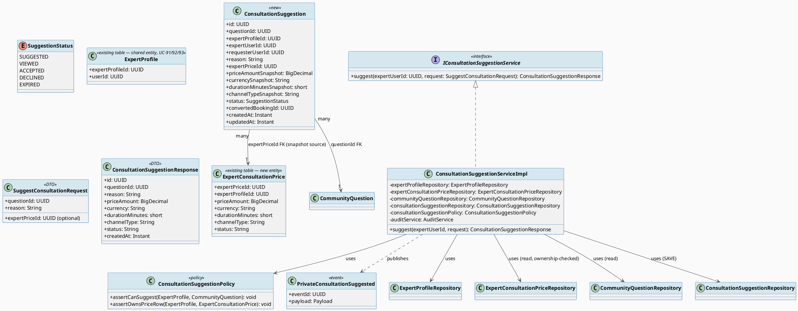
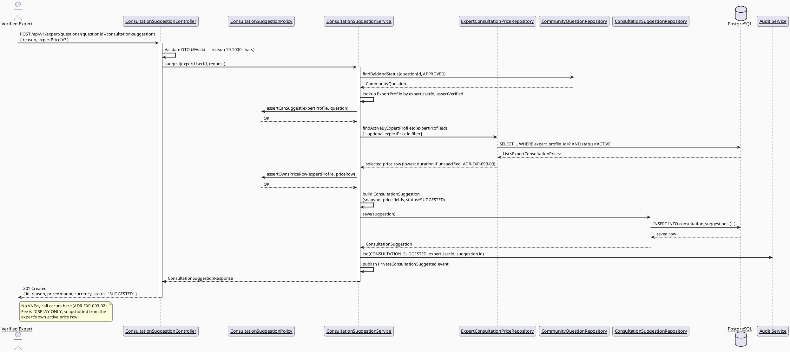
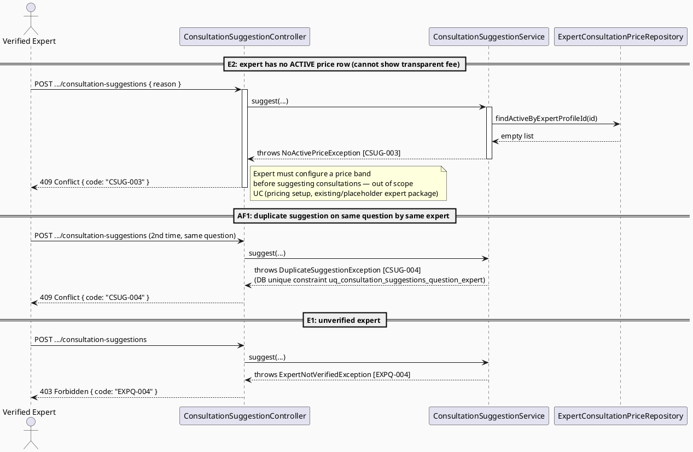
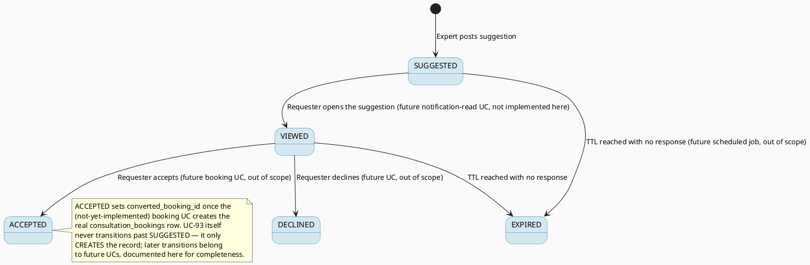

# ENGINEERING DOCUMENTATION STANDARD (EDS) v2.0
# UC-93 Suggest Private Consultation

| Field | Value |
|-------|-------|
| **Document ID** | `CB-EXP-IMP-093` |
| **Version** | `1.0` |
| **Date** | `2026-07-02` |
| **Status** | `Draft` |
| **Document Owner** | `TV4 - Lâm` |
| **Author** | `AI Agent` |
| **Reviewed by** | `[ ] Pending` |
| **DPO Sign-off** | `N/A — no payment is processed by this UC; fee amounts are numeric, not PII` |
| **Approved by** | `[ ] Pending` |
| **Last Review** | `2026-07-02` |
| **Based on EDS** | `v2.0` |

---

## CHANGELOG

| Ngày | Người thực hiện | Nội dung thay đổi |
|------|-----------------|-------------------|
| 2026-07-02 | AI Agent | Khởi tạo TDS cho UC-93 (Draft) |

---

## MỤC LỤC

1. [Tổng quan Module](#1-tổng-quan-module)
2. [Ma trận Truy vết](#2-ma-trận-truy-vết-traceability-matrix)
3. [Architecture Decision Records (ADR)](#3-architecture-decision-records-adr)
4. [Non-Functional Requirements & SLA](#4-non-functional-requirements--sla)
5. [Static Modeling](#5-static-modeling)
6. [Dynamic Modeling](#6-dynamic-modeling)
7. [Domain Event Catalog](#7-domain-event-catalog)
8. [Interface Specification](#8-interface-specification)
9. [API Specification](#9-api-specification)
10. [Bảng mã lỗi](#10-bảng-mã-lỗi)
11. [Quy trình Triển khai](#11-quy-trình-triển-khai-step-by-step)
12. [Rollback & Incident Runbook](#12-rollback--incident-runbook)
13. [Kịch bản Kiểm thử Chi tiết](#13-kịch-bản-kiểm-thử-chi-tiết)
14. [Phương pháp Xác minh](#14-phương-pháp-xác-minh)
15. [Mẫu thử thực tế](#15-mẫu-thử-thực-tế-api-verification-samples)
16. [Bảng tổng hợp phân quyền](#16-bảng-tổng-hợp-phân-quyền-authorization-matrix)
17. [AI Prompt Constraints (CASE 2.0)](#17-ai-prompt-constraints-case-20)
18. [Open Items / Research Gate](#18-open-items--research-gate)

---

## 1. Tổng quan Module

| Field | Value |
|-------|-------|
| **Module Name** | `SuggestPrivateConsultation` |
| **Bounded Context** | `expert` (reads `expert_consultation_prices`/`consultation_price_bands`; writes a NEW lightweight suggestion record — does NOT touch `consultation_bookings` or trigger VNPay) |
| **Platform** | Web — Expert Portal |
| **Data Classification** | `Internal` |
| **Compliance Scope** | `BR-RBAC`, `BR-CONSULTATION` |
| **Upstream Dependencies** | `community_questions`, `community_answers` (an expert typically suggests a consultation from the context of an answered question), `expert_profiles`, `expert_consultation_prices`, `consultation_price_bands` |
| **Downstream Consumers** | UC-? Booking flow (out of scope — the requester, if they accept, would separately initiate a real `consultation_bookings` row via a not-yet-implemented booking UC); notification module |

**Mô tả:** A Verified Expert, while viewing a community question/thread (typically after posting a public answer, UC-92), suggests that the asker consider a **private paid consultation** for deeper discussion. The suggestion includes a free-text reason and a **transparent fee display** sourced from the expert's own active `expert_consultation_prices` row(s). **VNPay is a secondary actor per SRS but is NOT invoked by this UC** — no payment is processed here; VNPay only becomes relevant in a separate, not-yet-implemented booking/payment UC that this suggestion may lead into. SRS `§3.2.1.7` (lines 880-899).

**Primary Actor:** Verified Expert. **Secondary Actor:** VNPay Payment Gateway (referenced by SRS for the eventual downstream payment, NOT called by this UC — see ADR-EXP-093-02). **Priority:** High. **Frequency:** Regular.

---

## 2. Ma trận Truy vết (Traceability Matrix)

| Requirement ID | Loại | Mô tả yêu cầu | Thành phần Code | Compliance Target | ADR liên quan |
|----------------|------|---------------|-----------------|-------------------|---------------|
| SRS-UC-93 | Use Case | Verified Expert suggests private consultation with reason + transparent fee | `ConsultationSuggestionController.suggest()` | BR-RBAC | ADR-EXP-093-01 |
| BR-RBAC | Business Rule | Only VERIFIED experts may suggest; only to the question's context they have legitimately engaged with | `ConsultationSuggestionPolicy` | BR-RBAC | ADR-EXP-093-01 |
| BR-CONSULTATION | Business Rule | Booking/payment/pricing actions must keep an auditable lifecycle state — this UC creates the FIRST auditable state (`SUGGESTED`) of that eventual lifecycle, without prematurely creating a `consultation_bookings` row | `ConsultationSuggestionServiceImpl` | BR-CONSULTATION | ADR-EXP-093-02 |
| SRS "transparent fee" | Functional | Fee shown to asker must reflect the expert's REAL active price (not a stale/mock value) | `ConsultationSuggestionServiceImpl` reads `expert_consultation_prices` (status=ACTIVE) at suggestion time and snapshots the amount | BR-CONSULTATION | ADR-EXP-093-03 |
| POST-3 (SRS) | Postcondition | Sensitive actions recorded for audit | `AuditService.log(CONSULTATION_SUGGESTED, ...)` | BR-AUDIT | — |

---

## 3. Architecture Decision Records (ADR)

### ADR-EXP-093-01 — New lightweight `consultation_suggestions` table, NOT a `consultation_bookings` row

| Field | Value |
|-------|-------|
| **Status** | `Accepted` |
| **Deciders** | `AI Agent (Technical Architect role)` |
| **Date** | `2026-07-02` |

#### Bối cảnh (Context)
`consultation_bookings` (existing table, `V1__init_schema.sql` lines 876-896) is a heavyweight entity requiring `availability_id`, `expert_price_id NOT NULL`, `scheduled_start/end NOT NULL`, `price_locked_at`, and a `status` lifecycle starting at `PENDING_PAYMENT` — i.e. it represents a **committed, schedulable, payable** booking. UC-93 is only a **suggestion** — the asker has not chosen a time slot or agreed to pay yet. Creating a `consultation_bookings` row at suggestion time would be semantically wrong (an unscheduled, unconfirmed booking) and would pollute booking-lifecycle reporting/commission calculations (UC-127) with rows that were never accepted.

#### Các phương án đã xem xét (Options Considered)

| Phương án | Mô tả | Ưu điểm | Nhược điểm |
|-----------|-------|----------|------------|
| A | Insert directly into `consultation_bookings` with a new early status like `SUGGESTED` | Reuses existing table | Violates existing `NOT NULL` constraints (`availability_id`, `scheduled_start/end` required) — would need nullable schema changes to an ALREADY-DEPLOYED table with real booking semantics; high blast radius |
| B | New `consultation_suggestions` table (separate from bookings), with a `converted_booking_id` nullable FK for later linkage when/if the asker books | Clean separation; no changes to existing booking table/constraints; matches "smallest scoped change" | New table = new migration (justified, low risk) |
| C | No persistence at all — suggestion is purely a notification-only, ephemeral action | Simplest | Fails BR-CONSULTATION "auditable lifecycle state" requirement; no way to track suggestion→booking conversion rate later |

#### Quyết định (Decision)
Chọn **Phương án B**. New table `consultation_suggestions`, migration `V20260703100100` (within the assigned range, `100000 + 00100` increment).

#### Hệ quả (Consequences)

**Tích cực:** `consultation_bookings` schema/constraints untouched (zero regression risk to existing booking/payment/commission code paths, none of which are yet implemented but are reserved for TV4's later Sprint 4 work per `function-spec-task-allocation.md` lines 723-725). Suggestion lifecycle is independently auditable.

**Tiêu cực / Trade-offs:** A future booking UC must know to check for `consultation_suggestions.converted_booking_id` to link the two — documented as an Open item for that future UC (§18), not blocking for UC-93 itself.

**Compliance Impact:** None.

---

### ADR-EXP-093-02 — VNPay is NOT invoked by this UC (suggestion only, no payment)

| Field | Value |
|-------|-------|
| **Status** | `Accepted` |
| **Date** | `2026-07-02` |

#### Bối cảnh (Context)
SRS lists "VNPay Payment Gateway" as a Secondary Actor for UC-93. No VNPay SDK/client/integration exists anywhere in `05_Development/CareBridgeAPI/src/main/java` (confirmed by search — zero matches for `VNPay*`). `UC78_SubmitDisputeOrRefundRequest` (checked as instructed) also does not contain an actual VNPay API integration — it deals with disputes/refunds against already-completed `payment_transactions` records, not initiating a new charge. Actually charging money at "suggestion" time — before the asker has agreed to anything — would be a serious safety/consent violation (BR-CONSULTATION requires an auditable, consensual lifecycle; charging on a mere suggestion has no consent basis).

#### Quyết định (Decision)
UC-93 treats VNPay as **out of scope for actual invocation**. The "transparent fee" requirement is satisfied by **displaying** the expert's current active price (read from `expert_consultation_prices`), not by processing payment. The secondary-actor relationship in SRS is interpreted as: VNPay becomes relevant LATER, when the asker accepts the suggestion and proceeds to an (unimplemented, out-of-scope) booking+payment UC. This UC's `ConsultationSuggestionResponse` includes the fee purely as informational display data.

#### Hệ quả (Consequences)

**Tích cực:** No premature payment risk; matches CLAUDE.md "smallest scoped change" and avoids inventing an unapproved VNPay integration.

**Tiêu cực / Trade-offs:** None — this is the only safe interpretation given SRS's own normal flow (Step 5: "displays the result," not "processes payment").

**Compliance Impact:** Avoids an unconsented-charge compliance risk.

---

### ADR-EXP-093-03 — Fee display format: snapshot at suggestion time, from expert's own ACTIVE price row

| Field | Value |
|-------|-------|
| **Status** | `Accepted` (mechanism), **exact currency-formatting UI copy marked Open** |
| **Date** | `2026-07-02` |

#### Bối cảnh (Context)
`expert_consultation_prices` has `price_amount numeric`, `currency varchar(10) DEFAULT 'VND'`, `duration_minutes smallint`, `channel_type varchar(30)`, `status varchar(20) DEFAULT 'ACTIVE'`, and effective date range. An expert may have multiple active price rows (e.g. different channel types: `VIDEO_CALL` vs `CHAT`, or different durations). SRS says "transparent fee" — singular in the UC description, but the schema supports plurality.

#### Quyết định (Decision)
1. If the expert has exactly ONE `ACTIVE` price row at suggestion time (most common MVP case), it is shown as the default suggested fee.
2. If the expert has MULTIPLE active price rows, the suggestion endpoint accepts an optional `expertPriceId` selecting which one to reference; if omitted, the **lowest-duration ACTIVE row** is used as a default (documented as a deterministic, testable rule — see §18 for whether Product wants a different default like "most recently created").
3. The response DTO returns a **snapshot** of `priceAmount`, `currency`, `durationMinutes`, `channelType` at the time of suggestion (copied fields, not a live join) — because the expert could later change prices; the historical suggestion record should reflect what was actually shown to the asker at that time (mirrors the existing `consultation_bookings.price_snapshot_amount` snapshot pattern already used elsewhere in the schema).
4. Currency formatting for VI locale display (e.g. `"500.000 ₫"` vs raw `500000`) is a **frontend concern**, not backend — backend returns raw numeric + currency code.

#### Hệ quả (Consequences)

**Tích cực:** Reuses the existing schema's own snapshot pattern (`consultation_bookings.price_snapshot_amount`) for consistency; transparent and auditable.

**Tiêu cực / Trade-offs:** The "lowest-duration default" rule for multi-price experts is a judgment call — flagged Open (§18) for Product confirmation.

**Compliance Impact:** None.

---

## 4. Non-Functional Requirements & SLA

### 4.1. Performance & Availability

| Category | Requirement | Target SLA |
|----------|-------------|------------|
| Latency | Suggest API (p99) | < 400ms |
| Availability | Uptime (monthly) | 99.9% |

### 4.2. Data Integrity & Retention

| Category | Requirement | Target | Verification Method |
|----------|-------------|--------|---------------------|
| Snapshot integrity | `priceAmount`/`currency` frozen at suggestion time, immune to later price changes | 100% | Unit test — change price after suggestion, re-fetch suggestion, assert unchanged |
| No premature payment | Zero calls to any VNPay client from this module | 100% | Code review — grep for VNPay imports in `expert.consultationsuggestion` package (must be none) |

### 4.3. Security

| Category | Requirement | Target | Verification Method |
|----------|-------------|--------|---------------------|
| Access control | `ROLE_EXPERT` + `VERIFIED` only | Least privilege (§16) | Auth Matrix |
| Ownership | Expert may only reference their OWN `expert_consultation_prices` rows, never another expert's | 100% | Unit test |

### 4.4. Scalability & Capacity Planning

Low volume (one suggestion per question-expert pair typically). Unique constraint prevents duplicate spam suggestions on the same question by the same expert (see §5.2).

---

## 5. Static Modeling

### 5.1. Class Diagram (PlantUML)



### 5.2. Data Structure (Flyway SQL Migration)

Tạo file: `src/main/resources/db/migration/V20260703100100__create_consultation_suggestions.sql`

```sql
-- === UC-93 SuggestPrivateConsultation ===
-- ADR-EXP-093-01: lightweight suggestion record, separate from consultation_bookings.
-- Snapshots price fields at suggestion time (ADR-EXP-093-03), mirroring the existing
-- consultation_bookings.price_snapshot_amount pattern.

CREATE TABLE public.consultation_suggestions (
    id                        uuid          NOT NULL DEFAULT gen_random_uuid(),
    question_id               uuid          NOT NULL,               -- FK community_questions(id)
    expert_profile_id         uuid          NOT NULL,               -- FK expert_profiles(expert_profile_id)
    expert_user_id            uuid          NOT NULL,               -- FK users(user_id) — denormalized for fast auth checks
    requester_user_id         uuid          NOT NULL,               -- FK users(user_id) — the question's author at suggestion time
    reason                    text          NOT NULL,               -- expert's free-text rationale, required (SRS: "with reason")
    expert_price_id           uuid          NOT NULL,               -- FK expert_consultation_prices(expert_price_id)
    price_amount_snapshot     numeric       NOT NULL,
    currency_snapshot         varchar(10)   NOT NULL DEFAULT 'VND',
    duration_minutes_snapshot smallint      NOT NULL,
    channel_type_snapshot     varchar(30)   NOT NULL,
    status                    varchar(20)   NOT NULL DEFAULT 'SUGGESTED',
    converted_booking_id      uuid,                                  -- FK consultation_bookings(booking_id), nullable, set later by booking UC (out of scope)
    created_at                timestamptz   NOT NULL DEFAULT now(),
    updated_at                timestamptz   NOT NULL DEFAULT now(),

    CONSTRAINT consultation_suggestions_pkey PRIMARY KEY (id),
    CONSTRAINT consultation_suggestions_reason_check CHECK (char_length(reason) BETWEEN 10 AND 1000),
    CONSTRAINT consultation_suggestions_status_check CHECK (
        (status)::text = ANY (ARRAY['SUGGESTED','VIEWED','ACCEPTED','DECLINED','EXPIRED']::text[])
    ),
    CONSTRAINT consultation_suggestions_question_id_fkey FOREIGN KEY (question_id) REFERENCES public.community_questions(id),
    CONSTRAINT consultation_suggestions_expert_profile_id_fkey FOREIGN KEY (expert_profile_id) REFERENCES public.expert_profiles(expert_profile_id),
    CONSTRAINT consultation_suggestions_expert_user_id_fkey FOREIGN KEY (expert_user_id) REFERENCES public.users(user_id),
    CONSTRAINT consultation_suggestions_requester_user_id_fkey FOREIGN KEY (requester_user_id) REFERENCES public.users(user_id),
    CONSTRAINT consultation_suggestions_expert_price_id_fkey FOREIGN KEY (expert_price_id) REFERENCES public.expert_consultation_prices(expert_price_id),
    CONSTRAINT consultation_suggestions_converted_booking_id_fkey FOREIGN KEY (converted_booking_id) REFERENCES public.consultation_bookings(booking_id),

    -- One active suggestion per (question, expert) pair — prevents spam re-suggestion
    CONSTRAINT uq_consultation_suggestions_question_expert UNIQUE (question_id, expert_profile_id)
);

CREATE INDEX idx_consultation_suggestions_expert_profile_id ON public.consultation_suggestions (expert_profile_id);
CREATE INDEX idx_consultation_suggestions_requester_user_id ON public.consultation_suggestions (requester_user_id);
CREATE INDEX idx_consultation_suggestions_question_id ON public.consultation_suggestions (question_id);
CREATE INDEX idx_consultation_suggestions_status ON public.consultation_suggestions (status);

COMMENT ON TABLE public.consultation_suggestions IS
  'UC-93: expert-initiated suggestion to move a public community Q&A into a private paid consultation. Separate from consultation_bookings (ADR-EXP-093-01) — no schedule/payment commitment exists until a future booking UC converts this record.';
```

> **Quy tắc đặt tên:** snake_case, matches existing style (`price_snapshot_amount` in `consultation_bookings` → analogous `price_amount_snapshot` here, field-order-adjusted for readability but same intent).

---

## 6. Dynamic Modeling

### 6.1. Sequence Diagram — Happy Path (PlantUML)



### 6.2. Sequence Diagram — Alt/Error Path (PlantUML)



### 6.3. State Machine



**⚠️ Invariant bất biến:** UC-93's own service code (`ConsultationSuggestionServiceImpl.suggest()`) only ever CREATES a row in `SUGGESTED` state. It never transitions `VIEWED`/`ACCEPTED`/`DECLINED`/`EXPIRED` — those belong to future, out-of-scope UCs and are documented here only for completeness of the state machine.

---

## 7. Domain Event Catalog

### 7.1. Events Published (Phát ra)

| Event Name | Trigger | Publisher | Subscriber(s) | Payload Schema | Async? |
|------------|---------|-----------|---------------|----------------|--------|
| `PrivateConsultationSuggested` | Successful `suggest()` | `ConsultationSuggestionServiceImpl` | Notification module (notify the question's author — compatible with existing `UC160_ReceiveConsultationNotification` consumer pattern; wiring itself is out of scope) | `PrivateConsultationSuggested.java` (below) | No (MVP synchronous; safe to make async later) |

### 7.2. Events Consumed (Tiêu thụ)

| Event Name | Source | Handler | Action thực hiện |
|------------|--------|---------|------------------|
| — | None | — | UC-93 does not consume events |

### 7.3. Payload Schema

```java
// PrivateConsultationSuggested.java
public record PrivateConsultationSuggested(
    UUID    eventId,
    String  eventType,        // "PrivateConsultationSuggested"
    Instant occurredAt,
    String  version,          // "1.0"
    Payload payload,
    Metadata metadata
) {

    public record Payload(
        UUID suggestionId,
        UUID questionId,
        UUID expertProfileId,
        UUID expertUserId,
        UUID requesterUserId,
        BigDecimal priceAmountSnapshot,
        String currencySnapshot
    ) {}

    public record Metadata(
        UUID   correlationId,
        String causedBy       // expertUserId as string
    ) {}
}
```

---

## 8. Interface Specification

### 8.1. Service Interface

```java
// SuggestConsultationRequest.java — Input DTO
// @version 1.0
public class SuggestConsultationRequest {
    @NotNull(message = "questionId is required")
    private UUID questionId;

    @NotBlank(message = "reason is required")
    @Size(min = 10, max = 1000, message = "reason must be between 10 and 1000 characters")
    private String reason;

    private UUID expertPriceId; // optional — defaults to lowest-duration ACTIVE row (ADR-EXP-093-03)
}

// ConsultationSuggestionResponse.java — Output DTO
public class ConsultationSuggestionResponse {
    private UUID id;
    private UUID questionId;
    private String reason;
    private BigDecimal priceAmount;   // snapshot, not live
    private String currency;          // snapshot
    private short durationMinutes;    // snapshot
    private String channelType;       // snapshot
    private String status;            // always "SUGGESTED" on creation
    private Instant createdAt;
}

// IConsultationSuggestionService.java — Service Contract
// @version 1.0
public interface IConsultationSuggestionService {
    /**
     * Creates a SUGGESTED consultation-suggestion record with a reason and a
     * transparent, snapshotted fee sourced from the expert's own ACTIVE price row.
     * Does NOT invoke VNPay or create a consultation_bookings row (ADR-EXP-093-02).
     * @throws ExpertNotVerifiedException (EXPQ-004)
     * @throws NoActivePriceException (CSUG-003) when expert has no ACTIVE price row
     * @throws DuplicateSuggestionException (CSUG-004) on repeat suggestion for same question
     */
    ConsultationSuggestionResponse suggest(UUID expertUserId, SuggestConsultationRequest request);
}
```

### 8.2. Repository Interface

```java
// ConsultationSuggestionRepository.java — NEW, expert package
// @version 1.0
public interface ConsultationSuggestionRepository extends JpaRepository<ConsultationSuggestion, UUID> {

    Optional<ConsultationSuggestion> findByQuestionIdAndExpertProfileId(UUID questionId, UUID expertProfileId);

    List<ConsultationSuggestion> findAllByRequesterUserIdOrderByCreatedAtDesc(UUID requesterUserId);
}

// ExpertConsultationPriceRepository.java — NEW, expert package (maps existing expert_consultation_prices table)
// @version 1.0
public interface ExpertConsultationPriceRepository extends JpaRepository<ExpertConsultationPrice, UUID> {

    List<ExpertConsultationPrice> findAllByExpertProfileIdAndStatusOrderByDurationMinutesAsc(
            UUID expertProfileId, String status);
}
```

---

## 9. API Specification

### 9.1. Endpoints Table

| Method | Path | Auth Level | Required Roles | Rate Limit | Idempotent? |
|--------|------|------------|----------------|------------|-------------|
| `POST` | `/api/v1/expert/questions/{questionId}/consultation-suggestions` | JWT Bearer | `EXPERT` (verified) | 20/min | No (blocked from duplicate by DB unique constraint, not true idempotency) |

### 9.2. Request / Response Schemas

#### `POST /api/v1/expert/questions/{questionId}/consultation-suggestions`

**Request Body:**
```json
{
  "reason": "Tình trạng của bạn cần được đánh giá kỹ hơn qua trao đổi riêng để tư vấn chính xác hơn.",
  "expertPriceId": null
}
```

**Response — 201 Created (Happy Path):**
```json
{
  "success": true,
  "data": {
    "id": "e5f6...-...",
    "questionId": "b3f1c2a0-...-...",
    "reason": "Tình trạng của bạn cần được đánh giá kỹ hơn...",
    "priceAmount": 300000,
    "currency": "VND",
    "durationMinutes": 30,
    "channelType": "VIDEO_CALL",
    "status": "SUGGESTED",
    "createdAt": "2026-07-02T10:10:00.000Z"
  },
  "message": "Consultation suggested",
  "timestamp": "2026-07-02T10:10:00.000Z"
}
```

**Response — 409 Conflict (no active price):**
```json
{ "error": { "code": "CSUG-003", "message": "You must configure an active consultation price before suggesting a private consultation" } }
```

**Response — 409 Conflict (duplicate):**
```json
{ "error": { "code": "CSUG-004", "message": "You have already suggested a consultation for this question" } }
```

---

## 10. Bảng mã lỗi (Error Codes)

| Code | HTTP Status | Message (EN) | Message (VI) | Trigger Condition |
|------|-------------|--------------|--------------|-------------------|
| `CSUG-001` | 400 | Validation failed | Dữ liệu không hợp lệ | `reason` blank or outside 10-1000 chars |
| `CSUG-002` | 404 | Question not found | Không tìm thấy câu hỏi | `questionId` does not exist / not APPROVED |
| `CSUG-003` | 409 | No active consultation price configured | Chưa cấu hình mức phí tư vấn | Expert has zero `ACTIVE` rows in `expert_consultation_prices` |
| `CSUG-004` | 409 | Suggestion already exists | Đã gửi đề xuất tư vấn cho câu hỏi này | Unique constraint violation `(question_id, expert_profile_id)` |
| `EXPQ-004` | 403 | Verified expert required | Chỉ chuyên gia đã xác minh mới được đề xuất | Not VERIFIED |
| `CSUG-005` | 403 | Price row not owned by expert | Mức giá không thuộc về chuyên gia này | `expertPriceId` in request belongs to a different expert |
| `CSUG-006` | 401 | Authentication required | Yêu cầu đăng nhập | No/invalid JWT |
| `CSUG-007` | 500 | Internal error | Lỗi hệ thống | Unexpected failure |

---

## 11. Quy trình Triển khai (Step-by-Step)

### 11.1. Prerequisites
- [ ] ADR-EXP-093-01/02/03 reviewed
- [ ] UC-91/UC-92 `ExpertProfile` entity already merged (shared dependency)
- [ ] TDS approved

### 11.2. Pre-Migration Checklist
- [ ] Migration `V20260703100100` reviewed — new table, additive, zero impact on existing tables (only adds FK references TO existing tables, no ALTER on them)
- [ ] Tested on staging
- [ ] Rollback script tested (§12)

### 11.3. Implementation Steps

#### Chặng 1 — Flyway migration
```bash
./mvnw flyway:migrate
```

#### Chặng 2 — Entities: `ConsultationSuggestion`, `ExpertConsultationPrice` (new, maps existing table); repositories

#### Chặng 3 — `ConsultationSuggestionPolicy`, `ConsultationSuggestionServiceImpl`, mapper, DTOs

#### Chặng 4 — `ConsultationSuggestionController` + `PrivateConsultationSuggested` event + `AuditAction.CONSULTATION_SUGGESTED` (NEW enum constant)

#### Chặng 5 — Verification
```bash
curl -X POST https://[host]/api/v1/expert/questions/{id}/consultation-suggestions \
  -H "Authorization: Bearer [EXPERT_JWT]" -H "Content-Type: application/json" \
  -d '{"reason":"..."}'
# Expected: 201, status=SUGGESTED, priceAmount populated
```

### 11.4. Deployment Checklist
- [ ] Migration applied
- [ ] Health check 200
- [ ] Error rate < 1%
- [ ] Audit log emitting `CONSULTATION_SUGGESTED`
- [ ] Confirm NO outbound call to any VNPay endpoint occurs (network egress check / code review)

---

## 12. Rollback & Incident Runbook

### 12.1. Trigger Conditions

| Điều kiện | Ngưỡng | Người quyết định |
|-----------|--------|------------------|
| Error rate | > 5% trong 5 phút | On-call Engineer |
| Any unintended VNPay/payment call detected | Any occurrence | Tech Lead + DPO — IMMEDIATE rollback |

### 12.2. Rollback Procedure
```bash
psql -h $DB_HOST -U $DB_USER -d $DB_NAME \
  -c "DROP TABLE IF EXISTS consultation_suggestions CASCADE;"
psql -h $DB_HOST -U $DB_USER -d $DB_NAME \
  -c "DELETE FROM flyway_schema_history WHERE version = '20260703100100';"
git checkout -- src/main/java/com/carebridge/backend/expert/
kubectl rollout undo deployment/carebridge-api
```

### 12.3. Notification Protocol

| Thời điểm | Người nhận | Kênh |
|-----------|------------|------|
| Ngay khi phát hiện | On-call team | Slack `#incident` |

---

## 13. Kịch bản Kiểm thử Chi tiết

See `UC93_SuggestPrivateConsultation_Test-Spec.md`.

---

## 14. Phương pháp Xác minh

### 14.1. Database Inspection
```sql
SELECT id, question_id, expert_profile_id, price_amount_snapshot, currency_snapshot, status
FROM consultation_suggestions
ORDER BY created_at DESC LIMIT 5;

-- Verify uniqueness constraint holds
SELECT question_id, expert_profile_id, COUNT(*)
FROM consultation_suggestions
GROUP BY question_id, expert_profile_id
HAVING COUNT(*) > 1;
-- Expected: 0 rows
```

### 14.2. Log / Audit Verification
```bash
kubectl logs -l app=carebridge-api | grep '"action":"CONSULTATION_SUGGESTED"' | head -5
```

---

## 15. Mẫu thử thực tế (API Verification Samples)

### 15.1. Happy Path
```bash
curl -X POST https://[host]/api/v1/expert/questions/{questionId}/consultation-suggestions \
  -H "Authorization: Bearer [EXPERT_JWT]" -H "Content-Type: application/json" \
  -d '{"reason":"Cần trao đổi riêng để đánh giá kỹ hơn tình trạng của bạn."}'
```

### 15.2. Error Paths
```bash
# No active price → 409
curl -X POST https://[host]/api/v1/expert/questions/{questionId}/consultation-suggestions \
  -H "Authorization: Bearer [EXPERT_NO_PRICE_JWT]" -H "Content-Type: application/json" \
  -d '{"reason":"Cần trao đổi riêng để đánh giá kỹ hơn tình trạng của bạn."}'
```
```json
{ "error": { "code": "CSUG-003", "message": "You must configure an active consultation price before suggesting a private consultation" } }
```

---

## 16. Bảng tổng hợp phân quyền (Authorization Matrix)

| Endpoint | `MOTHER/FAMILY` | `EXPERT (unverified)` | `EXPERT (VERIFIED)` | `MODERATOR` | `SYSTEM_ADMIN` |
|----------|---------|--------|---------|-------|----------|
| `POST /api/v1/expert/questions/{id}/consultation-suggestions` | ❌ | ❌ (403 EXPQ-004) | ✅ own price rows only | ❌ | ✅ (ops/debug only) |
| `GET .../consultation-suggestions` (requester's own, future read UC — not built here) | ✅ Own (as requester) | ✅ Own (as requester, if applicable) | ✅ Own (as suggester) | ❌ | ✅ All |

**Chú thích:** ✅ = Allowed. ❌ = Denied (403). `Own` = expert must reference only their own `expert_consultation_prices` rows (CSUG-005 if violated).

---

## 17. AI Prompt Constraints (CASE 2.0)

### 17.1 Constraint Summary Table

| # | Constraint | Source (ADR/BR) | Last Verified |
|---|-----------|-----------------|---------------|
| C1 | MUST NOT call any VNPay client/SDK from this module — no payment processing occurs at suggestion time | ADR-EXP-093-02 | 2026-07-02 |
| C2 | MUST write to the NEW `consultation_suggestions` table only — MUST NOT insert into `consultation_bookings` | ADR-EXP-093-01 | 2026-07-02 |
| C3 | Fee fields (`priceAmount`, `currency`, `durationMinutes`, `channelType`) MUST be a snapshot copy at creation time, never a live join re-evaluated on read | ADR-EXP-093-03 | 2026-07-02 |
| C4 | MUST verify `expertPriceId` (if provided) belongs to the calling expert's OWN `expert_profile_id` before using it — reject with CSUG-005 otherwise | BR-RBAC (ownership) | 2026-07-02 |
| C5 | Authorization order: auth → expert-VERIFIED → question exists/APPROVED → expert has ACTIVE price → (if provided) price ownership → duplicate check → save | ADR pattern (mirrors UC-92 C4) | 2026-07-02 |
| C6 | Every successful suggestion MUST call `AuditService.log(AuditAction.CONSULTATION_SUGGESTED, ...)` | POST-3 (SRS) | 2026-07-02 |

### 17.2 Constraint Injection Block

```
[CONSTRAINT BLOCK — Module: SuggestPrivateConsultation]
Theo TDS CB-EXP-IMP-093 và các ADR liên quan:

1. NEVER call any VNPay client/SDK — this UC only suggests, never charges.
2. Write ONLY to consultation_suggestions (new table) — NEVER insert into consultation_bookings.
3. Price fields are a SNAPSHOT at creation time — never a live re-join.
4. Validate expertPriceId ownership before use — reject with CSUG-005 if it belongs to another expert.
5. Authorization order: auth -> expert-VERIFIED -> question APPROVED -> expert has ACTIVE price -> price ownership -> duplicate check -> save.
6. Every successful suggestion calls AuditService.log(CONSULTATION_SUGGESTED, ...).

[CONTEXT BLOCK]
- Bounded Context: expert
- Data Classification: Internal
- Compliance: BR-RBAC, BR-CONSULTATION
- Existing interfaces: §8 + new consultation_suggestions table (§5.2)
- Error codes: §10
- Auth matrix: §16

[TASK BLOCK]
Implement SuggestPrivateConsultation satisfying constraints above.
Output must conform to §8 Interface Specification and §9 API Specification.
Tests must cover §13 (see Test-Spec companion file), with C1 (no VNPay call) as a CRITICAL security assertion.
```

### 17.3 Constraint Quality Checklist
- [x] Mỗi constraint traceable về ADR hoặc BR cụ thể
- [x] Không có constraint generic
- [x] Constraint block reference §8 Interface
- [x] Constraint block reference §16 Auth Matrix
- [x] ≥ 3 constraints (6 present)

### 17.4 Anti-Pattern Detection

| AP-ID | Anti-Pattern | Dấu hiệu | Hành động |
|-------|-------------|-----------|----------|
| AP-AI-001 | Unconstrained Gen | Suggestion written into `consultation_bookings` instead of new table | Reject — re-inject C2 |
| AP-AI-003 | Implicit Decision | VNPay client invoked without citing an ADR that supersedes ADR-EXP-093-02 | Reject — must not happen without explicit new ADR |
| AP-AI-005 | Hallucinated Contract | Import of a non-existent `VNPayClient`/`VNPayService` class | Reject — no such class exists in the codebase |
| **AP-EXP-093-A (project-specific)** | **Premature payment processing** | Any code path calling a payment gateway or creating a `payment_transactions` row from this UC | Reject — CRITICAL, violates C1 and consent basis |

---

## 18. Open Items / Research Gate

| ID | Item | Status | Notes |
|----|------|--------|-------|
| RG-4 | Exact "transparent fee" display format/copy (currency formatting, VI locale) | **Open** | Backend returns raw `numeric` + `currency` code (ADR-EXP-093-03 point 4); exact frontend formatting string is a UI/UX decision, not specified in SRS. |
| RG-4 | Default price-row selection rule when expert has multiple ACTIVE prices and omits `expertPriceId` | **Open** | ADR-EXP-093-03 proposes "lowest duration" as a deterministic default; needs Product confirmation — could instead be "most recently created" or "most frequently booked." |
| RG-6 | Whether a suggestion should have a TTL/auto-expire job (`EXPIRED` state) | **Open** | State machine (§6.3) documents `EXPIRED` as a future-UC concern; no scheduled job is implemented in UC-93 itself. |
| — | Linkage mechanism when a future booking UC converts a suggestion into a real `consultation_bookings` row (`converted_booking_id`) | **Open — deferred** | Column exists in the new migration for forward-compatibility; the actual conversion logic belongs to a not-yet-specified booking UC, out of this batch's scope. |

---

*Status: Draft — pending review and explicit "Approved" confirmation before implementation begins.*
