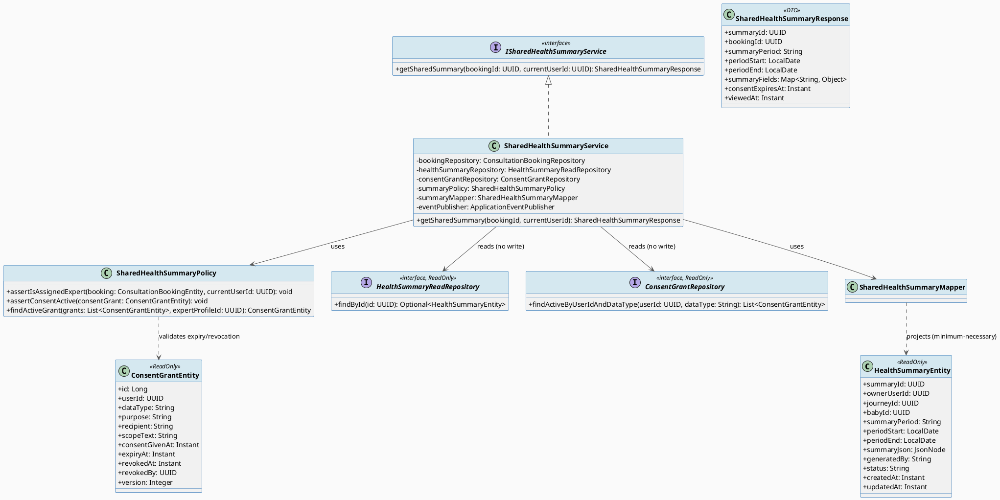
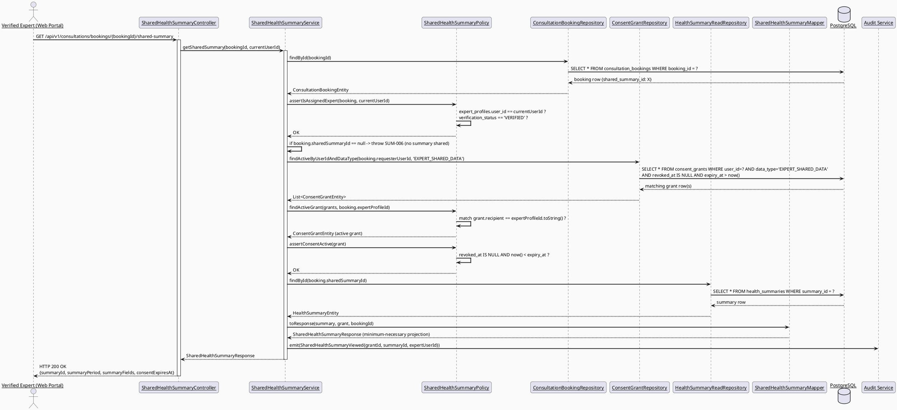
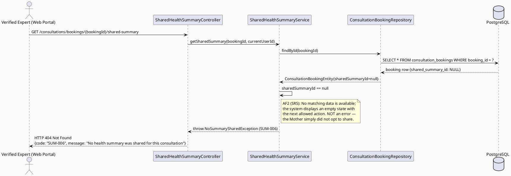
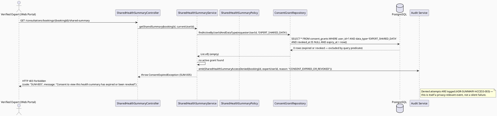
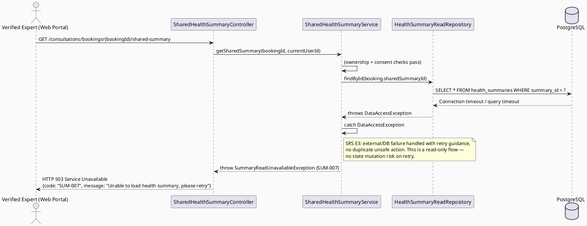

# ENGINEERING DOCUMENTATION STANDARD (EDS) v2.0
# UC94 — View Shared Health Summary — Technical Design Specification

| Field | Value |
|-------|-------|
| **Document ID** | `CB-CONSULTATION-IMP-094` |
| **Version** | `1.0` |
| **Date** | `2026-07-02` |
| **Status** | `Draft` |
| **Document Owner** | `TV4-Lâm` |
| **Author** | `AI Agent (Technical Architect)` |
| **Reviewed by** | `[Tech Lead — Pending]` |
| **DPO Sign-off** | `[ ] Pending` *(direct health-record access by a third-party Expert — BR-PRIVACY, consent-scoped)* |
| **Approved by** | `[Principal Architect — Pending]` |
| **Last Review** | `2026-07-02` |
| **Based on EDS** | `v2.0` |

---

## CHANGELOG

| Ngày | Người thực hiện | Nội dung thay đổi |
|------|-----------------|-------------------|
| 2026-07-02 | AI Agent — Technical Architect | Tạo tài liệu lần đầu (Draft) cho UC94 |

---

## MỤC LỤC

1. [Tổng quan Module](#1-tổng-quan-module)
2. [Ma trận Truy vết (Traceability Matrix)](#2-ma-trận-truy-vết-traceability-matrix)
3. [Architecture Decision Records (ADR)](#3-architecture-decision-records-adr)
4. [Non-Functional Requirements & SLA](#4-non-functional-requirements--sla)
5. [Static Modeling (Mô hình Tĩnh)](#5-static-modeling-mô-hình-tĩnh)
6. [Dynamic Modeling (Mô hình Động)](#6-dynamic-modeling-mô-hình-động)
7. [Domain Event Catalog](#7-domain-event-catalog)
8. [Interface Specification (Đặc tả Giao diện)](#8-interface-specification-đặc-tả-giao-diện)
9. [API Specification](#9-api-specification)
10. [Bảng mã lỗi (Error Codes)](#10-bảng-mã-lỗi-error-codes)
11. [Quy trình Triển khai (Step-by-Step)](#11-quy-trình-triển-khai-step-by-step)
12. [Rollback & Incident Runbook](#12-rollback--incident-runbook)
13. [Kịch bản Kiểm thử Chi tiết](#13-kịch-bản-kiểm-thử-chi-tiết)
14. [Phương pháp Xác minh](#14-phương-pháp-xác-minh)
15. [Mẫu thử thực tế (API Verification Samples)](#15-mẫu-thử-thực-tế-api-verification-samples)
16. [Bảng tổng hợp phân quyền (Authorization Matrix)](#16-bảng-tổng-hợp-phân-quyền-authorization-matrix)
17. [AI Prompt Constraints (CASE 2.0)](#17-ai-prompt-constraints-case-20)

---

## 1. Tổng quan Module

| Field | Value |
|-------|-------|
| **Module Name** | `Consultation — Shared Health Summary Access` |
| **Bounded Context** | `Consultation` (package `com.carebridge.backend.consultation`) — reads `health_summaries` owned by the Health domain |
| **Function ID / UC** | `3.2.1.8 View Shared Health Summary` / `UC-94` (SRS L901-920) |
| **Primary Actor** | Verified Expert |
| **Secondary Actor** | None |
| **Platform** | **Web (Expert Portal)** — React + TypeScript + Vite |
| **Priority** | High |
| **Sprint / Owner** | Sprint 4 "Real Providers And Admin Polish" — TV4-Lâm |
| **Data Classification** | `Sensitive-PII` (maternal/baby health data shared into a consultation context) |
| **Compliance Scope** | `PDPA (Luật 91/2025)`, internal `BR-RBAC`, `BR-PRIVACY`, `BR-CONSULTATION` |
| **Upstream Dependencies** | `Book Private Consultation (UC-75/76)` — Mother selects which `health_summaries` row to share at booking time via `consultation_bookings.shared_summary_id`; `Health Summary Generation` (out of scope — assumed the `health_summaries` row already exists by the time a booking references it) |
| **Downstream Consumers** | `UC-96 Write Consultation Summary` (Expert may reference viewed data when writing the post-session summary — read-only influence, no direct code dependency) |

### 1.1 Scope Statement — Greenfield within an existing schema contract

Same greenfield posture as sibling consultation-domain TDS (UC78, UC79, UC95):
backend `com.carebridge.backend.consultation` package holds only placeholder
files; Web `src/features/consultationManagement/` and
`src/features/expert/` are placeholder-only. The schema already models the
sharing relationship: `consultation_bookings.shared_summary_id` (nullable
`uuid` FK → `health_summaries.summary_id`, schema L882, L1835-1836). This TDS
designs UC94 as a **read-only, consent-scoped projection** of an existing
`health_summaries` row through that FK, for the duration a booking makes it
accessible.

### 1.2 Entry-Criteria Blocker (Open — MUST be resolved before implementation)

> ⚠️ **UC94 CANNOT be implemented standalone.** It requires:
> - Booking creation service (UC-75/76) populating
>   `consultation_bookings.shared_summary_id` when the Mother opts to share a
>   health summary at booking time
> - `health_summaries` rows must already exist (generation flow is a separate,
>   out-of-scope use case)
> - A `consent_grants` row of `data_type = 'EXPERT_SHARED_DATA'` scoping the
>   share (see ADR-SUMMARY-ACCESS-001) — **this TDS assumes the Mother's
>   booking-time share action creates or reuses such a consent_grants row;
>   the exact write path for that row is owned by UC-75/76, out of scope
>   here.** Marked `Open` — Product/Tech Lead must confirm which use case
>   creates the `consent_grants` row before UC94 Sprint work starts.

### 1.3 Naming Consistency with UC95/UC96

This TDS uses the same `consultation_bookings`/`consultation_sessions`
vocabulary and `session_status` terminal value (`'COMPLETED'`, confirmed by
`UC95_ManageConsultationSession_TDS.md` §ADR-SESSION-001) as its sibling
specs in this batch, for any flow that needs to reference session state
(none in UC94's core scope, but the Expert Portal UI surfaces this summary
alongside the session — see §6.1).

---

## 2. Ma trận Truy vết (Traceability Matrix)

| Requirement ID | Loại (BR/ADR/US) | Mô tả yêu cầu | Thành phần Code | Compliance Target | ADR liên quan |
|----------------|------------------|---------------|-----------------|-------------------|---------------|
| UC-94 (SRS §3.2.1.8, L901-920) | Use Case | Displays shared summaries/records within user-granted scope and time limit | `SharedHealthSummaryController`, `SharedHealthSummaryService` | BR-PRIVACY, BR-CONSULTATION | ADR-SUMMARY-ACCESS-001 |
| BR-RBAC | Business Rule | Users may access only functions allowed by role/permission scope | `SharedHealthSummaryPolicy.assertIsAssignedExpert()` | Authorization | ADR-SUMMARY-ACCESS-002 |
| BR-PRIVACY | Business Rule | Health/family data must follow consent, purpose, minimum-necessary access | `SharedHealthSummaryPolicy.assertConsentActive()`, `SharedHealthSummaryMapper` (minimum-necessary DTO projection) | PDPA | ADR-SUMMARY-ACCESS-001 |
| BR-CONSULTATION | Business Rule | Booking/session actions keep auditable lifecycle state | Audit log emission on every summary view | PDPA / BR-AUDIT | ADR-SUMMARY-ACCESS-003 |
| CLAUDE.md — "consent scope/expiry, and audit requirements" for health workflows | Project Rule | Access must be consent-scoped, time-limited, and audited | `SharedHealthSummaryPolicy` (full policy class) | PDPA | ADR-SUMMARY-ACCESS-001 |
| Schema: `health_summaries`, `consultation_bookings.shared_summary_id`, `consent_grants` (`V1__init_schema.sql` L164-195, L695-708, L876-896) | Schema Contract | Health summary storage, booking-level share link, consent expiry tracking | `HealthSummaryReadRepository`, `ConsentGrantRepository` (read-only interfaces) | — | — |
| Entry-Criteria Blocker (§1.2) | Open Item | Booking share flow + consent_grants creation path must exist first | N/A — blocking dependency | — | — |

---

## 3. Architecture Decision Records (ADR)

### ADR-SUMMARY-ACCESS-001 — Access scope and expiry enforcement mechanism: consent-grant-gated, not a fixed TTL

| Field | Value |
|-------|-------|
| **Status** | `Proposed` *(mechanism choice requires Product/Tech Lead + DPO sign-off — see Options below)* |
| **Deciders** | `AI Agent (proposal) — pending TV4-Lâm / Tech Lead / DPO confirmation` |
| **Date** | `2026-07-02` |

#### Bối cảnh (Context)
SRS UC-94 description: "Displays shared summaries or records **within the
user-granted scope and time limit**." `CLAUDE.md` mandates: "For health, ...
expert, ... safety workflows: enforce existing RBAC, consent scope/expiry,
and audit requirements." The schema provides **two candidate expiry
mechanisms**:
1. `consent_grants` — has `expiry_at timestamptz NOT NULL`, `revoked_at`
   (nullable), `data_type` CHECK constraint that **explicitly includes**
   `'EXPERT_SHARED_DATA'` as a valid value (`V1__init_schema.sql` L178), and
   `purpose` CHECK including `'SHARE'`/`'VIEW'`. This is a **generic,
   reusable consent primitive** already modeled for exactly this scenario.
2. `consultation_bookings.shared_summary_id` — a simple nullable FK with no
   expiry column of its own; access would only be implicitly time-limited by
   the booking's own lifecycle (e.g., only viewable while
   `consultation_sessions.session_status` is not yet `COMPLETED`/terminal),
   which is a session-linked expiry, not a data-grant expiry.

#### Các phương án đã xem xét (Options Considered)

| Phương án | Mô tả | Ưu điểm | Nhược điểm |
|-----------|-------|----------|------------|
| A | Session-linked expiry only: summary viewable while the linked `consultation_sessions.session_status` is not a terminal value (before/during the session, per booking lifecycle) | No new dependency on `consent_grants`; simple booking-scoped rule | Does NOT match SRS wording "user-granted **scope**" (implies an explicit consent action, not an implicit booking-lifecycle side effect); does not reuse the schema's purpose-built `consent_grants.data_type = 'EXPERT_SHARED_DATA'` primitive; weaker PDPA posture — no explicit granted/revoked/expiry record independent of the booking |
| B | **Consent-grant-gated: access requires an ACTIVE `consent_grants` row with `data_type='EXPERT_SHARED_DATA'`, `user_id = booking.requesterUserId`, `recipient` scoped to the expert, `revoked_at IS NULL`, and `now() < expiry_at`. The booking's `shared_summary_id` identifies WHICH summary; the consent_grants row governs WHETHER and UNTIL WHEN it may be viewed.** | Directly matches SRS "user-granted scope and time limit" wording; reuses the schema's purpose-built consent primitive (`EXPERT_SHARED_DATA` already exists in the CHECK constraint — not invented); explicit revocable/auditable grant independent of booking lifecycle; satisfies CLAUDE.md's "consent scope/expiry" mandate literally | Requires the booking-creation flow (UC-75/76, out of scope) to actually create this `consent_grants` row — flagged as Entry-Criteria Blocker (§1.2), not silently assumed |
| C | Hybrid: consent_grants governs expiry, but access is ALSO capped to the booking's session window (defense-in-depth) | Strongest protection | Adds complexity beyond what SRS/BR explicitly requires; the "session window" concept doesn't have a clean schema representation to double-gate against without inventing new logic; deferred as an enhancement, not the baseline decision |

#### Quyết định (Decision)
Chọn **Phương án B** — the consent-grant-gated mechanism. **This is the
exact mechanism CLAUDE.md's "consent scope/expiry" requirement demands**, and
it is the only option that reuses an existing schema primitive
(`consent_grants.data_type = 'EXPERT_SHARED_DATA'`) rather than inventing new
expiry logic. Access rule, evaluated on every `GET` request (no caching of
the authorization decision):

```
ALLOW view IFF:
  1. consultation_bookings.shared_summary_id IS NOT NULL
     AND consultation_bookings.shared_summary_id = health_summaries.summary_id
  2. A consent_grants row exists WHERE:
       user_id = consultation_bookings.requester_user_id
       AND data_type = 'EXPERT_SHARED_DATA'
       AND purpose IN ('VIEW','SHARE')
       AND revoked_at IS NULL
       AND now() < expiry_at
  3. currentUserId is the assigned, verified Expert for this booking
     (ADR-SUMMARY-ACCESS-002)
```

**Marked `Open`** — the exact matching strategy between a `consent_grants`
row and a specific booking (e.g., via `recipient` field matching the expert's
identity, or a booking-id reference not currently in the `consent_grants`
schema) is **not fully determined by the schema alone**. `consent_grants` has
no `booking_id`/`recipient_expert_profile_id` FK column — only a free-text
`recipient varchar(120)` field. **Product/Tech Lead must confirm**: does
`recipient` store the expert's `user_id` as text, or is a schema change
needed to add a proper FK? This TDS proposes storing
`recipient = expertProfileId.toString()` (no migration) as the minimal-gap
interpretation, but flags this as an assumption requiring sign-off before
Sprint work starts, since it is not literally specified by the schema.

#### Hệ quả (Consequences)

**Tích cực:** Directly satisfies SRS "user-granted scope and time limit" + CLAUDE.md consent-scope/expiry mandate; reuses existing schema primitive; revocation is immediate and independent of booking state (Mother can revoke access even mid-booking).
**Tiêu cực / Trade-offs:** Depends on an out-of-scope upstream write path (booking flow must create the `consent_grants` row) — Entry-Criteria Blocker; the `recipient` field matching strategy is an assumption pending confirmation.
**Compliance Impact:** Directly implements PDPA consent-scope/expiry/revocation requirements; every view is auditable against a specific, time-bounded grant.

---

### ADR-SUMMARY-ACCESS-002 — Ownership: only the booking's assigned, verified Expert may view the shared summary

| Field | Value |
|-------|-------|
| **Status** | `Accepted` |
| **Deciders** | `AI Agent — derived directly from schema + BR-RBAC, consistent with UC95 ADR-SESSION-002` |
| **Date** | `2026-07-02` |

#### Bối cảnh (Context)
Same ownership shape as UC95's session access: `consultation_bookings
.expert_profile_id` identifies the assigned Expert. UC94's actor is
identical to UC95's ("Verified Expert," Web Expert Portal only).

#### Các phương án đã xem xét (Options Considered)

| Phương án | Mô tả | Ưu điểm | Nhược điểm |
|-----------|-------|----------|------------|
| A | Any authenticated Expert can view any shared summary | Simple | Severely violates BR-PRIVACY/BR-RBAC — direct health-data leak to unrelated experts |
| B | **Only the Expert whose `user_id` matches `expert_profiles.user_id` for the booking's `expert_profile_id`, AND whose `verification_status == 'VERIFIED'`, may view** (identical rule shape to UC95 ADR-SESSION-002) | Matches schema FK semantics; consistent with UC95's already-established pattern; minimum-necessary access | Requires a policy check per request (negligible cost) |

#### Quyết định (Decision)
Chọn **Phương án B**, reusing the exact same check shape as UC95's
`ConsultationSessionPolicy.assertIsAssignedExpert()`:
`SharedHealthSummaryPolicy.assertIsAssignedExpert(booking, currentUserId)`.
Non-assigned or unverified experts receive `403 Forbidden` (`SUM-004`).

#### Hệ quả (Consequences)

**Tích cực:** Prevents IDOR / cross-tenant health-data exposure; consistent authorization pattern across the whole consultation-domain batch (UC94/95/96).
**Tiêu cực / Trade-offs:** None material.
**Compliance Impact:** Satisfies BR-RBAC and BR-PRIVACY minimum-necessary-access principle.

---

### ADR-SUMMARY-ACCESS-003 — Every view is an auditable, individually-logged access event (no bulk/silent reads)

| Field | Value |
|-------|-------|
| **Status** | `Accepted` |
| **Deciders** | `AI Agent — derived from CLAUDE.md audit mandate + BR-CONSULTATION` |
| **Date** | `2026-07-02` |

#### Bối cảnh (Context)
CLAUDE.md: "Sensitive actions are recorded for audit, safety, or privacy
review where required" (SRS POST-3) and "enforce existing RBAC, consent
scope/expiry, and audit requirements" for health workflows. A Verified
Expert reading another person's health data is exactly this kind of
sensitive action, distinct from routine reads.

#### Các phương án đã xem xét (Options Considered)

| Phương án | Mô tả | Ưu điểm | Nhược điểm |
|-----------|-------|----------|------------|
| A | Log only on the first view per booking | Lower log volume | Cannot prove access stopped after consent revocation/expiry; weaker audit trail for a repeated-access scenario |
| B | **Log every successful `GET` (each individual view event), including the specific `consent_grants.id` that authorized it** | Full auditable trail of who-viewed-what-when-under-which-grant; supports PDPA accountability | Slightly higher log volume — acceptable given UC94's "Frequent" usage frequency per SRS is still bounded by consultation volume |

#### Quyết định (Decision)
Chọn **Phương án B**. Every successful view emits `SharedHealthSummaryViewed`
(§7) referencing the exact `consent_grants` row ID that authorized it. Denied
attempts (expired/revoked/unauthorized) also emit an audit entry via the
existing `audit_logs` table pattern (out of scope to redesign — reuses
existing audit infrastructure).

#### Hệ quả (Consequences)

**Tích cực:** Full accountability trail; supports DPO review and PDPA breach investigation.
**Tiêu cực / Trade-offs:** Log volume proportional to view count — acceptable, no special mitigation needed at current scale.
**Compliance Impact:** Directly satisfies PDPA audit-trail expectations for sensitive data access.

---

## 4. Non-Functional Requirements & SLA

> No SRS/BR source specifies numeric SLA targets for UC94. Values below are
> **Open — proposed defaults**, must be confirmed by Tech Lead.

### 4.1. Performance & Availability

| Category | Requirement | Target SLA | Measurement Method | Compliance Basis |
|----------|-------------|------------|---------------------|------------------|
| Latency | `GET /shared-summary` p99 | `< 300ms` *(Open — proposed)* | Manual/API test timing | — |
| Availability | Dependent on booking/consent services (§1.2 blocker) | N/A until dependencies implemented | — | — |

### 4.2. Data Integrity & Retention

| Category | Requirement | Target | Verification Method | Compliance Basis |
|----------|-------------|--------|---------------------|------------------|
| Durability | No audit-log record loss for summary view events | RPO = 0 | Transaction log | BR-CONSULTATION |
| Retention | View-access audit trail | Indefinite (append-only) | DB inspection — no DELETE path exposed | PDPA |
| Consistency | Access always re-evaluated against live `consent_grants` state (no cached authorization) | 100% (every request re-checks `expiry_at`/`revoked_at`) | Reconciliation query | ADR-SUMMARY-ACCESS-001 |

### 4.3. Security

| Category | Requirement | Target | Verification Method | Compliance Basis |
|----------|-------------|--------|---------------------|------------------|
| Access control | Role-based, ownership-scoped, consent-gated | Least privilege (assigned Expert only, active consent only) | Auth Matrix (§16) | BR-RBAC, BR-PRIVACY |
| Minimum-necessary | DTO projection excludes any `health_summaries.summary_json` fields not needed for consultation context (Open — exact field allowlist pending Product/DPO input, see §5.3 gap note) | Minimum-necessary per PDPA | Mapper code review | BR-PRIVACY |
| Expiry enforcement | Access denied immediately once `now() >= expiry_at` or `revoked_at IS NOT NULL` | 100% — no grace period | Automated test (TC-COND, Test-Spec) | ADR-SUMMARY-ACCESS-001 |

### 4.4. Scalability & Capacity Planning

SRS marks UC94 "Frequency of Use: Frequent." View volume tracks active
consultation bookings with a shared summary; no special scaling design
beyond standard Spring Boot request handling required at current expected
scale.

---

## 5. Static Modeling (Mô hình Tĩnh)

### 5.1. Component Responsibilities & Planned File Paths

| Layer | File Path | Responsibility |
|-------|-----------|----------------|
| Controller | `src/main/java/com/carebridge/backend/consultation/controller/SharedHealthSummaryController.java` | HTTP mapping, DTO validation only |
| Service | `src/main/java/com/carebridge/backend/consultation/service/SharedHealthSummaryService.java` | Read-only orchestration: resolve booking → summary → consent check → audit emission |
| Repository | `src/main/java/com/carebridge/backend/consultation/repository/HealthSummaryReadRepository.java` | **Read-only** interface for `health_summaries` (write path owned by Health domain, out of scope; interface only) |
| Repository | `src/main/java/com/carebridge/backend/consultation/repository/ConsentGrantRepository.java` | **Read-only** interface for `consent_grants` (write path owned by consent/booking flow, out of scope; interface only) |
| Repository | `src/main/java/com/carebridge/backend/consultation/repository/ConsultationBookingRepository.java` | Read-only lookups for ownership/scope checks (shared with UC78/UC79/UC95, interface only) |
| DTO | `src/main/java/com/carebridge/backend/consultation/dto/response/SharedHealthSummaryResponse.java` | Outbound payload — minimum-necessary projection |
| Mapper | `src/main/java/com/carebridge/backend/consultation/mapper/SharedHealthSummaryMapper.java` | `health_summaries` entity → minimum-necessary DTO, never expose raw entity or full `summary_json` blob without projection |
| Policy | `src/main/java/com/carebridge/backend/consultation/policy/SharedHealthSummaryPolicy.java` | Ownership check (ADR-SUMMARY-ACCESS-002), consent-active check (ADR-SUMMARY-ACCESS-001) |
| Web Model | `05_Development/CareBridgeWebApp/src/features/consultationManagement/models/sharedHealthSummary.ts` | Response DTO mirror (Zod schema) |
| Web Service | `05_Development/CareBridgeWebApp/src/features/consultationManagement/services/sharedHealthSummaryApi.ts` | API client (TanStack Query hook) |
| Web Component | `05_Development/CareBridgeWebApp/src/features/consultationManagement/components/SharedHealthSummaryPanel.tsx` | Expert-facing read-only summary panel (shown alongside session room, see §6.1) |

### 5.2. Class Diagram (PlantUML)



### 5.3. Data Structure — Schema/Migration Details

> **CareBridge rule:** `V1__init_schema.sql` and approved Flyway migrations
> are primary source of truth. ERD is supporting context only.

**No new migration is required for the core read-only view flow.** The
following tables already exist and are sufficient (`V1__init_schema.sql`,
verified line numbers):

```sql
-- health_summaries (V1__init_schema.sql L695-708) — READ-ONLY for this module
CREATE TABLE public.health_summaries (
    summary_id     uuid        NOT NULL DEFAULT gen_random_uuid(),
    owner_user_id  uuid        NOT NULL,
    journey_id     uuid,
    baby_id        uuid,
    summary_period varchar(30),
    period_start   date,
    period_end     date,
    summary_json   jsonb,
    generated_by   varchar(50),
    status         varchar(20) NOT NULL DEFAULT 'ACTIVE',
    created_at     timestamptz NOT NULL DEFAULT now(),
    updated_at     timestamptz NOT NULL DEFAULT now()
);
-- PK: summary_id (L1386-1387); FK: owner_user_id -> users (L1747), journey_id -> mother_journeys (L1750),
-- baby_id -> baby_profiles (L1753)
-- Index: idx_health_summaries_owner_user_id, idx_health_summaries_journey_id (L1616-1617)

-- consultation_bookings.shared_summary_id (V1__init_schema.sql L882, L1835-1836) — READ-ONLY for this module
-- shared_summary_id uuid REFERENCES health_summaries(summary_id)

-- consent_grants (V1__init_schema.sql L164-180) — READ-ONLY for this module
CREATE TABLE public.consent_grants (
    id                 bigint          NOT NULL,
    consent_given_at   timestamptz     NOT NULL,
    created_at         timestamptz     NOT NULL,
    data_type          varchar(60)     NOT NULL,
    expiry_at          timestamptz     NOT NULL,
    purpose            varchar(60)     NOT NULL,
    recipient          varchar(120),
    revoked_at         timestamptz,
    revoked_by         uuid,
    scope_text         text,
    updated_at         timestamptz     NOT NULL,
    user_id            uuid            NOT NULL,
    version            integer         NOT NULL,
    CONSTRAINT consent_grants_data_type_check CHECK (data_type IN
      ('HEALTH_RECORD','LOCATION','FAMILY_DATA','COMMUNITY_POST',
       'SENSITIVE_DATA','RAG_CONTEXT','EXPERT_SHARED_DATA')),
    CONSTRAINT consent_grants_purpose_check CHECK (purpose IN
      ('VIEW','CREATE','UPDATE','SHARE','DELETE'))
);
-- 'EXPERT_SHARED_DATA' is an EXISTING valid data_type value (verified L178) —
-- this TDS reuses it, does not invent a new enum value.
```

**Genuine gap identified (Open — flag for confirmation, non-blocking, but
material to ADR-SUMMARY-ACCESS-001 Open item):**
1. `consent_grants.recipient varchar(120)` has no FK to `expert_profiles` or
   `consultation_bookings` — it is free text. This TDS proposes storing
   `recipient = expertProfileId.toString()` at consent-creation time
   (upstream, out of scope for UC94 itself) as the minimal-gap
   interpretation. **No migration proposed** — this is a data-convention
   decision, not a schema gap, since the column already exists and is
   sufficiently typed (`varchar(120)` comfortably holds a UUID string).
   Flagged Open for Product/Tech Lead confirmation of the convention only.
2. `summary_json` has no documented field-level schema (`jsonb`, opaque) —
   the exact "minimum-necessary" field allowlist for the Expert-facing
   projection (§4.3) is Open, pending Product/DPO input on which
   `summary_json` fields are appropriate to expose to a third-party Expert
   versus withheld.

No sync action needed for `V1__init_schema.sql` — no migration created by
this TDS.

---

## 6. Dynamic Modeling (Mô hình Động)

### 6.1. Sequence Diagram — Happy Path: Expert Views Shared Summary Within Active Consent (PlantUML)



### 6.2. Sequence Diagram — Alternative: No Summary Shared for This Booking (Empty State) (PlantUML)



### 6.3. Sequence Diagram — Error: Consent Expired or Revoked → Access Denied (PlantUML)



### 6.4. Sequence Diagram — Timeout: External Health-Domain Read Failure (PlantUML)



### 6.5. State Notes (No dedicated state machine — read-only projection)

UC94 has no entity of its own with a lifecycle state machine — it is a
**read-only, time-bounded view** over `health_summaries` (owned elsewhere)
gated by `consent_grants` (owned elsewhere). The relevant "state" is the
**consent grant's validity window** (`consent_given_at → expiry_at`, with a
possible early `revoked_at`), which is a simple boolean-at-read-time check,
not a state machine UC94 itself manages.

**⚠️ Invariant bất biến:**
1. Access is **re-evaluated on every single request** — no caching of the
   "consent is active" decision beyond the single request's lifetime
   (ADR-SUMMARY-ACCESS-001).
2. The moment `now() >= expiry_at` or `revoked_at IS NOT NULL`, the very next
   request is denied — there is no grace period.
3. Only the assigned, verified Expert may ever reach the consent check
   (ADR-SUMMARY-ACCESS-002) — ownership is checked **before** consent, so a
   non-assigned Expert never learns whether a summary was shared at all
   (`403` before `404`/`403`-for-consent, preventing information leakage
   about sharing status to unauthorized callers).
4. Every successful AND every denied access attempt is individually audited
   (ADR-SUMMARY-ACCESS-003) — never a silent read, never a silent denial.

---

## 7. Domain Event Catalog

### 7.1. Events Published (Phát ra)

| Event Name | Trigger | Publisher | Subscriber(s) | Payload Schema | Async? |
|------------|---------|-----------|---------------|----------------|--------|
| `SharedHealthSummaryViewed` | Expert successfully views a shared summary under an active consent grant | `SharedHealthSummaryService` | Audit log, DPO review workspace (out of scope consumer) | `SharedHealthSummaryViewed.java` | Yes |
| `SharedHealthSummaryAccessDenied` | Access attempt denied due to expired/revoked consent or ownership violation | `SharedHealthSummaryService` | Audit log, Security monitoring (out of scope consumer) | `SharedHealthSummaryAccessDenied.java` | Yes |

### 7.2. Events Consumed (Tiêu thụ)

| Event Name | Source | Handler | Action thực hiện |
|------------|--------|---------|------------------|
| *(None)* | — | — | UC94 reads `consultation_bookings`, `health_summaries`, `consent_grants` synchronously at request time; it does not consume any external event. |

### 7.3. Payload Schema

```java
// SharedHealthSummaryViewed.java
public record SharedHealthSummaryViewed(
    UUID    eventId,
    String  eventType,       // "SharedHealthSummaryViewed"
    Instant occurredAt,
    String  version,         // "1.0"
    Payload payload,
    Metadata metadata
) implements ApplicationEvent {

    public record Payload(
        UUID   bookingId,
        UUID   summaryId,
        Long   consentGrantId,   // consent_grants.id that authorized this view
        UUID   viewedByUserId,   // the Expert's user_id
        Instant consentExpiresAt
    ) {}

    public record Metadata(
        UUID   correlationId,
        String causedBy          // userId
    ) {}
}

// SharedHealthSummaryAccessDenied.java
public record SharedHealthSummaryAccessDenied(
    UUID    eventId,
    String  eventType,       // "SharedHealthSummaryAccessDenied"
    Instant occurredAt,
    String  version,
    Payload payload,
    Metadata metadata
) implements ApplicationEvent {

    public record Payload(
        UUID   bookingId,
        UUID   attemptedByUserId,
        String reason            // "NOT_ASSIGNED_EXPERT" | "CONSENT_EXPIRED_OR_REVOKED" | "NO_SUMMARY_SHARED"
    ) {}

    public record Metadata(
        UUID   correlationId,
        String causedBy
    ) {}
}
```

---

## 8. Interface Specification (Đặc tả Giao diện)

### 8.1. Service Interface

```java
// SharedHealthSummaryResponse.java — Output DTO
public class SharedHealthSummaryResponse {
    private UUID summaryId;
    private UUID bookingId;
    private String summaryPeriod;       // nullable — schema: health_summaries.summary_period
    private LocalDate periodStart;      // nullable
    private LocalDate periodEnd;        // nullable
    private Map<String, Object> summaryFields; // Minimum-necessary projection of summary_json — Open: exact field allowlist pending Product/DPO (§5.3 gap note 2)
    private Instant consentExpiresAt;   // from the authorizing consent_grants.expiry_at — surfaced so the Expert UI can show a countdown
    private Instant viewedAt;           // server timestamp of this view
    // getters / setters — NEVER expose ownerUserId, journeyId, babyId raw (minimum-necessary, ADR-SUMMARY-ACCESS-001)
}

// ISharedHealthSummaryService.java — Service Contract
// @version 1.0
public interface ISharedHealthSummaryService {
    /**
     * Returns the health summary shared for a booking, if the caller is the
     * assigned verified Expert AND an active (non-expired, non-revoked)
     * EXPERT_SHARED_DATA consent grant exists for the booking's requester.
     * @throws SummaryAuthorizationException (SUM-004) if currentUserId is not the booking's assigned, verified Expert
     * @throws BookingNotFoundException (SUM-003) if bookingId does not exist
     * @throws NoSummarySharedException (SUM-006) if the booking has no shared_summary_id
     * @throws ConsentExpiredException (SUM-005) if no active consent grant is found
     * @throws SummaryReadUnavailableException (SUM-007) on downstream read failure/timeout
     */
    SharedHealthSummaryResponse getSharedSummary(UUID bookingId, UUID currentUserId);
}
```

### 8.2. Repository Interface

```java
// HealthSummaryReadRepository.java — READ-ONLY, this module never writes health_summaries
// @version 1.0
public interface HealthSummaryReadRepository extends JpaRepository<HealthSummaryEntity, UUID> {

    Optional<HealthSummaryEntity> findById(UUID summaryId);

    // No save()/delete() exposed to this module — health_summaries write path
    // is owned by the Health domain (out of scope for UC94).
}

// ConsentGrantRepository.java — READ-ONLY, this module never writes consent_grants
// @version 1.0
public interface ConsentGrantRepository extends JpaRepository<ConsentGrantEntity, Long> {

    @Query("SELECT c FROM ConsentGrantEntity c WHERE c.userId = :userId AND c.dataType = :dataType " +
           "AND c.revokedAt IS NULL AND c.expiryAt > CURRENT_TIMESTAMP")
    List<ConsentGrantEntity> findActiveByUserIdAndDataType(UUID userId, String dataType);

    // No save()/delete() exposed to this module — consent_grants write path
    // (grant/revoke) is owned by the consent/booking flow (out of scope for UC94).
}
```

---

## 9. API Specification

### 9.1. Endpoints Table

| Method | Path | Auth Level | Required Roles | Rate Limit | Idempotent? |
|--------|------|------------|----------------|------------|-------------|
| `GET` | `/api/v1/consultations/bookings/{bookingId}/shared-summary` | JWT Bearer | `EXPERT` (assigned, verified only) | 120/min | Yes |

### 9.2. Request / Response Schemas

#### `GET /api/v1/consultations/bookings/{bookingId}/shared-summary` — View shared health summary

**Response — 200 OK (Happy Path):**
```json
{
  "summaryId": "7c9e6679-7425-40de-944b-e07fc1f90ae7",
  "bookingId": "3fa85f64-5717-4562-b3fc-2c963f66afa6",
  "summaryPeriod": "TRIMESTER_2",
  "periodStart": "2026-04-01",
  "periodEnd": "2026-06-30",
  "summaryFields": {
    "weightTrend": "within normal range",
    "bloodPressureTrend": "stable",
    "notableSymptoms": ["mild fatigue"]
  },
  "consentExpiresAt": "2026-07-09T00:00:00.000Z",
  "viewedAt": "2026-07-02T09:15:00.000Z"
}
```

**Response — 404 Not Found (No summary shared):**
```json
{
  "error": {
    "code": "SUM-006",
    "message": "No health summary was shared for this consultation"
  }
}
```

**Response — 403 Forbidden (Consent expired/revoked):**
```json
{
  "error": {
    "code": "SUM-005",
    "message": "Consent to view this health summary has expired or been revoked"
  }
}
```

**Response — 403 Forbidden (Not assigned Expert):**
```json
{
  "error": {
    "code": "SUM-004",
    "message": "You are not authorized to view this shared summary"
  }
}
```

---

## 10. Bảng mã lỗi (Error Codes)

| Code | HTTP Status | Message (EN) | Message (VI) | Trigger Condition |
|------|-------------|--------------|--------------|-------------------|
| `SUM-001` | 400 | Validation failed | Dữ liệu không hợp lệ | Malformed `bookingId` path parameter |
| `SUM-003` | 404 | Booking not found | Không tìm thấy booking | `bookingId` does not exist |
| `SUM-004` | 403 | Insufficient permissions | Không đủ quyền | Current user is not the booking's assigned, verified Expert |
| `SUM-005` | 403 | Consent expired or revoked | Sự đồng ý đã hết hạn hoặc bị thu hồi | No active `consent_grants` row (`revoked_at IS NULL AND expiry_at > now()`) found for `EXPERT_SHARED_DATA` |
| `SUM-006` | 404 | No health summary was shared for this consultation | Không có tóm tắt sức khỏe nào được chia sẻ | `consultation_bookings.shared_summary_id IS NULL` |
| `SUM-007` | 503 | Unable to load health summary, please retry | Không thể tải tóm tắt sức khỏe, vui lòng thử lại | Downstream DB/read failure or timeout (§6.4) |
| `SUM-500` | 500 | Internal error | Lỗi hệ thống | Unexpected failure |

---

## 11. Quy trình Triển khai (Step-by-Step)

### 11.1. Prerequisites

- [ ] **BLOCKING:** Booking service (UC-75/76) implemented and populates `consultation_bookings.shared_summary_id` on Mother opt-in
- [ ] **BLOCKING:** The `consent_grants` row creation path for `data_type='EXPERT_SHARED_DATA'` is confirmed and implemented (owner: booking/consent flow, out of scope for UC94) — this is the Entry-Criteria Blocker (§1.2)
- [ ] ADR-SUMMARY-ACCESS-001 confirmed by Product/Tech Lead/DPO (currently `Proposed` — the `recipient` matching convention specifically needs sign-off)
- [ ] Minimum-necessary `summaryFields` allowlist confirmed by Product/DPO (§5.3 gap note 2, currently Open)
- [ ] DPO review — this endpoint is direct third-party access to maternal/baby health data — sign-off pending
- [ ] Principal Architect approves this TDS

### 11.2. Pre-Migration Checklist

- [ ] **N/A** — no new migration required (see §5.3)

### 11.3. Implementation Steps

#### Chặng 1 — Read-only repositories + DTOs
Create `HealthSummaryReadRepository`, `ConsentGrantRepository` (read-only
interfaces only, no write methods exposed), `SharedHealthSummaryResponse`
DTO, `SharedHealthSummaryMapper` with the minimum-necessary field
projection.

#### Chặng 2 — Policy + Service
Implement `SharedHealthSummaryPolicy` (ownership §ADR-SUMMARY-ACCESS-002,
consent-active check §ADR-SUMMARY-ACCESS-001),
`SharedHealthSummaryService` (orchestration + audit emission
§ADR-SUMMARY-ACCESS-003).

#### Chặng 3 — Controller + Web
Wire `SharedHealthSummaryController`, then Web `sharedHealthSummaryApi.ts`
(TanStack Query hook) + `SharedHealthSummaryPanel.tsx` (read-only, shown
alongside `SessionRoomPage.tsx` from UC95 in the Expert Portal UI).

#### Chặng 4 — Verification sau deploy

```bash
curl -X GET https://[host]/api/v1/health
# Expected: {"status": "ok"}
```

### 11.4. Deployment Checklist

- [ ] `./mvnw test` green
- [ ] `npm run test:run` green (Web)
- [ ] Error rate < 1% in first 10 minutes
- [ ] Audit log emits `SharedHealthSummaryViewed`/`SharedHealthSummaryAccessDenied` in correct format
- [ ] Verify a request made 1 second after `expiry_at` is denied (no grace period)
- [ ] No PII/health data leaked in application logs

---

## 12. Rollback & Incident Runbook

### 12.1. Điều kiện kích hoạt Rollback

| Điều kiện | Ngưỡng | Người quyết định |
|-----------|--------|------------------|
| Error rate tăng đột biến | > 5% trong 5 phút | On-call Engineer |
| Expert able to view a summary after consent expiry/revocation | Any single occurrence | Tech Lead + DPO (privacy incident) |
| Non-assigned Expert able to view any summary | Any single occurrence | Tech Lead + DPO (security/privacy incident) |
| Audit log stops emitting view events | > 1 phút | On-call Engineer |

### 12.2. Rollback Procedure

```bash
# No new migration in baseline scope — code-only rollback:
git checkout -- 05_Development/CareBridgeAPI/src/main/java/com/carebridge/backend/consultation/
git checkout -- 05_Development/CareBridgeWebApp/src/features/consultationManagement/
kubectl rollout undo deployment/carebridge-api
```

### 12.3. Notification Protocol

| Thời điểm | Người nhận | Kênh | Template |
|-----------|------------|------|----------|
| Ngay khi phát hiện expired-consent bypass | On-call + Tech Lead + DPO | Slack `#incident` + Email | "🚨 PRIVACY INCIDENT: health summary accessed after consent expiry/revocation for booking [id]" |
| Trong 72 giờ (nếu xác nhận data breach) | DPA | Email | Theo PDPA breach-notification obligation |

### 12.4. Post-Incident Review (PIR)

Mandatory PIR within 48h for ANY consent-bypass or unauthorized-access
incident (this is a health-data privacy workflow — highest incident
priority per CLAUDE.md).

---

## 13. Kịch bản Kiểm thử Chi tiết

> Detailed test cases live in `UC94_ViewSharedHealthSummary_Test-Spec.md`.

| Condition Ref | Summary |
|----------------|---------|
| TC-COND-001 | Happy path — assigned Expert views summary within active consent |
| TC-COND-002 | Ownership violation — non-assigned Expert attempts view → 403 (`SUM-004`) |
| TC-COND-003 | Unverified Expert attempts view → 403 (`SUM-004`) |
| TC-COND-004 | No summary shared (`shared_summary_id IS NULL`) → 404 (`SUM-006`) |
| TC-COND-005 | Consent expired (`now() >= expiry_at`) → 403 (`SUM-005`) |
| TC-COND-006 | Consent revoked (`revoked_at IS NOT NULL`) → 403 (`SUM-005`) |
| TC-COND-007 | Boundary — request 1 second before `expiry_at` → 200 OK; 1 second after → 403 |
| TC-COND-008 | Booking not found → 404 (`SUM-003`) |
| TC-COND-009 | Downstream DB read failure → 503 (`SUM-007`), no state mutation |
| TC-COND-010 | Every successful view emits `SharedHealthSummaryViewed` with correct `consentGrantId` |
| TC-COND-011 | Every denied attempt emits `SharedHealthSummaryAccessDenied` with correct `reason` |
| TC-COND-012 | Response DTO never includes `ownerUserId`/`journeyId`/`babyId` raw fields (minimum-necessary) |

---

## 14. Phương pháp Xác minh

### 14.1. Database Inspection

```sql
SELECT booking_id, shared_summary_id FROM consultation_bookings WHERE booking_id = '[uuid]';

SELECT id, user_id, data_type, expiry_at, revoked_at FROM consent_grants
WHERE user_id = '[uuid]' AND data_type = 'EXPERT_SHARED_DATA';

-- Verify no expired/revoked grant was ever used to authorize a view
-- (cross-reference audit log SharedHealthSummaryViewed.payload.consentGrantId against consent_grants.expiry_at at occurredAt time)
```

### 14.2. Log / Audit Verification

```bash
kubectl logs -l app=carebridge-api | grep '"eventType":"SharedHealthSummaryViewed"' | head -5
kubectl logs -l app=carebridge-api | grep '"eventType":"SharedHealthSummaryAccessDenied"' | head -5
```

---

## 15. Mẫu thử thực tế (API Verification Samples)

### 15.1. Happy Path

```bash
curl -X GET https://[host]/api/v1/consultations/bookings/{bookingId}/shared-summary \
  -H "Authorization: Bearer [JWT_TOKEN — expert@carebridge.dev]"
```

**Expected Response (200):** see §9.2.

### 15.2. Error Paths

```bash
# Consent expired → 403
curl -X GET https://[host]/api/v1/consultations/bookings/{expiredConsentBookingId}/shared-summary \
  -H "Authorization: Bearer [JWT_TOKEN]"
```

**Expected Response (403):** see `SUM-005` in §10.

---

## 16. Bảng tổng hợp phân quyền (Authorization Matrix)

| Endpoint | `GUEST` | `MOTHER` | `EXPERT` (non-assigned) | `EXPERT` (assigned, active consent) | `EXPERT` (assigned, expired/revoked consent) | `SYSTEM_ADMIN` |
|----------|---------|----------|--------------------------|----------------------------------------|-------------------------------------------------|-----------------|
| `GET /consultations/bookings/{id}/shared-summary` | ❌ | ❌ *(Mother views own data via a separate health-record UC, out of scope)* | ❌ (`SUM-004`) | ✅ | ❌ (`SUM-005`) | ✅ *(audit/DPO review path — out of scope endpoint, referenced for future spec only)* |

**Chú thích:**
- ✅ = Được phép; ❌ = Bị từ chối (403); ownership is checked BEFORE consent (§6.5 invariant 3) — a non-assigned Expert never learns whether a summary exists.

---

## 17. AI Prompt Constraints (CASE 2.0)

### 17.1 Constraint Summary Table

| # | Constraint | Source (ADR/BR) | Last Verified |
|---|-----------|-----------------|---------------|
| C1 | Access MUST require an ACTIVE `consent_grants` row (`data_type='EXPERT_SHARED_DATA'`, `revoked_at IS NULL`, `now() < expiry_at`) — never grant access purely from `shared_summary_id` presence | `ADR-SUMMARY-ACCESS-001` | `2026-07-02` |
| C2 | Ownership check (assigned, verified Expert) MUST run BEFORE the consent check — never leak sharing status to a non-assigned Expert | `ADR-SUMMARY-ACCESS-002` / §6.5 invariant 3 | `2026-07-02` |
| C3 | Only the assigned Expert (`expert_profiles.user_id == currentUserId`, `verification_status='VERIFIED'`) may call this endpoint | `ADR-SUMMARY-ACCESS-002` / `BR-RBAC` | `2026-07-02` |
| C4 | Every successful AND denied access attempt MUST emit an audit event — never a silent read or silent denial | `ADR-SUMMARY-ACCESS-003` | `2026-07-02` |
| C5 | Response DTO MUST be a minimum-necessary projection — never expose `health_summaries.owner_user_id`/`journey_id`/`baby_id` raw, never expose `ConsentGrantEntity` or `HealthSummaryEntity` directly | `BR-PRIVACY` / `CLAUDE.md` | `2026-07-02` |
| C6 | This module NEVER writes to `health_summaries` or `consent_grants` — read-only repositories only, no `save()`/`delete()` exposed | `§8.2 Repository Interface` | `2026-07-02` |
| C7 | Use `com.carebridge.backend.consultation` package layout exactly per `CLAUDE.md`; never expose JPA entities directly in API responses | `CLAUDE.md` | `2026-07-02` |

### 17.2 Constraint Injection Block (Copy-Paste vào AI Prompt)

```
[CONSTRAINT BLOCK — Module: Shared Health Summary Access (UC94)]
Theo TDS CB-CONSULTATION-IMP-094 và các ADR liên quan:

1. (C1) Access CHỈ được cấp khi tồn tại consent_grants ACTIVE
   (data_type='EXPERT_SHARED_DATA', revoked_at IS NULL, now() < expiry_at) —
   KHÔNG cấp quyền chỉ dựa trên shared_summary_id tồn tại.
2. (C2) Kiểm tra ownership (Expert được gán, đã VERIFIED) PHẢI chạy TRƯỚC
   kiểm tra consent — KHÔNG được lộ trạng thái chia sẻ cho Expert không
   được gán.
3. (C3) CHỈ Expert được gán (expert_profiles.user_id == currentUserId,
   verification_status='VERIFIED') mới được gọi endpoint này.
4. (C4) MỌI lần truy cập thành công VÀ bị từ chối PHẢI emit audit event —
   KHÔNG được đọc âm thầm hoặc từ chối âm thầm.
5. (C5) Response DTO PHẢI là minimum-necessary projection — KHÔNG BAO GIỜ
   lộ owner_user_id/journey_id/baby_id thô, KHÔNG BAO GIỜ trả entity trực
   tiếp.
6. (C6) Module này KHÔNG BAO GIỜ ghi vào health_summaries hoặc
   consent_grants — chỉ repository read-only, không có save()/delete().
7. (C7) Dùng đúng cấu trúc package com.carebridge.backend.consultation;
   KHÔNG bao giờ trả JPA entity trực tiếp trong API response.

[CONTEXT BLOCK]
- Bounded Context: Consultation (reads Health domain data)
- Data Classification: Sensitive-PII
- Compliance: PDPA (Luật 91/2025), BR-RBAC, BR-PRIVACY, BR-CONSULTATION
- Existing interfaces: §8 Service Interface + §8.2 Repository Interface
- Error codes: §10 Error Codes Table
- Auth matrix: §16 Authorization Matrix

[TASK BLOCK]
Implement {feature/method} thỏa mãn constraints trên.
Output phải tuân thủ §8 Interface Specification.
Tests phải cover §13 Test Scenarios (see Test-Spec document).
```

### 17.3 Constraint Quality Checklist

- [x] Mỗi constraint traceable về ADR hoặc BR cụ thể
- [x] Không có constraint generic
- [x] Mỗi constraint có `Last Verified` date ≤ 2 sprints
- [x] Constraint block có ≥ 3 constraints cụ thể
- [x] Constraint block reference §8 Interface
- [x] Constraint block reference §16 Auth Matrix

### 17.4 Anti-Pattern Detection (cho AI-Generated Code từ Block này)

| AP-ID | Anti-Pattern | Dấu hiệu | Hành động |
|-------|-------------|-----------|----------|
| AP-AI-001 | Unconstrained Gen | Code không match bất kỳ constraint C1-C7 nào | Reject — inject lại constraints |
| AP-AI-003 | Implicit Decision | Code grants access without checking `consent_grants` at all (relies only on `shared_summary_id`) | Reject — violates ADR-SUMMARY-ACCESS-001 |
| AP-AI-005 | Hallucinated Contract | Code adds a `save()`/write method to `HealthSummaryReadRepository`/`ConsentGrantRepository` | Reject — violates C6, these are read-only in UC94's scope |
| AP-CB-201 *(project-specific)* | **Consent check before ownership check** | Code checks `consent_grants` before verifying the caller is the assigned Expert, leaking sharing status | Reject — violates C2/§6.5 invariant 3 |
| AP-CB-202 *(project-specific)* | **Caching the authorization decision** | Code caches "consent active" result beyond a single request, risking stale access after revocation | Reject — violates C1, must re-check on every request |

---

## PHỤ LỤC

### A. Glossary

| Thuật ngữ | Định nghĩa |
|-----------|------------|
| Minimum-necessary access | PDPA/BR-PRIVACY principle: expose only the data fields strictly needed for the stated purpose |
| Consent grant | A `consent_grants` row representing an explicit, revocable, time-bounded authorization for a specific `data_type`/`purpose` |
| EXPERT_SHARED_DATA | Existing `consent_grants.data_type` enum value (schema-verified) used for Mother-to-Expert health data sharing |
| PDPA | Vietnam Personal Data Protection regulation (Luật 91/2025 context in this repo) |

### B. Tài liệu tham chiếu

| Document | Path |
|----------|------|
| SRS §3.2.1.8 | `02_Requirements/SRS/3_Functional_Specification.md` L901-920 |
| Task allocation (TV4-Lâm, Sprint 4) | `04_Implement/implement_artifacts/function-spec-task-allocation.md` L640-733 |
| Schema source of truth | `05_Development/CareBridgeAPI/src/main/resources/db/migration/V1__init_schema.sql` L164-195, L695-708, L876-896, L1386-1387, L1616-1617, L1747-1753, L1835-1836 |
| CareBridge project rules | `CLAUDE.md` |
| Sibling spec — session/terminal-status consistency | `04_Implement/UC95_ManageConsultationSession/UC95_ManageConsultationSession_TDS.md` |
| Downstream consumer (same package) | `04_Implement/UC96_WriteConsultationSummary/UC96_WriteConsultationSummary_TDS.md` |

---

*TDS UC94 v1.0 — Draft. Requires Product/Tech Lead/DPO sign-off on ADR-SUMMARY-ACCESS-001 (expiry mechanism, `recipient` matching convention) before Status may change to Approved.*
