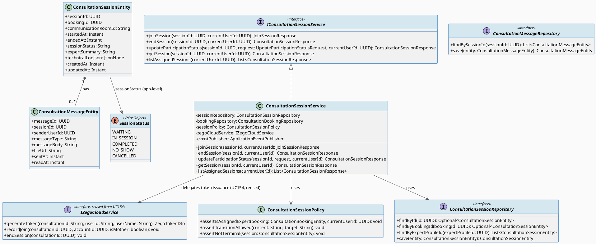
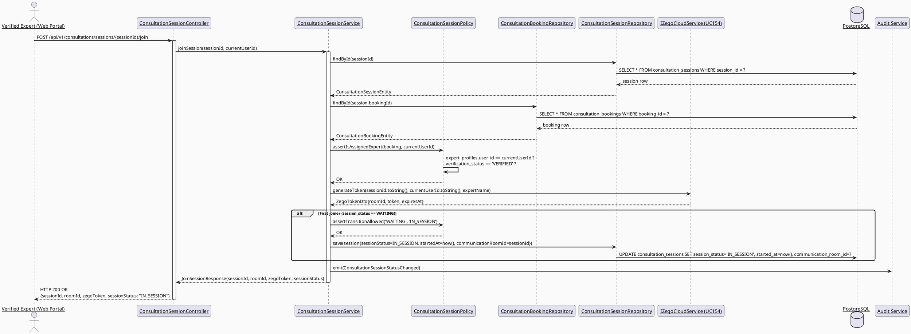
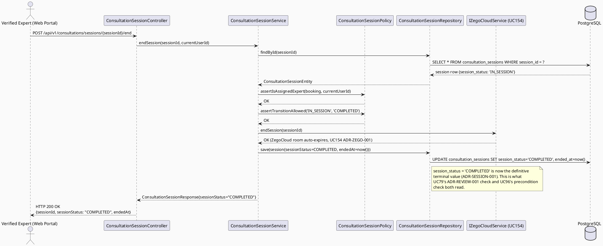
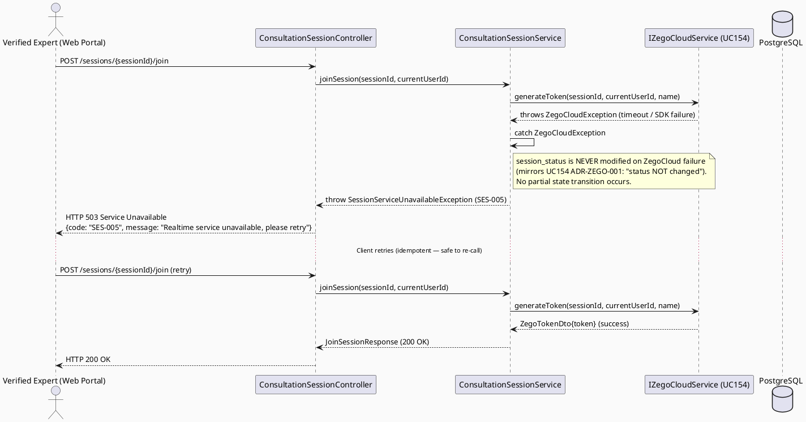
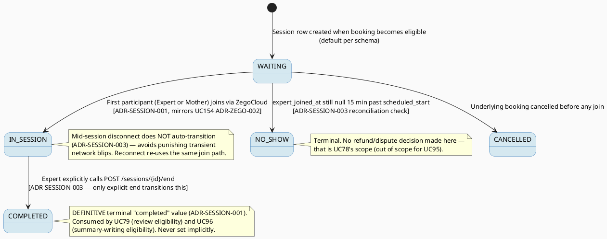

# ENGINEERING DOCUMENTATION STANDARD (EDS) v2.0
# UC95 — Manage Consultation Session — Technical Design Specification

| Field | Value |
|-------|-------|
| **Document ID** | `CB-CONSULTATION-IMP-095` |
| **Version** | `1.0` |
| **Date** | `2026-07-02` |
| **Status** | `Draft` |
| **Document Owner** | `TV4-Lâm` |
| **Author** | `AI Agent (Technical Architect)` |
| **Reviewed by** | `[Tech Lead — Pending]` |
| **DPO Sign-off** | `[ ] Pending` *(session touches health-context conversation content — see §1)* |
| **Approved by** | `[Principal Architect — Pending]` |
| **Last Review** | `2026-07-02` |
| **Based on EDS** | `v2.0` |

---

## CHANGELOG

| Ngày | Người thực hiện | Nội dung thay đổi |
|------|-----------------|-------------------|
| 2026-07-02 | AI Agent — Technical Architect | Tạo tài liệu lần đầu (Draft) cho UC95 |

---

## MỤC LỤC

1. [Tổng quan Module](#1-tổng-quan-module)
2. [Ma trận Truy vết (Traceability Matrix)](#2-ma-trận-truy-vết-traceability-matrix)
3. [Architecture Decision Records (ADR)](#3-architecture-decision-records-adr)
4. [Non-Functional Requirements & SLA](#4-non-functional-requirements--sla)
5. [Static Modeling (Mô hình Tĩnh)](#5-static-modeling-mô-hình-tĩnh)
6. [Dynamic Modeling (Mô hình Động)](#6-dynamic-modeling-mô-hình-động)
7. [Domain Event Catalog](#7-domain-event-catalog)
8. [Interface Specification (Đặc tả Giao diện)](#8-interface-specification-đặc-tả-giao-diện)
9. [API Specification](#9-api-specification)
10. [Bảng mã lỗi (Error Codes)](#10-bảng-mã-lỗi-error-codes)
11. [Quy trình Triển khai (Step-by-Step)](#11-quy-trình-triển-khai-step-by-step)
12. [Rollback & Incident Runbook](#12-rollback--incident-runbook)
13. [Kịch bản Kiểm thử Chi tiết](#13-kịch-bản-kiểm-thử-chi-tiết)
14. [Phương pháp Xác minh](#14-phương-pháp-xác-minh)
15. [Mẫu thử thực tế (API Verification Samples)](#15-mẫu-thử-thực-tế-api-verification-samples)
16. [Bảng tổng hợp phân quyền (Authorization Matrix)](#16-bảng-tổng-hợp-phân-quyền-authorization-matrix)
17. [AI Prompt Constraints (CASE 2.0)](#17-ai-prompt-constraints-case-20)

---

## 1. Tổng quan Module

| Field | Value |
|-------|-------|
| **Module Name** | `Consultation — Session Management` |
| **Bounded Context** | `Consultation` (package `com.carebridge.backend.consultation`) |
| **Function ID / UC** | `3.2.1.9 Manage Consultation Session` / `UC-95` (SRS L922-941) |
| **Primary Actor** | Verified Expert |
| **Secondary Actor** | ZegoCloud Realtime Service |
| **Platform** | **Web (Expert Portal)** — React + TypeScript + Vite |
| **Priority** | High |
| **Sprint / Owner** | Sprint 4 "Real Providers And Admin Polish" — TV4-Lâm |
| **Data Classification** | `Confidential` (session metadata, participation timestamps; `consultation_messages.message_body` may carry health-context conversation content — `Sensitive-PII`-adjacent) |
| **Compliance Scope** | `PDPA (Luật 91/2025)`, internal `BR-RBAC`, `BR-CONSULTATION` |
| **Upstream Dependencies** | `Book Private Consultation (UC-75/76)`, `Establish Realtime Communication Session (UC-154)` — ZegoCloud token/room pattern reused, **not re-invented** (see §1.3); `Process Payment Transaction` (booking must be paid) |
| **Downstream Consumers** | `UC-79 Review Expert After Consultation` (reads `session_status` terminal value — see ADR-SESSION-001), `UC-96 Write Consultation Summary` (writes only after session reaches terminal completed state), Notification service |

### 1.1 Scope Statement — Greenfield within an existing schema contract

Same greenfield posture as sibling consultation-domain TDS (UC78, UC79):
backend `com.carebridge.backend.consultation` package holds only placeholder
files. The mobile `lib/features/consultation/` package and Web
`src/features/consultationManagement/` (`components/models/pages/services`,
all `.gitkeep`) and `src/features/expert/pages/ExpertDashboardPage.tsx`
(explicit `TODO: Implement from design mockup CB-054`) are placeholder-only.
The schema (`consultation_bookings`, `consultation_sessions`,
`consultation_messages` — `V1__init_schema.sql` L876-919) already models the
session domain. This TDS designs UC95 against that schema contract.

### 1.2 Entry-Criteria Blocker (Open — MUST be resolved before implementation)

> ⚠️ **UC95 CANNOT be implemented standalone.** It requires:
> - Booking creation/payment service (`consultation_bookings` reaching a
>   session-eligible `status`, e.g. `'CONFIRMED'`/paid — UC-75/76, out of
>   scope here)
> - `EstablishRealtimeCommunicationSession` (UC-154) token/room issuance —
>   this TDS **reuses** its `ZegoCloudService` contract (see §1.3) rather than
>   re-specifying it
>
> **Marked `Open`** — Product/Tech Lead must confirm the exact
> `consultation_bookings.status` value that gates session start before UC95
> Sprint work starts.

### 1.3 ZegoCloud Integration Pattern Reuse — Explicit Boundary

`UC154_EstablishRealtimeCommunicationSession_TDS.md` (Draft, unimplemented,
the **only** existing ZegoCloud-pattern reference in the repo) already
specifies:
- `roomId = consultationId.toString()` where `consultationId` in UC154's
  vocabulary maps 1:1 to `consultation_sessions.session_id` in this schema
  (UC154 was written before the `booking`/`session` split was fully reflected
  in its own text, but its `ZegoCloudService` contract — token generation,
  join/leave tracking, session end — is directly reusable at the session
  granularity this TDS operates on).
- Token generated server-side via `TokenServerAssistant.generateToken04()`,
  TTL 3600s, **never persisted to DB**.
- `IZegoCloudService.generateToken()`, `.recordJoin()`, `.endSession()`.

**This TDS does NOT re-invent a new ZegoCloud integration.** UC95's
`ConsultationSessionService` **depends on and calls** `IZegoCloudService`
(from UC154) as a collaborator; UC95's own responsibility is strictly the
**consultation session lifecycle** (booking → session created → joined →
in-progress → completed/no-show/cancelled) and **participation status**
tracking, using ZegoCloud only as the realtime transport underneath (§6.1).
This boundary is stated explicitly to prevent an AI implementation from
duplicating token-generation logic inside `ConsultationSessionService` (see
§17.4 AP-CB-101).

### 1.4 Session-Completion Terminal Value — Reconciliation with UC79

`UC79_ReviewExpertAfterConsultation_TDS.md` (§ADR-REVIEW-001, status
`Proposed`) **assumed** `consultation_sessions.session_status == 'COMPLETED'`
as the terminal value gating review eligibility, explicitly flagging it as an
assumption pending confirmation from whichever TDS actually owns the session
lifecycle transition. **UC95 is that owner.** See ADR-SESSION-001 below:
**this TDS CONFIRMS `'COMPLETED'` as the definitive terminal value.** UC79's
assumption is consistent with this decision and should be updated from
`Proposed` to `Accepted` once this TDS (UC95) is itself approved — flagged as
a cross-document follow-up in §2 Traceability Matrix, not silently resolved.

---

## 2. Ma trận Truy vết (Traceability Matrix)

| Requirement ID | Loại (BR/ADR/US) | Mô tả yêu cầu | Thành phần Code | Compliance Target | ADR liên quan |
|----------------|------------------|---------------|-----------------|-------------------|---------------|
| UC-95 (SRS §3.2.1.9, L922-941) | Use Case | Receives bookings, joins consultation sessions, updates participation status | `ConsultationSessionController`, `ConsultationSessionService` | BR-CONSULTATION | ADR-SESSION-001 |
| BR-RBAC | Business Rule | Users may access only functions allowed by role/permission scope | `ConsultationSessionPolicy.assertIsAssignedExpert()` | Authorization | ADR-SESSION-002 |
| BR-CONSULTATION | Business Rule | Booking/session actions keep auditable lifecycle state | `ConsultationSessionEntity.sessionStatus`, audit log emission | PDPA / BR-AUDIT | ADR-SESSION-001, ADR-SESSION-003 |
| SRS E3 (external service/network/server failure — retry guidance, no duplicate unsafe action) | Exception Flow | ZegoCloud join/reconnect failure must not corrupt session state | `ConsultationSessionService.joinSession()` guard | BR-CONSULTATION | ADR-SESSION-003 |
| Schema: `consultation_sessions`, `consultation_messages` (`V1__init_schema.sql` L898-919) | Schema Contract | Session lifecycle + in-session messaging persistence | `ConsultationSessionEntity`, `ConsultationMessageEntity` | — | — |
| UC-154 (ZegoCloud pattern reuse, §1.3) | Reused Contract | Token issuance, join/leave tracking | `IZegoCloudService` (external collaborator, not owned by this TDS) | — | — |
| UC-79 reconciliation (§1.4) | Cross-Document | Confirms terminal `session_status` value consumed by UC79's review-eligibility check | `ConsultationSessionEntity.sessionStatus = 'COMPLETED'` | BR-CONSULTATION | ADR-SESSION-001 |
| Entry-Criteria Blocker (§1.2) | Open Item | Booking/payment service must exist first | N/A — blocking dependency | — | — |

---

## 3. Architecture Decision Records (ADR)

### ADR-SESSION-001 — Session lifecycle state machine and definitive terminal "completed" value

| Field | Value |
|-------|-------|
| **Status** | `Accepted` *(this TDS is the definitive owner of this value — confirms and supersedes UC79's `Proposed` assumption)* |
| **Deciders** | `AI Agent (proposal) — pending TV4-Lâm / Tech Lead confirmation` |
| **Date** | `2026-07-02` |
| **Supersedes** | Confirms `ADR-REVIEW-001` (UC79) assumption; UC79 must update its status from `Proposed` to `Accepted` referencing this ADR once this TDS is approved. |

#### Bối cảnh (Context)
`consultation_sessions.session_status varchar(30) NOT NULL DEFAULT 'WAITING'`
(schema L904) is a free-text status column with **no CHECK constraint** — the
exact value set is not fixed by the DB. SRS UC-95 description: "Receives
bookings, joins consultation sessions, and updates participation status."
UC79 (sibling TDS) already needs a terminal "completed" value to gate review
eligibility, and proposed `'COMPLETED'` by analogy with other status columns
in the schema, explicitly flagging it Open pending confirmation from this
TDS.

#### Các phương án đã xem xét (Options Considered)

| Phương án | Mô tả | Ưu điểm | Nhược điểm |
|-----------|-------|----------|------------|
| A | Use `'ENDED'` as terminal value | Matches `ended_at` column name semantics | Diverges from UC79's existing `'COMPLETED'` assumption — would force a breaking reconciliation |
| B | **Confirm `'COMPLETED'` as the terminal value** (matches UC79's assumption) | Zero rework for UC79; consistent with `expert_credentials.review_status`/`expert_reviews.moderation_status` default-pending-style naming convention already used elsewhere in the schema; intuitive for admin/audit review | None material — arbitrary string choice either way, but this one is already load-bearing in a sibling Draft TDS |
| C | Introduce a DB `CHECK` constraint enumerating all session_status values now | Strong DB-level guarantee | Requires a new migration touching a table already referenced by 2 sibling TDS docs; out of scope for Sprint 4 "polish" framing; not a genuine gap since app-level enforcement is the established pattern for every other status column in this schema (no existing CHECK constraints on any consultation-domain table) |

#### Quyết định (Decision)
Chọn **Phương án B**. The full session lifecycle enum (application-level,
enforced in `ConsultationSessionPolicy`, no DB migration required):

```
WAITING     — session row created when booking becomes eligible (default)
IN_SESSION  — set when the first participant (Expert or Mother) successfully
              joins via ZegoCloud (mirrors UC154's ADR-ZEGO-002 "first
              joiner" semantics, extended here with an explicit state name)
COMPLETED   — terminal. Set when the Expert explicitly ends the session, or
              both participants have left and `ended_at` is set. THIS IS THE
              DEFINITIVE VALUE CONSUMED BY UC79's session-completion check.
NO_SHOW     — terminal. Set when the Expert does not join within a 15-minute
              grace period after `scheduled_start` (mirrors UC154's
              ADR-ZEGO-002 15-min grace-period language)
CANCELLED   — terminal. Set when the underlying booking is cancelled before
              any participant joins
```

`'COMPLETED'` is confirmed as the **definitive terminal "completed" value**.
This directly resolves UC79's `ADR-REVIEW-001` Open item — no further
reconciliation ambiguity.

#### Hệ quả (Consequences)

**Tích cực:** Removes the cross-document Open item blocking UC79's Proposed→Accepted transition; single source of truth for the session lifecycle enum, reused verbatim by UC96 (§ADR-SUMMARY-001).
**Tiêu cực / Trade-offs:** Enum enforced at application layer only (no DB CHECK) — consistent with existing codebase convention, accepted risk.
**Compliance Impact:** Supports BR-CONSULTATION auditable-lifecycle requirement; enables UC79's review-eligibility gate and UC96's summary-eligibility gate to share one unambiguous contract.

---

### ADR-SESSION-002 — Ownership: only the booking's assigned Expert may manage/join the session as the Expert-side participant

| Field | Value |
|-------|-------|
| **Status** | `Accepted` |
| **Deciders** | `AI Agent — derived directly from schema + BR-RBAC` |
| **Date** | `2026-07-02` |

#### Bối cảnh (Context)
`consultation_bookings.expert_profile_id` identifies the assigned Expert
(FK → `expert_profiles.expert_profile_id`, itself FK'd to `expert_profiles
.user_id`). `consultation_sessions.booking_id` links 1:1 to the booking
(`consultation_sessions_booking_id_key UNIQUE (booking_id)`, schema L1528).
UC95's actor is the Verified Expert only (Web Expert Portal) — the Mother-side
join flow is a separate mobile use case, out of scope for this TDS.

#### Các phương án đã xem xét (Options Considered)

| Phương án | Mô tả | Ưu điểm | Nhược điểm |
|-----------|-------|----------|------------|
| A | Any authenticated Expert can manage any session | Simple | Violates ownership/BR-RBAC; allows cross-account session hijack |
| B | **Only the Expert whose `user_id` matches `expert_profiles.user_id` for the booking's `expert_profile_id` may join/manage the session as Expert** | Matches schema FK semantics; prevents IDOR | Requires a policy check per request (negligible cost) |

#### Quyết định (Decision)
Chọn **Phương án B**. `ConsultationSessionPolicy.assertIsAssignedExpert(booking,
currentUserId)` must verify `expert_profiles.user_id == currentUserId` for
the booking's `expert_profile_id`, and additionally
`expert_profiles.verification_status == 'VERIFIED'` (SRS actor: "Verified
Expert"). Non-assigned or unverified experts receive `403 Forbidden`
(`SES-004`).

#### Hệ quả (Consequences)

**Tích cực:** Prevents IDOR / cross-tenant session hijack; enforces the "Verified Expert" precondition from the SRS actor definition.
**Tiêu cực / Trade-offs:** None material — mandatory RBAC control.
**Compliance Impact:** Satisfies BR-RBAC.

---

### ADR-SESSION-003 — ZegoCloud join/reconnect failure and timeout safety

| Field | Value |
|-------|-------|
| **Status** | `Accepted` |
| **Deciders** | `AI Agent — derived from SRS Exception E3 + UC154 pattern` |
| **Date** | `2026-07-02` |

#### Bối cảnh (Context)
SRS Exception E3: "External service, network, or server failure is handled
with retry guidance and no duplicate unsafe action." UC154's
`ZegoCloudService.generateToken()` can throw `ZEGO-001` (503) on SDK failure,
explicitly documented as "consultation status NOT changed" on failure. UC95
must define what happens to `session_status` on (a) initial join failure, (b)
mid-session disconnect, (c) reconnect attempt, (d) the 15-minute Expert
no-show grace period.

#### Các phương án đã xem xét (Options Considered)

| Phương án | Mô tả | Ưu điểm | Nhược điểm |
|-----------|-------|----------|------------|
| A | Any ZegoCloud error immediately marks session `CANCELLED` | Simple | Punishes transient network blips; loses a legitimate session on a recoverable timeout |
| B | **ZegoCloud token/join failure does NOT change `session_status`; client retries the join call (idempotent — re-requesting a token for the same `session_id` is safe); only the 15-min no-show grace period timeout transitions to `NO_SHOW`; mid-session disconnect does not auto-transition — session stays `IN_SESSION` until Expert explicitly ends it or the grace-period/no-activity reconciliation (out of scope, follow-up) marks it stale** | Matches UC154's "status NOT changed on ZegoCloud failure" invariant; safe retry semantics; no duplicate unsafe action (SRS E3) | Requires client-side retry UX guidance; a genuinely abandoned `IN_SESSION` row without explicit end could linger until a reconciliation job runs (flagged Open, non-blocking) |

#### Quyết định (Decision)
Chọn **Phương án B**.
- **Join failure (ZegoCloud SDK error):** `session_status` unchanged; return
  `503 SES-005`; client may retry `POST /sessions/{sessionId}/join`
  idempotently (re-issuing a token is always safe per UC154 ADR-ZEGO-001,
  token is never persisted).
- **Reconnect:** identical code path as initial join — `joinSession()` is
  idempotent; re-joining an already `IN_SESSION` session by the same
  participant simply re-issues a fresh token and does not re-trigger the
  `WAITING → IN_SESSION` transition (that only fires on the very first
  successful join, mirroring UC154 ADR-ZEGO-002).
- **Expert no-show:** a scheduled reconciliation check (application-level,
  triggered on next relevant read or explicit cron — implementation detail
  left to Chặng 3, not a new architecture decision) transitions `WAITING →
  NO_SHOW` if `expert_joined_at` remains null 15 minutes past
  `consultation_bookings.scheduled_start`.
- **Mid-session disconnect:** no automatic status transition. Only an
  explicit `POST /sessions/{sessionId}/end` (Expert-initiated) transitions
  `IN_SESSION → COMPLETED`. This avoids prematurely closing a session on a
  flaky network blip that self-resolves.

#### Hệ quả (Consequences)

**Tích cực:** No duplicate/unsafe state transitions on retry; matches UC154's established ZegoCloud failure-safety pattern; explicit Expert-initiated end is the only path to `COMPLETED`, giving UC96 a reliable precondition.
**Tiêu cực / Trade-offs:** An abandoned `IN_SESSION` row with no explicit end could linger indefinitely without a reconciliation job (flagged Open — follow-up item, non-blocking for Sprint 4 scope).
**Compliance Impact:** Supports BR-CONSULTATION auditable-lifecycle requirement; no duplicate unsafe action per SRS E3.

---

## 4. Non-Functional Requirements & SLA

> No SRS/BR source specifies numeric SLA targets for UC95 beyond UC154's
> token-latency figures (reused here). Values below are **Open — proposed
> defaults**, must be confirmed by Tech Lead.

### 4.1. Performance & Availability

| Category | Requirement | Target SLA | Measurement Method | Compliance Basis |
|----------|-------------|------------|---------------------|------------------|
| Latency | `POST /sessions/{id}/join` p99 (excludes ZegoCloud token round-trip, reused from UC154: `< 200ms`) | `< 400ms` total *(Open — proposed)* | Manual/API test timing | UC154 §4.1 |
| Availability | Dependent on booking/payment services (§1.2 blocker) + ZegoCloud (UC154 §4.1: 99.9% monthly) | N/A until dependencies implemented | — | — |
| Token TTL | ZegoCloud token (reused from UC154) | 3600 seconds (1 hour) | UC154 §4.1 | ADR-ZEGO-001 (UC154) |

### 4.2. Data Integrity & Retention

| Category | Requirement | Target | Verification Method | Compliance Basis |
|----------|-------------|--------|---------------------|------------------|
| Durability | No session/message record loss | RPO = 0 | Transaction log | BR-CONSULTATION |
| Retention | Session lifecycle audit trail (append lifecycle, status-only updates) | Indefinite | DB inspection — no DELETE path exposed to Expert | PDPA |
| Consistency | `session_status` transitions only via defined state machine (§6.4) | 100% (service-level enforcement) | Reconciliation query | ADR-SESSION-001 |

### 4.3. Security

| Category | Requirement | Target | Verification Method | Compliance Basis |
|----------|-------------|--------|---------------------|------------------|
| Access control | Role-based, ownership-scoped | Least privilege (Expert = own assigned booking only) | Auth Matrix (§16) | BR-RBAC |
| Token storage | ZegoCloud token NOT persisted in DB (reused from UC154) | Ephemeral only | DB column scan | UC154 ADR-ZEGO-001 |
| Content safety | `consultation_messages.message_body` may carry health-context content | Not exposed beyond session participants + audit | Auth Matrix (§16) | BR-PRIVACY |

### 4.4. Scalability & Capacity Planning

SRS marks UC95 "Frequency of Use: Regular." Session volume tracks booking
volume; no special scaling design beyond standard Spring Boot request
handling required at current expected scale. ZegoCloud capacity is
externally managed (UC154 scope).

---

## 5. Static Modeling (Mô hình Tĩnh)

### 5.1. Component Responsibilities & Planned File Paths

| Layer | File Path | Responsibility |
|-------|-----------|----------------|
| Controller | `src/main/java/com/carebridge/backend/consultation/controller/ConsultationSessionController.java` | HTTP mapping, DTO validation only |
| Service | `src/main/java/com/carebridge/backend/consultation/service/ConsultationSessionService.java` | Session lifecycle workflow, delegates token issuance to `IZegoCloudService` (UC154), event emission |
| Repository | `src/main/java/com/carebridge/backend/consultation/repository/ConsultationSessionRepository.java` | Persistence for `consultation_sessions` (canonical owner — UC79 and UC96 consume this as a read-only interface) |
| Repository | `src/main/java/com/carebridge/backend/consultation/repository/ConsultationMessageRepository.java` | Persistence for `consultation_messages` |
| Repository | `src/main/java/com/carebridge/backend/consultation/repository/ConsultationBookingRepository.java` | Read-only lookups for ownership/eligibility checks (shared with UC78/UC79, interface only) |
| Entity | `src/main/java/com/carebridge/backend/consultation/entity/ConsultationSessionEntity.java` | JPA mapping for `consultation_sessions` |
| Entity | `src/main/java/com/carebridge/backend/consultation/entity/ConsultationMessageEntity.java` | JPA mapping for `consultation_messages` |
| DTO | `src/main/java/com/carebridge/backend/consultation/dto/request/UpdateParticipationStatusRequest.java` | Inbound payload for status update |
| DTO | `src/main/java/com/carebridge/backend/consultation/dto/response/ConsultationSessionResponse.java` | Outbound payload |
| DTO | `src/main/java/com/carebridge/backend/consultation/dto/response/JoinSessionResponse.java` | Outbound payload — session + ZegoCloud token bundle |
| Mapper | `src/main/java/com/carebridge/backend/consultation/mapper/ConsultationSessionMapper.java` | Entity ↔ DTO, never expose entity |
| Policy | `src/main/java/com/carebridge/backend/consultation/policy/ConsultationSessionPolicy.java` | Ownership check (ADR-SESSION-002), state-transition guard (ADR-SESSION-001, ADR-SESSION-003) |
| Collaborator (reused, not owned) | `IZegoCloudService` (UC154 `com.carebridge.backend.consultation.service`) | Token issuance, join/leave timestamp recording — **UC95 depends on this interface, does not redefine it** |
| Web Model | `05_Development/CareBridgeWebApp/src/features/consultationManagement/models/consultationSession.ts` | Session DTO mirror (Zod schema) |
| Web Service | `05_Development/CareBridgeWebApp/src/features/consultationManagement/services/consultationSessionApi.ts` | API client (TanStack Query hooks) |
| Web Page | `05_Development/CareBridgeWebApp/src/features/consultationManagement/pages/SessionRoomPage.tsx` | Expert-facing session join/manage UI |
| Web Component | `05_Development/CareBridgeWebApp/src/features/consultationManagement/components/SessionParticipationBadge.tsx` | Participation status indicator |

### 5.2. Class Diagram (PlantUML)



### 5.3. Data Structure — Schema/Migration Details

> **CareBridge rule:** `V1__init_schema.sql` and approved Flyway migrations
> are primary source of truth. ERD is supporting context only.

**No new migration is required for the core session-management flow.** The
following tables already exist (`V1__init_schema.sql`, verified):

```sql
-- consultation_sessions (V1__init_schema.sql L898-909)
CREATE TABLE public.consultation_sessions (
    session_id            uuid         NOT NULL DEFAULT gen_random_uuid(),
    booking_id             uuid         NOT NULL,
    communication_room_id  varchar(255),
    started_at             timestamptz,
    ended_at                timestamptz,
    session_status         varchar(30)  NOT NULL DEFAULT 'WAITING',
    expert_summary         text,
    technical_log_json     jsonb,
    created_at              timestamptz  NOT NULL DEFAULT now(),
    updated_at              timestamptz  NOT NULL DEFAULT now()
);
-- PK: session_id (L1425-1426); UNIQUE: booking_id (consultation_sessions_booking_id_key, L1527-1528)
-- FK: booking_id -> consultation_bookings (L1838-1839)

-- consultation_messages (V1__init_schema.sql L911-920)
CREATE TABLE public.consultation_messages (
    message_id     uuid        NOT NULL DEFAULT gen_random_uuid(),
    session_id      uuid        NOT NULL,
    sender_user_id  uuid        NOT NULL,
    message_type    varchar(30) NOT NULL,
    message_body    text,
    file_url        text,
    sent_at         timestamptz NOT NULL DEFAULT now(),
    read_at         timestamptz
);
-- PK: message_id (L1428-1429); FK: session_id -> consultation_sessions (L1841-1842),
-- sender_user_id -> users (L1844-1845)
-- Index: idx_consultation_messages_session_id (L1640)
```

**Genuine gap identified (Open — flag for confirmation, non-blocking for
core session-management scope):**
1. No `CHECK` constraint on `session_status` — application-level enum
   enforcement required (`ConsultationSessionPolicy`), consistent with
   ADR-SESSION-001 Option B decision (no migration).
2. `communication_room_id` is nullable `varchar(255)` — this TDS sets it to
   `session_id.toString()` at first join (mirrors UC154's `roomId =
   consultationId.toString()` convention, adapted to this schema's
   session-level granularity). No migration needed — existing nullable
   column is sufficient.

No sync action needed for `V1__init_schema.sql`.

---

## 6. Dynamic Modeling (Mô hình Động)

### 6.1. Sequence Diagram — Happy Path: Expert Joins Session via ZegoCloud (PlantUML)



### 6.2. Sequence Diagram — Alternative: Expert Updates Participation Status → Ends Session (PlantUML)



### 6.3. Sequence Diagram — Error/Timeout: ZegoCloud Join Failure and Retry (PlantUML)



### 6.4. State Machine — Consultation Session Status (bắt buộc)



**⚠️ Invariant bất biến:**
1. `session_status` may only transition along the edges shown in §6.4 — never
   directly `WAITING → COMPLETED` (must pass through `IN_SESSION`), never a
   transition out of a terminal state (`COMPLETED`, `NO_SHOW`, `CANCELLED`
   are final).
2. `'COMPLETED'` is set **only** by an explicit Expert-initiated
   `POST /sessions/{id}/end` call — never automatically inferred from a
   ZegoCloud disconnect event (ADR-SESSION-003).
3. ZegoCloud SDK failures during join/reconnect **never** mutate
   `session_status` (ADR-SESSION-003, mirrors UC154 ADR-ZEGO-001).
4. Only the assigned, verified Expert (`expert_profiles.user_id ==
   currentUserId` for the booking's `expert_profile_id`,
   `verification_status == 'VERIFIED'`) may call join/end/update-status
   endpoints (ADR-SESSION-002).

---

## 7. Domain Event Catalog

### 7.1. Events Published (Phát ra)

| Event Name | Trigger | Publisher | Subscriber(s) | Payload Schema | Async? |
|------------|---------|-----------|---------------|----------------|--------|
| `ConsultationSessionStatusChanged` | Any `session_status` transition (§6.4) | `ConsultationSessionService` | UC79 review-eligibility cache (out of scope consumer), UC96 (summary-eligibility check), Notification service, Audit log | `ConsultationSessionStatusChanged.java` | Yes |

### 7.2. Events Consumed (Tiêu thụ)

| Event Name | Source | Handler | Action thực hiện |
|------------|--------|---------|------------------|
| *(None)* | — | — | UC95's session-management flow does not consume any external event; it reads `consultation_bookings` state synchronously and calls `IZegoCloudService` (UC154) synchronously at request time. |

### 7.3. Payload Schema

```java
// ConsultationSessionStatusChanged.java
public record ConsultationSessionStatusChanged(
    UUID    eventId,
    String  eventType,       // "ConsultationSessionStatusChanged"
    Instant occurredAt,
    String  version,         // "1.0"
    Payload payload,
    Metadata metadata
) implements ApplicationEvent {

    public record Payload(
        UUID   sessionId,
        UUID   bookingId,
        String previousStatus,  // WAITING | IN_SESSION | COMPLETED | NO_SHOW | CANCELLED
        String newStatus,       // WAITING | IN_SESSION | COMPLETED | NO_SHOW | CANCELLED
        Instant startedAt,      // nullable
        Instant endedAt         // nullable
    ) {}

    public record Metadata(
        UUID   correlationId,
        String causedBy          // userId or "system" (reconciliation job)
    ) {}
}
```

---

## 8. Interface Specification (Đặc tả Giao diện)

### 8.1. Service Interface

```java
// UpdateParticipationStatusRequest.java — Input DTO
// @version 1.0
public class UpdateParticipationStatusRequest {
    @NotBlank
    @Pattern(regexp = "IN_SESSION|COMPLETED|NO_SHOW|CANCELLED")
    private String targetStatus;   // Must be a valid forward transition per §6.4 state machine
    // getters / setters / @Valid annotations
}

// ConsultationSessionResponse.java — Output DTO
public class ConsultationSessionResponse {
    private UUID sessionId;
    private UUID bookingId;
    private String communicationRoomId;
    private String sessionStatus;   // WAITING | IN_SESSION | COMPLETED | NO_SHOW | CANCELLED
    private Instant startedAt;
    private Instant endedAt;
    // getters / setters — NEVER expose ZegoCloud token here; see JoinSessionResponse
}

// JoinSessionResponse.java — Output DTO (session + ephemeral ZegoCloud token bundle)
public class JoinSessionResponse {
    private UUID sessionId;
    private String roomId;          // = sessionId.toString(), per §5.3 gap note 2
    private String zegoToken;       // NEVER persisted — ephemeral, from IZegoCloudService (UC154)
    private long zegoAppId;
    private Instant tokenExpiresAt; // now + 3600s (UC154 ADR-ZEGO-001)
    private String sessionStatus;
    // getters / setters
}

// IConsultationSessionService.java — Service Contract
// @version 1.0
public interface IConsultationSessionService {
    /**
     * Assigned Expert joins the session. Idempotent — repeat calls re-issue
     * a fresh ZegoCloud token without re-triggering the WAITING->IN_SESSION
     * transition once already IN_SESSION.
     * @throws SessionAuthorizationException (SES-004) if currentUserId is not the assigned, verified Expert
     * @throws SessionNotFoundException (SES-003) if sessionId does not exist
     * @throws SessionConflictException (SES-002) if session is already in a terminal state
     * @throws SessionServiceUnavailableException (SES-005) if ZegoCloud token generation fails
     */
    JoinSessionResponse joinSession(UUID sessionId, UUID currentUserId);

    /**
     * Expert explicitly ends the session — transitions IN_SESSION -> COMPLETED.
     * @throws SessionAuthorizationException (SES-004) if currentUserId is not the assigned Expert
     * @throws SessionTransitionException (SES-006) if session is not currently IN_SESSION
     */
    ConsultationSessionResponse endSession(UUID sessionId, UUID currentUserId);

    /**
     * Updates participation status per an explicit, validated state transition (§6.4).
     * @throws SessionAuthorizationException (SES-004) if unauthorized
     * @throws SessionTransitionException (SES-006) if the requested transition is not allowed from the current state
     */
    ConsultationSessionResponse updateParticipationStatus(UUID sessionId, UpdateParticipationStatusRequest request, UUID currentUserId);

    /**
     * Retrieves a session — only the assigned Expert or an admin may view it.
     * @throws SessionAuthorizationException (SES-004) if unauthorized
     * @throws SessionNotFoundException (SES-003) if not found
     */
    ConsultationSessionResponse getSession(UUID sessionId, UUID currentUserId);

    /**
     * Lists all sessions assigned to the current Expert (across all their bookings).
     */
    List<ConsultationSessionResponse> listAssignedSessions(UUID currentUserId);
}
```

### 8.2. Repository Interface

```java
// ConsultationSessionRepository.java
// @version 1.0
public interface ConsultationSessionRepository extends JpaRepository<ConsultationSessionEntity, UUID> {

    Optional<ConsultationSessionEntity> findById(UUID sessionId);

    Optional<ConsultationSessionEntity> findByBookingId(UUID bookingId);

    @Query("SELECT s FROM ConsultationSessionEntity s JOIN ConsultationBookingEntity b ON s.bookingId = b.bookingId WHERE b.expertProfileId = :expertProfileId")
    List<ConsultationSessionEntity> findByExpertProfileId(UUID expertProfileId);

    // Append-only for lifecycle: no delete() exposed. Status transitions via @Modifying UPDATE only,
    // always guarded by ConsultationSessionPolicy.assertTransitionAllowed().
}
```

---

## 9. API Specification

### 9.1. Endpoints Table

| Method | Path | Auth Level | Required Roles | Rate Limit | Idempotent? |
|--------|------|------------|----------------|------------|-------------|
| `POST` | `/api/v1/consultations/sessions/{sessionId}/join` | JWT Bearer | `EXPERT` (assigned, verified only) | 60/min | Yes (re-issues token) |
| `POST` | `/api/v1/consultations/sessions/{sessionId}/end` | JWT Bearer | `EXPERT` (assigned only) | 20/min | No |
| `PATCH` | `/api/v1/consultations/sessions/{sessionId}/status` | JWT Bearer | `EXPERT` (assigned only) | 20/min | No |
| `GET` | `/api/v1/consultations/sessions/{sessionId}` | JWT Bearer | `EXPERT` (assigned), `SYSTEM_ADMIN` | 300/min | Yes |
| `GET` | `/api/v1/consultations/sessions` | JWT Bearer | `EXPERT` (own assigned only) | 300/min | Yes |

### 9.2. Request / Response Schemas

#### `POST /api/v1/consultations/sessions/{sessionId}/join` — Expert joins session

**Response — 200 OK (Happy Path):**
```json
{
  "sessionId": "9f8e7d6c-1234-4a5b-8c9d-0e1f2a3b4c5d",
  "roomId": "9f8e7d6c-1234-4a5b-8c9d-0e1f2a3b4c5d",
  "zegoToken": "04AAAAAGxxxxxxxx...",
  "zegoAppId": 12345678,
  "tokenExpiresAt": "2026-07-02T11:00:00.000Z",
  "sessionStatus": "IN_SESSION"
}
```

**Response — 403 Forbidden (Not assigned Expert):**
```json
{
  "error": {
    "code": "SES-004",
    "message": "You are not authorized to join this session"
  }
}
```

**Response — 503 Service Unavailable (ZegoCloud failure):**
```json
{
  "error": {
    "code": "SES-005",
    "message": "Realtime service unavailable, please retry"
  }
}
```

#### `POST /api/v1/consultations/sessions/{sessionId}/end` — Expert ends session

**Response — 200 OK (Happy Path):**
```json
{
  "sessionId": "9f8e7d6c-1234-4a5b-8c9d-0e1f2a3b4c5d",
  "bookingId": "3fa85f64-5717-4562-b3fc-2c963f66afa6",
  "communicationRoomId": "9f8e7d6c-1234-4a5b-8c9d-0e1f2a3b4c5d",
  "sessionStatus": "COMPLETED",
  "startedAt": "2026-07-02T10:00:00.000Z",
  "endedAt": "2026-07-02T10:32:00.000Z"
}
```

**Response — 409 Conflict (Not currently IN_SESSION):**
```json
{
  "error": {
    "code": "SES-006",
    "message": "Session is not currently in progress and cannot be ended"
  }
}
```

---

## 10. Bảng mã lỗi (Error Codes)

| Code | HTTP Status | Message (EN) | Message (VI) | Trigger Condition |
|------|-------------|--------------|--------------|-------------------|
| `SES-001` | 400 | Validation failed | Dữ liệu không hợp lệ | `targetStatus` not a valid enum value |
| `SES-002` | 409 | Session already in a terminal state | Phiên tư vấn đã ở trạng thái kết thúc | join/status-update attempted on `COMPLETED`/`NO_SHOW`/`CANCELLED` session |
| `SES-003` | 404 | Session not found | Không tìm thấy phiên tư vấn | `sessionId` does not exist |
| `SES-004` | 403 | Insufficient permissions | Không đủ quyền | Current user is not the assigned, verified Expert for this session's booking |
| `SES-005` | 503 | Realtime service unavailable | Dịch vụ realtime không khả dụng | ZegoCloud SDK call failed/timed out (ADR-SESSION-003) — `session_status` unchanged |
| `SES-006` | 409 | Invalid state transition | Chuyển trạng thái không hợp lệ | Requested transition not allowed from current `session_status` per §6.4 |
| `SES-500` | 500 | Internal error | Lỗi hệ thống | Unexpected failure |

---

## 11. Quy trình Triển khai (Step-by-Step)

### 11.1. Prerequisites

- [ ] **BLOCKING:** Booking creation/payment service (UC-75/76) implemented; `consultation_bookings` rows exist with real `expert_profile_id`/`status`
- [ ] **BLOCKING:** `IZegoCloudService` (UC-154) implemented and stable — UC95 depends on it as a collaborator
- [ ] ADR-SESSION-001 confirmed by Product/Tech Lead (currently `Accepted` by this TDS — pending sign-off)
- [ ] UC79's `ADR-REVIEW-001` updated to reference this ADR (cross-document follow-up, tracked here since UC95 owns the value)
- [ ] DPO review for `consultation_messages.message_body` (may carry health-context content) — sign-off pending
- [ ] Principal Architect approves this TDS

### 11.2. Pre-Migration Checklist

- [ ] **N/A for core flow** — no new migration required for baseline scope (see §5.3)

### 11.3. Implementation Steps

#### Chặng 1 — Entities + Repositories
Create `ConsultationSessionEntity`, `ConsultationMessageEntity` mapped 1:1 to
existing schema (§5.3). No migration needed.

#### Chặng 2 — Policy + Service
Implement `ConsultationSessionPolicy` (ownership §ADR-SESSION-002,
state-transition guard §ADR-SESSION-001/003), `ConsultationSessionService`
(join/end/update-status workflow, delegates to `IZegoCloudService` from
UC154 — do NOT re-implement token generation).

#### Chặng 3 — Controller + Web
Wire `ConsultationSessionController`, then Web
`consultationSessionApi.ts` (TanStack Query hooks) + `SessionRoomPage.tsx`
(Expert Portal). Optional: no-show reconciliation check (ADR-SESSION-003)
implemented as an application-level check evaluated on next relevant read
(no new infra required for Sprint 4 scope).

#### Chặng 4 — Verification sau deploy

```bash
curl -X GET https://[host]/api/v1/health
# Expected: {"status": "ok"}
```

### 11.4. Deployment Checklist

- [ ] `./mvnw test` green
- [ ] `npm run test:run` green (Web)
- [ ] Error rate < 1% in first 10 minutes
- [ ] Audit log emits `ConsultationSessionStatusChanged` in correct format
- [ ] Verify ZegoCloud token NEVER appears in any DB column (reused UC154 verification query)
- [ ] No PII/health-context message body leaked in application logs

---

## 12. Rollback & Incident Runbook

### 12.1. Điều kiện kích hoạt Rollback

| Điều kiện | Ngưỡng | Người quyết định |
|-----------|--------|------------------|
| Error rate tăng đột biến | > 5% trong 5 phút | On-call Engineer |
| Invalid state transition bypassing §6.4 guard detected | Any single occurrence | Tech Lead (data-integrity incident) |
| ZegoCloud token persisted to DB | Any occurrence | Tech Lead + DPO |
| Non-assigned Expert able to join a session | Any occurrence | Tech Lead (security incident) |

### 12.2. Rollback Procedure

```bash
# No new migration in baseline scope — code-only rollback:
git checkout -- 05_Development/CareBridgeAPI/src/main/java/com/carebridge/backend/consultation/
git checkout -- 05_Development/CareBridgeWebApp/src/features/consultationManagement/
kubectl rollout undo deployment/carebridge-api
```

### 12.3. Notification Protocol

| Thời điểm | Người nhận | Kênh | Template |
|-----------|------------|------|----------|
| Ngay khi phát hiện invalid transition or IDOR | On-call + Tech Lead | Slack `#incident` | "🚨 Session state-machine/authorization violation for session [id]" |

### 12.4. Post-Incident Review (PIR)

Standard PIR within 48h for any data-integrity or authorization incident.

---

## 13. Kịch bản Kiểm thử Chi tiết

> Detailed test cases live in `UC95_ManageConsultationSession_Test-Spec.md`.

| Condition Ref | Summary |
|----------------|---------|
| TC-COND-001 | Happy path — assigned Expert joins WAITING session → IN_SESSION + token issued |
| TC-COND-002 | Ownership violation — non-assigned Expert joins → 403 (`SES-004`) |
| TC-COND-003 | Unverified Expert attempts join → 403 (`SES-004`) |
| TC-COND-004 | ZegoCloud SDK failure on join → 503 (`SES-005`), `session_status` unchanged |
| TC-COND-005 | Retry after ZegoCloud failure succeeds — idempotent re-join |
| TC-COND-006 | Expert ends IN_SESSION session → COMPLETED (definitive terminal value) |
| TC-COND-007 | End attempted on non-IN_SESSION session → 409 (`SES-006`) |
| TC-COND-008 | Invalid state transition (e.g., WAITING → COMPLETED directly) rejected → 409 (`SES-006`) |
| TC-COND-009 | No-show reconciliation — WAITING past 15-min grace → NO_SHOW |
| TC-COND-010 | Mid-session disconnect does not auto-transition — session stays IN_SESSION |
| TC-COND-011 | Session not found → 404 (`SES-003`) |
| TC-COND-012 | `ConsultationSessionStatusChanged` event emitted on every valid transition |

---

## 14. Phương pháp Xác minh

### 14.1. Database Inspection

```sql
SELECT session_id, booking_id, session_status, started_at, ended_at
FROM consultation_sessions
WHERE session_id = '[uuid]';

-- Verify no token column exists in consultation_sessions
SELECT column_name FROM information_schema.columns
WHERE table_name = 'consultation_sessions' AND column_name LIKE '%token%';
-- Expected: 0 rows

-- Verify only valid terminal values appear
SELECT DISTINCT session_status FROM consultation_sessions
WHERE session_status NOT IN ('WAITING','IN_SESSION','COMPLETED','NO_SHOW','CANCELLED');
-- Expected: 0 rows
```

### 14.2. Log / Audit Verification

```bash
kubectl logs -l app=carebridge-api | grep '"eventType":"ConsultationSessionStatusChanged"' | head -5
```

---

## 15. Mẫu thử thực tế (API Verification Samples)

### 15.1. Happy Path

```bash
curl -X POST https://[host]/api/v1/consultations/sessions/{sessionId}/join \
  -H "Authorization: Bearer [JWT_TOKEN — expert@carebridge.dev]"
```

**Expected Response (200):** see §9.2.

### 15.2. Error Paths

```bash
# ZegoCloud unavailable → 503
curl -X POST https://[host]/api/v1/consultations/sessions/{sessionId}/join \
  -H "Authorization: Bearer [JWT_TOKEN]"
```

**Expected Response (503):** see `SES-005` in §10.

---

## 16. Bảng tổng hợp phân quyền (Authorization Matrix)

| Endpoint | `GUEST` | `MOTHER` | `EXPERT` (non-assigned) | `EXPERT` (assigned, unverified) | `EXPERT` (assigned, verified) | `SYSTEM_ADMIN` |
|----------|---------|----------|--------------------------|----------------------------------|-------------------------------|-----------------|
| `POST /sessions/{id}/join` | ❌ | ❌ *(Mother-side join is a separate mobile UC, out of scope)* | ❌ (`SES-004`) | ❌ (`SES-004`) | ✅ | ✅ |
| `POST /sessions/{id}/end` | ❌ | ❌ | ❌ (`SES-004`) | ❌ (`SES-004`) | ✅ | ✅ |
| `PATCH /sessions/{id}/status` | ❌ | ❌ | ❌ (`SES-004`) | ❌ (`SES-004`) | ✅ | ✅ |
| `GET /sessions/{id}` | ❌ | ❌ *(out of scope for UC95)* | ❌ (`SES-004`) | ❌ (`SES-004`) | ✅ Own | ✅ All |
| `GET /sessions` | ❌ | ❌ | ✅ *(own list only, empty if none assigned)* | ✅ *(own list only)* | ✅ Own | ✅ All |

**Chú thích:**
- ✅ = Được phép; ❌ = Bị từ chối (403); `Own` = chỉ với session của booking được gán cho chính mình.

---

## 17. AI Prompt Constraints (CASE 2.0)

### 17.1 Constraint Summary Table

| # | Constraint | Source (ADR/BR) | Last Verified |
|---|-----------|-----------------|---------------|
| C1 | `session_status` MUST follow the exact state machine in §6.4 — never allow a direct `WAITING → COMPLETED` transition; `'COMPLETED'` is the definitive terminal value | `ADR-SESSION-001` | `2026-07-02` |
| C2 | Only the assigned, `verification_status='VERIFIED'` Expert (`expert_profiles.user_id == currentUserId`) may join/end/update the session | `ADR-SESSION-002` / `BR-RBAC` | `2026-07-02` |
| C3 | ZegoCloud token generation MUST delegate to `IZegoCloudService` (UC154) — do NOT re-implement `TokenServerAssistant.generateToken04()` calls inside `ConsultationSessionService` | `§1.3 ZegoCloud Integration Pattern Reuse` | `2026-07-02` |
| C4 | ZegoCloud SDK failure during join/reconnect MUST NOT change `session_status` — return `SES-005` (503) and leave state untouched | `ADR-SESSION-003` | `2026-07-02` |
| C5 | `'COMPLETED'` is set ONLY via explicit `POST /sessions/{id}/end` — never inferred automatically from a disconnect event | `ADR-SESSION-003` | `2026-07-02` |
| C6 | ZegoCloud token is NEVER persisted to any DB column — ephemeral, generated per call | `UC154 ADR-ZEGO-001` (reused) | `2026-07-02` |
| C7 | Use `com.carebridge.backend.consultation` package layout exactly per `CLAUDE.md`; never expose `ConsultationSessionEntity` directly in API responses | `CLAUDE.md` | `2026-07-02` |

### 17.2 Constraint Injection Block (Copy-Paste vào AI Prompt)

```
[CONSTRAINT BLOCK — Module: Consultation Session Management (UC95)]
Theo TDS CB-CONSULTATION-IMP-095 và các ADR liên quan:

1. (C1) session_status PHẢI tuân theo state machine chính xác tại §6.4 —
   KHÔNG cho phép chuyển trực tiếp WAITING -> COMPLETED; 'COMPLETED' là
   giá trị terminal chính thức.
2. (C2) CHỈ Expert được gán (expert_profiles.user_id == currentUserId) và
   đã VERIFIED mới được join/end/update session.
3. (C3) Token ZegoCloud PHẢI delegate qua IZegoCloudService (UC154) —
   KHÔNG tự implement lại generateToken04() bên trong ConsultationSessionService.
4. (C4) Lỗi ZegoCloud SDK khi join/reconnect KHÔNG được thay đổi session_status —
   trả về SES-005 (503), giữ nguyên trạng thái.
5. (C5) 'COMPLETED' CHỈ được set qua POST /sessions/{id}/end tường minh —
   KHÔNG tự động suy ra từ sự kiện disconnect.
6. (C6) Token ZegoCloud KHÔNG BAO GIỜ lưu vào DB — ephemeral, generate mỗi lần gọi.
7. (C7) Dùng đúng cấu trúc package com.carebridge.backend.consultation;
   KHÔNG bao giờ trả JPA entity trực tiếp trong API response.

[CONTEXT BLOCK]
- Bounded Context: Consultation
- Data Classification: Confidential
- Compliance: PDPA (Luật 91/2025), BR-RBAC, BR-CONSULTATION
- Existing interfaces: §8 Service Interface + §8.2 Repository Interface
- Error codes: §10 Error Codes Table
- Auth matrix: §16 Authorization Matrix
- Reused collaborator: IZegoCloudService (UC154, do NOT redefine)

[TASK BLOCK]
Implement {feature/method} thỏa mãn constraints trên.
Output phải tuân thủ §8 Interface Specification.
Tests phải cover §13 Test Scenarios (see Test-Spec document).
```

### 17.3 Constraint Quality Checklist

- [x] Mỗi constraint traceable về ADR hoặc BR cụ thể
- [x] Không có constraint generic
- [x] Mỗi constraint có `Last Verified` date ≤ 2 sprints
- [x] Constraint block có ≥ 3 constraints cụ thể
- [x] Constraint block reference §8 Interface
- [x] Constraint block reference §16 Auth Matrix

### 17.4 Anti-Pattern Detection (cho AI-Generated Code từ Block này)

| AP-ID | Anti-Pattern | Dấu hiệu | Hành động |
|-------|-------------|-----------|----------|
| AP-AI-001 | Unconstrained Gen | Code không match bất kỳ constraint C1-C7 nào | Reject — inject lại constraints |
| AP-AI-003 | Implicit Decision | Code assumes a terminal value other than `'COMPLETED'` | Reject — violates ADR-SESSION-001, breaks UC79/UC96 consistency |
| AP-AI-005 | Hallucinated Contract | Code re-implements ZegoCloud token generation instead of calling `IZegoCloudService` | Reject — violates C3, duplicates UC154 logic |
| AP-CB-101 *(project-specific)* | **Re-inventing ZegoCloud integration** | New `ZegoTokenService`/SDK class created inside `consultation` package duplicating UC154's `ZegoCloudService` | Reject — must depend on UC154's existing interface (§1.3) |
| AP-CB-102 *(project-specific)* | **Auto-completing session on disconnect** | `session_status` set to `COMPLETED`/`NO_SHOW` from a ZegoCloud webhook/disconnect callback without an explicit end call | Reject — violates ADR-SESSION-003 C5 |

---

## PHỤ LỤC

### A. Glossary

| Thuật ngữ | Định nghĩa |
|-----------|------------|
| Terminal state | A `session_status` value from which no further transition is allowed (`COMPLETED`, `NO_SHOW`, `CANCELLED`) |
| Grace period | 15-minute window after `scheduled_start` during which a missing Expert join does not yet count as a no-show |
| Idempotent join | Re-calling the join endpoint for an already `IN_SESSION` session safely re-issues a token without side effects |
| PDPA | Vietnam Personal Data Protection regulation (Luật 91/2025 context in this repo) |

### B. Tài liệu tham chiếu

| Document | Path |
|----------|------|
| SRS §3.2.1.9 | `02_Requirements/SRS/3_Functional_Specification.md` L922-941 |
| Task allocation (TV4-Lâm, Sprint 4) | `04_Implement/implement_artifacts/function-spec-task-allocation.md` L640-733 |
| Schema source of truth | `05_Development/CareBridgeAPI/src/main/resources/db/migration/V1__init_schema.sql` L876-919, L1425-1429, L1527-1528, L1640, L1838-1845 |
| CareBridge project rules | `CLAUDE.md` |
| ZegoCloud pattern (reused, not re-invented) | `04_Implement/UC154_EstablishRealtimeCommunicationSession/UC154_EstablishRealtimeCommunicationSession_TDS.md` |
| Sibling spec — reconciled terminal value consumer | `04_Implement/UC79_ReviewExpertAfterConsultation/UC79_ReviewExpertAfterConsultation_TDS.md` §ADR-REVIEW-001 |
| Downstream consumer (same package) | `04_Implement/UC96_WriteConsultationSummary/UC96_WriteConsultationSummary_TDS.md` |

---

*TDS UC95 v1.0 — Draft. Requires Product/Tech Lead sign-off on ADR-SESSION-001 (session lifecycle state machine, definitive terminal value) before Status may change to Approved. UC79's ADR-REVIEW-001 should be updated to reference this ADR once approved.*
