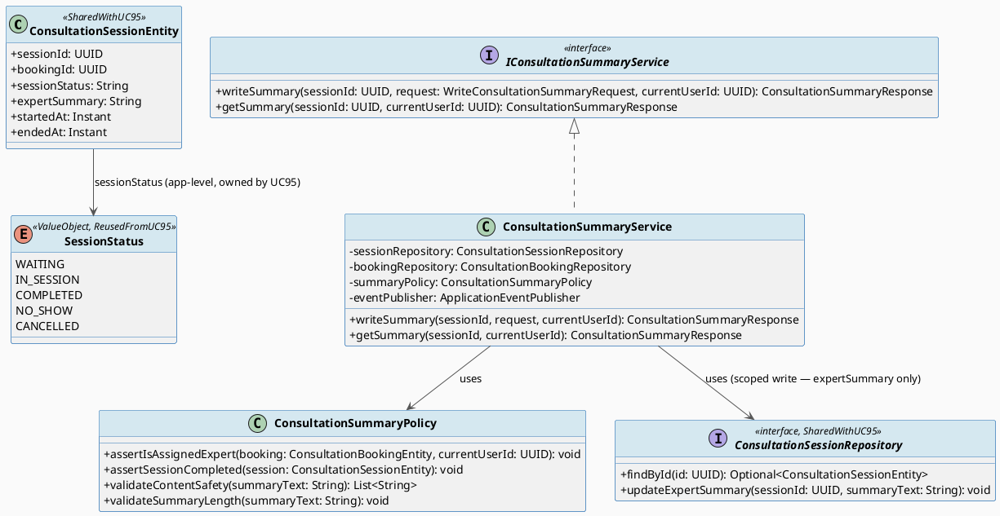
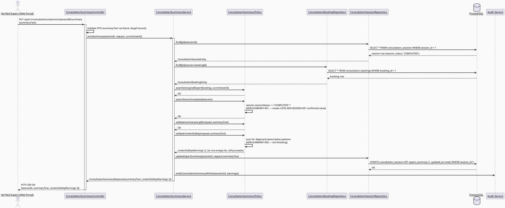
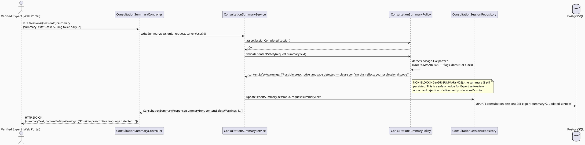
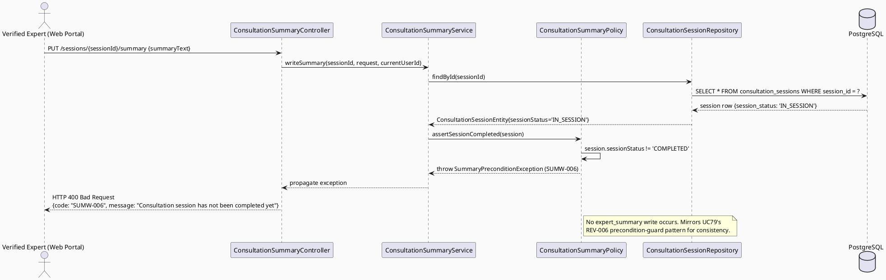
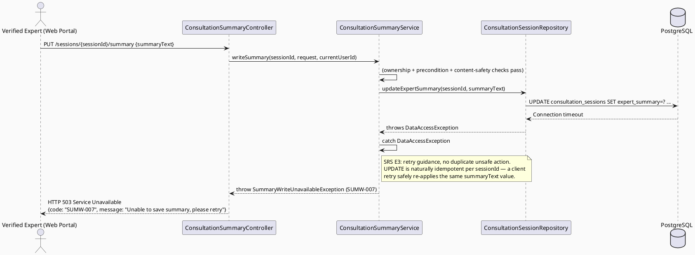

# ENGINEERING DOCUMENTATION STANDARD (EDS) v2.0
# UC96 — Write Consultation Summary — Technical Design Specification

| Field | Value |
|-------|-------|
| **Document ID** | `CB-CONSULTATION-IMP-096` |
| **Version** | `1.0` |
| **Date** | `2026-07-02` |
| **Status** | `Draft` |
| **Document Owner** | `TV4-Lâm` |
| **Author** | `AI Agent (Technical Architect)` |
| **Reviewed by** | `[Tech Lead — Pending]` |
| **DPO Sign-off** | `[ ] Pending` *(free-text summary content about a named Mother/health context — see §1)* |
| **Approved by** | `[Principal Architect — Pending]` |
| **Last Review** | `2026-07-02` |
| **Based on EDS** | `v2.0` |

---

## CHANGELOG

| Ngày | Người thực hiện | Nội dung thay đổi |
|------|-----------------|-------------------|
| 2026-07-02 | AI Agent — Technical Architect | Tạo tài liệu lần đầu (Draft) cho UC96 |

---

## MỤC LỤC

1. [Tổng quan Module](#1-tổng-quan-module)
2. [Ma trận Truy vết (Traceability Matrix)](#2-ma-trận-truy-vết-traceability-matrix)
3. [Architecture Decision Records (ADR)](#3-architecture-decision-records-adr)
4. [Non-Functional Requirements & SLA](#4-non-functional-requirements--sla)
5. [Static Modeling (Mô hình Tĩnh)](#5-static-modeling-mô-hình-tĩnh)
6. [Dynamic Modeling (Mô hình Động)](#6-dynamic-modeling-mô-hình-động)
7. [Domain Event Catalog](#7-domain-event-catalog)
8. [Interface Specification (Đặc tả Giao diện)](#8-interface-specification-đặc-tả-giao-diện)
9. [API Specification](#9-api-specification)
10. [Bảng mã lỗi (Error Codes)](#10-bảng-mã-lỗi-error-codes)
11. [Quy trình Triển khai (Step-by-Step)](#11-quy-trình-triển-khai-step-by-step)
12. [Rollback & Incident Runbook](#12-rollback--incident-runbook)
13. [Kịch bản Kiểm thử Chi tiết](#13-kịch-bản-kiểm-thử-chi-tiết)
14. [Phương pháp Xác minh](#14-phương-pháp-xác-minh)
15. [Mẫu thử thực tế (API Verification Samples)](#15-mẫu-thử-thực-tế-api-verification-samples)
16. [Bảng tổng hợp phân quyền (Authorization Matrix)](#16-bảng-tổng-hợp-phân-quyền-authorization-matrix)
17. [AI Prompt Constraints (CASE 2.0)](#17-ai-prompt-constraints-case-20)

---

## 1. Tổng quan Module

| Field | Value |
|-------|-------|
| **Module Name** | `Consultation — Post-Session Summary` |
| **Bounded Context** | `Consultation` (package `com.carebridge.backend.consultation`) |
| **Function ID / UC** | `3.2.1.10 Write Consultation Summary` / `UC-96` (SRS L943-962) |
| **Primary Actor** | Verified Expert |
| **Secondary Actor** | None |
| **Platform** | **Web (Expert Portal)** — React + TypeScript + Vite |
| **Priority** | High |
| **Sprint / Owner** | Sprint 4 "Real Providers And Admin Polish" — TV4-Lâm |
| **Data Classification** | `Sensitive-PII` (free-text summary referencing a named Mother's health-consultation context) |
| **Compliance Scope** | `PDPA (Luật 91/2025)`, internal `BR-RBAC`, `BR-CONSULTATION` |
| **Upstream Dependencies** | `UC-95 Manage Consultation Session` — a session must reach `session_status='COMPLETED'` before a summary may be written (ADR-SUMMARY-001, reusing UC95's ADR-SESSION-001 terminal value) |
| **Downstream Consumers** | Mother-facing consultation history view (out of scope mobile/web read UC), `UC-79 Review Expert After Consultation` (a written summary is not a precondition for review, but both share the same `session_status='COMPLETED'` gate) |

### 1.1 Scope Statement — Greenfield within an existing schema contract

Same greenfield posture as sibling consultation-domain TDS (UC78, UC79,
UC94, UC95): backend `com.carebridge.backend.consultation` package holds
only placeholder files; Web `src/features/consultationManagement/` is
placeholder-only. The schema already models the persistence target:
`consultation_sessions.expert_summary text` (nullable, schema L905). This
TDS designs UC96 as a **write to that existing column**, gated by the
session-completion precondition confirmed in UC95.

### 1.2 Entry-Criteria Blocker (Open — MUST be resolved before implementation)

> ⚠️ **UC96 CANNOT be implemented standalone.** It requires:
> - `UC-95 Manage Consultation Session` implemented — a session must be able
>   to reach `session_status='COMPLETED'` (ADR-SESSION-001, confirmed by this
>   batch, not Open) before a summary write is accepted
>
> This is a much narrower blocker than UC78/UC79's entry criteria, since the
> terminal-status ambiguity that blocked those TDS documents has now been
> resolved within this same batch (§1.3). **Marked `Open` only insofar as**
> UC-95 itself must be implemented (not merely specified) before UC96 can go
> live — not an unresolved design question.

### 1.3 Session-Completion Terminal Value — Reused from UC95 (No New Assumption)

`UC95_ManageConsultationSession_TDS.md` §ADR-SESSION-001 **confirms**
`consultation_sessions.session_status == 'COMPLETED'` as the definitive
terminal value. UC96 **reuses this value verbatim** — it does not introduce
a second, potentially conflicting assumption. This directly satisfies the
task requirement that UC95/UC96 share the same `session_status` terminal
value convention, and gives UC79 (sibling TDS, `ADR-REVIEW-001`, previously
`Proposed`) a second corroborating consumer of the same confirmed value.

### 1.4 CASE 2.0 Safety Boundary — "Safe Next Steps" Is Informational Only

CLAUDE.md: "AI provides guidance only; never diagnose, prescribe, or delay
emergency routing." SRS UC-96 description: "Writes the consultation summary
and **safe next steps** for the user to review." This TDS treats "safe next
steps" as **strictly informational, non-diagnostic, non-prescriptive
content** — see ADR-SUMMARY-002 and §17 (CASE 2.0 AI Prompt Constraints) for
the enforced boundary. This constraint applies regardless of whether the
Expert types the summary manually or an AI-assisted drafting aid is used in
a future iteration (none exists yet — this TDS's scope is the Expert's own
free-text entry, not an AI-generation feature).

---

## 2. Ma trận Truy vết (Traceability Matrix)

| Requirement ID | Loại (BR/ADR/US) | Mô tả yêu cầu | Thành phần Code | Compliance Target | ADR liên quan |
|----------------|------------------|---------------|-----------------|-------------------|---------------|
| UC-96 (SRS §3.2.1.10, L943-962) | Use Case | Writes consultation summary and safe next steps for user review | `ConsultationSummaryController`, `ConsultationSummaryService` | BR-CONSULTATION | ADR-SUMMARY-001 |
| BR-RBAC | Business Rule | Users may access only functions allowed by role/permission scope | `ConsultationSummaryPolicy.assertIsAssignedExpert()` | Authorization | ADR-SUMMARY-003 |
| BR-CONSULTATION | Business Rule | Booking/session actions keep auditable lifecycle state | `ConsultationSessionEntity.expertSummary`, audit log emission | PDPA / BR-AUDIT | ADR-SUMMARY-001 |
| CLAUDE.md — "AI provides guidance only; never diagnose, prescribe, or delay emergency routing" | Project Rule | Summary content must avoid diagnostic/prescriptive language | `ConsultationSummaryPolicy.validateContentSafety()` | BR-SAFETY | ADR-SUMMARY-002 |
| UC-95 `ADR-SESSION-001` (reused, §1.3) | Cross-Document | Confirms terminal `session_status='COMPLETED'` value gating summary eligibility | `ConsultationSummaryPolicy.assertSessionCompleted()` | BR-CONSULTATION | ADR-SUMMARY-001 |
| Schema: `consultation_sessions.expert_summary` (`V1__init_schema.sql` L898-909) | Schema Contract | Summary persistence target | `ConsultationSessionEntity.expertSummary` | — | — |
| Entry-Criteria Blocker (§1.2) | Open Item | UC-95 must be implemented (not merely specified) first | N/A — blocking dependency | — | — |

---

## 3. Architecture Decision Records (ADR)

### ADR-SUMMARY-001 — Summary may only be written once the linked session reaches the confirmed terminal completed state

| Field | Value |
|-------|-------|
| **Status** | `Accepted` *(reuses UC95's already-confirmed `'COMPLETED'` value — no new terminal-value ambiguity introduced)* |
| **Deciders** | `AI Agent (proposal) — pending TV4-Lâm / Tech Lead confirmation` |
| **Date** | `2026-07-02` |

#### Bối cảnh (Context)
SRS UC-96 description: "Writes the consultation summary ... for the user to
review" — implying the consultation has concluded. `consultation_sessions
.expert_summary text` is nullable, with no application-level guard in the
schema itself preventing a write while the session is still `WAITING` or
`IN_SESSION`. Without a precondition check, an Expert could write a
"summary" of a consultation that never actually happened or is still
ongoing.

#### Các phương án đã xem xét (Options Considered)

| Phương án | Mô tả | Ưu điểm | Nhược điểm |
|-----------|-------|----------|------------|
| A | Allow writing the summary at any time regardless of `session_status` | Simple; flexible for the Expert to draft notes early | Directly contradicts SRS wording ("for the user to review" implies the interaction is complete); risks a summary being published before the session actually happened |
| B | **Require `consultation_sessions.session_status == 'COMPLETED'`** (the value UC95 §ADR-SESSION-001 confirms as definitive) before allowing a summary write | Matches SRS intent; reuses an already-confirmed value with zero new ambiguity; consistent with UC79's identical precondition style | The Expert cannot draft/save a partial summary before the session formally ends — acceptable trade-off, no draft-saving requirement exists in SRS |
| C | Allow drafting during `IN_SESSION` but only allow final submission after `COMPLETED` | Better Expert UX (can type notes live) | Introduces a two-phase draft/submit workflow not requested by SRS or any BR; adds scope not justified by current requirements — rejected as over-engineering for this batch |

#### Quyết định (Decision)
Chọn **Phương án B**. `ConsultationSummaryPolicy.assertSessionCompleted(session)`
must verify `session.sessionStatus == 'COMPLETED'` before accepting a
summary write. This is the **exact same terminal value** UC95 confirms and
UC79 consumes — no reconciliation gap exists between the three documents in
this batch.

#### Hệ quả (Consequences)

**Tích cực:** Directly encodes the SRS precondition; prevents a summary being written for a session that never completed; zero cross-document ambiguity (all three sibling TDS in this batch agree on `'COMPLETED'`).
**Tiêu cực / Trade-offs:** No draft-saving capability — acceptable given no SRS/BR source requests it.
**Compliance Impact:** Supports BR-CONSULTATION auditable-lifecycle requirement.

---

### ADR-SUMMARY-002 — Content safety constraint: summary and "safe next steps" must be informational only, never diagnostic or prescriptive

| Field | Value |
|-------|-------|
| **Status** | `Accepted` |
| **Deciders** | `AI Agent — derived directly from CLAUDE.md mandate` |
| **Date** | `2026-07-02` |

#### Bối cảnh (Context)
CLAUDE.md, Delivery Rules: "For health, location, payment, expert,
moderation, and safety workflows: enforce existing RBAC, consent
scope/expiry, and audit requirements. AI provides guidance only; never
diagnose, prescribe, or delay emergency routing." Although UC96's summary is
Expert-authored (a licensed human, not an AI system), the **platform** still
carries safety obligations: a written "diagnosis" or "prescription" inside a
CareBridge-hosted summary creates liability and safety risk (e.g., delaying
a Mother from seeking in-person emergency care because a text summary
implied a diagnosis was already made). The SRS itself scopes the field as
"**safe** next steps," which this TDS interprets as a content-safety
requirement, not merely a field label.

#### Các phương án đã xem xét (Options Considered)

| Phương án | Mô tả | Ưu điểm | Nhược điểm |
|-----------|-------|----------|------------|
| A | No content validation — trust the Verified Expert entirely | Simple; respects Expert's professional judgment | Provides no platform-level safety net against accidental diagnostic/prescriptive phrasing that could mislead a Mother into delaying emergency care; contradicts CLAUDE.md's explicit mandate |
| B | **Soft content-safety check: a configurable keyword/pattern-based `validateContentSafety()` check flags likely diagnostic/prescriptive language (e.g., explicit drug-dosage patterns, "you have X condition" phrasing) as a non-blocking WARNING surfaced to the Expert before submission — never silently rejects a licensed Expert's professional note, since only the Expert (not this platform) is qualified to write clinical content within their own licensed scope** | Balances platform safety-nudge obligation with respecting Expert's professional autonomy; does not silently block legitimate clinical language a Verified Expert is licensed to provide, while still nudging away from overtly prescriptive high-risk phrasing (e.g., specific drug dosages) that the platform itself should not host without stronger clinical governance | A keyword-based check has false positives/negatives — flagged as Open, not a hard technical block, precisely because full clinical-language validation is out of scope for this TDS |
| C | Hard block: reject submission entirely if any diagnostic/prescriptive keyword pattern is detected | Strongest technical enforcement | Would block a Verified Expert's legitimate professional judgment expressed in normal clinical language; SRS does not request outright rejection, only "safe next steps" framing; risk of over-blocking a licensed professional's appropriate note |

#### Quyết định (Decision)
Chọn **Phương án B** — **non-blocking safety nudge**, not a hard reject.
`ConsultationSummaryPolicy.validateContentSafety(summaryText)` runs a
configurable pattern check (Open — exact keyword/regex list is a Product/DPO
policy decision, not invented here) and returns a `contentSafetyWarnings:
List<String>` field surfaced in the response for Expert self-review **before
final submission is accepted** (client displays a confirmation step — Web UI
concern, §5.1). **This is explicitly NOT an AI-generated summary feature —
UC96's scope is the Expert's own manually-typed text.** If a future iteration
adds AI-assisted drafting, THAT feature would need its own TDS with hard
CASE 2.0 output-filtering, distinct from this soft nudge (see §17.4
AP-CB-301 for the anti-pattern this ADR explicitly guards against: an AI
implementation must not read this ADR as license to auto-generate clinical
content).

**Marked Open:** the exact keyword/pattern list for
`validateContentSafety()` requires Product/DPO/clinical-advisor input — this
TDS defines the mechanism (non-blocking warning) but not the exact pattern
set.

#### Hệ quả (Consequences)

**Tích cực:** Satisfies CLAUDE.md's safety mandate with a proportionate, non-overreaching mechanism; respects Verified Expert's professional autonomy; creates an audit trail of safety nudges shown (useful for future policy tuning).
**Tiêu cực / Trade-offs:** Keyword-based detection is imperfect (false positive/negative risk) — acceptable given it is advisory, not blocking; exact pattern list is Open pending Product/DPO/clinical input.
**Compliance Impact:** Directly implements CLAUDE.md's "never diagnose, prescribe" mandate as a platform-level safety nudge, without overstepping into practicing-medicine-adjacent enforcement the platform itself is not qualified to make.

---

### ADR-SUMMARY-003 — Ownership: only the session's assigned, verified Expert may write its summary

| Field | Value |
|-------|-------|
| **Status** | `Accepted` |
| **Deciders** | `AI Agent — derived directly from schema + BR-RBAC, consistent with UC95 ADR-SESSION-002` |
| **Date** | `2026-07-02` |

#### Bối cảnh (Context)
Identical ownership shape as UC94/UC95: `consultation_bookings
.expert_profile_id` identifies the assigned Expert for the booking linked to
the session via `consultation_sessions.booking_id`.

#### Các phương án đã xem xét (Options Considered)

| Phương án | Mô tả | Ưu điểm | Nhược điểm |
|-----------|-------|----------|------------|
| A | Any authenticated Expert can write a summary for any session | Simple | Severely violates BR-RBAC; allows fabricated summaries unrelated to the actual consultation |
| B | **Only the Expert whose `user_id` matches `expert_profiles.user_id` for the booking's `expert_profile_id`, AND whose `verification_status == 'VERIFIED'`, may write the summary** (identical rule shape to UC94 ADR-SUMMARY-ACCESS-002 / UC95 ADR-SESSION-002) | Matches schema FK semantics; consistent authorization pattern across the whole UC94/95/96 batch | Requires a policy check per request (negligible cost) |

#### Quyết định (Decision)
Chọn **Phương án B**, reusing the exact same check shape as UC94/UC95:
`ConsultationSummaryPolicy.assertIsAssignedExpert(booking, currentUserId)`.
Non-assigned or unverified experts receive `403 Forbidden` (`SUMW-004`).

#### Hệ quả (Consequences)

**Tích cực:** Prevents IDOR / fabricated summaries; consistent authorization pattern across UC94/95/96.
**Tiêu cực / Trade-offs:** None material.
**Compliance Impact:** Satisfies BR-RBAC.

---

## 4. Non-Functional Requirements & SLA

> No SRS/BR source specifies numeric SLA targets for UC96. Values below are
> **Open — proposed defaults**, must be confirmed by Tech Lead.

### 4.1. Performance & Availability

| Category | Requirement | Target SLA | Measurement Method | Compliance Basis |
|----------|-------------|------------|---------------------|------------------|
| Latency | `PUT /sessions/{id}/summary` p99 | `< 400ms` *(Open — proposed)* | Manual/API test timing | — |
| Availability | Dependent on session service (§1.2 blocker) | N/A until UC-95 implemented | — | — |

### 4.2. Data Integrity & Retention

| Category | Requirement | Target | Verification Method | Compliance Basis |
|----------|-------------|--------|---------------------|------------------|
| Durability | No summary record loss | RPO = 0 | Transaction log | BR-CONSULTATION |
| Retention | Summary edit history (append-only audit; overwrite-in-place with audit trail of prior versions — see §5.3 gap note) | Indefinite | DB inspection | PDPA |
| Consistency | Summary write only accepted for `session_status='COMPLETED'` | 100% (service-level enforcement) | Reconciliation query | ADR-SUMMARY-001 |

### 4.3. Security

| Category | Requirement | Target | Verification Method | Compliance Basis |
|----------|-------------|--------|---------------------|------------------|
| Access control | Role-based, ownership-scoped | Least privilege (assigned Expert only) | Auth Matrix (§16) | BR-RBAC |
| Content safety | Non-blocking diagnostic/prescriptive language nudge | Warning surfaced pre-submission (ADR-SUMMARY-002) | Policy code review + TC | BR-SAFETY |

### 4.4. Scalability & Capacity Planning

SRS marks UC96 "Frequency of Use: Regular." Write volume tracks completed
session volume; no special scaling design beyond standard Spring Boot
request handling required at current expected scale.

---

## 5. Static Modeling (Mô hình Tĩnh)

### 5.1. Component Responsibilities & Planned File Paths

| Layer | File Path | Responsibility |
|-------|-----------|----------------|
| Controller | `src/main/java/com/carebridge/backend/consultation/controller/ConsultationSummaryController.java` | HTTP mapping, DTO validation only |
| Service | `src/main/java/com/carebridge/backend/consultation/service/ConsultationSummaryService.java` | Summary write workflow, precondition + ownership + content-safety checks, event emission |
| Repository | `src/main/java/com/carebridge/backend/consultation/repository/ConsultationSessionRepository.java` | **Shared with UC95** — this module writes only the `expertSummary` field via a scoped `@Modifying` update, never other session-lifecycle fields |
| Repository | `src/main/java/com/carebridge/backend/consultation/repository/ConsultationBookingRepository.java` | Read-only lookups for ownership check (shared with UC78/UC79/UC94/UC95, interface only) |
| DTO | `src/main/java/com/carebridge/backend/consultation/dto/request/WriteConsultationSummaryRequest.java` | Inbound payload |
| DTO | `src/main/java/com/carebridge/backend/consultation/dto/response/ConsultationSummaryResponse.java` | Outbound payload — includes `contentSafetyWarnings` |
| Mapper | `src/main/java/com/carebridge/backend/consultation/mapper/ConsultationSummaryMapper.java` | Entity ↔ DTO, never expose entity |
| Policy | `src/main/java/com/carebridge/backend/consultation/policy/ConsultationSummaryPolicy.java` | Ownership check (ADR-SUMMARY-003), session-completion precondition (ADR-SUMMARY-001), content-safety nudge (ADR-SUMMARY-002) |
| Web Model | `05_Development/CareBridgeWebApp/src/features/consultationManagement/models/consultationSummary.ts` | Request/response DTO mirror (Zod schema) |
| Web Service | `05_Development/CareBridgeWebApp/src/features/consultationManagement/services/consultationSummaryApi.ts` | API client (TanStack Query mutation hook) |
| Web Page | `05_Development/CareBridgeWebApp/src/features/consultationManagement/pages/WriteSummaryPage.tsx` | Expert-facing summary composition UI, shown after `SessionRoomPage.tsx` (UC95) reaches `COMPLETED` |
| Web Component | `05_Development/CareBridgeWebApp/src/features/consultationManagement/components/ContentSafetyWarningBanner.tsx` | Displays non-blocking safety nudge before final submit (ADR-SUMMARY-002) |

### 5.2. Class Diagram (PlantUML)



### 5.3. Data Structure — Schema/Migration Details

> **CareBridge rule:** `V1__init_schema.sql` and approved Flyway migrations
> are primary source of truth. ERD is supporting context only.

**No new migration is required for the core summary-write flow.** The
persistence target already exists (`V1__init_schema.sql`, verified):

```sql
-- consultation_sessions.expert_summary (V1__init_schema.sql L898-909, shared with UC95)
CREATE TABLE public.consultation_sessions (
    session_id             uuid         NOT NULL DEFAULT gen_random_uuid(),
    booking_id              uuid         NOT NULL,
    communication_room_id   varchar(255),
    started_at              timestamptz,
    ended_at                 timestamptz,
    session_status          varchar(30)  NOT NULL DEFAULT 'WAITING',
    expert_summary          text,          -- UC96 write target (nullable, no length constraint in DB)
    technical_log_json      jsonb,
    created_at               timestamptz  NOT NULL DEFAULT now(),
    updated_at               timestamptz  NOT NULL DEFAULT now()
);
-- PK: session_id (L1425-1426); FK: booking_id -> consultation_bookings (L1838-1839)
```

**Genuine gap identified (Open — flag for confirmation, non-blocking for
baseline scope):**
1. `expert_summary` is a single `text` column with **no version history** —
   a re-submission overwrites the previous value with no audit trail of what
   changed. This TDS proposes (non-blocking, Open) that the
   `ConsultationSummaryWritten` event payload (§7.3) itself serves as the
   append-only audit trail (event log preserves every write, even though the
   column itself is overwrite-in-place) — **no new migration proposed**,
   since the existing `audit_logs`-style event-sourcing pattern used
   elsewhere in this codebase already satisfies the durability requirement
   without a dedicated summary-history table. Flagged Open for Tech Lead
   confirmation that event-log-as-audit-trail is sufficient, versus adding a
   dedicated `consultation_summary_revisions` table (out of scope unless
   requested).
2. No `CHECK` constraint or DB-level length limit on `expert_summary` —
   application-level validation required (`ConsultationSummaryPolicy
   .validateSummaryLength()`), consistent with the no-CHECK-constraint
   convention already established on every other consultation-domain
   free-text column in this schema.

No sync action needed for `V1__init_schema.sql`.

---

## 6. Dynamic Modeling (Mô hình Động)

### 6.1. Sequence Diagram — Happy Path: Expert Writes Summary After Completed Session (PlantUML)



### 6.2. Sequence Diagram — Alternative: Content Safety Warning Surfaced (Non-Blocking) (PlantUML)



### 6.3. Sequence Diagram — Error: Session Not Yet Completed → Rejected (PlantUML)



### 6.4. Sequence Diagram — Timeout: Database Write Failure During Persist (PlantUML)



### 6.5. State Notes — No Dedicated State Machine (Reuses UC95's Session State Machine)

UC96 does not own a state machine of its own — it **reads** the
`session_status` state machine owned and confirmed by UC95
(`UC95_ManageConsultationSession_TDS.md` §6.4) and treats `'COMPLETED'` as a
hard precondition gate for a single write operation
(`expert_summary`). No new invariant is introduced beyond that gate.

**⚠️ Invariant bất biến:**
1. A summary write is accepted **only if** `session_status == 'COMPLETED'`
   (ADR-SUMMARY-001) — never write while `WAITING`/`IN_SESSION`/`NO_SHOW`/
   `CANCELLED`.
2. Only the session's assigned, verified Expert may write its summary
   (ADR-SUMMARY-003).
3. Content-safety warnings are **advisory only** — they never block
   persistence (ADR-SUMMARY-002); this module never auto-generates or
   auto-corrects summary text.
4. `ConsultationSummaryService` writes **only** the `expert_summary` column
   via a scoped repository method — it must never mutate `session_status`,
   `started_at`, or `ended_at` (those remain exclusively owned by UC95's
   `ConsultationSessionService`).

---

## 7. Domain Event Catalog

### 7.1. Events Published (Phát ra)

| Event Name | Trigger | Publisher | Subscriber(s) | Payload Schema | Async? |
|------------|---------|-----------|---------------|----------------|--------|
| `ConsultationSummaryWritten` | Expert successfully writes/updates a session's summary | `ConsultationSummaryService` | Mother-facing notification (out of scope consumer), Audit log, event-log-as-history (§5.3 gap note 1) | `ConsultationSummaryWritten.java` | Yes |

### 7.2. Events Consumed (Tiêu thụ)

| Event Name | Source | Handler | Action thực hiện |
|------------|--------|---------|------------------|
| `ConsultationSessionStatusChanged` (payload.newStatus = `'COMPLETED'`) | `ConsultationSessionService` (UC95) | *(Not actively consumed for a workflow action in UC96's baseline scope — UC96 re-reads `session_status` synchronously at write time rather than reacting to this event. Listed here only to document the cross-module data dependency, per §7.2 template convention.)* | N/A — informational dependency only |

### 7.3. Payload Schema

```java
// ConsultationSummaryWritten.java
public record ConsultationSummaryWritten(
    UUID    eventId,
    String  eventType,       // "ConsultationSummaryWritten"
    Instant occurredAt,
    String  version,         // "1.0"
    Payload payload,
    Metadata metadata
) implements ApplicationEvent {

    public record Payload(
        UUID         sessionId,
        UUID         bookingId,
        UUID         writtenByUserId,        // the Expert's user_id
        String       summaryText,            // full text, for audit/history purposes (§5.3 gap note 1)
        List<String> contentSafetyWarnings   // may be empty
    ) {}

    public record Metadata(
        UUID   correlationId,
        String causedBy          // userId
    ) {}
}
```

---

## 8. Interface Specification (Đặc tả Giao diện)

### 8.1. Service Interface

```java
// WriteConsultationSummaryRequest.java — Input DTO
// @version 1.0
public class WriteConsultationSummaryRequest {
    @NotBlank
    @Size(max = 5000)
    private String summaryText;     // Schema: consultation_sessions.expert_summary text (nullable, no DB length limit — app-level bound per §5.3 gap note 2)
    // getters / setters / @Valid annotations
}

// ConsultationSummaryResponse.java — Output DTO
public class ConsultationSummaryResponse {
    private UUID sessionId;
    private UUID bookingId;
    private String summaryText;
    private List<String> contentSafetyWarnings; // ADR-SUMMARY-002 — advisory only, may be empty
    private Instant updatedAt;
    // getters / setters — NEVER expose ConsultationSessionEntity directly
}

// IConsultationSummaryService.java — Service Contract
// @version 1.0
public interface IConsultationSummaryService {
    /**
     * Writes (creates or overwrites) the summary for a session owned by the
     * current Expert, only if the session has reached session_status='COMPLETED'.
     * @throws SummaryAuthorizationException (SUMW-004) if currentUserId is not the session's assigned, verified Expert
     * @throws SummaryPreconditionException (SUMW-006) if the session is not yet COMPLETED
     * @throws SummaryValidationException (SUMW-001) if summaryText is blank/too long
     * @throws SessionNotFoundException (SUMW-003) if sessionId does not exist
     * @throws SummaryWriteUnavailableException (SUMW-007) on downstream write failure/timeout
     */
    ConsultationSummaryResponse writeSummary(UUID sessionId, WriteConsultationSummaryRequest request, UUID currentUserId);

    /**
     * Retrieves the current summary for a session — the assigned Expert or
     * the booking's requester (Mother, read-only) or an admin may view it.
     * @throws SummaryAuthorizationException (SUMW-004) if unauthorized
     * @throws SessionNotFoundException (SUMW-003) if not found
     */
    ConsultationSummaryResponse getSummary(UUID sessionId, UUID currentUserId);
}
```

### 8.2. Repository Interface

```java
// ConsultationSessionRepository.java (shared with UC95 — this module adds a scoped write method)
// @version 1.0
public interface ConsultationSessionRepository extends JpaRepository<ConsultationSessionEntity, UUID> {

    Optional<ConsultationSessionEntity> findById(UUID sessionId);

    @Modifying
    @Query("UPDATE ConsultationSessionEntity s SET s.expertSummary = :summaryText, s.updatedAt = CURRENT_TIMESTAMP WHERE s.sessionId = :sessionId")
    void updateExpertSummary(UUID sessionId, String summaryText);

    // Scoped write: ONLY expertSummary + updatedAt. Never touches sessionStatus,
    // startedAt, endedAt — those remain exclusively owned by UC95's write paths.
}
```

---

## 9. API Specification

### 9.1. Endpoints Table

| Method | Path | Auth Level | Required Roles | Rate Limit | Idempotent? |
|--------|------|------------|----------------|------------|-------------|
| `PUT` | `/api/v1/consultations/sessions/{sessionId}/summary` | JWT Bearer | `EXPERT` (assigned, verified only) | 20/min | Yes (overwrite semantics — repeat calls with same body are safe) |
| `GET` | `/api/v1/consultations/sessions/{sessionId}/summary` | JWT Bearer | `EXPERT` (assigned), `MOTHER` (booking owner, read-only), `SYSTEM_ADMIN` | 300/min | Yes |

### 9.2. Request / Response Schemas

#### `PUT /api/v1/consultations/sessions/{sessionId}/summary` — Write consultation summary

**Request Body:**
```json
{
  "summaryText": "We discussed second-trimester nutrition and mild fatigue. Recommended next steps: continue prenatal vitamins, monitor fatigue over the next week, and schedule a routine check-up with your obstetrician if fatigue worsens."
}
```

**Response — 200 OK (Happy Path):**
```json
{
  "sessionId": "9f8e7d6c-1234-4a5b-8c9d-0e1f2a3b4c5d",
  "bookingId": "3fa85f64-5717-4562-b3fc-2c963f66afa6",
  "summaryText": "We discussed second-trimester nutrition and mild fatigue. Recommended next steps: continue prenatal vitamins, monitor fatigue over the next week, and schedule a routine check-up with your obstetrician if fatigue worsens.",
  "contentSafetyWarnings": [],
  "updatedAt": "2026-07-02T10:35:00.000Z"
}
```

**Response — 400 Bad Request (Session Not Completed):**
```json
{
  "error": {
    "code": "SUMW-006",
    "message": "Consultation session has not been completed yet"
  }
}
```

**Response — 403 Forbidden (Not assigned Expert):**
```json
{
  "error": {
    "code": "SUMW-004",
    "message": "You are not authorized to write a summary for this session"
  }
}
```

**Response — 200 OK (With Non-Blocking Content Safety Warning):**
```json
{
  "sessionId": "9f8e7d6c-1234-4a5b-8c9d-0e1f2a3b4c5d",
  "bookingId": "3fa85f64-5717-4562-b3fc-2c963f66afa6",
  "summaryText": "...take 500mg twice daily...",
  "contentSafetyWarnings": [
    "Possible prescriptive language detected — please confirm this reflects your professional scope"
  ],
  "updatedAt": "2026-07-02T10:35:00.000Z"
}
```

---

## 10. Bảng mã lỗi (Error Codes)

| Code | HTTP Status | Message (EN) | Message (VI) | Trigger Condition |
|------|-------------|--------------|--------------|-------------------|
| `SUMW-001` | 400 | Validation failed | Dữ liệu không hợp lệ | `summaryText` blank or exceeds 5000 chars |
| `SUMW-003` | 404 | Session not found | Không tìm thấy phiên tư vấn | `sessionId` does not exist |
| `SUMW-004` | 403 | Insufficient permissions | Không đủ quyền | Current user is not the session's assigned, verified Expert (or not the booking owner/admin for `GET`) |
| `SUMW-006` | 400 | Consultation session has not been completed yet | Phiên tư vấn chưa hoàn thành | `consultation_sessions.session_status != 'COMPLETED'` (ADR-SUMMARY-001) |
| `SUMW-007` | 503 | Unable to save summary, please retry | Không thể lưu tóm tắt, vui lòng thử lại | Downstream DB write failure/timeout (§6.4) |
| `SUMW-500` | 500 | Internal error | Lỗi hệ thống | Unexpected failure |

---

## 11. Quy trình Triển khai (Step-by-Step)

### 11.1. Prerequisites

- [ ] **BLOCKING:** UC-95 (`Manage Consultation Session`) implemented — sessions must be able to reach `session_status='COMPLETED'`
- [ ] ADR-SUMMARY-001, ADR-SUMMARY-002 confirmed by Product/Tech Lead (currently `Accepted` by this TDS — pending sign-off; ADR-SUMMARY-002's exact keyword pattern list is Open pending Product/DPO/clinical input)
- [ ] DPO review for `expert_summary` content (free-text about a named Mother's health-consultation context) — sign-off pending
- [ ] Principal Architect approves this TDS

### 11.2. Pre-Migration Checklist

- [ ] **N/A for core flow** — no new migration required (see §5.3)

### 11.3. Implementation Steps

#### Chặng 1 — Repository extension
Add the scoped `updateExpertSummary()` method to the **existing**
`ConsultationSessionRepository` (owned/created by UC95) — do not duplicate
the entity or repository interface.

#### Chặng 2 — Policy + Service
Implement `ConsultationSummaryPolicy` (ownership §ADR-SUMMARY-003,
session-completion precondition §ADR-SUMMARY-001, content-safety nudge
§ADR-SUMMARY-002), `ConsultationSummaryService` (write workflow).

#### Chặng 3 — Controller + Web
Wire `ConsultationSummaryController`, then Web `consultationSummaryApi.ts`
(TanStack Query mutation hook) + `WriteSummaryPage.tsx` +
`ContentSafetyWarningBanner.tsx` (Expert Portal, shown after
`SessionRoomPage.tsx` from UC95 reaches `COMPLETED`).

#### Chặng 4 — Verification sau deploy

```bash
curl -X GET https://[host]/api/v1/health
# Expected: {"status": "ok"}
```

### 11.4. Deployment Checklist

- [ ] `./mvnw test` green
- [ ] `npm run test:run` green (Web)
- [ ] Error rate < 1% in first 10 minutes
- [ ] Audit log emits `ConsultationSummaryWritten` in correct format
- [ ] Verify write is rejected for any non-`COMPLETED` session_status
- [ ] Verify content-safety warnings are advisory only (write still succeeds when warnings present)
- [ ] No PII/health-context content leaked in application logs

---

## 12. Rollback & Incident Runbook

### 12.1. Điều kiện kích hoạt Rollback

| Điều kiện | Ngưỡng | Người quyết định |
|-----------|--------|------------------|
| Error rate tăng đột biến | > 5% trong 5 phút | On-call Engineer |
| Summary written before session completion (precondition bypass) detected | Any single occurrence | Tech Lead (data-integrity incident) |
| Non-assigned Expert able to write a summary | Any single occurrence | Tech Lead (security incident) |
| `ConsultationSummaryService` observed mutating `session_status` | Any single occurrence | Tech Lead (architecture-boundary violation) |

### 12.2. Rollback Procedure

```bash
# No new migration in baseline scope — code-only rollback:
git checkout -- 05_Development/CareBridgeAPI/src/main/java/com/carebridge/backend/consultation/
git checkout -- 05_Development/CareBridgeWebApp/src/features/consultationManagement/
kubectl rollout undo deployment/carebridge-api
```

### 12.3. Notification Protocol

| Thời điểm | Người nhận | Kênh | Template |
|-----------|------------|------|----------|
| Ngay khi phát hiện precondition bypass | On-call + Tech Lead | Slack `#incident` | "🚨 Summary written before session completion for session [id]" |

### 12.4. Post-Incident Review (PIR)

Standard PIR within 48h for any data-integrity or authorization incident.

---

## 13. Kịch bản Kiểm thử Chi tiết

> Detailed test cases live in `UC96_WriteConsultationSummary_Test-Spec.md`.

| Condition Ref | Summary |
|----------------|---------|
| TC-COND-001 | Happy path — assigned Expert writes summary after session COMPLETED |
| TC-COND-002 | Ownership violation — non-assigned Expert attempts write → 403 (`SUMW-004`) |
| TC-COND-003 | Session not COMPLETED (e.g., IN_SESSION) → 400 (`SUMW-006`) |
| TC-COND-004 | Blank/oversized `summaryText` → 400 (`SUMW-001`) |
| TC-COND-005 | Content with dosage-like pattern → 200 OK with non-empty `contentSafetyWarnings` (non-blocking) |
| TC-COND-006 | Content with normal informational language → 200 OK with empty `contentSafetyWarnings` |
| TC-COND-007 | Re-submission overwrites previous `expertSummary` (idempotent PUT semantics) |
| TC-COND-008 | Session not found → 404 (`SUMW-003`) |
| TC-COND-009 | `ConsultationSummaryWritten` event emitted on every successful write |
| TC-COND-010 | Service never mutates `session_status`/`started_at`/`ended_at` (architecture-boundary guard) |
| TC-COND-011 | Mother (booking owner) can read the summary via `GET`, cannot write via `PUT` |

---

## 14. Phương pháp Xác minh

### 14.1. Database Inspection

```sql
SELECT session_id, session_status, expert_summary, updated_at
FROM consultation_sessions
WHERE session_id = '[uuid]';

-- Verify no summary was ever written for a non-COMPLETED session at write time
-- (cross-reference audit log ConsultationSummaryWritten.occurredAt against
--  ConsultationSessionStatusChanged history for the same sessionId)
```

### 14.2. Log / Audit Verification

```bash
kubectl logs -l app=carebridge-api | grep '"eventType":"ConsultationSummaryWritten"' | head -5
```

---

## 15. Mẫu thử thực tế (API Verification Samples)

### 15.1. Happy Path

```bash
curl -X PUT https://[host]/api/v1/consultations/sessions/{sessionId}/summary \
  -H "Authorization: Bearer [JWT_TOKEN — expert@carebridge.dev]" \
  -H "Content-Type: application/json" \
  -d '{
    "summaryText": "We discussed second-trimester nutrition and mild fatigue. Recommended next steps: continue prenatal vitamins, monitor fatigue over the next week."
  }'
```

**Expected Response (200):** see §9.2.

### 15.2. Error Paths

```bash
# Session not completed → 400
curl -X PUT https://[host]/api/v1/consultations/sessions/{inProgressSessionId}/summary \
  -H "Authorization: Bearer [JWT_TOKEN]" \
  -H "Content-Type: application/json" \
  -d '{"summaryText": "test"}'
```

**Expected Response (400):** see `SUMW-006` in §10.

---

## 16. Bảng tổng hợp phân quyền (Authorization Matrix)

| Endpoint | `GUEST` | `MOTHER` (booking owner) | `EXPERT` (non-assigned) | `EXPERT` (assigned, verified) | `SYSTEM_ADMIN` |
|----------|---------|----------------------------|--------------------------|-------------------------------|-----------------|
| `PUT /sessions/{id}/summary` | ❌ | ❌ (`SUMW-004`) | ❌ (`SUMW-004`) | ✅ | ❌ *(admin does not author clinical summaries — out of scope)* |
| `GET /sessions/{id}/summary` | ❌ | ✅ Own (read-only) | ❌ (`SUMW-004`) | ✅ Own | ✅ All |

**Chú thích:**
- ✅ = Được phép; ❌ = Bị từ chối (403); `Own` = chỉ với session của booking liên quan đến chính mình.

---

## 17. AI Prompt Constraints (CASE 2.0)

### 17.1 Constraint Summary Table

| # | Constraint | Source (ADR/BR) | Last Verified |
|---|-----------|-----------------|---------------|
| C1 | A summary write MUST NOT be accepted unless `session_status == 'COMPLETED'` (the exact value confirmed by UC95 ADR-SESSION-001) — reuse that value verbatim, never invent a second terminal-value string | `ADR-SUMMARY-001` | `2026-07-02` |
| C2 | Only the session's assigned, verified Expert (`expert_profiles.user_id == currentUserId`, `verification_status='VERIFIED'`) may write the summary | `ADR-SUMMARY-003` / `BR-RBAC` | `2026-07-02` |
| C3 | Content-safety checks are ADVISORY ONLY — never block persistence on a detected diagnostic/prescriptive pattern; surface `contentSafetyWarnings` and still save | `ADR-SUMMARY-002` | `2026-07-02` |
| C4 | This module MUST NOT auto-generate, auto-complete, or AI-rewrite summary text — UC96's scope is the Expert's own manually-typed content only; no diagnostic or prescriptive language may be added by the platform itself | `CLAUDE.md` / `ADR-SUMMARY-002` | `2026-07-02` |
| C5 | `ConsultationSummaryService` writes ONLY the `expert_summary` (+ `updated_at`) column — never `session_status`, `started_at`, `ended_at` (those are UC95's exclusive write scope) | `§6.5 invariant 4` | `2026-07-02` |
| C6 | Use `com.carebridge.backend.consultation` package layout exactly per `CLAUDE.md`; never expose `ConsultationSessionEntity` directly in API responses | `CLAUDE.md` | `2026-07-02` |

### 17.2 Constraint Injection Block (Copy-Paste vào AI Prompt)

```
[CONSTRAINT BLOCK — Module: Consultation Summary Writing (UC96)]
Theo TDS CB-CONSULTATION-IMP-096 và các ADR liên quan:

1. (C1) Chỉ chấp nhận ghi summary khi session_status == 'COMPLETED' (giá trị
   đã được UC95 ADR-SESSION-001 xác nhận) — dùng CHÍNH XÁC giá trị này,
   KHÔNG tạo giá trị terminal thứ hai.
2. (C2) CHỈ Expert được gán, đã VERIFIED của session đó mới được ghi summary.
3. (C3) Kiểm tra content-safety CHỈ mang tính CẢNH BÁO — KHÔNG BAO GIỜ chặn
   việc lưu dữ liệu khi phát hiện ngôn ngữ chẩn đoán/kê đơn; hiển thị
   contentSafetyWarnings và vẫn lưu.
4. (C4) Module này KHÔNG được tự động sinh, tự hoàn thiện, hoặc AI-viết lại
   nội dung summary — phạm vi UC96 CHỈ là nội dung Expert tự gõ; nền tảng
   KHÔNG được tự thêm ngôn ngữ chẩn đoán hoặc kê đơn.
5. (C5) ConsultationSummaryService CHỈ ghi cột expert_summary (+ updated_at)
   — KHÔNG BAO GIỜ ghi session_status, started_at, ended_at (thuộc phạm vi
   độc quyền của UC95).
6. (C6) Dùng đúng cấu trúc package com.carebridge.backend.consultation;
   KHÔNG bao giờ trả JPA entity trực tiếp trong API response.

[CONTEXT BLOCK]
- Bounded Context: Consultation
- Data Classification: Sensitive-PII
- Compliance: PDPA (Luật 91/2025), BR-RBAC, BR-CONSULTATION, BR-SAFETY
- Existing interfaces: §8 Service Interface + §8.2 Repository Interface
- Error codes: §10 Error Codes Table
- Auth matrix: §16 Authorization Matrix
- Upstream contract: UC95's session state machine (do not redefine)

[TASK BLOCK]
Implement {feature/method} thỏa mãn constraints trên.
Output phải tuân thủ §8 Interface Specification.
Tests phải cover §13 Test Scenarios (see Test-Spec document).
```

### 17.3 Constraint Quality Checklist

- [x] Mỗi constraint traceable về ADR hoặc BR cụ thể
- [x] Không có constraint generic
- [x] Mỗi constraint có `Last Verified` date ≤ 2 sprints
- [x] Constraint block có ≥ 3 constraints cụ thể
- [x] Constraint block reference §8 Interface
- [x] Constraint block reference §16 Auth Matrix

### 17.4 Anti-Pattern Detection (cho AI-Generated Code từ Block này)

| AP-ID | Anti-Pattern | Dấu hiệu | Hành động |
|-------|-------------|-----------|----------|
| AP-AI-001 | Unconstrained Gen | Code không match bất kỳ constraint C1-C6 nào | Reject — inject lại constraints |
| AP-AI-003 | Implicit Decision | Code assumes a different session-completion terminal value than `'COMPLETED'` | Reject — must reuse UC95's confirmed value, violates C1 |
| AP-AI-005 | Hallucinated Contract | Code duplicates `ConsultationSessionEntity`/`ConsultationSessionRepository` instead of extending UC95's existing classes | Reject — creates a schema-mapping conflict |
| AP-CB-301 *(project-specific)* | **AI/platform auto-generating diagnostic or prescriptive summary content** | Any code path that synthesizes `summaryText` server-side (e.g., from RAG/LLM output) and persists it without an Expert's explicit typed input | Reject — violates C4; UC96 is Expert-authored content only, this ADR does not license an AI-drafting feature |
| AP-CB-302 *(project-specific)* | **Content-safety check blocking persistence** | `validateContentSafety()` throws/rejects instead of returning a non-empty warning list | Reject — violates C3/ADR-SUMMARY-002, must remain advisory only |
| AP-CB-303 *(project-specific)* | **Summary write mutating session lifecycle fields** | `ConsultationSummaryService`/`updateExpertSummary()` also sets `session_status`/`started_at`/`ended_at` | Reject — violates C5, crosses into UC95's exclusive write scope |

---

## PHỤ LỤC

### A. Glossary

| Thuật ngữ | Định nghĩa |
|-----------|------------|
| Non-blocking safety nudge | A warning surfaced to the user that does not prevent the underlying action from completing |
| Precondition bypass | Allowing an action (here: summary write) before its required state (here: completed session) is reached |
| PDPA | Vietnam Personal Data Protection regulation (Luật 91/2025 context in this repo) |

### B. Tài liệu tham chiếu

| Document | Path |
|----------|------|
| SRS §3.2.1.10 | `02_Requirements/SRS/3_Functional_Specification.md` L943-962 |
| Task allocation (TV4-Lâm, Sprint 4) | `04_Implement/implement_artifacts/function-spec-task-allocation.md` L640-733 |
| Schema source of truth | `05_Development/CareBridgeAPI/src/main/resources/db/migration/V1__init_schema.sql` L898-909, L1425-1426, L1838-1839 |
| CareBridge project rules | `CLAUDE.md` |
| Upstream contract — session state machine, confirmed terminal value | `04_Implement/UC95_ManageConsultationSession/UC95_ManageConsultationSession_TDS.md` §ADR-SESSION-001 |
| Sibling spec — same terminal value consumer | `04_Implement/UC79_ReviewExpertAfterConsultation/UC79_ReviewExpertAfterConsultation_TDS.md` §ADR-REVIEW-001 |

---

*TDS UC96 v1.0 — Draft. Requires Product/Tech Lead/DPO sign-off on ADR-SUMMARY-002 (exact content-safety keyword/pattern list) before Status may change to Approved. Depends on UC-95 being implemented (not merely specified) before Sprint work starts.*
