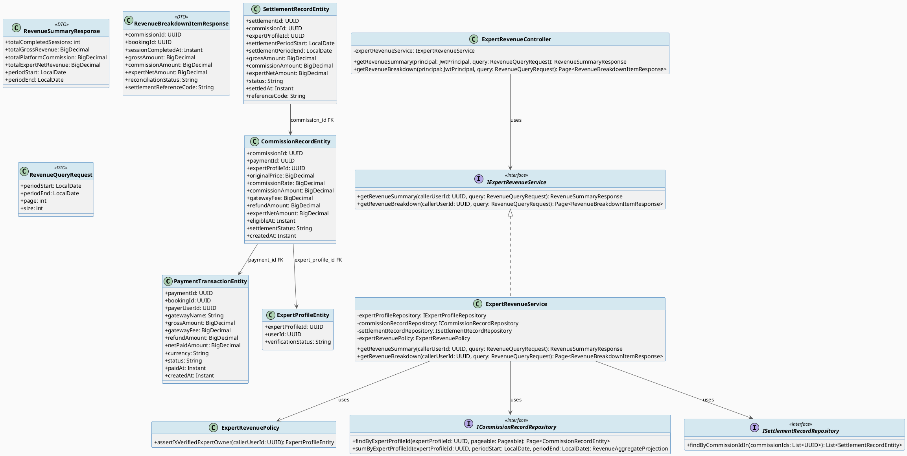
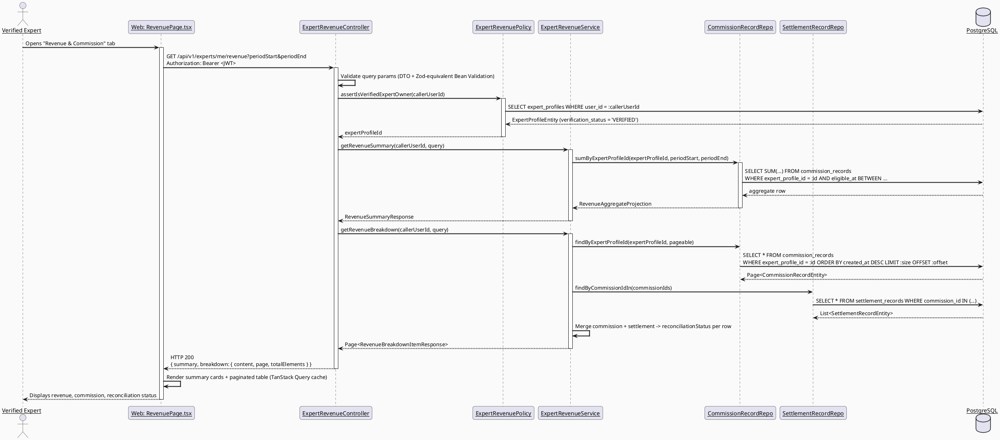
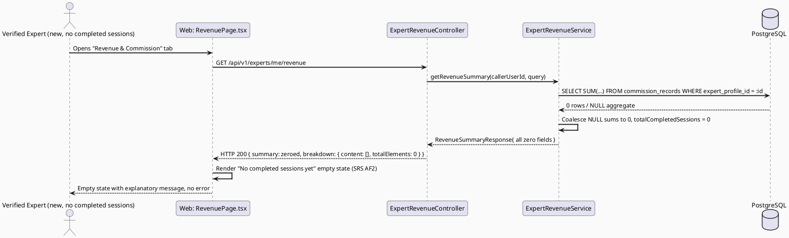
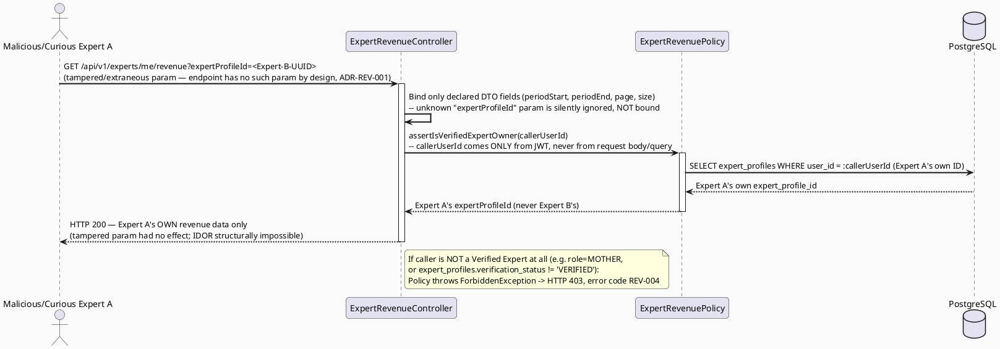

# ENGINEERING DOCUMENTATION STANDARD (EDS) v2.0
# UC97 — View Revenue and Commission — Technical Design Specification

| Field | Value |
|-------|-------|
| **Document ID** | `CB-CONSULTATION-IMP-097` |
| **Version** | `1.0` |
| **Date** | `2026-07-02` |
| **Status** | `Draft` |
| **Document Owner** | `TV4-Lâm` |
| **Author** | `AI Agent (Technical Architect)` |
| **Reviewed by** | `[Tech Lead — Pending]` |
| **DPO Sign-off** | `[ ] Pending` *(financial figures tied to an identifiable expert user — Internal/financial data, not classic PII, but access-scope violation would leak another expert's earnings)* |
| **Approved by** | `[Principal Architect — Pending]` |
| **Last Review** | `2026-07-02` |
| **Based on EDS** | `v2.0` |

---

## CHANGELOG

| Ngày | Người thực hiện | Nội dung thay đổi |
|------|-----------------|-------------------|
| 2026-07-02 | AI Agent — Technical Architect | Tạo tài liệu lần đầu (Draft) cho UC97 |

---

## MỤC LỤC

1. [Tổng quan Module](#1-tổng-quan-module)
2. [Ma trận Truy vết (Traceability Matrix)](#2-ma-trận-truy-vết-traceability-matrix)
3. [Architecture Decision Records (ADR)](#3-architecture-decision-records-adr)
4. [Non-Functional Requirements & SLA](#4-non-functional-requirements--sla)
5. [Static Modeling (Mô hình Tĩnh)](#5-static-modeling-mô-hình-tĩnh)
6. [Dynamic Modeling (Mô hình Động)](#6-dynamic-modeling-mô-hình-động)
7. [Domain Event Catalog](#7-domain-event-catalog)
8. [Interface Specification (Đặc tả Giao diện)](#8-interface-specification-đặc-tả-giao-diện)
9. [API Specification](#9-api-specification)
10. [Bảng mã lỗi (Error Codes)](#10-bảng-mã-lỗi-error-codes)
11. [Quy trình Triển khai (Step-by-Step)](#11-quy-trình-triển-khai-step-by-step)
12. [Rollback & Incident Runbook](#12-rollback--incident-runbook)
13. [Kịch bản Kiểm thử Chi tiết](#13-kịch-bản-kiểm-thử-chi-tiết)
14. [Phương pháp Xác minh](#14-phương-pháp-xác-minh)
15. [Mẫu thử thực tế (API Verification Samples)](#15-mẫu-thử-thực-tế-api-verification-samples)
16. [Bảng tổng hợp phân quyền (Authorization Matrix)](#16-bảng-tổng-hợp-phân-quyền-authorization-matrix)
17. [AI Prompt Constraints (CASE 2.0)](#17-ai-prompt-constraints-case-20)

---

## 1. Tổng quan Module

| Field | Value |
|-------|-------|
| **Module Name** | `Consultation — Expert Revenue & Commission Reporting` |
| **Bounded Context** | `Consultation` (backend package `com.carebridge.backend.consultation`, sub-package `revenue`) |
| **Function ID / UC** | `3.2.1.11 View Revenue and Commission` / `UC-97` |
| **Primary Actor** | Verified Expert |
| **Secondary Actor** | VNPay Payment Gateway *(see §1.3 — verified NOT a direct runtime dependency of UC97 itself)* |
| **Platform** | Web — Expert Portal (React + TypeScript + Vite) |
| **Priority** | High |
| **Sprint / Owner** | Sprint 4 "Real Providers And Admin Polish" — TV4-Lâm |
| **Data Classification** | `Internal` / `Financial` (own earnings, commission, settlement figures — not classic PII, but strictly self-scoped) |
| **Compliance Scope** | `BR-RBAC`, `BR-CONSULTATION`, internal financial-audit expectations (no formal GDPR/PDPA financial article invoked; treated as Confidential-Internal financial data) |
| **Upstream Dependencies** | `Process Payment Transaction (3.1.2.1)`, `Calculate Commission (3.1.2.2)` — **OUT OF SCOPE, currently unimplemented (placeholder-only `payment` and `expert` packages)**; produces the `payment_transactions`, `commission_records`, `settlement_records` rows this UC reads |
| **Downstream Consumers** | None identified in SRS — pure terminal reporting view. Admin/finance-wide reconciliation (`3.2.2.15 View Impact Report`-style admin dashboards) is a distinct, out-of-scope use case (see §16 Authorization Matrix) |

### 1.1 Scope Statement — Greenfield within an existing schema contract

Backend `com.carebridge.backend.expert` and `com.carebridge.backend.consultation`
packages are placeholder-only (`.gitkeep` files in every layer subfolder — no
entities, services, or controllers exist yet, confirmed via repo inspection).
Web `src/features/expert/pages/ExpertDashboardPage.tsx` is a stub
("Chưa được implement"); no `revenue`/`commission` feature folder exists on
the web app yet. The schema already fully models this domain
(`payment_transactions`, `commission_records`, `settlement_records` —
`V1__init_schema.sql` L923-1018). This TDS designs UC97 entirely against that
existing schema contract — **no new tables are required** (see §5.2).

### 1.2 Entry-Criteria Blocker (Open — MUST be resolved before implementation)

> ⚠️ **UC97 CANNOT be implemented standalone.** It requires:
> - Booking + payment processing service (`payment_transactions` — UC for
>   3.1.2.1 "Process Payment Transaction", out of scope here, unimplemented)
> - Commission calculation service (`commission_records` — UC for 3.1.2.2
>   "Calculate Commission", out of scope here, unimplemented)
> - A settlement/payout batch job or admin action that populates
>   `settlement_records` (no SRS use case explicitly named for this; **Open** —
>   see ADR-REV-002)
>
> Without upstream writers, `GET /api/v1/experts/me/revenue` will correctly
> return an **empty state** (§1.2 SRS AF2) against a real, empty database —
> this is a valid and testable outcome, not a blocker for *this* UC's own
> read-path implementation. It is a blocker only for producing non-empty demo
> data.

### 1.3 VNPay Secondary Actor — Verified Non-Dependency

The SRS lists "VNPay Payment Gateway" as UC97's secondary actor. Cross-checking
the SRS Normal Flow (§3.2.1.11, generic template: "Step 1. actor opens the
screen... Step 4. system applies business rules... Step 5. system displays the
result") shows **no step that calls an external gateway** — the flow is
entirely: open screen → validate access → display already-persisted data.
This mirrors the reasoning already established in the sibling UC79 TDS
(`CB-CONSULTATION-IMP-079` §1.3, which concluded ZegoCloud is not a direct
UC79 dependency) and UC78's conclusion about VNPay for dispute/refund viewing.

**This TDS concludes UC97 does NOT call the VNPay API directly.** VNPay's role
is upstream: it is the gateway that produced the `payment_transactions` rows
(via 3.1.2.1 "Process Payment Transaction", a separate use case) that UC97
merely reads. VNPay is listed as "secondary actor" only because the
*precondition data* (a settled payment) was mediated by VNPay in an earlier,
different use case. This is stated explicitly to prevent an AI implementation
from hallucinating a VNPay SDK/API call inside the revenue-viewing flow (see
§17.4 AP-CB-002).

### 1.4 "Reconciliation" Scope — Verified Read-Only, No Dispute Workflow

SRS §3.2.1.11 Description states: "Displays completed sessions, revenue,
platform commission, **and reconciliation status**." The word "reconciliation"
appears only in the Description field; the Normal/Alternative/Exception flows
(shared generic template across all UCs in this SRS section) never describe a
correction, appeal, or edit action — only "the system displays the result."
No SRS text anywhere in §3.2.1.11 grants the expert an ability to dispute or
adjust a commission calculation from this screen.

**This TDS concludes "reconciliation status" is a read-only display concept**:
it maps to `settlement_records.status` (`'PENDING' | ...`, freetext, no CHECK
constraint) and `commission_records.settlement_status` (`'PENDING'` default) —
i.e., the UI surfaces *whether a given commission has been settled/paid out
yet*, not an interactive reconciliation/adjustment tool. This mirrors UC79's
conclusion that "confirmed consultation session" (an SRS descriptive phrase)
maps to a passive DB-state read, not a new workflow. If a dispute capability is
later required, it belongs to `3.3.1.55 Submit Dispute or Refund Request`
(UC78, already specified, distinct from UC97) — **not** to be reinvented here.
Flagged **Open** only in the sense that no SRS text explicitly rules out a
future "flag a discrepancy" affordance; this TDS does not implement one.

---

## 2. Ma trận Truy vết (Traceability Matrix)

| Requirement ID | Loại (BR/ADR/US) | Mô tả yêu cầu | Thành phần Code | Compliance Target | ADR liên quan |
|----------------|------------------|---------------|-----------------|-------------------|---------------|
| UC-97 (SRS §3.2.1.11) | Use Case | Displays completed sessions, revenue, platform commission, and reconciliation status for the logged-in expert | `ExpertRevenueController.GET /api/v1/experts/me/revenue`, `ExpertRevenueService.getRevenueSummary()` | BR-CONSULTATION | ADR-REV-001 |
| BR-RBAC | Business Rule | Users may access only functions allowed by role/permission scope | `ExpertRevenuePolicy.assertIsVerifiedExpertOwner()` | Authorization | ADR-REV-001 |
| BR-CONSULTATION | Business Rule | Payment, commission, and settlement actions keep an auditable lifecycle state | Read-only projection over `commission_records`/`settlement_records`, no mutation exposed | Audit integrity | ADR-REV-001 |
| Ownership scoping (this TDS, RG-4) | Non-negotiable constraint | Expert must see ONLY their own commission/settlement rows, never another expert's, even in aggregate | `ExpertRevenueRepository` — all queries filtered by `expert_profile_id = :callerExpertProfileId` derived from JWT, never from request param | Financial data isolation | ADR-REV-001 |
| Schema: `payment_transactions` (`V1__init_schema.sql` L923-939) | Schema Contract | Gross amount, gateway fee, refund amount, net paid amount per booking | `PaymentTransactionEntity` (read-only projection) | — | — |
| Schema: `commission_records` (`V1__init_schema.sql` L941-955) | Schema Contract | Per-payment commission calculation + settlement status | `CommissionRecordEntity` | — | — |
| Schema: `settlement_records` (`V1__init_schema.sql` L1002-1018) | Schema Contract | Period-based payout batches per expert | `SettlementRecordEntity` | — | — |
| §1.2 Entry-Criteria Blocker | Open Item | Upstream payment/commission writer services unimplemented; UC97 read path still independently testable against empty DB | N/A — blocking dependency for non-empty demo data only | — | — |
| §1.4 Reconciliation scope | Open Item (documented conclusion) | "Reconciliation" = read-only settlement-status display, not a dispute/edit workflow | `ExpertRevenueResponse.reconciliationStatus` (derived field, no write path) | — | ADR-REV-002 |

---

## 3. Architecture Decision Records (ADR)

### ADR-REV-001 — UC97 is a strictly read-only, self-scoped aggregation over existing payment/commission/settlement tables; no VNPay call, no new schema

| Field | Value |
|-------|-------|
| **Status** | `Proposed` — pending Tech Lead confirmation of upstream UC (3.1.2.1/3.1.2.2) contract |
| **Deciders** | `AI Agent (proposal) — pending TV4-Lâm / Tech Lead confirmation` |
| **Date** | `2026-07-02` |

#### Bối cảnh (Context)
UC97 must show a Verified Expert their completed sessions, revenue, platform
commission, and reconciliation status. The schema already has three
purpose-built tables (`payment_transactions`, `commission_records`,
`settlement_records`) with FK chains `commission_records.payment_id →
payment_transactions.payment_id` and `commission_records.expert_profile_id →
expert_profiles.expert_profile_id`, plus `settlement_records.commission_id →
commission_records.commission_id`. No UC97-specific table is needed. The
central risk is cross-expert data leakage: if the query is filtered by a
client-supplied `expertProfileId` instead of the JWT-derived identity, Expert A
could view Expert B's earnings by tampering with a query param.

#### Các phương án đã xem xét (Options Considered)

| Phương án | Mô tả | Ưu điểm | Nhược điểm |
|-----------|-------|----------|------------|
| A | Accept `expertProfileId` as a request parameter, validate caller owns it | Flexible if admin reuse needed later | Extra validation surface; one missed check = cross-expert leak (CWE-639 IDOR) |
| B | **Derive `expertProfileId` server-side exclusively from the authenticated JWT's `user_id → expert_profiles.user_id` lookup; endpoint accepts NO caller-supplied expert identifier** | Eliminates IDOR class entirely — there is no parameter to tamper with | Cannot be reused later for an admin "view any expert's revenue" screen without a second endpoint |
| C | Return all commission/settlement rows and filter client-side | Simple backend | Leaks other experts' financial data over the wire even if UI hides it — unacceptable |

#### Quyết định (Decision)
Chọn **Phương án B**: `GET /api/v1/experts/me/revenue` — the `me` segment is
literal; the service resolves the caller's `expert_profile_id` from
`SecurityContext` → `users.user_id` → `expert_profiles.user_id` join, and every
repository query is parameterized by that resolved ID, never by client input.
If a future admin/finance "view any expert" screen is needed, it MUST be a
separate endpoint (e.g., `GET /api/v1/admin/experts/{id}/revenue`) with its own
RBAC and audit trail — explicitly out of scope for UC97 (see §16).

#### Hệ quả (Consequences)

**Tích cực:** Structurally impossible to leak another expert's financial data
through this endpoint — no attacker-controlled identifier exists in the
request. Matches BR-RBAC least-privilege intent.
**Tiêu cực / Trade-offs:** Endpoint is single-purpose ("my revenue only");
admin/finance reuse requires a new endpoint later, not a parameter toggle.
**Compliance Impact:** Supports BR-CONSULTATION auditable-lifecycle
requirement — read access itself is not logged as a sensitive action (view-only,
no PII), but the query MUST NOT be constructible to escape self-scope.

---

### ADR-REV-002 — Aggregation design: revenue summary computed by period + per-session breakdown, both derived at read time (no pre-computed rollup table)

| Field | Value |
|-------|-------|
| **Status** | `Proposed` |
| **Deciders** | `AI Agent (proposal) — pending TV4-Lâm / Tech Lead confirmation` |
| **Date** | `2026-07-02` |

#### Bối cảnh (Context)
SRS demands "completed sessions, revenue, platform commission, and
reconciliation status" — implying both a summary (totals) and a list
(per-session/per-payment breakdown). No SRS text specifies a time granularity
(daily/weekly/monthly) or mandates a pre-aggregated rollup table. Given
Sprint-4 scope (read-only reporting, no new schema authorized beyond the
reserved `V20260703120000+` range per task instructions, and none is actually
needed here), a query-time aggregation is preferred over introducing a new
materialized rollup table.

#### Các phương án đã xem xét (Options Considered)

| Phương án | Mô tả | Ưu điểm | Nhược điểm |
|-----------|-------|----------|------------|
| A | New `expert_revenue_rollups` table updated by a scheduled job | Fast reads at scale | New schema + new batch job = out of scope for a read-only Sprint-4 reporting UC; premature optimization |
| B | **Query-time `SUM()`/`GROUP BY` over `commission_records` joined to `payment_transactions`, filtered by expert + optional date-range param, with pagination on the per-session breakdown list** | No new schema; matches "read-only reporting" framing; correct-by-construction (always reflects latest commission/settlement state) | Slightly higher query cost per request — acceptable given "Frequent" (not "high-throughput") usage per SRS Frequency of Use |
| C | Return raw `commission_records` rows only, compute sums client-side in React | Minimal backend logic | Duplicates business logic (currency/rounding rules) in two places; risks client/server drift on financial totals — rejected for financial-data-integrity reasons |

#### Quyết định (Decision)
Chọn **Phương án B**. Backend computes:
1. **Summary block**: `SUM(commission_records.expert_net_amount)` (total
   revenue), `SUM(commission_records.commission_amount)` (total platform
   commission), `SUM(commission_records.gateway_fee)`, count of completed
   sessions — all scoped to caller's `expert_profile_id`, optionally
   date-filtered by `commission_records.eligible_at` or `created_at`.
2. **Breakdown list**: one row per `commission_records` entry, joined to
   `payment_transactions` (gross amount, currency) and to
   `settlement_records` (settlement status/period, nullable — a commission may
   not yet be batched into a settlement), paginated (`page`, `size` query
   params, default `size=20`, max `100`).
3. **Reconciliation status** (per §1.4) = `settlement_records.status` if a
   settlement row exists for that commission, else a derived value
   `"NOT_YET_SETTLED"` (application-level constant, not a DB value) when
   `commission_records.settlement_status = 'PENDING'` and no settlement row
   exists yet.

#### Hệ quả (Consequences)

**Tích cực:** Zero migration risk; totals always consistent with underlying
ledger rows (no rollup-drift bugs); simplest correct implementation for the
declared scope.
**Tiêu cực / Trade-offs:** Aggregation cost grows with an expert's total
lifetime session count; acceptable at current scale, flagged as a future
NFR watch-item if an expert accumulates >10k completed sessions (see §4.1).
**Compliance Impact:** None negative — read-only, no new PII surface.

---

## 4. Non-Functional Requirements & SLA

### 4.1. Performance & Availability

| Category | Requirement | Target SLA | Measurement Method | Compliance Basis |
|----------|-------------|------------|---------------------|------------------|
| Latency | `GET /experts/me/revenue` response (p99) | `< 500ms` for ≤ 2,000 lifetime sessions per expert | Manual timing / future k6 load test | — |
| Availability | Endpoint uptime (monthly) | `99.5%` (aligned to overall API availability, not a dedicated SLA tier) | Uptime monitor | — |
| Pagination | Breakdown list default/max page size | `20` default / `100` max | Query param validation (`ExpertRevenueController`) | Prevents unbounded payloads |

### 4.2. Data Integrity & Retention

| Category | Requirement | Target | Verification Method | Compliance Basis |
|----------|-------------|--------|---------------------|------------------|
| Read-only guarantee | No endpoint under this UC issues INSERT/UPDATE/DELETE on `payment_transactions`, `commission_records`, `settlement_records` | 100% | Code review — `ExpertRevenueRepository` extends `JpaRepository` but only exposes `findBy*` query methods (no `save`/`delete` called from `ExpertRevenueService`) | BR-CONSULTATION audit integrity |
| Consistency | Summary totals = `SUM()` of the exact rows returned in the breakdown for the same filter | 100% | Integration test comparing summary vs. manually summed breakdown page | Financial correctness |

### 4.3. Security

| Category | Requirement | Target | Verification Method | Compliance Basis |
|----------|-------------|--------|---------------------|------------------|
| Access control | Role-based + ownership-scoped (self only) | Least privilege — no `expertProfileId` accepted from client | Auth Matrix (§16) + ADR-REV-001 | BR-RBAC |
| Encryption in transit | All endpoints | TLS (deployment-level, inherited from existing API gateway config) | Existing infra config | — |
| No cross-tenant leakage | Response never includes another expert's rows even under malformed/tampered requests | 100% — verified by UC97-TC-SEC-001..002 | Security test (§13.3) | ADR-REV-001 |

### 4.4. Scalability & Capacity Planning

Expected load: low-hundreds of Verified Experts at MVP scale, each with at
most a few thousand lifetime completed sessions. Query-time aggregation
(ADR-REV-002 Option B) is sufficient at this scale; revisit (Option A rollup
table) only if per-expert session count or concurrent Expert Portal traffic
grows materially — not expected within the current project scope.

---

## 5. Static Modeling (Mô hình Tĩnh)

### 5.1. Class Diagram (PlantUML)



### 5.2. Data Structure (Flyway SQL Migration)

**No new migration required.** UC97 is a pure read-path over existing tables
already defined in `V1__init_schema.sql`:

- `public.payment_transactions` (L923-939, PK `payment_id`)
- `public.commission_records` (L941-955, PK `commission_id`, unique on
  `payment_id`, FK to `payment_transactions` and `expert_profiles`)
- `public.settlement_records` (L1002-1018, PK `settlement_id`, FK to
  `commission_records` and `expert_profiles`)
- `public.expert_profiles` (L786-800, PK `expert_profile_id`, unique on
  `user_id`) — used to resolve caller identity to `expert_profile_id`

Confirmed via `V1__init_schema.sql` FK section (L1853-1857, L1886-1890):
`commission_records.payment_id → payment_transactions.payment_id`,
`commission_records.expert_profile_id → expert_profiles.expert_profile_id`,
`settlement_records.commission_id → commission_records.commission_id`,
`settlement_records.expert_profile_id → expert_profiles.expert_profile_id`.

If, during implementation, an index is found missing for the
`(expert_profile_id, created_at)` query pattern, a **non-destructive**
`CREATE INDEX CONCURRENTLY` migration may be added using the reserved version
range `V20260703120000` (per task allocation, incrementing by `00100` if more
than one migration is needed). No such migration is authored in this Draft TDS
since it cannot be confirmed necessary without a live query plan — **flagged
Open**, to be resolved during implementation with an `EXPLAIN ANALYZE` check.

> **Quy tắc đặt tên:** N/A — no new table/column introduced by this TDS.

---

## 6. Dynamic Modeling (Mô hình Động)

### 6.1. Sequence Diagram — Happy Path (PlantUML)



### 6.2. Sequence Diagram — Empty-State Path (PlantUML)



### 6.3. Sequence Diagram — Ownership-Violation Attempt (Error Path, PlantUML)



---

## 7. Domain Event Catalog

### 7.1. Events Published (Phát ra)

UC97 is a pure read-only reporting view. **No domain event is published** by
this use case — reads do not mutate state and therefore emit no lifecycle
event. (Audit logging of the *access itself*, if later mandated by a
finance-compliance requirement, is out of scope for this Draft — flagged Open,
see §16 note.)

### 7.2. Events Consumed (Tiêu thụ)

| Event Name | Source | Handler | Action thực hiện |
|------------|--------|---------|------------------|
| _(None)_ | — | — | UC97 does not subscribe to any domain event; it reads current DB state synchronously on each request (no cache invalidation via event needed since TanStack Query handles client-side cache freshness via `staleTime`/refetch) |

### 7.3. Payload Schema

Not applicable — no events published or consumed by this UC.

---

## 8. Interface Specification (Đặc tả Giao diện)

### 8.1. Service Interface

```java
// RevenueQueryRequest.java — Input DTO
// @version 1.0
public class RevenueQueryRequest {
    private LocalDate periodStart;  // Optional — inclusive; null = no lower bound
    private LocalDate periodEnd;    // Optional — inclusive; null = no upper bound
    @Min(0)
    private int page = 0;           // Default 0
    @Min(1) @Max(100)
    private int size = 20;          // Default 20, max 100 (NFR §4.1)
    // getters / setters / @Valid annotations
}

// RevenueSummaryResponse.java — Output DTO
public class RevenueSummaryResponse {
    private int totalCompletedSessions;
    private BigDecimal totalGrossRevenue;
    private BigDecimal totalPlatformCommission;
    private BigDecimal totalExpertNetRevenue;
    private LocalDate periodStart;   // echoes applied filter, null if unfiltered
    private LocalDate periodEnd;
    // getters / setters
}

// RevenueBreakdownItemResponse.java — Output DTO
public class RevenueBreakdownItemResponse {
    private UUID commissionId;
    private UUID bookingId;
    private Instant sessionCompletedAt;   // derived: payment_transactions.paid_at
    private BigDecimal grossAmount;
    private BigDecimal commissionAmount;
    private BigDecimal expertNetAmount;
    private String reconciliationStatus;  // "PENDING" | "SETTLED" | "NOT_YET_SETTLED" (§1.4/ADR-REV-002)
    private String settlementReferenceCode; // nullable — settlement_records.reference_code
    // getters / setters
}

// IExpertRevenueService.java — Service Contract
// @version 1.0
public interface IExpertRevenueService {
    /**
     * Returns aggregate revenue/commission totals for the calling Verified Expert.
     * @throws ForbiddenAccessException (REV-004) if caller is not a Verified Expert
     */
    RevenueSummaryResponse getRevenueSummary(UUID callerUserId, RevenueQueryRequest query);

    /**
     * Returns the paginated per-session commission/settlement breakdown for the
     * calling Verified Expert only.
     * @throws ForbiddenAccessException (REV-004) if caller is not a Verified Expert
     */
    Page<RevenueBreakdownItemResponse> getRevenueBreakdown(UUID callerUserId, RevenueQueryRequest query);
}
```

### 8.2. Repository Interface

```java
// ICommissionRecordRepository.java
// @version 1.0
public interface ICommissionRecordRepository extends JpaRepository<CommissionRecordEntity, UUID> {

    Page<CommissionRecordEntity> findByExpertProfileIdOrderByCreatedAtDesc(
        UUID expertProfileId, Pageable pageable);

    Page<CommissionRecordEntity> findByExpertProfileIdAndCreatedAtBetweenOrderByCreatedAtDesc(
        UUID expertProfileId, Instant start, Instant end, Pageable pageable);

    @Query("""
        SELECT new com.carebridge.backend.consultation.revenue.dto.RevenueAggregateProjection(
            COUNT(c), COALESCE(SUM(p.grossAmount), 0), COALESCE(SUM(c.commissionAmount), 0),
            COALESCE(SUM(c.expertNetAmount), 0))
        FROM CommissionRecordEntity c JOIN PaymentTransactionEntity p ON c.paymentId = p.paymentId
        WHERE c.expertProfileId = :expertProfileId
          AND (:start IS NULL OR c.createdAt >= :start)
          AND (:end IS NULL OR c.createdAt <= :end)
        """)
    RevenueAggregateProjection sumByExpertProfileId(
        @Param("expertProfileId") UUID expertProfileId,
        @Param("start") Instant start,
        @Param("end") Instant end);

    // Read-only repository — no save()/delete() called by ExpertRevenueService.
    // save()/deleteById() remain available (inherited from JpaRepository) only
    // because upstream UC 3.1.2.2 "Calculate Commission" needs them; UC97's
    // service layer must never invoke them (enforced by code review, §17).
}

// ISettlementRecordRepository.java
// @version 1.0
public interface ISettlementRecordRepository extends JpaRepository<SettlementRecordEntity, UUID> {

    List<SettlementRecordEntity> findByCommissionIdIn(List<UUID> commissionIds);
}
```

---

## 9. API Specification

### 9.1. Endpoints Table

| Method | Path | Auth Level | Required Roles | Rate Limit | Idempotent? |
|--------|------|------------|----------------|------------|-------------|
| `GET` | `/api/v1/experts/me/revenue/summary` | JWT Bearer | `EXPERT` (verification_status = VERIFIED) | 300/min | Yes |
| `GET` | `/api/v1/experts/me/revenue/breakdown` | JWT Bearer | `EXPERT` (verification_status = VERIFIED) | 300/min | Yes |

> **Note:** Two endpoints (summary + breakdown) rather than one combined
> response, to let the web frontend independently cache/paginate the
> breakdown table without re-fetching the summary cards on each page change
> (TanStack Query — separate query keys `['expert-revenue-summary', filters]`
> and `['expert-revenue-breakdown', filters, page]`).

### 9.2. Request / Response Schemas

#### `GET /api/v1/experts/me/revenue/summary?periodStart=2026-01-01&periodEnd=2026-06-30`

**Response — 200 OK (Happy Path):**
```json
{
  "totalCompletedSessions": 42,
  "totalGrossRevenue": 21000000,
  "totalPlatformCommission": 3150000,
  "totalExpertNetRevenue": 17850000,
  "periodStart": "2026-01-01",
  "periodEnd": "2026-06-30"
}
```

**Response — 200 OK (Empty State, AF2):**
```json
{
  "totalCompletedSessions": 0,
  "totalGrossRevenue": 0,
  "totalPlatformCommission": 0,
  "totalExpertNetRevenue": 0,
  "periodStart": null,
  "periodEnd": null
}
```

#### `GET /api/v1/experts/me/revenue/breakdown?page=0&size=20`

**Response — 200 OK:**
```json
{
  "content": [
    {
      "commissionId": "b3f1a2c4-0000-4000-8000-000000000001",
      "bookingId": "a1e2d3c4-0000-4000-8000-000000000002",
      "sessionCompletedAt": "2026-06-15T09:30:00Z",
      "grossAmount": 500000,
      "commissionAmount": 75000,
      "expertNetAmount": 425000,
      "reconciliationStatus": "SETTLED",
      "settlementReferenceCode": "STL-2026-06-0007"
    }
  ],
  "page": 0,
  "size": 20,
  "totalElements": 42,
  "totalPages": 3
}
```

**Response — 403 Forbidden (not a Verified Expert):**
```json
{
  "error": {
    "code": "REV-004",
    "message": "Only Verified Experts may view revenue and commission data."
  }
}
```

**Response — 400 Bad Request (invalid period range):**
```json
{
  "error": {
    "code": "REV-001",
    "message": "periodStart must not be after periodEnd",
    "details": [
      { "field": "periodStart", "message": "periodStart (2026-07-01) is after periodEnd (2026-01-01)" }
    ]
  }
}
```

---

## 10. Bảng mã lỗi (Error Codes)

| Code | HTTP Status | Message (EN) | Message (VI) | Trigger Condition |
|------|-------------|--------------|--------------|-------------------|
| `REV-001` | 400 | Validation failed | Dữ liệu không hợp lệ | `periodStart` after `periodEnd`, or `page`/`size` out of allowed bounds |
| `REV-002` | 404 | Expert profile not found | Không tìm thấy hồ sơ chuyên gia | Caller's `user_id` has no matching `expert_profiles` row (should not occur for a valid EXPERT-role JWT, but guarded defensively) |
| `REV-003` | 401 | Authentication required | Yêu cầu đăng nhập | Missing/expired/invalid JWT |
| `REV-004` | 403 | Insufficient permissions | Không đủ quyền | Caller role is not `EXPERT`, or `expert_profiles.verification_status != 'VERIFIED'` |
| `REV-005` | 500 | Internal error | Lỗi hệ thống | Unexpected DB/aggregation failure |

---

## 11. Quy trình Triển khai (Step-by-Step)

### 11.1. Prerequisites

- [ ] ADR-REV-001 and ADR-REV-002 Accepted (currently `Proposed`, see §3)
- [ ] Tech Lead confirms no admin/finance "view any expert" reuse is expected on this same endpoint (else split earlier, not after ship)
- [ ] Upstream UC 3.1.2.1/3.1.2.2 services exist far enough to produce at least one `commission_records` row for manual verification (not required for automated tests, which seed data directly)

### 11.2. Pre-Migration Checklist

- [ ] **N/A — no schema migration required** (§5.2). If a supporting index migration is later authored under `V20260703120000`, apply the standard checklist from the TDS template (§11.2 template) at that time.

### 11.3. Implementation Steps

#### Chặng 1 — Backend: entities + repositories (read-only projections)

Create JPA entities `PaymentTransactionEntity`, `CommissionRecordEntity`,
`SettlementRecordEntity`, `ExpertProfileEntity` (if not already created by a
sibling UC) under
`05_Development/CareBridgeAPI/src/main/java/com/carebridge/backend/consultation/entity/`
and `.../expert/entity/`, mapped `@Table` to the exact existing columns from
§5.2 — no `@GeneratedValue` assumptions beyond the schema's own
`gen_random_uuid()` defaults.

#### Chặng 2 — Backend: service, policy, controller

```java
// ExpertRevenuePolicy.java (package com.carebridge.backend.consultation.revenue.policy)
@Component
public class ExpertRevenuePolicy {
    private final IExpertProfileRepository expertProfileRepository;

    public ExpertProfileEntity assertIsVerifiedExpertOwner(UUID callerUserId) {
        ExpertProfileEntity profile = expertProfileRepository.findByUserId(callerUserId)
            .orElseThrow(() -> new NotFoundException("REV-002", "Expert profile not found"));
        if (!"VERIFIED".equals(profile.getVerificationStatus())) {
            throw new ForbiddenAccessException("REV-004",
                "Only Verified Experts may view revenue and commission data.");
        }
        return profile;
    }
}
```

Implement `ExpertRevenueService` and `ExpertRevenueController` per §8.

#### Chặng 3 — Web: feature folder + TanStack Query hooks

Create under
`05_Development/CareBridgeWebApp/src/features/expertRevenue/`:
- `models/revenue.ts` — Zod schemas mirroring §9.2 response shapes
  (`RevenueSummarySchema`, `RevenueBreakdownItemSchema`)
- `services/revenueApi.ts` — `fetchRevenueSummary()`, `fetchRevenueBreakdown()`
- `pages/RevenueCommissionPage.tsx` — wired into
  `src/features/expert/pages/ExpertDashboardPage.tsx`'s tab navigation (or a
  router route `/expert/revenue`, per existing Expert Portal router
  convention in `src/app/router`)
- `components/RevenueSummaryCards.tsx`, `components/RevenueBreakdownTable.tsx`

#### Chặng 4 — Verification sau deploy

```bash
curl -X GET https://<host>/api/v1/experts/me/revenue/summary \
  -H "Authorization: Bearer <verified-expert-jwt>"
# Expected: 200 with either populated or zeroed summary fields, never 500
```

### 11.4. Deployment Checklist

- [ ] `./mvnw test` green for new `consultation.revenue` package
- [ ] Web `npm run build` succeeds with new `expertRevenue` feature
- [ ] Manual check: a second Expert account cannot see the first Expert's rows (§13.3 security tests pass)
- [ ] No PII/financial figures appear in application logs at INFO level or above

---

## 12. Rollback & Incident Runbook

### 12.1. Điều kiện kích hoạt Rollback

| Điều kiện | Ngưỡng | Người quyết định |
|-----------|--------|------------------|
| Error rate on `/experts/me/revenue/*` | > 5% trong 5 phút | On-call Engineer |
| Cross-expert data leakage confirmed (any) | Bất kỳ case nào | Tech Lead — **immediate rollback, treat as security incident** |
| Latency p99 vượt ngưỡng | > 2x baseline (§4.1) | On-call Engineer |

### 12.2. Rollback Procedure

```bash
# No migration to revert (§5.2 — no schema change).
# Revert implementation files only:
git checkout -- 05_Development/CareBridgeAPI/src/main/java/com/carebridge/backend/consultation/revenue/
git checkout -- 05_Development/CareBridgeAPI/src/test/java/com/carebridge/backend/consultation/revenue/
git checkout -- 05_Development/CareBridgeWebApp/src/features/expertRevenue/

# Re-deploy previous build
kubectl rollout undo deployment/carebridge-api
kubectl rollout undo deployment/carebridge-web

# Verify
curl -X GET https://<host>/api/v1/health
```

### 12.3. Notification Protocol

| Thời điểm | Người nhận | Kênh | Template |
|-----------|------------|------|----------|
| Ngay khi phát hiện leakage | On-call + Tech Lead | Slack `#incident` | "🚨 UC97 revenue endpoint: possible cross-expert data leak detected" |
| Trong 30 phút | Principal Architect | Email/Slack | Required for any financial-data isolation incident |

### 12.4. Post-Incident Review (PIR)

Standard PIR template (Timeline / Root Cause / Impact / Remediation /
Prevention) applies if a cross-expert leakage incident occurs; mandatory
within 48h given financial-data sensitivity.

---

## 13. Kịch bản Kiểm thử Chi tiết

> See companion file `UC97_ViewRevenueAndCommission_Test-Spec.md` for the full
> ISO/IEC/IEEE 29119-3 test design, test cases, and Red-Green-Refactor
> tracker. Summary below.

### 13.1. Unit Tests
`ExpertRevenueService`, `ExpertRevenuePolicy` — Mockito-mocked repositories.

### 13.2. Integration Tests
`ExpertRevenueControllerIntegrationTest` — Testcontainers PostgreSQL, seeded
`commission_records`/`settlement_records`/`expert_profiles` fixtures for two
distinct experts to prove isolation.

### 13.3. E2E / Security Tests
Ownership-violation attempts (tampered params, cross-role access, unverified
expert access) — see Test-Spec §4 SECURITY TEST CASES.

---

## 14. Phương pháp Xác minh

### 14.1. Database Inspection

```sql
-- Verify a given expert's commission rows sum matches the summary endpoint
SELECT COUNT(*), SUM(commission_amount), SUM(expert_net_amount)
FROM commission_records
WHERE expert_profile_id = '<expert-profile-uuid>';

-- Verify no cross-expert row is ever returned by application query
-- (manual cross-check: run the repository query with Expert A's ID,
--  confirm zero rows have expert_profile_id != Expert A's ID)
SELECT DISTINCT expert_profile_id FROM commission_records
WHERE expert_profile_id = '<expert-A-uuid>';
-- Expected: exactly one distinct value, Expert A's own ID
```

### 14.2. Log / Audit Verification

```bash
# Verify no raw financial totals or other experts' UUIDs leak into logs beyond
# the caller's own scoped request
kubectl logs -l app=carebridge-api | grep "ExpertRevenueController" | head -5
```

### 14.3. Tool-based Verification

```bash
# Verify JWT-derived identity is what gates the query (not a request param)
echo "<JWT_TOKEN>" | cut -d'.' -f2 | base64 -d | jq .
# Confirm "sub" (user_id) matches the expert whose data was returned
```

---

## 15. Mẫu thử thực tế (API Verification Samples)

### 15.1. Happy Path

```bash
curl -X GET "https://<host>/api/v1/experts/me/revenue/summary?periodStart=2026-01-01&periodEnd=2026-06-30" \
  -H "Authorization: Bearer <verified-expert-jwt>" \
  -H "X-Correlation-Id: $(uuidgen)"
```

**Expected Response (200):** see §9.2 happy-path JSON.

### 15.2. Error Paths

```bash
# Unverified expert (verification_status = 'PENDING') -> 403
curl -X GET "https://<host>/api/v1/experts/me/revenue/summary" \
  -H "Authorization: Bearer <pending-expert-jwt>"
```

**Expected Response (403):**
```json
{ "error": { "code": "REV-004", "message": "Only Verified Experts may view revenue and commission data." } }
```

```bash
# No JWT -> 401
curl -X GET "https://<host>/api/v1/experts/me/revenue/summary"
```

**Expected Response (401):**
```json
{ "error": { "code": "REV-003", "message": "Authentication required" } }
```

---

## 16. Bảng tổng hợp phân quyền (Authorization Matrix)

| Endpoint | `GUEST` | `MOTHER`/`FAMILY` | `EXPERT` (unverified) | `EXPERT` (VERIFIED) | `SYSTEM_ADMIN`/finance role |
|----------|---------|--------------------|------------------------|----------------------|------------------------------|
| `GET /api/v1/experts/me/revenue/summary` | ❌ 401 | ❌ 403 | ❌ 403 (REV-004) | ✅ Own only | ⚠️ **Out of scope for UC97** — see note |
| `GET /api/v1/experts/me/revenue/breakdown` | ❌ 401 | ❌ 403 | ❌ 403 (REV-004) | ✅ Own only | ⚠️ **Out of scope for UC97** |

**Chú thích:**
- ✅ = Được phép
- ❌ = Bị từ chối (401/403 as noted)
- `Own only` = No parameter exists to view another expert's data (ADR-REV-001) — structurally self-scoped
- ⚠️ **Open item**: SRS does not define a distinct "Admin/Finance view all experts' revenue" use case. If required later, it must be a separate endpoint/UC with its own RBAC row and audit logging — not a role-check branch added to this endpoint. Not implemented here.

---

## 17. AI Prompt Constraints (CASE 2.0)

### 17.1 Constraint Summary Table

| # | Constraint | Source (ADR/BR) | Last Verified |
|---|-----------|-----------------|---------------|
| C1 | `expertProfileId` MUST be resolved server-side from the JWT's `user_id`; the endpoint MUST NOT accept an `expertProfileId`/`expertId` request parameter of any kind | `ADR-REV-001` | `2026-07-02` |
| C2 | MUST NOT call VNPay SDK/API from this use case's service or controller — VNPay is only an upstream data producer (§1.3) | `BR-CONSULTATION`, `ADR-REV-001` | `2026-07-02` |
| C3 | MUST NOT implement a commission dispute/edit/adjustment endpoint under this UC — "reconciliation" is read-only display of `settlement_records.status`/`commission_records.settlement_status` (§1.4). Disputes belong to UC78, a separate feature | `ADR-REV-002` | `2026-07-02` |
| C4 | MUST NOT introduce a new Flyway migration unless a query-plan-justified index is proven necessary (§5.2); no new table is authorized for this UC | `ADR-REV-002` | `2026-07-02` |
| C5 | Repository/service layer MUST NOT call `save()`/`delete()` on `CommissionRecordRepository`/`SettlementRecordRepository`/`PaymentTransactionRepository` from within `ExpertRevenueService` — this UC is 100% read-only | `NFR §4.2` | `2026-07-02` |

### 17.2 Constraint Injection Block (Copy-Paste vào AI Prompt)

```
[CONSTRAINT BLOCK — Module: UC97 View Revenue and Commission]
Theo TDS CB-CONSULTATION-IMP-097 và các ADR liên quan:

1. Resolve expertProfileId ONLY from JWT (users.user_id -> expert_profiles.user_id).
   NEVER accept expertProfileId/expertId as a request parameter (ADR-REV-001).
2. Do NOT call VNPay SDK/API anywhere in this feature — VNPay produced the data
   upstream in a different, unimplemented use case (§1.3).
3. Do NOT build a dispute/edit/adjustment endpoint. "Reconciliation" is a
   read-only field derived from settlement_records.status /
   commission_records.settlement_status (§1.4, ADR-REV-002).
4. Do NOT author a new Flyway migration unless an EXPLAIN ANALYZE proves an
   index is required; no new table is authorized (§5.2).
5. ExpertRevenueService must be strictly read-only — no save()/delete() calls
   on commission/settlement/payment repositories.

[CONTEXT BLOCK]
- Bounded Context: Consultation (backend), Expert Portal (web)
- Data Classification: Internal / Financial
- Compliance: BR-RBAC, BR-CONSULTATION
- Existing interfaces: §8 Service Interface + §8.2 Repository Interface
- Error codes: §10 Error Codes Table
- Auth matrix: §16 Authorization Matrix

[TASK BLOCK]
Implement {feature/method} thỏa mãn constraints trên.
Output phải tuân thủ §8 Interface Specification.
Tests phải cover §13 Test Scenarios (see companion Test-Spec).
```

### 17.3 Constraint Quality Checklist

- [x] Mỗi constraint traceable về ADR hoặc BR cụ thể
- [x] Không có constraint generic
- [x] Mỗi constraint có `Last Verified` date ≤ 2 sprints (2026-07-02, current sprint)
- [x] Constraint block có ≥ 3 constraints cụ thể (5 total)
- [x] Constraint block reference §8 Interface
- [x] Constraint block reference §16 Auth Matrix

### 17.4 Anti-Pattern Detection (cho AI-Generated Code từ Block này)

| AP-ID | Anti-Pattern | Dấu hiệu | Hành động |
|-------|-------------|-----------|----------|
| AP-CB-001 | Unconstrained Gen | Code accepts `expertProfileId` from query/body | Reject — inject C1 again |
| AP-CB-002 | Hallucinated VNPay Call | Code imports a VNPay SDK class inside `ExpertRevenueService`/`Controller` | Reject — verify against §1.3 conclusion |
| AP-CB-003 | Invented Dispute Endpoint | Code adds a `PATCH`/`POST` under `/experts/me/revenue/*` | Reject — reconciliation is read-only (§1.4) |
| AP-CB-004 | Implicit Schema Change | Code adds a new table/column not in §5.2 | Reject — write ADR first |

---

*TDS based on EDS v2.0 + CASE 2.0. Status: Draft — pending Tech Lead / Principal Architect review and DPO financial-data-scope sign-off.*
