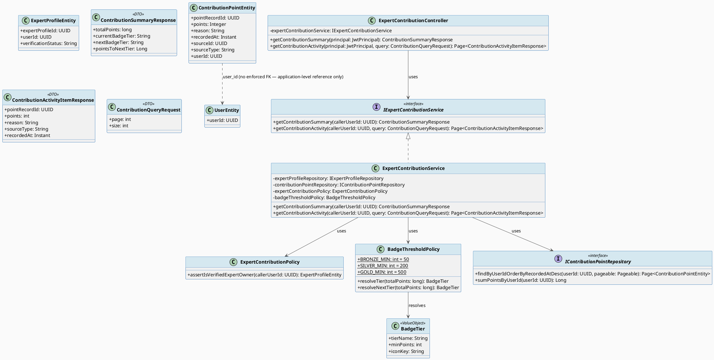
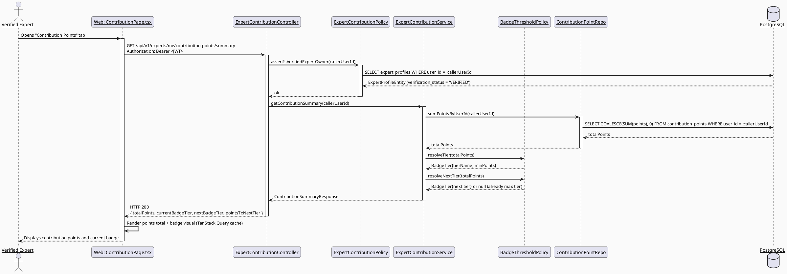
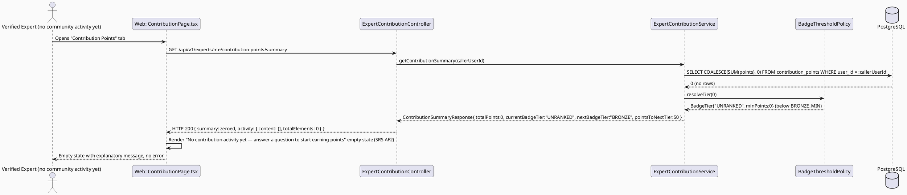

# ENGINEERING DOCUMENTATION STANDARD (EDS) v2.0
# UC98 — View Contribution Points — Technical Design Specification

| Field | Value |
|-------|-------|
| **Document ID** | `CB-CONSULTATION-IMP-098` |
| **Version** | `1.0` |
| **Date** | `2026-07-02` |
| **Status** | `Draft` |
| **Document Owner** | `TV4-Lâm` |
| **Author** | `AI Agent (Technical Architect)` |
| **Reviewed by** | `[Tech Lead — Pending]` |
| **DPO Sign-off** | `[ ] Pending` *(gamification/reputation data tied to an identifiable expert — Internal, not PII-sensitive, but reputation-adjacent)* |
| **Approved by** | `[Principal Architect — Pending]` |
| **Last Review** | `2026-07-02` |
| **Based on EDS** | `v2.0` |

---

## CHANGELOG

| Ngày | Người thực hiện | Nội dung thay đổi |
|------|-----------------|-------------------|
| 2026-07-02 | AI Agent — Technical Architect | Tạo tài liệu lần đầu (Draft) cho UC98 |

---

## MỤC LỤC

1. [Tổng quan Module](#1-tổng-quan-module)
2. [Ma trận Truy vết (Traceability Matrix)](#2-ma-trận-truy-vết-traceability-matrix)
3. [Architecture Decision Records (ADR)](#3-architecture-decision-records-adr)
4. [Non-Functional Requirements & SLA](#4-non-functional-requirements--sla)
5. [Static Modeling (Mô hình Tĩnh)](#5-static-modeling-mô-hình-tĩnh)
6. [Dynamic Modeling (Mô hình Động)](#6-dynamic-modeling-mô-hình-động)
7. [Domain Event Catalog](#7-domain-event-catalog)
8. [Interface Specification (Đặc tả Giao diện)](#8-interface-specification-đặc-tả-giao-diện)
9. [API Specification](#9-api-specification)
10. [Bảng mã lỗi (Error Codes)](#10-bảng-mã-lỗi-error-codes)
11. [Quy trình Triển khai (Step-by-Step)](#11-quy-trình-triển-khai-step-by-step)
12. [Rollback & Incident Runbook](#12-rollback--incident-runbook)
13. [Kịch bản Kiểm thử Chi tiết](#13-kịch-bản-kiểm-thử-chi-tiết)
14. [Phương pháp Xác minh](#14-phương-pháp-xác-minh)
15. [Mẫu thử thực tế (API Verification Samples)](#15-mẫu-thử-thực-tế-api-verification-samples)
16. [Bảng tổng hợp phân quyền (Authorization Matrix)](#16-bảng-tổng-hợp-phân-quyền-authorization-matrix)
17. [AI Prompt Constraints (CASE 2.0)](#17-ai-prompt-constraints-case-20)

---

## 1. Tổng quan Module

| Field | Value |
|-------|-------|
| **Module Name** | `Consultation — Expert Contribution Points & Badges` |
| **Bounded Context** | `Consultation` (backend package `com.carebridge.backend.consultation`, sub-package `contribution`) — reads a cross-cutting ledger table also written to by the `community` bounded context |
| **Function ID / UC** | `3.2.1.12 View Contribution Points` / `UC-98` |
| **Primary Actor** | Verified Expert |
| **Secondary Actor** | None (per SRS) |
| **Platform** | Web — Expert Portal (React + TypeScript + Vite) |
| **Priority** | High |
| **Sprint / Owner** | Sprint 4 "Real Providers And Admin Polish" — TV4-Lâm |
| **Data Classification** | `Internal` (gamification/reputation data — points, badges; not financial, not classic PII) |
| **Compliance Scope** | `BR-RBAC`, `BR-CONSULTATION` |
| **Upstream Dependencies** | `contribution_points` table (existing, schema-only — no writer service found in repo yet). Structurally, point-earning events originate from expert community activity such as `3.2.1.6 Post Expert Answer` (owned by TV4, unimplemented) and community answer/like flows (owned by TV3, `community` package — also unimplemented; see §7.2 for the referenced-not-assumed event contract) |
| **Downstream Consumers** | None identified in SRS — terminal reporting view. A public-facing "expert badge display" on the expert directory/profile (`3.3.1.58 View Expert Profile`) is a plausible future consumer but not specified by SRS for UC98 — **flagged Open, not implemented here** |

### 1.1 Scope Statement — Greenfield within an existing schema contract

Backend `com.carebridge.backend.expert` and `com.carebridge.backend.consultation`
packages are placeholder-only (confirmed via repo inspection — every layer
subfolder contains only `.gitkeep`). Web
`src/features/expert/pages/ExpertDashboardPage.tsx` is a stub; no
`contribution`/`points` feature folder exists yet. The schema already has a
`contribution_points` table (`V1__init_schema.sql` L241-249). This TDS designs
UC98 entirely against that existing table — **no new core ledger table is
required** (see §5.2 for the one narrow addition this TDS proposes for
badges).

### 1.2 contribution_points Schema — Confirmed Ledger, Not a Running Total

```sql
CREATE TABLE public.contribution_points (
    point_record_id uuid NOT NULL,
    points integer,
    reason character varying(255),
    recorded_at timestamp(6) with time zone,
    source_id uuid,
    source_type character varying(40),
    user_id uuid
);
```
(`V1__init_schema.sql` L241-249, PK on `point_record_id` only — L1309-1310)

This is an **append-only ledger of point-earning events**, not a running-total
counter column on `users`/`expert_profiles`. Evidence:
- No `UNIQUE` constraint on `user_id` (a running-total design would need
  exactly one row per user).
- `points` is a per-event delta (nullable `integer`, can be earned per
  `reason`/`source_type`/`source_id` — e.g., one row per answer posted, one
  row per answer liked), not a cumulative field.
- `recorded_at` is per-row, consistent with an event log, not an
  update-timestamp on a single running total.
- **No FK constraints exist** on `user_id`, `source_id` in the migration (not
  found in the FK section of `V1__init_schema.sql`) — confirmed by searching
  all `ALTER TABLE ... ADD CONSTRAINT ... FOREIGN KEY` statements referencing
  `contribution_points`; none exist. This is a loosely-typed ledger where
  `source_type` (e.g., `'ANSWER'`, `'LIKE_RECEIVED'`, `'QUESTION'`) is an
  application-level discriminator, not an enforced polymorphic FK.

**This TDS concludes**: total contribution points = `SUM(points)` computed at
read time, grouped by `user_id`; the "current total" is *never* stored
directly, avoiding rollup-drift risk (same posture as ADR-REV-002 for UC97).

### 1.3 Badge Design — Computed Thresholds, No Badge Table Exists

No `badges`/`expert_badges` table exists anywhere in `V1__init_schema.sql` or
any subsequent migration (confirmed by grep across `db/migration/`). SRS
§3.2.1.12 Description says "Displays contribution points **and badges** from
answers and community activity" but no SRS text defines badge tiers,
thresholds, or names. **This TDS concludes badges must be computed at
read-time from the summed `contribution_points` total against
application-defined thresholds** (e.g., Bronze/Silver/Gold tiers), NOT
schema-backed rows — see ADR-CTB-002 for the threshold design and the
explicit Open item on exact tier cutoffs.

---

## 2. Ma trận Truy vết (Traceability Matrix)

| Requirement ID | Loại (BR/ADR/US) | Mô tả yêu cầu | Thành phần Code | Compliance Target | ADR liên quan |
|----------------|------------------|---------------|-----------------|-------------------|---------------|
| UC-98 (SRS §3.2.1.12) | Use Case | Displays contribution points and badges from answers and community activity for the logged-in expert | `ExpertContributionController.GET /api/v1/experts/me/contribution-points`, `ExpertContributionService.getContributionSummary()` | BR-CONSULTATION | ADR-CTB-001 |
| BR-RBAC | Business Rule | Users may access only functions allowed by role/permission scope | `ExpertContributionPolicy.assertIsVerifiedExpertOwner()` | Authorization | ADR-CTB-001 |
| BR-CONSULTATION | Business Rule | Consultation/expert-facing actions keep an auditable lifecycle state | Read-only projection over `contribution_points`, no mutation exposed | Audit integrity | ADR-CTB-001 |
| Ownership scoping (this TDS, RG-4) | Non-negotiable constraint | Expert must see ONLY their own contribution point ledger, never another expert's | `ExpertContributionRepository` — all queries filtered by `user_id = :callerUserId` derived from JWT | Data isolation | ADR-CTB-001 |
| Schema: `contribution_points` (`V1__init_schema.sql` L241-249) | Schema Contract | Per-event point ledger — `points`, `reason`, `source_type`, `source_id`, `recorded_at` | `ContributionPointEntity` (read-only projection) | — | — |
| §1.3 Badge design | Open Item (documented conclusion) | Badges are computed thresholds over summed points, not schema-backed rows | `BadgeThresholdPolicy` (application constant, no table) | — | ADR-CTB-002 |
| Domain event linkage (structural only) | Open Item | Point-earning events structurally originate from `3.2.1.6 Post Expert Answer` / community answer flows, but no concrete producer method exists in the codebase yet (sibling UC92 territory) | N/A — documented as a structural reference, no assumed method signature | — | ADR-CTB-003 |

---

## 3. Architecture Decision Records (ADR)

### ADR-CTB-001 — UC98 is a strictly read-only, self-scoped aggregation over the existing contribution_points ledger; no VNPay/ZegoCloud dependency (none listed); no new writer logic

| Field | Value |
|-------|-------|
| **Status** | `Proposed` — pending Tech Lead confirmation |
| **Deciders** | `AI Agent (proposal) — pending TV4-Lâm / Tech Lead confirmation` |
| **Date** | `2026-07-02` |

#### Bối cảnh (Context)
UC98 must show a Verified Expert their contribution points and badges earned
from answering questions and community activity. `contribution_points`
already exists as an append-only ledger (§1.2) with no enforced FK, meaning
any query MUST explicitly filter by the caller's own `user_id` — there is no
schema-level guarantee preventing a query from reading another user's rows if
the filter is omitted or tampered.

#### Các phương án đã xem xét (Options Considered)

| Phương án | Mô tả | Ưu điểm | Nhược điểm |
|-----------|-------|----------|------------|
| A | Accept `userId`/`expertId` as a request parameter | Reusable for a future "view any expert's points" admin screen | IDOR risk identical to UC97's rejected Option A |
| B | **Derive `userId` exclusively from the authenticated JWT (`sub` claim); endpoint accepts no caller-supplied identifier; `GET /api/v1/experts/me/contribution-points`** | Eliminates IDOR class entirely, consistent with ADR-REV-001's precedent for UC97 | Same reuse trade-off as ADR-REV-001 |
| C | Compute and cache a running total on `expert_profiles` (denormalized) | Faster reads | Introduces write-path complexity and rollup-drift risk for a low-volume gamification feature; contradicts append-only ledger design intent — rejected |

#### Quyết định (Decision)
Chọn **Phương án B**, mirroring ADR-REV-001's precedent exactly: `userId` is
resolved server-side from `SecurityContext` (JWT `sub` → `users.user_id`),
never from any request parameter. If a future admin/community-ops "view any
expert's contribution" screen is needed, it MUST be a distinct endpoint with
its own RBAC — out of scope here (see §16).

#### Hệ quả (Consequences)

**Tích cực:** Structurally impossible to leak another user's point ledger
through this endpoint. Consistent security posture with sibling UC97.
**Tiêu cực / Trade-offs:** Single-purpose endpoint; admin reuse needs a new
endpoint later.
**Compliance Impact:** Supports BR-RBAC least-privilege intent.

---

### ADR-CTB-002 — Badge design: computed tiers over summed points, thresholds marked Open pending product decision

| Field | Value |
|-------|-------|
| **Status** | `Proposed` — thresholds are placeholder values, NOT confirmed business requirements |
| **Deciders** | `AI Agent (proposal) — pending Product/TV4-Lâm confirmation` |
| **Date** | `2026-07-02` |

#### Bối cảnh (Context)
No `badges` table exists (§1.3). SRS text says only "badges from answers and
community activity" with zero numeric thresholds, tier names, or badge-icon
references anywhere in the SRS or codebase. Building a schema-backed badge
system now would require inventing business rules (tier names, point
cutoffs) that have no source-of-truth — directly against RG-6 ("if SRS only
describes VIEWING, do not invent a workflow... mark ambiguity Open").

#### Các phương án đã xem xét (Options Considered)

| Phương án | Mô tả | Ưu điểm | Nhược điểm |
|-----------|-------|----------|------------|
| A | New `expert_badges` table with `badge_tier`, `awarded_at`, admin-configurable thresholds | Auditable, supports future badge history/notifications | Requires inventing tier names/thresholds with no source — violates RG-6; also a new migration this TDS's task scope discourages unless proven necessary |
| B | **Compute badge tier at read time as a pure function of `SUM(points)`, using a small set of placeholder thresholds defined as named constants in `BadgeThresholdPolicy`, explicitly labeled `PLACEHOLDER — pending Product confirmation`** | Zero schema risk; matches "read-only reporting" framing; trivially replaceable once real thresholds are confirmed (single class to edit, no migration) | Placeholder numbers are not a real business decision — MUST be flagged loudly to avoid becoming silently-accepted fact |
| C | Omit badges entirely from the v1 implementation, ship points-only | Avoids inventing anything | Directly contradicts SRS Description ("...and badges") — would under-deliver the use case as specified |

#### Quyết định (Decision)
Chọn **Phương án B** with an explicit, loud Open flag: `BadgeThresholdPolicy`
defines placeholder tiers —
`BRONZE >= 50`, `SILVER >= 200`, `GOLD >= 500` (total lifetime points,
illustrative numbers only, chosen to be obviously round/placeholder-looking).
**These exact numbers are NOT sourced from SRS, BR, or any approved design
document — they are an implementation placeholder and MUST be confirmed or
replaced by Product/Tech Lead before this feature is considered final.** This
is called out explicitly in §17 constraints to prevent an AI implementation
from treating these numbers as authoritative.

#### Hệ quả (Consequences)

**Tích cực:** No schema risk; badges ship in v1 per SRS wording; thresholds
trivially adjustable later (single constants class).
**Tiêu cực / Trade-offs:** Placeholder numbers could be mistaken for real
business rules if this ADR is not read — mitigated by loud comments in code
and this document.
**Compliance Impact:** None negative.

---

### ADR-CTB-003 — Domain event linkage to community answer activity is structural-only; no concrete producer method assumed

| Field | Value |
|-------|-------|
| **Status** | `Accepted` (as a documentation-only decision — no code implication) |
| **Deciders** | `AI Agent (proposal)` |
| **Date** | `2026-07-02` |

#### Bối cảnh (Context)
`contribution_points.source_type` (e.g., plausibly `'ANSWER'`,
`'LIKE_RECEIVED'`) suggests point-earning events originate from
`3.2.1.6 Post Expert Answer` (TV4, unimplemented) and/or community answer/like
flows (TV3's `community` package — sibling UC92 territory, also
unimplemented, out of scope for this TDS). No concrete Java method, event
class, or service call exists anywhere in the repo today.

#### Quyết định (Decision)
UC98's TDS references this linkage **structurally only** — i.e., "points are
conceptually earned by posting/receiving engagement on community answers" —
without assuming any specific method signature, event name, or service
contract from the sibling UC92 workstream, since inventing one now would risk
contradicting whatever the actual UC92 implementer designs. UC98's own scope
is **strictly the read path**: it reads whatever rows already exist in
`contribution_points`, regardless of how or by whom they were written.

#### Hệ quả (Consequences)

**Tích cực:** UC98 has zero coupling to UC92's eventual implementation
details; cannot break when UC92 ships.
**Tiêu cực / Trade-offs:** None — this is a scope boundary, not a
compromise.

---

## 4. Non-Functional Requirements & SLA

### 4.1. Performance & Availability

| Category | Requirement | Target SLA | Measurement Method | Compliance Basis |
|----------|-------------|------------|---------------------|------------------|
| Latency | `GET /experts/me/contribution-points` response (p99) | `< 400ms` for ≤ 5,000 lifetime ledger rows per user | Manual timing / future k6 load test | — |
| Availability | Endpoint uptime (monthly) | `99.5%` | Uptime monitor | — |
| Pagination | Recent-activity list default/max page size | `20` default / `100` max | Query param validation | Prevents unbounded payloads |

### 4.2. Data Integrity & Retention

| Category | Requirement | Target | Verification Method | Compliance Basis |
|----------|-------------|--------|---------------------|------------------|
| Read-only guarantee | No endpoint under this UC issues INSERT/UPDATE/DELETE on `contribution_points` | 100% | Code review — `ExpertContributionService` never calls `save()`/`delete()` | BR-CONSULTATION audit integrity |
| Consistency | Displayed total = `SUM(points)` of the exact rows visible in the activity list for the same filter | 100% | Integration test comparing computed total vs. manually summed list | Correctness |

### 4.3. Security

| Category | Requirement | Target | Verification Method | Compliance Basis |
|----------|-------------|--------|---------------------|------------------|
| Access control | Role-based + ownership-scoped (self only) | Least privilege — no `userId`/`expertId` accepted from client | Auth Matrix (§16) + ADR-CTB-001 | BR-RBAC |
| No cross-tenant leakage | Response never includes another user's ledger rows | 100% — verified by UC98-TC-SEC-001/002 | Security test (§13.3) | ADR-CTB-001 |

### 4.4. Scalability & Capacity Planning

Expected load: low-hundreds of Verified Experts, each with at most a few
thousand lifetime point-earning events. Query-time `SUM()`/pagination is
sufficient at this scale.

---

## 5. Static Modeling (Mô hình Tĩnh)

### 5.1. Class Diagram (PlantUML)



### 5.2. Data Structure (Flyway SQL Migration)

**No new migration required for the core ledger.** UC98 reads the existing
`public.contribution_points` table (`V1__init_schema.sql` L241-249, PK
`point_record_id`, L1309-1310).

Badges are computed at read time (ADR-CTB-002) — **no `badges` table is
created by this TDS.** If Product later confirms real, stable badge
tiers/history requirements (e.g., "notify expert when a badge is newly
earned," which needs a persisted "already notified" flag), a future migration
under the reserved range `V20260703120000` (incrementing `00100` per
additional migration, per task allocation) would introduce an
`expert_badge_awards` table at that time — **not authored in this Draft**,
since RG-6 requires not inventing a workflow the SRS doesn't describe.

> **Quy tắc đặt tên:** N/A — no new table/column introduced by this TDS.

---

## 6. Dynamic Modeling (Mô hình Động)

### 6.1. Sequence Diagram — Happy Path (PlantUML)



### 6.2. Sequence Diagram — Empty-State Path (PlantUML)



---

## 7. Domain Event Catalog

### 7.1. Events Published (Phát ra)

UC98 is a pure read-only reporting view. **No domain event is published** by
this use case.

### 7.2. Events Consumed (Tiêu thụ)

| Event Name | Source | Handler | Action thực hiện |
|------------|--------|---------|------------------|
| _(None — structural reference only, no concrete event exists)_ | Conceptually: expert answer/community activity (`3.2.1.6 Post Expert Answer`, community answer flows — sibling UC92 territory) | — | Per ADR-CTB-003, UC98 does not subscribe to any event; it reads `contribution_points` rows however they were written, by whatever mechanism the eventual writer (out of scope) uses. This row is intentionally left without a concrete `Event Name`/`Handler` to avoid inventing a contract that contradicts UC92's eventual design. |

### 7.3. Payload Schema

Not applicable — no events published or consumed by this UC.

---

## 8. Interface Specification (Đặc tả Giao diện)

### 8.1. Service Interface

```java
// ContributionQueryRequest.java — Input DTO
// @version 1.0
public class ContributionQueryRequest {
    @Min(0)
    private int page = 0;
    @Min(1) @Max(100)
    private int size = 20;
    // getters / setters / @Valid annotations
}

// ContributionSummaryResponse.java — Output DTO
public class ContributionSummaryResponse {
    private long totalPoints;
    private String currentBadgeTier;   // "UNRANKED" | "BRONZE" | "SILVER" | "GOLD" (ADR-CTB-002 — PLACEHOLDER thresholds)
    private String nextBadgeTier;      // nullable — null if already at max tier (GOLD)
    private Long pointsToNextTier;     // nullable — null if already at max tier
    // getters / setters
}

// ContributionActivityItemResponse.java — Output DTO
public class ContributionActivityItemResponse {
    private UUID pointRecordId;
    private int points;
    private String reason;          // free-text, from contribution_points.reason
    private String sourceType;      // e.g. "ANSWER", "LIKE_RECEIVED" — free-text, from contribution_points.source_type
    private Instant recordedAt;
    // getters / setters
}

// IExpertContributionService.java — Service Contract
// @version 1.0
public interface IExpertContributionService {
    /**
     * Returns total lifetime contribution points and current/next badge tier
     * for the calling Verified Expert.
     * @throws ForbiddenAccessException (CTB-004) if caller is not a Verified Expert
     */
    ContributionSummaryResponse getContributionSummary(UUID callerUserId);

    /**
     * Returns the paginated point-earning activity ledger for the calling
     * Verified Expert only.
     * @throws ForbiddenAccessException (CTB-004) if caller is not a Verified Expert
     */
    Page<ContributionActivityItemResponse> getContributionActivity(UUID callerUserId, ContributionQueryRequest query);
}
```

### 8.2. Repository Interface

```java
// IContributionPointRepository.java
// @version 1.0
public interface IContributionPointRepository extends JpaRepository<ContributionPointEntity, UUID> {

    Page<ContributionPointEntity> findByUserIdOrderByRecordedAtDesc(UUID userId, Pageable pageable);

    @Query("SELECT COALESCE(SUM(c.points), 0) FROM ContributionPointEntity c WHERE c.userId = :userId")
    long sumPointsByUserId(@Param("userId") UUID userId);

    // Read-only repository — no save()/delete() called by ExpertContributionService.
    // save()/deleteById() remain available (inherited from JpaRepository) only
    // for the eventual point-earning writer (out of scope, sibling UC92
    // territory per ADR-CTB-003); UC98's service layer must never invoke them.
}
```

```java
// BadgeThresholdPolicy.java (package com.carebridge.backend.consultation.contribution.policy)
// @version 1.0
// PLACEHOLDER THRESHOLDS — see ADR-CTB-002. NOT a confirmed business requirement.
@Component
public class BadgeThresholdPolicy {

    // PLACEHOLDER — pending Product/Tech Lead confirmation (ADR-CTB-002)
    static final int BRONZE_MIN = 50;
    static final int SILVER_MIN = 200;
    static final int GOLD_MIN = 500;

    public BadgeTier resolveTier(long totalPoints) {
        if (totalPoints >= GOLD_MIN) return new BadgeTier("GOLD", GOLD_MIN);
        if (totalPoints >= SILVER_MIN) return new BadgeTier("SILVER", SILVER_MIN);
        if (totalPoints >= BRONZE_MIN) return new BadgeTier("BRONZE", BRONZE_MIN);
        return new BadgeTier("UNRANKED", 0);
    }

    public Optional<BadgeTier> resolveNextTier(long totalPoints) {
        if (totalPoints < BRONZE_MIN) return Optional.of(new BadgeTier("BRONZE", BRONZE_MIN));
        if (totalPoints < SILVER_MIN) return Optional.of(new BadgeTier("SILVER", SILVER_MIN));
        if (totalPoints < GOLD_MIN) return Optional.of(new BadgeTier("GOLD", GOLD_MIN));
        return Optional.empty(); // already at max tier
    }
}

// BadgeTier.java — Value Object
public record BadgeTier(String tierName, int minPoints) {}
```

---

## 9. API Specification

### 9.1. Endpoints Table

| Method | Path | Auth Level | Required Roles | Rate Limit | Idempotent? |
|--------|------|------------|----------------|------------|-------------|
| `GET` | `/api/v1/experts/me/contribution-points/summary` | JWT Bearer | `EXPERT` (verification_status = VERIFIED) | 300/min | Yes |
| `GET` | `/api/v1/experts/me/contribution-points/activity` | JWT Bearer | `EXPERT` (verification_status = VERIFIED) | 300/min | Yes |

### 9.2. Request / Response Schemas

#### `GET /api/v1/experts/me/contribution-points/summary`

**Response — 200 OK (Happy Path):**
```json
{
  "totalPoints": 265,
  "currentBadgeTier": "SILVER",
  "nextBadgeTier": "GOLD",
  "pointsToNextTier": 235
}
```

**Response — 200 OK (Empty State, AF2):**
```json
{
  "totalPoints": 0,
  "currentBadgeTier": "UNRANKED",
  "nextBadgeTier": "BRONZE",
  "pointsToNextTier": 50
}
```

**Response — 200 OK (Max tier reached):**
```json
{
  "totalPoints": 620,
  "currentBadgeTier": "GOLD",
  "nextBadgeTier": null,
  "pointsToNextTier": null
}
```

#### `GET /api/v1/experts/me/contribution-points/activity?page=0&size=20`

**Response — 200 OK:**
```json
{
  "content": [
    {
      "pointRecordId": "c1d2e3f4-0000-4000-8000-000000000001",
      "points": 10,
      "reason": "Answer marked helpful",
      "sourceType": "ANSWER",
      "recordedAt": "2026-06-20T14:00:00Z"
    }
  ],
  "page": 0,
  "size": 20,
  "totalElements": 27,
  "totalPages": 2
}
```

**Response — 403 Forbidden (not a Verified Expert):**
```json
{
  "error": {
    "code": "CTB-004",
    "message": "Only Verified Experts may view contribution points."
  }
}
```

---

## 10. Bảng mã lỗi (Error Codes)

| Code | HTTP Status | Message (EN) | Message (VI) | Trigger Condition |
|------|-------------|--------------|--------------|-------------------|
| `CTB-001` | 400 | Validation failed | Dữ liệu không hợp lệ | `page`/`size` out of allowed bounds |
| `CTB-002` | 404 | Expert profile not found | Không tìm thấy hồ sơ chuyên gia | Caller's `user_id` has no matching `expert_profiles` row |
| `CTB-003` | 401 | Authentication required | Yêu cầu đăng nhập | Missing/expired/invalid JWT |
| `CTB-004` | 403 | Insufficient permissions | Không đủ quyền | Caller role is not `EXPERT`, or `expert_profiles.verification_status != 'VERIFIED'` |
| `CTB-005` | 500 | Internal error | Lỗi hệ thống | Unexpected DB/aggregation failure |

---

## 11. Quy trình Triển khai (Step-by-Step)

### 11.1. Prerequisites

- [ ] ADR-CTB-001/002/003 Accepted (currently `Proposed`/`Accepted-as-documentation`, see §3)
- [ ] Product/Tech Lead confirms or replaces the placeholder badge thresholds (ADR-CTB-002) — **blocking for "final" sign-off, non-blocking for read-path implementation itself**
- [ ] Confirm whether a public-facing badge display (expert directory) is in scope for a future UC (§1 Downstream Consumers Open item) — informs whether `BadgeTier` should be exposed as a shared DTO now

### 11.2. Pre-Migration Checklist

- [ ] **N/A — no schema migration required** (§5.2).

### 11.3. Implementation Steps

#### Chặng 1 — Backend: entity + repository (read-only projection)

Create `ContributionPointEntity` mapped to `public.contribution_points`
exactly as defined in §5.2/§1.2 (note: `points`, `reason`, `recorded_at`,
`source_id`, `source_type`, `user_id` are ALL nullable per the schema — Java
fields must use boxed types `Integer`/`String`/`Instant`/`UUID`, never
primitives, to avoid unboxing NPEs on legacy/incomplete rows).

#### Chặng 2 — Backend: policy, badge policy, service, controller

```java
// ExpertContributionPolicy.java (package com.carebridge.backend.consultation.contribution.policy)
@Component
public class ExpertContributionPolicy {
    private final IExpertProfileRepository expertProfileRepository;

    public ExpertProfileEntity assertIsVerifiedExpertOwner(UUID callerUserId) {
        ExpertProfileEntity profile = expertProfileRepository.findByUserId(callerUserId)
            .orElseThrow(() -> new NotFoundException("CTB-002", "Expert profile not found"));
        if (!"VERIFIED".equals(profile.getVerificationStatus())) {
            throw new ForbiddenAccessException("CTB-004",
                "Only Verified Experts may view contribution points.");
        }
        return profile;
    }
}
```

Implement `ExpertContributionService`, `BadgeThresholdPolicy`, and
`ExpertContributionController` per §8.

#### Chặng 3 — Web: feature folder + TanStack Query hooks

Create under
`05_Development/CareBridgeWebApp/src/features/expertContribution/`:
- `models/contribution.ts` — Zod schemas mirroring §9.2 shapes
- `services/contributionApi.ts` — `fetchContributionSummary()`,
  `fetchContributionActivity()`
- `pages/ContributionPointsPage.tsx` — wired into the Expert Portal
  tab/router alongside `expertRevenue` (UC97)
- `components/ContributionSummaryCard.tsx`,
  `components/BadgeProgressIndicator.tsx`,
  `components/ContributionActivityTable.tsx`

#### Chặng 4 — Verification sau deploy

```bash
curl -X GET https://<host>/api/v1/experts/me/contribution-points/summary \
  -H "Authorization: Bearer <verified-expert-jwt>"
# Expected: 200 with either populated or zeroed summary fields, never 500
```

### 11.4. Deployment Checklist

- [ ] `./mvnw test` green for new `consultation.contribution` package
- [ ] Web `npm run build` succeeds with new `expertContribution` feature
- [ ] Manual check: a second Expert account cannot see the first Expert's point ledger
- [ ] Badge threshold placeholder values are visibly commented as such in code (ADR-CTB-002)

---

## 12. Rollback & Incident Runbook

### 12.1. Điều kiện kích hoạt Rollback

| Điều kiện | Ngưỡng | Người quyết định |
|-----------|--------|------------------|
| Error rate on `/experts/me/contribution-points/*` | > 5% trong 5 phút | On-call Engineer |
| Cross-expert data leakage confirmed (any) | Bất kỳ case nào | Tech Lead — immediate rollback |
| Latency p99 vượt ngưỡng | > 2x baseline (§4.1) | On-call Engineer |

### 12.2. Rollback Procedure

```bash
# No migration to revert (§5.2 — no schema change).
git checkout -- 05_Development/CareBridgeAPI/src/main/java/com/carebridge/backend/consultation/contribution/
git checkout -- 05_Development/CareBridgeAPI/src/test/java/com/carebridge/backend/consultation/contribution/
git checkout -- 05_Development/CareBridgeWebApp/src/features/expertContribution/

kubectl rollout undo deployment/carebridge-api
kubectl rollout undo deployment/carebridge-web

curl -X GET https://<host>/api/v1/health
```

### 12.3. Notification Protocol

| Thời điểm | Người nhận | Kênh | Template |
|-----------|------------|------|----------|
| Ngay khi phát hiện leakage | On-call + Tech Lead | Slack `#incident` | "🚨 UC98 contribution endpoint: possible cross-expert data leak detected" |

### 12.4. Post-Incident Review (PIR)

Standard PIR template applies if a cross-expert leakage incident occurs.

---

## 13. Kịch bản Kiểm thử Chi tiết

> See companion file `UC98_ViewContributionPoints_Test-Spec.md` for the full
> ISO/IEC/IEEE 29119-3 test design, test cases, and Red-Green-Refactor
> tracker. Summary below.

### 13.1. Unit Tests
`ExpertContributionService`, `ExpertContributionPolicy`, `BadgeThresholdPolicy` — Mockito-mocked repositories, pure-function badge logic.

### 13.2. Integration Tests
`ExpertContributionControllerIntegrationTest` — Testcontainers PostgreSQL, seeded `contribution_points`/`expert_profiles` fixtures for two distinct experts.

### 13.3. E2E / Security Tests
Ownership-violation attempts, badge-boundary tests at exact threshold values — see Test-Spec §4.

---

## 14. Phương pháp Xác minh

### 14.1. Database Inspection

```sql
-- Verify a given expert's point ledger sum matches the summary endpoint
SELECT COUNT(*), COALESCE(SUM(points), 0)
FROM contribution_points
WHERE user_id = '<user-uuid>';

-- Confirm no FK constraint exists on contribution_points (documents the
-- loosely-typed ledger design referenced in §1.2)
SELECT conname FROM pg_constraint
WHERE conrelid = 'public.contribution_points'::regclass AND contype = 'f';
-- Expected: 0 rows
```

### 14.2. Log / Audit Verification

```bash
kubectl logs -l app=carebridge-api | grep "ExpertContributionController" | head -5
```

### 14.3. Tool-based Verification

```bash
echo "<JWT_TOKEN>" | cut -d'.' -f2 | base64 -d | jq .
# Confirm "sub" (user_id) matches the expert whose data was returned
```

---

## 15. Mẫu thử thực tế (API Verification Samples)

### 15.1. Happy Path

```bash
curl -X GET "https://<host>/api/v1/experts/me/contribution-points/summary" \
  -H "Authorization: Bearer <verified-expert-jwt>" \
  -H "X-Correlation-Id: $(uuidgen)"
```

**Expected Response (200):** see §9.2 happy-path JSON.

### 15.2. Error Paths

```bash
# Unverified expert -> 403
curl -X GET "https://<host>/api/v1/experts/me/contribution-points/summary" \
  -H "Authorization: Bearer <pending-expert-jwt>"
```

**Expected Response (403):**
```json
{ "error": { "code": "CTB-004", "message": "Only Verified Experts may view contribution points." } }
```

```bash
# No JWT -> 401
curl -X GET "https://<host>/api/v1/experts/me/contribution-points/summary"
```

**Expected Response (401):**
```json
{ "error": { "code": "CTB-003", "message": "Authentication required" } }
```

---

## 16. Bảng tổng hợp phân quyền (Authorization Matrix)

| Endpoint | `GUEST` | `MOTHER`/`FAMILY` | `EXPERT` (unverified) | `EXPERT` (VERIFIED) | `SYSTEM_ADMIN`/community-ops role |
|----------|---------|--------------------|------------------------|----------------------|-------------------------------------|
| `GET /api/v1/experts/me/contribution-points/summary` | ❌ 401 | ❌ 403 | ❌ 403 (CTB-004) | ✅ Own only | ⚠️ **Out of scope for UC98** — see note |
| `GET /api/v1/experts/me/contribution-points/activity` | ❌ 401 | ❌ 403 | ❌ 403 (CTB-004) | ✅ Own only | ⚠️ **Out of scope for UC98** |

**Chú thích:**
- ✅ = Được phép
- ❌ = Bị từ chối (401/403 as noted)
- `Own only` = No parameter exists to view another expert's data (ADR-CTB-001)
- ⚠️ **Open item**: SRS does not define an Admin/community-ops "view any expert's contribution points" use case, nor a public expert-directory badge display use case. Not implemented here; would require a separate UC/endpoint if needed later.

---

## 17. AI Prompt Constraints (CASE 2.0)

### 17.1 Constraint Summary Table

| # | Constraint | Source (ADR/BR) | Last Verified |
|---|-----------|-----------------|---------------|
| C1 | `userId` MUST be resolved server-side from the JWT `sub` claim; the endpoint MUST NOT accept a `userId`/`expertId` request parameter of any kind | `ADR-CTB-001` | `2026-07-02` |
| C2 | MUST NOT create a `badges`/`expert_badges` table — badge tier is a computed, read-time function of `SUM(contribution_points.points)`, not a persisted row (§1.3) | `ADR-CTB-002` | `2026-07-02` |
| C3 | Badge threshold constants (`BRONZE_MIN=50`, `SILVER_MIN=200`, `GOLD_MIN=500`) are PLACEHOLDER values pending Product confirmation — code MUST comment them as such; do NOT present them as final business rules in any UI copy without a "subject to change" or Product sign-off note | `ADR-CTB-002` | `2026-07-02` |
| C4 | MUST NOT assume or hallucinate a concrete point-earning writer method/event from sibling UC92 (community answers) — UC98 only reads existing `contribution_points` rows, regardless of how they were written (§7.2, ADR-CTB-003) | `ADR-CTB-003` | `2026-07-02` |
| C5 | Repository/service layer MUST NOT call `save()`/`delete()` on `ContributionPointRepository` from within `ExpertContributionService` — this UC is 100% read-only | `NFR §4.2` | `2026-07-02` |
| C6 | `ContributionPointEntity` fields MUST use boxed Java types (`Integer`, not `int`) for `points`, since the schema column is nullable | `V1__init_schema.sql` L241-249 | `2026-07-02` |

### 17.2 Constraint Injection Block (Copy-Paste vào AI Prompt)

```
[CONSTRAINT BLOCK — Module: UC98 View Contribution Points]
Theo TDS CB-CONSULTATION-IMP-098 và các ADR liên quan:

1. Resolve userId ONLY from JWT sub claim. NEVER accept userId/expertId as a
   request parameter (ADR-CTB-001).
2. Do NOT create a badges/expert_badges table. Badge tier is computed at read
   time from SUM(contribution_points.points) (§1.3, ADR-CTB-002).
3. Badge thresholds (50/200/500) are PLACEHOLDER values — comment them
   clearly as pending Product confirmation, do not treat as final (ADR-CTB-002).
4. Do NOT invent a point-earning writer method or event contract from the
   unimplemented sibling UC92 community-answer workstream — UC98 only reads
   existing rows (ADR-CTB-003).
5. ExpertContributionService must be strictly read-only — no save()/delete()
   calls on ContributionPointRepository.
6. ContributionPointEntity fields must use boxed types (Integer, not int) —
   the schema column `points` is nullable.

[CONTEXT BLOCK]
- Bounded Context: Consultation (backend), Expert Portal (web)
- Data Classification: Internal
- Compliance: BR-RBAC, BR-CONSULTATION
- Existing interfaces: §8 Service Interface + §8.2 Repository Interface
- Error codes: §10 Error Codes Table
- Auth matrix: §16 Authorization Matrix

[TASK BLOCK]
Implement {feature/method} thỏa mãn constraints trên.
Output phải tuân thủ §8 Interface Specification.
Tests phải cover §13 Test Scenarios (see companion Test-Spec).
```

### 17.3 Constraint Quality Checklist

- [x] Mỗi constraint traceable về ADR hoặc BR cụ thể
- [x] Không có constraint generic
- [x] Mỗi constraint có `Last Verified` date ≤ 2 sprints (2026-07-02, current sprint)
- [x] Constraint block có ≥ 3 constraints cụ thể (6 total)
- [x] Constraint block reference §8 Interface
- [x] Constraint block reference §16 Auth Matrix

### 17.4 Anti-Pattern Detection (cho AI-Generated Code từ Block này)

| AP-ID | Anti-Pattern | Dấu hiệu | Hành động |
|-------|-------------|-----------|----------|
| AP-CB-001 | Unconstrained Gen | Code accepts `userId`/`expertId` from query/body | Reject — inject C1 again |
| AP-CB-002 | Hallucinated Badge Table | Code creates a new `badges`/`expert_badges` migration | Reject — verify against §1.3/ADR-CTB-002 |
| AP-CB-003 | Silent Threshold Promotion | Placeholder thresholds presented as confirmed business rule without comment | Reject — re-inject C3 |
| AP-CB-004 | Hallucinated UC92 Contract | Code imports/calls a specific community-answer event class/method not present in the codebase | Reject — verify against §7.2/ADR-CTB-003 |

---

*TDS based on EDS v2.0 + CASE 2.0. Status: Draft — pending Tech Lead / Principal Architect review, and Product confirmation of badge thresholds (ADR-CTB-002).*
