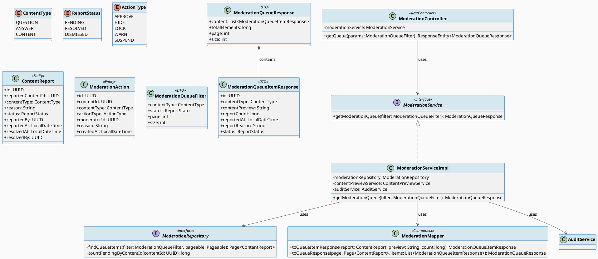
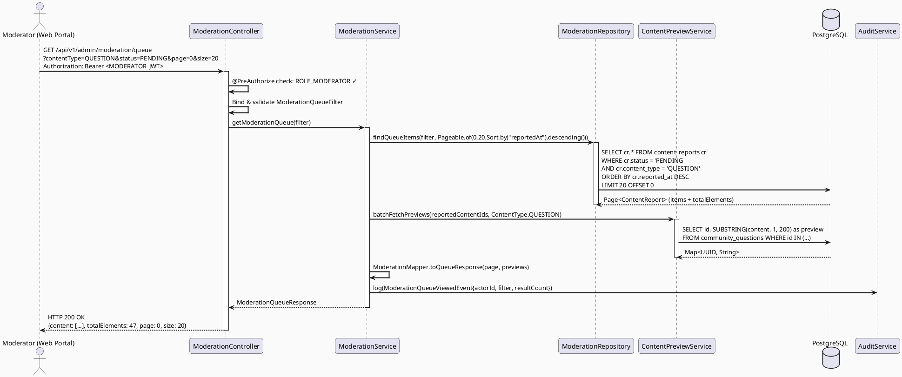
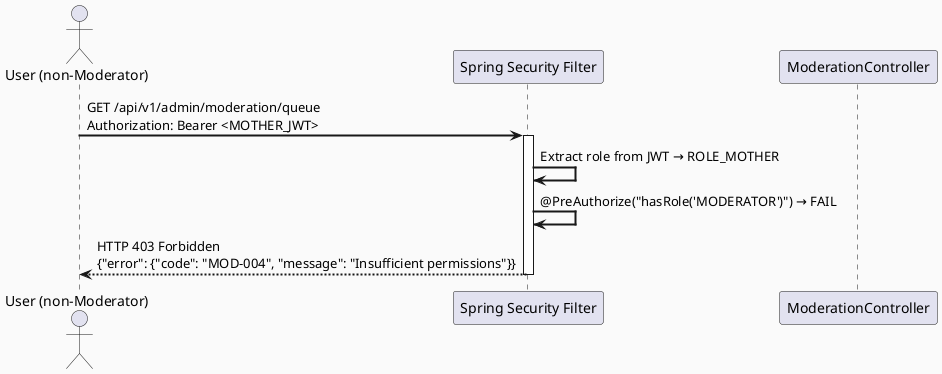
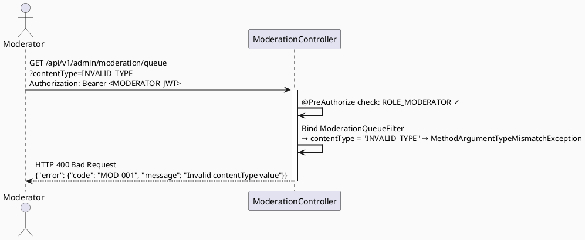
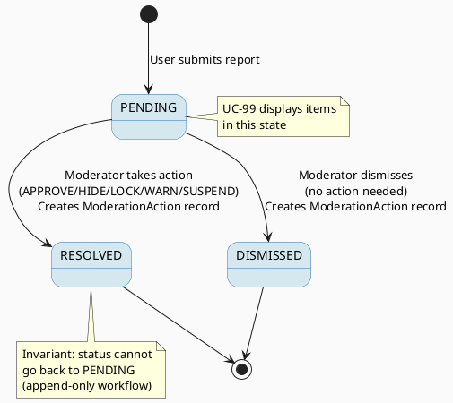

# ENGINEERING DOCUMENTATION STANDARD (EDS) v2.0
# Technical Design Specification — UC-99: View Moderation Queue

| Field              | Value                                   |
| ------------------ | --------------------------------------- |
| **Document ID**    | `CB-MOD-IMP-001`                        |
| **Version**        | `1.0`                                   |
| **Date**           | `2026-06-23`                            |
| **Status**         | `Approved`                              |
| **Document Owner** | `HuyND`                                 |
| **Author**         | `AI Agent — Winston (System Architect)` |
| **Reviewed by**    | `[ ] Pending`                           |
| **DPO Sign-off**   | `[ ] Pending`                           |
| **Approved by**    | `[ ] Pending`                           |
| **Last Review**    | `2026-06-23`                            |
| **Based on EDS**   | `v2.0`                                  |

---

## CHANGELOG

| Ngày       | Người thực hiện    | Nội dung thay đổi                                          |
| ---------- | ------------------ | ---------------------------------------------------------- |
| 2026-06-23 | AI Agent — Winston | Tạo tài liệu lần đầu — TDS cho UC-99 View Moderation Queue |

---

## MỤC LỤC

1. [Tổng quan Module](#1-tổng-quan-module)
2. [Ma trận Truy vết](#2-ma-trận-truy-vết)
3. [Architecture Decision Records (ADR)](#3-architecture-decision-records-adr)
4. [Non-Functional Requirements & SLA](#4-non-functional-requirements--sla)
5. [Static Modeling](#5-static-modeling)
6. [Dynamic Modeling](#6-dynamic-modeling)
7. [Domain Event Catalog](#7-domain-event-catalog)
8. [Interface Specification](#8-interface-specification)
9. [API Specification](#9-api-specification)
10. [Bảng mã lỗi](#10-bảng-mã-lỗi)
11. [Quy trình Triển khai](#11-quy-trình-triển-khai)
12. [Rollback & Incident Runbook](#12-rollback--incident-runbook)
13. [Kịch bản Kiểm thử Chi tiết](#13-kịch-bản-kiểm-thử-chi-tiết)
14. [Phương pháp Xác minh](#14-phương-pháp-xác-minh)
15. [API Verification Samples](#15-api-verification-samples)
16. [Authorization Matrix](#16-authorization-matrix)
17. [AI Prompt Constraints (CASE 2.0)](#17-ai-prompt-constraints-case-20)

---

## 1. Tổng quan Module

| Field                     | Value                                                                                                                             |
| ------------------------- | --------------------------------------------------------------------------------------------------------------------------------- |
| **UC ID**                 | `UC-99`                                                                                                                           |
| **Module Name**           | `View Moderation Queue`                                                                                                           |
| **Bounded Context**       | `content` + `community`                                                                                                           |
| **Primary Actor**         | `Community Moderator (ROLE_MODERATOR)`                                                                                            |
| **Platform**              | `Admin Web Portal`                                                                                                                |
| **Priority**              | `High — Frequent`                                                                                                                 |
| **Data Classification**   | `Internal`                                                                                                                        |
| **Compliance Scope**      | `N/A`                                                                                                                             |
| **Upstream Dependencies** | `security (JWT auth)`, `community (CommunityQuestion, CommunityAnswer)`, `content (ContentReport, ModerationAction, ContentItem)` |
| **Downstream Consumers**  | `Moderation Action API (UC-100)`, `Audit module`                                                                                  |

**Mô tả:**
UC-99 cho phép Community Moderator xem danh sách các nội dung (bài đăng, câu trả lời, câu hỏi) đang chờ kiểm duyệt. Queue hiển thị các `ContentReport` có trạng thái `PENDING`, bao gồm preview nội dung, số lượng báo cáo, lý do báo cáo, và thời gian. Moderator có thể lọc theo `contentType` và phân trang kết quả. Đây là điểm vào chính cho toàn bộ quy trình moderation.

---

## 2. Ma trận Truy vết

| Requirement ID | Loại          | Mô tả yêu cầu                                            | Thành phần Code                         | Compliance Target | ADR liên quan |
| -------------- | ------------- | -------------------------------------------------------- | --------------------------------------- | ----------------- | ------------- |
| UC-99          | Use Case      | Hiển thị queue kiểm duyệt với filter và phân trang       | `ModerationController.getQueue()`       | —                 | ADR-001       |
| BR-RBAC-001    | Business Rule | Chỉ MODERATOR mới được truy cập moderation queue         | `@PreAuthorize("hasRole('MODERATOR')")` | —                 | ADR-002       |
| BR-MOD-001     | Business Rule | Chỉ hiển thị report có status = PENDING theo mặc định    | `ModerationService.getQueue()`          | —                 | ADR-001       |
| BR-MOD-002     | Business Rule | Hỗ trợ filter theo contentType (QUESTION/ANSWER/CONTENT) | `ModerationQueueFilter`                 | —                 | ADR-001       |
| BR-MOD-003     | Business Rule | Kết quả phân trang, sắp xếp theo reportedAt DESC         | `ModerationRepository.findByFilter()`   | —                 | ADR-001       |
| BR-AUDIT-001   | Business Rule | Mọi lần xem queue phải được audit log                    | `AuditService.log()`                    | —                 | ADR-003       |
| SRS-3.2.2.1    | Functional    | Màn hình moderation queue trong Admin Web Portal         | `GET /api/v1/admin/moderation/queue`    | —                 | —             |

---

## 3. Architecture Decision Records (ADR)

### ADR-001 — Aggregated Report View Pattern

| Field          | Value                      |
| -------------- | -------------------------- |
| **Status**     | `Accepted`                 |
| **Deciders**   | `HuyND — System Architect` |
| **Date**       | `2026-06-23`               |
| **Supersedes** | —                          |

#### Bối cảnh
Moderation queue cần hiển thị nội dung từ nhiều bảng khác nhau (`CommunityQuestion`, `CommunityAnswer`, `ContentItem`) thông qua bảng `ContentReport`. Cần quyết định giữa cách JOIN trong database hay aggregate trong service layer.

#### Các phương án đã xem xét

| Phương án | Mô tả                                                                      | Ưu điểm                                     | Nhược điểm                            |
| --------- | -------------------------------------------------------------------------- | ------------------------------------------- | ------------------------------------- |
| A         | JOIN SQL trực tiếp cross-table                                             | Hiệu năng query tốt, 1 round trip           | Query phức tạp, khó maintain          |
| B         | Aggregate tại Service layer — query ContentReport, rồi fetch preview riêng | Rõ ràng, dễ test, đúng layered architecture | 2 round trips, cần cache nếu load cao |

#### Quyết định
Chọn **Phương án B** vì phù hợp với layered architecture của dự án, dễ test từng layer riêng, và load của moderation queue thấp (internal tool).

#### Hệ quả

**Tích cực:**
- Controller-Service-Repository separation rõ ràng
- Dễ mock test từng layer
- Dễ extend thêm contentType mới

**Tiêu cực / Trade-offs:**
- 2 DB round trips thay vì 1 — giảm thiểu bằng cách paginate ContentReport trước, rồi batch-fetch content preview

**Compliance Impact:** N/A

---

### ADR-002 — RBAC Enforcement tại Controller Layer

| Field        | Value                      |
| ------------ | -------------------------- |
| **Status**   | `Accepted`                 |
| **Deciders** | `HuyND — System Architect` |
| **Date**     | `2026-06-23`               |

#### Bối cảnh
Moderation endpoint là endpoint nhạy cảm — chỉ MODERATOR mới được phép. Cần enforce RBAC ở đúng layer.

#### Quyết định
Dùng Spring Security `@PreAuthorize("hasRole('MODERATOR')")` annotation tại Controller level. Service layer không duplicate check này. Method security được enable qua `@EnableMethodSecurity`.

#### Hệ quả

**Tích cực:** Centralized, declarative, dễ audit.

**Tiêu cực:** Controller phải không chứa business logic khác — chỉ delegate sang Service.

---

### ADR-003 — Audit Logging cho Read Operations

| Field        | Value                      |
| ------------ | -------------------------- |
| **Status**   | `Accepted`                 |
| **Deciders** | `HuyND — System Architect` |
| **Date**     | `2026-06-23`               |

#### Bối cảnh
Việc moderator xem queue là hành động nhạy cảm. Cần log để traceability.

#### Quyết định
Service layer gọi `AuditService.log()` sau khi lấy dữ liệu thành công. Audit log ghi nhận: `actorId`, `action = MODERATION_QUEUE_VIEWED`, `filter params`, `resultCount`, `timestamp`.

---

## 4. Non-Functional Requirements & SLA

### 4.1. Performance & Availability

| Category     | Requirement           | Target SLA | Measurement Method | Compliance Basis |
| ------------ | --------------------- | ---------- | ------------------ | ---------------- |
| Latency      | API response (p99)    | `< 300ms`  | k6 load test       | —                |
| Availability | Uptime (monthly)      | `99.5%`    | Uptime monitor     | —                |
| Throughput   | Concurrent moderators | `50 req/s` | Load test          | —                |
| Pagination   | Max page size         | `50 items` | API validation     | —                |

### 4.2. Data Integrity & Retention

| Category  | Requirement                      | Target           | Verification Method | Compliance Basis |
| --------- | -------------------------------- | ---------------- | ------------------- | ---------------- |
| Read-only | Queue là view-only, không modify | 0 write ops      | Code review         | —                |
| Freshness | Data không cached quá lâu        | `< 5s staleness` | Kiểm tra cache TTL  | —                |

### 4.3. Security

| Category              | Requirement                                  | Target          | Verification Method | Compliance Basis |
| --------------------- | -------------------------------------------- | --------------- | ------------------- | ---------------- |
| Encryption in transit | All endpoints                                | TLS 1.3+        | SSL Labs scan       | —                |
| Access control        | MODERATOR role only                          | Least privilege | Auth Matrix (§16)   | —                |
| Content preview       | Preview truncated, không expose full content | Max 200 chars   | Code review         | —                |

### 4.4. Scalability

Dự kiến tải: 5-10 moderators concurrent, ~1000 pending reports tại đỉnh. Page size cố định 20-50. Không cần horizontal scale đặc biệt cho MVP.

---

## 5. Static Modeling

### 5.1. Class Diagram (PlantUML)



### 5.2. JPA Entity Definitions

```java
// com.carebridge.backend.content.entity.ContentReport
@Entity
@Table(name = "content_reports")
@Getter @Setter @NoArgsConstructor
public class ContentReport {

    @Id
    @GeneratedValue(strategy = GenerationType.UUID)
    @Column(columnDefinition = "uuid")
    private UUID id;

    @Column(name = "reported_content_id", nullable = false, columnDefinition = "uuid")
    private UUID reportedContentId;

    @Enumerated(EnumType.STRING)
    @Column(name = "content_type", nullable = false, length = 20)
    private ContentType contentType;  // QUESTION | ANSWER | CONTENT

    @Column(name = "reason", nullable = false, length = 500)
    private String reason;

    @Enumerated(EnumType.STRING)
    @Column(name = "status", nullable = false, length = 20)
    private ReportStatus status;  // PENDING | RESOLVED | DISMISSED

    @Column(name = "reported_by", nullable = false, columnDefinition = "uuid")
    private UUID reportedBy;

    @Column(name = "reported_at", nullable = false)
    private LocalDateTime reportedAt;

    @Column(name = "resolved_at")
    private LocalDateTime resolvedAt;

    @Column(name = "resolved_by", columnDefinition = "uuid")
    private UUID resolvedBy;
}

// com.carebridge.backend.content.entity.ModerationAction
@Entity
@Table(name = "moderation_actions")
@Getter @Setter @NoArgsConstructor
public class ModerationAction {

    @Id
    @GeneratedValue(strategy = GenerationType.UUID)
    @Column(columnDefinition = "uuid")
    private UUID id;

    @Column(name = "content_id", nullable = false, columnDefinition = "uuid")
    private UUID contentId;

    @Enumerated(EnumType.STRING)
    @Column(name = "content_type", nullable = false, length = 20)
    private ContentType contentType;

    @Enumerated(EnumType.STRING)
    @Column(name = "action_type", nullable = false, length = 20)
    private ActionType actionType;  // APPROVE | HIDE | LOCK | WARN | SUSPEND

    @Column(name = "moderator_id", nullable = false, columnDefinition = "uuid")
    private UUID moderatorId;

    @Column(name = "reason", length = 500)
    private String reason;

    @Column(name = "created_at", nullable = false)
    private LocalDateTime createdAt;
}

// Enums — com.carebridge.backend.content.entity
public enum ContentType { QUESTION, ANSWER, CONTENT }
public enum ReportStatus { PENDING, RESOLVED, DISMISSED }
public enum ActionType { APPROVE, HIDE, LOCK, WARN, SUSPEND }
```

---

## 6. Dynamic Modeling

### 6.1. Sequence Diagram — Happy Path



### 6.2. Sequence Diagram — Error Path (Unauthorized)



### 6.3. Sequence Diagram — Error Path (Invalid Filter)



### 6.4. State Machine — ContentReport Status



---

## 7. Domain Event Catalog

### 7.1. Events Published (Phát ra)

| Event Name              | Trigger                            | Publisher               | Subscriber(s)  | Payload Schema | Async?          |
| ----------------------- | ---------------------------------- | ----------------------- | -------------- | -------------- | --------------- |
| `ModerationQueueViewed` | Moderator calls GET queue endpoint | `ModerationServiceImpl` | `AuditService` | See 7.3        | No (sync audit) |

### 7.2. Events Consumed (Tiêu thụ)

| Event Name        | Source             | Handler                          | Action thực hiện                     |
| ----------------- | ------------------ | -------------------------------- | ------------------------------------ |
| `ContentReported` | `community` module | `ContentReportRepository.save()` | Tạo ContentReport với status=PENDING |

### 7.3. Payload Schema

```java
// ModerationQueueViewedEvent.java
public record ModerationQueueViewedEvent(
    String eventId,          // UUID
    String eventType,        // "ModerationQueueViewed"
    LocalDateTime occurredAt,
    String version,          // "1.0"
    UUID actorId,            // moderatorId
    ContentType contentType, // filter used
    ReportStatus status,     // filter used
    int resultCount,
    String correlationId
) {}
```

---

## 8. Interface Specification

### 8.1. Service Interface

```java
// com.carebridge.backend.content.service.ModerationService
// @version 1.0

package com.carebridge.backend.content.service;

/**
 * Service contract for moderation queue operations.
 * @version 1.0
 */
public interface ModerationService {

    /**
     * Returns a paginated, filtered view of the moderation queue.
     * Only returns ContentReports with status=PENDING by default.
     * @param filter - contentType filter, status filter, pagination params
     * @return paginated ModerationQueueResponse
     * @throws ModerationException (MOD-005) on internal error
     */
    ModerationQueueResponse getModerationQueue(ModerationQueueFilter filter);
}
```

### 8.2. Repository Interface

```java
// com.carebridge.backend.content.repository.ModerationRepository
// @version 1.0

package com.carebridge.backend.content.repository;

public interface ModerationRepository extends JpaRepository<ContentReport, UUID> {

    /**
     * Finds content reports matching the given filter, ordered by reportedAt DESC.
     */
    Page<ContentReport> findByStatusAndContentType(
        ReportStatus status,
        ContentType contentType,
        Pageable pageable
    );

    Page<ContentReport> findByStatus(ReportStatus status, Pageable pageable);

    long countByReportedContentIdAndStatus(UUID reportedContentId, ReportStatus status);
}
```

### 8.3. DTO Definitions

```java
// ModerationQueueFilter.java
public record ModerationQueueFilter(
    @Nullable ContentType contentType,
    @NotNull ReportStatus status,          // defaults to PENDING
    @Min(0) int page,
    @Min(1) @Max(50) int size
) {
    public ModerationQueueFilter {
        if (status == null) status = ReportStatus.PENDING;
        if (size == 0) size = 20;
    }
}

// ModerationQueueItemResponse.java
public record ModerationQueueItemResponse(
    UUID id,
    ContentType contentType,
    String contentPreview,    // max 200 chars
    long reportCount,
    LocalDateTime reportedAt,
    String reportReason,
    ReportStatus status
) {}

// ModerationQueueResponse.java
public record ModerationQueueResponse(
    List<ModerationQueueItemResponse> content,
    long totalElements,
    int page,
    int size
) {}
```

---

## 9. API Specification

### 9.1. Endpoints Table

| Method | Path                             | Auth Level | Required Roles   | Rate Limit | Idempotent? |
| ------ | -------------------------------- | ---------- | ---------------- | ---------- | ----------- |
| `GET`  | `/api/v1/admin/moderation/queue` | JWT Bearer | `ROLE_MODERATOR` | 120/min    | Yes         |

### 9.2. Request / Response Schemas

#### `GET /api/v1/admin/moderation/queue`

**Query Parameters:**

| Parameter     | Type                               | Required | Default   | Description             |
| ------------- | ---------------------------------- | -------- | --------- | ----------------------- |
| `contentType` | `QUESTION \| ANSWER \| CONTENT`    | No       | (all)     | Filter by content type  |
| `status`      | `PENDING \| RESOLVED \| DISMISSED` | No       | `PENDING` | Filter by report status |
| `page`        | `integer`                          | No       | `0`       | Page number (0-indexed) |
| `size`        | `integer`                          | No       | `20`      | Page size (max 50)      |

**Response — 200 OK (Happy Path):**
```json
{
  "content": [
    {
      "id": "550e8400-e29b-41d4-a716-446655440001",
      "contentType": "QUESTION",
      "contentPreview": "Tôi bị chóng mặt nhiều trong tuần này...",
      "reportCount": 3,
      "reportedAt": "2026-06-22T14:30:00.000Z",
      "reportReason": "Nội dung không phù hợp",
      "status": "PENDING"
    },
    {
      "id": "550e8400-e29b-41d4-a716-446655440002",
      "contentType": "ANSWER",
      "contentPreview": "Bạn nên dùng thuốc X ngay lập tức...",
      "reportCount": 7,
      "reportedAt": "2026-06-22T10:15:00.000Z",
      "reportReason": "Tư vấn y tế sai lệch",
      "status": "PENDING"
    }
  ],
  "totalElements": 47,
  "page": 0,
  "size": 20
}
```

**Response — 400 Bad Request (Invalid Filter):**
```json
{
  "error": {
    "code": "MOD-001",
    "message": "Invalid filter parameter",
    "details": [
      { "field": "contentType", "message": "Must be one of: QUESTION, ANSWER, CONTENT" }
    ]
  }
}
```

**Response — 401 Unauthorized (Missing/Invalid JWT):**
```json
{
  "error": {
    "code": "IAM-001",
    "message": "Authentication required"
  }
}
```

**Response — 403 Forbidden (Wrong Role):**
```json
{
  "error": {
    "code": "MOD-004",
    "message": "Insufficient permissions — MODERATOR role required"
  }
}
```

**Response — 500 Internal Server Error:**
```json
{
  "error": {
    "code": "MOD-005",
    "message": "Internal server error"
  }
}
```

---

## 10. Bảng mã lỗi

| Code      | HTTP Status | Message (EN)              | Message (VI)                       | Trigger Condition                               |
| --------- | ----------- | ------------------------- | ---------------------------------- | ----------------------------------------------- |
| `MOD-001` | 400         | Invalid filter parameter  | Tham số lọc không hợp lệ           | contentType hoặc status không thuộc enum hợp lệ |
| `MOD-002` | 400         | Page size exceeds maximum | Kích thước trang vượt quá giới hạn | size > 50                                       |
| `MOD-003` | 404         | Report not found          | Không tìm thấy báo cáo             | reportId không tồn tại (dùng cho sub-features)  |
| `MOD-004` | 403         | Insufficient permissions  | Không đủ quyền                     | User không có ROLE_MODERATOR                    |
| `MOD-005` | 500         | Internal server error     | Lỗi hệ thống                       | DB error hoặc unhandled exception               |
| `MOD-006` | 401         | Authentication required   | Yêu cầu xác thực                   | JWT thiếu hoặc không hợp lệ                     |

---

## 11. Quy trình Triển khai

### 11.1. Prerequisites

- [ ] ADR-001, ADR-002, ADR-003 đã được Accepted
- [ ] Spring Security đã được cấu hình với `@EnableMethodSecurity`
- [ ] Tables `content_reports` và `moderation_actions` tồn tại trong DB
- [ ] Môi trường staging đã sẵn sàng

### 11.2. Pre-Migration Checklist

- [ ] Đã backup DB: `pg_dump -h [host] -U carebridge carebridge_db > backup_20260623.sql`
- [ ] Migration cho `content_reports` và `moderation_actions` đã chạy trên staging ≥ 24 giờ
- [ ] Rollback script đã được test trên staging

### 11.3. Implementation Steps

#### Chặng 1 — Database Migration

```sql
-- db/migration/V20260623__create_content_reports_moderation_actions.sql

CREATE TYPE content_type_enum AS ENUM ('QUESTION', 'ANSWER', 'CONTENT');
CREATE TYPE report_status_enum AS ENUM ('PENDING', 'RESOLVED', 'DISMISSED');
CREATE TYPE action_type_enum AS ENUM ('APPROVE', 'HIDE', 'LOCK', 'WARN', 'SUSPEND');

CREATE TABLE content_reports (
    id UUID PRIMARY KEY DEFAULT gen_random_uuid(),
    reported_content_id UUID NOT NULL,
    content_type content_type_enum NOT NULL,
    reason VARCHAR(500) NOT NULL,
    status report_status_enum NOT NULL DEFAULT 'PENDING',
    reported_by UUID NOT NULL,
    reported_at TIMESTAMP NOT NULL DEFAULT NOW(),
    resolved_at TIMESTAMP,
    resolved_by UUID
);

CREATE INDEX idx_content_reports_status ON content_reports(status);
CREATE INDEX idx_content_reports_content_type ON content_reports(content_type);
CREATE INDEX idx_content_reports_reported_at ON content_reports(reported_at DESC);

CREATE TABLE moderation_actions (
    id UUID PRIMARY KEY DEFAULT gen_random_uuid(),
    content_id UUID NOT NULL,
    content_type content_type_enum NOT NULL,
    action_type action_type_enum NOT NULL,
    moderator_id UUID NOT NULL,
    reason VARCHAR(500),
    created_at TIMESTAMP NOT NULL DEFAULT NOW()
);

CREATE INDEX idx_moderation_actions_content_id ON moderation_actions(content_id);
```

#### Chặng 2 — Backend Implementation

```
Thứ tự implement:
1. Enums: ContentType, ReportStatus, ActionType
2. Entities: ContentReport, ModerationAction (§5.2)
3. Repository: ModerationRepository (§8.2)
4. DTOs: ModerationQueueFilter, ModerationQueueItemResponse, ModerationQueueResponse (§8.3)
5. Service Interface: ModerationService (§8.1)
6. Service Impl: ModerationServiceImpl
7. Mapper: ModerationMapper
8. Controller: ModerationController với @PreAuthorize
9. Exception handlers: MOD-001 thông qua GlobalExceptionHandler
```

#### Chặng 3 — Verification sau deploy

```bash
# Health check
curl -X GET https://api.carebridge.vn/actuator/health
# Expected: {"status": "UP"}

# Smoke test (với MODERATOR token)
curl -X GET "https://api.carebridge.vn/api/v1/admin/moderation/queue?status=PENDING&page=0&size=5" \
  -H "Authorization: Bearer $MODERATOR_TOKEN"
# Expected: 200 với JSON response
```

### 11.4. Deployment Checklist

- [ ] Migration chạy thành công
- [ ] Health check endpoint trả về 200
- [ ] Error rate < 1% trong 10 phút đầu
- [ ] Audit log đang sinh ra event `ModerationQueueViewed`

---

## 12. Rollback & Incident Runbook

### 12.1. Điều kiện kích hoạt Rollback

| Điều kiện                | Ngưỡng            | Người quyết định |
| ------------------------ | ----------------- | ---------------- |
| Error rate tăng đột biến | > 5% trong 5 phút | On-call Engineer |
| Latency p99 vượt ngưỡng  | > 600ms           | On-call Engineer |
| 403 sai cho MODERATOR    | Bất kỳ case nào   | Tech Lead        |
| Audit log ngừng          | > 1 phút          | On-call Engineer |

### 12.2. Rollback Procedure

```bash
# Bước 1: Re-deploy phiên bản cũ
kubectl rollout undo deployment/carebridge-api

# Bước 2: Verify rollback thành công
kubectl rollout status deployment/carebridge-api

# Bước 3: Revert DB migration nếu cần (chỉ khi schema mới gây lỗi)
# Không DROP TABLE — chỉ đổi app về version cũ

# Bước 4: Smoke test
curl -X GET https://api.carebridge.vn/actuator/health
```

### 12.3. Notification Protocol

| Thời điểm          | Người nhận   | Kênh              | Template                        |
| ------------------ | ------------ | ----------------- | ------------------------------- |
| Ngay khi phát hiện | On-call team | Slack `#incident` | "INCIDENT [MOD-QUEUE]: [mô tả]" |
| Trong 30 phút      | Tech Lead    | Slack DM          | Báo cáo tóm tắt                 |

### 12.4. Post-Incident Review

Hoàn thành PIR document trong 48 giờ sau khi resolve.

---

## 13. Kịch bản Kiểm thử Chi tiết

### 13.1. Unit Tests

#### TC-UNIT-001 — getModerationQueue trả về danh sách PENDING đúng

```gherkin
Feature: View Moderation Queue
  Background:
    Given test data classification: SYNTHETIC
    And ModerationRepository đã được mock
    And có 3 ContentReport với status=PENDING, contentType=QUESTION

  Scenario: Happy path — lấy queue với filter QUESTION/PENDING
    Given filter = {contentType: QUESTION, status: PENDING, page: 0, size: 20}
    When ModerationServiceImpl.getModerationQueue(filter) được gọi
    Then ModerationRepository.findByStatusAndContentType() được gọi 1 lần
    And kết quả có totalElements = 3
    And mỗi item có status = PENDING
    And mỗi item có contentType = QUESTION
    And AuditService.log() được gọi 1 lần với event ModerationQueueViewed

  Scenario: Không có filter contentType — trả về tất cả contentType
    Given filter = {contentType: null, status: PENDING, page: 0, size: 20}
    When ModerationServiceImpl.getModerationQueue(filter) được gọi
    Then ModerationRepository.findByStatus() được gọi (không filter contentType)
    And kết quả chứa QUESTION, ANSWER, CONTENT items
```

**Hàm được test:** `ModerationServiceImpl.getModerationQueue()`
**Invariant kiểm tra:** Chỉ trả về items khớp filter; AuditService luôn được gọi

#### TC-UNIT-002 — contentPreview bị truncate đúng 200 ký tự

```gherkin
  Scenario: Preview content dài hơn 200 ký tự
    Given một ContentReport có content = "A".repeat(500)
    When ContentPreviewService.fetchPreview() được gọi
    Then preview trả về có length <= 200
    And preview kết thúc bằng "..."
```

### 13.2. Integration Tests

#### TC-INT-001 — API endpoint trả về đúng kết quả từ DB

```gherkin
  Scenario: Integration — query từ DB thực
    Given test data classification: SYNTHETIC
    And database đang chạy với seed data:
      | id | contentType | status  | reportedAt          |
      | 1  | QUESTION    | PENDING | 2026-06-22T10:00:00 |
      | 2  | ANSWER      | PENDING | 2026-06-22T11:00:00 |
      | 3  | QUESTION    | RESOLVED| 2026-06-21T09:00:00 |
    When GET /api/v1/admin/moderation/queue?status=PENDING được gọi với MODERATOR JWT
    Then response status là 200
    And response.content có 2 items (id 1 và 2)
    And response.totalElements = 2
    And items được sắp xếp theo reportedAt DESC (id 2 trước)
    And item với id=3 (RESOLVED) không có trong kết quả
```

### 13.3. Security Tests

#### TC-SEC-001 — Non-moderator bị từ chối (403)

```gherkin
  Scenario: User có ROLE_MOTHER cố truy cập moderation queue
    Given test data classification: SYNTHETIC
    And user với ROLE_MOTHER đã đăng nhập, có JWT hợp lệ
    When GET /api/v1/admin/moderation/queue được gọi với MOTHER JWT
    Then response status là 403
    And response body chứa error code MOD-004
    And không có dữ liệu queue nào bị lộ

  Scenario: Request không có JWT
    When GET /api/v1/admin/moderation/queue được gọi không có Authorization header
    Then response status là 401
    And response body chứa error code MOD-006
```

#### TC-SEC-002 — Invalid JWT bị từ chối

```gherkin
  Scenario: JWT bị giả mạo
    Given JWT với chữ ký không hợp lệ
    When GET /api/v1/admin/moderation/queue được gọi với fake JWT
    Then response status là 401
```

---

## 14. Phương pháp Xác minh

### 14.1. Database Inspection

```sql
-- Verify content_reports table có data đúng
SELECT id, content_type, status, reported_at
FROM content_reports
WHERE status = 'PENDING'
ORDER BY reported_at DESC
LIMIT 10;

-- Verify index hoạt động
EXPLAIN SELECT * FROM content_reports WHERE status = 'PENDING' ORDER BY reported_at DESC;
-- Expected: Index Scan using idx_content_reports_status

-- Verify không có UPDATE/DELETE trên content_reports (audit)
SELECT schemaname, tablename, n_tup_upd, n_tup_del
FROM pg_stat_user_tables
WHERE tablename = 'content_reports';
-- n_tup_del phải = 0
```

### 14.2. Log / Audit Verification

```bash
# Kiểm tra audit event được ghi sau khi moderator xem queue
grep '"eventType":"ModerationQueueViewed"' /var/log/carebridge/audit.log | tail -5

# Verify log có đủ fields
grep '"eventType":"ModerationQueueViewed"' /var/log/carebridge/audit.log \
  | jq '{actorId, occurredAt, correlationId, resultCount}'

# Kiểm tra không có PII trong app log
grep -i "password\|phone\|email" /var/log/carebridge/app.log
# Expected: No output
```

---

## 15. API Verification Samples

### 15.1. Happy Path

```bash
# Lấy moderation queue với filter QUESTION, status PENDING
export MODERATOR_TOKEN="eyJhbGc..."

curl -X GET "https://api.carebridge.vn/api/v1/admin/moderation/queue?contentType=QUESTION&status=PENDING&page=0&size=20" \
  -H "Authorization: Bearer $MODERATOR_TOKEN" \
  -H "Content-Type: application/json" \
  -H "X-Correlation-Id: $(uuidgen)"
```

**Expected Response (200):**
```json
{
  "content": [
    {
      "id": "550e8400-e29b-41d4-a716-446655440001",
      "contentType": "QUESTION",
      "contentPreview": "Tôi bị chóng mặt nhiều trong tuần này, có nên...",
      "reportCount": 3,
      "reportedAt": "2026-06-22T14:30:00.000Z",
      "reportReason": "Nội dung không phù hợp",
      "status": "PENDING"
    }
  ],
  "totalElements": 12,
  "page": 0,
  "size": 20
}
```

### 15.2. Error Paths

```bash
# Invalid contentType → 400
curl -X GET "https://api.carebridge.vn/api/v1/admin/moderation/queue?contentType=INVALID" \
  -H "Authorization: Bearer $MODERATOR_TOKEN"
```

**Expected Response (400):**
```json
{
  "error": {
    "code": "MOD-001",
    "message": "Invalid filter parameter",
    "details": [{ "field": "contentType", "message": "Must be one of: QUESTION, ANSWER, CONTENT" }]
  }
}
```

```bash
# Wrong role → 403
curl -X GET "https://api.carebridge.vn/api/v1/admin/moderation/queue" \
  -H "Authorization: Bearer $MOTHER_TOKEN"
```

**Expected Response (403):**
```json
{
  "error": {
    "code": "MOD-004",
    "message": "Insufficient permissions — MODERATOR role required"
  }
}
```

---

## 16. Authorization Matrix

| Endpoint                             | `MOTHER` | `FAMILY_MEMBER` | `EXPERT` | `MODERATOR` | `CONTENT_ADMIN` | `SYSTEM_ADMIN` |
| ------------------------------------ | -------- | --------------- | -------- | ----------- | --------------- | -------------- |
| `GET /api/v1/admin/moderation/queue` | ❌        | ❌               | ❌        | ✅           | ❌               | ✅ All          |

**Chú thích:**
- ✅ = Được phép
- ❌ = Bị từ chối (403)
- `SYSTEM_ADMIN` có quyền truy cập mọi admin endpoint

---

## 17. AI Prompt Constraints (CASE 2.0)

### 17.1 Constraint Summary Table

| #   | Constraint                                                                                              | Source (ADR/BR) | Last Verified |
| --- | ------------------------------------------------------------------------------------------------------- | --------------- | ------------- |
| C1  | Controller PHẢI dùng `@PreAuthorize("hasRole('MODERATOR')")` — không để business logic trong controller | `ADR-002`       | `2026-06-23`  |
| C2  | Service PHẢI gọi `AuditService.log()` sau mỗi lần lấy moderation queue thành công                       | `ADR-003`       | `2026-06-23`  |
| C3  | Repository PHẢI dùng Spring Data JPA `JpaRepository` — không viết native SQL trong repository interface | `ADR-001`       | `2026-06-23`  |
| C4  | Content preview PHẢI truncate tại 200 ký tự — không trả về full content trong queue listing             | `BR-MOD-002`    | `2026-06-23`  |
| C5  | Default sort order PHẢI là `reportedAt DESC` — items mới nhất hiển thị đầu tiên                         | `BR-MOD-003`    | `2026-06-23`  |
| C6  | Page size tối đa là 50 — từ chối request với `size > 50` bằng lỗi `MOD-002`                             | `BR-MOD-003`    | `2026-06-23`  |

### 17.2 Constraint Injection Block

```
[CONSTRAINT BLOCK — Module: View Moderation Queue]
Theo TDS CB-MOD-IMP-001 và các ADR liên quan:

1. [C1] Controller ModerationController PHẢI có @PreAuthorize("hasRole('MODERATOR')") trên method getQueue(). Controller KHÔNG được chứa business logic.
2. [C2] ModerationServiceImpl.getModerationQueue() PHẢI gọi AuditService.log(ModerationQueueViewedEvent) sau khi lấy data thành công.
3. [C3] ModerationRepository extends JpaRepository<ContentReport, UUID>. KHÔNG viết @Query SQL phức tạp — dùng Spring Data method naming convention.
4. [C4] ContentPreviewService PHẢI truncate preview tại 200 ký tự. Không bao giờ expose full content body trong queue response.
5. [C5] Kết quả luôn sort theo reportedAt DESC. PageRequest phải truyền Sort.by("reportedAt").descending().
6. [C6] ModerationQueueFilter validate size <= 50. Nếu size > 50, throw ModerationException với code MOD-002.

[CONTEXT BLOCK]
- Bounded Context: content + community
- Data Classification: Internal
- Compliance: N/A
- Existing interfaces: §8 Service Interface + §8.2 Repository Interface
- Error codes: §10 Error Codes Table
- Auth matrix: §16 Authorization Matrix

[TASK BLOCK]
Implement ModerationController, ModerationServiceImpl, ModerationRepository, ModerationMapper
thỏa mãn constraints C1-C6 trên.
Output phải tuân thủ §8 Interface Specification.
Tests phải cover §13 Test Scenarios.
```

### 17.3 Constraint Quality Checklist

- [x] Mỗi constraint traceable về ADR hoặc BR cụ thể
- [x] Không có constraint generic
- [x] Mỗi constraint có `Last Verified` date ≤ 2 sprints
- [x] Constraint block có ≥ 3 constraints cụ thể
- [x] Constraint block reference §8 Interface
- [x] Constraint block reference §16 Auth Matrix

### 17.4 Anti-Pattern Detection

| AP-ID     | Anti-Pattern          | Dấu hiệu                                                | Hành động                |
| --------- | --------------------- | ------------------------------------------------------- | ------------------------ |
| AP-AI-001 | Unconstrained Gen     | Code không check MODERATOR role                         | Reject — inject lại C1   |
| AP-AI-003 | Implicit Decision     | Code dùng cache layer không có trong ADR                | Reject — viết ADR trước  |
| AP-AI-005 | Hallucinated Contract | Code import `ContentModerationFacade` không có trong §8 | Reject — verify contract |

---

## PHỤ LỤC

### A. Glossary

| Thuật ngữ        | Định nghĩa                                                |
| ---------------- | --------------------------------------------------------- |
| Moderation Queue | Danh sách nội dung đang chờ kiểm duyệt                    |
| ContentReport    | Entity ghi nhận báo cáo của user về một nội dung          |
| ModerationAction | Entity ghi nhận hành động moderator đã thực hiện          |
| Content Preview  | Đoạn trích ngắn (max 200 chars) của nội dung được báo cáo |
| PENDING          | Trạng thái báo cáo chưa được xử lý                        |

### B. Tài liệu tham chiếu

| Document                     | Path                   |
| ---------------------------- | ---------------------- |
| SRS — Section 3.2.2.1        | `02_Requirements/SRS/` |
| CLAUDE.md — Entity Ownership | `CLAUDE.md §7`         |
| CLAUDE.md — Architecture     | `CLAUDE.md §2, §3`     |
