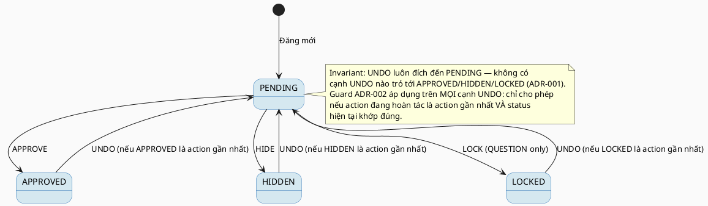
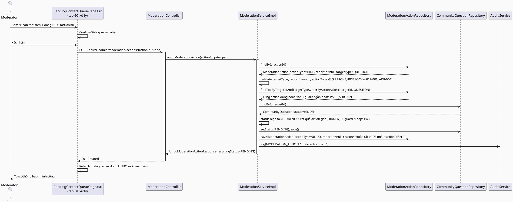
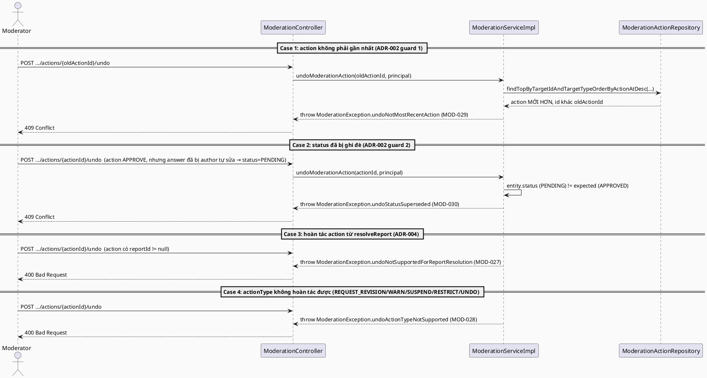

# ENGINEERING DOCUMENTATION STANDARD (EDS) v2.0
# Technical Design Specification — Hoàn tác (Undo) hành động kiểm duyệt trực tiếp

| Field              | Value                                   |
| ------------------ | ---------------------------------------- |
| **Document ID**    | `CB-MOD-IMP-009`                        |
| **Version**        | `1.0`                                   |
| **Date**           | `2026-07-10`                            |
| **Status**         | `Approved`                              |
| **Document Owner** | `HuyND`                                 |
| **Author**         | `AI Agent — Claude`                     |
| **Reviewed by**    | `[x] HuyND — 2026-07-10`                |
| **DPO Sign-off**   | `N/A` — Internal moderation audit trail, không xử lý PII export |
| **Approved by**    | `[x] HuyND — 2026-07-10 (xác nhận bằng lời "Approved")` |
| **Last Review**    | `2026-07-10`                            |
| **Based on EDS**   | `v2.0`                                  |

---

## CHANGELOG

| Ngày       | Người thực hiện | Nội dung thay đổi |
|------------|------------------|--------------------|
| 2026-07-10 | AI Agent — Claude | Tạo tài liệu lần đầu — TDS cho tính năng "Hoàn tác" ở tab "Đã xử lý" (Status=Draft). Ngữ nghĩa Undo (luôn về PENDING) và phạm vi (chỉ hành động trực tiếp UC-100, không undo được report-resolution UC-101) đã được người dùng xác nhận qua AskUserQuestion trước khi viết tài liệu này. |
| 2026-07-10 | HuyND | Approved qua chat ("Approved") — chuyển Status sang `Approved`, cho phép Phase 3 Implementation bắt đầu |

---

## MỤC LỤC

1. [Tổng quan Module](#1-tổng-quan-module)
2. [Ma trận Truy vết](#2-ma-trận-truy-vết)
3. [Architecture Decision Records (ADR)](#3-architecture-decision-records-adr)
4. [Non-Functional Requirements & SLA](#4-non-functional-requirements--sla)
5. [Static Modeling](#5-static-modeling)
6. [Dynamic Modeling](#6-dynamic-modeling)
7. [Domain Event Catalog](#7-domain-event-catalog)
8. [Interface Specification](#8-interface-specification)
9. [API Specification](#9-api-specification)
10. [Bảng mã lỗi](#10-bảng-mã-lỗi)
11. [Quy trình Triển khai](#11-quy-trình-triển-khai)
12. [Rollback & Incident Runbook](#12-rollback--incident-runbook)
13. [Kịch bản Kiểm thử Chi tiết](#13-kịch-bản-kiểm-thử-chi-tiết)
14. [Phương pháp Xác minh](#14-phương-pháp-xác-minh)
15. [API Verification Samples](#15-api-verification-samples)
16. [Authorization Matrix](#16-authorization-matrix)
17. [AI Prompt Constraints (CASE 2.0)](#17-ai-prompt-constraints-case-20)

---

## 1. Tổng quan Module

| Field                     | Value                                                                                                     |
| ------------------------- | ------------------------------------------------------------------------------------------------------- |
| **Feature ID**            | `CB-MOD-IMP-009`                                                                                          |
| **Liên quan UC**          | Mở rộng UC-100 (Moderate Community Content) — hoàn tác 1 `ModerationAction` do chính UC-100 tạo ra          |
| **Module Name**           | `Undo Moderation Action`                                                                                    |
| **Bounded Context**       | `content` (package hiện có, tái dùng `ModerationServiceImpl`/`ModerationController`)                       |
| **Primary Actor**         | `Community Moderator (ROLE_MODERATOR)`                                                                     |
| **Platform**              | `Admin Web Portal — /moderator/pending-content`, tab "Đã xử lý"                                             |
| **Priority**              | `Medium`                                                                                                     |
| **Data Classification**   | `Internal`                                                                                                   |
| **Compliance Scope**      | `N/A`                                                                                                        |
| **Upstream Dependencies** | `community (CommunityQuestion, CommunityAnswer, answer_count)`, `content (ModerationAction)`, `audit`       |
| **Downstream Consumers**  | `PendingContentQueuePage.tsx` (tab "Đã xử lý")                                                              |

**Bối cảnh:** Tab "Đã xử lý" của `/moderator/pending-content` hiện hoàn toàn read-only — không có bất kỳ hành động nào trên các dòng lịch sử (`ModerationHistoryItem`), kể cả khi moderator bấm nhầm (VD: Ẩn nhầm 1 câu hỏi hợp lệ). Người dùng yêu cầu thêm nút "Hoàn tác".

**Quyết định phạm vi đã được xác nhận với người dùng (qua AskUserQuestion, trước khi viết tài liệu này):**
1. **Ngữ nghĩa Undo: luôn đưa nội dung về trạng thái `PENDING`** (không cố khôi phục "trạng thái ngay trước đó" — `moderation_actions` không phải transition log đầy đủ: tự sửa bài của tác giả sau `REQUEST_REVISION` cũng âm thầm reset về PENDING mà không ghi `ModerationAction`, nên "trạng thái trước đó" không phải lúc nào cũng suy ra được đáng tin cậy).
2. Chỉ hoàn tác được **hành động gần nhất** của 1 target, và chỉ khi trạng thái hiện tại **khớp đúng** với kết quả mà hành động đó đã tạo ra (guard chống hoàn tác nhầm khi đã có hành động khác xảy ra sau đó).

**Phạm vi kỹ thuật bổ sung (quyết định thiết kế, sẽ present trong TDS này để người dùng duyệt cùng):**
- Chỉ hỗ trợ hoàn tác hành động **trực tiếp** (UC-100, `moderation_actions.report_id IS NULL`) trên `targetType ∈ {QUESTION, ANSWER}` với `actionType ∈ {APPROVE, HIDE, LOCK}`. **Không** hỗ trợ hoàn tác kết quả từ UC-101 (`resolveReport`, report_id khác null) — vì undo trường hợp đó còn phải revert cả `content_reports.status` về PENDING, phức tạp hơn và nằm ngoài yêu cầu ban đầu (chỉ nhắc tới tab "Đã xử lý" của Pending Content, vốn chỉ hiển thị action trực tiếp — xem ADR-004).
- `REQUEST_REVISION` không nằm trong danh sách hoàn tác được — hành động này *đã* đưa nội dung về PENDING, hoàn tác nó cũng là về PENDING → no-op vô nghĩa (xem ADR-001).

---

## 2. Ma trận Truy vết

| Requirement ID | Loại          | Mô tả yêu cầu                                                                                  | Thành phần Code                                    | ADR liên quan |
| --------------- | -------------- | -------------------------------------------------------------------------------------------- | ----------------------------------------------------- | --------------- |
| REQ-UNDO-001    | User Request  | Moderator hoàn tác được 1 hành động kiểm duyệt trực tiếp đã thực hiện nhầm                       | `ModerationController.undoModerationAction()`         | ADR-001         |
| BR-MOD-015      | Business Rule | Undo luôn đưa trạng thái về `PENDING`, không cố khôi phục trạng thái trước đó                    | `ModerationServiceImpl.undoModerationAction()`         | ADR-001         |
| BR-MOD-016      | Business Rule | Chỉ hoàn tác được hành động **gần nhất** của target đó — action cũ hơn bị từ chối (409)          | `ModerationServiceImpl.undoModerationAction()`         | ADR-002         |
| BR-MOD-017      | Business Rule | Chỉ hoàn tác khi status hiện tại của entity khớp đúng kết quả của action gốc — nếu đã bị ghi đè bởi thao tác khác thì từ chối (409) | `ModerationServiceImpl.undoModerationAction()`         | ADR-002         |
| BR-MOD-018      | Business Rule | Chỉ hoàn tác `actionType ∈ {APPROVE, HIDE, LOCK}`, không hoàn tác `REQUEST_REVISION`/`WARN`/`SUSPEND`/`RESTRICT`/chính `UNDO` | `ModerationServiceImpl.undoModerationAction()`         | ADR-001         |
| BR-MOD-019      | Business Rule | Chỉ hoàn tác action trực tiếp (`report_id IS NULL`) — không đụng vào action xuất phát từ resolve report | `ModerationServiceImpl.undoModerationAction()`         | ADR-004         |
| BR-MOD-020      | Business Rule | Undo 1 answer từng APPROVED phải giảm lại `community_questions.answer_count` — mirror đúng điều kiện của `moderateAnswer()` (chỉ khi rời khỏi APPROVED) | `ModerationServiceImpl.undoModerationAction()`         | ADR-003         |
| BR-MOD-021      | Business Rule | Undo tự nó được ghi lại append-only bằng 1 `ModerationAction` mới (`actionType=UNDO`), KHÔNG xoá/sửa action gốc | `ModerationServiceImpl.undoModerationAction()`         | ADR-005         |
| BR-RBAC-001     | Business Rule | Chỉ MODERATOR                                                                                    | `@PreAuthorize("hasRole('MODERATOR')")`                | ADR-006         |

---

## 3. Architecture Decision Records (ADR)

### ADR-001 — Ngữ nghĩa Undo: luôn về `PENDING`; loại trừ `REQUEST_REVISION`/`WARN`/`SUSPEND`/`RESTRICT`/`UNDO` khỏi phạm vi hoàn tác được

| Field          | Value                      |
| -------------- | --------------------------- |
| **Status**     | `Accepted` — người dùng đã chọn phương án này qua AskUserQuestion trước khi viết tài liệu |
| **Deciders**   | `HuyND — System Architect` (xác nhận qua AskUserQuestion) |
| **Date**       | `2026-07-10`                |

#### Bối cảnh
`moderation_actions` là append-only nhưng **không phải transition log đầy đủ**: `CommunityQuestionServiceImpl.editQuestion()`/answer tương tự âm thầm reset `status` về `PENDING` khi tác giả tự sửa bài sau khi bị `REQUEST_REVISION`, mà **không** ghi `ModerationAction` mới. Vì vậy, dò ngược "hành động liền trước" trong `moderation_actions` để suy ra "trạng thái trước đó" **không đáng tin cậy** — có thể bỏ sót 1 lần tự-sửa-bài ở giữa và khôi phục nhầm về trạng thái sai.

#### Các phương án đã xem xét

| Phương án | Mô tả | Ưu điểm | Nhược điểm |
| --------- | ----- | -------- | ----------- |
| A | Dò chuỗi `moderation_actions` theo `target_id`, lấy `actionType` của record liền trước để suy ra trạng thái cần khôi phục | "Đúng" hơn về mặt trực giác (khôi phục "trạng thái trước") | Sai trong trường hợp có tự-sửa-bài xen giữa (không ghi log) → có thể khôi phục nhầm về HIDDEN/LOCKED cũ trong khi tác giả đã sửa lại và đang chờ duyệt lần 2; cần thêm 1 repository query mới; rủi ro cao hơn cho 1 tính năng "safety net chống bấm nhầm" |
| B | Luôn đưa về `PENDING` — tức là coi Undo như "đẩy lại vào hàng đợi chờ duyệt để xử lý lại từ đầu", không cố đoán "trạng thái đúng trước đó" | Đơn giản, an toàn — PENDING luôn là trạng thái hợp lệ để moderator xử lý lại; không cần dò chuỗi lịch sử; khớp đúng với mục đích thực tế của nút "Hoàn tác" (bấm nhầm → đưa lại vào hàng chờ duyệt, không phải "time-travel chính xác") |

#### Quyết định
Chọn **Phương án B** — người dùng đã xác nhận qua AskUserQuestion. Hệ quả kéo theo: `REQUEST_REVISION` không được liệt vào danh sách hoàn tác được (`UNDOABLE_ACTION_TYPES = {APPROVE, HIDE, LOCK}`), vì `REQUEST_REVISION` *đã* đưa nội dung về PENDING — hoàn tác nó cũng ra PENDING, là no-op vô nghĩa. `WARN`/`SUSPEND`/`RESTRICT` (account-level) và chính `UNDO` cũng bị loại — xem ADR-004 (scope: chỉ content-level trực tiếp) và không cho hoàn tác 1 lượt hoàn tác (tránh vòng lặp UNDO-của-UNDO không có ý nghĩa nghiệp vụ).

#### Hệ quả

**Tích cực:** Không cần repository query mới để dò chuỗi lịch sử; logic đơn giản, dễ audit, dễ test.
**Tiêu cực / Trade-offs:** Nếu 1 target bị `HIDE` rồi `LOCK` (2 action liên tiếp, giả định LOCK áp dụng cho QUESTION), hoàn tác `LOCK` (action gần nhất) chỉ đưa về PENDING — không "lùi lại" về HIDDEN. Chấp nhận được vì đây đúng là hành vi mong muốn: PENDING nghĩa là "cần xử lý lại", không phải "quay lại trạng thái trung gian".

---

### ADR-002 — Guard "gần nhất" + "trạng thái khớp" thay vì cho phép hoàn tác mọi action trong lịch sử

| Field          | Value                      |
| -------------- | --------------------------- |
| **Status**     | `Accepted`                  |
| **Deciders**   | `HuyND — System Architect`  |
| **Date**       | `2026-07-10`                |

#### Bối cảnh
Nếu cho phép hoàn tác **bất kỳ** dòng nào trong tab "Đã xử lý" (kể cả dòng cũ), 1 kịch bản nguy hiểm: target bị `APPROVE` (action A) → sau đó `HIDE` (action B, gần nhất) → moderator vô tình bấm "Hoàn tác" trên dòng A (cũ hơn) → hệ thống đưa entity đang `HIDDEN` (do B) về `PENDING`, xoá bỏ quyết định gần nhất của B mà không có tín hiệu rõ ràng nào cho moderator biết điều đó đang xảy ra.

#### Quyết định
2 lớp guard, cả hai đều phải pass thì mới cho hoàn tác:
1. **Guard "gần nhất":** action đang được hoàn tác phải là action **mới nhất** (`actionAt` lớn nhất) trong số toàn bộ `ModerationAction` của `(targetId, targetType)` đó — query `findTopByTargetIdAndTargetTypeOrderByActionAtDesc()`.
2. **Guard "trạng thái khớp":** trạng thái hiện tại của entity phải **đúng bằng** kết quả mà action đó tạo ra (`APPROVE→APPROVED`, `HIDE→HIDDEN`, `LOCK→LOCKED`) — nếu khác (VD: tác giả đã tự sửa bài, status đã về PENDING lại), từ chối.

Cả 2 guard fail đều trả `409 Conflict` với thông điệp khác nhau (§10) để moderator hiểu vì sao không hoàn tác được.

#### Hệ quả
**Tích cực:** Không cần thêm cột `previous_status` vào `moderation_actions` (không migration), vẫn an toàn trước tình huống chồng lấn action.
**Tiêu cực / Trade-offs:** Nếu action không phải "gần nhất", moderator không hoàn tác được dù họ chắc chắn muốn — chấp nhận được, đây là tính năng "safety net chống bấm nhầm ngay sau khi thao tác", không phải "time machine" đầy đủ.

---

### ADR-003 — Đảo ngược side-effect `answer_count` khi hoàn tác

| Field          | Value                      |
| -------------- | --------------------------- |
| **Status**     | `Accepted`                  |
| **Deciders**   | `HuyND — System Architect`  |
| **Date**       | `2026-07-10`                |

#### Bối cảnh
`ModerationServiceImpl.moderateAnswer()` (dòng 331-336) tăng/giảm `community_questions.answer_count` **chỉ khi** answer chuyển vào/ra khỏi `APPROVED`. Nếu Undo không mirror đúng điều kiện này, counter sẽ bị lệch (VD: hoàn tác 1 `HIDE` — answer trước đó vốn `PENDING` chứ không phải `APPROVED` — mà vẫn giảm counter sẽ làm counter âm sai).

#### Quyết định
Undo dùng **đúng điều kiện ngược lại** của `moderateAnswer()`: chỉ gọi `communityQuestionRepository.decrementAnswerCount()` khi trạng thái **trước khi undo** (tức trạng thái do action gốc set ra, đã được verify khớp ở ADR-002) là `APPROVED` — nghĩa là chỉ khi hoàn tác 1 action `APPROVE` trên answer. Hoàn tác `HIDE`/`LOCK` trên answer không đụng tới counter (vì answer đó chưa từng được tính vào counter).

#### Hệ quả
**Tích cực:** `answer_count` không bị lệch qua vòng APPROVE → Undo → APPROVE lại.
**Tiêu cực / Trade-offs:** Không có.

---

### ADR-004 — Phạm vi: chỉ hành động trực tiếp (UC-100), không hoàn tác kết quả `resolveReport` (UC-101)

| Field          | Value                      |
| -------------- | --------------------------- |
| **Status**     | `Accepted`                  |
| **Deciders**   | `HuyND — System Architect`  |
| **Date**       | `2026-07-10`                |

#### Bối cảnh
`ModerationAction.reportId` phân biệt rõ 2 nguồn gốc: `null` cho hành động trực tiếp qua `POST /actions` (UC-100), khác `null` cho hành động phát sinh từ `POST /reports/{id}/resolve` (UC-101, `ModerationServiceImpl.resolveReport()` dòng 376-377). Nếu Undo cũng áp dụng cho action loại thứ 2, phải đồng thời revert `content_reports.status` từ `RESOLVED` về `PENDING` (và `resolvedAt`/`assignedModeratorId`) — phức tạp hơn nhiều, và **nằm ngoài** yêu cầu ban đầu của người dùng (chỉ nhắc tab "Đã xử lý" của trang Pending Content, mà tab này — `fetchModerationHistory()` — vốn dĩ **đã** chỉ hiển thị hành động trực tiếp: `HISTORY_TARGET_TYPES` không lọc theo report_id nhưng dữ liệu thực tế của trang Pending Content 100% là action trực tiếp vì nó không phải luồng report).

#### Quyết định
`undoModerationAction()` từ chối (400) nếu `original.getReportId() != null`. Undo cho action gốc từ `resolveReport()` là `Open` — ngoài phạm vi tài liệu này, có thể làm ở 1 TDS riêng nếu người dùng cần sau này.

#### Hệ quả
**Tích cực:** Không đụng vào `ContentReport`, giảm hẳn rủi ro và độ phức tạp.
**Tiêu cực / Trade-offs:** Nút "Hoàn tác" không xuất hiện được cho các dòng lịch sử phát sinh từ xử lý report (nhưng những dòng đó vốn không hiển thị trong tab "Đã xử lý" của Pending Content — chỉ hiển thị trong ngữ cảnh report, nơi hiện chưa có tab lịch sử nào cả).

---

### ADR-005 — Ghi Undo là 1 `ModerationAction` mới (`actionType=UNDO`), append-only, KHÔNG sửa/xoá action gốc

| Field          | Value                      |
| -------------- | --------------------------- |
| **Status**     | `Accepted`                  |
| **Deciders**   | `HuyND — System Architect`  |
| **Date**       | `2026-07-10`                |

#### Bối cảnh
`moderation_actions` là append-only theo đúng invariant đã thiết lập từ UC-100 (BR-MOD-004). `ModerationActionType` hiện có 7 giá trị (`APPROVE, HIDE, LOCK, REQUEST_REVISION, WARN, SUSPEND, RESTRICT`), lưu trong cột `action_type varchar(30)` — **không có CHECK constraint ở tầng DB** (đã verify trực tiếp trong `V1__init_schema.sql` dòng 276-286: chỉ có `varchar(30)`, validation enum chỉ ở tầng JPA/Java). Vì vậy thêm 1 giá trị enum mới **không cần Flyway migration**.

#### Các phương án đã xem xét

| Phương án | Mô tả | Ưu điểm | Nhược điểm |
| --------- | ----- | -------- | ----------- |
| A | Tái dùng `REQUEST_REVISION` làm actionType cho log Undo (vì cả hai đều set PENDING) | Không cần đổi enum | Gây hiểu nhầm trong bảng lịch sử: dòng ghi "Yêu cầu sửa" nhưng thực ra là hoàn tác 1 APPROVE/HIDE/LOCK — sai ngữ nghĩa audit |
| B | Thêm `ModerationActionType.UNDO` mới | Ngữ nghĩa audit rõ ràng, đúng bản chất sự kiện | Cần thêm nhãn hiển thị (`ACTION_TYPE_LABELS`) ở cả FE/BE |

#### Quyết định
Chọn **Phương án B**. Thêm `ModerationActionType.UNDO` vào enum Java (`content/entity/ModerationActionType.java`) — **không cần Flyway migration** (đã verify §Bối cảnh). Ghi 1 dòng `ModerationAction` mới: `reportId=null`, `targetId`/`targetType` = của action gốc, `actionType=UNDO`, `reason` tự sinh mô tả action gốc bị hoàn tác + moderation_action_id gốc, `actionAt=now()`. Action gốc **giữ nguyên, không update, không xoá**.

#### Hệ quả

**Tích cực:** Giữ đúng invariant append-only đã thiết lập từ UC-100; lịch sử đầy đủ, có thể trace lại đúng trình tự APPROVE → UNDO.
**Tiêu cực / Trade-offs:** `OUT_OF_SCOPE_ACTION_TYPES` trong `ModerationServiceImpl.moderateContent()` phải được cập nhật thêm `UNDO` vào tập bị chặn ở endpoint `/actions` — để client không thể tự gửi `actionType=UNDO` qua endpoint chung (phải đi qua endpoint `/actions/{actionId}/undo` chuyên biệt có đủ 2 guard ở ADR-002).

---

### ADR-006 — RBAC: tái dùng `@PreAuthorize("hasRole('MODERATOR')")`, không tạo permission mới

| Field          | Value                      |
| -------------- | --------------------------- |
| **Status**     | `Accepted`                  |
| **Date**       | `2026-07-10`                |

#### Quyết định
Endpoint mới nằm trong `ModerationController`, dùng chung `@PreAuthorize("hasRole('MODERATOR')")` như mọi endpoint khác của controller này — không tạo permission/role mới, nhất quán với toàn bộ module.

---

## 4. Non-Functional Requirements & SLA

| Category | Requirement | Target | Ghi chú |
|----------|-------------|--------|---------|
| Latency | API response (p99) | `< 300ms` | 2-3 query đơn giản (findById action, findTop..OrderByActionAtDesc, findById entity) + 2 write (update entity, insert action) trong 1 transaction |
| Data Integrity | Append-only cho `moderation_actions` | Không `UPDATE`/`DELETE` action gốc | Verify bằng test §13 |
| Consistency | `answer_count` luôn khớp số answer `APPROVED` thực tế | 100% sau mọi lần Undo | ADR-003 |

---

## 5. Static Modeling

### 5.1. Thay đổi Entity (không có migration)

```java
// ModerationActionType.java — thêm 1 giá trị enum, KHÔNG có Flyway migration (ADR-005: cột
// action_type là varchar(30) thuần, không có CHECK constraint ở DB)
public enum ModerationActionType {
    APPROVE,
    HIDE,
    LOCK,
    REQUEST_REVISION,
    WARN,
    SUSPEND,
    RESTRICT,
    UNDO   // CB-MOD-IMP-009 — chỉ được tạo qua undoModerationAction(), bị chặn ở POST /actions
}
```

### 5.2. Repository — 1 method mới

```java
// ModerationActionRepository.java — thêm method mới, các method hiện có giữ nguyên
public interface ModerationActionRepository extends JpaRepository<ModerationAction, UUID> {

    Page<ModerationAction> findByTargetTypeInOrderByActionAtDesc(
            Collection<ReportTargetType> targetTypes, Pageable pageable);

    boolean existsByTargetIdAndActionType(UUID targetId, ModerationActionType actionType);

    // CB-MOD-IMP-009 (ADR-002 — guard "gần nhất"): lấy ModerationAction mới nhất của 1 target,
    // để so sánh với actionId đang được yêu cầu hoàn tác.
    Optional<ModerationAction> findTopByTargetIdAndTargetTypeOrderByActionAtDesc(
            UUID targetId, ReportTargetType targetType);
}
```

### 5.3. DTO mới

```java
// UndoModerationActionResponse.java — src/main/java/com/carebridge/backend/content/dto/response/
public record UndoModerationActionResponse(
    UUID undoActionId,          // id của ModerationAction mới (actionType=UNDO)
    UUID originalActionId,      // id của action gốc bị hoàn tác
    UUID targetId,
    ReportTargetType targetType,
    UUID moderatorUserId,
    Instant actionAt,
    String resultingStatus      // luôn "PENDING" (ADR-001)
) {}
```

### 5.4. State Machine — hiệu lực của Undo trên `QuestionStatus`/`AnswerStatus`



---

## 6. Dynamic Modeling

### 6.1. Sequence Diagram — Happy Path



### 6.2. Sequence Diagram — Error Path



---

## 7. Domain Event Catalog

Không phát sinh domain event mới (không dùng async event bus trong module này — nhất quán với UC-100/101 vốn chỉ dùng `AuditService.log()` đồng bộ, không publish `ApplicationEvent`).

---

## 8. Interface Specification

### 8.1. Service Interface

```java
public interface ModerationService {
    // ... các method hiện có giữ nguyên ...

    /**
     * CB-MOD-IMP-009: hoàn tác 1 ModerationAction trực tiếp (reportId=null) trên QUESTION/ANSWER,
     * đưa entity mục tiêu về PENDING. Chỉ cho phép nếu action đang hoàn tác là action GẦN NHẤT của
     * target đó (ADR-002) VÀ status hiện tại của entity khớp đúng kết quả action đó tạo ra (ADR-002).
     * Ghi 1 ModerationAction mới actionType=UNDO — action gốc KHÔNG bị sửa/xoá (ADR-005).
     *
     * @throws ModerationException (MOD-025) actionId không tồn tại
     * @throws ModerationException (MOD-026) targetType không phải QUESTION/ANSWER
     * @throws ModerationException (MOD-027) action gốc có reportId != null (thuộc UC-101, ngoài phạm vi — ADR-004)
     * @throws ModerationException (MOD-028) actionType không nằm trong {APPROVE, HIDE, LOCK}
     * @throws ModerationException (MOD-029) action không phải action gần nhất của target
     * @throws ModerationException (MOD-030) status hiện tại không khớp kết quả action gốc
     */
    UndoModerationActionResponse undoModerationAction(UUID actionId, Principal principal);
}
```

### 8.2. Repository Interface

Xem §5.2 — thêm `findTopByTargetIdAndTargetTypeOrderByActionAtDesc()`.

---

## 9. API Specification

### 9.1. Endpoints Table

| Method | Path | Auth Level | Required Roles | Idempotent? |
|--------|------|------------|-----------------|-------------|
| `POST` | `/api/v1/admin/moderation/actions/{actionId}/undo` | JWT Bearer | `MODERATOR` | **No** — gọi lần 2 với **cùng `actionId`** vẫn tìm thấy action gốc (immutable, append-only) và action gốc vẫn thuộc `{APPROVE,HIDE,LOCK}`, nhưng sau lần gọi đầu, action **mới nhất** của target đã đổi thành dòng `UNDO` vừa tạo (id khác `actionId`) → fail guard "gần nhất" (ADR-002 guard 1) → `409 MOD-029` |

### 9.2. Request / Response Schemas

#### `POST /api/v1/admin/moderation/actions/{actionId}/undo`

**Request Body:** không có (action đã xác định qua path variable).

**Response — 201 Created (Happy Path):**
```json
{
  "undoActionId": "d1e2f3a4-...-...",
  "originalActionId": "b3f1c2a0-...-...",
  "targetId": "c4d5e6f7-...-...",
  "targetType": "QUESTION",
  "moderatorUserId": "a1e2d3c4-...-...",
  "actionAt": "2026-07-10T10:00:00Z",
  "resultingStatus": "PENDING"
}
```

**Response — 404 Not Found (actionId sai):**
```json
{ "error": { "code": "MOD-025", "message": "Moderation action <uuid> not found" } }
```

**Response — 409 Conflict (không phải action gần nhất):**
```json
{ "error": { "code": "MOD-029", "message": "Action <uuid> is not the most recent action for this target — a newer action already exists" } }
```

**Response — 409 Conflict (status đã bị ghi đè):**
```json
{ "error": { "code": "MOD-030", "message": "Current status no longer matches the result of this action — it may have been superseded" } }
```

---

## 10. Bảng mã lỗi

| Code | HTTP Status | Message (VI) | Trigger Condition |
|------|-------------|----------------|----------------------|
| `MOD-025` | 404 | Không tìm thấy hành động kiểm duyệt | `actionId` không tồn tại trong `moderation_actions` |
| `MOD-026` | 400 | targetType không hỗ trợ hoàn tác | `targetType` của action gốc không phải QUESTION/ANSWER |
| `MOD-027` | 400 | Không hỗ trợ hoàn tác kết quả xử lý báo cáo | `action.reportId != null` (ADR-004) |
| `MOD-028` | 400 | Loại hành động không hỗ trợ hoàn tác | `actionType ∉ {APPROVE, HIDE, LOCK}` |
| `MOD-029` | 409 | Không phải hành động gần nhất | Có action mới hơn cho cùng target (ADR-002 guard 1) |
| `MOD-030` | 409 | Trạng thái đã bị thay đổi bởi thao tác khác | Status hiện tại ≠ kết quả action gốc (ADR-002 guard 2) |

---

## 11. Quy trình Triển khai

### 11.1. Prerequisites
- [ ] TDS này được Approved
- [ ] Không cần migration — bỏ qua Pre-Migration Checklist (§5.1 ADR-005: chỉ thêm giá trị enum Java)

### 11.2. Implementation Steps

#### Chặng 1 — Backend: enum + repository + DTO
1. Thêm `UNDO` vào `ModerationActionType.java` (§5.1).
2. Thêm `UNDO` vào `OUT_OF_SCOPE_ACTION_TYPES` trong `ModerationServiceImpl.moderateContent()` — chặn client tự gửi `actionType=UNDO` qua `POST /actions` (ADR-005 hệ quả).
3. Thêm `findTopByTargetIdAndTargetTypeOrderByActionAtDesc()` vào `ModerationActionRepository` (§5.2).
4. Tạo `UndoModerationActionResponse.java` (§5.3).
5. Thêm 6 factory method mới vào `ModerationException` (MOD-025..030, §10).

#### Chặng 2 — Backend: Service + Controller
1. Implement `undoModerationAction()` trong `ModerationServiceImpl` theo đúng thứ tự guard ở §6.1/§6.2 (fail-fast: not-found → targetType → reportId → actionType-undoable → most-recent → status-match → mutate → insert UNDO action → audit).
2. Thêm `POST /actions/{actionId}/undo` vào `ModerationController`, `@PreAuthorize("hasRole('MODERATOR')")`, `@ResponseStatus(HttpStatus.CREATED)`.
3. Unit test đầy đủ theo `UndoModerationAction_Test-Spec.md`.

#### Chặng 3 — Frontend
1. Thêm `undoModerationAction(actionId)` vào `moderationApi.ts` (`POST /api/v1/admin/moderation/actions/{actionId}/undo`).
2. Thêm `'UNDO'` vào union type `ModerationActionType` và `ACTION_TYPE_LABELS` (`'Hoàn tác'`) trong `models/moderation.ts`.
3. Trong `PendingContentQueuePage.tsx` tab "Đã xử lý": thêm cột hành động, nút "Hoàn tác" chỉ hiển thị khi `item.actionType ∈ {APPROVE, HIDE, LOCK}`. Bấm → mở `ConfirmDialog` (tone='default', icon='undo', không cần reason) → gọi API → refetch history list.
4. Xử lý lỗi 409 từ backend: hiển thị message cụ thể trong `ConfirmDialog.errorText` (không phải alert chung chung).

#### Chặng 4 — Verification sau deploy
```bash
curl -X POST https://localhost:8080/api/v1/admin/moderation/actions/<actionId>/undo \
  -H "Authorization: Bearer <MODERATOR_JWT>"
# Expected: 201, resultingStatus=PENDING; gọi lần 2 → 409 MOD-029
```

### 11.3. Deployment Checklist
- [ ] `answer_count` không lệch sau chuỗi test APPROVE → UNDO → APPROVE
- [ ] Action gốc trong DB không bị `UPDATE`/`DELETE` sau Undo (chỉ có INSERT dòng mới)
- [ ] `POST /actions` với `actionType=UNDO` trực tiếp bị từ chối (MOD-009, tái dùng `unsupportedActionType`)

---

## 12. Rollback & Incident Runbook

### 12.1. Điều kiện kích hoạt Rollback

| Điều kiện | Ngưỡng | Người quyết định |
|-----------|--------|--------------------|
| `answer_count` bị lệch sau khi deploy (phát hiện qua reconciliation) | Bất kỳ case nào | Tech Lead |
| Guard "gần nhất"/"khớp status" bị bypass (audit phát hiện undo sai) | Bất kỳ case nào | Tech Lead |

### 12.2. Rollback Procedure
```bash
# Không có migration để revert (chỉ thêm enum value Java — an toàn revert code thuần tuý)
git revert <merge-commit-hash>
```

> Lưu ý: nếu đã có dữ liệu `moderation_actions.action_type = 'UNDO'` được ghi trong lúc bug còn tồn tại, rollback code KHÔNG tự xoá các dòng đó (append-only, đúng chủ đích) — cần review thủ công cùng Tech Lead xem entity nào đã bị đưa PENDING sai để xử lý lại bằng tay qua `/actions` thông thường.

### 12.3. Post-Incident Review
Bắt buộc nếu phát hiện `answer_count` lệch hoặc guard bị bypass — theo template chung §12.4 của EDS v2.0.

---

## 13. Kịch bản Kiểm thử Chi tiết

> Chi tiết đầy đủ nằm trong `UndoModerationAction_Test-Spec.md`. Tóm tắt:

- Happy path: Undo APPROVE (QUESTION), Undo HIDE (QUESTION), Undo LOCK (QUESTION), Undo APPROVE (ANSWER, kèm assert `answer_count` giảm đúng 1), Undo HIDE (ANSWER, `answer_count` không đổi vì chưa từng APPROVED).
- Guard "gần nhất": undo 1 action cũ hơn khi đã có action mới hơn cho cùng target → 409 MOD-029.
- Guard "khớp status": target status đã bị thay đổi bởi thao tác khác (giả lập tác giả tự sửa bài) → 409 MOD-030.
- Scope guard: action có `reportId != null` → 400 MOD-027; `actionType=REQUEST_REVISION/WARN/SUSPEND/RESTRICT/UNDO` → 400 MOD-028; `actionId` không tồn tại → 404 MOD-025.
- Regression guard: `POST /actions` với `actionType=UNDO` trực tiếp → 400 MOD-009 (không được bypass endpoint chuyên biệt).
- Security: role không phải MODERATOR → 403; không JWT → 401.
- Append-only invariant: sau Undo, action gốc trong DB không đổi (`UPDATE` không xảy ra) — chỉ có 1 dòng `moderation_actions` mới được `INSERT`.

---

## 14. Phương pháp Xác minh

### 14.1. Database Inspection

```sql
-- Verify action gốc KHÔNG bị sửa sau Undo (append-only)
SELECT moderation_action_id, action_type, action_at
FROM moderation_actions
WHERE moderation_action_id = '<originalActionId>';
-- Expected: action_type vẫn là APPROVE/HIDE/LOCK gốc, không đổi thành UNDO

-- Verify dòng UNDO mới tồn tại
SELECT moderation_action_id, action_type, target_id, reason
FROM moderation_actions
WHERE target_id = '<targetId>'
ORDER BY action_at DESC LIMIT 1;
-- Expected: action_type = 'UNDO'

-- Verify answer_count đồng bộ sau Undo 1 APPROVE
SELECT answer_count FROM community_questions WHERE id = '<questionId>';
```

### 14.2. Log / Audit Verification
```bash
grep '"actionType":"MODERATION_ACTION"' logs | grep 'undo actionId='
```

---

## 15. API Verification Samples

```bash
# Happy path
curl -X POST https://localhost:8080/api/v1/admin/moderation/actions/<actionId>/undo \
  -H "Authorization: Bearer $MODERATOR_JWT"
```

```bash
# Gọi lần 2 trên CÙNG actionId (action gốc APPROVE/HIDE/LOCK, vẫn undo-able) → guard "gần nhất" fail
# vì action mới nhất của target giờ là dòng UNDO vừa tạo ở lần gọi đầu (id khác actionId)
curl -X POST https://localhost:8080/api/v1/admin/moderation/actions/<actionId>/undo \
  -H "Authorization: Bearer $MODERATOR_JWT"
# Expected: 409 MOD-029 (not-most-recent-action)
```

---

## 16. Authorization Matrix

| Endpoint | `MOTHER/FAMILY/...` | `EXPERT` | `MODERATOR` | `SYSTEM_ADMIN` |
|----------|:---:|:---:|:---:|:---:|
| `POST /api/v1/admin/moderation/actions/{actionId}/undo` | ❌ 403 | ❌ 403 | ✅ | ❌ 403 |

---

## 17. AI Prompt Constraints (CASE 2.0)

### 17.1 Constraint Summary Table

| # | Constraint | Source | Last Verified |
|---|-----------|---------|----------------|
| C1 | Undo LUÔN set status = PENDING, không cố khôi phục "trạng thái trước" | ADR-001 | 2026-07-10 |
| C2 | Bắt buộc 2 guard: "action gần nhất" (`findTopByTargetIdAndTargetTypeOrderByActionAtDesc`) VÀ "status khớp" — thiếu 1 trong 2 là bug | ADR-002 | 2026-07-10 |
| C3 | Đảo `answer_count` đúng điều kiện ngược của `moderateAnswer()` — chỉ khi action gốc là APPROVE | ADR-003 | 2026-07-10 |
| C4 | Chỉ hoàn tác action có `reportId == null` — action từ `resolveReport()` bị từ chối | ADR-004 | 2026-07-10 |
| C5 | Ghi 1 `ModerationAction` MỚI (`actionType=UNDO`) — KHÔNG `UPDATE`/xoá action gốc | ADR-005 | 2026-07-10 |
| C6 | KHÔNG tạo Flyway migration — `UNDO` chỉ là thêm giá trị enum Java (đã verify không có CHECK constraint DB) | ADR-005 §Bối cảnh | 2026-07-10 |
| C7 | Thêm `UNDO` vào `OUT_OF_SCOPE_ACTION_TYPES` của `moderateContent()` — chặn bypass qua `POST /actions` | ADR-005 hệ quả | 2026-07-10 |
| C8 | `@PreAuthorize("hasRole('MODERATOR')")` bắt buộc | BR-RBAC-001 | 2026-07-10 |

### 17.2 Constraint Injection Block

```
[CONSTRAINT BLOCK — Module: Undo Moderation Action]
Theo TDS CB-MOD-IMP-009:

1. undoModerationAction() luôn set status = PENDING (KHÔNG dò chuỗi lịch sử để "khôi phục trạng thái trước").
2. Bắt buộc guard "gần nhất" (findTopByTargetIdAndTargetTypeOrderByActionAtDesc) VÀ guard "status khớp"
   TRƯỚC khi mutate — thiếu 1 trong 2 phải reject (MOD-029/MOD-030).
3. answer_count chỉ đảo khi action gốc là APPROVE trên ANSWER (mirror điều kiện ngược của moderateAnswer()).
4. Chặn action có reportId != null (MOD-027) — không đụng ContentReport trong tính năng này.
5. Ghi ModerationAction MỚI actionType=UNDO — KHÔNG update/xoá action gốc (append-only).
6. KHÔNG viết Flyway migration cho việc thêm giá trị enum UNDO.
7. Thêm UNDO vào OUT_OF_SCOPE_ACTION_TYPES trong moderateContent().
8. @PreAuthorize("hasRole('MODERATOR')") trên controller method mới.

[CONTEXT BLOCK]
- Bounded Context: content (com.carebridge.backend.content)
- Existing interfaces: §8 Service Interface
- Error codes: §10 (MOD-025..MOD-030, mới hoàn toàn — không trùng mã đã có)
- Auth matrix: §16

[TASK BLOCK]
Implement undoModerationAction() thỏa mãn constraints trên. Tests phải cover §13 Test Scenarios,
đặc biệt 2 guard ở C2 và invariant append-only ở C5.
```

### 17.3 Anti-Pattern Detection

| AP-ID | Anti-Pattern | Dấu hiệu | Hành động |
|-------|-------------|-----------|----------|
| AP-AI-001 | Unconstrained Gen | Code cố "dò chuỗi lịch sử" để khôi phục trạng thái trước thay vì luôn set PENDING | Reject — vi phạm ADR-001 |
| AP-AI-003 | Implicit Decision | Code thêm Flyway migration cho `UNDO` dù ADR-005 nói không cần | Reject |
| AP-AI-005 | Hallucinated Contract | Code gọi `applyContentAction()` hiện có cho Undo (method đó KHÔNG support set PENDING trực tiếp không qua actionType switch, và sẽ tạo action với actionType sai) — Undo phải có code path riêng | Reject |

---

*Tài liệu này ở trạng thái `Draft` — chờ review & approval trước khi implement, theo `.claude/rules/implement-flow.md`.*
