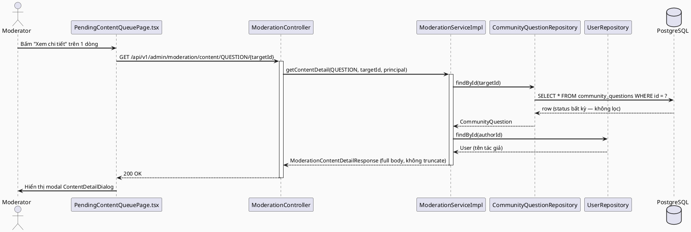
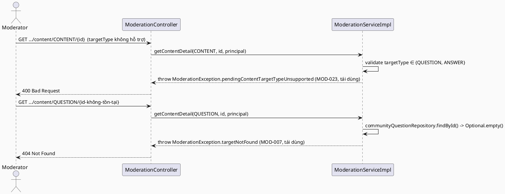

# ENGINEERING DOCUMENTATION STANDARD (EDS) v2.0
# Technical Design Specification — Xem chi tiết đầy đủ nội dung chờ duyệt/đã xử lý

| Field              | Value                                   |
| ------------------ | ---------------------------------------- |
| **Document ID**    | `CB-MOD-IMP-008`                        |
| **Version**        | `1.0`                                   |
| **Date**           | `2026-07-10`                            |
| **Status**         | `Implemented`                           |
| **Document Owner** | `HuyND`                                 |
| **Author**         | `AI Agent — Claude`                     |
| **Reviewed by**    | `[x] HuyND — 2026-07-10`                |
| **DPO Sign-off**   | `N/A` — Internal moderation data đọc lại nội dung do chính user đã tự đăng công khai lên cộng đồng; không export/chia sẻ ra ngoài hệ thống |
| **Approved by**    | `[x] HuyND — 2026-07-10 (xác nhận bằng lời "Approved")` |
| **Last Review**    | `2026-07-10`                            |
| **Based on EDS**   | `v2.0`                                  |

---

## CHANGELOG

| Ngày       | Người thực hiện | Nội dung thay đổi |
|------------|------------------|--------------------|
| 2026-07-10 | AI Agent — Claude | Tạo tài liệu lần đầu — TDS cho tính năng "Xem chi tiết" trên trang Pending Content (Status=Draft), theo yêu cầu người dùng khi review `/moderator/pending-content` và `/moderator/reports` |
| 2026-07-10 | HuyND | Approved qua chat ("Approved") — chuyển Status sang `Approved`, cho phép Phase 3 Implementation bắt đầu |
| 2026-07-10 | AI Agent — Claude (Dev Agent) | Phase 3: Implementation — 12/12 test PASS (`ModerationServiceImplTest` x9, `ModerationControllerSecurityTest` x2, `ModerationContentDetailIntegrationTest` x1). `getContentDetail()` implemented in `ModerationServiceImpl`/`ModerationController`, DTO `ModerationContentDetailResponse`, no new migration. Frontend: `fetchContentDetail()`, `ContentDetailDialog.tsx`, "Xem chi tiết" wired into all 3 tabs of `PendingContentQueuePage.tsx`. `npx tsc -b` + `npm run build` PASS. Full backend regression (`./mvnw test`) has 32 pre-existing failures unrelated to this change (Testcontainers/Docker unavailable in this env, `JourneyServiceImplTest`, `ReportServiceImplTest`) — verified via `git stash` that they fail identically on the pre-change tree. |

---

## MỤC LỤC

1. [Tổng quan Module](#1-tổng-quan-module)
2. [Ma trận Truy vết](#2-ma-trận-truy-vết)
3. [Architecture Decision Records (ADR)](#3-architecture-decision-records-adr)
4. [Non-Functional Requirements & SLA](#4-non-functional-requirements--sla)
5. [Static Modeling](#5-static-modeling)
6. [Dynamic Modeling](#6-dynamic-modeling)
7. [Domain Event Catalog](#7-domain-event-catalog)
8. [Interface Specification](#8-interface-specification)
9. [API Specification](#9-api-specification)
10. [Bảng mã lỗi](#10-bảng-mã-lỗi)
11. [Quy trình Triển khai](#11-quy-trình-triển-khai)
12. [Rollback & Incident Runbook](#12-rollback--incident-runbook)
13. [Kịch bản Kiểm thử Chi tiết](#13-kịch-bản-kiểm-thử-chi-tiết)
14. [Phương pháp Xác minh](#14-phương-pháp-xác-minh)
15. [API Verification Samples](#15-api-verification-samples)
16. [Authorization Matrix](#16-authorization-matrix)
17. [AI Prompt Constraints (CASE 2.0)](#17-ai-prompt-constraints-case-20)

---

## 1. Tổng quan Module

| Field                     | Value                                                                                                     |
| ------------------------- | ------------------------------------------------------------------------------------------------------- |
| **Feature ID**            | `CB-MOD-IMP-008`                                                                                          |
| **Liên quan UC**          | Mở rộng UC-99 (View Moderation Queue / Pending Content Queue) và UC-101 (Resolve Report) — không phải UC mới trong FS, mà là gap fix cho các UC hiện có |
| **Module Name**           | `View Pending Content Detail`                                                                              |
| **Bounded Context**       | `content` (package hiện có `com.carebridge.backend.content` — không tạo package mới)                     |
| **Primary Actor**         | `Community Moderator (ROLE_MODERATOR)`                                                                     |
| **Platform**              | `Admin Web Portal — /moderator/pending-content` (cả 3 tab: Câu hỏi mới, Câu trả lời mới, Đã xử lý)         |
| **Priority**              | `Medium`                                                                                                    |
| **Data Classification**   | `Internal` (nội dung do chính user đã đăng công khai lên cộng đồng, moderator xem lại để ra quyết định)   |
| **Compliance Scope**      | `N/A`                                                                                                        |
| **Upstream Dependencies** | `community (CommunityQuestion, CommunityAnswer)`, `security (JWT auth)`, `audit (AuditService)`            |
| **Downstream Consumers**  | `PendingContentQueuePage.tsx` (Web) — cả 3 tab                                                             |

**Bối cảnh:** Người dùng (HuyND) báo cáo rằng trang `/moderator/pending-content` chưa có tính năng "xem chi tiết" câu hỏi/câu trả lời như trang `/moderator/reports` đã có (`ContentReportDetailPage.tsx` điều hướng sang trang riêng). Khi rà soát code thực tế, phát hiện thêm 2 vấn đề sâu hơn mà chỉ "sao chép" pattern của trang reports sẽ không giải quyết được:

1. Cả 3 DTO hiện có (`PendingContentItemResponse`, `ModerationQueueItemResponse`, `ModerationHistoryItemResponse`) đều chỉ trả về `contentPreview` bị cắt tối đa 200 ký tự (`ContentPreviewServiceImpl.MAX_PREVIEW_LENGTH`, cắt 2 lần ở một số nơi — `ModerationMapper.truncate()` áp lại lần nữa). Không có field nào mang full-text.
2. Không tồn tại endpoint moderator-facing nào trả về nội dung đầy đủ bất kể trạng thái. `GET /api/v1/community/questions/{id}` tồn tại nhưng bị lọc theo status (`CommunityQuestionServiceImpl.getQuestionDetail`: chỉ APPROVED hoặc PENDING-của-chính-tác-giả) → moderator gọi vào câu hỏi PENDING/HIDDEN/LOCKED của người khác sẽ nhận 404. Không có endpoint `GET` cho 1 answer theo id.

Vì vậy tính năng này **không phải chỉ là thêm nút UI** — cần một endpoint đọc mới, moderator-facing, không lọc theo status, trả full body.

**Phạm vi:** Thêm 1 endpoint `GET` mới trả chi tiết đầy đủ 1 `CommunityQuestion` hoặc `CommunityAnswer` theo `targetId`, dùng chung cho cả 3 tab của Pending Content page (Câu hỏi mới / Câu trả lời mới / Đã xử lý). Không sửa các trang Reports (đã có form xử lý riêng, không cần thêm modal chi tiết — xem ADR-002).

---

## 2. Ma trận Truy vết

| Requirement ID | Loại          | Mô tả yêu cầu                                                                                | Thành phần Code                                              | ADR liên quan |
| --------------- | -------------- | ------------------------------------------------------------------------------------------- | ------------------------------------------------------------- | --------------- |
| REQ-DETAIL-001  | User Request  | Moderator cần xem toàn bộ nội dung câu hỏi/câu trả lời (không bị cắt 200 ký tự) trước khi ra quyết định | `ModerationController.getContentDetail()`                     | ADR-001         |
| REQ-DETAIL-002  | User Request  | Áp dụng cho cả 3 tab của Pending Content page, kể cả tab "Đã xử lý" (nội dung không còn PENDING) | `ModerationServiceImpl.getContentDetail()` — không lọc status | ADR-001         |
| BR-RBAC-001     | Business Rule | Chỉ MODERATOR được gọi endpoint này                                                          | `@PreAuthorize("hasRole('MODERATOR')")`                        | ADR-002         |
| BR-MOD-013      | Business Rule | Endpoint chỉ hỗ trợ `targetType ∈ {QUESTION, ANSWER}` — nhất quán với UC-99 Pending Content Queue (ADR-006 của CB-MOD-IMP-004) | `ModerationServiceImpl.getContentDetail()`                     | ADR-002         |
| BR-MOD-014      | Business Rule | Moderator xem được `authorId` thật kể cả khi câu hỏi được đăng ẩn danh (`is_anonymous=true`) — vì mục đích accountability nội bộ, không phải hiển thị công khai | `ModerationServiceImpl.getContentDetail()`                     | ADR-003         |

---

## 3. Architecture Decision Records (ADR)

### ADR-001 — Endpoint đọc riêng cho moderator, không tái dùng `CommunityQuestionService.getQuestionDetail()`

| Field          | Value                      |
| -------------- | --------------------------- |
| **Status**     | `Proposed`                  |
| **Deciders**   | `HuyND — System Architect`  |
| **Date**       | `2026-07-10`                |

#### Bối cảnh
`CommunityQuestionServiceImpl.getQuestionDetail(UUID questionId, UUID currentUserId)` (dòng 58-66) lọc `.filter(q -> q.getStatus() == APPROVED || (q.getStatus() == PENDING && q.getAuthorId().equals(currentUserId)))` trước khi trả kết quả — nếu không khớp, ném `QuestionNotFoundException` (404). Đây là hành vi **đúng cho luồng public** (user chỉ xem được câu hỏi công khai hoặc câu hỏi PENDING của chính mình) nhưng **sai cho luồng moderator** (cần xem PENDING/HIDDEN/LOCKED của người khác để ra quyết định duyệt/ẩn/khóa). Không có `GET` endpoint nào cho 1 answer theo id.

#### Các phương án đã xem xét

| Phương án | Mô tả | Ưu điểm | Nhược điểm |
| --------- | ----- | -------- | ----------- |
| A | Thêm tham số `bypassStatusFilter` vào `getQuestionDetail()` hiện có, gọi có điều kiện dựa trên role | Tái dùng code | Rò rỉ RBAC-aware logic vào service vốn dành cho luồng công khai; dễ tạo lỗ hổng nếu tham số bị set nhầm; `getQuestionDetail()` còn build cả bookmark/like hydration không cần cho moderator, không có route cho answer |
| B | Thêm 1 method mới `ModerationService.getContentDetail()` trong package `content` (không phải `community`), gọi thẳng `communityQuestionRepository.findById()` / `communityAnswerRepository.findById()` (unfiltered by status, đã tồn tại sẵn — `JpaRepository.findById` kế thừa) | Tách biệt rõ ràng luồng public vs luồng moderator; không đụng code luồng public đang chạy ổn định; nhất quán với cách `ContentPreviewServiceImpl` đã làm (đọc thẳng repository, không qua `CommunityQuestionService`) | Có 1 chút trùng lặp logic build response (chấp nhận được — build response ở đây đơn giản hơn `CommunityQuestionDetailResponse` rất nhiều, không cần answer list/bookmark/like) |

#### Quyết định
Chọn **Phương án B**. `ModerationServiceImpl.getContentDetail(ReportTargetType targetType, UUID targetId, Principal principal)` gọi thẳng `communityQuestionRepository.findById(targetId)` / `communityAnswerRepository.findById(targetId)` — không qua `CommunityQuestionService`/`CommunityAnswerService`, không lọc status. Đặt trong `ModerationController` (`GET /api/v1/admin/moderation/content/{targetType}/{targetId}`), không phải `CommunityQuestionController`.

#### Hệ quả

**Tích cực:**
- Luồng public (`GET /api/v1/community/questions/{id}`) không bị đụng chạm, không risk regression.
- Response nhẹ, chỉ chứa field moderator thực sự cần (không kéo theo answer list, like/bookmark hydration).

**Tiêu cực / Trade-offs:**
- Có 2 method đọc 1 `CommunityQuestion` theo id ở 2 bounded context khác nhau (`community.getQuestionDetail` cho public, `content.getContentDetail` cho moderator) — chấp nhận được vì access-control logic khác hẳn nhau (tương tự cách `ContentPreviewServiceImpl` đã đọc thẳng repository, không phải trường hợp đầu tiên trong codebase).

---

### ADR-002 — Modal trong trang, không tạo route riêng; KHÔNG sửa 2 trang Reports

| Field          | Value                      |
| -------------- | --------------------------- |
| **Status**     | `Proposed`                  |
| **Deciders**   | `HuyND — System Architect`  |
| **Date**       | `2026-07-10`                |

#### Bối cảnh
Trang Reports (`ContentReportDetailPage.tsx`, `AccountReportDetailPage.tsx`) hiện "xem chi tiết" bằng cách điều hướng sang route riêng (`/moderator/reports/:reportId`), fetch lại `fetchModerationQueue({ size: 50 })` rồi `.find()` client-side trong 50 dòng đầu (không có fetch theo id thật sự, và im lặng fail nếu report nằm ngoài 50 dòng đầu — vấn đề đã biết, nhưng **ngoài phạm vi** tài liệu này). Nếu copy y hệt pattern đó sang Pending Content, sẽ kế thừa luôn vấn đề "im lặng fail ngoài trang 1".

#### Các phương án đã xem xét

| Phương án | Mô tả | Ưu điểm | Nhược điểm |
| --------- | ----- | -------- | ----------- |
| A | Route riêng `/moderator/pending-content/:targetType/:targetId`, giống pattern Reports | Nhất quán UI pattern với Reports | Kế thừa vấn đề "không có fetch theo id" nếu tái dùng list — nhưng ta ĐÃ có endpoint fetch theo id thật (ADR-001), nên vấn đề này không áp dụng; tuy vậy tạo thêm 1 route + back-navigation phức tạp hơn cần thiết cho 1 thao tác "xem nhanh rồi đóng lại" |
| B | Modal (dialog) mở ngay trên trang hiện tại, gọi API fetch-by-id mới (ADR-001), đóng lại không mất vị trí cuộn/tab đang chọn | Trải nghiệm nhanh hơn cho thao tác duyệt hàng loạt (không mất context tab/scroll); dùng được ngay cho cả 3 tab bằng 1 component chung; không cần thêm route mới | Khác pattern navigation của Reports (chấp nhận được — 2 trang phục vụ luồng khác nhau: Reports xử lý 1 report cụ thể lâu hơn, cần nhiều thao tác; Pending Content cần duyệt nhanh nhiều dòng) |

#### Quyết định
Chọn **Phương án B**. Modal `ContentDetailDialog` (đặt tại `shared/components/` vì có thể tái dùng sau này), mở bằng nút "Xem chi tiết" trên mỗi dòng của cả 3 tab, gọi `GET /api/v1/admin/moderation/content/{targetType}/{targetId}` (ADR-001). **Không sửa** `ContentReportDetailPage.tsx`/`AccountReportDetailPage.tsx` trong tài liệu này — nằm ngoài yêu cầu ban đầu ("chưa có tính năng xem chi tiết ở pending-content **như của** reports", không phải "sửa reports").

#### Hệ quả

**Tích cực:**
- Giải quyết đúng gap được báo cáo mà không động vào code đang chạy ổn định của Reports.
- 1 component `ContentDetailDialog` dùng chung cho 3 tab.

**Tiêu cực / Trade-offs:**
- 2 trang trong cùng module Moderation có 2 UX pattern khác nhau cho "xem chi tiết" (modal vs. route). Ghi nhận là `Open` — có thể thống nhất trong 1 lần refactor UX sau, không phải phạm vi tài liệu này.

---

### ADR-003 — Hiển thị `authorId`/tên tác giả thật kể cả khi câu hỏi đăng ẩn danh

| Field          | Value                      |
| -------------- | --------------------------- |
| **Status**     | `Proposed`                  |
| **Deciders**   | `HuyND — System Architect`  |
| **Date**       | `2026-07-10`                |

#### Bối cảnh
`CommunityQuestion.anonymous` (`is_anonymous`) ẩn danh tính tác giả khỏi **luồng công khai**. Endpoint moderator-facing này phục vụ mục đích khác — accountability nội bộ. Các trang moderation hiện có đã bộc lộ `reporterUserId`/`targetId` dạng UUID thô cho moderator (`AccountReportDetailPage.tsx` dòng 118), nên việc bộc lộ `authorId` thật ở đây nhất quán với tiền lệ đó, không phải một ngoại lệ mới.

#### Quyết định
`getContentDetail()` trả `authorId` + tên tác giả (resolve qua `userRepository`) **không lọc theo `anonymous`** — cờ này chỉ điều khiển UI công khai (`CommunityFeedServiceImpl`/`CommunityQuestionServiceImpl`), không áp dụng cho response moderator-only này.

#### Hệ quả
**Tích cực:** Moderator có đủ thông tin để đánh giá pattern vi phạm lặp lại của cùng 1 tài khoản dù họ đăng ẩn danh.
**Tiêu cực / Trade-offs:** Không có — endpoint đã `@PreAuthorize("hasRole('MODERATOR')")`, dữ liệu không rời khỏi hệ thống nội bộ.

---

## 4. Non-Functional Requirements & SLA

| Category | Requirement | Target | Ghi chú |
|----------|-------------|--------|---------|
| Latency | API response (p99) | `< 300ms` | Single `findById` + optional 1 `findById` cho parent question (answer case) — không có N+1 |
| Data Integrity | Không mutate dữ liệu | Read-only, `@Transactional(readOnly = true)` | Endpoint chỉ đọc |
| Security | Access control | Least privilege — chỉ MODERATOR | §16 Authorization Matrix |

*(Các mục 4.2/4.4 của template gốc không áp dụng — module không xử lý PII export, không có bảng mới, không cần capacity planning riêng.)*

---

## 5. Static Modeling

### 5.1. Không có entity/bảng mới

Tính năng này **không tạo entity, không tạo migration**. Tái sử dụng `CommunityQuestion`/`CommunityAnswer` (đã tồn tại) qua `CommunityQuestionRepository`/`CommunityAnswerRepository` (đã tồn tại, `findById` kế thừa từ `JpaRepository`, không lọc status).

### 5.2. DTO mới

```java
// ModerationContentDetailResponse.java — src/main/java/com/carebridge/backend/content/dto/response/
package com.carebridge.backend.content.dto.response;

import com.carebridge.backend.content.entity.ReportTargetType;
import java.time.Instant;
import java.util.UUID;

public record ModerationContentDetailResponse(
    UUID targetId,
    ReportTargetType targetType,   // QUESTION | ANSWER
    UUID authorId,
    String authorName,             // resolve qua UserRepository; null nếu user đã bị xoá
    String title,                  // null cho ANSWER
    String body,                   // FULL text — không truncate (khác contentPreview)
    String status,                 // QuestionStatus/AnswerStatus.name()
    boolean anonymous,             // QUESTION only (ADR-003); luôn false cho ANSWER
    UUID questionId,               // ANSWER only — id câu hỏi cha, để hiển thị ngữ cảnh
    String questionTitle,          // ANSWER only — tiêu đề câu hỏi cha, null cho QUESTION
    Instant createdAt,
    Instant updatedAt
) {}
```

---

## 6. Dynamic Modeling

### 6.1. Sequence Diagram — Happy Path (QUESTION)



### 6.2. Sequence Diagram — Error Path (not found / unsupported type)



*(Không có state machine — endpoint chỉ đọc, không mutate status.)*

---

## 7. Domain Event Catalog

Không phát sinh domain event mới. Endpoint chỉ đọc — không cần audit append-only mức action, nhưng vẫn ghi lại lượt xem qua `AuditAction.MODERATION_QUEUE_VIEWED` (tái dùng enum value đã có, tương tự cách `getModerationQueue()`/`getPendingContentQueue()` đã làm — tránh phải mở migration `audit_logs_action_check` mới).

---

## 8. Interface Specification

### 8.1. Service Interface

```java
// ModerationService.java — thêm method mới vào interface hiện có
public interface ModerationService {
    // ... các method hiện có (getModerationQueue, getPendingContentQueue, getModerationHistory,
    //     moderateContent, resolveReport, moderateAccount) giữ nguyên, không đổi ...

    /**
     * CB-MOD-IMP-008: trả nội dung đầy đủ (không truncate) của 1 CommunityQuestion/CommunityAnswer,
     * bất kể trạng thái hiện tại (PENDING/APPROVED/HIDDEN/LOCKED) — phục vụ moderator xem trước khi
     * ra quyết định. Không lọc theo status như CommunityQuestionService.getQuestionDetail() (ADR-001).
     * @throws ModerationException (MOD-023) nếu targetType không phải QUESTION/ANSWER
     * @throws ModerationException (MOD-007) nếu targetId không tồn tại
     */
    ModerationContentDetailResponse getContentDetail(
            ReportTargetType targetType, UUID targetId, Principal principal);
}
```

### 8.2. Repository Interface

Không cần thêm method repository mới — `communityQuestionRepository.findById(UUID)` và `communityAnswerRepository.findById(UUID)` đã có sẵn (kế thừa `JpaRepository`).

---

## 9. API Specification

### 9.1. Endpoints Table

| Method | Path | Auth Level | Required Roles | Idempotent? |
|--------|------|------------|-----------------|-------------|
| `GET` | `/api/v1/admin/moderation/content/{targetType}/{targetId}` | JWT Bearer | `MODERATOR` | Yes |

### 9.2. Request / Response Schemas

#### `GET /api/v1/admin/moderation/content/QUESTION/{targetId}` — Happy Path

**Response — 200 OK:**
```json
{
  "targetId": "b3f1c2a0-...-...",
  "targetType": "QUESTION",
  "authorId": "a1e2d3c4-...-...",
  "authorName": "Nguyễn Thị A",
  "title": "Có nên uống thuốc bổ sung sắt khi mang thai tuần 20 không?",
  "body": "Toàn bộ nội dung câu hỏi, không bị cắt ở 200 ký tự...",
  "status": "PENDING",
  "anonymous": false,
  "questionId": null,
  "questionTitle": null,
  "createdAt": "2026-07-09T08:15:00Z",
  "updatedAt": "2026-07-09T08:15:00Z"
}
```

#### `GET /api/v1/admin/moderation/content/ANSWER/{targetId}` — Happy Path

**Response — 200 OK:**
```json
{
  "targetId": "c4d5e6f7-...-...",
  "targetType": "ANSWER",
  "authorId": "f9e8d7c6-...-...",
  "authorName": "BS. Trần Văn B",
  "title": null,
  "body": "Toàn bộ nội dung câu trả lời...",
  "status": "HIDDEN",
  "anonymous": false,
  "questionId": "b3f1c2a0-...-...",
  "questionTitle": "Có nên uống thuốc bổ sung sắt khi mang thai tuần 20 không?",
  "createdAt": "2026-07-09T09:00:00Z",
  "updatedAt": "2026-07-09T10:30:00Z"
}
```

**Response — 400 Bad Request (targetType không hỗ trợ):**
```json
{ "error": { "code": "MOD-023", "message": "targetType must be QUESTION or ANSWER for pending-content queue, got CONTENT" } }
```

**Response — 404 Not Found:**
```json
{ "error": { "code": "MOD-007", "message": "Target QUESTION with id <uuid> not found" } }
```

---

## 10. Bảng mã lỗi

Không thêm mã lỗi mới — tái dùng 2 mã đã tồn tại trong `ModerationException`:

| Code | HTTP Status | Trigger Condition |
|------|-------------|--------------------|
| `MOD-007` | 404 | `targetId` không tồn tại trong `community_questions`/`community_answers` |
| `MOD-023` | 400 | `targetType` không phải `QUESTION`/`ANSWER` (tái dùng thông điệp đã có của `pendingContentTargetTypeUnsupported`) |

---

## 11. Quy trình Triển khai

### 11.1. Prerequisites
- [ ] TDS này được Approved
- [ ] Không cần migration (§5.1) — bỏ qua Pre-Migration Checklist

### 11.2. Implementation Steps

#### Chặng 1 — Backend: DTO + Service + Controller
1. Tạo `ModerationContentDetailResponse.java` (§5.2).
2. Thêm `getContentDetail()` vào `ModerationService` interface (§8.1) và implement trong `ModerationServiceImpl`.
3. Thêm `GET /content/{targetType}/{targetId}` vào `ModerationController` (§9.1), `@PreAuthorize("hasRole('MODERATOR')")`.
4. Viết unit test cho `ModerationServiceImpl.getContentDetail()` (happy path QUESTION, happy path ANSWER kèm `questionTitle`, not-found, unsupported targetType).

#### Chặng 2 — Frontend: API client + Dialog component + wiring
1. Thêm `fetchContentDetail(targetType, targetId)` vào `moderationApi.ts`.
2. Thêm type `ModerationContentDetail` vào `models/moderation.ts`.
3. Tạo `ContentDetailDialog.tsx` (`shared/components/`) — modal hiển thị đầy đủ: loại, trạng thái, tác giả, thời gian đăng/cập nhật, tiêu đề (nếu có), nội dung đầy đủ, và nếu là ANSWER thì kèm khối "Trả lời cho câu hỏi: {questionTitle}".
4. Thêm nút "Xem chi tiết" vào mỗi dòng của cả 3 tab trong `PendingContentQueuePage.tsx`, mở dialog.

#### Chặng 3 — Verification sau deploy
```bash
curl -X GET https://localhost:8080/api/v1/admin/moderation/content/QUESTION/<uuid> \
  -H "Authorization: Bearer <MODERATOR_JWT>"
# Expected: 200, body field KHÔNG bị cắt ở 200 ký tự
```

### 11.3. Deployment Checklist
- [ ] Endpoint mới trả 200 cho MODERATOR, 403 cho role khác
- [ ] `body` trả về đúng full text (test với 1 câu hỏi có nội dung > 200 ký tự)
- [ ] Audit log sinh ra đúng `AuditAction.MODERATION_QUEUE_VIEWED`

---

## 12. Rollback & Incident Runbook

### 12.1. Điều kiện kích hoạt Rollback

| Điều kiện | Ngưỡng | Người quyết định |
|-----------|--------|--------------------|
| Endpoint mới gây lỗi 500 hàng loạt | > 5% request trong 5 phút | On-call Engineer |
| Endpoint bị lạm dụng để bypass RBAC luồng public | Bất kỳ case nào | Tech Lead |

### 12.2. Rollback Procedure

```bash
# Không có migration để revert — chỉ cần revert code deploy
git revert <merge-commit-hash>
# Re-deploy phiên bản trước
```

### 12.3. Post-Incident Review
Không bắt buộc PIR chính thức trừ khi có sự cố bảo mật (endpoint đọc, không mutate dữ liệu, rủi ro thấp).

---

## 13. Kịch bản Kiểm thử Chi tiết

> Chi tiết đầy đủ (Gherkin, test data) nằm trong `ViewPendingContentDetail_Test-Spec.md` (§4). Tóm tắt:

- Happy path: QUESTION PENDING, QUESTION HIDDEN, QUESTION LOCKED, ANSWER PENDING, ANSWER APPROVED — mỗi case trả đúng `body` đầy đủ.
- Error path: `targetId` không tồn tại (404 MOD-007); `targetType=CONTENT` (400 MOD-023); `targetType=ACCOUNT` (400 MOD-023).
- Security: role không phải MODERATOR (403); không có JWT (401); `anonymous=true` vẫn trả `authorId`/`authorName` thật (ADR-003).
- ANSWER case: `questionId`/`questionTitle` đúng với câu hỏi cha.

---

## 14. Phương pháp Xác minh

### 14.1. Database Inspection
```sql
-- Verify nội dung dài (>200 ký tự) được seed đúng để test không-truncate
SELECT id, LENGTH(body) FROM community_questions WHERE LENGTH(body) > 200 LIMIT 1;
```

### 14.2. Log / Audit Verification
```bash
# Verify audit log sinh ra cho lượt xem chi tiết
grep '"actionType":"MODERATION_QUEUE_VIEWED"' logs | grep 'content-detail'
```

---

## 15. API Verification Samples

```bash
curl -X GET https://localhost:8080/api/v1/admin/moderation/content/QUESTION/550e8400-e29b-41d4-a716-446655440000 \
  -H "Authorization: Bearer $MODERATOR_JWT"
```

**Expected Response (200):** xem §9.2.

```bash
# Không có JWT → 401
curl -X GET https://localhost:8080/api/v1/admin/moderation/content/QUESTION/550e8400-e29b-41d4-a716-446655440000
```

---

## 16. Authorization Matrix

| Endpoint | `MOTHER/FAMILY/...` | `EXPERT` | `MODERATOR` | `SYSTEM_ADMIN` |
|----------|:---:|:---:|:---:|:---:|
| `GET /api/v1/admin/moderation/content/{targetType}/{targetId}` | ❌ 403 | ❌ 403 | ✅ | ❌ 403 |

> **Lưu ý:** giống toàn bộ `ModerationController`, `SYSTEM_ADMIN` **không** được phép — endpoint này thuộc RBAC riêng của MODERATOR (đã ghi rõ trong comment `router/index.tsx`: "ModerationController is @PreAuthorize hasRole('MODERATOR') on every endpoint — SYSTEM_ADMIN is NOT accepted").

---

## 17. AI Prompt Constraints (CASE 2.0)

### 17.1 Constraint Summary Table

| # | Constraint | Source | Last Verified |
|---|-----------|---------|----------------|
| C1 | Endpoint mới đặt trong `ModerationController`, KHÔNG sửa `CommunityQuestionController`/`CommunityAnswerController` | ADR-001 | 2026-07-10 |
| C2 | KHÔNG lọc theo status trong `getContentDetail()` — dùng thẳng `findById()` unfiltered | ADR-001 | 2026-07-10 |
| C3 | `@PreAuthorize("hasRole('MODERATOR')")` bắt buộc trên controller method | BR-RBAC-001 | 2026-07-10 |
| C4 | Trả `authorId`/`authorName` thật kể cả khi `anonymous=true` | ADR-003 | 2026-07-10 |
| C5 | KHÔNG tạo migration mới — không có entity/bảng mới (§5.1) | §5.1 | 2026-07-10 |
| C6 | Tái dùng `ModerationException.targetNotFound`/`pendingContentTargetTypeUnsupported` — KHÔNG tạo mã lỗi mới | §10 | 2026-07-10 |

### 17.2 Constraint Injection Block

```
[CONSTRAINT BLOCK — Module: View Pending Content Detail]
Theo TDS CB-MOD-IMP-008:

1. Thêm getContentDetail() vào ModerationService/ModerationServiceImpl (KHÔNG sửa CommunityQuestionService).
2. Dùng communityQuestionRepository.findById()/communityAnswerRepository.findById() — KHÔNG lọc status.
3. @PreAuthorize("hasRole('MODERATOR')") trên controller method mới.
4. Trả authorId/authorName thật bất kể cờ anonymous.
5. KHÔNG tạo Flyway migration, KHÔNG tạo mã lỗi ModerationException mới — tái dùng MOD-007/MOD-023.

[CONTEXT BLOCK]
- Bounded Context: content (com.carebridge.backend.content)
- Existing interfaces: §8 Service Interface
- Error codes: §10 (tái dùng MOD-007, MOD-023)
- Auth matrix: §16

[TASK BLOCK]
Implement getContentDetail() thỏa mãn constraints trên. Tests phải cover §13 Test Scenarios.
```

### 17.3 Anti-Pattern Detection

| AP-ID | Anti-Pattern | Dấu hiệu | Hành động |
|-------|-------------|-----------|----------|
| AP-AI-003 | Implicit Decision | Code tạo migration mới dù §5.1 nói không cần | Reject |
| AP-AI-005 | Hallucinated Contract | Code gọi `CommunityQuestionService.getQuestionDetail()` thay vì repository trực tiếp | Reject — vi phạm ADR-001 |

---

*Tài liệu này ở trạng thái `Draft` — chờ review & approval trước khi implement, theo `.claude/rules/implement-flow.md`.*
