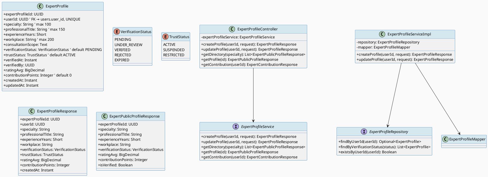
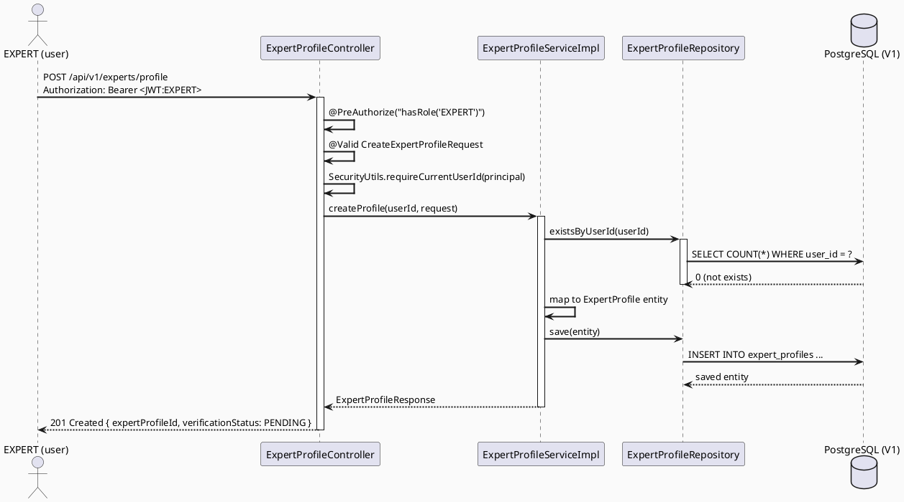

# CAREBRIDGE TECHNICAL DESIGN SPECIFICATION — PKG-01 Expert

## Metadata

| Field | Value |
|-------|-------|
| **Document ID** | `CB-EXPERT-PKG-01-TDS` |
| **Version** | `1.0` |
| **Date** | 2026-07-03 |
| **Status** | `DRAFT` |
| **Package** | `PKG-01 — Expert Profile & Directory` |
| **Included UCs** | `UC-60, UC-61, UC-65, UC-66, UC-69` |
| **Document Owner** | Lâm (TV4) |
| **Author** | Lâm — TV4 Developer |
| **Reviewed by** | `[ ] Pending` |
| **Based on** | CareBridge TDS Template v1.0 |

> **Stack:** Spring Boot 3.5.x · JDK 21 · JPA/Hibernate · PostgreSQL · Flyway · JUnit 5 · Mockito · MockMvc · React + TypeScript + Vite + Tailwind · Flutter

---

## CHANGELOG

| Ngày | Người | Nội dung |
|------|-------|----------|
| 2026-07-03 | Lâm | Tạo TDS lần đầu |

---

## 1. Tổng quan Module

| Trường | Giá trị |
|--------|---------|
| **Module Name** | `expert` — Expert Profile & Directory |
| **Bounded Context** | `expert` (Verified Expert Network) |
| **UC IDs** | `UC-60, UC-61, UC-65, UC-66, UC-69` |
| **Primary Actor(s)** | `EXPERT` (creator), `MOTHER`/`FAMILY` (reader) |
| **Platform** | `Backend API + Admin Web Portal (React) + Mobile App (Flutter)` |
| **Data Classification** | `Internal` |
| **Upstream Dependencies** | `PKG-TV1 (auth/user)` — controlled via `User.userId` FK |
| **Downstream Consumers** | `PKG-expertverification` (reads badge state), `PKG-expertavailability`, TV3 community |
| **External Integrations** | `None` (V1 only) |

**Mô tả:** Module quản lý hồ sơ chuyên môn của expert (bác sĩ/nhân viên y tế). Expert self-submit profile → admin reviews via PKG-02 → approved experts xuất hiện trong public directory. Module owns `expert_profiles` table; không sở hữu user creation (TV1 quản) hay answer storage (TV3 quản).

---

## 2. Source-of-Truth Declaration

| Item | Source | Verified? | Notes |
|------|--------|-----------|-------|
| Table definitions | `V1__init_schema.sql` lines 786-800 | ✅ | `expert_profiles` table |
| Role names | `05_Development/Contracts/rbac-role-mapping.md` | ✅ | `EXPERT`, `SYSTEM_ADMIN`, `MOTHER` |
| User entity | `security/entity/User.java` | ✅ | FK: `expert_profiles.user_id → users.user_id` |
| Business rules | `SRS §3.5.x.x UC-60/61/65/66/69` | ✅ | |
| Community contract | `TV3 owns CommunityQuestionPort` | ✅ | TV4 chỉ đọc badge, không ghi answer |

---

## 3. Traceability Matrix

| Requirement ID | Loại | Mô tả | Thành phần Code | Compliance Target | ADR |
|----------------|------|--------|-----------------|-------------------|-----|
| UC-60 | Use Case | Submit expert profile | `ExpertProfileController.createProfile` | BR-RBAC, Data integrity | ADR-EXP-001 |
| UC-61 | Use Case | Update expert profile | `ExpertProfileController.updateProfile` | BR-RBAC | ADR-EXP-001 |
| UC-65 | Use Case | Browse verified expert directory | `ExpertProfileController.getDirectory` | BR-RBAC (read) | ADR-EXP-002 |
| UC-66 | Use Case | View expert profile detail | `ExpertProfileController.getProfile` | BR-RBAC (read) | ADR-EXP-002 |
| UC-69 | Use Case | View contribution points | `ExpertProfileController.getContribution` | BR-RBAC | ADR-EXP-002 |
| BR-EXP-001 | Business Rule | One profile per user | `@Column(unique)` + repo check | Data integrity | — |
| BR-EXP-002 | Business Rule | Only VERIFIED in directory | `verification_status = 'VERIFIED'` filter | Data integrity | ADR-EXP-002 |
| BR-EXP-003 | Business Rule | PENDING experts cannot see own profile in directory | Same filter as public | Business logic | ADR-EXP-002 |
| BR-RBAC | RBAC | Write ops: EXPERT for own profile; SYSTEM_ADMIN for admin endpoints | `@PreAuthorize` | RBAC | — |

---

## 4. ADRs

### ADR-EXP-001 — One Profile Per User + State Transition Gating

| Status | Accepted |
|--------|----------|
| Date | 2026-07-03 |

**Context:** Expert có thể submit profile nhiều lần. Cần enforce unique profile per user + chỉ allow update khi `PENDING` hoặc `REJECTED` (không phải đang `UNDER_REVIEW`).

**Decision:**
- DB: `UNIQUE(user_id)` constraint in V1
- Service: `existsByUserId()` check before create
- Update policy: reject update if `verification_status IN ('UNDER_REVIEW', 'VERIFIED')` — expert phải chờ review hoàn tất

**Consequences:**
- **Positive:** No duplicate profiles; state machine is deterministic
- **Trade-offs:** Expert phải follow process flow; no bulk-edit hacks

### ADR-EXP-002 — Public Directory Only Shows VERIFIED Experts

| Status | Accepted |
|--------|----------|
| Date | 2026-07-03 |

**Context:** Public directory (`/api/v1/experts/directory`) phải chỉ expose verified experts. Suspended/restricted experts cũng excluded.

**Decision:**
- Query filter: `verification_status = 'VERIFIED' AND trust_status != 'SUSPENDED'`
- Public DTO (`ExpertPublicProfileResponse`) strips private fields (consultation_scope, pricing, etc.)
- `ExpertBadgeReadPort.isVerified(userId)` dùng cho TV3 badge display

**Consequences:**
- **Positive:** Trust guarantee for mothers; info hiding by design
- **Trade-offs:** Suspended expert không tự thấy mình biến mất — cần clear messaging trong UC-71

---

## 5. Non-Functional Requirements

### 5.1 Performance

| Category | Requirement | Target SLA |
|----------|-------------|------------|
| Latency | API response (p99) | `< 300ms` |
| Throughput | Peak concurrent | MVP: ~50 users |
| Database | Expert profile query | Index on `verification_status` (V1 có) + `user_id` (unique) |

### 5.2 Security

| Category | Requirement | Verification |
|----------|-------------|--------------|
| Authorization | Write: EXPERT own / ADMIN all | `@PreAuthorize` + test |
| Data exposure | Public DTO strips private fields | Code review + test |
| Audit | Verification changes emit AuditEvent | TV1 contract |
| Input validation | Bean Validation | Controller test |

---

## 6. Static Modeling

### 6.1 Class Diagram (PlantUML)



### 6.2 JPA Entity

```java
package com.carebridge.backend.expert.entity;

import com.carebridge.backend.expert.enums.ExpertTrustStatus;
import com.carebridge.backend.expert.enums.VerificationStatus;
import jakarta.persistence.Column;
import jakarta.persistence.Entity;
import jakarta.persistence.EnumType;
import jakarta.persistence.Enumerated;
import jakarta.persistence.GeneratedValue;
import jakarta.persistence.GenerationType;
import jakarta.persistence.Id;
import jakarta.persistence.Table;
import jakarta.validation.constraints.Size;
import java.math.BigDecimal;
import java.time.Instant;
import java.util.UUID;
import lombok.AllArgsConstructor;
import lombok.Builder;
import lombok.Getter;
import lombok.NoArgsConstructor;
import lombok.Setter;
import org.hibernate.annotations.CreationTimestamp;
import org.hibernate.annotations.UpdateTimestamp;

@Entity
@Table(name = "expert_profiles")
@Getter
@Setter
@Builder
@NoArgsConstructor
@AllArgsConstructor
public class ExpertProfile {

  @Id
  @GeneratedValue(strategy = GenerationType.UUID)
  @Column(name = "expert_profile_id", updatable = false, nullable = false)
  private UUID expertProfileId;

  // FK → users.user_id; UNIQUE enforced at DB level (V1)
  @Column(name = "user_id", nullable = false, unique = true)
  private UUID userId;

  @Size(max = 100)
  @Column(name = "specialty", length = 100)
  private String specialty;

  @Size(max = 150)
  @Column(name = "professional_title", length = 150)
  private String professionalTitle;

  @Column(name = "experience_years")
  private Short experienceYears;

  @Size(max = 200)
  @Column(name = "workplace", length = 200)
  private String workplace;

  @Column(name = "consultation_scope", columnDefinition = "text")
  private String consultationScope;

  // V1 default: 'PENDING'
  @Enumerated(EnumType.STRING)
  @Column(name = "verification_status", length = 30, nullable = false)
  private VerificationStatus verificationStatus = VerificationStatus.PENDING;

  @Column(name = "verified_at")
  private Instant verifiedAt;

  @Column(name = "verified_by")
  private UUID verifiedBy;

  @Column(name = "rating_avg", precision = 3, scale = 2)
  private BigDecimal ratingAvg;

  // Added beyond V1: contribution tracking for UC-69
  @Column(name = "contribution_points", nullable = false)
  private Integer contributionPoints = 0;

  // V1 does not have trust_status — added via migration (non-breaking default ACTIVE)
  @Enumerated(EnumType.STRING)
  @Column(name = "trust_status", length = 20, nullable = false)
  private ExpertTrustStatus trustStatus = ExpertTrustStatus.ACTIVE;

  @CreationTimestamp
  @Column(name = "created_at", nullable = false, updatable = false)
  private Instant createdAt;

  @UpdateTimestamp
  @Column(name = "updated_at", nullable = false)
  private Instant updatedAt;
}
```

---

## 7. Dynamic Modeling

### 7.1 Sequence Diagram — UC-60 Submit Expert Profile



### 7.2 State Machine — Expert Verification Lifecycle

```plantuml
@startuml Expert_VerificationStateMachine
skinparam backgroundColor #FAFAFA

[*] --> PENDING : UC-60 (submit profile)
PENDING --> UNDER_REVIEW : UC-70 (admin starts review)
UNDER_REVIEW --> VERIFIED : UC-70 (admin approves)
UNDER_REVIEW --> REJECTED : UC-70 (admin rejects)
REJECTED --> PENDING : UC-62 (resubmit docs)
VERIFIED --> EXPIRED : time-based (configurable)
PENDING --> PENDING : UC-61 (update profile, not under review)
PENDING --> PENDING : UC-62 (upload docs)

note right of VERIFIED
  ExpertBadgeReadPort.isVerified() = true
  Appears in directory
  Can post verified answers
end note

note right of SUSPENDED
  UC-71: admin suspends from any state
  Cannot appear in directory
  Cannot post answers
end note

@enduml
```

---

## 8. Domain Event Catalog

| Event Name | Trigger | Publisher | Subscriber(s) | Async? |
|------------|---------|-----------|---------------|--------|
| `ExpertProfileCreatedEvent` | UC-60 profile submitted | `ExpertProfileServiceImpl` | AuditService, NotificationService | No |
| `ExpertProfileUpdatedEvent` | UC-61 profile updated | `ExpertProfileServiceImpl` | AuditService | No |
| `ExpertVerificationStatusChangedEvent` | UC-70 admin review decision | `ExpertVerificationServiceImpl` | AuditService, NotificationService | No |
| `ExpertTrustStatusChangedEvent` | UC-71 suspension/reinstatement | `ExpertVerificationServiceImpl` | AuditService, ExpertProfile (cascade) | No |
| `ExpertContributionUpdatedEvent` | UC-69 points changed | `ExpertProfileServiceImpl` | AuditService | No |

### 8.1. Payload Schema

```java
public record ExpertVerificationStatusChangedEvent(
    String eventId,
    String eventType,
    Instant occurredAt,
    String version,
    Payload payload
) {
  public record Payload(
      UUID expertProfileId,
      UUID userId,
      VerificationStatus oldStatus,
      VerificationStatus newStatus,
      UUID adminId,
      String reviewNote
  ) {}
}
```

---

## 9. Interface Specification

### 9.1. Service Interface

```java
package com.carebridge.backend.expert.service;

import com.carebridge.backend.expert.dto.request.CreateExpertProfileRequest;
import com.carebridge.backend.expert.dto.request.UpdateExpertProfileRequest;
import com.carebridge.backend.expert.dto.response.ExpertContributionResponse;
import com.carebridge.backend.expert.dto.response.ExpertProfileResponse;
import com.carebridge.backend.expert.dto.response.ExpertPublicProfileResponse;
import java.util.List;
import java.util.UUID;

public interface ExpertProfileService {

  /** UC-60: Submit expert application profile. */
  ExpertProfileResponse createProfile(UUID userId, CreateExpertProfileRequest request);

  /** UC-61: Update allowed fields on expert profile. */
  ExpertProfileResponse updateProfile(UUID userId, UpdateExpertProfileRequest request);

  /** UC-65: Public directory — only VERIFIED and ACTIVE experts. */
  List<ExpertPublicProfileResponse> getDirectory(String specialty);

  /** UC-66: Single expert public profile. */
  ExpertPublicProfileResponse getProfile(UUID expertProfileId);

  /** UC-69: Contribution points and badges for an expert. */
  ExpertContributionResponse getContribution(UUID userId);
}
```

### 9.2. Repository Interface

```java
package com.carebridge.backend.expert.repository;

import com.carebridge.backend.expert.entity.ExpertProfile;
import com.carebridge.backend.expert.enums.ExpertTrustStatus;
import com.carebridge.backend.expert.enums.VerificationStatus;
import java.util.List;
import java.util.Optional;
import java.util.UUID;
import org.springframework.data.jpa.repository.JpaRepository;

public interface ExpertProfileRepository extends JpaRepository<ExpertProfile, UUID> {

  Optional<ExpertProfile> findByUserId(UUID userId);
  boolean existsByUserId(UUID userId);
  List<ExpertProfile> findByVerificationStatusAndTrustStatus(
      VerificationStatus status, ExpertTrustStatus trustStatus);
  List<ExpertProfile> findBySpecialtyAndVerificationStatusAndTrustStatus(
      String specialty, VerificationStatus status, ExpertTrustStatus trustStatus);
}
```

### 9.3. DTOs

```java
// Request — create
@Data
public class CreateExpertProfileRequest {
  @NotBlank @Size(max = 100)
  private String specialty;
  @Size(max = 150)
  private String professionalTitle;
  @Min(0) @Max(80)
  private Short experienceYears;
  @Size(max = 200)
  private String workplace;
  @Size(max = 2000)
  private String consultationScope;
}

// Request — update
@Data
public class UpdateExpertProfileRequest {
  @Size(max = 100)
  private String specialty;
  @Size(max = 150)
  private String professionalTitle;
  @Min(0) @Max(80)
  private Short experienceYears;
  @Size(max = 200)
  private String workplace;
  @Size(max = 2000)
  private String consultationScope;
}

// Response — full (owner/admin only)
@Data @Builder
public class ExpertProfileResponse {
  private UUID expertProfileId;
  private UUID userId;
  private String specialty;
  private String professionalTitle;
  private Short experienceYears;
  private String workplace;
  private String consultationScope;
  private VerificationStatus verificationStatus;
  private ExpertTrustStatus trustStatus;
  private Instant verifiedAt;
  private BigDecimal ratingAvg;
  private Integer contributionPoints;
  private Instant createdAt;
  private Instant updatedAt;
}

// Response — public (strips private fields)
@Data @Builder
public class ExpertPublicProfileResponse {
  private UUID expertProfileId;
  private String professionalTitle;
  private String specialty;
  private Short experienceYears;
  private String workplace;
  private VerificationStatus verificationStatus;
  private ExpertTrustStatus trustStatus;
  private BigDecimal ratingAvg;
  private Integer contributionPoints;
  private Boolean isVerified;  // convenience: verificationStatus == VERIFIED
}
```

---

## 10. API Specification

### 10.1. Endpoints Table

| Method | Path | Auth Level | Required Roles | Rate Limit | Idempotent? |
|--------|------|-----------|----------------|------------|-------------|
| `POST` | `/api/v1/experts/profile` | JWT Bearer | `EXPERT` | 5/min | N/A |
| `PUT` | `/api/v1/experts/profile` | JWT Bearer | `EXPERT` | 10/min | No |
| `GET` | `/api/v1/experts/directory` | JWT Bearer | Authenticated (any) | 30/min | Yes |
| `GET` | `/api/v1/experts/directory?specialty=X` | JWT Bearer | Authenticated | 30/min | Yes |
| `GET` | `/api/v1/experts/{id}` | JWT Bearer | Authenticated | 30/min | Yes |
| `GET` | `/api/v1/experts/{id}/contribution` | JWT Bearer | Authenticated | 30/min | Yes |
| `GET` | `/api/v1/experts/me/profile` | JWT Bearer | `EXPERT` | 10/min | Yes (GET) |

> Role names: `EXPERT`, `MOTHER`, `FAMILY`, `MODERATOR`, `SYSTEM_ADMIN` — per `rbac-role-mapping.md §1`.

### 10.2. Request / Response Samples

#### `POST /api/v1/experts/profile` — UC-60

**Request Body:**
```json
{
  "specialty": "Sản - Phụ khoa",
  "professionalTitle": "Bác sĩ CKII",
  "experienceYears": 10,
  "workplace": "Bệnh viện Từ Dũ, TP.HCM",
  "consultationScope": "Tư vấn thai kỳ, theo dõi sàng lọc Down"
}
```

**Response — 201 CREATED:**
```json
{
  "success": true,
  "data": {
    "expertProfileId": "uuid-here",
    "userId": "owner-uuid",
    "specialty": "Sản - Phụ khoa",
    "professionalTitle": "Bác sĩ CKII",
    "experienceYears": 10,
    "workplace": "Bệnh viện Từ Dũ, TP.HCM",
    "consultationScope": "Tư vấn thai kỳ, theo dõi sàng lọc Down",
    "verificationStatus": "PENDING",
    "trustStatus": "ACTIVE",
    "verifiedAt": null,
    "ratingAvg": null,
    "contributionPoints": 0,
    "createdAt": "2026-07-03T10:00:00Z",
    "updatedAt": "2026-07-03T10:00:00Z"
  },
  "message": "Expert profile submitted for review"
}
```

#### `GET /api/v1/experts/directory?specialty=Sản` — UC-65

**Response — 200 OK:**
```json
{
  "success": true,
  "data": [
    {
      "expertProfileId": "uuid-here",
      "professionalTitle": "Bác sĩ CKII",
      "specialty": "Sản - Phụ khoa",
      "experienceYears": 10,
      "workplace": "Bệnh viện Từ Dũ, TP.HCM",
      "verificationStatus": "VERIFIED",
      "trustStatus": "ACTIVE",
      "ratingAvg": 4.8,
      "contributionPoints": 150,
      "isVerified": true
    }
  ]
}
```

**Error — 409 DUPLICATE:**
```json
{
  "success": false,
  "error": {
    "code": "EXPERT-002",
    "message": "Expert profile already exists for this user"
  }
}
```

---

## 11. Error Codes

| Code | HTTP Status | Message (EN) | Message (VI) | Trigger Condition |
|------|-------------|--------------|--------------|-------------------|
| `EXPERT-001` | 400 | Validation failed | Dữ liệu không hợp lệ | @NotBlank / @Size failure |
| `EXPERT-002` | 409 | Profile already exists | Đã tồn tại hồ sơ | `existsByUserId()` already true |
| `EXPERT-003` | 403 | Update not allowed during review | Không thể cập nhật khi đang duyệt | verification_status is UNDER_REVIEW or VERIFIED |
| `EXPERT-004` | 404 | Expert profile not found | Không tìm thấy hồ sơ | ID not found in DB |
| `EXPERT-005` | 403 | Insufficient permissions | Không đủ quyền | Wrong role for write op |

> All error codes must be registered in `GlobalExceptionHandler.java`.

---

## 12. Schema Mapping (V1 Verification)

### 12.1 Entity → V1 Column Mapping

| Entity Field | Java Type | V1 Column Name | V1 SQL Type | V1 Nullable | V1 Default | Match? | Notes |
|-------------|-----------|----------------|-------------|-------------|-----------|--------|-------|
| `expertProfileId` | `UUID` | `expert_profile_id` | `uuid` | NOT NULL | `gen_random_uuid()` | ✅ | PK |
| `userId` | `UUID` | `user_id` | `uuid` | NOT NULL | — | ✅ | FK → users.user_id; UNIQUE |
| `specialty` | `String` | `specialty` | `varchar(100)` | NULL | — | ✅ | nullable in V1 |
| `professionalTitle` | `String` | `professional_title` | `varchar(150)` | NULL | — | ✅ | nullable in V1 |
| `experienceYears` | `Short` | `experience_years` | `smallint` | NULL | — | ✅ | nullable in V1 |
| `workplace` | `String` | `workplace` | `varchar(200)` | NULL | — | ✅ | nullable in V1 |
| `consultationScope` | `String` | `consultation_scope` | `text` | NULL | — | ✅ | |
| `verificationStatus` | `VerificationStatus` | `verification_status` | `varchar(30)` | NOT NULL | `'PENDING'` | ✅ | Enum mapping |
| `verifiedAt` | `Instant` | `verified_at` | `timestamptz` | NULL | — | ✅ | |
| `verifiedBy` | `UUID` | `verified_by` | `uuid` | NULL | — | ✅ | FK → users.user_id |
| `ratingAvg` | `BigDecimal` | `rating_avg` | `numeric` | NULL | — | ✅ | |
| `contributionPoints` | `Integer` | *(not in V1)* | — | — | — | ⚠️ | **NEW column** — added via migration V2 |
| `trustStatus` | `ExpertTrustStatus` | *(not in V1)* | — | — | — | ⚠️ | **NEW column** — added via migration V2 |
| `createdAt` | `Instant` | `created_at` | `timestamptz` | NOT NULL | `now()` | ✅ | @CreationTimestamp |
| `updatedAt` | `Instant` | `updated_at` | `timestamptz` | NULL | `now()` | ✅ | @UpdateTimestamp |

### 12.2 Foreign Key Verification

| Entity Field | FK Target Table | V1 FK Constraint | Match? |
|-------------|----------------|------------------|--------|
| `userId` | `users.user_id` | No explicit FK in V1 (but semantically correct) | ⚠️ No FK constraint — enforce at app layer |
| `verifiedBy` | `users.user_id` | No explicit FK in V1 | ⚠️ No FK constraint — admin user reference |

---

## 13. Schema Gap Section

| GAP-ID | Column / Constraint | TDS Claim | V1 Reality | Impact | Resolution |
|--------|--------------------|-----------|-----------|--------|------------|
| `GAP-EXP-01` | `contribution_points` column | TDS adds field | V1 does not have this column | NON_BLOCKING | New migration adds column with default 0; backward compatible |
| `GAP-EXP-02` | `trust_status` column | TDS adds field | V1 does not have this column | NON_BLOCKING | New migration adds column with default 'ACTIVE'; backward compatible |
| `GAP-EXP-03` | FK constraint on `user_id` | TDS references users table | V1 has NO FK constraint on `expert_profiles.user_id` | NON_BLOCKING | Enforce at application layer via SecurityUtils |

*V1 schema cơ bản đủ cho PKG-01. Hai columns mới là additive changes (nullable-friendly).*

---

## 14. Implementation Order

### 14.1. Prerequisites
- [x] V1 tables verified (§12) → `expert_profiles` exists in V1
- [x] Auth/user tables (TV1) — `User` entity available, JWT filter works
- [x] `SecurityUtils.requireCurrentUserId(principal)` pattern established

### 14.2. Implementation Steps (per TDS template §14.2)

```bash
# Step 1 — Check V1 schema (already exists)
grep -n "expert_profiles" V1__init_schema.sql
# ✅ Table exists at lines 786-800

# Step 2 — Migration (additive only — for new columns)
V20260703__add_expert_trust_and_contribution.sql

# Step 3 — Backend implementation order
1. expert/enums/VerificationStatus.java  +  ExpertTrustStatus.java
2. expert/entity/ExpertProfile.java
3. expert/repository/ExpertProfileRepository.java
4. expert/dto/request/CreateExpertProfileRequest.java
5. expert/dto/request/UpdateExpertProfileRequest.java
6. expert/dto/response/ExpertProfileResponse.java  +  ExpertPublicProfileResponse.java
7. expert/mapper/ExpertProfileMapper.java
8. expert/service/ExpertProfileService.java (interface)
9. expert/service/impl/ExpertProfileServiceImpl.java
10. expert/controller/ExpertProfileController.java
11. expert/exception/ExpertProfileAlreadyExistsException.java (if needed)
```

### 14.3. Verification

```bash
# Compile
./mvnw compile

# Run expert tests only
./mvnw test -Dtest=ExpertProfileServiceTest,ExpertProfileControllerTest

# Full test suite
./mvnw test
```

---

## 15. Rollback & Incident Runbook

| Condition | Threshold | Action |
|-----------|-----------|--------|
| `contribution_points` column causes query failure | Any | Migration is additive only — no rollback needed; column unused if absent |
| `trust_status` enum mismatch | Any | Reject — enum mapping must match V1 string values |
| Duplicate profile insert | Any | `existsByUserId()` check in service prevents; DB unique constraint is safety net |

**Rollback procedure:** No DROP TABLE. Only rollback application deployment via GitLab CI revert.

---

## 16. Test Scenarios (Overview — see Test-Spec for details)

### 16.1. Happy Path
```gherkin
Scenario: EXPERT creates profile for first time
Given expert@carebridge.dev logged in (JWT: EXPERT role, userId=X)
When POST /api/v1/experts/profile with valid specialty/experience
Then 201 Created with verificationStatus=PFNDING
And entity has userId=X in DB
```

### 16.2. Validation Failures
```gherkin
Scenario: Blank specialty rejected
Given valid JWT
When POST with { "specialty": "" }
Then 400 Bad Request, error.code = "EXPERT-001"
```

### 16.3. Authorization Tests
```gherkin
Scenario: MOTHER cannot create expert profile
Given JWT with ROLE_MOTHER
When POST /api/v1/experts/profile
Then 403 Forbidden
```

### 16.4. Business Rule Tests
```gherkin
Scenario: Duplicate profile rejected
Given expert@carebridge.dev already has a profile (userId=X)
When POST second profile with same userId
Then 409 Conflict, error.code = "EXPERT-002"
```

---

## 17. Verification Checklist

```markdown
Gate (pre-implementation):
[ ] §2 Source-of-Truth: all sources verified
[ ] §12 Schema Mapping: verified with V1_schema (7/7 match, 2 gaps documented)
[ ] §10 API Contract explicit
[ ] §18 Authorization Matrix correct
[ ] Package depends on TV1 auth only (no internal user table access)

Exit (post-implementation):
[ ] mvnw test passes for expert module
[ ] 401/403 security tests pass
[ ] AuditService.emit() verified in relevant actions
[ ] §19 As-Built Reconciliation filled
```

---

## 18. Authorization Matrix

| Endpoint | UNAUTHENTICATED | MOTHER | FAMILY | EXPERT | MODERATOR | CONTENT_ADMIN | SYSTEM_ADMIN | PARTNER |
|----------|:---------------:|:------:|:------:|:------:|:---------:|:-------------:|:------------:|:-------:|
| `POST /api/v1/experts/profile` | ❌ (401) | ❌ | ❌ | ✅ | ❌ | ❌ | ❌ | ❌ |
| `PUT /api/v1/experts/profile` | ❌ (401) | ❌ | ❌ | ✅ (own) | ❌ | ❌ | ✅ (admin) | ❌ |
| `GET /api/v1/experts/directory` | ❌ (401) | ✅ | ✅ | ✅ | ✅ | ✅ | ✅ | ❌ |
| `GET /api/v1/experts/{id}` | ❌ (401) | ✅ | ✅ | ✅ | ✅ | ✅ | ✅ | ❌ |
| `GET /api/v1/experts/{id}/contribution` | ❌ (401) | ✅ | ✅ | ✅ | ✅ | ✅ | ✅ | ❌ |
| `GET /api/v1/experts/me/profile` | ❌ (401) | ❌ | ❌ | ✅ | ❌ | ❌ | ❌ | ❌ |

---

## 19. As-Built Reconciliation
> *Fill after implementation.*

---

## 20. AI Prompt Constraints (CASE 2.0)

### 20.1 Constraint Block

```
[CONSTRAINT BLOCK — Package: PKG-01 Expert]
TDS: CB-EXPERT-PKG-01-TDS

1. Role enforcement:
   - POST/PUT /api/v1/experts/profile: @PreAuthorize("hasRole('EXPERT')")
   - GET /api/v1/experts/*: isAuthenticated() đủ

2. Owner extraction:
   - userId PHẢI lấy từ SecurityUtils.requireCurrentUserId(principal)
   - KHÔNG lấy từ request body

3. Delete policy:
   - ExpertProfile dùng SOFT delete via trust_status = 'SUSPENDED'
   - KHÔNG xóa record; UC-71 manages trust status

4. Uniqueness:
   - Một user chỉ có 1 expert profile: existsByUserId(userId)

5. Audit:
   - PHẢI emit AuditEvent sau create/update/verify-status-change

6. Schema constraints:
   - user_id: UNIQUE (DB enforced)
   - verification_status: varchar(30), default 'PENDING'
   - trust_status: varchar(20), default 'ACTIVE' (added via migration)

7. Forbidden:
   - KHÔNG tạo consultation/payment/partner package (V2 deferred)
   - KHÔNG tạo community answer table (TV3 owns answers)
   - KHÔNG expose consultation_scope, file_url trong public response
```

### 20.2 Anti-Pattern Detection

| AP-ID | Anti-Pattern | Dấu hiệu | Hành động |
|-------|-------------|----------|-----------|
| AP-EXP-001 | Wrong role | `isAuthenticated()` instead of `hasRole('EXPERT')` for profile write | Reject |
| AP-EXP-002 | Request body owner | `request.getUserId()` instead of `SecurityUtils.requireCurrentUserId()` | Reject |
| AP-EXP-003 | Entity in response | `return ResponseEntity.ok(entity)` instead of DTO | Reject |
| AP-EXP-004 | Exposed private field | `consultationScope` leaked in `ExpertPublicProfileResponse` | Reject |
| AP-EXP-005 | Missing unique check | No `existsByUserId()` before create | Reject |
