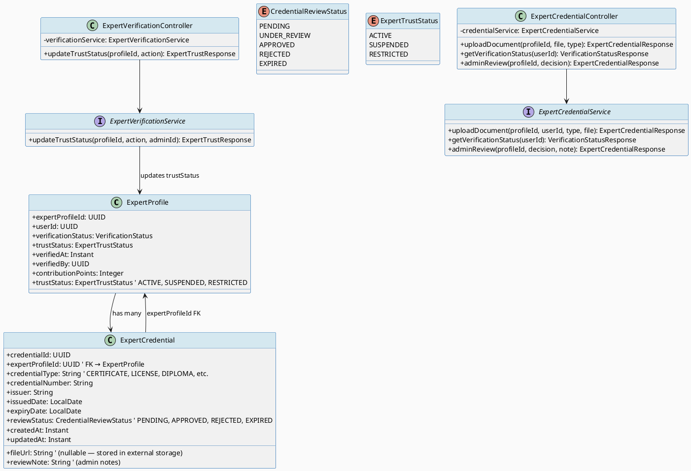
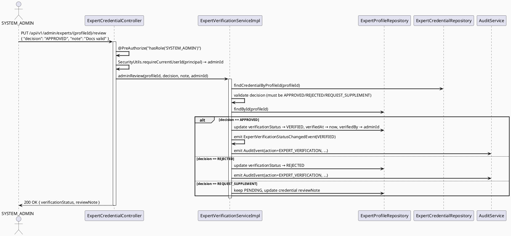
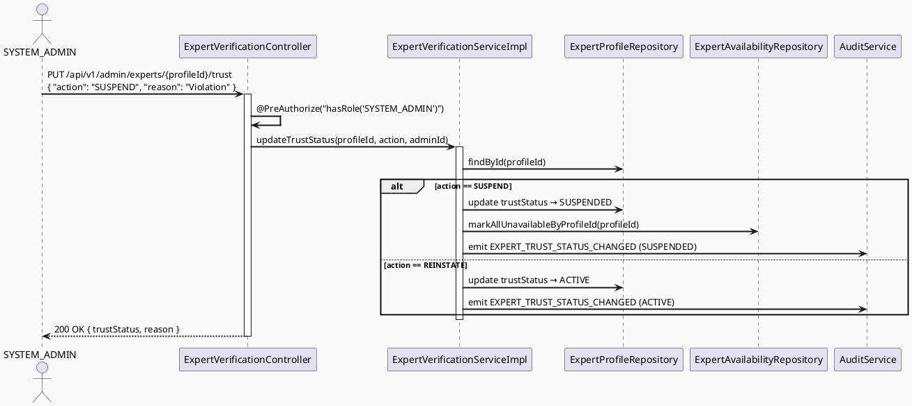

# CAREBRIDGE TECHNICAL DESIGN SPECIFICATION — PKG-02 ExpertVerification

## Metadata

| Field | Value |
|-------|-------|
| **Document ID** | `CB-EXPVERIFY-PKG-02-TDS` |
| **Version** | `1.0` |
| **Date** | 2026-07-03 |
| **Status** | `DRAFT` |
| **Package** | `PKG-02 — Expert Verification & Trust Status` |
| **Included UCs** | `UC-62, UC-63, UC-70, UC-71` |
| **Document Owner** | Lâm (TV4) |
| **Author** | Lâm — TV4 Developer |
| **Reviewed by** | `[ ] Pending` |
| **Based on** | CareBridge TDS Template v1.0 |

> **Stack:** Spring Boot 3.5.x · JDK 21 · JPA/Hibernate · PostgreSQL · Flyway · JUnit 5 · Mockito · MockMvc

---

## CHANGELOG

| Ngày | Người | Nội dung |
|------|-------|----------|
| 2026-07-03 | Lâm | Tạo TDS lần đầu |

---

## 1. Tổng quan Module

| Trường | Giá trị |
|--------|---------|
| **Module Name** | `expertverification` — Expert Verification & Trust Management |
| **Bounded Context** | `expert` (Verified Expert Network) |
| **UC IDs** | `UC-62, UC-63, UC-70, UC-71` |
| **Primary Actor(s)** | `EXPERT` (submit docs), `SYSTEM_ADMIN` (review, trust actions) |
| **Platform** | `Backend API + Admin Web Portal (React)` |
| **Data Classification** | `Confidential` (contains document/file URLs, admin notes) |
| **Upstream Dependencies** | `PKG-01_expert` (ExpertProfile), TV1 (auth/user) |
| **Downstream Consumers** | TV3 (ExpertBadgeReadPort), PKG-03_expertavailability |
| **External Integrations** | `Storage` (file upload — via TV1 file module or Firebase Storage) |

**Mô tả:** Module quản lý quy trình xác thực chuyên môn của expert. Expert upload tài liệu → admin review → approve/reject → trust status change. Owns `expert_credentials` table + verification state logic. Sử dụng `ExpertProfile` từ PKG-01. Phát emit AuditEvent cho mọi verification change.

---

## 2. Source-of-Truth Declaration

| Item | Source | Verified? | Notes |
|------|--------|-----------|-------|
| Table definitions | `V1__init_schema.sql` lines 802-815 | ✅ | `expert_credentials` table |
| FK target | `expert_profiles.expert_profile_id` | ✅ | `expert_credentials.expert_profile_id` |
| Role names | `rbac-role-mapping.md` | ✅ | `EXPERT`, `SYSTEM_ADMIN` |
| ExpertProfile entity | `PKG-01_expert` TDS | ✅ | Entity defined in PKG-01 |
| Business rules | `SRS §3.5.x.x UC-62/63/70/71` | ✅ | |

---

## 3. Traceability Matrix

| Requirement ID | Loại | Mô tả | Thành phần Code | Compliance Target | ADR |
|----------------|------|--------|-----------------|-------------------|-----|
| UC-62 | Use Case | Submit/replace verification documents | `ExpertCredentialController.uploadDocument` | BR-RBAC, Audit | ADR-VER-001 |
| UC-63 | Use Case | View verification status & renew | `ExpertCredentialController.getVerificationStatus` | BR-RBAC | ADR-VER-002 |
| UC-70 | Use Case | Admin review verification submission | `ExpertCredentialController.adminReview` | BR-RBAC, Audit | ADR-VER-001 |
| UC-71 | Use Case | Restrict/suspend/reinstate expert | `ExpertVerificationController.updateTrustStatus` | BR-RBAC, Audit | ADR-VER-003 |
| BR-VER-001 | Business Rule | Only SYSTEM_ADMIN can review/reject | `@PreAuthorize` | RBAC | — |
| BR-VER-002 | Business Rule | Only EXPERT (own) can upload docs | `@PreAuthorize` + owner check | RBAC | — |
| BR-VER-003 | Business Rule | Suspend → cascade to availability and directory | Service cascade | Data integrity | ADR-VER-003 |
| BR-AUDIT-001 | Audit | All verification changes emit AuditEvent | `AuditService.emit()` | Compliance | — |

---

## 4. ADRs

### ADR-VER-001 — Verification State Machine (approve/reject/renew)

| Status | Accepted |
|--------|----------|
| Date | 2026-07-03 |

**Context:** Expert verification có nhiều trạng thái trung gian. Cần enforce valid transitions trong code.

**Decision:**
- States: `PENDING → UNDER_REVIEW → VERIFIED|REJECTED`
- Rejected → can resubmit (back to PENDING)
- VERIFIED → auto-expires after configurable period → becomes `EXPIRED`
- UC-70 (admin review): transitions from PENDING or EXPIRED
- Each transition emits `ExpertVerificationStatusChangedEvent` → AuditService

**Consequences:**
- **Positive:** Deterministic state machine; clear admin audit trail
- **Trade-offs:** Admin must manually transition states; no auto-approval

### ADR-VER-002 — Credential Expiry Tracking

| Status | Accepted |
|--------|----------|
| Date | 2026-07-03 |

**Context:** Tài liệu chuyên môn (bằng cấp, chứng chỉ) có expiry date. UC-63 hiển thị remaining validity.

**Decision:**
- `expert_credentials.expiry_date` lưu date
- UC-63 GET response includes daysUntilExpiry (computed)
- If expired → flagged as `review_status = 'EXPIRED'`
- Expert renewal flow: resubmit with updated docs

**Consequences:**
- **Positive:** Self-service renewal; admin not overloaded
- **Trade-offs:** Requires expert to check status; no auto-notification yet (P1)

### ADR-VER-003 — Trust Status Cascade

| Status | Accepted |
|--------|----------|
| Date | 2026-07-03 |

**Context:** Khi admin suspend expert (UC-71), expert không được:
- Post answers (TV3 badge → not verified)
- Appear in directory (PKG-01 filters SUSPENDED)
- Accept nearby requests (PKG-03)

**Decision:**
- Single source of truth: `ExpertProfile.trustStatus`
- PKG-01, PKG-03, TV3 ExpertBadgeReadPort → check trustStatus
- UC-71 directly updates `ExpertProfile.trustStatus`
- Cascade done via service call within same transaction

**Consequences:**
- **Positive:** Single write point; no stale state
- **Trade-offs:** Cross-package dependency; must be in same DB transaction

---

## 5. Non-Functional Requirements

### 5.1 Performance

| Category | Requirement | Target SLA |
|----------|-------------|------------|
| Latency | API response (p99) | `< 300ms` |
| Throughput | Peak concurrent | MVP: ~50 users |
| File ops | Credential file upload | Async or background; return 202 Accepted |

### 5.2 Security

| Category | Requirement | Verification |
|----------|-------------|--------------|
| Authorization | EXPERT own docs; SYSTEM_ADMIN review all | `@PreAuthorize` + test |
| Data confidentiality | Credential files: admin-only read | DTO strips file URL from non-admin |
| Audit | All review/suspend actions emit AuditEvent | AuditService contract |
| Input validation | Bean Validation on all requests | Controller test |

---

## 6. Static Modeling

### 6.1 Class Diagram



### 6.2 JPA Entities

```java
@Entity
@Table(name = "expert_credentials")
@Getter @Setter @Builder @NoArgsConstructor @AllArgsConstructor
public class ExpertCredential {

  @Id
  @GeneratedValue(strategy = GenerationType.UUID)
  @Column(name = "credential_id", updatable = false, nullable = false)
  private UUID credentialId;

  @Column(name = "expert_profile_id", nullable = false)
  private UUID expertProfileId;

  @Column(name = "credential_type", length = 50, nullable = false)
  private String credentialType;  // CERTIFICATE, LICENSE, DIPLOMA, ID_CARD

  @Column(name = "credential_number", length = 100)
  private String credentialNumber;

  @Size(max = 200)
  @Column(name = "issuer", length = 200)
  private String issuer;

  @Column(name = "issued_date")
  private LocalDate issuedDate;

  @Column(name = "expiry_date")
  private LocalDate expiryDate;

  @Column(name = "file_url", columnDefinition = "text")
  private String fileUrl;

  // V1 default: 'PENDING'
  @Enumerated(EnumType.STRING)
  @Column(name = "review_status", length = 30, nullable = false)
  private CredentialReviewStatus reviewStatus = CredentialReviewStatus.PENDING;

  @Column(name = "review_note", columnDefinition = "text")
  private String reviewNote;

  // Who reviewed (FK → users.user_id) — nullable until reviewed
  @Column(name = "reviewed_by")
  private UUID reviewedBy;

  @Column(name = "reviewed_at")
  private Instant reviewedAt;

  @CreationTimestamp
  @Column(name = "created_at", nullable = false, updatable = false)
  private Instant createdAt;

  @UpdateTimestamp
  @Column(name = "updated_at", nullable = false)
  private Instant updatedAt;
}
```

```java
// Enums
public enum CredentialReviewStatus {
  PENDING, UNDER_REVIEW, APPROVED, REJECTED, EXPIRED
}

// (ExpertTrustStatus from PKG-01: ACTIVE, SUSPENDED, RESTRICTED)
// (VerificationStatus from PKG-01: PENDING, UNDER_REVIEW, VERIFIED, REJECTED, EXPIRED)
```

---

## 7. Dynamic Modeling

### 7.1 UC-70: Admin Review Verification (State Transition)



### 7.2 UC-71: Suspend Expert (Cascade)



---

## 8. Domain Event Catalog

| Event Name | Trigger | Publisher | Subscriber(s) | Async? |
|------------|---------|-----------|---------------|--------|
| `ExpertCredentialUploadedEvent` | UC-62 document uploaded | `ExpertCredentialServiceImpl` | AuditService, NotificationService | No |
| `ExpertVerificationReviewedEvent` | UC-70 admin decision | `ExpertVerificationServiceImpl` | AuditService, NotificationService | No |
| `ExpertTrustStatusChangedEvent` | UC-71 suspend/reinstate | `ExpertVerificationServiceImpl` | AuditService (PKG-01 cascade) | No |

### 8.1 Payload Schema

```java
public record ExpertVerificationReviewedEvent(
    String eventId, String eventType, Instant occurredAt, String version, Payload payload
) {
  public record Payload(
      UUID expertProfileId,
      UUID userId,
      CredentialReviewStatus decision,
      String reviewNote,
      UUID adminId
  ) {}
}
```

---

## 9. Interface Specification

### 9.1. Service Interfaces

```java
public interface ExpertCredentialService {

  /** UC-62: Upload/append verification document for expert's profile. */
  ExpertCredentialResponse uploadDocument(
      UUID expertProfileId, UUID userId, String credentialType,
      String fileUrl, CredentialUploadRequest request);

  /** UC-63: Get verification status summary for the logged-in expert. */
  VerificationStatusResponse getVerificationStatus(UUID userId);

  /** UC-70 (admin): Review and decide on credential/review. */
  AdminReviewResponse adminReview(
      UUID expertProfileId, AdminReviewRequest request, UUID adminId);
}
```

```java
public interface ExpertVerificationService {

  /** UC-71: Admin trust action — SUSPEND, RESTRICTED, REINSTATE. */
  ExpertTrustResponse updateTrustStatus(
      UUID expertProfileId, TrustAction action, UUID adminId, String reason);
}
```

### 9.2. Repository Interfaces

```java
public interface ExpertCredentialRepository extends JpaRepository<ExpertCredential, UUID> {
  List<ExpertCredential> findByExpertProfileId(UUID expertProfileId);
  Optional<ExpertCredential> findTopByExpertProfileIdOrderByCreatedAtDesc(UUID expertProfileId);
}
```

---

## 10. API Specification

### 10.1. Endpoints Table

| Method | Path | Auth Level | Required Roles | Rate Limit | Idempotent? |
|--------|------|-----------|----------------|------------|-------------|
| `POST` | `/api/v1/experts/{profileId}/credentials` | JWT Bearer | `EXPERT` (own) | 5/min | No |
| `GET` | `/api/v1/experts/verification-status` | JWT Bearer | `EXPERT` | 10/min | Yes |
| `PUT` | `/api/v1/admin/experts/{profileId}/review` | JWT Bearer | `SYSTEM_ADMIN` | 10/min | No |
| `PUT` | `/api/v1/admin/experts/{profileId}/trust` | JWT Bearer | `SYSTEM_ADMIN` | 5/min | No |
| `GET` | `/api/v1/admin/experts/verification/queue` | JWT Bearer | `SYSTEM_ADMIN` | 10/min | Yes |

### 10.2. Request / Response Samples

#### `PUT /api/v1/admin/experts/{profileId}/review` — UC-70

**Request Body:**
```json
{
  "decision": "APPROVED",
  "reviewNote": "Bằng bác sĩ hợp lệ, chứng chỉ còn hạn"
}
```

**Response — 200 OK:**
```json
{
  "success": true,
  "data": {
    "expertProfileId": "uuid",
    "verificationStatus": "VERIFIED",
    "trustStatus": "ACTIVE",
    "verifiedAt": "2026-07-03T10:30:00Z",
    "reviewNote": "Bằng bác sĩ hợp lệ, chứng chỉ còn hạn"
  }
}
```

#### `PUT /api/v1/admin/experts/{profileId}/trust` — UC-71

**Request Body:**
```json
{
  "action": "SUSPEND",
  "reason": "Vi phạm quy tắc cộng đồng — đưa ra lời khuyên không an toàn"
}
```

**Response — 200 OK:**
```json
{
  "success": true,
  "data": {
    "expertProfileId": "uuid",
    "trustStatus": "SUSPENDED",
    "action": "SUSPEND",
    "reason": "Vi phạm quy tắc cộng đồng — đưa ra lời khuyên không an toàn"
  }
}
```

---

## 11. Error Codes

| Code | HTTP Status | Message (EN) | Message (VI) | Trigger Condition |
|------|-------------|--------------|--------------|-------------------|
| `EXPERT-001` | 400 | Validation failed | Dữ liệu không hợp lệ | @NotBlank / @Size failure |
| `EXPERT-003` | 403 | Update not allowed during active review | Không thể cập nhật khi đang duyệt | Existing credential under UNDER_REVIEW |
| `EXPERT-004` | 404 | Expert profile not found | Không tìm thấy hồ sơ | profileId not in DB |
| `EXPERT-005` | 403 | Insufficient permissions | Không đủ quyền | Wrong role |
| `EXPVER-001` | 400 | Invalid review decision | Quyết định không hợp lệ | decision not in APPROVED/REJECTED/REQUEST_SUPPLEMENT |
| `EXPVER-002` | 400 | Invalid trust action | Hành động không hợp lệ | action not in SUSPEND/REINSTATE/RESTRICT |
| `EXPVER-003` | 409 | Credential already under review | Đang trong quá trình duyệt | Credential review_status = UNDER_REVIEW |
| `EXPVER-004` | 404 | Credential not found | Không tìm thấy tài liệu | credentialId not found |

---

## 12. Schema Mapping (V1 Verification)

### 12.1 Entity → V1 Column Mapping

| Entity Field | Java Type | V1 Column Name | V1 SQL Type | V1 Nullable | V1 Default | Match? | Notes |
|-------------|-----------|----------------|-------------|-------------|-----------|--------|-------|
| `credentialId` | `UUID` | `credential_id` | `uuid` | NOT NULL | `gen_random_uuid()` | ✅ | PK |
| `expertProfileId` | `UUID` | `expert_profile_id` | `uuid` | NOT NULL | — | ✅ | FK → expert_profiles |
| `credentialType` | `String` | `credential_type` | `varchar(50)` | NOT NULL | — | ✅ | |
| `credentialNumber` | `String` | `credential_number` | `varchar(100)` | NULL | — | ✅ | |
| `issuer` | `String` | `issuer` | `varchar(200)` | NULL | — | ✅ | |
| `issuedDate` | `LocalDate` | `issued_date` | `date` | NULL | — | ✅ | |
| `expiryDate` | `LocalDate` | `expiry_date` | `date` | NULL | — | ✅ | Used for UC-63 expiry check |
| `fileUrl` | `String` | `file_url` | `text` | NULL | — | ✅ | External storage pointer |
| `reviewStatus` | `CredentialReviewStatus` | `review_status` | `varchar(30)` | NOT NULL | `'PENDING'` | ✅ | |
| `reviewNote` | `String` | `review_note` | `text` | NULL | — | ✅ | Admin notes |
| `reviewedBy` | `UUID` | *(not in V1)* | — | — | — | ⚠️ | **NEW** — admin user reference |
| `reviewedAt` | `Instant` | *(not in V1)* | — | — | — | ⚠️ | **NEW** — review timestamp |
| `createdAt` | `Instant` | `created_at` | `timestamptz` | NOT NULL | `now()` | ✅ | |
| `updatedAt` | `Instant` | `updated_at` | `timestamptz` | NULL | `now()` | ✅ | |

### 12.2 FK Verification

| Entity Field | FK Target Table | V1 FK Constraint | Match? |
|-------------|----------------|------------------|--------|
| `expertProfileId` | `expert_profiles.expert_profile_id` | No explicit FK constraint in V1 | ⚠️ Enforce at app layer |

---

## 13. Schema Gap Section

| GAP-ID | Column / Constraint | TDS Claim | V1 Reality | Impact | Resolution |
|--------|--------------------|-----------|-----------|--------|------------|
| `GAP-VER-01` | `reviewed_by` column | Admin reference needed | V1 doesn't have this column | NON_BLOCKING | New migration adds nullable column |
| `GAP-VER-02` | `reviewed_at` column | Review timestamp needed | V1 doesn't have this column | NON_BLOCKING | New migration adds nullable column |
| `GAP-VER-03` | FK constraint on `expert_profile_id` | FK to expert_profiles | V1 has no FK constraint | NON_BLOCKING | Enforce at app layer |

*V1 schema cơ bản đủ cho PKG-02. 2 columns mới là additive changes.*

---

## 14. Implementation Order

### 14.1. Prerequisites
- [x] PKG-01_expert: `ExpertProfile`, `ExpertProfileRepository`, `VerificationStatus`, `ExpertTrustStatus`
- [x] TV1 auth: JWT filter, SecurityUtils, Role enforcement
- [x] V1 table `expert_credentials` exists (lines 802-815)

### 14.2. Implementation Steps

```bash
# Migration (additive)
V20260703__add_credential_review_metadata.sql
  - adds reviewed_by (uuid, nullable)
  - adds reviewed_at (timestamptz, nullable)

# Backend order:
1. expertverification/enums/CredentialReviewStatus.java
2. expertverification/entity/ExpertCredential.java
3. expertverification/repository/ExpertCredentialRepository.java
4. expertverification/dto/request/
    - CredentialUploadRequest.java
    - AdminReviewRequest.java
    - TrustActionRequest.java
5. expertverification/dto/response/
    - ExpertCredentialResponse.java
    - VerificationStatusResponse.java
    - AdminReviewResponse.java
    - ExpertTrustResponse.java
6. expertverification/mapper/ExpertCredentialMapper.java
7. expertverification/service/ExpertCredentialService.java
8. expertverification/service/impl/ExpertCredentialServiceImpl.java
9. expertverification/service/ExpertVerificationService.java
10. expertverification/service/impl/ExpertVerificationServiceImpl.java
11. expertverification/controller/ExpertCredentialController.java
12. expertverification/controller/ExpertVerificationController.java
13. expertverification/exception/
    - CredentialAlreadyUnderReviewException.java
    - InvalidReviewDecisionException.java
```

---

## 15. Rollback & Incident Runbook

| Condition | Threshold | Action |
|-----------|-----------|--------|
| Invalid admin review decision processed | Any | Reject — validate decision enum before save |
| Suspended expert still appears in answers Badge | Immediate | Check ExpertProfile.trustStatus is SUSPENDED → badge should show "suspended" not "verified" |
| Credential file URL 404 | Any | Graceful: show "document unavailable" — don't crash |

---

## 16. Test Scenarios (Overview)

### 16.1. Happy Path
```gherkin
Scenario: Admin approves pending verification
Given expert has profile (PENDING) + credentials uploaded (PENDING)
And admin is SYSTEM_ADMIN
When PUT /admin/experts/{id}/review { decision: "APPROVED" }
Then 200 OK; expert_profile.verificationStatus → VERIFIED; verifiedAt set
And AuditEvent emitted with action=EXPERT_VERIFICATION
```

### 16.2. Validation Failures
```gherkin
Scenario: EXPERT uploads with blank credential type
When POST /experts/{id}/credentials with { credentialType: "" }
Then 400 Bad Request, error.code = "EXPERT-001"
```

### 16.3. Authorization Tests
```gherkin
Scenario: MOTHER cannot review verification
Given JWT ROLE_MOTHER
When PUT /admin/experts/{id}/review
Then 403 Forbidden
```

### 16.4. Business Rule Tests
```gherkin
Scenario: Cannot upload credential while existing is UNDER_REVIEW
Given existing credential with review_status = UNDER_REVIEW
When POST new credential
Then 409 Conflict, error.code = "EXPVER-003"
```

```gherkin
Scenario: SUSPEND → expert not in directory (cascade)
Given expert trustStatus = SUSPENDED
When PKG-01 getDirectory() is called
Then expert NOT in result set
```

---

## 17. Verification Checklist

```markdown
Gate:
[ ] §2 Source-of-Truth: verified
[ ] §12 Schema Mapping: verified (2 new columns documented)
[ ] §10 API Contract: explicit
[ ] §18 Authorization Matrix: correct
[ ] ADR-001/002/003: reviewed

Exit:
[ ] mvnw test passes
[ ] 401/403 tests pass
[ ] AuditService.emit() verified
[ ] Cascade trustStatus → availability + directory tested
```

---

## 18. Authorization Matrix

| Endpoint | UNAUTHENTICATED | MOTHER | FAMILY | EXPERT | MODERATOR | CONTENT_ADMIN | SYSTEM_ADMIN | PARTNER |
|----------|:---------------:|:------:|:------:|:------:|:---------:|:-------------:|:------------:|:-------:|
| `POST /api/v1/experts/{id}/credentials` | ❌ (401) | ❌ | ❌ | ✅ (own) | ❌ | ❌ | ❌ | ❌ |
| `GET /api/v1/experts/verification-status` | ❌ (401) | ❌ | ❌ | ✅ (own) | ❌ | ❌ | ❌ | ❌ |
| `PUT /api/v1/admin/experts/{id}/review` | ❌ (401) | ❌ | ❌ | ❌ | ❌ | ❌ | ✅ | ❌ |
| `PUT /api/v1/admin/experts/{id}/trust` | ❌ (401) | ❌ | ❌ | ❌ | ❌ | ❌ | ✅ | ❌ |
| `GET /api/v1/admin/experts/verification/queue` | ❌ (401) | ❌ | ❌ | ❌ | ❌ | ❌ | ✅ | ❌ |

---

## 19. As-Built Reconciliation
> *Fill after implementation.*

---

## 20. AI Prompt Constraints

```
[CONSTRAINT BLOCK — Package: PKG-02 ExpertVerification]
TDS: CB-EXPVERIFY-PKG-02-TDS

1. Role enforcement:
   - POST /experts/{id}/credentials: @PreAuthorize("hasRole('EXPERT')") + owner check
   - PUT /admin/experts/{id}/review: @PreAuthorize("hasRole('SYSTEM_ADMIN')")
   - PUT /admin/experts/{id}/trust: @PreAuthorize("hasRole('SYSTEM_ADMIN')")

2. Owner extraction:
   - expertProfileId from @PathVariable + owner check via ProfileRepository.findByUserId()
   - adminId from SecurityUtils.requireCurrentUserId(principal)

3. Delete policy:
   - ExpertCredential: soft delete via review_status = 'REJECTED' (keep for audit)
   - ExpertProfile.trustStatus: soft via SUSPENDED (keep record)

4. Uniqueness:
   - One profile per user (already in PKG-01)
   - Multiple credentials per profile allowed (types: CERTIFICATE, LICENSE, etc.)

5. Audit:
   - PHẢI emit AuditEvent cho: upload, review decision, trust status change
   - Event payload includes adminId for review/trust actions

6. Schema constraints:
   - expert_profile_id FK → expert_profaces (enforced at app layer)
   - review_status: varchar(30), default 'PENDING'

7. Forbidden:
   - KHÔNG tạo consultation/payment/partner package
   - KHÔNG modify PKG-01 entity classes directly
   - KHÔNG expose file_url in non-admin responses
```

### Anti-Pattern Detection

| AP-ID | Anti-Pattern | Dấu hiệu | Hành động |
|-------|-------------|----------|-----------|
| AP-VER-001 | Wrong role | `hasRole('EXPERT')` missing for credential upload | Reject |
| AP-VER-002 | Weak owner check | `profileId` accepted without checking `userId` ownership | Reject |
| AP-VER-003 | Missing audit | No AuditEvent on review/trust change | Reject |
| AP-VER-004 | Hard delete | DELETE FROM expert_credentials | Reject — use review_status |
| AP-VER-005 | Exposed file URL | `fileUrl` in non-admin response DTO | Reject |
