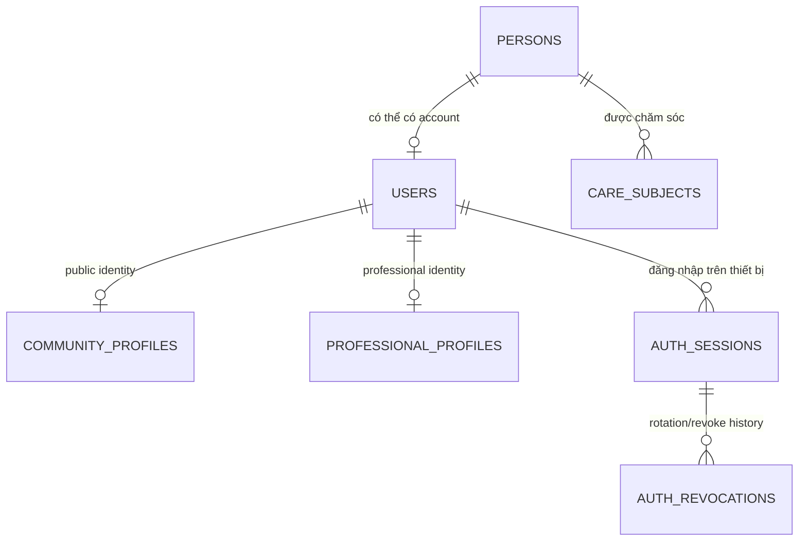

# CareBridge Database Redesign — 70 bảng core + 3 Release-1 extensions

> Cập nhật theo nhánh `integration/db-redesign-70`, merge commit `6f80fa73`.
>
> Tài liệu này tổng hợp thiết kế đã duyệt, migration đã triển khai, ảnh hưởng đến application mapping và trạng thái kiểm chứng. Flyway migration trong source code vẫn là nguồn sự thật khi có khác biệt.

## 1. Tóm tắt

| Hạng mục | Trước redesign | Target mới |
|---|---:|---:|
| Tổng số base tables | 127 | 73 (70 core + 3 extensions) |
| Business/application tables | — | 72 (69 core + 3 extensions) |
| Technical tables | — | 1 (`flyway_schema_history`) |
| Số bảng giảm | — | 54 deployed (57 ở core design) |
| Bảng giữ nguyên identity | — | 28 |
| Bảng tạo mới hoặc rebuild | — | 42 core + 3 extensions |
| Nguồn dữ liệu được merge | — | 74/74 |
| Drop candidates cần evidence | — | 25 |
| Invalid merge trong thiết kế đã duyệt | — | 0 |

Target 70 core thay thế target 65 trước đó. `care_items` và `legacy_archived_records` không còn trong core target; lifecycle được tách thành các bảng chuyên biệt. `triage_session_evidence` được bổ sung để claim/citation có thể query, index và audit. Epic 6 bổ sung ba Release-1 extension đã duyệt, nên inventory triển khai là **70 core + 3 extensions** thay vì mô tả sai là 70 bảng tổng cộng.

## 2. Nguyên tắc thiết kế chính

- `persons` chứa danh tính con người; `users` chỉ chứa account/authentication. `users.person_id` là unique FK.
- Baby được mô hình bằng `persons` + `care_subjects`, không tạo account giả.
- `community_profiles` là public identity, tách khỏi private person/account data.
- Professional identity, specialty và credential history có lifecycle riêng.
- Session/token revocation hỗ trợ từng thiết bị; không lưu raw token.
- Audit, moderation history, journey events, security notes và archive là append-only/immutable.
- Consent dùng versioned `data_permissions`, giữ scope, purpose, expiry, revoke và history ở scalar columns.
- Dữ liệu cần chart, filter, FK hoặc index không bị đẩy vào JSONB.
- JSONB chỉ dùng cho payload biến đổi, có schema version/hash khi cần audit.
- Reminder, family task và checklist được tách vì khác owner/lifecycle.
- Safety response, delivery và retry là từng row, có idempotency và per-device uniqueness.
- Không dùng `DROP CASCADE`; destructive migration phải kiểm tra dữ liệu và dependency trước.

## 3. Danh sách chính xác 70 bảng core

### Person / Care Subject — 2

1. `persons`
2. `care_subjects`

### Account / Auth — 6

3. `users`
4. `user_identities`
5. `auth_sessions`
6. `auth_revocations`
7. `auth_challenges`
8. `account_deletion_requests`

### Mother Journey — 4

9. `mother_journeys`
10. `mother_journey_events`
11. `maternal_observations`
12. `maternal_exercise_sessions`

### Baby Care — 5

13. `care_logs`
14. `growth_measurements`
15. `development_milestones`
16. `vaccination_records`
17. `vaccination_schedules`

### Community — 4

18. `community_profiles`
19. `community_topics`
20. `community_content`
21. `community_interactions`

### Expert — 7

22. `professional_profiles`
23. `specialties`
24. `professional_specialties`
25. `expert_credentials`
26. `expert_availability`
27. `expert_location_shares`
28. `expert_contribution_events`

### AI Triage / Knowledge — 6

29. `triage_sessions`
30. `triage_session_evidence`
32. `health_context_memories`
33. `knowledge_sources`
34. `knowledge_source_reviews`

### Health Records / Files / Devices — 5

35. `health_records`
36. `attachments`
37. `health_record_attachments`
38. `device_connections`
39. `health_observations`

### Family / Care Plan — 6

40. `care_groups`
41. `care_group_members`
42. `scheduled_care_items`
43. `family_tasks`
44. `preparation_checklist_items`
45. `care_item_templates`

### Verified Content / Moderation — 5

46. `content_items`
47. `content_item_topics`
48. `content_item_sources`
49. `moderation_cases`
50. `moderation_events`

### Notification — 2

51. `notification_records`
52. `device_tokens`

### Safety — 5

53. `safety_configs`
54. `safety_monitoring_sessions`
55. `safety_events`
56. `safety_event_actions`
57. `emergency_contacts`

### Facility / Nearby Care — 4

58. `administrative_areas`
59. `care_facilities`
60. `nearby_support_requests`
61. `nearby_support_responses`

### Audit / Security / Consent / Config — 4

62. `audit_events`
63. `security_events`
64. `data_permissions`
65. `system_configurations`

### Expense / Domain Archives / Infrastructure — 5

66. `expense_entries`
67. `archived_consultation_records`
68. `archived_realtime_records`
69. `archived_partner_records`
70. `flyway_schema_history`

### 3.1. Ba Release-1 extensions đã duyệt

71. `expert_consultation_requests`
72. `consultation_context_shares`
73. `consultation_context_citations`

Ba extension giữ request lifecycle, consented context snapshot và approved citation snapshot cho Epic 6. Chúng được kiểm kê ngoài core baseline nhưng nằm trong schema Release 1; validation phải chứng minh đúng **70 core + 3 extensions**.

## 4. Thay đổi theo domain

| Domain | Thay đổi chính | Kiểm soát được giữ |
|---|---|---|
| Person/account | Tách `user_profiles` thành `persons` và phần settings của `users` | Account không bị trộn với non-account; private/public identity tách biệt |
| Auth | `refresh_tokens`, `user_sessions`, `token_blacklist`, OTP/reset token chuyển sang session/revocation/challenge canonical | Token hash, expiry, device revoke, rotation và reuse detection |
| Mother | Metric, postpartum, safety answer và posture feedback chuyển thành typed observations | Type/value/unit/time là scalar; history không overwrite |
| Baby | `baby_profiles`, daily logs và retired link evidence chuyển thành person/care subject/log/event | Baby không thành user; profile giữ owner scope và không còn quan hệ với Mother Journey |
| Community | Question/answer chuyển thành self-referencing content; like/bookmark/follow/mute thành interaction | Exactly-one-target CHECK và unique actor/type/target |
| Expert | `expert_profiles` chuyển thành professional profile + multi-select specialties; credentials tách riêng | Verification/document history và specialty FK được giữ |
| Triage | Intake/structured data chuyển thành session + evidence | RED/emergency, stage, context, disclaimer, claim và citation có thể audit |
| Health/files | Health summaries, measurements, uploaded files và device data chuyển sang canonical records/attachments/observations | Query fields vẫn là scalar; attachment relation có unique pair |
| Care plan | Reminder, family task và checklist không còn bị gom vào `care_items` | Recurrence, assignee, snooze, completion và status có lifecycle riêng |
| Content/moderation | Report/action chuyển thành case + append-only events | Report state không ghi đè moderation history |
| Safety | Config/session/event/action tách rõ; response/delivery/attempt là từng action row | Idempotency, retry, per-device delivery và audit |
| Geography/facility | Province/district/ward thành cây `administrative_areas`; hospital thành `care_facilities` | Stable legacy code và hierarchy/FK |
| Audit/consent | Audit thành `audit_events`; consent thành versioned `data_permissions` | Immutable audit; scope/purpose/expiry/revoke/history |
| Out-of-scope archives | Consultation, realtime và partner records chuyển sang ba archive riêng | Retention/checksum/access policy theo domain |

## 5. Mapping 74 bảng nguồn merge

Các hàng dưới đây được nhóm theo cùng target nhưng bao phủ đúng 74 source tables đã duyệt.

| Old tables | Target tables | Mapping bắt buộc | Risk |
|---|---|---|---|
| `audit_logs`, `baby_journey_link_cleanup_summary` | `audit_events` | Giữ actor/entity, before/after, checksum; append-only | LOW |
| `baby_daily_logs` | `care_logs` | Typed log với subject/type/time scalar | LOW |
| `baby_link_submissions` | chỉ `audit_events` | Nguồn command đã retired: chỉ giữ bằng chứng lịch sử tối thiểu; không tạo lại quan hệ subject-to-journey hiện hành | LOW |
| `baby_profiles` | `persons`, `care_subjects` | Tách human identity và baby attributes | LOW |
| `care_tasks` | `family_tasks` | Giữ group, creator, assignee, due/status/completion | LOW |
| `reminders` | `scheduled_care_items` | Giữ recurrence, snooze, completion/skip và source FK | MEDIUM |
| `user_checklist_items` | `preparation_checklist_items` | Giữ owner, journey, template-entry FK, order | LOW |
| `checklist_templates`, `checklist_items` | `care_item_templates` | Root/entry rows, self-FK; không dùng JSONB list | MEDIUM |
| `community_answer_likes`, `community_question_likes`, `community_bookmarks`, `user_topic_follows`, `question_notification_mutes` | `community_interactions` | FK thật, exactly-one-target CHECK, unique interaction | MEDIUM |
| `community_questions`, `community_answers` | `community_content` | QUESTION/ANSWER rows và parent FK | LOW |
| `consent_grants` | `data_permissions` | Versioned append-only permission series | HIGH |
| `consultation_bookings`, `consultation_price_bands`, `consultation_sessions`, `expert_consultation_prices` | `archived_consultation_records` | Archive theo FK order với retention/checksum | HIGH |
| `direct_conversations`, `direct_messages`, `conversation_calls` | `archived_realtime_records` | Giữ parent/sender/idempotency/time/checksum | HIGH |
| `partner_organizations` | `archived_partner_records` | Immutable partner archive | HIGH |
| `content_reports`, `moderation_actions` | `moderation_cases`, `moderation_events` | Case state tách khỏi append-only actions | LOW |
| `content_sources`, `evidence_sources`, `evidence_source_review_log` | `knowledge_sources`, `content_item_sources`, `knowledge_source_reviews` | Tách source master, relation và review history | MEDIUM |
| `contribution_points` | `expert_contribution_events` | Append-only points/reason/source ledger | LOW |
| `device_measurements` | `health_observations` | Scalar metric/type/unit/time/quality | LOW |
| `districts`, `provinces`, `wards` | `administrative_areas` | Typed adjacency hierarchy và stable legacy codes | LOW |
| `emergency_map_handoffs` | `safety_event_actions` | Một MAP_HANDOFF action cho mỗi handoff | MEDIUM |
| `emergency_sessions`, `imu_safety_events`, legacy `safety_events` | rebuilt `safety_events` | Giữ trigger, sensor, location, status, source ID | HIGH |
| `family_alert_log` | `safety_event_actions` | Một FAMILY_ALERT action cho mỗi log | MEDIUM |
| `imu_monitoring_sessions` | `safety_monitoring_sessions` | Giữ sensitivity/status/start/end/actor | LOW |
| `safety_monitoring_config` | `safety_configs` | Giữ owner/updater và detection/alert settings | LOW |
| `exercise_safety_checks` | `maternal_observations` | Một row cho mỗi answer/block | HIGH |
| `exercise_sessions` | `maternal_exercise_sessions` | FK tới đúng template/config version | LOW |
| `posture_feedback_events` | `maternal_observations` | Một POSTURE_FEEDBACK row cho mỗi event | HIGH |
| `pregnancy_exercises`, `posture_analysis_configs` | `care_item_templates` | Versioned template/config rows | HIGH |
| `expenses` | `expense_entries` | Giữ owner/subject/amount/currency/date | LOW |
| `expert_profiles` | `professional_profiles`, `professional_specialties` | Multi-select specialty bằng mapping table | MEDIUM |
| `health_device_connections` | `device_connections` | Giữ provider, consent, token, scopes, status | LOW |
| `health_memory_entries` | `health_context_memories` | Giữ subject/session, expiry, deletion policy | LOW |
| `health_record_files` | `health_record_attachments` | Giữ order và unique record/attachment | LOW |
| `health_summaries` | `health_records` | SUMMARY subtype; có permission cutover gate | HIGH |
| `hospitals` | `care_facilities` | Verified upsert và legacy-ID reconciliation | MEDIUM |
| `intake_sessions`, `structured_intake_data` | `triage_sessions`, `triage_session_evidence` | Safety/context scalar + immutable evidence | HIGH |
| `maternal_health_metrics`, `postpartum_logs` | `maternal_observations` | Type/value/unit/time scalar | HIGH |
| `mother_baseline_contexts`, `mother_journey_transitions`, `pregnancy_outcome_evidence` | `mother_journeys`, `mother_journey_events` | Aggregate snapshot + immutable events | MEDIUM |
| `notification_preferences` | `users.settings_jsonb` | Chỉ validated settings; không chứa consent | MEDIUM |
| legacy `notifications` | `notification_records` | Reconcile ID/status/delivery/read | LOW |
| `otp_verifications`, `password_reset_tokens` | `auth_challenges` | Typed hashed challenge với attempt/expiry/used | LOW |
| `privacy_settings` | `users.settings_jsonb` | Private settings; consent history ở permission | MEDIUM |
| `refresh_tokens`, `user_sessions` | `auth_sessions`, `auth_revocations` | Token family/device + append-only revocation | HIGH |
| `security_event_notes` | `security_events` | Child NOTE events append-only | LOW |
| `token_blacklist` | `auth_revocations` | Token hash/expiry/reason có index | LOW |
| `uploaded_files` | `attachments` | Giữ owner/storage key/MIME/size/status | LOW |
| `user_profiles` | `persons`, `users` | Demographics tách khỏi account settings | LOW |
| `vaccination_reference_schedules` | `vaccination_schedules` | Giữ vaccine/dose/offset/description/key | LOW |

## 6. Các model canonical quan trọng

### 6.1 Person, account và care subject



`persons` không chứa password/provider/role. Baby tồn tại như person + care subject và không bắt buộc có `users` row.

### 6.2 Triage và evidence

- `triage_sessions` giữ stage, profile context, risk level, emergency flag, disclaimer version, status và completion.
- `triage_session_evidence` giữ từng claim/citation, source/version/hash bằng row có FK.
- Conversation/result payload có thể dùng JSONB nhưng phải versioned và không thay thế evidence cần query/audit.

### 6.3 Consent

- `data_permissions` dùng `permission_series_id` + `version_number`.
- Thay đổi scope, expiry hoặc revoke tạo version mới, không update đè grant cũ.
- Có self-FK `supersedes_permission_id` và unique `(permission_series_id, version_number)`.

### 6.4 Safety

- Mỗi response, delivery, attempt, family alert và map handoff là một `safety_event_actions` row.
- Unique delivery theo event/recipient/device và unique idempotency/attempt ngăn gửi trùng.
- Action history là immutable.

### 6.5 Care plan

- `scheduled_care_items`: lịch, recurrence, snooze, complete/skip.
- `family_tasks`: creator, assignee, due time, completion/cancellation.
- `preparation_checklist_items`: journey/template entry, order và completion.
- `care_item_templates`: root/entry/config là từng row self-referencing, có version/effective dates.

### 6.6 Archive

Ba archive tables thay cho một archive chung:

- `archived_consultation_records`
- `archived_realtime_records`
- `archived_partner_records`

Mỗi record giữ legacy table/id, owner nếu có, immutable payload, timestamps, retention, reason, schema version và checksum.

## 7. Migration implementation

### 7.1 Compatibility và cleanup trước Phase 2

| Migration | Mục đích |
|---|---|
| `V20260722020200__add_content_report_revert_columns.sql` | Sửa version collision và bổ sung revert fields |
| `V20260722020300__consolidate_notification_records.sql` | Hợp nhất notification persistence |
| `V20260722020400__consolidate_canonical_user_role.sql` | Chuẩn hóa role |
| `V20260722020500__remove_legacy_triage_persistence.sql` | Dọn triage tables không còn authority |
| `V20260722020600__consolidate_safety_monitoring_persistence.sql` | Chuẩn hóa safety monitoring |
| `V20260722020650__prepare_medical_contribution_facility_cutover.sql` | Gate contribution data và chuyển hospital sang facility |
| `V20260722020700__consolidate_nearby_care_facilities.sql` | Hợp nhất facility/nearby care |
| `V20260722020800__remove_consultation_payment_v2.sql` | Archive/dọn consultation-payment ngoài scope |
| `V20260722020900__remove_partner_sponsored_v2.sql` | Archive/dọn partner-sponsored ngoài scope |
| `V20260722020950__prepare_final_cleanup_compatibility.sql` | Gate compatibility cho identity verification legacy |
| `V20260722021000__remove_remaining_unused_release1_schema.sql` | Dọn schema Release 1 không dùng |
| `V20260722220000__prepare_specialties_canonical_cutover.sql` | Chuyển specialty code ngắn sang UUID + stable code |

Migration cũ `V20260720100001__add_content_report_revert_columns.sql` bị loại khỏi nhánh tích hợp để tránh trùng chức năng/version với migration canonical mới; không chỉnh sửa migration đã áp dụng trên database live.

### 7.2 Các wave tạo/migrate canonical schema

| Wave | Migration | Phạm vi |
|---:|---|---|
| 1 | `V20260722230100__phase2_account_person_auth.sql` | Person, account, identity, session, revocation, challenge |
| 2 | `V20260722230200__phase2_mother_baby.sql` | Journey, events, observations, baby care |
| 3 | `V20260722230300__phase2_community_expert.sql` | Community, professional profile, credential, specialty |
| 4 | `V20260722230400__phase2_triage_knowledge.sql` | Triage session/evidence và knowledge |
| 5 | `V20260722230500__phase2_health_files_devices.sql` | Health record, attachment, device observation |
| 6 | `V20260722230600__phase2_family_care_plan.sql` | Care group, reminder, task, checklist/template |
| 7 | `V20260722230700__phase2_content_moderation.sql` | Content relation, moderation case/event |
| 8 | `V20260722230800__phase2_safety_facility.sql` | Safety và nearby facility |
| 8b | `V20260722230850__phase2_administrative_area_cutover.sql` | Province/district/ward sang administrative hierarchy |
| 9 | `V20260722230900__phase2_audit_security_consent_archive.sql` | Audit, security, consent và archive |
| Gate | `V20260722231000__phase2_pending_drop_gate.sql` | Đánh giá runtime/FK/retention trước drop |

### 7.3 Các wave dọn legacy sau reconciliation

| Wave | Migration |
|---:|---|
| 1 | `V20260722231100__phase2_wave1_drop_legacy_account_auth.sql` |
| 2 | `V20260722231200__phase2_wave2_drop_legacy_mother_baby.sql` |
| 3 | `V20260722231300__phase2_wave3_drop_legacy_community_expert.sql` |
| 4 | `V20260722231400__phase2_wave4_drop_legacy_triage_knowledge.sql` |
| 5 | `V20260722231500__phase2_wave5_drop_legacy_health_files_devices.sql` |
| 6 | `V20260722231600__phase2_wave6_drop_legacy_family_care_plan.sql` |
| 7 | `V20260722231700__phase2_wave7_drop_legacy_content_moderation.sql` |
| 8 | `V20260722231800__phase2_wave8_drop_legacy_safety_facility.sql` |
| 9 | `V20260722231900__phase2_wave9_drop_legacy_audit_consent_archive.sql` |

Mỗi cleanup wave thực hiện row reconciliation, orphan/dependency checks và fail trước destructive action nếu evidence không đạt.

## 8. Danh sách 25 drop candidates

Các bảng dưới đây không được coi là `DROP_FINAL` chỉ vì có tên trong danh sách. Drop chỉ hợp lệ khi runtime reference bằng 0, inbound FK/dependency bằng 0 hoặc đã migrate, và retention decision đã rõ.

| Table | Retention/mapping decision cần xác nhận |
|---|---|
| `commission_config` | Xác nhận V2 config có thể loại bỏ |
| `commission_records` | Xác nhận financial retention |
| `consultation_disputes` | Dispute retention/legal hold |
| `consultation_messages` | Communication retention |
| `consultation_requests` | Archive nếu còn reference |
| `contribution_attachments` | Map sang canonical attachment nếu còn consumer/data |
| `emergency_events` | Map sang canonical safety event nếu còn reference |
| `expert_identity_verifications` | Giữ verification/audit evidence nếu cần |
| `expert_reviews` | Xác nhận review retention |
| `expert_verification_documents` | Map sang credential/attachment nếu còn reference |
| `impact_assessment_ratings` | Map sang interaction nếu còn reference |
| `location_snapshots` | Map sang owner safety/nearby aggregate |
| `medical_contributions` | Map sang content/expert history nếu còn runtime/data |
| `partner_expert_links` | Archive nếu retention áp dụng |
| `partner_services` | Archive nếu retention áp dụng |
| `payment_transactions` | Financial retention/legal hold |
| `refund_records` | Financial retention/legal hold |
| `roles` | Giữ RBAC history trong audit |
| `safety_alerts` | Map sang safety actions nếu còn reference |
| `safety_monitoring_settings` | Map sang safety config nếu còn reference |
| `settlement_records` | Financial retention/legal hold |
| `sponsored_campaigns` | Archive nếu retention áp dụng |
| `triage_answers` | Map sang triage snapshot nếu còn reference |
| `triage_assessments` | Map sang triage result nếu còn reference |
| `user_roles` | Giữ assignment history trong audit |

## 9. Application mapping đã thay đổi trên nhánh tích hợp

- Hibernate chuyển sang `ddl-auto=validate`; application không được tự tạo lại bảng legacy.
- Expert profile mapping dùng `professional_profiles`, canonical specialty UUID/code và `care_facilities`.
- Province/district entities/repositories được thay bằng `AdministrativeArea` hierarchy.
- `Hospital` mapping được thay bằng `CareFacility`.
- Expert identity verification được retarget vào credential history canonical.
- Uploaded file entity được retarget vào `attachments`; access metadata cũ cần tiếp tục rà policy vì target không chứa toàn bộ legacy columns.
- Các entity/repository/service dựa trên bảng đã archive hoặc loại khỏi Release 1 được gỡ hoặc chuyển mapping.
- Test fixture expert được cập nhật để tạo `persons` trước `users`.
- Web build đã được sửa conflict router và build thành công trên nhánh tích hợp.

## 10. Trạng thái validation hiện tại

| Validation | Kết quả |
|---|---|
| PostgreSQL disposable container | PASS |
| Flyway clean bootstrap | PASS |
| Số migration được validate/applied | 164 |
| Clean bootstrap table count | 73 (70 core + 3 extensions) |
| Business tables | 72 (69 core + 3 extensions) |
| Technical tables | 1 |
| Exact target-name comparison | PASS |
| Backend compile | PASS |
| Hibernate schema validation trên target 73 | PASS |
| Focused expert/file tests | PASS |
| Web production build | PASS |
| Full backend suite | PASS: 2.884 tests, 0 failures, 0 errors, 21 expected skips trên 455 suites |

Clean bootstrap trên PostgreSQL Testcontainers hiện trả về đúng 73 base tables và exact-name test xác nhận đủ 70 core + 3 extensions, không có bảng ngoài inventory đã duyệt. 21 skips còn lại là các gate opt-in cần external database/credentials hoặc test cấp controller đã được tách riêng; toàn bộ migration tests trọng yếu chạy với `Skipped: 0`. Chưa có migration nào được chạy lên Supabase/shared production database trong quá trình tích hợp này.

## 11. Blocker và việc còn phải làm

1. Chạy upgrade trên clone đại diện có dữ liệu thật; migration phải dừng nếu contribution/verification legacy còn live data chưa mapping hoặc reconciliation không đầy đủ.
2. Chạy các Gate0 read-only/manifest opt-in trên target database đã chọn; không dùng database shared làm môi trường thử destructive migration.
3. Trước khi cập nhật shared Supabase, phải có backup/rollback plan, quiesce writers và đúng một migration leader; không dùng Flyway repair hoặc chỉnh schema history để bỏ qua checksum/missing migration.
4. Cấp external credentials riêng khi cần chạy test Cloudinary end-to-end; không đưa credential vào repository hoặc hermetic test profile.

## 12. Cách kiểm tra schema 70 core + 3 extensions

```sql
SELECT
    count(*) FILTER (WHERE table_name <> 'flyway_schema_history') AS business_tables,
    count(*) FILTER (WHERE table_name = 'flyway_schema_history') AS technical_tables,
    count(*) AS total_tables
FROM information_schema.tables
WHERE table_schema = 'public'
  AND table_type = 'BASE TABLE';
```

Kết quả mong đợi:

```text
business_tables = 72
technical_tables = 1
total_tables = 73
```

Để kiểm tra exact names:

```sql
SELECT table_name
FROM information_schema.tables
WHERE table_schema = 'public'
  AND table_type = 'BASE TABLE'
ORDER BY table_name;
```

## 13. Quy tắc làm việc tiếp theo

- Không sửa migration đã được áp dụng; luôn thêm Flyway migration mới.
- Không bật `ddl-auto=update`, `create` hoặc `create-drop`.
- Không thêm core table thứ 71 hoặc Release-1 extension thứ 4 nếu chưa thay đổi approved target bằng quyết định thiết kế riêng.
- Không drop legacy table chỉ để ép count về target; mọi drop phải qua mapping, reconciliation và evidence gate.
- Không dùng `DROP CASCADE`.
- Không commit `.env`, database password, Supabase key hoặc dump chứa dữ liệu thật.
- Mỗi domain mapping phải có focused test và Hibernate validation.
- Flyway clean bootstrap và exact-name test phải chạy lại trước khi push bản cuối cho nhóm.

## 14. Tài liệu nguồn

- `DATABASE_REDESIGN_PHASE1.md`: approved target và merge/drop matrices.
- `DATABASE_REDESIGN_PHASE2_PLAN.md`: migration waves.
- `GATE0_DATABASE_AUDIT.md`: baseline inventory và evidence gate.
- `FINAL_CLEANUP_TABLE_INVENTORY.md`: runtime/data/dependency inventory.
- `FINAL_CLEANUP_LIVE_RECONCILIATION.md`: live-like reconciliation evidence.
- `FINAL_CLEANUP_CANONICAL_ENUM_REVIEW.md`: canonical enum decisions.
- `BATCH5_LIVE_RECONCILIATION.md`: cleanup reconciliation notes.
