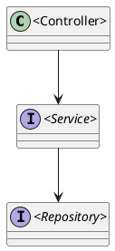
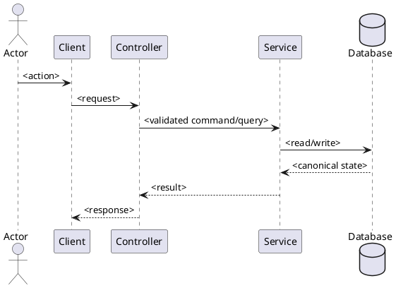

# ENGINEERING DOCUMENTATION STANDARD (EDS) v2.0
# Technical Design Specification — `<Feature Name>`

| Field | Value |
| --- | --- |
| **Document ID** | `<FEATURE-ID>-TDS` |
| **Version** | `1.0` |
| **Date** | `<YYYY-MM-DD>` |
| **Status** | `Draft` |
| **Document Owner** | `CareBridge Team` |
| **Author** | `<Author>` |
| **Reviewed by** | `Open` |
| **DPO Sign-off** | `Open / Not applicable — cite reason` |
| **Approved by** | `Open` |
| **Last Review** | `<YYYY-MM-DD>` |
| **Based on EDS** | `v2.0` |

> Drafts must not claim approval, implementation completion, test success, legal
> compliance, clinical accuracy, availability, or latency without dated evidence.

---

## CHANGELOG

| Date | Author | Change |
| --- | --- | --- |
| `<YYYY-MM-DD>` | `<Author>` | Initial code- and source-researched Draft. |

---

## TABLE OF CONTENTS

1. [Module Overview](#1-module-overview)
2. [Traceability Matrix](#2-traceability-matrix)
3. [Architecture Decision Records](#3-architecture-decision-records-adr)
4. [Non-Functional Requirements and SLA](#4-non-functional-requirements-and-sla)
5. [Static Modeling](#5-static-modeling)
6. [Dynamic Modeling](#6-dynamic-modeling)
7. [Domain Event Catalog](#7-domain-event-catalog)
8. [Interface Specification](#8-interface-specification)
9. [API Specification](#9-api-specification)
10. [Error Codes](#10-error-codes)
11. [Implementation and Deployment Plan](#11-implementation-and-deployment-plan)
12. [Rollback and Incident Runbook](#12-rollback-and-incident-runbook)
13. [Verification Scenario Groups](#13-verification-scenario-groups)
14. [Verification Methods](#14-verification-methods)
15. [Verification Samples](#15-verification-samples)
16. [Authorization Matrix](#16-authorization-matrix)
17. [AI Prompt Constraints — CASE 2.0](#17-ai-prompt-constraints--case-20)

---

## 1. Module Overview

| Field | Value |
| --- | --- |
| **Feature Name** | `<Feature Name>` |
| **Bounded Context** | `<backend package / web feature / mobile feature>` |
| **Function / UC IDs** | `<SRS IDs>` |
| **SRS Reference** | `<exact heading/table/line>` |
| **Primary Actor** | `<role>` |
| **Secondary Actors** | `<roles/services or Not applicable>` |
| **Trigger** | `<observable trigger>` |
| **User Outcome** | `<actor-visible outcome>` |
| **Platforms** | `Backend / Web / Mobile / Python AI / external provider` |
| **Priority** | `Open unless sourced` |
| **Data Classification** | `PII / Sensitive-PII / Internal / Public — cite source` |
| **Compliance Scope** | `<approved BR/policy or Open>` |
| **Upstream Dependencies** | `<components/contracts>` |
| **Downstream Consumers** | `<routes/screens/jobs/services>` |

### 1.1 Current-State Baseline

Describe what the current reachable code does. Distinguish implemented and
reachable behavior, API-only/operator-only behavior, partial infrastructure,
removed legacy behavior, existing tests, and known coverage gaps.

### 1.2 In Scope

- `<behavior supported by source evidence>`

### 1.3 Out of Scope

- `<explicit exclusion and source/reason>`

### 1.4 Preconditions and Postconditions

| Type | ID | Condition | Oracle source |
| --- | --- | --- | --- |
| Precondition | `PRE-01` | `<condition>` | `<source>` |
| Postcondition | `POST-01` | `<condition>` | `<source>` |

### 1.5 Open Questions and Contradictions

| ID | Question or contradiction | Evidence | Decision required |
| --- | --- | --- | --- |
| `OPEN-01` | `<unknown; do not guess>` | `<sources>` | `<approver/decision>` |

---

## 2. Traceability Matrix

| Requirement / Decision ID | Type | Requirement or decision | Source location | Owning component | Test condition |
| --- | --- | --- | --- | --- | --- |
| `<ID>` | `UC / FR / BR / AC / ADR / User decision` | `<text>` | `<path:line or heading>` | `<path/symbol>` | `<COND-ID>` |

Every in-scope statement must appear in this table. Code is evidence of current
state, not automatic authority for a desired-state decision.

---

## 3. Architecture Decision Records (ADR)

### ADR-`<DOMAIN>-001` — `<Decision title>`

| Field | Value |
| --- | --- |
| **Status** | `Proposed` |
| **Date** | `<YYYY-MM-DD>` |
| **Deciders** | `Open` |
| **Sources** | `<approved architecture/user decision/current-state evidence>` |

#### Context

`<Problem, constraints, and current-state evidence>`

#### Options Considered

| Option | Benefits | Costs / Risks |
| --- | --- | --- |
| A | `<benefit>` | `<risk>` |

#### Decision

`Open — no decision may be invented. Populate only when an approved source exists.`

#### Consequences

- Positive: `<effect>`
- Trade-off: `<effect>`
- Compatibility: `<effect>`

If no feature-specific architectural decision exists, state **Not applicable**
and explain why current repository conventions are reused unchanged.

---

## 4. Non-Functional Requirements and SLA

| Category | Requirement | Target | Verification method | Oracle source |
| --- | --- | --- | --- | --- |
| Performance | `<requirement or Open>` | `Open unless sourced` | `<method>` | `<source>` |
| Availability | `<requirement or Open>` | `Open unless sourced` | `<method>` | `<source>` |
| Security | `<requirement>` | `<target>` | `<method>` | `<source>` |
| Privacy | `<requirement>` | `<target>` | `<method>` | `<source>` |
| Accessibility | `<requirement or Open>` | `<target>` | `<method>` | `<source>` |
| Data integrity | `<requirement>` | `<target>` | `<method>` | `<source>` |

Do not infer SLA targets from framework choice or historical demonstrations.

---

## 5. Static Modeling

### 5.1 Component Responsibilities and Planned Paths

| Platform / Layer | Current or planned path | Symbol / artifact | Responsibility | Change type |
| --- | --- | --- | --- | --- |
| Backend Controller | `<path>` | `<symbol>` | `<transport responsibility>` | `Reuse / Modify / Add / Remove / None` |
| Backend Service | `<path>` | `<symbol>` | `<domain responsibility>` | `<type>` |
| Repository | `<path>` | `<symbol>` | `<persistence responsibility>` | `<type>` |
| Web | `<path>` | `<symbol>` | `<UI responsibility>` | `<type>` |
| Mobile | `<path>` | `<symbol>` | `<UI/device responsibility>` | `<type>` |
| External adapter | `<path>` | `<symbol>` | `<provider responsibility>` | `<type>` |

### 5.2 Class / Component Diagram



Replace the example with current feature components. Mark Not applicable only
when the feature has no static component relationship.

### 5.3 Data Model and Schema Delta

| Table / Store | Current fields used | Planned delta | Classification | Owner |
| --- | --- | --- | --- | --- |
| `<table/store>` | `<columns/keys>` | `None / exact change>` | `<classification>` | `<module>` |

#### Migration Plan

- Current authoritative baseline: `<V1 schema or explain current migration-only baseline>`.
- Existing relevant migrations: `<paths>`.
- New migration required: `No` or `Yes — V<timestamp>__<name>.sql`.
- Collision check: `<result>`.
- Baseline sync action: `<exact V1__init_schema.sql update or Not applicable with reason>`.
- Roll-forward and data-backfill constraints: `<details>`.

Never edit an already-applied Flyway migration.

---

## 6. Dynamic Modeling

### 6.1 Happy Path Sequence



### 6.2 Alternative and Empty-State Flows

| Flow ID | Trigger | Behavior | Postcondition | Oracle |
| --- | --- | --- | --- | --- |
| `ALT-01` | `<trigger>` | `<behavior>` | `<state>` | `<source>` |

### 6.3 Error, Timeout, Retry, and Concurrency Flows

| Flow ID | Failure or race | Detection | System response | Side effects | Oracle |
| --- | --- | --- | --- | --- | --- |
| `ERR-01` | `<failure>` | `<signal>` | `<response>` | `None / exact effect` | `<source>` |

### 6.4 State Machine and Invariants

```plantuml
@startuml <FeatureName>_State
[*] --> <State>
@enduml
```

If there is no finite-state lifecycle, state Not applicable and document
non-state invariants instead.

---

## 7. Domain Event Catalog

| Event | Published by | Trigger | Payload schema | Consumers | Delivery / retry |
| --- | --- | --- | --- | --- | --- |
| `<event or Not applicable>` | `<symbol>` | `<trigger>` | `<fields>` | `<consumers>` | `<semantics>` |

Document both published and consumed events. Do not invent an event when the
current module uses direct calls only.

---

## 8. Interface Specification

### 8.1 Service Interfaces

```java
// Signature-only contract. No implementation body.
public interface <FeatureService> {
    <Response> <operation>(<Request> request);
}
```

### 8.2 Repository Interfaces

```java
// Signature-only contract. Include only current or approved planned methods.
public interface <FeatureRepository> {
    <ReturnType> <operation>(<parameters>);
}
```

### 8.3 Client and External Adapter Interfaces

| Interface | Input | Output | Timeout / retry | Failure mapping | Source |
| --- | --- | --- | --- | --- | --- |
| `<interface>` | `<shape>` | `<shape>` | `Open or sourced value` | `<mapping>` | `<path>` |

---

## 9. API Specification

### 9.1 Endpoint Table

| Method | Path | Handler | Exact source | Authentication / roles / scope | Request type | Response type | Explicit statuses |
| --- | --- | --- | --- | --- | --- | --- | --- |
| `<METHOD>` | `<path>` | `<handler>` | `<controller/router path>` | `<annotation/mechanism/ownership>` | `<request DTO/model>` | `<response DTO/model>` | `<statuses evidenced in code>` |

Every declared route must resolve to its current Spring/FastAPI handler. If the
actor goal is a client-side composition rather than an aggregate API, enumerate
each exact owning endpoint and the projection rule. A generator/audit must fail
when a route is neither mapped to a completed UC nor explicitly classified as
Partial/API-only/supporting.

### 9.2 Request / Response Contract

#### `<METHOD> <path>`

| Item | Exact current contract |
| --- | --- |
| Handler / source | `<symbol>` / `<path>` |
| Authorization | `<annotation plus ownership/membership/consent policy>` |
| Parameters | `<path/query/body/principal parameters>` |
| Request fields / validators | `<field:type + exact annotations>` |
| Response fields | `<field:type>` |
| Positive / negative test mapping | `<COND-ID>` / `<TC-ID>` |

**Request**

```json
{}
```

**Success response**

```json
{}
```

**Validation, authorization, conflict, and dependency responses**

| Condition | HTTP | Error code | Response rule | Oracle |
| --- | --- | --- | --- | --- |
| `<condition>` | `<status>` | `<code>` | `<rule>` | `<source>` |

---

## 10. Error Codes

| Code | HTTP status | Message / semantic | Trigger | Owning mapper | Test condition |
| --- | --- | --- | --- | --- | --- |
| `<code or Open>` | `<status>` | `<meaning>` | `<condition>` | `<handler>` | `<COND-ID>` |

---

## 11. Implementation and Deployment Plan

### 11.1 Prerequisites

- [ ] TDS and paired Test-Spec reviewed; status remains Draft until human approval.
- [ ] Open decisions that change architecture or test oracles are resolved.
- [ ] Relevant migrations and external test doubles are available.

### 11.2 Ordered Implementation Steps

1. `<migration/data prerequisite or Not applicable>`
2. `<backend domain/service/repository>`
3. `<API/security>`
4. `<Web>`
5. `<Mobile>`
6. `<tests and verification>`

List exact files to reuse, modify, add, and remove. Do not include production code.

### 11.3 Compatibility Strategy

- API compatibility: `<strategy>`
- Data compatibility: `<strategy>`
- Client rollout order: `<strategy>`
- Feature flag / staged rollout: `<Open or sourced decision>`

### 11.4 Deployment Checklist

- [ ] `<migration check>`
- [ ] `<backend command>`
- [ ] `<web command>`
- [ ] `<mobile command>`

---

## 12. Rollback and Incident Runbook

### 12.1 Rollback Triggers

| Trigger | Threshold | Decision owner |
| --- | --- | --- |
| `<trigger>` | `Open unless sourced` | `<owner>` |

### 12.2 Rollback Procedure

Describe safe application rollback, data-forward repair, client compatibility,
and migration handling. Never recommend deleting Flyway history or using
destructive SQL on production without an approved runbook.

### 12.3 Notification and Post-Incident Review

`<roles/channels or Open>`

---

## 13. Verification Scenario Groups

Detailed test cases belong in the paired Test-Spec.

| Group | Conditions | Test-Spec IDs |
| --- | --- | --- |
| Happy path | `<conditions>` | `<TC IDs>` |
| Boundary / validation | `<conditions>` | `<TC IDs>` |
| Authorization / ownership | `<conditions>` | `<TC IDs>` |
| State / concurrency / idempotency | `<conditions>` | `<TC IDs>` |
| Privacy / safety | `<conditions>` | `<TC IDs>` |
| Provider failure / recovery | `<conditions>` | `<TC IDs>` |

---

## 14. Verification Methods

### 14.1 Automated Commands

```bash
# Backend
./mvnw test -Dtest=<TestClass>

# Web
npm run lint
npm run build
npm run test:run

# Mobile
flutter analyze
flutter test
```

Include only commands applicable to the feature and supported by the repository.

### 14.2 Database, Audit, and Static Inspection

`<queries and grep checks with sourced expected results>`

---

## 15. Verification Samples

Provide synthetic, non-production request examples and expected contracts.
Never include live tokens, secrets, health records, identity data, or unsupported
expected values.

---

## 16. Authorization Matrix

| Operation / Endpoint | MOTHER | FAMILY | EXPERT | MODERATOR | CONTENT_ADMIN | SYSTEM_ADMIN | Ownership / consent rule |
| --- | --- | --- | --- | --- | --- | --- | --- |
| `<operation>` | `Allow/Deny/N/A` | `...` | `...` | `...` | `...` | `...` | `<source>` |

---

## 17. AI Prompt Constraints — CASE 2.0

### 17.1 Constraint Summary Table

| ID | Constraint | Source | Last verified |
| --- | --- | --- | --- |
| `C1` | `<specific, testable constraint>` | `<ADR/BR/AC/path>` | `<date>` |

### 17.2 Constraint Injection Block

```text
[CONSTRAINT]
1. <Specific source-backed invariant>

[CONTEXT]
- Bounded context: <context>
- Data classification: <classification>
- Existing interfaces: TDS §8
- Authorization: TDS §16

[TASK]
Produce only the planned artifacts in TDS §11 and satisfy the paired Test-Spec.
```

### 17.3 Constraint Quality Checklist

- [ ] Every constraint is specific and traceable.
- [ ] Unknowns are Open rather than guessed.
- [ ] API, data, authorization, and state constraints agree with §§5–10 and §16.
- [ ] No foreign-project identifier, dependency, law, SLA, or path remains.

### 17.4 Anti-Pattern Detection

| AP-ID | Anti-pattern | Signal | Required action |
| --- | --- | --- | --- |
| `AP-AI-001` | Unconstrained generation | Output ignores C1–Cn | Reject |
| `AP-AI-002` | Invented contract | Endpoint/field/error absent from sources | Reject |
| `AP-AI-003` | Implicit architecture decision | Material choice has no ADR/approval | Stop and mark Open |
| `AP-AI-004` | Layer violation | Business policy moved into client/controller | Reject |
| `AP-AI-005` | Unsafe migration | Applied migration edited or destructive rollback invented | Reject |

---

*Status remains Draft until a human approver reviews the complete source trace,
open items, TDS, and paired Test-Spec.*
