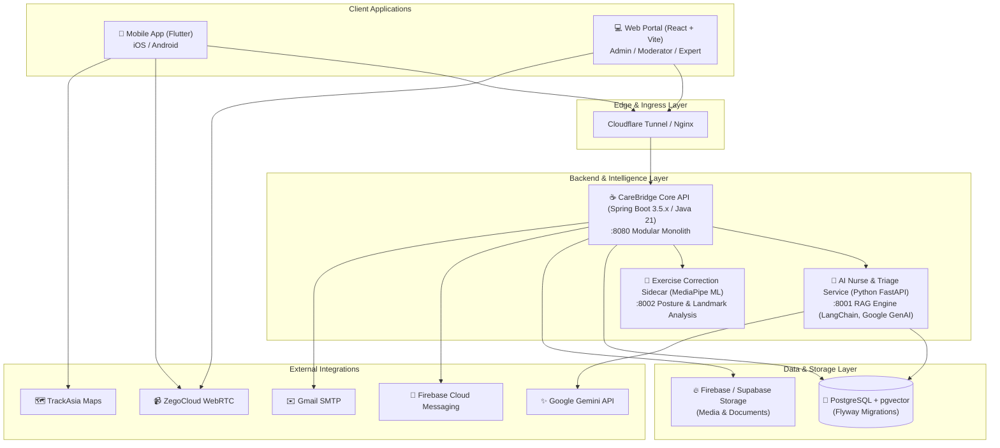

# CareBridge — Maternal & Early Childhood Healthcare Platform

CareBridge is an enterprise-grade, omnichannel healthcare platform designed to accompany mothers, infants, and families through every stage of pregnancy, childbirth, and early childhood care. The platform bridges the gap between families, medical experts, community support, and AI-powered clinical assistance.

---

## 📑 Table of Contents

- [CareBridge — Maternal \& Early Childhood Healthcare Platform](#carebridge--maternal--early-childhood-healthcare-platform)
  - [📑 Table of Contents](#-table-of-contents)
  - [🌟 System Overview](#-system-overview)
  - [✨ Core Functional Domains (88 Use Cases)](#-core-functional-domains-88-use-cases)
    - [1. Access, Identity, and Trust (11 Use Cases)](#1-access-identity-and-trust-11-use-cases)
    - [2. Expert and Teleconsultation (12 Use Cases)](#2-expert-and-teleconsultation-12-use-cases)
    - [3. Mother Journey and Health (19 Use Cases)](#3-mother-journey-and-health-19-use-cases)
    - [4. Baby Care \& Growth Tracking (8 Use Cases)](#4-baby-care--growth-tracking-8-use-cases)
    - [5. Community and Verified Content (6 Use Cases)](#5-community-and-verified-content-6-use-cases)
    - [6. AI Nurse and Clinical Assistance (1 Use Case)](#6-ai-nurse-and-clinical-assistance-1-use-case)
    - [7. Emergency, Safety, and Fall Detection (5 Use Cases)](#7-emergency-safety-and-fall-detection-5-use-cases)
    - [8. Family Cooperative Care (5 Use Cases)](#8-family-cooperative-care-5-use-cases)
    - [9. Administration and Operations (21 Use Cases)](#9-administration-and-operations-21-use-cases)
  - [🏗️ System Architecture](#️-system-architecture)
  - [🚀 Tech Stack](#-tech-stack)
  - [📁 Project Structure](#-project-structure)
  - [🛠️ Quick Start \& Local Setup](#️-quick-start--local-setup)
    - [Prerequisites](#prerequisites)
    - [1. Backend API (`05_Development/CareBridgeAPI`)](#1-backend-api-05_developmentcarebridgeapi)
    - [2. AI Nurse \& Triage Service (`05_Development/CareBridgeAITriageService`)](#2-ai-nurse--triage-service-05_developmentcarebridgeaitriageservice)
    - [3. Exercise Correction ML Sidecar (`05_Development/MachineLearning/MediaPipe_Posture/exercise_correction_sidecar`)](#3-exercise-correction-ml-sidecar-05_developmentmachinelearningmediapipe_postureexercise_correction_sidecar)
    - [4. Web Portal (`05_Development/CareBridgeWebApp`)](#4-web-portal-05_developmentcarebridgewebapp)
    - [5. Mobile App (`05_Development/CareBridgeMobileApp`)](#5-mobile-app-05_developmentcarebridgemobileapp)
    - [6. Running All Services Together](#6-running-all-services-together)
  - [🧪 Testing \& Quality Assurance](#-testing--quality-assurance)
    - [Backend Tests](#backend-tests)
    - [Web Portal Tests](#web-portal-tests)
    - [Mobile App Tests](#mobile-app-tests)
  - [👥 Demo \& Test Accounts](#-demo--test-accounts)
  - [⚙️ Development \& Git Guidelines](#️-development--git-guidelines)

---

## 🌟 System Overview

CareBridge provides a comprehensive digital ecosystem catering to multiple key user roles:
- **Mothers & Expectant Parents**: Pregnancy tracking, fetal kick monitoring, hydration & vitals logging, EPDS postpartum depression screening, baby care logs, WHO growth charts, personalized medical reminders, and SOS emergency alerts.
- **Healthcare Experts & Clinicians**: Biometric eKYC verification, two-tier credential audits, customizable availability calendars, end-to-end encrypted messaging, and 1-on-1 audio/video teleconsultations via ZegoCloud.
- **Family Members & Caregivers**: Shared care groups, granular permissions, collaborative task delegation, synchronized baby daily logs, and instant emergency notifications.
- **Administrators & Content Moderators**: Robust RBAC, CMS with versioned checklists & medical articles, AI moderation rules, user report resolution, and RAG knowledge base management.

Detailed requirements are formally documented in [Report3_Functional_Specifications.md](file:///Users/huy/Documents/Đồ án/CareBridge_SEP490_G79/02_Requirements/SRS/Report3_Functional_Specifications.md).

---

## ✨ Core Functional Domains (88 Use Cases)

CareBridge implements **88 complete, reachable use cases** categorized across 9 core business domains:

### 1. Access, Identity, and Trust (11 Use Cases)
- **UC-AC-01**: Multi-channel account registration (Email, Phone, Federated OTP) and initial role assignment.
- **UC-AC-02**: JWT authentication with RS256 signing, public key rotation ring, and secure session management.
- **UC-AC-03**: Multi-device login session inspection and remote revocation.
- **UC-AC-04 & UC-AC-05**: Password recovery via secure OTP token and self-service password update.
- **UC-AC-06 & UC-AC-07**: Profile management and Google OAuth2 identity linking.
- **UC-AC-08**: Multi-channel notifications with Firebase Cloud Messaging (FCM) and read acknowledgment.
- **UC-AC-09**: PDPA-compliant granular privacy settings and consent grant management.
- **UC-AC-10 & UC-AC-11**: Self-service account deactivation and account lock appeals submission.

### 2. Expert and Teleconsultation (12 Use Cases)
- **UC-EX-01 & UC-EX-02**: Expert onboarding, specialty classification (Doctor, Midwife, Lactation Consultant, Nutritionist, Psychologist), and digital contract acceptance.
- **UC-EX-03 & UC-EX-04**: Biometric eKYC facial verification, medical certificate submission, and verification tracking.
- **UC-EX-05 & UC-EX-06**: Public profile customization and interactive working hours/availability calendar.
- **UC-EX-07**: Public expert directory with specialty filtering, rating, reviews, and search.
- **UC-EX-08 & UC-EX-09**: Mother-initiated consultation requests, appointment scheduling, and expert request processing.
- **UC-EX-10**: End-to-end direct messaging, medical records sharing, and prescription attachments.
- **UC-EX-11**: High-definition 1-on-1 audio and video teleconsultation powered by ZegoCloud.
- **UC-EX-12**: Expert review of shared maternal vitals, health records, and daily care checklists.

### 3. Mother Journey and Health (19 Use Cases)
- **UC-MH-01 & UC-MH-02**: Journey onboarding across 3 life stages (Planning, Pregnancy, Postpartum) and gestation tracking (LMP, EDD, trimester milestones).
- **UC-MH-03 & UC-MH-04**: Pregnancy outcome recording (birth transition) and interactive maternal dashboard with weekly baby development timeline.
- **UC-MH-05 & UC-MH-06**: Personalized health recommendation profiling and weekly tailored advice.
- **UC-MH-07**: Comprehensive maternal vitals logging (Weight, Blood Pressure, Blood Glucose, Mood, Sleep, Symptoms).
- **UC-MH-08**: Fetal movement (kick counter) session tracker with abnormal kick count alerts.
- **UC-MH-09**: Daily hydration tracking, volume targets, and drink reminders.
- **UC-MH-10**: Standardized Edinburgh Postnatal Depression Scale (EPDS) screening and risk scoring.
- **UC-MH-11**: AI-powered preliminary health overview and symptom triage assistance.
- **UC-MH-12**: Digital health records repository (Ultrasound images, lab results, prescriptions).
- **UC-MH-13**: Prenatal appointments scheduler and calendar integration.
- **UC-MH-14 & UC-MH-15**: Smart push reminders for medications, supplements, vaccinations, and recurring custom schedules.
- **UC-MH-16 & UC-MH-17**: Customizable preparation checklists (hospital bag, prenatal checklist) and Unified "Today's Tasks" dashboard.
- **UC-MH-18 & UC-MH-19**: Prenatal/postnatal exercise catalogue with contraindication safety screening and guided workout timer sessions.

### 4. Baby Care & Growth Tracking (8 Use Cases)
- **UC-BC-01 & UC-BC-02**: Multiple infant profile management and unified Baby Care Hub dashboard.
- **UC-BC-03 & UC-BC-04**: Comprehensive baby daily logging (Breastfeeding, Formula, Solid food, Diaper wet/dirty, Sleep, Bath, Symptoms) and 24-hour summary analytics.
- **UC-BC-05**: WHO-standard child growth charts and percentiles (Weight, Height, Head Circumference).
- **UC-BC-06**: Age-appropriate developmental milestone tracking (Motor, Cognitive, Language, Social).
- **UC-BC-07 & UC-BC-08**: National immunization registry, vaccination history, and automated next-dose reminders.

### 5. Community and Verified Content (6 Use Cases)
- **UC-CO-01 & UC-CO-02**: Community Q&A forum with stage-based filtering, keyword search, and optional anonymous question posting.
- **UC-CO-03**: Peer and verified expert answer threads (with distinguished verified expert badges).
- **UC-CO-04**: Bookmarking, liking, and following community questions and topics.
- **UC-CO-05**: Curated, evidence-based healthcare articles, FAQs, and infographics.
- **UC-CO-06**: Community content reporting (spam, medical misinformation, harassment).

### 6. AI Nurse and Clinical Assistance (1 Use Case)
- **UC-AI-01**: 24/7 AI Nurse assistant powered by Retrieval-Augmented Generation (RAG) using Google Gemini and `pgvector` on verified clinical guidelines, offering safe maternal triage recommendations with strict medical disclaimers.

### 7. Emergency, Safety, and Fall Detection (5 Use Cases)
- **UC-ES-01**: Nearest healthcare facility locator and GPS navigation powered by TrackAsia Maps.
- **UC-ES-02 & UC-ES-03**: One-tap SOS emergency trigger, real-time GPS location dispatch, and synchronized family emergency broadcast alerts.
- **UC-ES-04 & UC-ES-05**: Accelerometer-based fall/impact detection, sensitivity calibration, and automated 30-second countdown safety check.

### 8. Family Cooperative Care (5 Use Cases)
- **UC-FM-01 & UC-FM-02**: Maternal Care Group creation, QR code/invite link member onboarding.
- **UC-FM-03**: Role-based granular permissions (Partner, Grandparent, Caregiver).
- **UC-FM-04**: Shared family care task delegation, assignment, and completion tracking.
- **UC-FM-05**: Real-time family care event feed and activity monitoring.

### 9. Administration and Operations (21 Use Cases)
- **UC-AD-01 to UC-AD-05**: User account RBAC management, staff provisioning, account lock appeal review, immutable security audit logging, and system maintenance mode controls.
- **UC-AD-06 & UC-AD-07**: Two-tier expert credential verification and teleconsultation audit oversight.
- **UC-AD-08 & UC-AD-09**: Rich-text CMS for versioned health articles, FAQs, and community taxonomy/tagging hierarchy.
- **UC-AD-10 to UC-AD-13**: Checklist template authoring, approval and activation lifecycle, exercise catalogue management, and posture config parameters.
- **UC-AD-14 & UC-AD-15**: Editorial approval workflow for expert-submitted articles and content archival/unpublishing.
- **UC-AD-16 to UC-AD-19**: Community content moderation queue, user report resolution, account violation strikes/penalties, and AI automated moderation policies.
- **UC-AD-20 & UC-AD-21**: AI RAG Knowledge Base document ingestion/vector indexing and AI diagnostic/clinical response simulators.

---

## 🏗️ System Architecture

CareBridge adopts a **Modular Monolith** core supported by specialized Python microservices and multi-platform clients:



---

## 🚀 Tech Stack

| Layer                      | Technologies                                                                                                                                       |
| :------------------------- | :------------------------------------------------------------------------------------------------------------------------------------------------- |
| **Backend API**            | Java 21, Spring Boot 3.5.x, Spring Data JPA, Spring Security (RS256 JWT ring), Flyway, Apache Tika, Lombok, Maven                                  |
| **AI Nurse & RAG Service** | Python 3.11+, FastAPI, Uvicorn, LangChain, Google GenAI (Gemini API), SQLAlchemy, `asyncpg`, `pgvector`                                            |
| **Exercise ML Sidecar**    | Python 3.10+, Google MediaPipe, Scikit-learn, NumPy, Dockerized Inference Service                                                                  |
| **Web Portal**             | React 19, TypeScript, Vite, TanStack React Query, React Hook Form, Zod, Tiptap WYSIWYG, Lucide Icons, ZegoCloud UIKit, Zustand, Vitest, Playwright |
| **Mobile App**             | Flutter 3.22+, Dart, Firebase Core / FCM / Firestore / Auth, Zego Express Engine, Sensors Plus, Geolocator, Flutter Secure Storage, GoRouter       |
| **Database & Cache**       | PostgreSQL 16+ with `pgvector` extension, Flyway schema versioning, Supabase                                                                       |
| **External Services**      | Google Gemini 1.5/2.0, ZegoCloud RTC, TrackAsia Maps API, Firebase Auth & FCM, VNPay Gateway, Gmail SMTP                                           |
| **DevOps & Infra**         | Docker Compose, Cloudflare Tunnel, Nginx, GitLab CI/CD                                                                                             |

---

## 📁 Project Structure

CareBridge strictly adheres to a structured Software Development Life Cycle (SDLC) layout:

```text
CareBridge_SEP490_G79/
├── 01_Planning/                  # Meeting minutes, sprint schedules, risk logs, and WBS
├── 02_Requirements/              # SRS, Use Case Catalogue (Report 3), Business Rules, DFD, RTM
├── 03_Design/                    # System Architecture, Database ERD, Class/Sequence diagrams, UI/UX Mockups
├── 04_Implement/                 # Technical Design Specs (TDS), Test-Specs, and Route Coverage Audits
├── 05_Development/               # Source code implementations
│   ├── CareBridgeAPI/            # Spring Boot backend application (:8080)
│   ├── CareBridgeAITriageService/# Python FastAPI RAG & AI Nurse service (:8001)
│   ├── CareBridgeMobileApp/      # Flutter cross-platform mobile app
│   ├── CareBridgeWebApp/         # React TypeScript admin, expert, and moderation portal (:5173)
│   ├── Contracts/                # Shared API schemas and DTO contracts
│   ├── Database/                 # Database migrations and seed scripts
│   ├── Deployment/               # Docker Compose, Nginx, and edge topology configs
│   ├── DevTools/                 # Local development scripts and utilities
│   ├── Firebase/                 # Firebase security rules and emulator configs
│   ├── Gadgetbridge/             # Wearable & sensor integration modules
│   ├── MachineLearning/          # Machine learning posture & exercise correction sidecar (:8002)
│   │   └── MediaPipe_Posture/exercise_correction_sidecar/
│   └── STARTUP.md                # Comprehensive local service startup guide
├── 06_Testing/                   # Test cases, automated test scripts, security/privacy audit reports
├── 07_Reports/                   # Project milestone and progress reports
└── 08_References/                # Reference documents, medical templates, and sample datasets
```

---

## 🛠️ Quick Start & Local Setup

For complete local startup instructions, see [05_Development/STARTUP.md](file:///Users/huy/Documents/Đồ án/CareBridge_SEP490_G79/05_Development/STARTUP.md).

### Prerequisites
- **Java**: JDK 21+
- **Node.js**: v20+ & npm
- **Flutter SDK**: 3.22+
- **Python**: 3.10+ / 3.11+
- **Docker & Docker Compose**: 24+

---

### 1. Backend API (`05_Development/CareBridgeAPI`)

1. Copy `.env.example` to `.env` in `05_Development/CareBridgeAPI/` and configure database credentials and JWT keys:
   ```bash
   cp 05_Development/CareBridgeAPI/.env.example 05_Development/CareBridgeAPI/.env
   ```
2. Start PostgreSQL (via Docker Compose) or configure remote Supabase DB:
   ```bash
   cd 05_Development/CareBridgeAPI
   docker compose up -d
   ```
3. Run the Spring Boot application:
   ```bash
   # macOS / Linux
   ./mvnw spring-boot:run

   # Windows PowerShell
   .\mvnw.cmd spring-boot:run
   ```
   Backend starts at: `http://localhost:8080` (Swagger UI at `/swagger-ui.html` if enabled).

---

### 2. AI Nurse & Triage Service (`05_Development/CareBridgeAITriageService`)

1. Create a virtual environment and install dependencies:
   ```bash
   cd "05_Development/CareBridgeAITriageService"
   python3 -m venv venv
   source venv/bin/activate  # On Windows: .\venv\Scripts\activate
   pip install -r requirements.txt
   ```
2. Configure `.env` with `GEMINI_API_KEY` and Database credentials.
3. Run the FastAPI server on port **8001**:
   ```bash
   ./venv/bin/uvicorn app.main:app --reload --host 0.0.0.0 --port 8001
   ```
   AI Service starts at: `http://localhost:8001`.

---

### 3. Exercise Correction ML Sidecar (`05_Development/MachineLearning/MediaPipe_Posture/exercise_correction_sidecar`)

The landmark-only inference service provides posture analysis and exercise feedback for maternal workouts using Google MediaPipe models.

```bash
cd "05_Development/MachineLearning/MediaPipe_Posture/exercise_correction_sidecar"
docker build -t exercise-correction .
docker run -p 8002:8002 exercise-correction
```
Exercise Correction Sidecar starts at: `http://localhost:8002`.

---

### 4. Web Portal (`05_Development/CareBridgeWebApp`)

1. Install dependencies:
   ```bash
   cd 05_Development/CareBridgeWebApp
   npm install
   ```
2. Start the Vite development server:
   ```bash
   npm run dev
   ```
   Web portal starts at: `http://localhost:5173`.

---

### 5. Mobile App (`05_Development/CareBridgeMobileApp`)

1. Get Flutter dependencies:
   ```bash
   cd 05_Development/CareBridgeMobileApp
   flutter pub get
   ```
2. Run on Chrome, Emulator, or Physical Device:
   ```bash
   # Run on Chrome (web port 5000)
   flutter run -d chrome --web-port=5000

   # Run on Android/iOS emulator
   flutter run

   # Run on physical device specifying host IP
   flutter run -d <device-id> --dart-define=API_BASE_URL=http://<YOUR_LOCAL_IP>:8080
   ```

---

### 6. Running All Services Together

```bash
# Terminal 1 — Backend Core API (Port 8080)
cd 05_Development/CareBridgeAPI && ./mvnw spring-boot:run

# Terminal 2 — AI Nurse & Triage Service (Port 8001)
cd 05_Development/CareBridgeAITriageService && ./venv/bin/uvicorn app.main:app --reload --host 0.0.0.0 --port 8001

# Terminal 3 — Exercise ML Sidecar (Port 8002)
cd 05_Development/MachineLearning/MediaPipe_Posture/exercise_correction_sidecar && docker build -t exercise-correction . && docker run -p 8002:8002 exercise-correction

# Terminal 4 — Web Portal (Port 5173)
cd 05_Development/CareBridgeWebApp && npm run dev

# Terminal 5 — Mobile App
cd 05_Development/CareBridgeMobileApp && flutter run
```

---

## 🧪 Testing & Quality Assurance

### Backend Tests
```bash
cd 05_Development/CareBridgeAPI
./mvnw test
```

### Web Portal Tests
```bash
cd 05_Development/CareBridgeWebApp

# Unit and component tests
npm run test

# End-to-end Playwright tests
npm run test:e2e
```

### Mobile App Tests
```bash
cd 05_Development/CareBridgeMobileApp
flutter test
```

---

## 👥 Demo & Test Accounts

> [!NOTE]
> Synthetic demo accounts are populated only when the Spring `dev` profile is active, `prod` is absent, and `CAREBRIDGE_DEV_SEED_ENABLED=true` is set. Dev seeding is disabled by default. Passwords must be supplied via `CAREBRIDGE_DEV_SEED_PASSWORD` and never committed to Git.

| Role              | Synthetic Email            | Primary Function                                            |
| :---------------- | :------------------------- | :---------------------------------------------------------- |
| **SYSTEM_ADMIN**  | `admin@carebridge.dev`     | System settings, user role management, audit inspection     |
| **MODERATOR**     | `moderator@carebridge.dev` | Community moderation, appeals review, topic taxonomy        |
| **CONTENT_ADMIN** | `content@carebridge.dev`   | CMS health articles, FAQs, and checklist template authoring |
| **EXPERT**        | `expert@carebridge.dev`    | Teleconsultations, maternal record review, expert answers   |
| **PARTNER**       | `partner@carebridge.dev`   | Healthcare clinic & partner profile administration          |
| **MOTHER**        | `mother@carebridge.dev`    | Pregnancy & postpartum journey, baby logs, AI nurse chat    |
| **FAMILY**        | `family@carebridge.dev`    | Cooperative family care group member, shared task execution |

---

## ⚙️ Development & Git Guidelines

1. **Dual Remote Workflow**: Always pull from both `github` and `gitlab` remotes before pushing. Feature development is performed on personal branch `HuyND` and merged into `dev` following the project safety workflow.
2. **Granular Commits**: Commit logically separated changes by module/area using conventional commits (`feat:`, `fix:`, `style:`, `refactor:`).
3. **Database Migrations**: All schema modifications must be scripted as versioned Flyway migrations under `05_Development/CareBridgeAPI/src/main/resources/db/migration/`. Never modify existing applied migration files.
4. **Data Protection & Privacy**: CareBridge enforces strict access control policies on patient medical records and personal data in compliance with PDPA guidelines.
