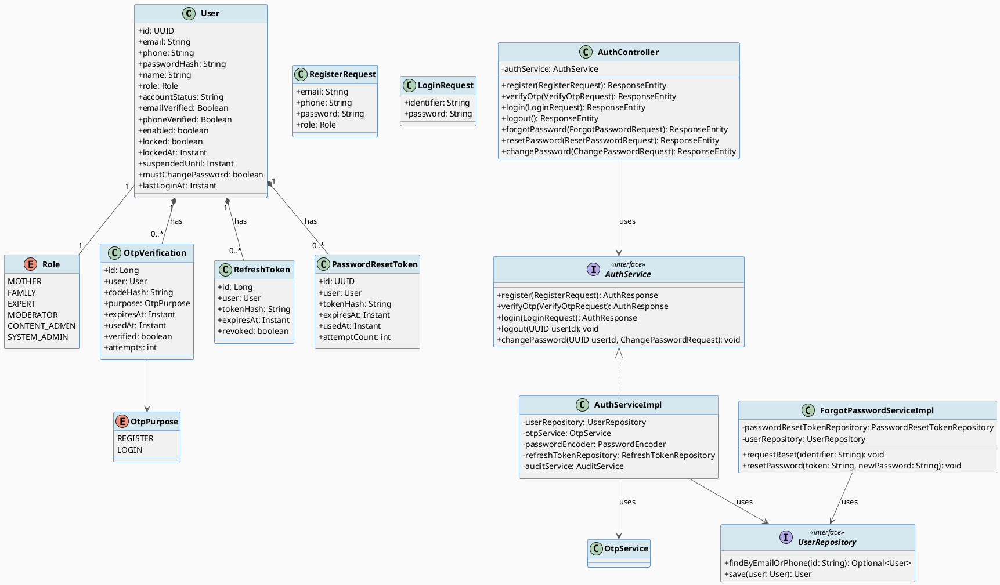
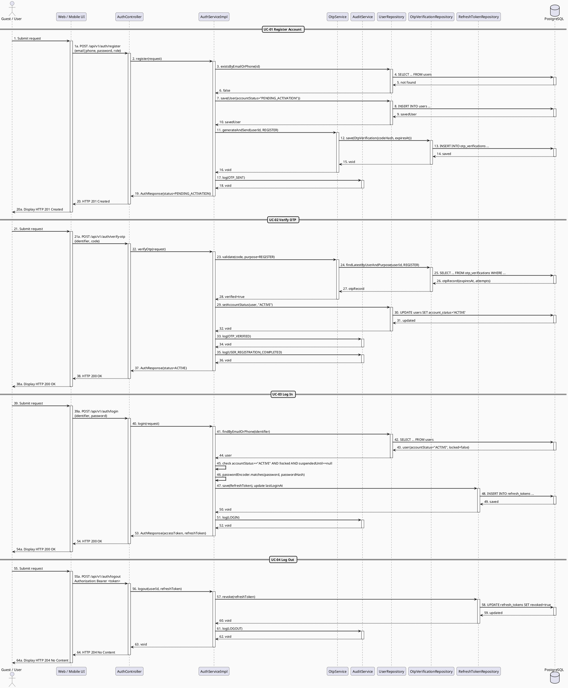

# MF-01 / Spec 01 — Account Registration & Authentication Lifecycle

| Field | Value |
| --- | --- |
| Feature | MF-01 — Account, Trust & Access Control |
| Use Cases Covered | UC-01 Register Account, UC-02 Verify OTP, UC-03 Log In, UC-04 Log Out, UC-05 Request Password Reset, UC-06 Reset Password, UC-07 Change Password |
| Primary Actor(s) | Guest → User |
| Secondary Actors | OTP / Email Service |
| Platform | Mobile App / Web Portal |
| Main Flow Summary | A Guest registers with email/phone + password, confirms ownership via OTP to activate the account, then logs in and receives a session. Forgot/Reset/Change password are the credential-recovery and credential-rotation branches of the same identity lifecycle. |
| Grounding (source code) | `security/entity/User.java`, `OtpVerification.java`, `RefreshToken.java`, `PasswordResetToken.java`, `security/controller/AuthController.java` (`/api/v1/auth/*`), `security/service/impl/AuthServiceImpl.java`, `ForgotPasswordServiceImpl.java` |

## 1. Tổng quan luồng chính (Main Flow Overview)

Đây là luồng "xương sống" của MF-01: không có tài khoản nào truy cập được dữ liệu
riêng tư (mother/baby/health) nếu chưa đi qua chuỗi **Register → Verify OTP → Login**.
`User.accountStatus` bắt đầu ở `PENDING_ACTIVATION`, chỉ chuyển sang `ACTIVE` sau khi
OTP đúng (BR-ACCOUNT-02). Đăng nhập kiểm tra `accountStatus`, `enabled`, `locked` và
`suspendedUntil` trước khi phát hành `RefreshToken` (BR-SECURITY-01). Logout thu hồi
refresh token hiện tại (BR-SECURITY-02). Forgot/Reset Password dùng một
`PasswordResetToken` một-lần dùng, có hạn (BR-SECURITY-03/04); Change Password yêu cầu
xác nhận mật khẩu hiện tại (BR-SECURITY-05). Các luồng update-profile/session-list/
notification-preferences khác của MF-01 là settings phụ, không lặp lại ở đây.

## 2. Class Diagram

**Hình 1 — Class Diagram: Account Registration & Authentication Lifecycle**

## 3. Sequence Diagram — Main Flow

**Hình 2 — Sequence Diagram: Account Registration → OTP → Login → Logout (Main Flow)**

> Ghi chú luồng phụ: `POST /forgot-password` phát hành `PasswordResetToken` một-lần
> dùng qua kênh đã đăng ký (không tiết lộ tài khoản có tồn tại hay không — BR-ACCOUNT-05);
> `POST /reset-password` xác thực token rồi ghi mật khẩu mới và thu hồi toàn bộ session
> đang hoạt động (BR-SECURITY-04); `PUT /change-password` yêu cầu xác nhận mật khẩu hiện
> tại trước khi ghi mật khẩu mới (BR-SECURITY-05). Cả ba đều tái sử dụng
> `AuthServiceImpl`/`ForgotPasswordServiceImpl` ở trên, không tạo entity mới.

## 4. Business Rules Applied

- BR-RBAC — quyền truy cập giới hạn theo `role` hiệu lực.
- BR-ACCOUNT-01 — định danh liên hệ (email/phone) phải duy nhất.
- BR-ACCOUNT-02 — tài khoản không active cho tới khi verify OTP thành công.
- BR-ACCOUNT-03 — số lần thử OTP bị giới hạn và OTP có hạn dùng.
- BR-ACCOUNT-05 — response của forgot-password trung lập, không tiết lộ tài khoản tồn tại hay không.
- BR-RBAC-01 — routing sau login dựa trên role + trạng thái tài khoản hiệu lực.
- BR-SECURITY-01 — tài khoản `DEACTIVATED`/`locked`/`suspended` không thể tạo session mới.
- BR-SECURITY-02 — refresh token/session hiện tại bị thu hồi khi logout.
- BR-SECURITY-03 — request đặt lại mật khẩu bị giới hạn tần suất (rate-limited).
- BR-SECURITY-04 — mọi session đang hoạt động bị thu hồi sau khi reset password thành công.
- BR-SECURITY-05 — mật khẩu hiện tại phải được xác thực trước khi đổi mật khẩu.
