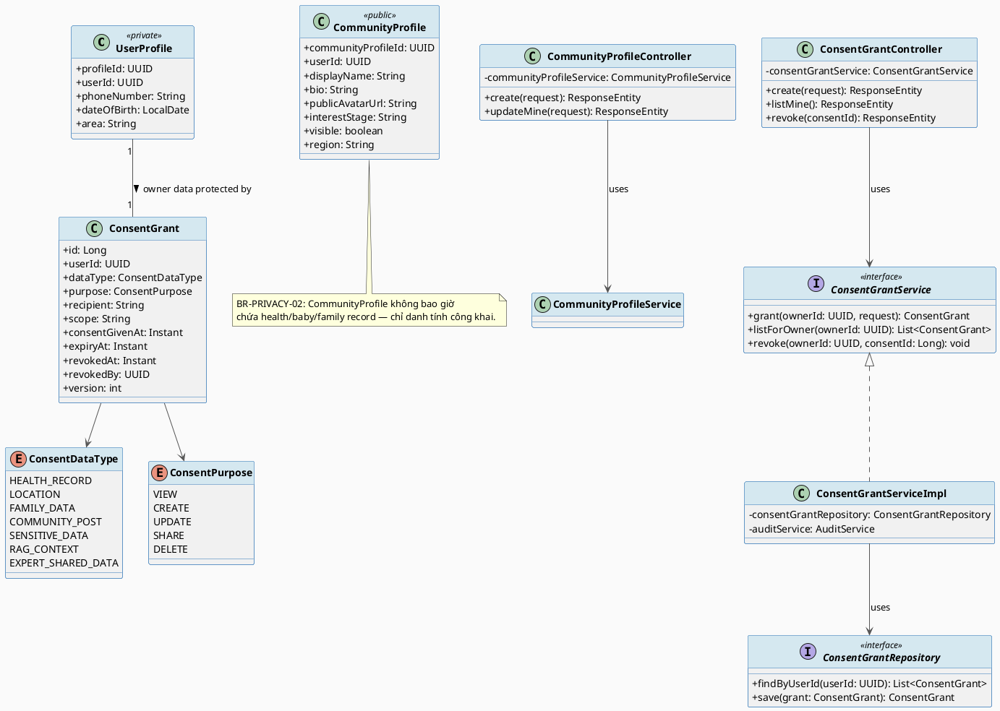
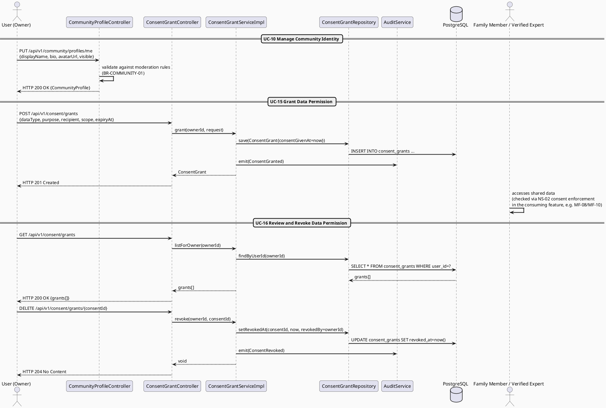
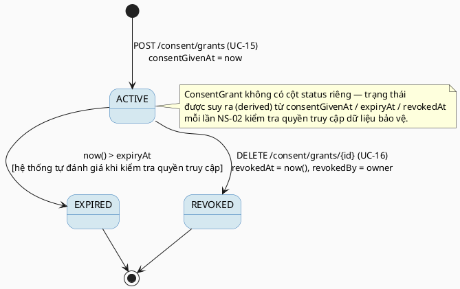

# MF-01 / Spec 02 — Community Identity, Privacy & Consent-Based Data Sharing

| Field | Value |
| --- | --- |
| Feature | MF-01 — Account, Trust & Access Control |
| Use Cases Covered | UC-10 Manage Community Identity, UC-15 Grant Data Permission, UC-16 Review and Revoke Data Permission |
| Primary Actor(s) | User (owner of private data) |
| Platform | Mobile App / Web Portal |
| Main Flow Summary | A User maintains a public `CommunityProfile` that is structurally separate from the private `UserProfile`, and separately grants a purpose-scoped, time-limited `ConsentGrant` so a family member or verified expert may access selected private data — with the owner able to review and revoke that grant at any time. |
| Grounding (source code) | `community/entity/CommunityProfile.java`, `profile/entity/UserProfile.java`, `consent/entity/ConsentGrant.java`, `ConsentPurpose.java`, `ConsentDataType.java`, `consent/controller/*` (`/api/v1/consent/grants`), `community/controller/CommunityProfileController.java` (`/api/v1/community/profiles`) |

## 1. Tổng quan luồng chính (Main Flow Overview)

MF-01 tách rõ hai lớp danh tính (BR-PRIVACY): `UserProfile` là dữ liệu riêng tư dùng
để vận hành tài khoản, còn `CommunityProfile` là danh tính công khai hiển thị trong cộng
đồng (display name, avatar công khai, có thể ẩn danh — BR-PRIVACY-02). Việc chia sẻ dữ
liệu riêng tư (hồ sơ sức khỏe mẹ/bé, vị trí, dữ liệu gia đình...) cho người khác **không
bao giờ** xảy ra ngầm định — nó luôn đi qua một `ConsentGrant` tường minh có
`dataType` + `purpose` + `recipient` + `expiryAt`, do chính chủ dữ liệu tạo (UC-15) và
có thể thu hồi bất cứ lúc nào (UC-16). Đây là cơ chế nền tảng mà MF-08 (Health Records)
và MF-10 (Family Sync) tái sử dụng, nên được mô hình hoá tại MF-01 thay vì lặp lại ở
từng feature tiêu dùng nó.

## 2. Class Diagram

**Hình 1 — Class Diagram: Community Identity vs. Private Profile & Consent Grant**

## 3. Sequence Diagram — Main Flow

**Hình 2 — Sequence Diagram: Grant → Consume → Revoke Data Permission (Main Flow)**

## 4. State Machine — `ConsentGrant` Lifecycle

**Hình 3 — State Machine: `ConsentGrant` Lifecycle (derived state)**

## 5. Business Rules Applied

- BR-PRIVACY — dữ liệu riêng tư (mẹ/bé/gia đình/sức khỏe) tách biệt khỏi danh tính cộng đồng công khai.
- BR-PRIVACY-02 — danh tính cộng đồng không mặc định để lộ hồ sơ sức khỏe riêng tư.
- BR-COMMUNITY-01 — display name/avatar công khai vẫn chịu kiểm duyệt.
- NS-02 — mọi truy cập dữ liệu bảo vệ phải kiểm tra recipient, purpose, scope, expiry và tình trạng thu hồi trước khi cho phép.
