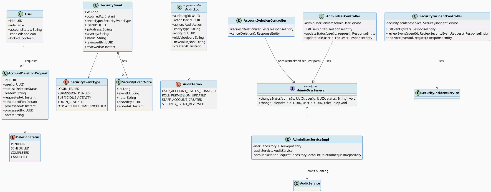
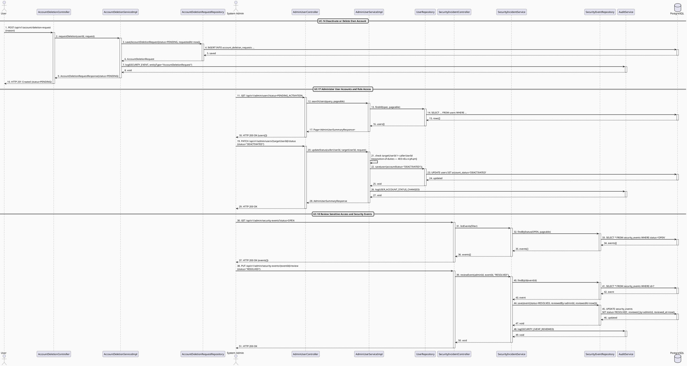
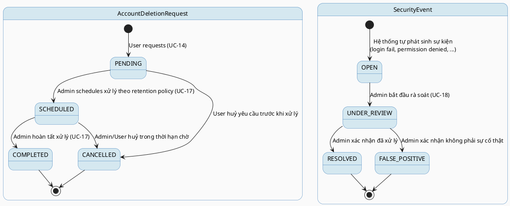

# MF-01 / Spec 03 — Admin Account Governance & Security Audit

| Field | Value |
| --- | --- |
| Feature | MF-01 — Account, Trust & Access Control |
| Use Cases Covered | UC-14 Deactivate or Delete Own Account, UC-17 Administer User Accounts and Role Access, UC-18 Review Sensitive Access and Security Events |
| Primary Actor(s) | User (self-service deletion request), System Admin |
| Platform | Mobile App / Web Portal (UC-14), Admin Portal (UC-17, UC-18) |
| Main Flow Summary | A User requests deactivation/deletion of their own account; a System Admin reviews and processes that request (or independently changes a user's status/role under separation-of-duties), while every sensitive action and abnormal security signal is captured as an auditable `SecurityEvent` the admin can triage. |
| Grounding (source code) | `account/entity/AccountDeletionRequest.java`, `DeletionStatus.java`, `account/controller/AccountDeletionController.java`, `security/entity/User.java` (role/accountStatus), admin user controller (`/api/v1/admin/users`), `audit/entity/SecurityEvent.java`, `audit/entity/AuditLog.java`, `audit/controller/SecurityIncidentController.java` (`/api/v1/admin/security-events`), `audit/controller/AuditController.java` (`/api/v1/admin/audit-logs`) |

## 1. Tổng quan luồng chính (Main Flow Overview)

Đây là lớp "trust & access control" cấp quản trị của MF-01. User tự khởi tạo yêu cầu
xoá/vô hiệu hoá tài khoản (UC-14) — hệ thống không xoá ngay mà tạo một
`AccountDeletionRequest` chờ xử lý theo nghĩa vụ lưu trữ/audit. System Admin xử lý các
yêu cầu đó và độc lập có quyền thay đổi trạng thái/role của bất kỳ tài khoản nào (UC-17)
dưới ràng buộc phân quyền (separation-of-duties: admin không tự duyệt yêu cầu chính
mình tạo ra). Song song đó, mọi hành động nhạy cảm được ghi vào `AuditLog`
(bất biến, chỉ đọc) còn các tín hiệu bất thường (đăng nhập sai nhiều lần, truy cập bị
từ chối, hoạt động khả nghi...) được hệ thống tự sinh thành `SecurityEvent` để admin rà
soát và xử lý (UC-18) — đây là control trung tâm cho toàn bộ hệ thống, không riêng MF-01.

## 2. Class Diagram

**Hình 1 — Class Diagram: Account Deletion Request, Admin User Governance & Security Audit**

## 3. Sequence Diagram — Main Flow

**Hình 2 — Sequence Diagram: Deletion Request → Admin User Status Change → Security Event Review (Main Flow)**

> Ghi chú grounding: rà soát `AdminUserServiceImpl` (chỉ phụ thuộc `UserRepository`) và
> `AccountDeletionController` (chỉ có 2 endpoint tự-phục vụ: tạo/huỷ yêu cầu) cho thấy
> **hiện chưa có endpoint admin nào chuyển `AccountDeletionRequest.status` sang
> `SCHEDULED`/`COMPLETED`** — hai luồng UC-14 và UC-17 độc lập ở tầng code hiện tại, không
> tự động liên kết như một giao dịch chung (khác với giả định trong bản thiết kế đầu). State
> Machine ở mục 4 mô tả vòng đời **dự kiến** theo đặc tả UC-17; write-path admin cho
> `AccountDeletionRequest` cần được xác nhận/bổ sung riêng.

## 4. State Machine — `AccountDeletionRequest.status` & `SecurityEvent.status`

**Hình 3 — State Machine: `AccountDeletionRequest.status` và `SecurityEvent.status`**

## 5. Business Rules Applied

- BR-RBAC — chỉ System Admin mới có quyền thay đổi role/status của tài khoản khác.
- Separation-of-duties — admin không tự xử lý yêu cầu do chính họ tạo hoặc tự thay đổi role của chính mình qua kênh này.
- UC-14 postcondition — deletion/deactivation phải tuân thủ nghĩa vụ retention, care-group và audit trước khi hoàn tất.
- NS-01 — mọi sự kiện bảo mật bất thường (đăng nhập sai, truy cập bị từ chối...) được ghi nhận tự động.
- AuditLog là append-only: `oldValueJson`/`newValueJson` phục vụ truy vết, không được sửa/xoá sau khi ghi.
