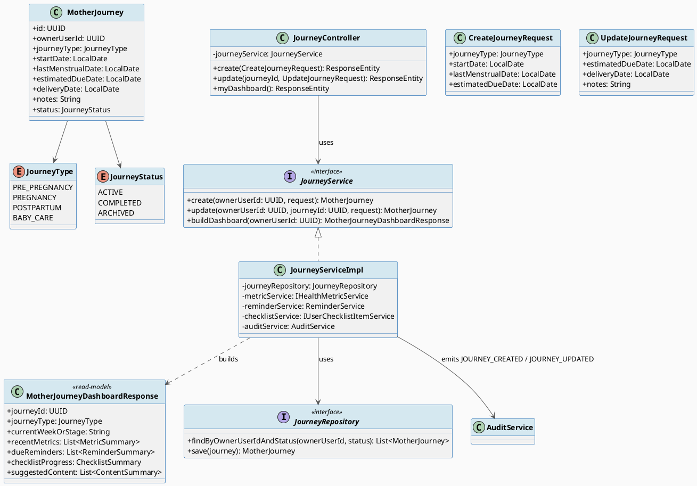
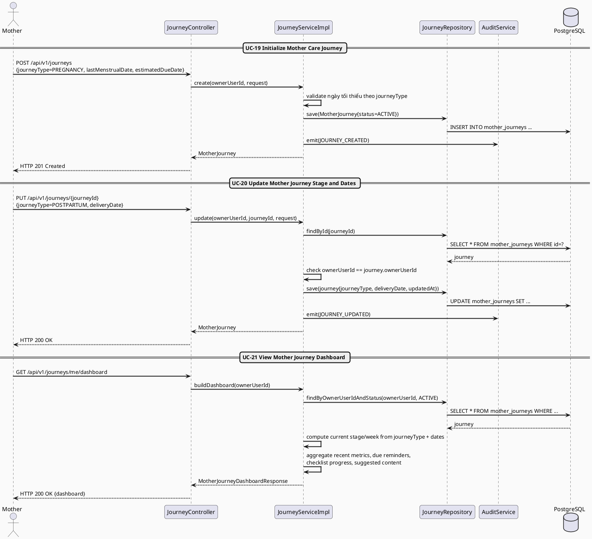
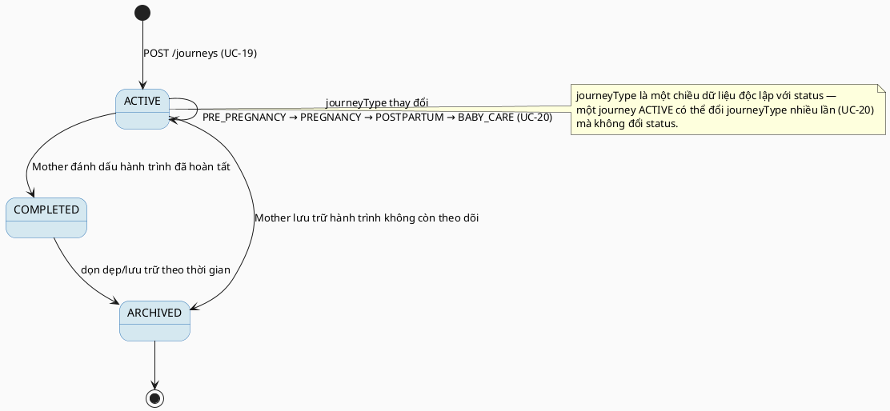

# MF-02 / Spec 01 — Mother Journey Lifecycle & Dashboard

| Field | Value |
| --- | --- |
| Feature | MF-02 — Mother Care Journey |
| Use Cases Covered | UC-19 Initialize Mother Care Journey, UC-20 Update Mother Journey Stage and Dates, UC-21 View Mother Journey Dashboard |
| Primary Actor(s) | Mother |
| Platform | Mother Mobile App |
| Main Flow Summary | A Mother initializes a `MotherJourney` (pre-pregnancy / pregnancy / postpartum / baby-care), updates stage and key dates as circumstances change, and consumes a stage-aware dashboard that aggregates metrics, reminders, checklist and reviewed content for the current stage/week. |
| Grounding (source code) | `journey/entity/MotherJourney.java`, `JourneyStatus.java`, `JourneyType.java`, `journey/controller/JourneyController.java` (`/api/v1/journeys`) |

## 1. Tổng quan luồng chính (Main Flow Overview)

`MotherJourney` là entity gốc mà gần như toàn bộ MF-02 và MF-09 (reminders) neo vào
(`journeyId`). Mother khởi tạo journey với `journeyType` + ngày tối thiểu cần thiết
(kỳ kinh cuối/ngày dự sinh/ngày sinh tuỳ loại) — UC-19. Khi hoàn cảnh thay đổi (ví dụ
chuyển từ PREGNANCY sang POSTPARTUM sau khi sinh), Mother cập nhật lại `journeyType`
và các ngày liên quan — UC-20. Dashboard (UC-21) không phải một entity riêng mà là một
read-model tổng hợp: tính stage/week hiện tại từ `MotherJourney`, rồi kéo dữ liệu liên
quan (metric gần nhất, reminder đến hạn, checklist, nội dung đã duyệt theo giai đoạn)
— các nguồn dữ liệu phụ này được mô hình hoá trong các spec khác (MF-02/02, MF-09,
MF-11), ở đây chỉ thể hiện quan hệ tổng hợp.

## 2. Class Diagram

**Hình 1 — Class Diagram: Mother Journey Lifecycle & Dashboard Read-Model**

## 3. Sequence Diagram — Main Flow

**Hình 2 — Sequence Diagram: Initialize → Update Stage → View Dashboard (Main Flow)**

## 4. State Machine — `MotherJourney.status`

**Hình 3 — State Machine: `MotherJourney.status` Lifecycle**

## 5. Business Rules Applied

- BR-RBAC — chỉ chủ sở hữu (`ownerUserId`) mới được đọc/ghi journey của chính họ.
- UC-19 precondition — journey được tạo với "minimum dates and stage context required for stage-based support".
- UC-20 — chỉ các trường ngày/giai đoạn được liệt kê là "permitted" mới có thể cập nhật.
- UC-21 — dashboard chỉ hiển thị dữ liệu mà Mother được phép xem (không lộ dữ liệu của journey khác).
