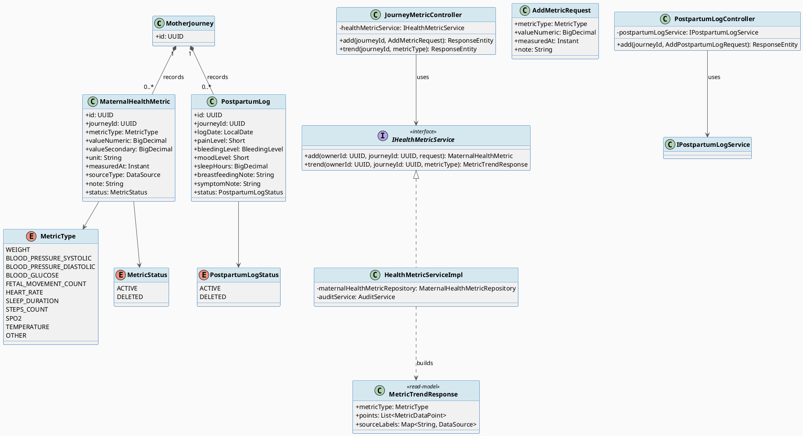
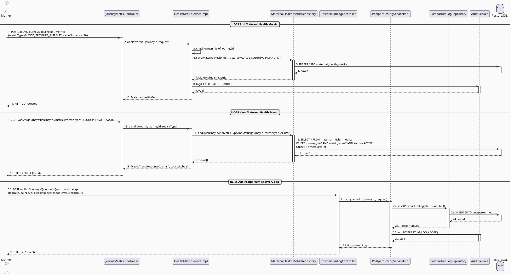
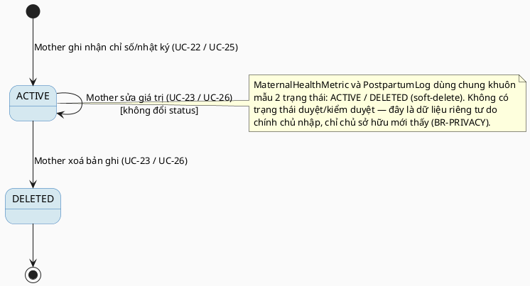

# MF-02 / Spec 02 — Maternal Health Metric & Postpartum Recovery Tracking

| Field | Value |
| --- | --- |
| Feature | MF-02 — Mother Care Journey |
| Use Cases Covered | UC-22 Add Maternal Health Metric, UC-24 View Maternal Health Trend, UC-25 Add Postpartum Recovery Log |
| Primary Actor(s) | Mother |
| Platform | Mother Mobile App |
| Main Flow Summary | A Mother records a maternal indicator (weight, blood pressure, glucose, fetal movement...) or a postpartum recovery observation (pain, mood, sleep, bleeding...) against the active journey, and views the resulting trend over time with clear source labels and non-diagnostic framing. |
| Grounding (source code) | `health/entity/MaternalHealthMetric.java`, `MetricType.java`, `MetricStatus.java`, `health/entity/PostpartumLog.java`, `PostpartumLogStatus.java`, `BleedingLevel.java`, `health/controller/JourneyMetricController.java` (`/api/v1/journeys/{journeyId}/metrics`), `health/controller/PostpartumLogController.java` (`/api/v1/journeys/{journeyId}/postpartum-logs`) |

## 1. Tổng quan luồng chính (Main Flow Overview)

Hai entity `MaternalHealthMetric` và `PostpartumLog` chia sẻ cùng một khuôn mẫu vòng
đời đơn giản (ghi nhận do người dùng nhập → ACTIVE → có thể sửa/xoá mềm), nên được gộp
vào một spec thay vì tách UC-22/23 và UC-25/26 thành bốn spec riêng. Cả hai đều gắn với
`journeyId` của `MotherJourney` (MF-02/01) và đều có `sourceType`/`sourceLabel` để phân
biệt dữ liệu người dùng tự nhập với dữ liệu đồng bộ từ thiết bị (MF-13). UC-24 (xem xu
hướng) là read-model tổng hợp nhiều `MaternalHealthMetric` theo `metricType` theo thời
gian — không phải entity riêng.

## 2. Class Diagram

**Hình 1 — Class Diagram: Maternal Health Metric & Postpartum Recovery Log**

## 3. Sequence Diagram — Main Flow

**Hình 2 — Sequence Diagram: Add Metric → View Trend → Add Postpartum Log (Main Flow)**

## 4. State Machine — `MaternalHealthMetric.status` / `PostpartumLog.status`

**Hình 3 — State Machine: Owner-entered Record Lifecycle (`ACTIVE` → `DELETED`)**

## 5. Business Rules Applied

- BR-RBAC / BR-PRIVACY — chỉ chủ sở hữu journey mới đọc/ghi được metric và log của chính họ.
- UC-24 — trend hiển thị kèm nhãn nguồn dữ liệu (`sourceType`) và khung diễn giải phi chẩn đoán, không được trình bày như kết luận y khoa.
- UC-23/UC-26 — chỉ được sửa/xoá khi còn `ownership` và trạng thái bản ghi cho phép (không sửa được bản ghi đã `DELETED`).
