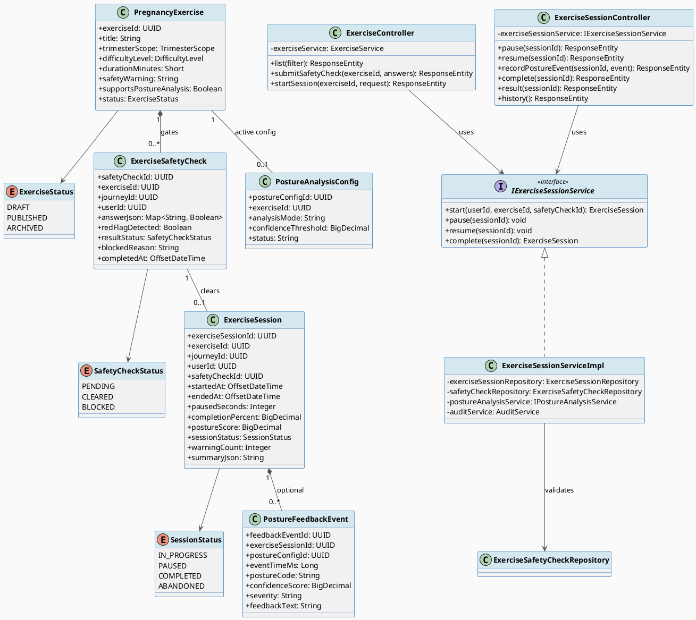
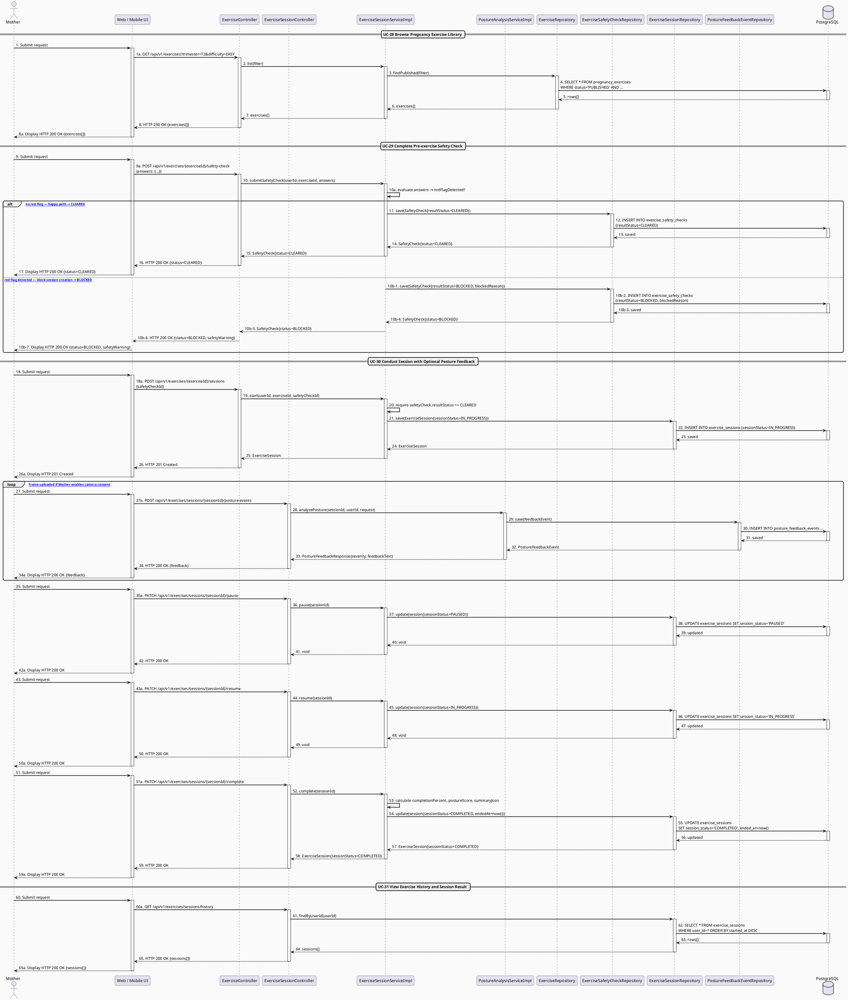

# MF-02 / Spec 03 — Pregnancy Exercise Session with Safety Check & Posture Feedback

| Field | Value |
| --- | --- |
| Feature | MF-02 — Mother Care Journey |
| Use Cases Covered | UC-28 Browse Pregnancy Exercise Library, UC-29 Complete Pre-exercise Safety Check, UC-30 Conduct Pregnancy Exercise Session with Optional Posture Feedback, UC-31 View Exercise History and Session Result |
| Primary Actor(s) | Mother |
| Platform | Mother Mobile App |
| Main Flow Summary | A Mother browses the reviewed exercise library, must clear a pre-exercise safety check before a session can start, runs the session with start/pause/resume/complete controls and optional camera-based posture feedback, then reviews the completed session result and history. |
| Grounding (source code) | `exercise/entity/PregnancyExercise.java`, `ExerciseStatus.java`, `TrimesterScope.java`, `DifficultyLevel.java`, `exercise/entity/ExerciseSafetyCheck.java`, `SafetyCheckStatus.java`, `exercise/entity/ExerciseSession.java`, `SessionStatus.java`, `exercise/entity/PostureFeedbackEvent.java`, `exercise/controller/ExerciseController.java` (`/api/v1/exercises`), `exercise/controller/ExerciseSessionController.java` (`/api/v1/exercises/sessions`) |

## 1. Tổng quan luồng chính (Main Flow Overview)

Đây là luồng an toàn nhất trong MF-02: Mother không thể vào một `ExerciseSession` nếu
chưa có một `ExerciseSafetyCheck` với kết quả `CLEARED` (BR-SAFETY, UC-29) — nếu câu trả
lời an toàn chứa cờ đỏ (`redFlagDetected=true`), hệ thống chặn (`BLOCKED`) và không cho
tạo session. Khi session đang chạy, Mother có thể `pause`/`resume`/`complete`; nếu bật
camera feedback (yêu cầu consent riêng), mỗi khung hình sinh ra `PostureFeedbackEvent`
tuỳ theo `PostureAnalysisConfig` (rule-based hoặc ML) đang active cho bài tập đó. Kết
quả cuối (điểm tư thế tổng hợp, thời lượng, cảnh báo) hiển thị ở UC-31. Thư viện bài tập
(UC-28) chỉ hiển thị exercise ở trạng thái `PUBLISHED` — quản trị nội dung bài tập
(draft/archive) không thuộc luồng chính của Mother nên không vẽ lại ở đây.

## 2. Class Diagram

**Hình 1 — Class Diagram: Pregnancy Exercise, Safety Check & Session with Posture Feedback**

## 3. Sequence Diagram — Main Flow

**Hình 2 — Sequence Diagram: Browse → Safety Check → Session (Pause/Resume/Posture) → Complete → History (Main Flow)**

## 4. Business Rules Applied

- BR-SAFETY — session chỉ được bắt đầu khi có `ExerciseSafetyCheck` với `resultStatus=CLEARED`; câu trả lời cảnh báo cấu hình sẵn sẽ chặn (`BLOCKED`) việc vào bài tập.
- UC-28 — chỉ hiển thị bài tập đã được duyệt (`status=PUBLISHED`) với ghi chú an toàn theo từng bài (`safetyWarning`).
- UC-30 — camera/posture feedback là tính năng **tuỳ chọn**, yêu cầu consent riêng biệt trước khi bật (không phải luồng bắt buộc).
- UC-31 — lịch sử chỉ hiển thị session của chính Mother, kèm cảnh báo an toàn tổng hợp nếu có.
