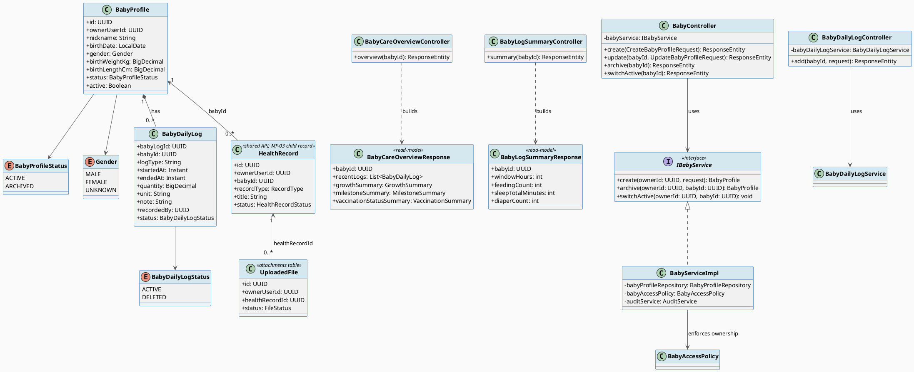
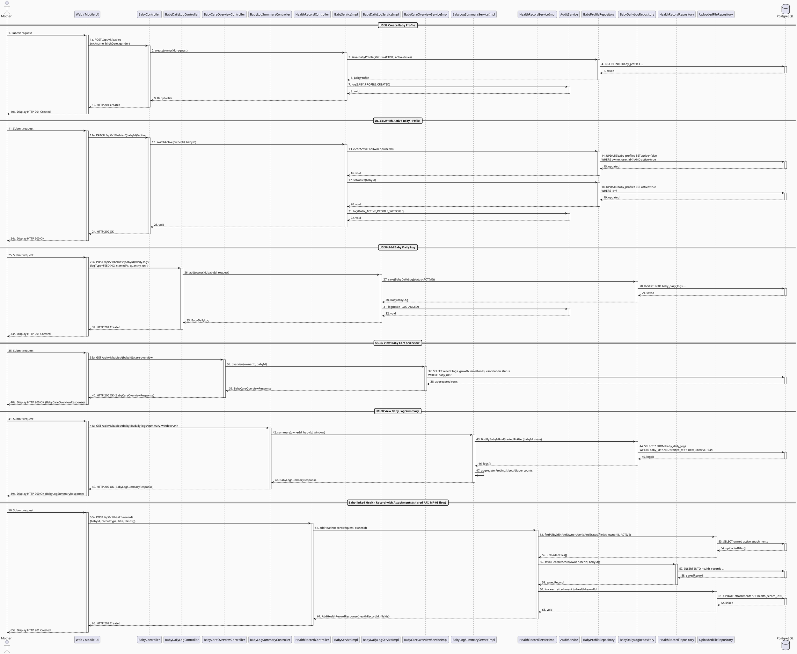

# MF-03 / Spec 01 — Baby Profile Lifecycle & Daily Care Overview

| Field | Value |
| --- | --- |
| Feature | MF-03 — Baby Care Journey, Growth & Vaccination |
| Use Cases Covered | UC-32 Create Baby Profile, UC-33 Update or Archive Baby Profile, UC-34 Switch Active Baby Profile, UC-35 View Baby Care Overview, UC-36 Add Baby Daily Log, UC-38 View Baby Log Summary |
| Primary Actor(s) | Mother |
| Platform | Mother Mobile App |
| Main Flow Summary | A Mother creates a `BabyProfile`, selects which baby is active, records daily observations, and reads the care overview/summary. Medical documents for the baby reuse the shared health-record API with `babyId` and protected `fileIds`; MF-03 does not introduce a second baby-document model. |
| Grounding (source code) | `baby/entity/BabyProfile.java`, `BabyProfileStatus.java`, `baby/controller/BabyController.java` (`/api/v1/babies`), `carejourney/entity/BabyDailyLog.java`, `carejourney/controller/BabyDailyLogController.java`, `BabyCareOverviewController.java`, `BabyLogSummaryController.java`; shared implementation: `health/entity/HealthRecord.java` (`babyId`), `health/dto/AddHealthRecordRequest.java` (`babyId`, `fileIds`), `health/controller/HealthRecordController.java`, `health/service/impl/HealthRecordServiceImpl.java`, `file/entity/UploadedFile.java` |

## 1. Tổng quan luồng chính (Main Flow Overview)

`BabyProfile` là gốc của toàn bộ MF-03. Mother tạo hồ sơ bé (UC-32), có thể cập nhật
hoặc lưu trữ (`ARCHIVED`) khi không còn theo dõi tích cực nhưng không phá huỷ lịch sử
liên quan (UC-33), và chọn baby nào là "đang theo dõi" cho dashboard hiện tại (`active`
flag — UC-34). Ghi nhật ký hằng ngày (`BabyDailyLog` — cho bú/ngủ/tã/triệu chứng — UC-36)
là hành động lặp lại nhiều nhất trong MF-03, nên gộp chung với UC-38 (tổng hợp 24h/7 ngày)
làm luồng chính; growth/milestone/vaccination được tách thành hai spec riêng (02, 03) vì
chúng có vòng đời và nhịp độ nghiệp vụ khác (đo định kỳ / mốc phát triển / tiêm
chủng theo lịch tham khảo).

Hồ sơ khám, xét nghiệm hoặc đơn thuốc của bé không được lưu trong `BabyDailyLog`.
Implementation hiện tại dùng chung `HealthRecord`: request mang `babyId` để liên kết
đúng bé và `fileIds` để gắn các `UploadedFile` đã upload. Timeline có
`TimelineFilter.babyId`; attachment chỉ trả URL có thời hạn sau kiểm tra quyền. Thiết kế
API record/attachment được dùng chung ở tầng code, nhưng flow có `babyId` và quyền truy
cập của child record thuộc MF-03; MF-02/spec-04 chỉ mô tả maternal record.

## 2. Class Diagram

**Hình 1 — Class Diagram: Baby Profile, Daily Log, Care Overview & Shared Baby Health Records**

## 3. Sequence Diagram — Main Flow

**Hình 2 — Sequence Diagram: Baby Profile, Daily Care & Baby-linked Health Record (Main Flow)**

## 4. Business Rules Applied

- BR-RBAC / ownership — chỉ `ownerUserId` (và thành viên gia đình có quyền theo MF-08) mới truy cập được hồ sơ bé.
- UC-33 postcondition — archive không được phá huỷ lịch sử nhật ký/tăng trưởng/tiêm chủng liên kết.
- UC-34 — dashboard/nhắc lịch hiện tại luôn theo baby đang `active`, không phải toàn bộ danh sách baby.
- UC-38 — summary chỉ tổng hợp log ở trạng thái `ACTIVE` trong cửa sổ thời gian yêu cầu (24h hoặc 7 ngày).
- Baby-linked record — `babyId` phải trỏ tới bé mà caller được phép truy cập; `fileIds` chỉ nhận file `ACTIVE` thuộc chính caller và chỉ hỗ trợ image/PDF theo `HealthRecordServiceImpl`.
- Attachment access — file vật lý vẫn thuộc module `file`; `HealthRecordFile` chỉ là compatibility projection trên cột `attachments.health_record_id`, không phải bảng liên kết mới.
