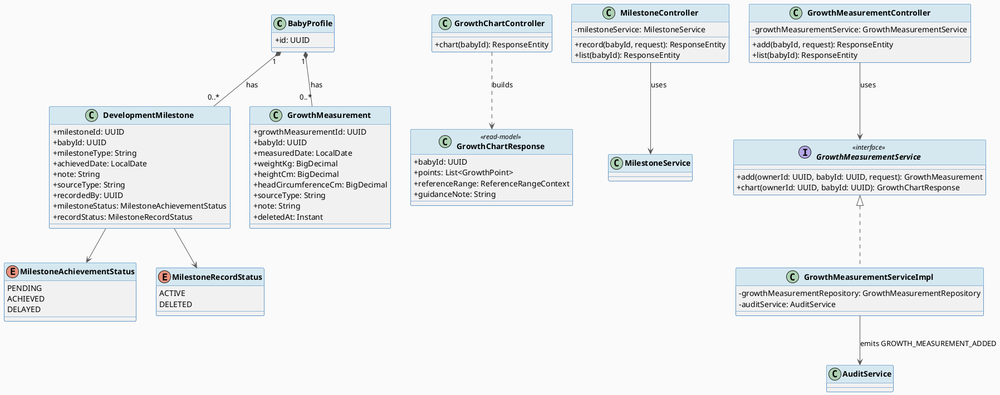
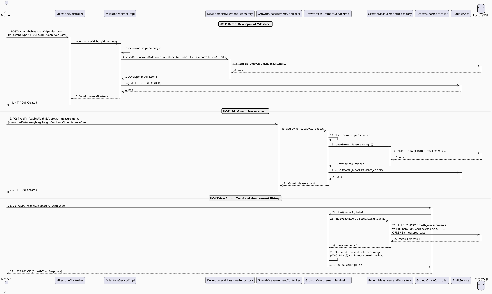
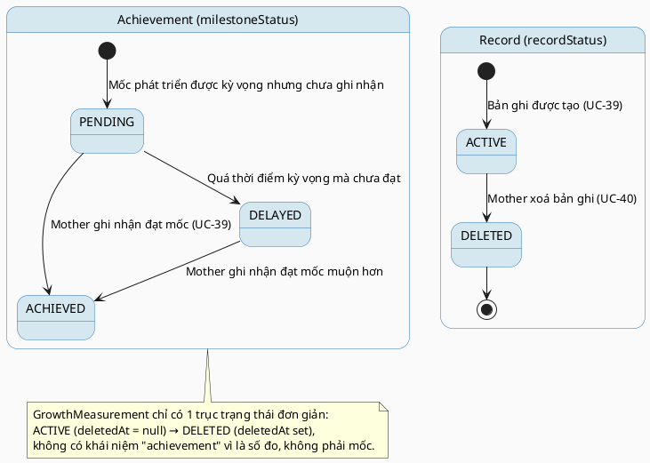

# MF-03 / Spec 02 — Growth & Development Milestone Tracking

| Field | Value |
| --- | --- |
| Feature | MF-03 — Baby Care Journey, Growth & Vaccination |
| Use Cases Covered | UC-39 Record Development Milestone, UC-41 Add Growth Measurement, UC-43 View Growth Trend and Measurement History |
| Primary Actor(s) | Mother |
| Platform | Mother Mobile App |
| Main Flow Summary | A Mother records an observed development milestone and periodic growth measurements (weight/height/head circumference) for a baby, then reviews the growth trend and measurement history with reference context. |
| Grounding (source code) | `carejourney/entity/DevelopmentMilestone.java`, `MilestoneAchievementStatus.java`, `MilestoneRecordStatus.java`, `carejourney/entity/GrowthMeasurement.java`, `carejourney/controller/MilestoneController.java` (`/api/v1/babies/{babyId}/milestones`), `GrowthMeasurementController.java` (`/api/v1/babies/{babyId}/growth-measurements`), `GrowthChartController.java` (`/api/v1/babies/{babyId}/growth-chart`) |

## 1. Tổng quan luồng chính (Main Flow Overview)

`DevelopmentMilestone` và `GrowthMeasurement` đều là quan sát định kỳ do caregiver ghi
nhận cho một `BabyProfile`, khác với `BabyDailyLog` (spec 01) ở tần suất thấp hơn và có
ý nghĩa theo dõi phát triển dài hạn. Milestone có hai chiều trạng thái độc lập: mức độ
đạt được thực tế (`MilestoneAchievementStatus`: đúng hạn hay chậm) và trạng thái bản ghi
(`MilestoneRecordStatus`: còn hiệu lực hay đã xoá). `GrowthMeasurement` chỉ có soft-delete
qua `deletedAt`. UC-43 (xem xu hướng tăng trưởng) là read-model tổng hợp các
`GrowthMeasurement` theo thời gian kèm ngữ cảnh tham chiếu, kèm gợi ý tìm chuyên gia khi
số đo lệch xa mốc tham chiếu — không phải chẩn đoán.

## 2. Class Diagram

**Hình 1 — Class Diagram: Development Milestone & Growth Measurement**

## 3. Sequence Diagram — Main Flow

**Hình 2 — Sequence Diagram: Record Milestone → Add Growth Measurement → View Trend (Main Flow)**

## 4. State Machine — `DevelopmentMilestone.milestoneStatus` & `recordStatus`

**Hình 3 — State Machine: `DevelopmentMilestone` — Achievement vs. Record Status (2 trục độc lập)**

## 5. Business Rules Applied

- BR-RBAC / ownership — chỉ chủ sở hữu baby (và gia đình có quyền theo MF-10) mới ghi/xem được.
- UC-39 — milestone là quan sát của caregiver, không phải đánh giá phát triển chính thức; luôn kèm `note` ngữ cảnh.
- UC-43 — trend hiển thị kèm reference range (WHO/tham chiếu) và nhắc tìm chuyên gia khi số đo lệch xa, không tự đưa ra kết luận chẩn đoán.
