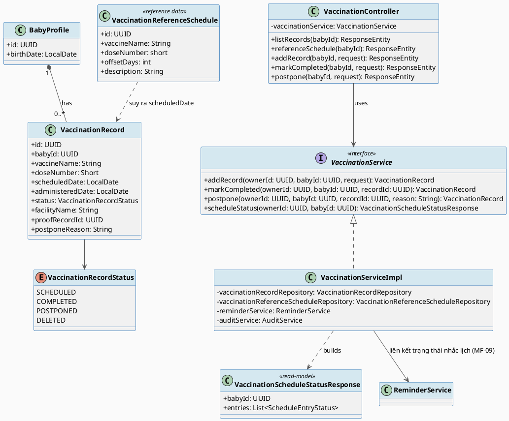
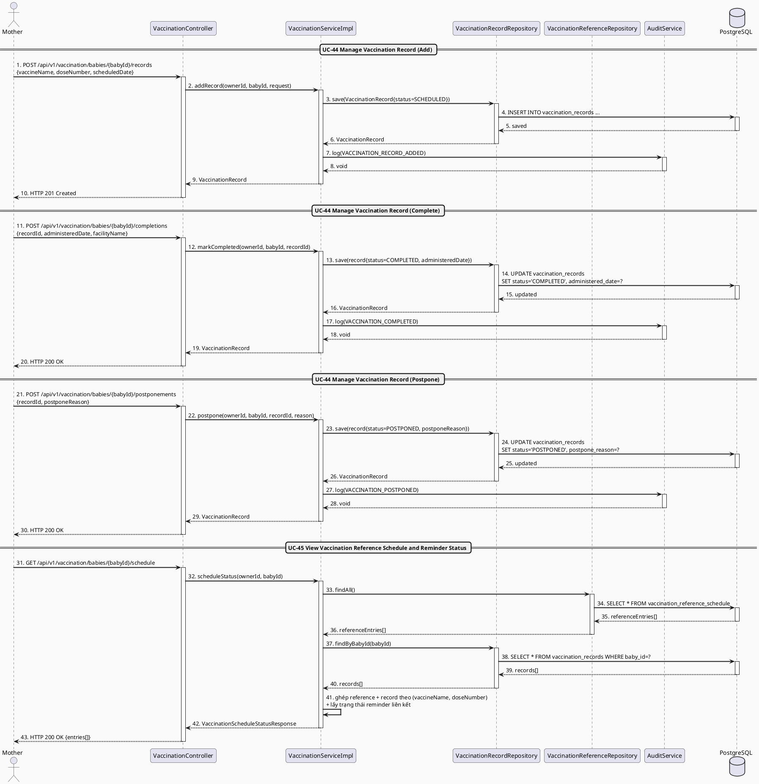
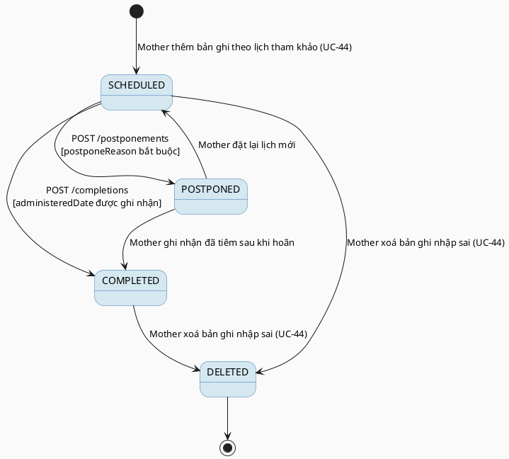

# MF-03 / Spec 03 — Vaccination Record Management & Reference Schedule

| Field | Value |
| --- | --- |
| Feature | MF-03 — Baby Care Journey, Growth & Vaccination |
| Use Cases Covered | UC-44 Manage Vaccination Record, UC-45 View Vaccination Reference Schedule and Reminder Status |
| Primary Actor(s) | Mother |
| Platform | Mother Mobile App |
| Main Flow Summary | A Mother records a vaccination for a baby against a reference schedule entry, can mark it completed or postpone it with a reason, and views the reference schedule alongside recorded/reminder status for the selected baby. |
| Grounding (source code) | `vaccination/entity/VaccinationRecord.java`, `VaccinationRecordStatus.java`, `vaccination/entity/VaccinationReferenceSchedule.java`, `vaccination/controller/VaccinationController.java` (`/api/v1/vaccination`) |

## 1. Tổng quan luồng chính (Main Flow Overview)

`VaccinationReferenceSchedule` là dữ liệu tham chiếu dùng chung (tên vắc-xin, số mũi,
`offsetDays` kể từ ngày sinh) do hệ thống cung cấp, không do Mother chỉnh sửa.
`VaccinationRecord` là bản ghi thực tế của một baby cho một mũi tiêm cụ thể, có
`scheduledDate` (suy ra từ reference schedule + `birthDate`) và `administeredDate`
(điền khi tiêm thực tế). Mother có thể thêm bản ghi, đánh dấu hoàn thành
(`POSTMapping .../completions`) hoặc hoãn kèm lý do (`POSTMapping .../postponements`).
UC-45 kết hợp reference schedule với các `VaccinationRecord` đã có để hiển thị trạng
thái tổng hợp theo từng mũi (đã tiêm/đang chờ/quá hạn) và trạng thái reminder liên kết
(MF-09) — không tạo entity reminder riêng ở đây.

## 2. Class Diagram

**Hình 1 — Class Diagram: Vaccination Record vs. Reference Schedule**

## 3. Sequence Diagram — Main Flow

**Hình 2 — Sequence Diagram: Add → Complete / Postpone → View Schedule Status (Main Flow)**

## 4. State Machine — `VaccinationRecord.status`

**Hình 3 — State Machine: `VaccinationRecord.status` Lifecycle**

## 5. Business Rules Applied

- BR-RBAC / ownership — chỉ chủ sở hữu baby (và gia đình có quyền theo MF-10) truy cập được.
- UC-44 — bản ghi tiêm chủng là dữ liệu người dùng nhập (user-entered), không phải hồ sơ tiêm chủng chính thức/EMR.
- UC-45 — trạng thái reminder hiển thị chỉ mang tính tổ chức cá nhân (personal organization), không thay thế lịch tiêm chính thức của cơ sở y tế.
- Excluded (mục 4.8 SRS) — không có chức năng dispatch/đặt lịch chính thức với cơ sở y tế, chỉ là công cụ theo dõi cá nhân.
