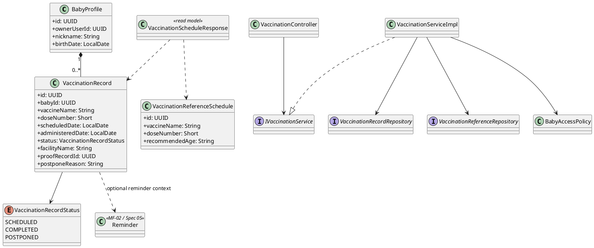

# MF-03 / Spec 03 — Vaccination Record, Reference Schedule & Reminder

| Field | Value |
| --- | --- |
| Feature | MF-03 — Baby Care Journey, Growth & Vaccination |
| Flows Covered | View vaccination records/reference schedule; add, update or delete a user-entered record; mark a dose completed or postponed; create a vaccination reminder from baby context |
| Primary Actor(s) | Mother |
| Platform | Mobile App; Baby Care summary on Web; CareBridge API |
| Main Flow Summary | A Mother opens a baby's vaccination tab, compares user-entered records with the reference schedule, records a completed or planned dose, and may open the shared reminder flow with that baby/vaccine context. |
| Grounding (active UI/API) | Mobile `baby_profile_detail_screen.dart`, `add_vaccination_record_screen.dart`, `vaccination_detail_screen.dart`, `edit_vaccination_record_screen.dart`, `create_vaccination_reminder_screen.dart`, `vaccination_service.dart`; API `VaccinationController`, `VaccinationServiceImpl`, `VaccinationRecord`, `VaccinationReferenceSchedule` |

## 1. Tổng quan luồng chính (Main Flow Overview)

Vaccination tab được truy cập từ Baby Profile/Care Hub đang hoạt động trên Mobile. App
đọc danh sách `VaccinationRecord` của baby cùng lịch tham khảo để hiển thị dose đã ghi,
đang lên lịch hoặc đã hoãn. Mother có thể thêm bản ghi, cập nhật metadata, đánh dấu hoàn
tất, hoãn hoặc xóa bản ghi do người dùng nhập. Mọi thao tác đều kiểm tra quyền truy cập
đúng baby ở service; việc biết `babyId` không tự tạo quyền truy cập.

Từ vaccine/baby context, Mobile có thể mở màn hình tạo vaccination reminder của luồng
Reminder chung tại MF-02/Spec 05. Reminder chỉ mang ngữ cảnh tổ chức công việc; nó không
thay đổi `VaccinationRecord` và không thay thế lịch tiêm hoặc giấy chứng nhận chính thức.
Web hiện chỉ hiển thị số lượng vaccination record trong Baby Care Hub, không có CRUD chi
tiết, nên sequence CRUD dưới đây là Mobile flow.

## 2. Class Diagram



**Hình 1 — Class Diagram: Vaccination Record, Reference Schedule & Reminder Context**

## 3. Sequence Diagram — Main Flow

```plantuml
@startuml MF03_03_Vaccination_SequenceDiagram
actor "Mother" as Mother
participant "Mobile Vaccination UI" as UI
participant "VaccinationController" as Controller
participant "VaccinationServiceImpl" as Service
participant "BabyAccessPolicy" as Access
participant "VaccinationRecordRepository" as RecordRepo
participant "VaccinationReferenceRepository" as ReferenceRepo
database "PostgreSQL" as DB

Mother -> UI : 1. Open baby's vaccination tab
activate UI
UI -> Controller : 1a. GET /api/v1/vaccination/babies/{babyId}/schedule
activate Controller
Controller -> Service : 2. getVaccinationSchedule(babyId, callerId)
activate Service
Service -> Access : 3. requireBabyAccess(callerId, babyId)
activate Access
Access --> Service : 4. access granted
deactivate Access
par [load records and reference schedule]
  Service -> RecordRepo : 5a. findByBabyId(babyId)
  activate RecordRepo
  RecordRepo -> DB : 5a-1. SELECT vaccination_records
  activate DB
  DB --> RecordRepo : 5a-2. records[]
  deactivate DB
  RecordRepo --> Service : 5a-3. records[]
  deactivate RecordRepo
and
  Service -> ReferenceRepo : 5b. findApplicableSchedule(birthDate)
  activate ReferenceRepo
  ReferenceRepo -> DB : 5b-1. SELECT vaccination_reference_schedule
  activate DB
  DB --> ReferenceRepo : 5b-2. reference doses[]
  deactivate DB
  ReferenceRepo --> Service : 5b-3. reference doses[]
  deactivate ReferenceRepo
end
Service --> Controller : 6. VaccinationScheduleResponse
deactivate Service
Controller --> UI : 7. 200 OK
deactivate Controller
UI --> Mother : 8. Display records and reference schedule
deactivate UI

Mother -> UI : 9. Submit a completed vaccination dose
activate UI
UI -> Controller : 9a. POST /api/v1/vaccination/babies/{babyId}/completions
activate Controller
Controller -> Service : 10. markVaccinationCompleted(babyId, callerId, request)
activate Service
Service -> Access : 11. requireBabyAccess(callerId, babyId)
activate Access
Access --> Service : 12. access granted
deactivate Access
Service -> RecordRepo : 13. findMatchingDose(babyId, vaccineName, doseNumber)
activate RecordRepo
RecordRepo -> DB : 14. SELECT matching vaccination record
activate DB
DB --> RecordRepo : 15. record / empty
deactivate DB
RecordRepo --> Service : 16. record / empty
deactivate RecordRepo
alt [matching record exists]
  Service -> RecordRepo : 17a. save(status=COMPLETED, administeredDate, facility)
  activate RecordRepo
  RecordRepo -> DB : 17a-1. UPDATE vaccination_records
  activate DB
  DB --> RecordRepo : 17a-2. updated row
  deactivate DB
  RecordRepo --> Service : 17a-3. completed record
  deactivate RecordRepo
  Service --> Controller : 17a-4. VaccinationCompletionResponse(created=false)
  deactivate Service
  Controller --> UI : 17a-5. 200 OK
  deactivate Controller
else [no matching record]
  Service -> RecordRepo : 17b. save(new COMPLETED record)
  activate RecordRepo
  RecordRepo -> DB : 17b-1. INSERT vaccination_records
  activate DB
  DB --> RecordRepo : 17b-2. created row
  deactivate DB
  RecordRepo --> Service : 17b-3. completed record
  deactivate RecordRepo
  Service --> Controller : 17b-4. VaccinationCompletionResponse(created=true)
  deactivate Service
  Controller --> UI : 17b-5. 201 Created
  deactivate Controller
end
UI --> Mother : 18. Refresh vaccination detail
deactivate UI

Mother -> UI : 19. Create reminder from vaccine context
activate UI
ref over Mother, UI : MF-02 / Spec 05 — Reminder Lifecycle
UI --> Mother : 20. Display reminder saved result
deactivate UI
@enduml
```

**Hình 2 — Sequence Diagram: View Vaccination Schedule, Record Completion & Open Reminder Flow**

## 4. Business Rules Applied

- Mỗi read/write phải kiểm tra ownership hoặc permission hiện hành đối với `babyId`.
- Lịch tham khảo và record do người dùng nhập không phải hồ sơ tiêm chủng chính thức.
- `proofRecordId`, nếu có, chỉ liên kết tới tệp/health record mà caller được phép truy cập.
- Mark-completed là idempotent theo baby, vaccine và dose: cập nhật record phù hợp nếu có, tạo mới nếu chưa có.
- Vaccination reminder là tác vụ nhắc việc độc lập; hoàn thành reminder không tự đánh dấu vaccine đã được tiêm.
- App không chẩn đoán, không quyết định hoãn/tiêm và không thay thế hướng dẫn của cơ sở y tế.
