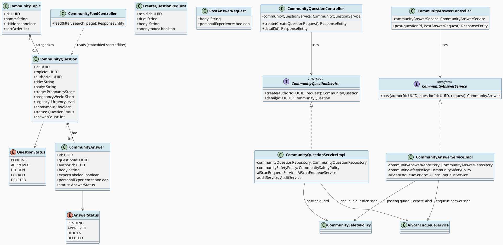
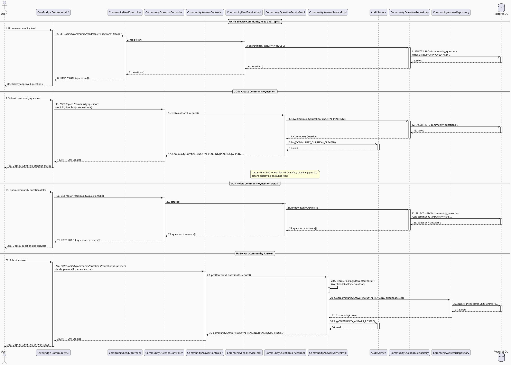

# MF-04 / Spec 01 — Community Question & Answer Flow

| Field | Value |
| --- | --- |
| Feature | MF-04 — Community Q&A & Moderation |
| Use Cases Covered | UC-46 Browse Community Feed and Topics, UC-47 View Community Question Detail, UC-48 Create Community Question, UC-50 Post Community Answer |
| Primary Actor(s) | User (Mother / Family / Expert) |
| Platform | Mobile App / Expert Portal |
| Main Flow Summary | A User browses the moderated feed, opens a question's detail, posts a new topic-based question (optionally anonymous), and answers an approved question. New or edited content starts at `AI_PENDING`; the AI scan may approve it automatically or move it to `PENDING` for human review. |
| Grounding (source code) | `community/entity/CommunityQuestion.java`, `QuestionStatus.java`, `community/entity/CommunityAnswer.java`, `AnswerStatus.java`, `community/controller/CommunityFeedController.java`, `CommunityQuestionController.java` (`/api/v1/community/questions`), `CommunityAnswerController.java` (`/api/v1/community/questions/{questionId}/answers`) |

## 1. Tổng quan luồng chính (Main Flow Overview)

Đây là luồng tạo nội dung chính của cộng đồng. Một `CommunityQuestion` được tạo với
`topicId`, ngữ cảnh giai đoạn (`stage`, `pregnancyWeek`/`babyAgeMonths`), mức độ khẩn
(`urgency`) và tuỳ chọn hiển thị ẩn danh công khai (`anonymous=true`) trong khi vẫn giữ
`authorId` nội bộ để truy vết trách nhiệm (BR-PRIVACY, UC-48). Người dùng khác trả lời
bằng `CommunityAnswer` — nếu là chuyên gia đã xác thực thì `expertLabeled=true` (liên kết
MF-05); nếu là chia sẻ kinh nghiệm cá nhân thì `personalExperience=true`, không được gắn
nhãn chuyên gia (UC-50). Cả hai entity khởi tạo ở `PENDING` và cần đi qua kiểm duyệt
(spec 02) trước khi cộng đồng nhìn thấy. Edit/delete nội dung của chính mình là nhánh
quản lý trong cùng flow. Like/reaction, bookmark và follow còn xuất hiện ở một số màn
hình/API cũ nhưng không nằm trong mô tả MF-04 đã rút gọn, nên không thuộc Spec này.

## 2. Class Diagram

**Hình 1 — Class Diagram: Community Question & Answer**

## 3. Sequence Diagram — Main Flow

**Hình 2 — Sequence Diagram: Browse Feed → View Detail → Create Question → Post Answer (Main Flow)**

## 4. Business Rules Applied

- BR-PRIVACY — `authorId` luôn được lưu nội bộ để truy vết trách nhiệm ngay cả khi `anonymous=true` hiển thị công khai.
- BR-COMMUNITY-01 — nội dung công khai (câu hỏi/câu trả lời) chịu kiểm duyệt trước và sau khi xuất bản.
- UC-50 — chỉ chuyên gia có `TrustStatus=ACTIVE` và `VerificationStatus=APPROVED` (MF-05) mới được gắn `expertLabeled=true`.
- UC-49/51 — chỉ chủ bài viết mới sửa/xoá được, và không được phép khi bài đang `LOCKED` do kiểm duyệt/điều tra.
