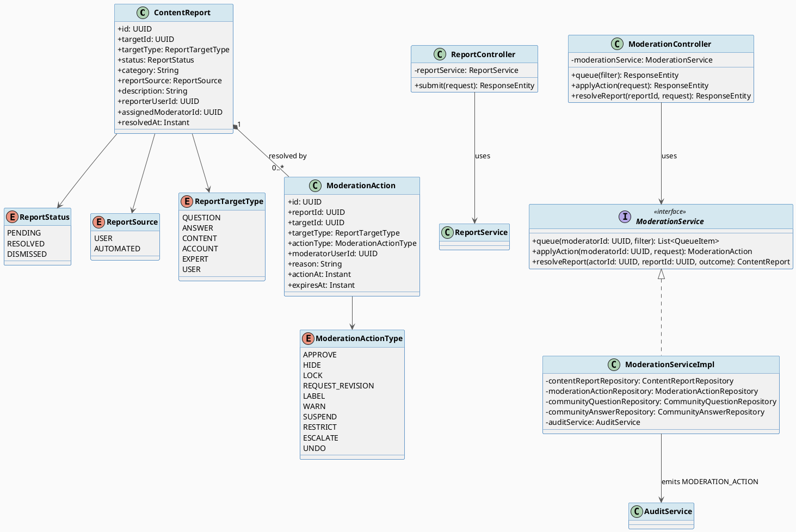
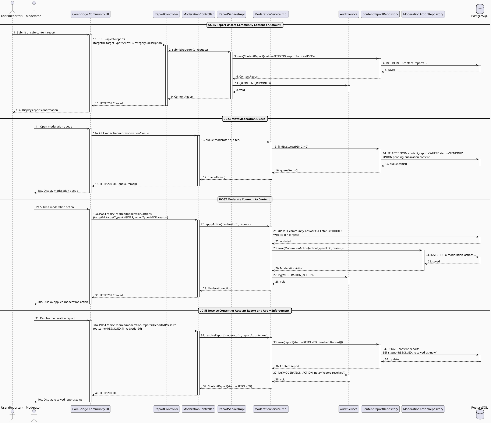

# MF-04 / Spec 02 — Content Moderation & Enforcement Pipeline

| Field | Value |
| --- | --- |
| Feature | MF-04 — Community Q&A & Moderation |
| Use Cases Covered | UC-55 Report Unsafe Community Content or Account, UC-56 View Moderation Queue, UC-57 Moderate Community Content, UC-58 Resolve Content or Account Report and Apply Enforcement |
| Primary Actor(s) | User (reporter), Moderator, System Admin |
| Platform | Mobile App / Web Portal (report), Admin Portal (moderate/resolve) |
| Main Flow Summary | A User reports unsafe content or account behavior (or the system auto-flags it), a Moderator reviews the moderation queue and applies a content decision (approve/hide/lock/label/warn/suspend/restrict), then resolves the underlying report with the enforcement outcome — closing the loop from report to community-visible action. |
| Grounding (source code) | `content/entity/ContentReport.java`, `ReportStatus.java`, `ReportSource.java`, `ReportTargetType.java`, `content/entity/ModerationAction.java`, `ModerationActionType.java`, `content/controller/ReportController.java` (`/api/v1/reports`), `content/controller/ModerationController.java` (`/api/v1/admin/moderation`) |

## 1. Tổng quan luồng chính (Main Flow Overview)

Đây là control an toàn trung tâm của MF-04 (BR-COMMUNITY-01, CC-01). `ContentReport`
được tạo bởi User (`reportSource=USER`, UC-55) hoặc tự động bởi hệ thống
(`reportSource=AUTOMATED`, ví dụ NS-04/NS-05 phát hiện nội dung nguy hiểm). Moderator
xem hàng đợi tổng hợp report + nội dung chờ duyệt trước xuất bản (UC-56), rồi ra quyết
định trên chính nội dung bị báo cáo (`ModerationAction` — APPROVE/HIDE/LOCK/
REQUEST_REVISION/LABEL/WARN/SUSPEND/RESTRICT/ESCALATE, UC-57). Cuối cùng, report được
đóng lại với kết quả xử lý (`ReportStatus`: RESOLVED hoặc DISMISSED, UC-58) — hành động
lên tài khoản (warn/suspend) nằm ngoài phạm vi phân quyền moderator có thể bị `ESCALATE`
lên System Admin. Quản lý topic (UC-59) là cấu hình phụ, không thuộc luồng thực thi
chính này.

## 2. Class Diagram

**Hình 1 — Class Diagram: Content Report & Moderation Action**

## 3. Sequence Diagram — Main Flow

**Hình 2 — Sequence Diagram: Report → Queue → Moderate Content → Resolve Report (Main Flow)**

## 4. Business Rules Applied

- BR-COMMUNITY-01 / CC-01 — mọi nội dung công khai chịu kiểm duyệt trước/sau xuất bản; bằng chứng kiểm duyệt được lưu giữ (`ModerationAction`, append-only theo `actionAt`).
- Separation-of-duties (UC-58) — hành động lên tài khoản (WARN/SUSPEND/RESTRICT) vượt phạm vi Moderator phải qua `ESCALATE` để System Admin xử lý.
- NS-04 — pipeline an toàn cộng đồng áp dụng kiểm tra trước/sau xuất bản, đưa nội dung nghi vấn vào hàng đợi và giữ lại bằng chứng kiểm duyệt.
- `UNDO` (ModerationActionType) chỉ được tạo bởi chính service xử lý hoàn tác, không lộ qua endpoint tạo action chung.
