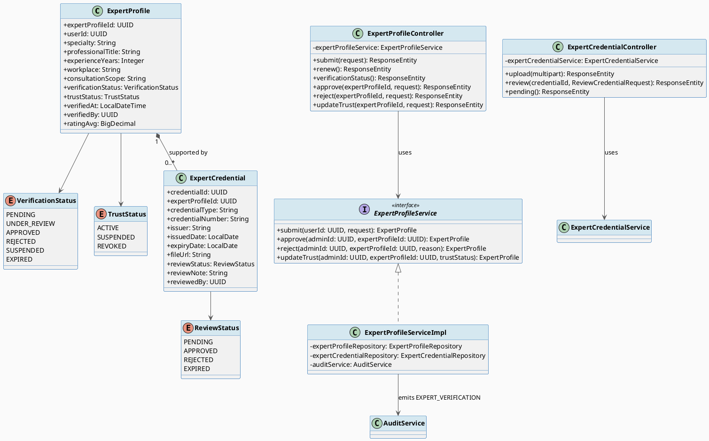
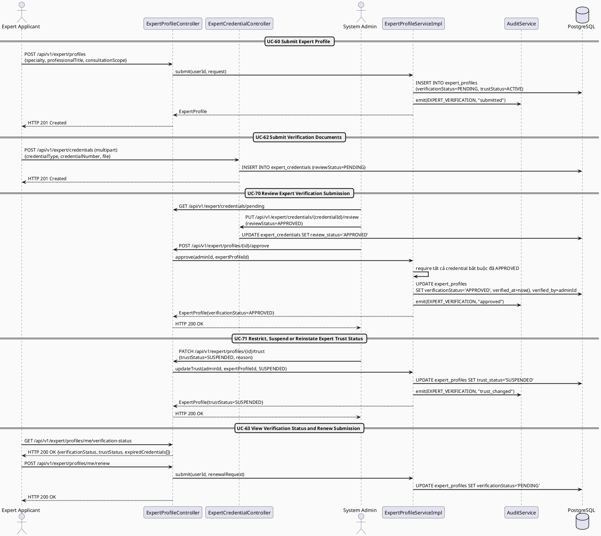
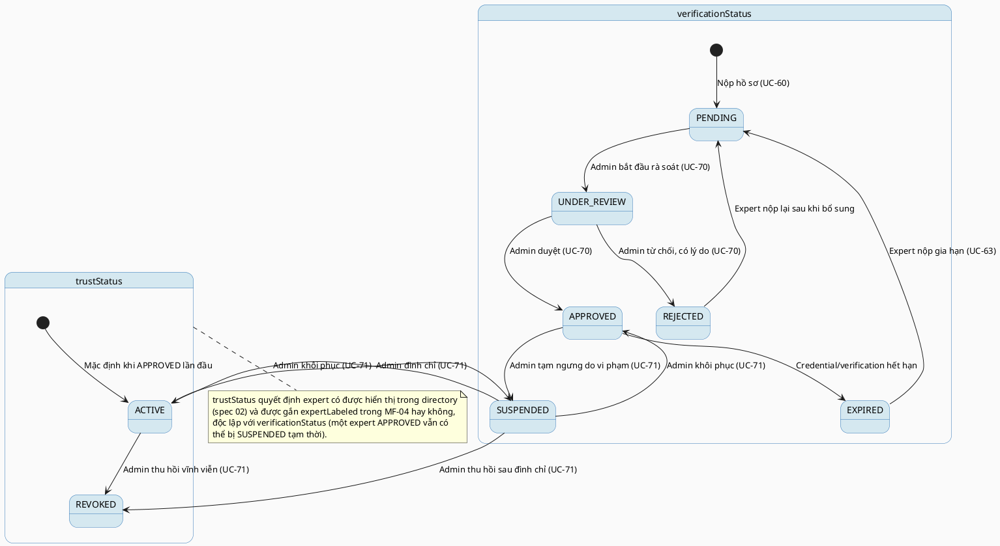

# MF-05 / Spec 01 — Expert Verification & Trust Lifecycle

| Field | Value |
| --- | --- |
| Feature | MF-05 — Verified Expert Network & Contribution |
| Use Cases Covered | UC-60 Submit Expert Profile, UC-62 Submit or Replace Verification Documents, UC-63 View Verification Status and Renew Submission, UC-70 Review Expert Verification Submission, UC-71 Restrict, Suspend or Reinstate Expert Trust Status |
| Primary Actor(s) | Expert Applicant / Verified Expert, System Admin |
| Platform | Expert Portal / Expert App, Admin Portal |
| Main Flow Summary | An Expert Applicant submits a professional profile and supporting credentials; a System Admin reviews and approves or rejects the submission; once approved the expert is trusted (`TrustStatus=ACTIVE`) until credentials expire, are renewed, or the admin restricts/suspends/reinstates trust for policy reasons. |
| Grounding (source code) | `expert/entity/ExpertProfile.java`, `expert/verificationstatus/VerificationStatus.java`, `expert/truststatus/TrustStatus.java`, `expertverification/entity/ExpertCredential.java`, `expertverification/reviewstatus/ReviewStatus.java`, `expert/controller/ExpertProfileController.java` (`/api/v1/expert/profiles/*`), `expertverification/controller/ExpertCredentialController.java` (`/api/v1/expert/credentials`) |

## 1. Tổng quan luồng chính (Main Flow Overview)

Đây là control "trust" trung tâm của MF-05 và là điều kiện tiên quyết để một expert
xuất hiện trong directory (spec 02), được gắn `expertLabeled` trong cộng đồng (MF-04),
hoặc tham gia nearby support (MF-07). `ExpertProfile.verificationStatus` bắt đầu ở
`PENDING` khi nộp hồ sơ (UC-60), kèm một hoặc nhiều `ExpertCredential` minh chứng
(UC-62, mỗi credential có `reviewStatus` riêng). System Admin rà soát và chuyển
`UNDER_REVIEW → APPROVED/REJECTED` (UC-70). Sau khi `APPROVED`, `trustStatus` mặc định
`ACTIVE`; System Admin có thể hạ xuống `SUSPENDED`/`REVOKED` khi vi phạm chính sách hoặc
tín chỉ hết hạn, và khôi phục khi hợp lệ trở lại (UC-71). Khi `verificationStatus`
chuyển `EXPIRED`, expert nộp lại để gia hạn (UC-63) — quay lại đúng chu trình rà soát.

## 2. Class Diagram

**Hình 1 — Class Diagram: Expert Profile, Credential & Verification/Trust Status**

## 3. Sequence Diagram — Main Flow

**Hình 2 — Sequence Diagram: Submit Profile → Submit Credentials → Admin Review → Trust Management → Renew (Main Flow)**

## 4. State Machine — `ExpertProfile.verificationStatus` & `trustStatus`

**Hình 3 — State Machine: `ExpertProfile.verificationStatus` (6 trạng thái) & `trustStatus` (3 trạng thái)**

## 5. Business Rules Applied

- BR-RBAC — chỉ System Admin mới duyệt/từ chối hồ sơ và thay đổi trust status.
- UC-70 — quyết định duyệt phải dựa trên rà soát credential (`ExpertCredential.reviewStatus`), không được duyệt hồ sơ khi credential bắt buộc còn `PENDING`/`REJECTED`.
- UC-71 — chỉ System Admin thay đổi `trustStatus`; mọi thay đổi phải kèm lý do và được audit.
- Directory visibility (spec 02) chỉ hiển thị expert có `verificationStatus=APPROVED` **và** `trustStatus=ACTIVE` đồng thời.
