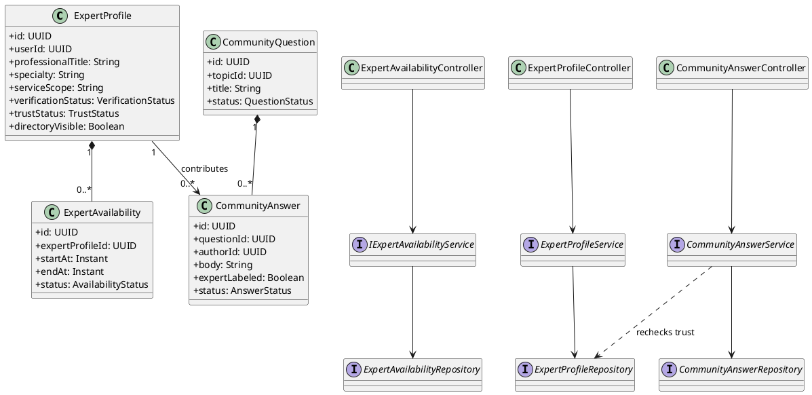
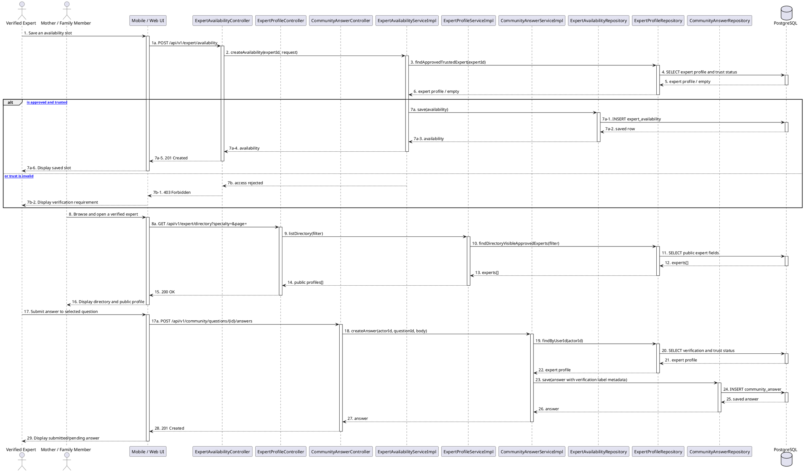

# MF-05 / Spec 02 — Expert Directory, Availability & Community Contribution

| Field | Value |
| --- | --- |
| Feature | MF-05 — Verified Expert Network & Contribution |
| Flows Covered | Manage availability and online visibility; browse verified expert directory; view public expert profile; answer a selected community question |
| Primary Actor(s) | Verified Expert, Mother, Family Member |
| Platform | Mobile App; Expert Web Portal; CareBridge API |
| Main Flow Summary | An approved expert manages availability and directory visibility. A Mother or Family Member browses the verified directory and opens a public professional profile. The expert contributes by answering a community question through the shared MF-04 answer flow. |
| Explicitly Excluded | Contribution badges, badge levels, leaderboard, competence score, automatic point-award flow, consultation fee/rating, consultation requests, direct chat, voice/video calls |
| Grounding (active UI/API) | Mobile `expert_calendar_screen.dart`, `expert_directory_screen.dart`, `expert_public_profile_screen.dart`, `question_detail_screen.dart`, `post_answer_screen.dart`; Web `ExpertQuestionQueuePage.tsx`; API `ExpertAvailabilityController`, `ExpertProfileController`, `CommunityAnswerController` |

## 1. Tổng quan luồng chính (Main Flow Overview)

Spec này chỉ mô tả phần MF-05 đang có luồng sử dụng thực tế và còn nằm trong SRS mới.
Expert phải hoàn tất Spec 01 và đang có trạng thái xác minh/tin cậy hợp lệ trước khi bật
hiển thị trong directory. Expert có thể quản lý các khoảng thời gian sẵn sàng và trạng
thái online. Mother hoặc Family Member tìm kiếm directory theo thông tin chuyên môn,
sau đó xem public profile ở mức dữ liệu nghề nghiệp được phép công khai.

Đóng góp của expert dùng chính luồng câu trả lời của MF-04. Câu trả lời có thể hiển thị
nhãn xác minh nghề nghiệp theo SRS; đây không phải huy hiệu thành tích. Không có màn hình
điểm, huy hiệu, cấp bậc hay leaderboard đang được route trên Web/Mobile, vì vậy các API
điểm còn sót lại không được đưa vào hợp đồng này. Các nút chat, yêu cầu tư vấn, phí và
rating còn xuất hiện trong code Mobile/Web là drift của MF-12 deferred và bị loại.

## 2. Class Diagram

**Hình 1 — Class Diagram: Expert Directory, Availability & Community Contribution**

## 3. Sequence Diagram — Main Flow

**Hình 2 — Sequence Diagram: Configure Availability, Browse Directory & Submit Expert Answer**

## 4. Business Rules Applied

- Directory chỉ công khai các trường nghề nghiệp được phép và chỉ với expert đã được xác minh, còn trust hợp lệ và bật visibility.
- Availability/online status không cam kết expert sẽ phản hồi hoặc cung cấp dịch vụ tại một thời điểm cụ thể.
- Nhãn verified expert trên answer chỉ phản ánh trạng thái xác minh nền tảng; không phải huy hiệu, xếp hạng hay bảo đảm nội dung đúng.
- Không tự động cộng điểm từ sequence đăng answer vì không có caller và UI end-to-end đang hoạt động cho luồng đó.
- Phí, rating, consultation request, direct chat và voice/video call thuộc MF-12 deferred, không thuộc Spec này.
