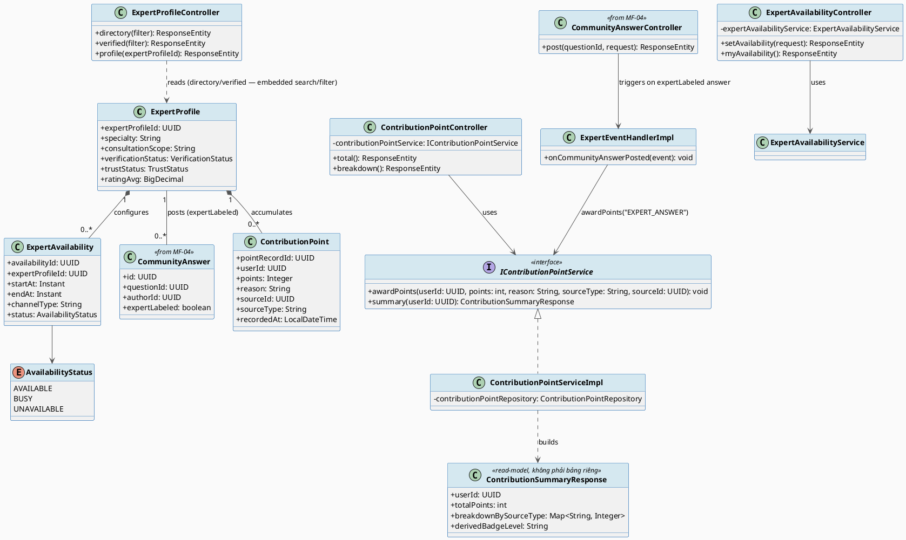
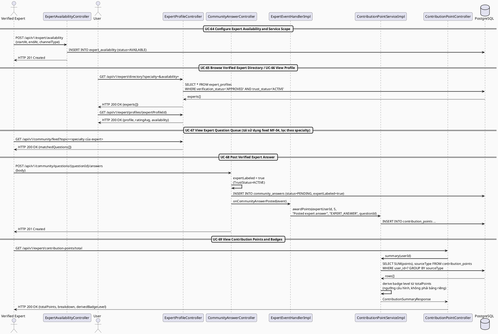
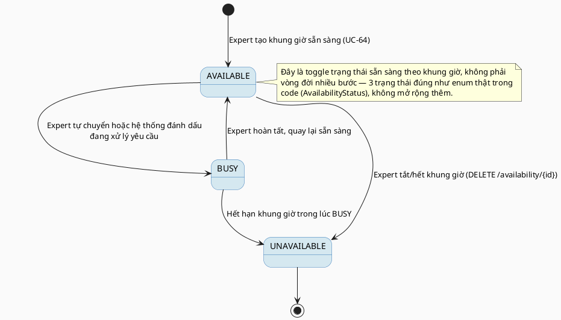

# MF-05 / Spec 02 — Expert Directory, Contribution & Recognition

| Field | Value |
| --- | --- |
| Feature | MF-05 — Verified Expert Network & Contribution |
| Use Cases Covered | UC-64 Configure Expert Availability and Service Scope, UC-65 Browse Verified Expert Directory, UC-66 View Verified Expert Profile, UC-67 View Expert Question Queue, UC-68 Post Verified Expert Answer, UC-69 View Contribution Points and Badges |
| Primary Actor(s) | Verified Expert, User (directory consumer) |
| Platform | Expert Portal / Expert App, Mobile App |
| Main Flow Summary | A Verified Expert configures availability/service scope so they become visible in the public directory, a User browses/opens that directory, and the expert answers matched community questions with a verified badge — automatically earning contribution points that accumulate into their recognized reputation. |
| Grounding (source code) | `expertavailability/entity/ExpertAvailability.java`, `AvailabilityStatus.java`, `expert/entity/ExpertProfile.java` (`/api/v1/expert/directory`, `/api/v1/expert/verified`), `expert/entity/ContributionPoint.java`, `expert/controller/ContributionPointController.java` (`/api/v1/expert/contribution-points`), `expert/handler/ExpertEventHandlerImpl.java` |

## 1. Tổng quan luồng chính (Main Flow Overview)

Luồng này tiêu dùng kết quả của MF-05/Spec-01 (`verificationStatus=APPROVED` +
`trustStatus=ACTIVE`) để tạo giá trị cho cộng đồng: Expert bật `ExpertAvailability`
(khung giờ + kênh hỗ trợ, UC-64) để đủ điều kiện xuất hiện trong
`GET /expert/directory` (UC-65) và `GET /expert/verified` (UC-66, chỉ trả expert đã xác
thực). Khi expert trả lời một câu hỏi cộng đồng phù hợp chuyên môn (UC-67/68, tái sử
dụng `CommunityAnswerController` của MF-04 với `expertLabeled=true`), sự kiện đăng câu
trả lời tự động phát sinh `ContributionPoint` (UC-69) — **không có entity "Badge" riêng
trong backend hiện tại**: "huy hiệu" được tính toán/hiển thị từ tổng điểm tích luỹ
(`GET /contribution-points/total`, `/breakdown`) ở tầng response, không phải bảng dữ
liệu độc lập. Tương tự, "hàng đợi câu hỏi chuyên môn" (UC-67) tái sử dụng feed cộng đồng
của MF-04 lọc theo `specialty` của expert, không phải một entity/API hàng đợi riêng.

## 2. Class Diagram

**Hình 1 — Class Diagram: Expert Availability → Directory Visibility → Contribution Points**

## 3. Sequence Diagram — Main Flow

**Hình 2 — Sequence Diagram: Configure Availability → Directory Visibility → Answer → Earn Points (Main Flow)**

## 4. State Machine — `ExpertAvailability.status`

**Hình 3 — State Machine: `ExpertAvailability.status` (toggle, 3 trạng thái)**

## 5. Business Rules Applied

- Directory visibility (UC-65/66) yêu cầu đồng thời `verificationStatus=APPROVED`, `trustStatus=ACTIVE` (spec 01) **và** có ít nhất một `ExpertAvailability` đang `AVAILABLE`.
- UC-68 — `expertLabeled=true` chỉ được gắn khi trust status hợp lệ tại thời điểm đăng bài, kiểm tra lại (không cache) mỗi lần post.
- UC-69 — điểm đóng góp thể hiện mức độ tham gia (participation), không phải năng lực chuyên môn lâm sàng (đúng theo mô tả MF-05 trong SRS).
- BR-RBAC — chỉ chính expert mới cấu hình được availability và xem contribution points của mình.
