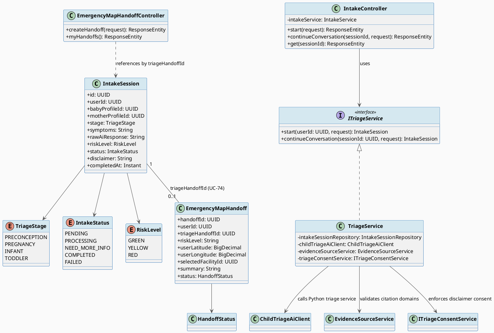
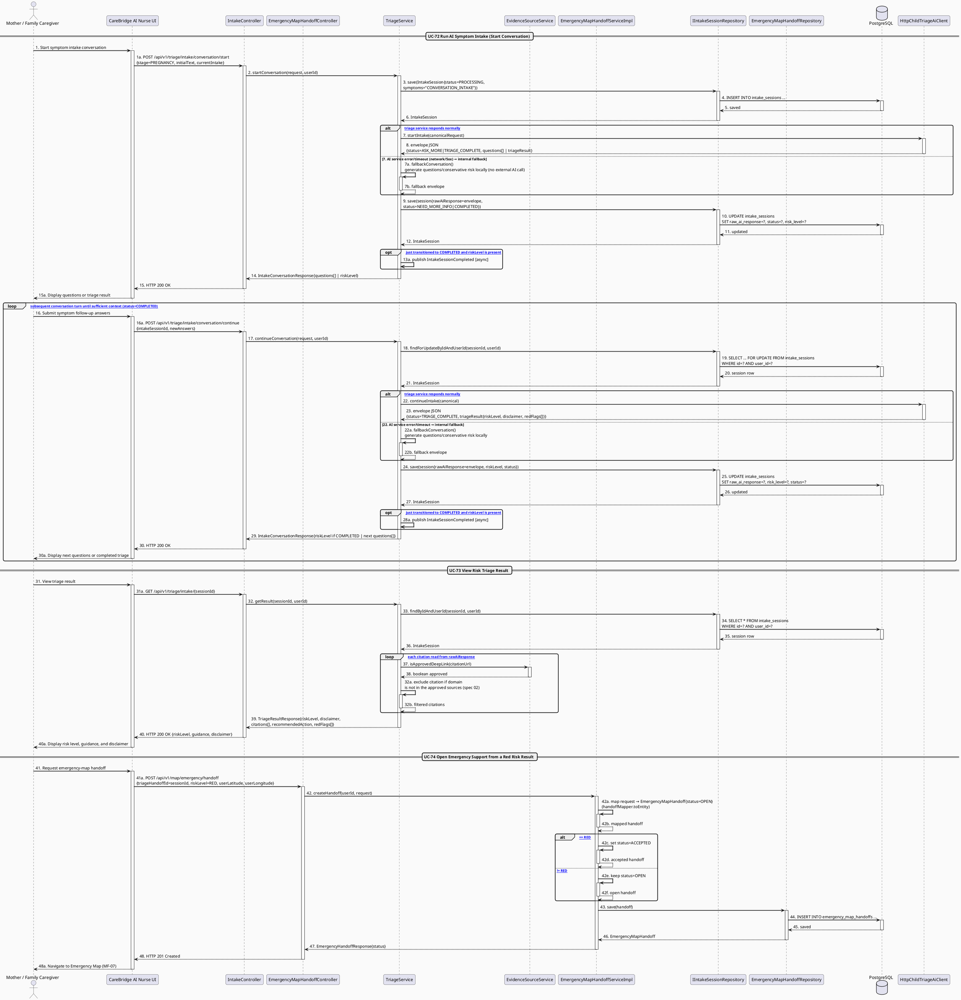

# MF-06 / Spec 01 — AI Symptom Intake, Risk Triage & Emergency Handoff

| Field | Value |
| --- | --- |
| Feature | MF-06 — AI Nurse Assistant & Risk Triage |
| Use Cases Covered | UC-72 Run AI Symptom Intake, UC-73 View Risk Triage Result, UC-74 Open Emergency Support from a Red Risk Result |
| Primary Actor(s) | Mother, Family Caregiver |
| Platform | Mobile App |
| Main Flow Summary | An authorized caregiver describes maternal or child symptoms through guided intake; the system returns a non-diagnostic GREEN/YELLOW/RED orientation using approved knowledge and red-flag rules, and for RED offers a user-initiated handoff into the Emergency Map flow (MF-07), never treating the output as a diagnosis. |
| Grounding (source code) | `triage/entity/IntakeSession.java`, `triage/IntakeStatus.java`, `triage/RiskLevel.java`, `triage/TriageStage.java`, `triage/controller/IntakeController.java` (`/api/v1/triage/intake`), `emergency/entity/EmergencyMapHandoff.java`, `HandoffStatus.java`, `emergency/controller/EmergencyMapHandoffController.java` (`/api/v1/map/emergency/handoff`) |

## 1. Tổng quan luồng chính (Main Flow Overview)

Đây là luồng an toàn quan trọng nhất của MF-06 (CC-01, NS-05). Mother mô tả triệu chứng
qua hội thoại có cấu trúc (`POST /conversation/start` → `/conversation/continue`), hệ
thống chuẩn hoá input, truy xuất tri thức đã duyệt (spec 02) và áp cờ đỏ bảo thủ để suy
ra `riskLevel` (GREEN/YELLOW/RED — UC-72). Kết quả luôn kèm `disclaimer` phi chẩn đoán
và hướng dẫn bước tiếp theo an toàn (UC-73). Khi `riskLevel=RED`, giao diện hiển thị lối
tắt sang bản đồ khẩn cấp; Mother chủ động bấm để tạo `EmergencyMapHandoff` tham chiếu lại
`IntakeSession` gốc (`triageHandoffId`), **không tự động điều hướng và không phải là một
cuộc gọi cấp cứu** (UC-74) — quyền quyết định luôn thuộc về người dùng.

## 2. Class Diagram

**Hình 1 — Class Diagram: AI Intake Session, Risk Level & Emergency Handoff Reference**

## 3. Sequence Diagram — Main Flow

**Hình 2 — Sequence Diagram: Start Intake → Conversation → View Result → Emergency Handoff (Main Flow)**

> **Ghi chú grounding:** Class Diagram ở mục 2 mô tả `IntakeServiceImpl` với các phụ thuộc
> khái niệm (`RedFlagRuleService`, `EvidenceRetrievalService`, `AuditService`) theo tinh
> thần SRS. Trong code thực tế, service duy nhất xử lý luồng này là `TriageService`
> (implements `ITriageService`), phụ thuộc `IIntakeSessionRepository`, `ChildTriageAiClient`
> (bean thật `HttpChildTriageAiClient`, gọi AI service ngoài qua HTTP) và
> `EvidenceSourceService` (chỉ dùng để validate `citation` domain đã duyệt khi xem kết quả,
> **không** chủ động "retrieve approved knowledge" trong lúc hội thoại như class diagram mô
> tả). `RedFlagRuleService`/`RedFlagRuleServiceImpl` là service quản trị rule cờ đỏ
> (CRUD, xem spec 02) — không được `TriageService` gọi trực tiếp trong luồng intake chính.
> **Không có lệnh gọi `AuditService` nào** trong `TriageService` hay
> `EmergencyMapHandoffServiceImpl` — luồng UC-72/73/74 hiện không phát sinh audit log ở
> tầng service (khác với giả định trong class diagram).

## 4. Business Rules Applied

- CC-01 / Excluded (SRS mục 4.8) — AI không chẩn đoán, không kê đơn, không tư vấn liều lượng; luôn kèm `disclaimer`.
- NS-05 — chuẩn hoá input, chỉ truy xuất tri thức đã duyệt (spec 02), áp fallback bảo thủ khi không chắc chắn, ghi log phiên bản rule/nguồn dùng.
- UC-74 — handoff sang Emergency Map là hành động **do người dùng chủ động chọn**, hệ thống không tự dispatch hay đảm bảo có chuyên gia/xe cấp cứu đến.
- BR-PRIVACY — nội dung intake (`symptoms`, `rawAiResponse`) là dữ liệu sức khỏe nhạy cảm, chỉ chủ sở hữu truy cập được.
