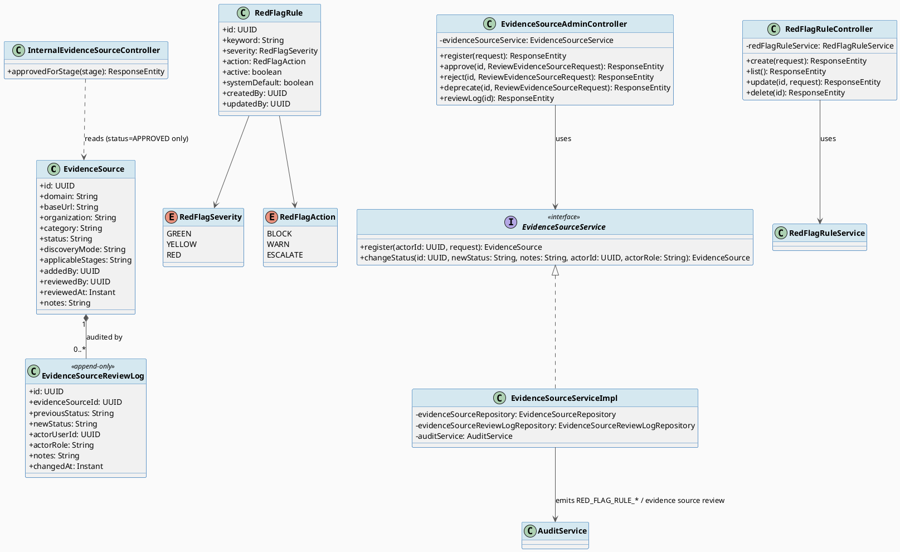
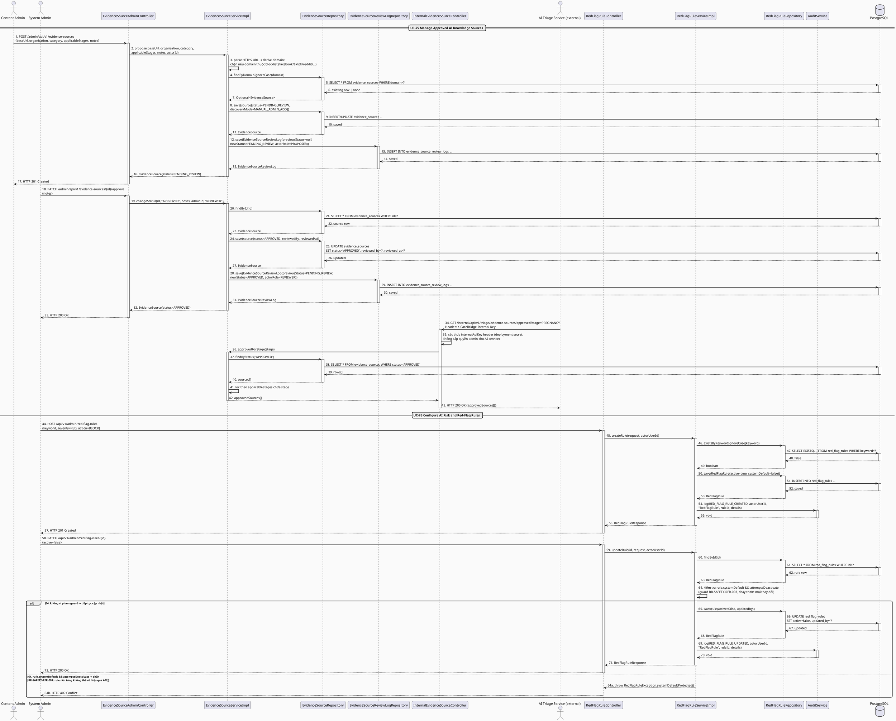
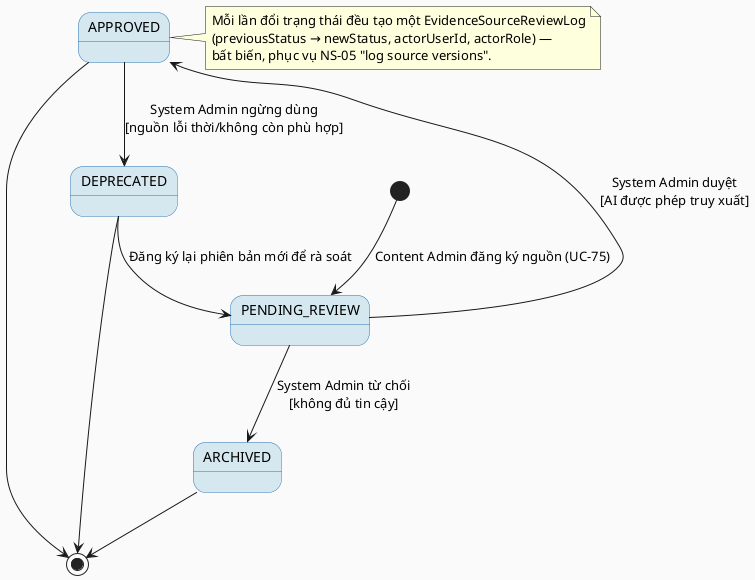

# MF-06 / Spec 02 — AI Knowledge Source & Red-Flag Rule Governance

| Field | Value |
| --- | --- |
| Feature | MF-06 — AI Nurse Assistant & Risk Triage |
| Use Cases Covered | UC-75 Manage Approved AI Knowledge Sources, UC-76 Configure AI Risk and Red-Flag Rules |
| Primary Actor(s) | Content Admin / System Admin |
| Platform | Admin Portal |
| Main Flow Summary | A Content Admin registers a candidate knowledge domain and a System Admin reviews it into an approved/rejected/deprecated state that gates what the AI intake pipeline (spec 01) may retrieve from; separately, a System Admin maintains conservative keyword-based red-flag rules with severity and fallback action, versioned and auditable. |
| Grounding (source code) | `triage/entity/EvidenceSource.java`, `EvidenceSourceReviewLog.java`, `triage/controller/EvidenceSourceAdminController.java` (`/admin/api/v1/evidence-sources`), `triage/controller/InternalEvidenceSourceController.java` (`/internal/api/v1/triage/evidence-sources/approved`), `triage/entity/RedFlagRule.java`, `RedFlagSeverity.java`, `RedFlagAction.java`, `triage/controller/RedFlagRuleController.java` (`/api/v1/admin/red-flag-rules`) |

## 1. Tổng quan luồng chính (Main Flow Overview)

Đây là control quản trị đứng sau toàn bộ pipeline an toàn AI ở spec 01 (NS-05). Không
nguồn tri thức nào được AI truy xuất trừ khi `EvidenceSource.status=APPROVED` — mọi thay
đổi trạng thái được ghi lại thành `EvidenceSourceReviewLog` bất biến (`previousStatus →
newStatus`, ai đổi, khi nào). Song song, `RedFlagRule` là danh sách từ khoá/mẫu nhận diện
cấp bảo thủ (`severity` GREEN/YELLOW/RED + `action` BLOCK/WARN/ESCALATE) mà
`IntakeServiceImpl` (spec 01) áp dụng trước khi tin tưởng bất kỳ kết quả AI nào. Cả hai
đều versioned/audit theo yêu cầu NS-05 "log rule/source versions".

## 2. Class Diagram

**Hình 1 — Class Diagram: Evidence Source Review Log & Red-Flag Rule**

## 3. Sequence Diagram — Main Flow

**Hình 2 — Sequence Diagram: Register → Approve Evidence Source (consumed by external AI service) → Configure Red-Flag Rule (Main Flow)**

> **Ghi chú grounding:** `EvidenceSourceServiceImpl` (`propose`/`changeStatus`/`approvedForStage`)
> **không** phụ thuộc `AuditService` — class diagram ở mục 2 vẽ cạnh `EvidenceSourceServiceImpl
> --> AuditService` mang tính khái niệm/SRS, không khớp code thật; mọi thay đổi trạng thái
> nguồn tri thức chỉ được ghi vết qua `EvidenceSourceReviewLog` (không phải audit log chung).
> Ngược lại, `RedFlagRuleServiceImpl` **có** gọi `auditService.log(...)` thật cho
> `RED_FLAG_RULE_CREATED`/`UPDATED`/`DELETED`. Endpoint đăng ký nguồn tri thức thực chất nhận
> `baseUrl` (không phải `domain` trực tiếp — domain được suy ra từ URL) và được bảo vệ bởi
> `@PreAuthorize("hasAnyRole('SYSTEM_ADMIN','CONTENT_ADMIN')")` ở **toàn bộ**
> `EvidenceSourceAdminController` (kể cả approve/reject/deprecate — không giới hạn riêng cho
> System Admin như mô tả SRS). Endpoint `GET .../evidence-sources/approved` nằm ở
> `InternalEvidenceSourceController` riêng biệt (route `/internal/...`), được gọi bởi AI
> triage service ngoài (Python) qua header `X-CareBridge-Internal-Key`, **không phải** do
> `TriageService`/`IntakeController` (MF-06/01) gọi trực tiếp trong tiến trình Java.

## 4. State Machine — `EvidenceSource.status`

**Hình 3 — State Machine: `EvidenceSource.status` Lifecycle**

## 5. Business Rules Applied

- NS-05 — AI chỉ truy xuất nguồn có `status=APPROVED`; mọi thay đổi rule/nguồn được version hoá và ghi log.
- BR-RBAC — đăng ký nguồn thuộc Content Admin; duyệt/từ chối/deprecate và cấu hình red-flag rule thuộc System Admin.
- `systemDefault=true` trên `RedFlagRule` đánh dấu rule nền tảng không được xoá qua API thông thường (chỉ có thể `active=false`).
- UC-76 — rule mang tính "bảo thủ" (conservative): khi nghi ngờ, `action` thiên về `WARN`/`ESCALATE`/`BLOCK` hơn là bỏ qua.
