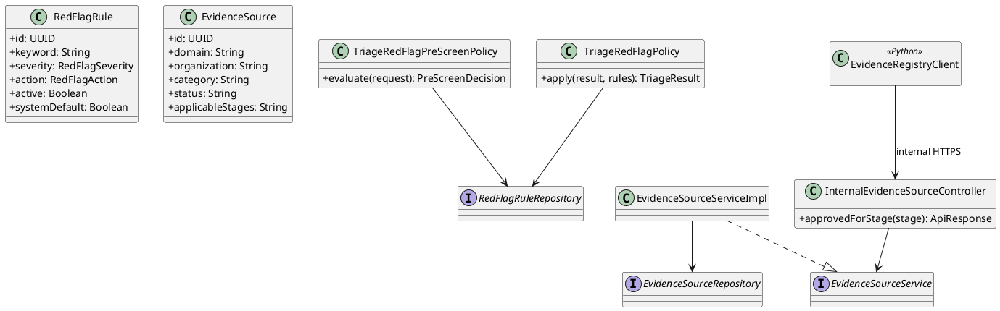
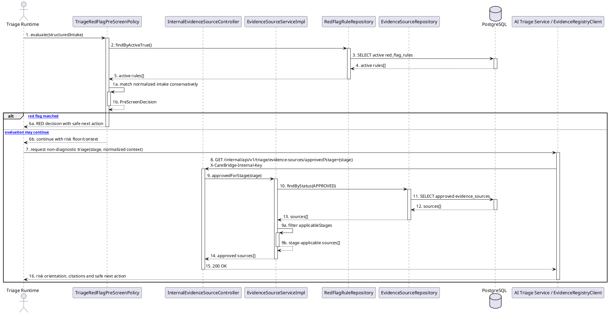

# MF-06 / Spec 02 — Approved Knowledge Retrieval & Red-Flag Execution

| Field | Value |
| --- | --- |
| Feature | MF-06 — AI Nurse Assistant & Risk Triage |
| Flows Covered | Retrieve stage-applicable approved evidence sources; run active red-flag pre-screen rules before AI-assisted triage; preserve rule/source context in the result |
| Primary Actor(s) | CareBridge Triage Runtime |
| Secondary Actors | AI Triage Service, Evidence Registry |
| Platform | CareBridge API; AI Triage Service |
| Main Flow Summary | During an authorized structured intake, the runtime loads active red-flag rules, applies the conservative pre-screen, and lets the AI service retrieve only approved evidence sources for the selected care stage. |
| Explicitly Excluded | Standalone RAG chat; community AI-moderation policy UI; autonomous diagnosis; prescription; invented Web knowledge-governance screen |
| Grounding (active runtime) | API `TriageRedFlagPreScreenPolicy`, `TriageRedFlagPolicy`, `RedFlagRuleRepository`, `InternalEvidenceSourceController`, `EvidenceSourceServiceImpl`; AI service `app/evidence_registry_client.py` |

## 1. Tổng quan luồng chính (Main Flow Overview)

Spec này mô tả control thực sự được gọi trong luồng triage, không mô tả một màn hình
quản trị giả định. Backend pre-screen đọc các `RedFlagRule` đang active trước khi tin
tưởng kết quả từ mô hình. AI service chỉ lấy danh sách `EvidenceSource` có trạng thái
`APPROVED` và phù hợp stage qua internal endpoint có khóa dịch vụ.

Màn hình `/admin/safety-rules` trên Web hiện quản lý red-flag/community AI moderation
policy; phần moderation thuộc MF-04 và không được xem là Web UI của AI Nurse. Mobile
`RagChatScreen` cũng không có route hợp lệ, nên standalone RAG chat không thuộc flow.

## 2. Class Diagram

**Hình 1 — Class Diagram: Approved Knowledge and Red-Flag Runtime Controls**

## 3. Sequence Diagram — Main Flow

**Hình 2 — Sequence Diagram: Red-Flag Pre-Screen and Approved Evidence Retrieval**

## 4. Business Rules Applied

- Chỉ rule `active=true` và evidence source `APPROVED` phù hợp stage được dùng.
- Red-flag policy đặt ngưỡng bảo thủ và có quyền nâng mức rủi ro; mô hình không được tự hạ risk floor do rule tạo ra.
- Internal evidence endpoint yêu cầu service key; nó không cấp quyền Admin cho AI service.
- Nếu evidence registry lỗi hoặc không có nguồn phù hợp, hệ thống phải fail safe và không tạo câu trả lời y khoa không có grounding.
- Kết quả chỉ là green/yellow/red orientation và safe next action, không chẩn đoán hoặc kê đơn.
