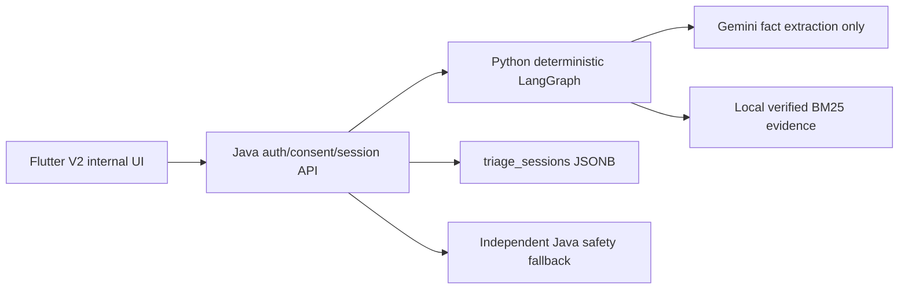

# AI Reproductive Health Triage Assistant V2 — Architecture and Operations

Updated: 2026-08-06 · Status: FUNCTIONALLY IMPLEMENTED LOCALLY, PUBLIC RELEASE BLOCKED

## 1. Governance and intended use

CareBridge is an `ACADEMIC_COMMUNITY_PROJECT` and a third-party informational risk-orientation tool.
It is not a hospital, clinic, diagnostic/prescription service, WHO product or clinically validated
medical device. Metadata remains `DEV_REVIEWED`, `NOT_CLINICALLY_VALIDATED`, external sign-off `NONE`.

CareBridge tham khảo và ánh xạ các dấu hiệu cảnh báo từ tài liệu y tế công khai của WHO, Bộ Y tế và
các nguồn y tế uy tín để xây dựng bộ quy tắc định hướng rủi ro riêng của CareBridge.

## 2. Architecture and authority boundaries

- Java owns auth, consent, owner scoping, idempotency, state version, persistence, retention metadata,
  timeout/fallback, feature flags and ruleset-hash handshake.
- Python owns deterministic context/entity/intent/stage, signals, fixed question planning, canonical
  clinical rule evaluation, GREEN denial, rendering and post-outcome evidence retrieval.
- Gemini can return facts only; schemas cannot carry outcome/action/stop/URL/diagnosis/treatment.
- RAG runs after outcome and cannot mutate disposition.

## 3. State machine

Every new/resumed turn enters input validation and Global Safety. RED precedes target/intent/scope.
Then target→intent→stage→normalization/conflict→entity/stage validation→stage safety→dataset/scope→
canonical rule evaluator→question planner or terminal renderer→audit. Resume never jumps to planning.
Duplicate/stale messages are controlled and do not advance rounds. Maximum: 3 questions/round, 3 rounds.

## 4. Context, intent and entity

Targets: MOTHER, BABY, UNKNOWN, CONFLICTED. A state has one primary subject. “Mẹ và bé” requires a
choice and may open a second session. Explicit clarification has highest precedence. MOTHER and BABY
stages are validated; invalid cross-entity pairs are conflicts, never silently corrected. Unknown
complaints are not automatically out of scope; OOS requires positive taxonomy evidence.

## 5. Rules and safety

Rules load from canonical, hash-checked contracts and share parity vectors across Python/Java. Missing
is UNKNOWN, never ABSENT. Historical is never current. Independent Java fallback recognizes only the
small global danger set from trusted structured signals and otherwise returns NMI. No runtime failure
becomes GREEN/OOS. The fallback does not infer a global signal from arbitrary free text.

GREEN runtime status is `DISABLED`; eligibility is `BLOCKED_BY_SOURCE_COVERAGE`. The graph, Java
readiness/flags and Flutter parser are independent denial layers.

## 6. Question catalog

The canonical catalog carries question ID, target/stage/intent applicability, fields/signals resolved,
answer/options/measurement, priority, escalation signals and clarification/precondition flags. Hard
filters prevent mother questions for a baby and vice versa. Unknown target permits target clarification
only; `UNAWARE_OR_UNMEASURABLE` pivots rather than repeating a measurement.

## 7. API and persistence

Internal Java endpoints:

- `POST /api/internal/v2/triage/sessions`
- `POST /api/internal/v2/triage/sessions/{id}/messages`
- `GET /api/internal/v2/triage/sessions/{id}`
- `DELETE /api/internal/v2/triage/sessions/{id}?expectedStateVersion=N`

Python transport: `POST /internal/triage/v2/turn` with shared secret. Java reuses `triage_sessions`
JSONB and existing owner/request constraints/row locking; no new migration was needed. Persisted raw
health text is replaced with `[REDACTED_HEALTH_TEXT]`.

## 8. Sources and RAG

Only local `SOURCE_VERIFIED` documents with allowlisted HTTPS deep-link, section/page, organization,
target/stage/language/rule mapping and exact SHA-256 body hash qualify. Ranking is deterministic BM25.
The present inventory is 13 documents, 0 verified, so citations are empty. pgvector was rejected for
lack of measured benefit. V2 never runtime-browses the Internet.

## 9. Fallback and failure modes

- Trusted server-derived explicit global danger: Java fallback RED/action-first. Client-authored
  signals, measurements and journey context are rejected at the Java authority boundary.
- Python/registry/hash unavailable without explicit danger: controlled NMI/FALLBACK_ONLY.
- Gemini invalid/timeout: deterministic path continues/NMI.
- Free-text-only danger detection without Gemini is not claimed: the current global-gate and Java
  fallback evidence uses trusted structured signals. A deterministic phrase-to-signal contract needs
  source/rule review before it can be added; until then this remains a full-stack rollout blocker.
- Corpus missing/rejected: disposition remains, citations empty.
- Stale version: Flutter exposes a typed 409 failure. Automatic GET-refresh/retry is not yet implemented
  and remains required before a full multi-client E2E claim.
- Shadow mismatch/failure: categorical telemetry only; V1 unaffected.

## 10. Privacy and security

Role/Principal and owner-scoped queries protect endpoints; active consent precedes creation. Payloads,
IDs and collections are bounded. Structured fields accept canonical codes only. Logs/metrics exclude
health text, prompts, identifiers, secrets and exception details. Retention is clamped and recorded.

Known blocker: `retentionUntil` is not an enforced purge. Completed snapshots are immutable and the
repository has no permanent account-deletion processor for them. Public rollout requires a reviewed
retention/legal policy, privileged purge design, migration and DB tests.

## 11. Evaluation

The deterministic engineering corpus currently passes 14/14: global/stage RED recall 4/4, target
accuracy 100%, wrong entity/question 0, OOS false positive 0 and unsupported GREEN 0. This is regression
evidence, not clinical validation. Citation precision is not measurable with zero verified sources.

## 12. Operations and observability

Default-off flags:

- Java `CAREBRIDGE_TRIAGE_V2_INTERNAL_ENABLED=false`
- Java `CAREBRIDGE_TRIAGE_V2_SHADOW_ENABLED=false`
- Flutter `AI_TRIAGE_V2_INTERNAL_ENABLED=false`

Monitor technical readiness, fallback/hash/schema/extraction/citation/target/state-conflict counts,
outcomes, latency, questions/max-round and shadow match/mismatch/error. Labels are closed enums. Before
any flag change: run full suites, registry sync, diff check, disposable DB/Flyway E2E and review the
machine-readable GREEN decision. Never change flags as an automatic CI consequence.

## 13. Rollback and deprecation

V1 remains public and intact. Disable both Java V2 flags and Flutter internal flag to roll back. Do not
delete V1 until the caller inventory exit gates, shadow window, DB E2E and rollback drill pass. Legacy
model-outcome/open-web paths are marked V1-only and forbidden to new V2 callers.

## 14. Demo flow

1. Build an internal Flutter variant with V2 flag only in a disposable environment.
2. Select Mother/Baby or leave Unknown; enter a non-identifying test phrase.
3. Demonstrate target clarification and a second separate session for the other person.
4. Demonstrate explicit global RED action before any sources.
5. Demonstrate OOS wrist and an unknown complaint staying NMI.
6. Stop before claiming verified citations or GREEN: current source coverage is zero and GREEN disabled.

## 15. Known limitations

- No clinical validation or external clinical sign-off.
- Verified source corpus: 0; citation coverage/precision unavailable.
- GREEN rule/dataset/source coverage incomplete and public GREEN disabled.
- Full DB-backed E2E/Flyway/DB chaos not run because Docker is unavailable.
- Retention/account deletion enforcement unresolved.
- V1 still contains legacy runtime search and model-outcome interfaces; V2 is isolated from them.
- Whole-app Flutter analyze retains unrelated baseline warnings and one dirty stage-selector golden diff.
