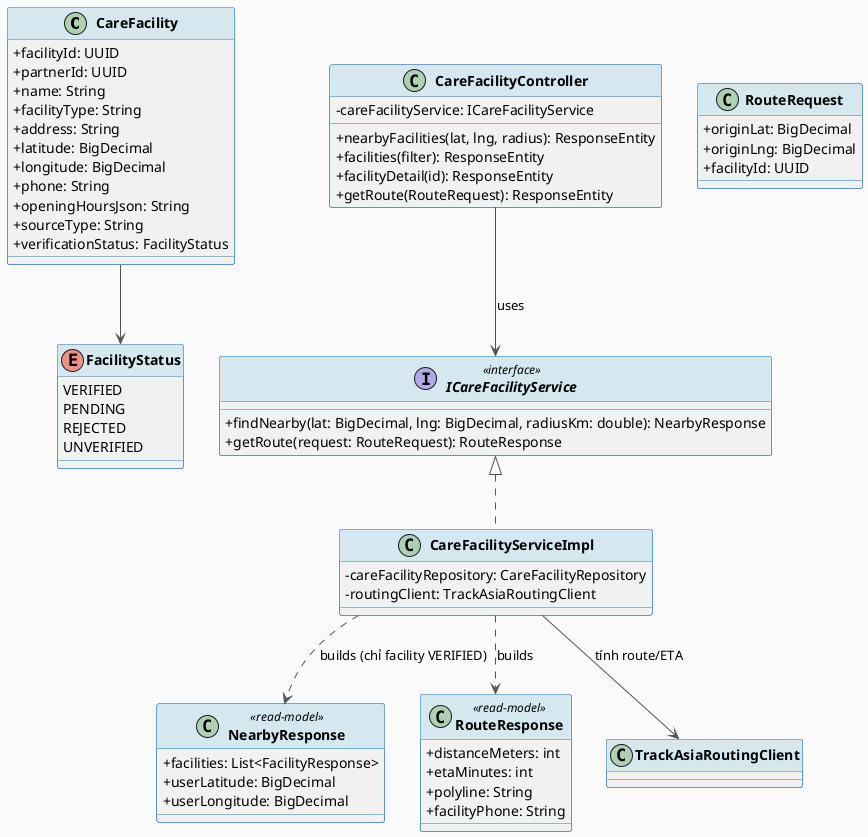
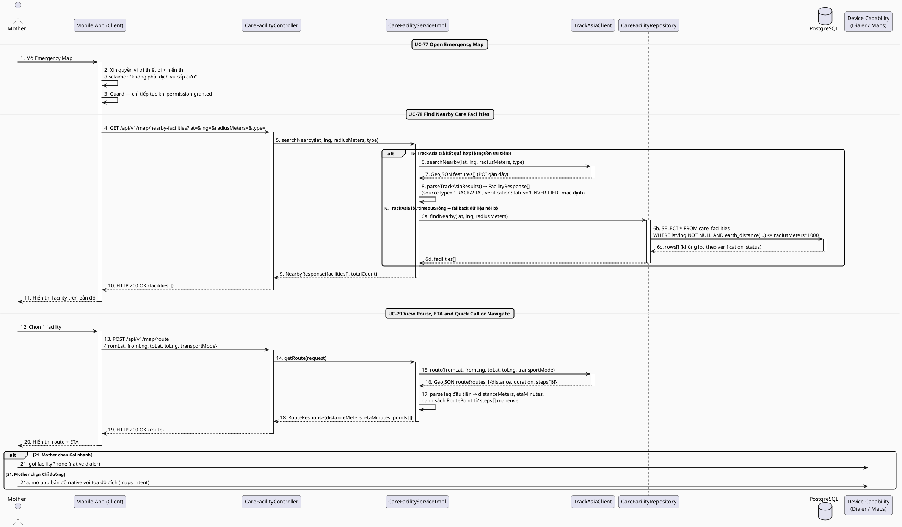
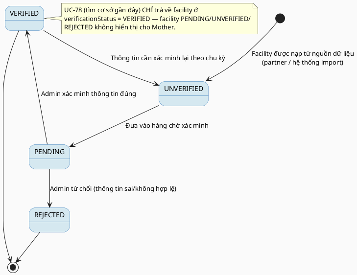

# MF-07 / Spec 01 — Emergency Map, Nearby Facility Search & Route Navigation

| Field | Value |
| --- | --- |
| Feature | MF-07 — Emergency Map & Nearby Care Support |
| Use Cases Covered | UC-77 Open Emergency Map, UC-78 Find Nearby Care Facilities, UC-79 View Route, ETA and Quick Call or Navigate |
| Primary Actor(s) | Mother |
| Platform | Mother Mobile App |
| Main Flow Summary | A Mother opens the emergency map (after being informed of the location-permission and non-dispatch scope), the app resolves nearby verified care facilities from her approved location, and she views route/ETA and triggers a quick call or turn-by-turn navigation to a selected facility through the device's native capability. |
| Grounding (source code) | `map/entity/CareFacility.java`, `FacilityStatus.java`, `map/controller/CareFacilityController.java` (`/api/v1/map/nearby-facilities`, `/facilities`, `/route`) |

## 1. Tổng quan luồng chính (Main Flow Overview)

UC-77 (mở bản đồ) không tạo bản ghi backend — đó là bước xin quyền vị trí và hiển thị
màn hình phía client (theo D-05, hành vi màn hình không tách UC riêng có backend). Luồng
backend thực sự bắt đầu từ UC-78: hệ thống trả về `CareFacility` đã `VERIFIED` gần vị
trí được người dùng cho phép. UC-79 dùng toạ độ facility đã chọn để tính route/ETA
(`POST /route`) rồi giao cho thiết bị xử lý gọi nhanh/điều hướng (native call/maps
intent) — CareBridge chỉ tính toán route, **không tự dispatch xe cấp cứu hay đảm bảo
chuyên gia đến** (đúng phạm vi loại trừ trong SRS 4.8).

## 2. Class Diagram

**Hình 1 — Class Diagram: Care Facility & Route/ETA Read-Model**

## 3. Sequence Diagram — Main Flow

**Hình 2 — Sequence Diagram: Open Map → Find Nearby Facilities → View Route/ETA → Quick Call or Navigate (Main Flow)**

> **Ghi chú grounding (quan trọng — lệch với Business Rules mục 5):** Code thật của
> `CareFacilityServiceImpl.searchNearby(...)` gọi **TrackAsia (nguồn ngoài) trước tiên**, và
> kết quả TrackAsia được gắn cứng `verificationStatus="UNVERIFIED"` — nghĩa là trong đường
> đi chính (happy path), UC-78 **có thể trả về facility chưa được admin xác minh**. Chỉ khi
> TrackAsia lỗi/rỗng, hệ thống mới fallback sang `CareFacilityRepository.findNearby(...)`,
> và truy vấn native đó **không lọc theo `verification_status='VERIFIED'`** — trả về mọi
> facility có toạ độ trong bán kính bất kể trạng thái xác minh. Điều này khác với khẳng định
> ở mục 5 ("chỉ facility VERIFIED được trả về") và với note trong State Machine ở mục 4 —
> hành vi lọc theo VERIFIED hiện **không được enforce ở tầng service/repository** cho luồng
> tìm kiếm gần đây; nó chỉ đúng cho các endpoint khác dùng `findByVerificationStatus(...)`.
> Ngoài ra, `map/routeprovider/RouteProvider.java` tồn tại như một interface nhưng
> `CareFacilityServiceImpl` phụ thuộc thẳng vào `TrackAsiaClient` cụ thể, không qua
> interface này.

## 4. State Machine — `CareFacility.verificationStatus`

**Hình 3 — State Machine: `CareFacility.verificationStatus` Lifecycle**

## 5. Business Rules Applied

- UC-77 — người dùng phải được thông báo rõ phạm vi "không dispatch cấp cứu" trước khi vào bản đồ (CC-01).
- UC-78 — chỉ facility `VERIFIED` được trả về; vị trí sử dụng là vị trí người dùng đã cấp quyền hoặc khu vực tự chọn.
- UC-79 — route/ETA là hỗ trợ tham khảo; gọi nhanh/điều hướng giao hoàn toàn cho năng lực thiết bị (dialer/maps app), CareBridge không tự thực hiện cuộc gọi hay điều hướng.
- Excluded (SRS 4.8) — không dispatch xe cấp cứu, không đảm bảo lịch trình cơ sở y tế.
