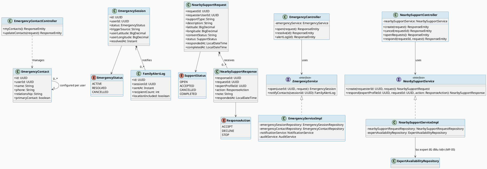
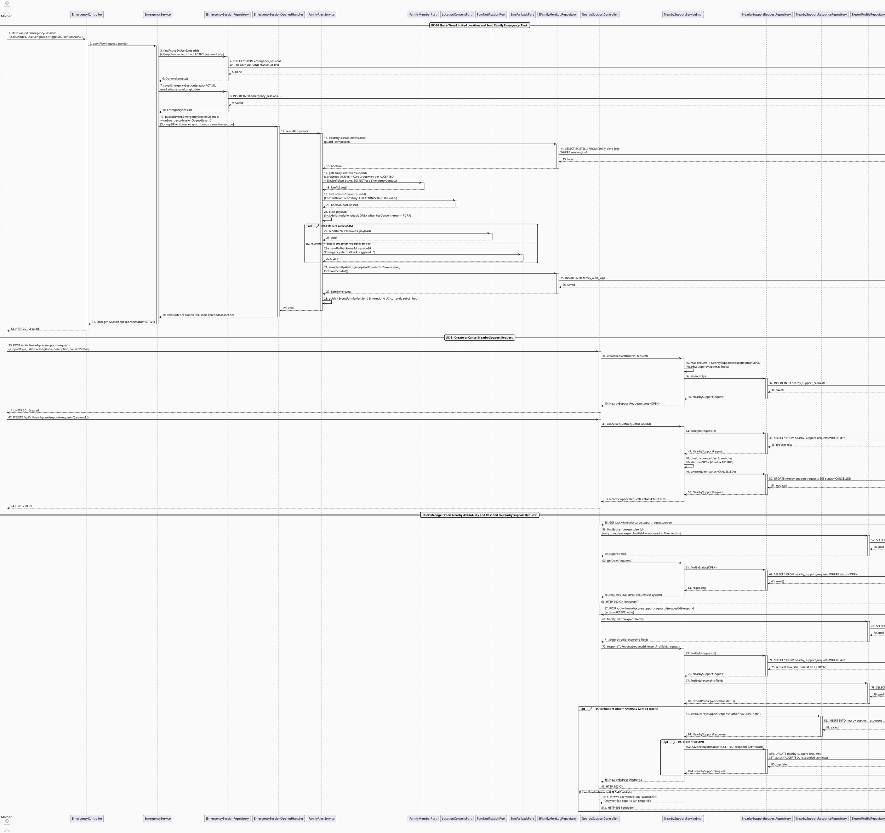
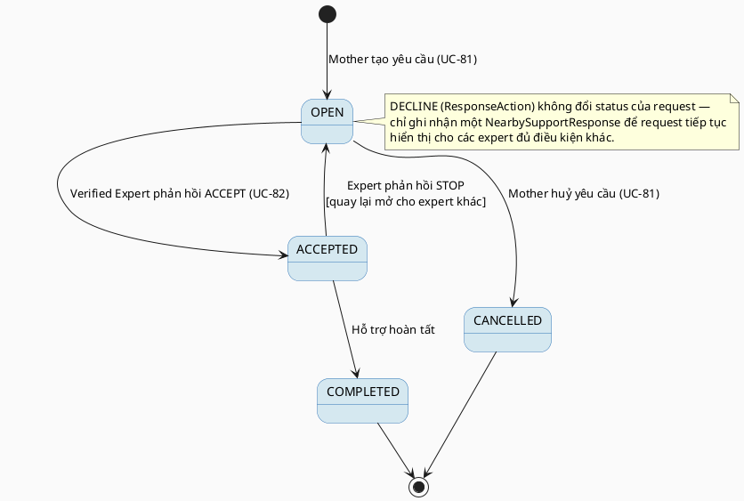

# MF-07 / Spec 02 — Time-Limited Family Alert & Nearby Support Request

| Field | Value |
| --- | --- |
| Feature | MF-07 — Emergency Map & Nearby Care Support |
| Use Cases Covered | UC-80 Share Time-Limited Location and Send Family Emergency Alert, UC-81 Create or Cancel Nearby Support Request, UC-82 Manage Expert Nearby Availability and Respond to Nearby Support Request |
| Primary Actor(s) | Mother, Verified Expert |
| Platform | Mother Mobile App, Expert App / Expert Portal |
| Main Flow Summary | A Mother opens an `EmergencySession` and notifies pre-configured emergency contacts with her minimum-necessary location (time-limited), and/or creates a `NearbySupportRequest` visible only to eligible nearby verified experts, who may accept, decline or stop responding — with no guarantee of expert arrival. |
| Grounding (source code) | `emergency/entity/EmergencySession.java`, `EmergencyStatus.java`, `emergency/entity/EmergencyContact.java`, `emergency/entity/FamilyAlertLog.java`, `emergency/controller/EmergencyController.java` (`/api/v1/emergency/sessions`), `EmergencyContactController.java` (`/api/v1/emergency/contact`), `nearbycare/entity/NearbySupportRequest.java` (`SupportStatus`), `NearbySupportResponse.java` (`ResponseAction`), `nearbycare/controller/NearbySupportController.java` (`/api/v1/nearbycare`) |

## 1. Tổng quan luồng chính (Main Flow Overview)

Đây là luồng có tác động cao nhất của MF-07: một `EmergencySession` được mở với vị trí
người dùng, hệ thống gửi cảnh báo tới `EmergencyContact` đã cấu hình trước (ghi vết bằng
`FamilyAlertLog` — số người nhận, có kèm vị trí hay không — UC-80). Song song, Mother có
thể tạo một `NearbySupportRequest` độc lập với toạ độ + loại hỗ trợ cần; request này
**chỉ hiển thị cho verified expert đủ điều kiện** (đã bật nearby availability — MF-05/02)
trong bán kính phù hợp, và Mother có thể huỷ bất kỳ lúc nào (UC-81). Expert xem request
tối thiểu ngữ cảnh cần thiết và phản hồi ACCEPT/DECLINE/STOP (`NearbySupportResponse` —
UC-82). Toàn bộ luồng **không đảm bảo có expert nhận** và **không phải dịch vụ điều
phối xe cấp cứu** (đúng phạm vi loại trừ SRS 4.8).

## 2. Class Diagram

**Hình 1 — Class Diagram: Emergency Session/Family Alert & Nearby Support Request/Response**

## 3. Sequence Diagram — Main Flow

**Hình 2 — Sequence Diagram: Send Family Alert (event-driven) → Create/Cancel Nearby Support Request → Expert Responds (Main Flow)**

> **Ghi chú grounding (quan trọng — lệch với Class Diagram & Business Rules):**
> 1. `EmergencyContact` (entity/`EmergencyContactController`) **không** được dùng để gửi
>    cảnh báo khẩn cấp. Danh sách người nhận thật sự lấy từ thành viên `CareGroup` (module
>    Family, MF-10) đang `ACTIVE`/`ACCEPTED` qua `FamilyMemberPort` (device token FCM), hoàn
>    toàn độc lập với entity `EmergencyContact`. Cạnh `EmergencySession *-- FamilyAlertLog`
>    trong class diagram đúng, nhưng liên hệ tới `EmergencyContact` ở đó là khái niệm, không
>    khớp pipeline thật.
> 2. `NearbySupportServiceImpl.getOpenRequests()` trả về **toàn bộ** request `OPEN` của hệ
>    thống — không có join `ExpertAvailability`, không lọc bán kính (`ST_DWithin`), không
>    kiểm tra `verificationStatus` ở bước liệt kê. Việc chỉ "verified expert" mới thao tác
>    được chỉ enforce ở bước `respondToRequest` (kiểm tra `VerificationStatus.APPROVED`) —
>    khác với mô tả mục 5 ("chỉ hiển thị cho verified expert đủ điều kiện trong bán kính phù
>    hợp"). Cạnh `NearbySupportServiceImpl --> ExpertAvailabilityRepository` trong class
>    diagram không tồn tại trong code (`ExpertAvailabilityRepository` không được inject).
> 3. Hành động `STOP` (`ResponseAction`) chỉ lưu một `NearbySupportResponse`, **không** đổi
>    `NearbySupportRequest.status` — transition `ACCEPTED --> OPEN` do "Expert phản hồi STOP"
>    ở State Machine (mục 4) hiện **không được code thực thi**; chỉ `ACCEPT` mới đổi status
>    (sang `ACCEPTED`).

## 4. State Machine — `NearbySupportRequest.status`

**Hình 3 — State Machine: `NearbySupportRequest.status` Lifecycle**

## 5. Business Rules Applied

- UC-80 — chỉ chia sẻ vị trí/ngữ cảnh tối thiểu cần thiết (minimum necessary), có thời hạn, gửi tới danh sách `EmergencyContact` đã cấu hình trước (MF-14 liên kết `EmergencyContact` dùng chung).
- UC-81 — request chỉ hiển thị cho verified expert đủ điều kiện (đã APPROVED + ACTIVE trust status + bật nearby availability), không public toàn hệ thống.
- UC-82 — expert chỉ thấy "minimal request context" (không thấy toàn bộ hồ sơ sức khỏe của Mother) trước khi quyết định phản hồi.
- Excluded (SRS 4.8) — không đảm bảo expert đến, không phải dịch vụ điều phối xe cấp cứu/y tế chính thức.
