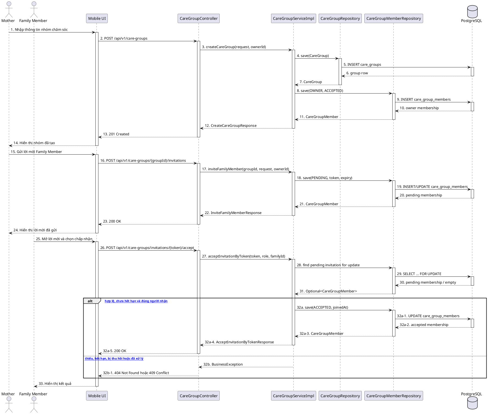

# MF-08 / Spec 01 — Care Group & Invitation Lifecycle

| Field | Value |
| --- | --- |
| Feature | MF-08 — Family Sync & Cooperative Care |
| Use Cases Covered | Create/list care groups; invite/revoke; accept/decline; join request; remove/leave |
| Primary Actor(s) | Mother (Owner), Family Member |
| Platform | Mother Mobile App, Family Mobile App, CareBridge API |
| Main Flow Summary | Mother creates a care group and invites a family member. The authenticated recipient accepts or declines; membership changes are persisted and rechecked on every protected family operation. |
| Grounding (source code) | `family/controller/CareGroupController.java`, `family/service/impl/CareGroupServiceImpl.java`, `family/entity/CareGroup.java`, `family/entity/CareGroupMember.java`, Mobile `features/familySync/services/care_group_service.dart` |

## 1. Tổng quan luồng chính (Main Flow Overview)

Mother tạo `CareGroup` gắn với hành trình mẹ hoặc hồ sơ bé và trở thành `OWNER`. Lời mời được lưu trên `CareGroupMember` ở trạng thái `PENDING`; hệ thống hỗ trợ lời mời trực tiếp và token/deep-link. Người nhận phải đăng nhập trước khi chấp nhận. Ngoài lời mời, Family Member có thể gửi yêu cầu tham gia bằng mã và chờ Mother duyệt. Thu hồi lời mời, xóa thành viên và rời nhóm đều cập nhật membership hiện hữu; quyền truy cập không được suy ra từ token cũ.

## 2. Class Diagram

```plantuml
@startuml MF08_01_CareGroup_ClassDiagram
skinparam classAttributeIconSize 0
class CareGroup {
  +id: UUID
  +ownerUserId: UUID
  +groupName: String
  +linkedJourneyId: UUID
  +linkedBabyProfileId: UUID
  +status: CareGroupStatus
}
class CareGroupMember {
  +id: UUID
  +careGroupId: UUID
  +userId: UUID
  +memberRole: GroupMemberRole
  +inviteStatus: InviteStatus
  +inviteToken: String
  +inviteExpiresAt: Instant
  +permissionJson: String
}
enum GroupMemberRole { OWNER; MEMBER; VIEWER }
enum InviteStatus { PENDING; ACCEPTED; REJECTED; REVOKED; EXPIRED }
class CareGroupController
interface ICareGroupService
class CareGroupServiceImpl
interface CareGroupRepository
interface CareGroupMemberRepository
CareGroup "1" *-- "1..*" CareGroupMember
CareGroupMember --> GroupMemberRole
CareGroupMember --> InviteStatus
CareGroupController --> ICareGroupService
CareGroupServiceImpl ..|> ICareGroupService
CareGroupServiceImpl --> CareGroupRepository
CareGroupServiceImpl --> CareGroupMemberRepository
@enduml
```

**Hình 1 — Class Diagram: Care Group và vòng đời membership**

## 3. Sequence Diagram — Main Flow



**Hình 2 — Sequence Diagram: Tạo nhóm, mời và chấp nhận lời mời**

## 4. Business Rules Applied

- Chỉ Mother/Owner được tạo nhóm, mời, thu hồi, duyệt yêu cầu tham gia và xóa thành viên.
- Mỗi nhóm có đúng một Owner membership ở trạng thái `ACCEPTED`; Owner không rời nhóm bằng luồng thành viên thường.
- Token phải tồn tại, chưa hết hạn, chưa bị thu hồi và chưa được xử lý; replay không được tạo membership thứ hai.
- Thành viên chỉ có quyền sau khi membership là `ACCEPTED`; thu hồi/xóa phải có hiệu lực ở request kế tiếp.
- `linkedJourneyId` và `linkedBabyProfileId` là phạm vi chăm sóc, không phải quyền truy cập độc lập.
