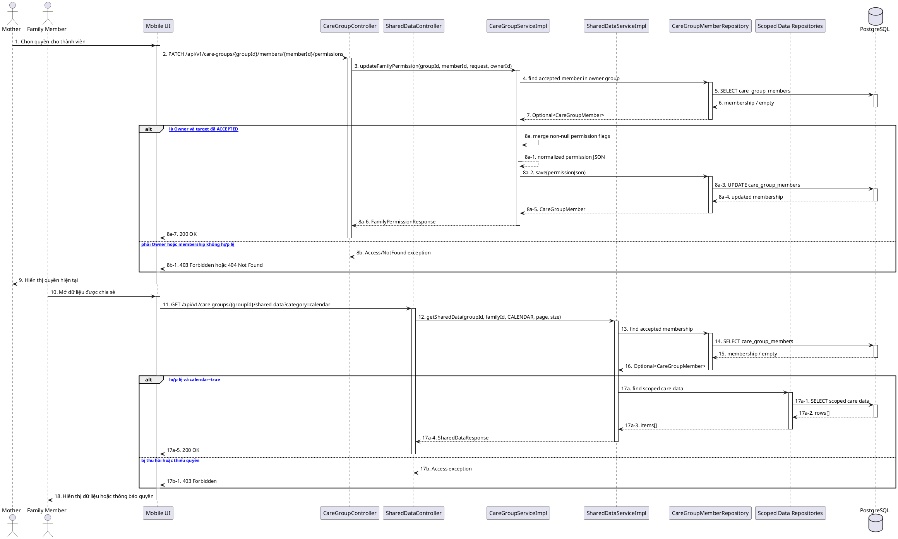

# MF-08 / Spec 02 — Family Permission Scope & Shared Care Visibility

| Field | Value |
| --- | --- |
| Feature | MF-08 — Family Sync & Cooperative Care |
| Use Cases Covered | Update/view family permission; view scoped shared data, quick notes and family alerts |
| Primary Actor(s) | Mother (Owner), Family Member |
| Platform | Mother Mobile App, Family Mobile App, CareBridge API |
| Main Flow Summary | Mother grants granular flags on an accepted membership. Family reads only data allowed by the current membership and category; emergency notification history is account-scoped. |
| Grounding (source code) | `CareGroupController`, `SharedDataController`, `FamilyQuickNoteController`, `FamilyAlertController`, `CareGroupServiceImpl`, `SharedDataServiceImpl`, `CareGroupMember.permissionJson` |

## 1. Tổng quan luồng chính (Main Flow Overview)

Quyền Family được lưu trong `CareGroupMember.permissionJson`, gồm `calendar`, `logs`, `alerts`, `records` và nhóm quyền quick-note chi tiết. Mother cập nhật quyền theo từng membership đã chấp nhận. Khi Family đọc shared data, service nạp lại membership và kiểm tra đúng category tại thời điểm request. `SharedDataController` dùng một endpoint theo `category`; code hiện tại chưa có endpoint calendar độc lập. Lịch sử `family-alerts` đọc notification khẩn cấp theo tài khoản người nhận, không dùng cờ `alerts` của một care group cụ thể.

## 2. Class Diagram

```plantuml
@startuml MF08_02_FamilyPermission_ClassDiagram
skinparam classAttributeIconSize 0
class CareGroupMember { +id: UUID; +careGroupId: UUID; +userId: UUID; +inviteStatus: InviteStatus; +permissionJson: String }
class FamilyPermission <<JSON>> { +calendar: boolean; +logs: boolean; +alerts: boolean; +records: boolean; +quickNotes: boolean; +quickNoteWeight: boolean; +quickNoteHydration: boolean; +quickNoteEpds: boolean; +quickNoteFetalMovement: boolean }
enum SharedDataCategory { CALENDAR; LOGS; ALERTS }
class CareGroupController
class SharedDataController
class FamilyQuickNoteController
class FamilyAlertController
class CareGroupServiceImpl
class SharedDataServiceImpl
class FamilyQuickNoteService
class FamilyAlertServiceImpl
CareGroupMember *-- FamilyPermission
CareGroupController --> CareGroupServiceImpl
SharedDataController --> SharedDataServiceImpl
FamilyQuickNoteController --> FamilyQuickNoteService
FamilyAlertController --> FamilyAlertServiceImpl
SharedDataServiceImpl --> SharedDataCategory
@enduml
```

**Hình 1 — Class Diagram: Permission flags và các read model Family**

## 3. Sequence Diagram — Main Flow



**Hình 2 — Sequence Diagram: Cấp quyền và đọc dữ liệu theo scope hiện tại**

## 4. Business Rules Applied

- Chỉ Owner cập nhật quyền; Owner và chính target member được xem grant hiện tại.
- Trường `null` trong patch giữ nguyên giá trị cũ; quyền quick-note cha và quyền con đều phải thỏa khi đọc dữ liệu nhạy cảm.
- Mọi read phải kiểm tra membership `ACCEPTED` và quyền hiện tại; không cache quyền qua lần thu hồi.
- `SharedDataController` chỉ chấp nhận `calendar`, `logs`, `alerts`; category không hợp lệ trả `400 Bad Request`.
- Code hiện tại có một phần shared-data trả read model rỗng khi nguồn cross-domain chưa được nối; tài liệu không tuyên bố phần này đã hoàn tất.
- `GET /api/v1/family-alerts` là inbox notification theo account, không đồng nghĩa với shared-data category `alerts`.
