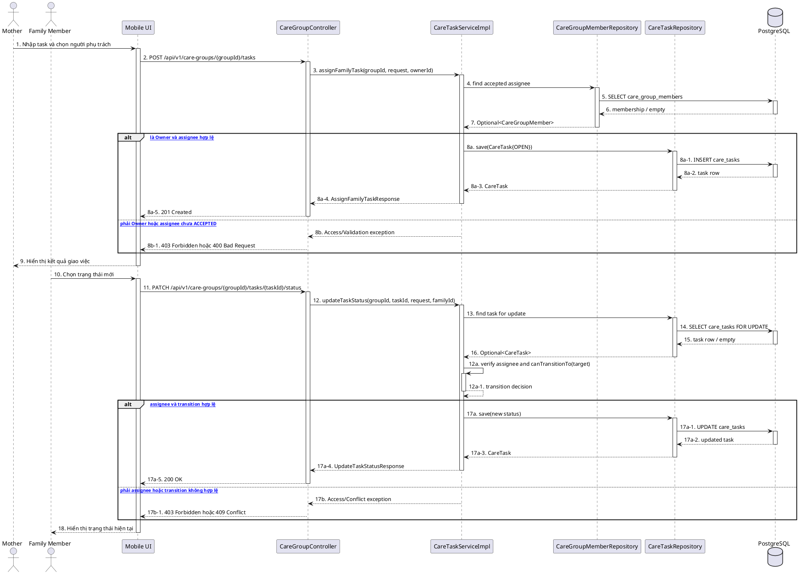

# MF-08 / Spec 03 — Family Care Task Assignment & Status Update

| Field | Value |
| --- | --- |
| Feature | MF-08 — Family Sync & Cooperative Care |
| Use Cases Covered | Assign/list/view/update/cancel family task; assignee updates task status |
| Primary Actor(s) | Mother (Owner), assigned Family Member |
| Platform | Mother Mobile App, Family Mobile App, CareBridge API |
| Main Flow Summary | Mother assigns a task to an accepted member. The assignee updates status through server-enforced transitions; Mother may update content or cancel an incomplete task. |
| Grounding (source code) | `CareGroupController`, `CareTaskServiceImpl`, `family/entity/CareTask.java`, `family/entity/CareTaskStatus.java`, `ICareTaskService` |

## 1. Tổng quan luồng chính (Main Flow Overview)

`family.entity.CareTask` là công việc cộng tác trong care group, khác checklist task và reminder task. Mother tạo task cho một member `ACCEPTED`. Service kiểm tra group ownership, assignee và hạn xử lý trước khi lưu. Chỉ assignee được đổi trạng thái thực hiện; `CareTaskStatus.canTransitionTo()` bảo vệ chuyển trạng thái. Mother có thể sửa nội dung task chưa kết thúc hoặc hủy task chưa hoàn tất.

## 2. Class Diagram

```plantuml
@startuml MF08_03_CareTask_ClassDiagram
skinparam classAttributeIconSize 0
class CareTask { +id: UUID; +careGroupId: UUID; +assignedBy: UUID; +assignedTo: UUID; +title: String; +description: String; +dueAt: Instant; +status: CareTaskStatus; +completedAt: Instant }
enum CareTaskStatus { OPEN; IN_PROGRESS; DONE; CANCELLED; NEEDS_SUPPORT; +canTransitionTo(target): boolean }
class CareGroupController
interface ICareTaskService
class CareTaskServiceImpl
interface CareTaskRepository
interface CareGroupMemberRepository
CareTask --> CareTaskStatus
CareGroupController --> ICareTaskService
CareTaskServiceImpl ..|> ICareTaskService
CareTaskServiceImpl --> CareTaskRepository
CareTaskServiceImpl --> CareGroupMemberRepository
@enduml
```

**Hình 1 — Class Diagram: Family Care Task và transition guard**

## 3. Sequence Diagram — Main Flow



**Hình 2 — Sequence Diagram: Giao việc và cập nhật trạng thái bởi assignee**

## 4. Business Rules Applied

- Chỉ Owner giao, sửa hoặc hủy task; assignee phải là member `ACCEPTED` của cùng group.
- Chỉ `assignedTo` được cập nhật trạng thái thực hiện.
- Transition phải qua `CareTaskStatus.canTransitionTo()`; trạng thái kết thúc không được mở lại tùy ý.
- Task hoàn tất không được hủy; update/cancel phải khóa hoặc kiểm tra lại bản ghi hiện tại để tránh ghi đè cạnh tranh.
- `family.entity.CareTask` không được trộn với `ChecklistTaskInstance` hoặc reminder task.
