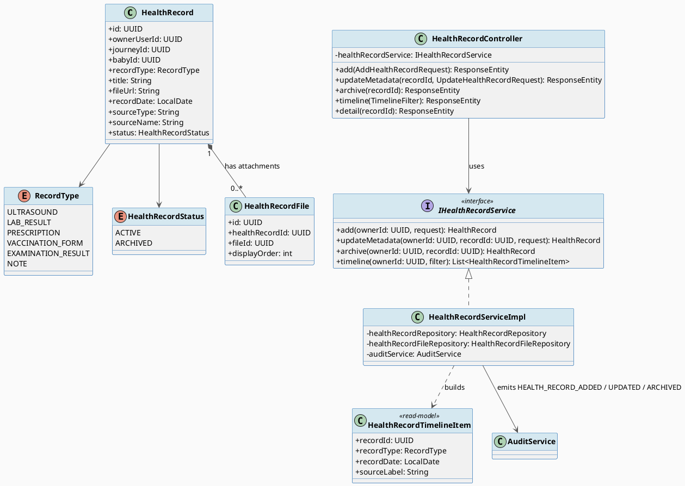
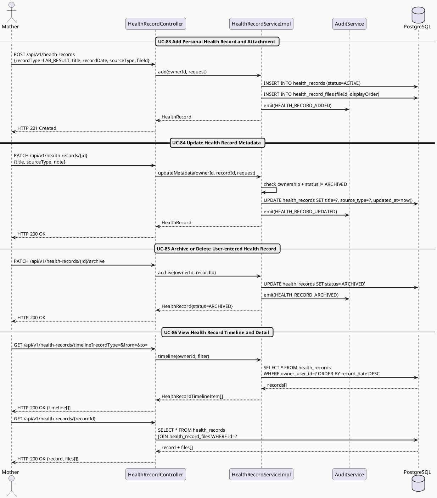
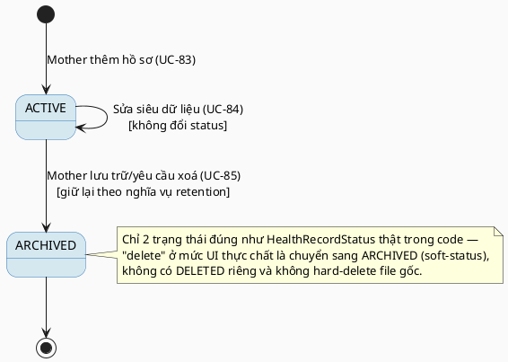

# MF-08 / Spec 01 — Personal Health Record Lifecycle & Timeline

| Field | Value |
| --- | --- |
| Feature | MF-08 — Personal Health Records & Source Labeling |
| Use Cases Covered | UC-83 Add Personal Health Record and Attachment, UC-84 Update Health Record Metadata, UC-85 Archive or Delete User-entered Health Record, UC-86 View Health Record Timeline and Detail |
| Primary Actor(s) | Mother |
| Platform | Mother Mobile App |
| Main Flow Summary | A Mother adds a maternal or baby health record (ultrasound, lab result, prescription, examination result...) with an optional protected attachment and source label, may correct its metadata or archive/delete it later, and reviews all authorized records as a time-ordered, filterable timeline. |
| Grounding (source code) | `health/entity/HealthRecord.java`, `HealthRecordStatus.java`, `RecordType.java`, `DataSource.java`, `health/entity/HealthRecordFile.java`, `health/controller/HealthRecordController.java` (`/api/v1/health-records`) |

## 1. Tổng quan luồng chính (Main Flow Overview)

`HealthRecord` là dữ liệu do người dùng tự nhập (`sourceType`/`sourceName` luôn được gắn
nhãn — BR-PRIVACY/UC-83), có thể gắn 0..n tệp đính kèm bảo vệ qua `HealthRecordFile`
(liên kết tới `file` module dùng chung, không lưu file trực tiếp trong entity này). Mother
có thể sửa siêu dữ liệu (tiêu đề, loại, ngày, nhãn nguồn — UC-84) mà **không đổi file gốc
đã upload trừ khi được phép**, và có thể lưu trữ (`ARCHIVED`) khi hồ sơ không còn theo dõi
tích cực (UC-85) — hệ thống dùng soft-status thay vì xoá cứng để giữ nghĩa vụ lưu trữ.
UC-86 (xem timeline) là read-model tổng hợp record theo thời gian/loại/nguồn với filter
nhúng sẵn (D-02) — không phải entity riêng.

## 2. Class Diagram

**Hình 1 — Class Diagram: Health Record, Attachment & Timeline Read-Model**

## 3. Sequence Diagram — Main Flow

**Hình 2 — Sequence Diagram: Add Record → Update Metadata → Archive → View Timeline/Detail (Main Flow)**

## 4. State Machine — `HealthRecord.status`

**Hình 3 — State Machine: `HealthRecord.status` Lifecycle**

## 5. Business Rules Applied

- BR-RBAC / BR-PRIVACY — chỉ chủ sở hữu (`ownerUserId`) truy cập được, trừ khi có `ConsentGrant`/`DataPermission` hợp lệ (MF-01, MF-08/spec-02).
- UC-84 — chỉ sửa siêu dữ liệu (title/category/date/source/tag/note); **không** thay đổi file gốc trừ khi được phép rõ ràng.
- UC-85 — archive/delete phải tuân thủ nghĩa vụ retention và không phá vỡ bằng chứng đang được chia sẻ hợp lệ.
- UC-86 — timeline chỉ hiển thị record được phép xem, filter (loại/nguồn/khoảng ngày) là điều khiển nhúng, không tách UC riêng (D-02).
