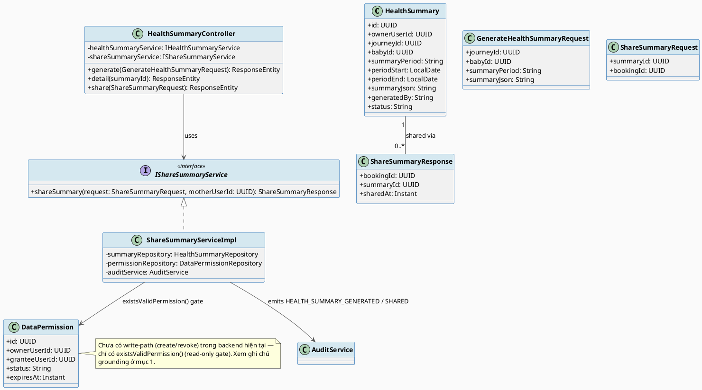
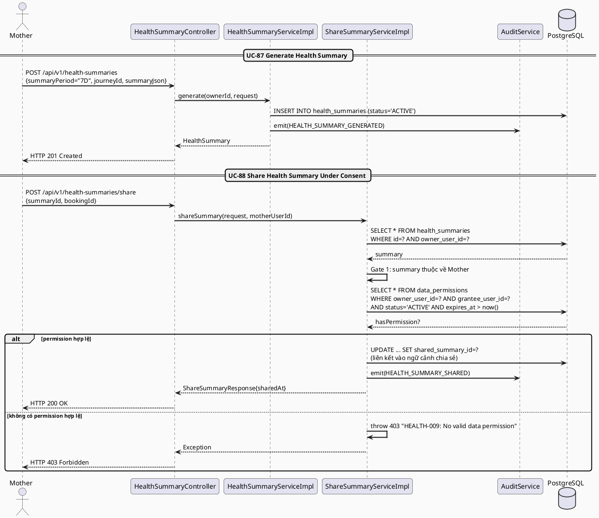
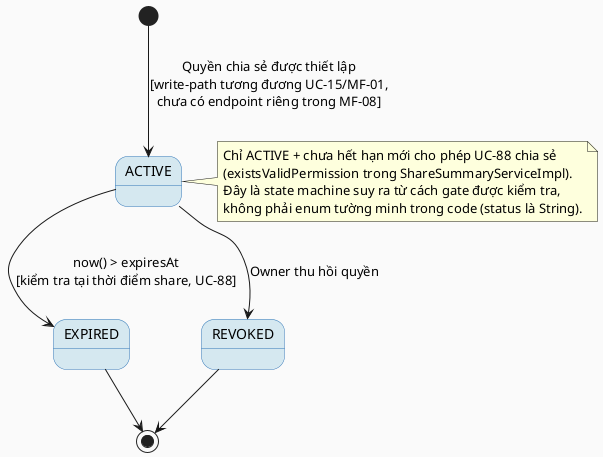

# MF-08 / Spec 02 — Health Summary Generation & Consent-Gated Sharing

| Field | Value |
| --- | --- |
| Feature | MF-08 — Personal Health Records & Source Labeling |
| Use Cases Covered | UC-87 Generate Health Summary, UC-88 Share Health Summary or Selected Records Under Consent |
| Primary Actor(s) | Mother |
| Platform | Mother Mobile App |
| Main Flow Summary | A Mother generates a period-based summary (24h / 7 days / consultation) from her own health records for personal review, then shares that summary with a recipient only when a valid, unexpired data-sharing permission for that recipient already exists — sharing is never implicit. |
| Grounding (source code) | `health/entity/HealthSummary.java`, `health/entity/DataPermission.java`, `health/controller/HealthSummaryController.java` (`/api/v1/health-summaries`), `health/service/impl/ShareSummaryServiceImpl.java` |

## 1. Tổng quan luồng chính (Main Flow Overview)

`HealthSummary` là bản tổng hợp do Mother tự khởi tạo từ các `HealthRecord`/`MaternalHealthMetric`/`PostpartumLog`
đã chọn trong một khoảng thời gian (`summaryPeriod` = `24H`/`7D`/`CONSULTATION`, UC-87).
Việc chia sẻ (UC-88) **luôn bị chặn bởi một `DataPermission` hợp lệ** (`existsValidPermission`
kiểm tra `granteeUserId` + `expiresAt` tại thời điểm chia sẻ) — không có đường nào share
trực tiếp mà bỏ qua permission.

**Ghi chú grounding (khác biệt SRS ↔ code hiện tại):** SRS mô tả UC-88 dùng cơ chế consent
chung của MF-01 (`ConsentGrant`, xem `MF01_Account_Trust_AccesControl/02_...`), nhưng
codebase hiện tại dùng một entity **riêng** `health.entity.DataPermission` (bảng
`data_permissions`, không liên kết trực tiếp với bảng `consent_grants`). Ngoài ra, hiện
tại chỉ tìm thấy **luồng đọc** (`existsValidPermission`) trong service layer — chưa có
endpoint tạo `DataPermission` trong `04_Implement`/backend hiện có; việc cấp quyền này
được cho là sẽ tái sử dụng cơ chế Grant Data Permission (UC-15, MF-01) khi triển khai đầy
đủ. Spec này trình bày đúng những gì code hiện có (gate kiểm tra), và đánh dấu rõ phần
"cần hoàn thiện" thay vì suy đoán một endpoint tạo quyền không có thật.

## 2. Class Diagram

**Hình 1 — Class Diagram: Health Summary & Data Permission Gate**

## 3. Sequence Diagram — Main Flow

**Hình 2 — Sequence Diagram: Generate Summary → Check Permission → Share (Main Flow)**

## 4. State Machine — `DataPermission.status` (gate cho việc chia sẻ)

**Hình 3 — State Machine: `DataPermission.status` (gate điều kiện chia sẻ)**

## 5. Business Rules Applied

- UC-88 — chia sẻ **chỉ** xảy ra qua một permission hợp lệ, có `scope`/`expiry`; không có đường tắt bỏ qua gate.
- BR-PRIVACY — `HealthSummary` là dữ liệu sức khỏe tổng hợp, chỉ chủ sở hữu tạo và kiểm soát việc chia sẻ.
- UC-87 — summary chỉ tổng hợp từ record do chính Mother chọn, không tự động bao gồm toàn bộ lịch sử.
- Khoảng cách hiện tại giữa SRS và code (không có write-path cho `DataPermission`) cần được System Admin/đội phát triển xác nhận trước khi coi UC-88 là "hoàn chỉnh" — xem ghi chú mục 1.
