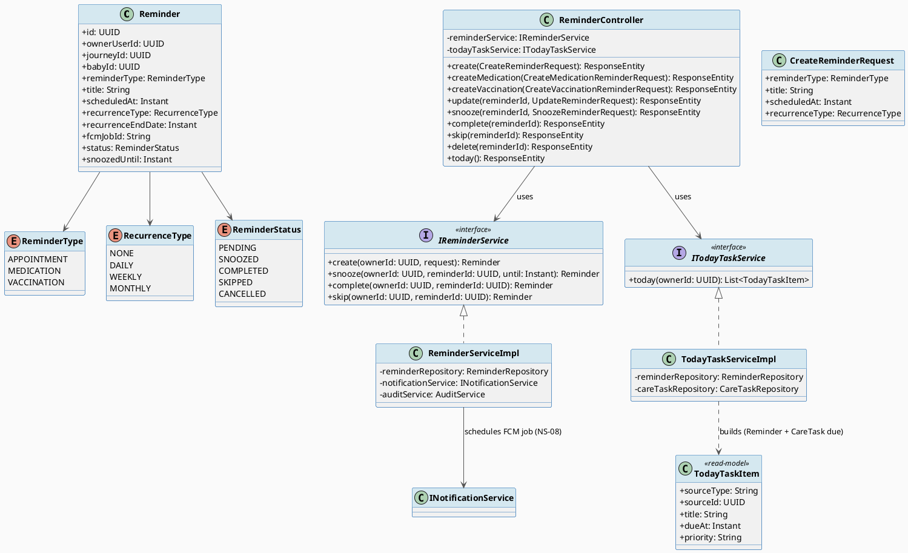
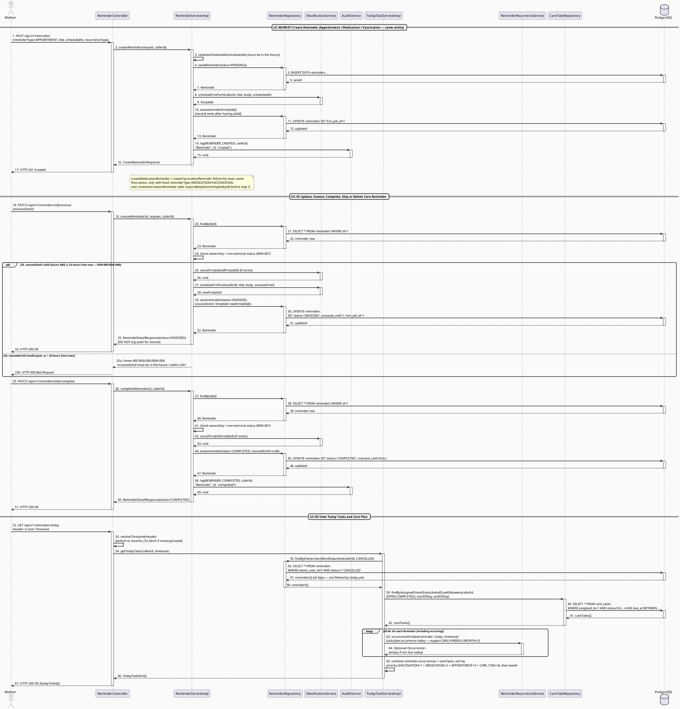
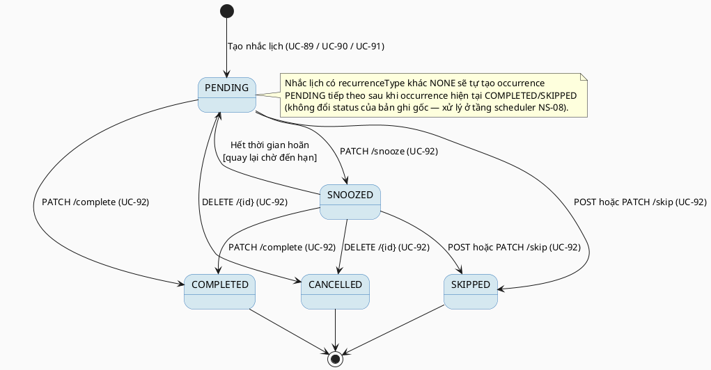

# MF-09 / Spec 01 — Reminder Lifecycle & Today Tasks

| Field | Value |
| --- | --- |
| Feature | MF-09 — Reminders, Tasks & Care Plan |
| Use Cases Covered | UC-89 Create Appointment Reminder, UC-90 Create Medicine or Vitamin Reminder, UC-91 Create Vaccination Reminder, UC-92 Update, Snooze, Complete, Skip or Delete Care Reminder, UC-93 View Today Tasks and Care Plan |
| Primary Actor(s) | Mother |
| Platform | Mother Mobile App |
| Main Flow Summary | A Mother creates a reminder of one of three types (appointment/medication/vaccination) against a single shared `Reminder` entity, manages its lifecycle (snooze/complete/skip/cancel), and views a prioritized "today" view that aggregates due reminders with permitted family tasks. |
| Grounding (source code) | `reminder/entity/Reminder.java`, `ReminderStatus.java`, `ReminderType.java`, `RecurrenceType.java`, `reminder/controller/ReminderController.java` (`/api/v1/reminders`), `reminder/service/impl/TodayTaskServiceImpl.java` |

## 1. Tổng quan luồng chính (Main Flow Overview)

Ba use case tạo nhắc lịch (UC-89/90/91) đều ghi vào **cùng một entity** `Reminder`, chỉ
khác `reminderType` (`APPOINTMENT`/`MEDICATION`/`VACCINATION`) và request DTO đặc thù cho
từng loại (`CreateMedicationReminderRequest`, `CreateVaccinationReminderRequest` gắn thêm
ngữ cảnh liên kết vaccination record của MF-03) — nên được gộp làm một luồng "tạo nhắc
lịch" duy nhất thay vì ba spec riêng. UC-92 quản lý vòng đời chung
(`snooze`/`complete`/`skip`/`cancel`/`enable`) áp dụng như nhau cho cả ba loại. UC-93
("Today Tasks") là read-model tổng hợp `Reminder` đến hạn **và** `CareTask` được giao
đến hạn trong ngày — đây là điểm giao giữa MF-09 và MF-10 (Family Sync), không tạo entity
mới.

## 2. Class Diagram

**Hình 1 — Class Diagram: Reminder (3 loại chung 1 entity) & Today Task Read-Model**

## 3. Sequence Diagram — Main Flow

**Hình 2 — Sequence Diagram: Create Reminder → Manage Lifecycle (Snooze/Complete) → View Today Tasks (Main Flow)**

> **Ghi chú grounding (quan trọng):** Bean thật sự implement `INotificationService` trong
> code hiện tại là `DummyNotificationService` — `scheduleFcmPush(...)` luôn trả về chuỗi
> cố định `"dummy-job-id"` và `cancelFcmJob(...)` là no-op. Nghĩa là pipeline "lên lịch đẩy
> FCM" (NS-08) hiện **chưa có tích hợp thật** với Firebase; toàn bộ lời gọi `Notif` trong
> sơ đồ trên phản ánh đúng cấu trúc code (interface + call sites thật), nhưng hành vi runtime
> hiện tại là stub, không gửi push thông báo thật. `updateReminder` và `snoozeReminder`
> **không** gọi `AuditService` (khác với `createReminder`/`completeReminder`/`skipReminder`/
> `deleteReminder`/`enableReminder` — các hành động này có audit). `snoozeReminder` có ràng
> buộc nghiệp vụ chưa từng được vẽ: `snoozedUntil` phải ở tương lai **và** không được vượt
> quá 24 giờ kể từ hiện tại (`REM-005`/`REM-008`). UC-93 không lọc "hôm nay" bằng SQL date —
> nó lấy **toàn bộ** reminder chưa `CANCELLED` rồi giao cho `ReminderRecurrenceService`
> tính occurrence theo timezone người dùng (hỗ trợ lịch lặp DAILY/WEEKLY/MONTHLY), khác với
> câu `SELECT ... scheduled_at::date = current_date` đơn giản ở bản vẽ cũ.

## 4. State Machine — `Reminder.status`

**Hình 3 — State Machine: `Reminder.status` Lifecycle**

## 5. Business Rules Applied

- BR-RBAC / ownership — chỉ chủ sở hữu (`ownerUserId`) quản lý được reminder của chính họ.
- UC-90/91 — nhắc thuốc/vitamin dựa trên tư vấn chuyên môn trước đó hoặc thói quen cá nhân; nhắc tiêm liên kết `VaccinationRecord` (MF-03) nhưng không thay thế lịch chính thức.
- NS-08 — chỉ nhắc lịch đến hạn mới kích hoạt thông báo được phép (theo `NotificationPreferences`, MF-01).
- UC-93 — "Today Tasks" là công cụ tổ chức cá nhân, không phải kế hoạch điều trị hay đơn thuốc chính thức.
