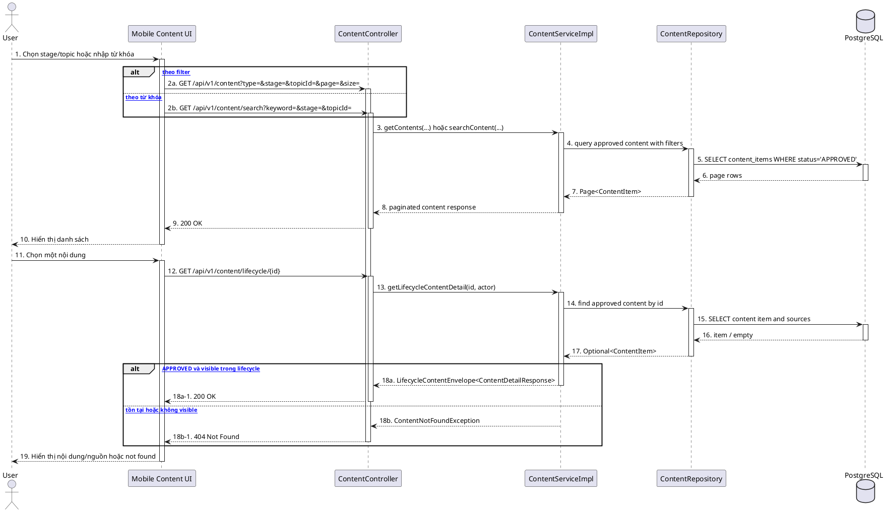

# MF-09 / Spec 01 — Verified Content Browse & Consumption

| Field | Value |
| --- | --- |
| Feature | MF-09 — Verified Content & Checklist Hub |
| Use Cases Covered | Browse/search lifecycle content; view content detail; browse approved checklist templates |
| Primary Actor(s) | Authenticated User |
| Platform | Mobile App, CareBridge API |
| Main Flow Summary | User browses approved articles/FAQ by filter or search, then opens lifecycle-aware detail. Checklist template discovery is exposed separately from assigned checklist execution. |
| Grounding (source code) | `content/controller/ContentController.java`, `content/service/ContentServiceImpl.java`, `content/entity/ContentItem.java`, Mobile `features/community/services/content_service.dart` |

## 1. Tổng quan luồng chính (Main Flow Overview)

`ContentController` cung cấp list, search, lifecycle list/detail và lifecycle checklist endpoints. Article/FAQ consumer flow chỉ trả nội dung đã được duyệt và không tiết lộ draft qua detail. Template checklist nhìn thấy trong Hub là nội dung nguồn; việc phân phối thành `ChecklistInstance`, Current Checklist, action và history thuộc Spec 03. Tìm kiếm là endpoint `/search`, không phải tham số keyword của endpoint list.

## 2. Class Diagram

```plantuml
@startuml MF09_01_ContentBrowse_ClassDiagram
skinparam classAttributeIconSize 0
class ContentItem { +id: UUID; +type: ContentType; +title: String; +body: String; +stage: ContentStage; +topicId: UUID; +status: ContentStatus; +versionNo: Integer; +publishedAt: Instant }
class ContentSource { +title: String; +url: String; +publisher: String }
class ChecklistTemplate { +id: UUID; +templateLineageId: UUID; +templateVersionId: UUID; +name: String; +stage: ContentStage; +status: ChecklistTemplateStatus; +distributionEnabled: boolean }
enum ContentStatus { DRAFT; PENDING_REVIEW; APPROVED; ARCHIVED }
enum ChecklistTemplateStatus { DRAFT; PENDING_REVIEW; APPROVED; ARCHIVED }
class ContentController
interface ContentService
class ContentServiceImpl
interface ContentRepository
interface ChecklistTemplateRepository
ContentItem "1" *-- "0..*" ContentSource
ContentItem --> ContentStatus
ChecklistTemplate --> ChecklistTemplateStatus
ContentController --> ContentService
ContentServiceImpl ..|> ContentService
ContentServiceImpl --> ContentRepository
ContentServiceImpl --> ChecklistTemplateRepository
@enduml
```

**Hình 1 — Class Diagram: Verified content và checklist template consumer view**

## 3. Sequence Diagram — Main Flow



**Hình 2 — Sequence Diagram: Browse/search và xem chi tiết verified content**

## 4. Business Rules Applied

- Consumer chỉ thấy content `APPROVED`; draft/pending/archived không được lộ qua detail.
- Search bắt buộc keyword hợp lệ và được sanitize; filter stage/topic/type phải dùng enum/identifier hợp lệ.
- Lifecycle endpoint có thể thêm envelope ngữ cảnh nhưng không thay đổi nội dung nguồn đã duyệt.
- Checklist template discovery không đồng nghĩa checklist đã được phân phối cho người dùng; xem Spec 03.
- Nội dung có nguồn và cảnh báo phù hợp, không thay thế chẩn đoán hoặc tư vấn y khoa.
