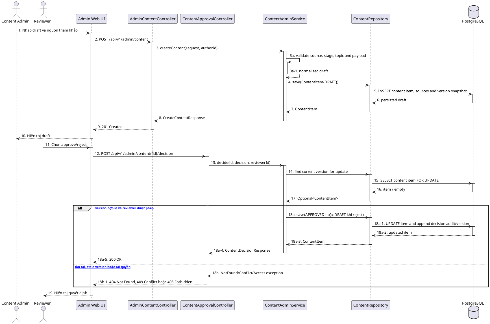

# MF-09 / Spec 02 — Content & Checklist Template Authoring, Review and Publishing

| Field | Value |
| --- | --- |
| Feature | MF-09 — Verified Content & Checklist Hub |
| Use Cases Covered | Create/update/version/review/approve/archive content and checklist templates |
| Primary Actor(s) | Content Admin, System Admin/Reviewer |
| Platform | Web Admin Portal, CareBridge API |
| Main Flow Summary | Staff creates a draft with sources, submits or updates it, and an authorized reviewer approves/rejects the version. Only approved versions become consumer-visible/distributable. |
| Grounding (source code) | `AdminContentController`, `ContentApprovalController`, `ContentUnpublishController`, `AdminChecklistTemplateController`, `ChecklistTemplateApprovalController`, Web `features/contentManagement` |

## 1. Tổng quan luồng chính (Main Flow Overview)

Article/FAQ và checklist template có pipeline quản trị tương tự nhưng là hai aggregate riêng. Content dùng `ContentItem` và decision endpoint `/api/v1/admin/content/{id}/decision`. Checklist template có lineage/version, review/approve/activate endpoint dưới `/api/v1/admin/checklist-templates`. Archive không xóa lịch sử phiên bản. Template chỉ được phân phối khi phiên bản phù hợp đã approved/active và `distributionEnabled=true`.

## 2. Class Diagram

```plantuml
@startuml MF09_02_ContentLifecycle_ClassDiagram
skinparam classAttributeIconSize 0
class ContentItem { +id: UUID; +title: String; +body: String; +status: ContentStatus; +versionNo: Integer; +authorUserId: UUID; +publishedAt: Instant }
class ContentSource { +title: String; +url: String; +publisher: String }
class ChecklistTemplate { +id: UUID; +templateLineageId: UUID; +templateVersionId: UUID; +status: ChecklistTemplateStatus; +distributionEnabled: boolean; +versionNo: Integer }
class ChecklistItem { +id: UUID; +templateId: UUID; +title: String; +displayOrder: Integer; +required: boolean }
enum ContentDecision { APPROVE; REJECT }
class AdminContentController
class ContentApprovalController
class AdminChecklistTemplateController
class ChecklistTemplateApprovalController
class ContentAdminService
interface ContentRepository
interface ChecklistTemplateRepository
ContentItem "1" *-- "0..*" ContentSource
ChecklistTemplate "1" *-- "1..*" ChecklistItem
AdminContentController --> ContentAdminService
ContentApprovalController --> ContentAdminService
AdminChecklistTemplateController --> ContentAdminService
ChecklistTemplateApprovalController --> ContentAdminService
ContentAdminService --> ContentRepository
ContentAdminService --> ChecklistTemplateRepository
@enduml
```

**Hình 1 — Class Diagram: Authoring và review cho content/checklist template**

## 3. Sequence Diagram — Main Flow



**Hình 2 — Sequence Diagram: Tạo draft và quyết định review**

## 4. Business Rules Applied

- Tạo/sửa content và checklist template yêu cầu role quản trị tương ứng; review yêu cầu quyền reviewer.
- Approval áp dụng cho đúng version hiện hành; stale decision không được ghi đè phiên bản mới.
- Archive/unpublish giữ lịch sử và loại item khỏi consumer/distribution, không hard-delete aggregate.
- Checklist template version đã dùng để phân phối là snapshot tham chiếu; sửa nội dung tạo/clone version mới.
- `distributionEnabled` chỉ có hiệu lực cùng trạng thái review/activation hợp lệ.
