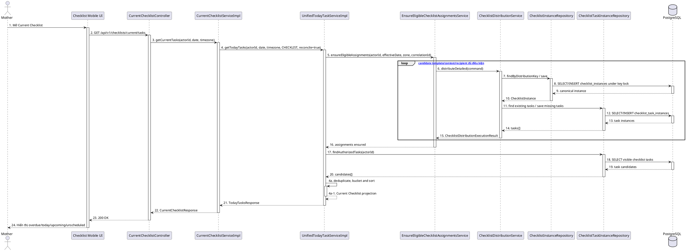

# MF-09 / Spec 03 — Checklist Distribution, Current Checklist & History

| Field | Value |
| --- | --- |
| Feature | MF-09 — Verified Content & Checklist Hub |
| Use Cases Covered | Materialize eligible lifecycle checklists; view current checklist; complete/reopen a task; view checklist history |
| Primary Actor(s) | Mother, authorized Family Member |
| Platform | Mother Mobile App, Family Mobile App, CareBridge API |
| Main Flow Summary | Approved lifecycle templates are reconciled into idempotent checklist instances/tasks. Current Checklist returns authorized buckets; actions mutate one task idempotently; terminal/obsolete instances move to history. |
| Grounding (source code) | `checklist/distribution/*`, `CurrentChecklistController`, `CurrentChecklistServiceImpl`, `UnifiedTodayTaskServiceImpl`, `UnifiedTaskActionFacade`, `ChecklistHistoryController`, `ChecklistHistoryService`, Mobile `features/checklist` |

## 1. Tổng quan luồng chính (Main Flow Overview)

Đây là bounded context triển khai thật, tách khỏi việc chỉ đọc template ở Spec 01. Khi Mother đọc Current Checklist, `UnifiedTodayTaskServiceImpl` gọi `EnsureEligibleChecklistAssignmentsService` để materialize template đủ điều kiện và `ChecklistHistoryReconciliationService` để đưa instance hết vòng đời sang history. Distribution key và task key bảo đảm idempotency. Kết quả được nhóm `overdue/today/upcoming/unscheduled`. Endpoint action của checklist chỉ chấp nhận `COMPLETE` và `REOPEN`. Family có thể đọc current checklist theo care-group permission nhưng không kích hoạt owner reconciliation; history cá nhân hiện yêu cầu role Mother.

## 2. Class Diagram

```plantuml
@startuml MF09_03_ChecklistRuntime_ClassDiagram
skinparam classAttributeIconSize 0
class ChecklistTemplate { +templateLineageId: UUID; +templateVersionId: UUID; +stage: ContentStage; +distributionEnabled: boolean }
class ChecklistInstance { +id: UUID; +distributionKey: String; +recipientUserId: UUID; +careGroupId: UUID; +careContextType: ChecklistCareContextType; +careContextId: UUID; +origin: ChecklistOrigin; +status: ChecklistInstanceStatus; +historicalAt: Instant }
class ChecklistTaskInstance { +id: UUID; +checklistInstanceId: UUID; +taskKey: String; +titleSnapshot: String; +targetSubject: ChecklistTargetSubject; +dueAt: Instant; +status: ChecklistTaskStatus }
class CurrentChecklistController
class CurrentChecklistServiceImpl
class UnifiedTodayTaskServiceImpl
class EnsureEligibleChecklistAssignmentsService
class ChecklistDistributionService
class UnifiedTaskActionFacade
class ChecklistHistoryController
class ChecklistHistoryService
ChecklistTemplate "1" --> "0..*" ChecklistInstance : materializes
ChecklistInstance "1" *-- "1..*" ChecklistTaskInstance
CurrentChecklistController --> CurrentChecklistServiceImpl
CurrentChecklistServiceImpl --> UnifiedTodayTaskServiceImpl
UnifiedTodayTaskServiceImpl --> EnsureEligibleChecklistAssignmentsService
EnsureEligibleChecklistAssignmentsService --> ChecklistDistributionService
CurrentChecklistController --> UnifiedTaskActionFacade
ChecklistHistoryController --> ChecklistHistoryService
@enduml
```

**Hình 1 — Class Diagram: Template distribution và checklist runtime**

## 3. Sequence Diagram — Main Flow



**Hình 2 — Sequence Diagram: Reconcile distribution và đọc Current Checklist**

## 4. Business Rules Applied

- Chỉ template/version đủ điều kiện lifecycle, visible, approved/active và bật distribution mới được materialize.
- `distributionKey` và `taskKey` là duy nhất; chạy lại reconciliation phải trả instance/task canonical, không nhân đôi.
- Permission Family được kiểm tra theo membership hiện tại; Family read không được tự materialize dữ liệu owner.
- Current Checklist chỉ gồm task `CHECKLIST`, được bucket theo timezone; task `CANCELLED` không hiển thị.
- Action endpoint checklist chỉ nhận `COMPLETE`/`REOPEN`, có idempotency/correlation và kiểm tra lại quyền trong transaction.
- History giữ snapshot template/task, phân trang và lọc target subject; endpoint history cá nhân hiện chỉ cho Mother.
